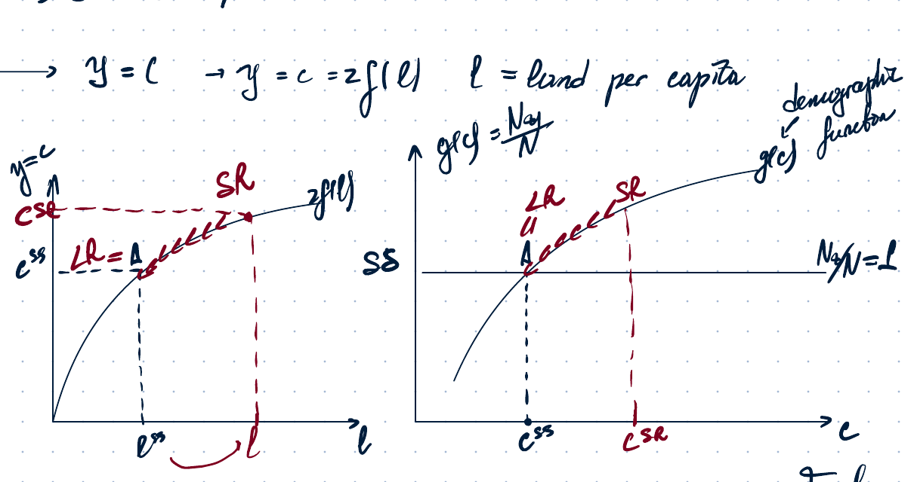
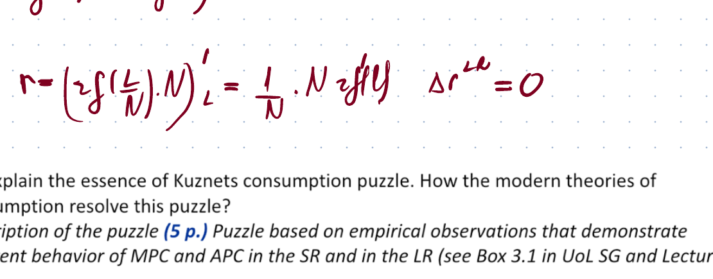
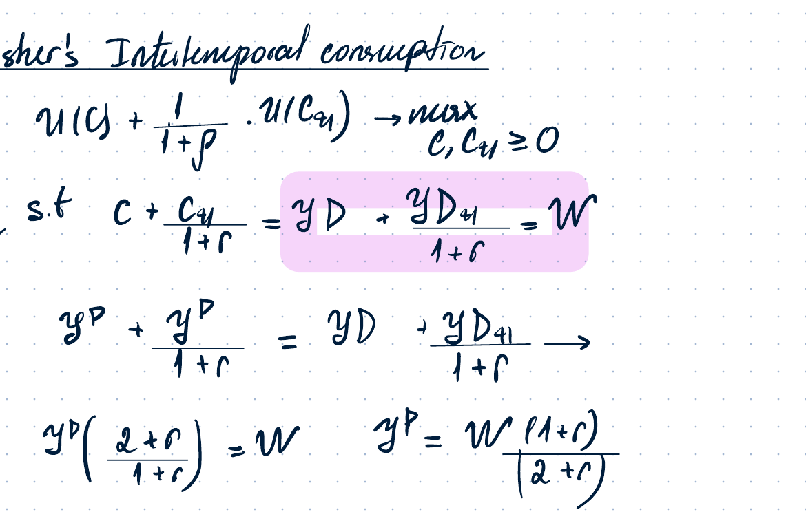
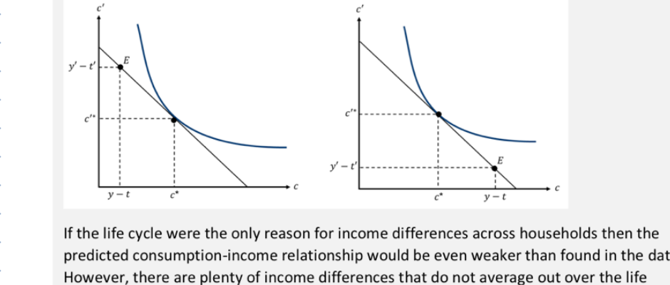
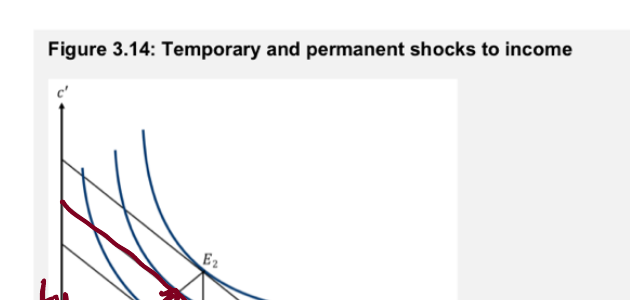
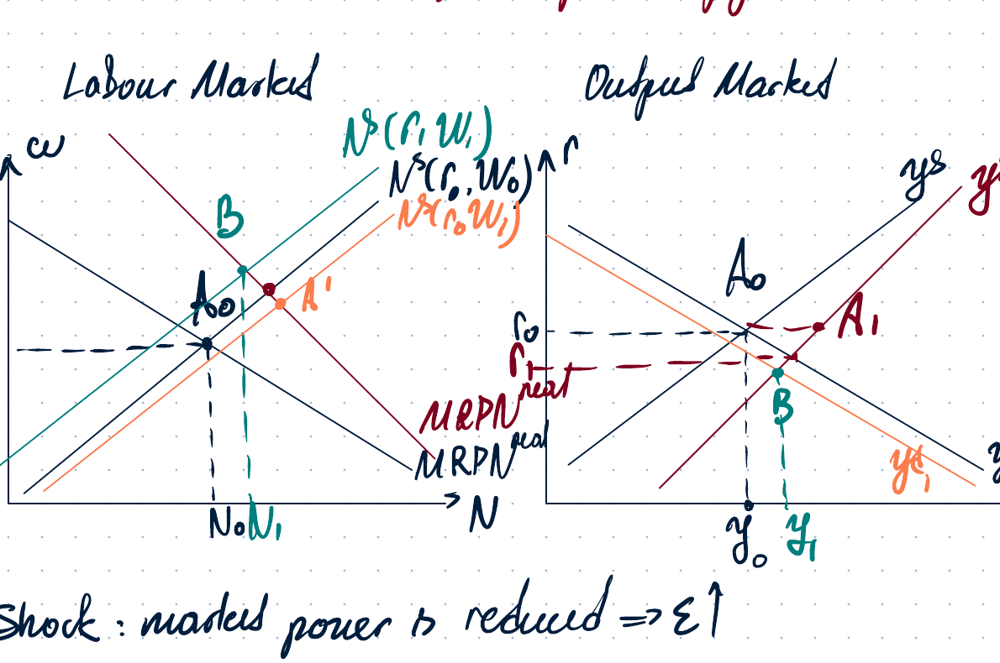
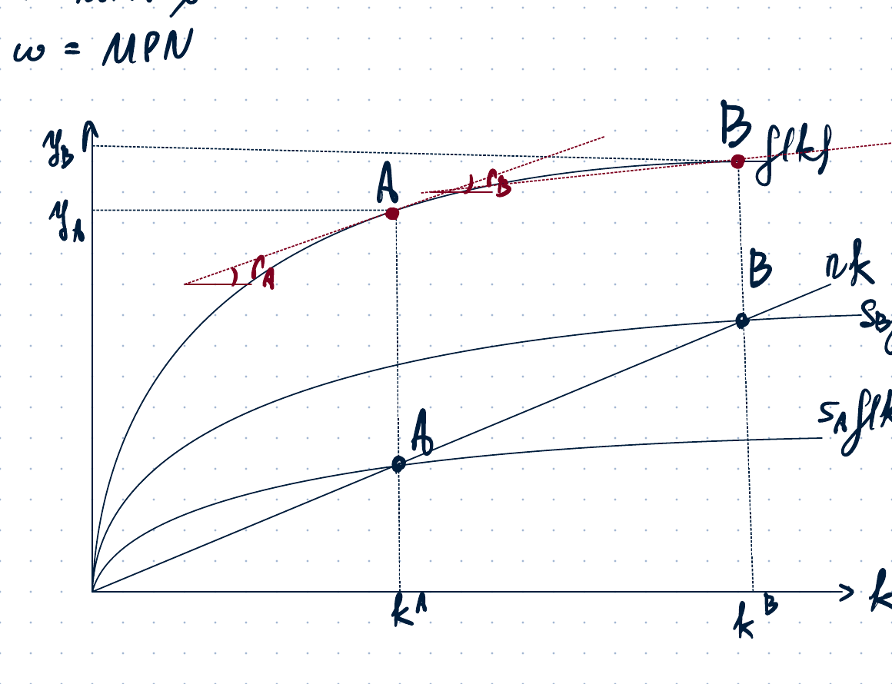
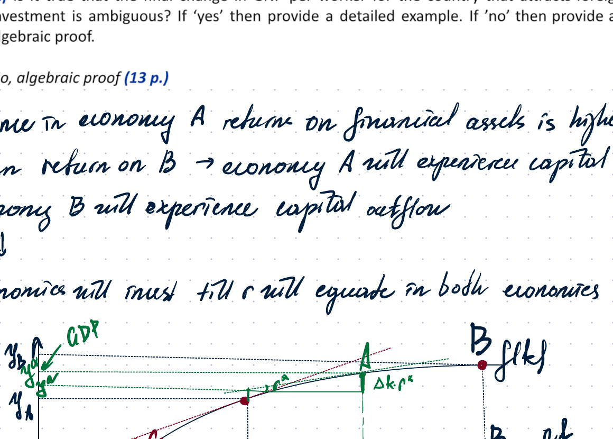

# Macro 2 - 2026 Final 4th Year

## 1. Short questions

### 1(a). Malthusian model and land scarcity

**Question.** According to the Malthusian model, since low income per worker is the result of scarcity of land, a country with a larger land mass will have higher living standards, even in the long run. True or false?

**Answer: false.**

The Malthusian setup used in the notes is:

$$
Y=zF(L,N),
$$

where $L$ is land and $N$ is population. Per-capita output/consumption can be written as:

$$
y=c=zf(\ell), \qquad \ell=\frac{L}{N}.
$$

Here $\ell$ is land per capita.

In the **short run**, if land increases while population is initially fixed:

$$
L\uparrow \Rightarrow \ell=\frac{L}{N}\uparrow \Rightarrow zf(\ell)\uparrow \Rightarrow y=c\uparrow.
$$

So living standards rise temporarily.

The graph shows two equivalent ways to represent the result. In the first graph, more land shifts the economy from the old long-run point $A$ to a short-run point with higher $c$. In the second graph, this is shown through the demographic function $g(c)$: higher consumption creates population growth.

The handwritten notes also mention effects that were **not asked** in the question:

$$
w=MP_N=zF_N'(N,L),
$$

so when $L$ rises, labour becomes relatively scarcer and the wage tends to rise in the short run. Land rent is:

$$
r=MP_L=zF_L'(N,L),
$$

so land becomes relatively less scarce and land rent tends to fall.

In the **long run**, higher consumption improves nutrition and health, increases fertility, reduces mortality, and population rises:

$$
c\uparrow \Rightarrow \text{better nutrition and health} \Rightarrow \text{fertility}\uparrow,\ \text{mortality}\downarrow \Rightarrow N\uparrow.
$$

Population rises until the economy reaches the new Malthusian steady state, where the demographic condition again pins down the same long-run consumption level:

$$
g(c)=1.
$$

The reason living standards return to the same level is:

- land is fixed after the initial increase;
- marginal product of labour is diminishing;
- population adjusts until land per capita returns to the long-run level implied by the demographic equilibrium.

So, with identical production and demographic functions, a larger land mass raises population in the long run, not living standards.

A useful expression from the notes is that the real wage can be written as:

$$
w=MP_N=z\left[f(\ell)-\ell f'(\ell)\right].
$$

The return to land is:

$$
r=MP_L=zf'(\ell).
$$

Since the long-run equilibrium pins down the same $c$ and therefore the same $\ell$, the long-run wage and living standards return to the same steady-state level. The country with more land has a larger population, not permanently higher income per worker.

---

### 1(b). Kuznets consumption puzzle

**Question.** Explain the essence of the Kuznets consumption puzzle. How do modern theories of consumption resolve this puzzle?

The puzzle is based on two different empirical observations.

In **cross-sectional data** over households, consumption rises with current disposable income, but less than one-for-one. This looks close to the Keynesian consumption function:

$$
C=C_0+mpc \cdot Y^D,
$$

where:

$$
MPC=\frac{\partial C}{\partial Y^D}<1,
$$

and the average propensity to consume is:

$$
APC=\frac{C}{Y^D}=\frac{C_0}{Y^D}+mpc.
$$

Therefore, in cross-sectional data, $APC$ appears to be decreasing as income rises.

In **long-run time-series data**, aggregate consumption and aggregate income grow roughly proportionally. This implies:

$$
APC \approx \text{constant}, \qquad MPC \approx 1.
$$

This is the Kuznets puzzle: the simple Keynesian consumption function fits the cross-section but predicts a falling $APC$ over time, while long-run aggregate data show a stable $APC$.

The notes resolve this using Fisher's intertemporal consumption model, which is the basis for the Permanent Income Hypothesis and the Life-Cycle Hypothesis.

The household solves:

$$
\max_{c,c_{+1}} u(c)+\frac{1}{1+\rho}u(c_{+1})
$$

subject to the lifetime budget constraint:

$$
c+\frac{c_{+1}}{1+r}=y^D+\frac{y^D_{+1}}{1+r}=W.
$$

Assume $\rho=r$. Then the Euler condition implies:

$$
MRS=1+r,
$$

and with identical utility across periods:

$$
u'(c)=u'(c_{+1}) \Rightarrow c=c_{+1}.
$$

Substitute this into the budget constraint:

$$
c+\frac{c}{1+r}=y^D+\frac{y^D_{+1}}{1+r}.
$$

Thus:

$$
c^*=\frac{1+r}{2+r}\left(y^D+\frac{y^D_{+1}}{1+r}\right).
$$

This gives different predictions for temporary and permanent income changes.

For a **temporary current-income shock**, only $y^D$ changes:

$$
MPC^{SR}=\frac{\partial c^*}{\partial y^D}=\frac{1+r}{2+r}<1.
$$

So current consumption responds by less than current income.

For a **permanent income shock**, both $y^D$ and $y^D_{+1}$ rise together:

$$
MPC^{LR}=\frac{\partial c^*}{\partial y^p}=\frac{1+r}{2+r}+\frac{1}{2+r}=1.
$$

So long-run consumption rises one-for-one with permanent income, and $APC$ is constant.

The Life-Cycle Hypothesis also explains why cross-sectional data may show low $APC$ among high-income households and high $APC$ among low-income households. Current income differs over the life cycle: young and old households often have lower current income, while middle-aged households have higher current income. However, households smooth consumption over lifetime resources.

Temporary shocks also matter. A temporary income shock moves the endowment point mostly horizontally, while a permanent shock moves it more proportionally. Therefore, temporary income differences generate a weaker consumption response than permanent income differences.

So the puzzle is resolved by distinguishing:

$$
\text{current income} \neq \text{permanent/lifetime income}.
$$

Cross-sectional income differences often include temporary and life-cycle components, so $MPC<1$ and $APC$ falls with current income. Long-run aggregate income growth is closer to permanent income growth, so $MPC\approx 1$ and $APC$ is roughly constant.

---

### 1(c). Sovereign default with limited commitment

**Question.** Use the sovereign default model with limited commitment to analyze the claim: *A country is better off if the penalty for defaulting on foreign debts is low.*

**Answer: false.**

The notes refer to the open-economy sovereign default model. A low penalty for default is not necessarily good for the country. The penalty works as a commitment device. If the default penalty is high enough, lenders believe repayment is credible and are willing to lend. If the penalty is too low, the country has a stronger incentive to default, so lenders restrict lending or refuse to lend.

In the model, the limited-commitment constraint has the form:

$$
\text{utility from repaying} \geq \text{utility from defaulting}.
$$

Equivalently, the amount of debt that can be issued is constrained by the default penalty/collateral value. A lower default penalty tightens this constraint:

$$
\nu \downarrow \Rightarrow \text{limited-commitment constraint tightens} \Rightarrow \text{borrowing capacity falls}.
$$

If the economy wanted to borrow in order to smooth consumption, a lower penalty can make it worse off because it loses access to borrowing. Thus the claim is not generally true.

A precise way to state the result:

- If the limited-commitment constraint is **not binding**, lowering the penalty may have no immediate effect.
- If the limited-commitment constraint is **binding**, lowering the penalty reduces feasible borrowing and can reduce welfare.
- Therefore, the statement that a country is always better off with a low default penalty is false.

---

## 2. Real GE model with market power in the output market

### 2(a). Effect of market power on output supply

**Question.** Suppose that in a real intertemporal general-equilibrium model firms are price makers in the output market but price takers in the input market. Explain the effect on the output supply curve.

This is **not** a New Keynesian model. It is a real GE model with market power. A New Keynesian model would require sticky prices; here the point is only imperfect competition in the output market.

The production function is:

$$
y=zF(K,N),
$$

where $z$ and $K$ are exogenous, and $N$ is determined in the labour market.

With perfect competition in the output market, labour demand is determined by:

$$
w=MP_N.
$$

With market power, firms choose output taking into account that price falls when output rises. The real marginal revenue product of labour is below the marginal product of labour:

$$
MRP_N^{real}=\left(1-\frac{1}{\varepsilon}\right)MP_N,
$$

where $\varepsilon$ is the elasticity of demand faced by the firm. The labour-demand condition becomes:

$$
w=\left(1-\frac{1}{\varepsilon}\right)MP_N.
$$

Since:

$$
0<1-\frac{1}{\varepsilon}<1,
$$

the real marginal revenue product is below $MP_N$. Therefore, compared with perfect competition, firms hire less labour at each wage. Employment and output are inefficiently low.

Output supply is:

$$
y^s=zF(K,N).
$$

Since $N$ is lower under market power, output supply is also lower.

---

### 2(b). Reduction in market power

**Question.** Suppose market power is reduced due to institutional reforms. Use labour and output market diagrams to analyze the effects. Assume wealth effects are small but not zero.

A reduction in market power means that firms face a more elastic demand curve:

$$
\varepsilon \uparrow.
$$

Then:

$$
\left(1-\frac{1}{\varepsilon}\right)\uparrow,
$$

so the real marginal revenue product rises:

$$
MRP_N^{real}=\left(1-\frac{1}{\varepsilon}\right)MP_N \uparrow.
$$

Labour demand shifts right because firms want to hire more workers. In the notes, it is also drawn as becoming steeper.

Labour supply also shifts right in the notes because lower market power reduces monopoly profits and dividends. Household wealth falls, and if leisure is a normal good, households consume less leisure and supply more labour:

$$
\text{profits}\downarrow \Rightarrow \text{dividends}\downarrow \Rightarrow \text{wealth}\downarrow \Rightarrow \ell\downarrow \Rightarrow N^s\uparrow.
$$

Therefore employment rises:

$$
N\uparrow.
$$

Output supply rises because employment rises:

$$
y^s=zF(K,N)\uparrow.
$$

The output-demand curve is:

$$
y^d=C+I+G.
$$

Lower monopoly profits reduce wealth and consumption, so output demand shifts left:

$$
\text{profits}\downarrow \Rightarrow C\downarrow \Rightarrow y^d\downarrow.
$$

The notes show the direct supply-side effect as dominant: employment and output rise. The equilibrium interest rate adjusts in the output market. Since output supply shifts right and output demand shifts left, the real interest rate tends to fall.

Final effects in the notes:

$$
\varepsilon\uparrow \Rightarrow MRP_N^{real}\uparrow \Rightarrow N^d\uparrow,
$$

$$
\text{profits}\downarrow \Rightarrow \text{wealth}\downarrow \Rightarrow N^s\uparrow,
$$

$$
N\uparrow \Rightarrow y^s\uparrow,
$$

while:

$$
C\downarrow \Rightarrow y^d\downarrow.
$$

---

## 3. Solow economies, saving rates, and foreign investment

### 3(a). Closed economies with different saving rates

**Question.** Consider two economies $A$ and $B$ described by the Solow model. They have the same technology with no technological progress and $TFP=1$. They have the same depreciation rate and population growth rate, but economy $A$ has a saving rate two times lower than economy $B$. All markets are perfectly competitive. Use one graph to show the current position of each economy in terms of GDP per capita and the corresponding interest rate.

The notes state:

$$
s_B=2s_A,
$$

with the same $n$, $\delta$, and production function.

In the Solow steady state:

$$
sf(k)=(n+\delta)k.
$$

For economy $A$:

$$
s_A f(k_A)=(n+\delta)k_A.
$$

For economy $B$:

$$
s_B f(k_B)=(n+\delta)k_B.
$$

Since $s_B>s_A$, the saving curve of $B$ lies above the saving curve of $A$, so:

$$
k_B>k_A.
$$

Therefore:

$$
y_B=f(k_B)>f(k_A)=y_A.
$$

With perfectly competitive markets, the real interest rate is tied to the marginal product of capital:

$$
r=MP_K-\delta
$$

or, ignoring depreciation in the notation used in some notes:

$$
r=MP_K.
$$

Because $f''(k)<0$, a higher capital stock implies a lower marginal product of capital:

$$
k_B>k_A \Rightarrow MPK_B<MPK_A \Rightarrow r_B<r_A.
$$

So economy $B$ has higher GDP per worker but a lower return on capital. Economy $A$ has lower GDP per worker but a higher return on capital.

---

### 3(b). Opening to foreign investment

**Question.** Suppose both economies open up to foreign investment and these are the only two economies in the world. Foreign investors can earn a return equal to MPK per unit invested. Produce a graph and compare the resulting levels of GDP per worker and GNP per worker.

Since economy $A$ initially has less capital, its marginal product of capital is higher:

$$
r_A>r_B.
$$

Therefore, after opening to foreign investment:

$$
\text{capital flows from }B\text{ to }A.
$$

Economy $A$ experiences capital inflow, and economy $B$ experiences capital outflow. The process continues until the returns are equalized:

$$
r_A=r_B=r^*.
$$

For the capital-importing country $A$, GDP per worker rises because more capital is used in production:

$$
y_A^{GDP,new}=f(k_A+\Delta k)>f(k_A).
$$

However, some of this output must be paid to foreign owners of capital. Therefore GNP is:

$$
y_A^{GNP,new}=f(k_A+\Delta k)-\Delta k\cdot r^*.
$$

For the capital-exporting country $B$, GDP per worker falls because less capital is used domestically:

$$
y_B^{GDP,new}=f(k_B-\Delta k)<f(k_B).
$$

But economy $B$ receives factor payments from abroad, so its GNP is:

$$
y_B^{GNP,new}=f(k_B-\Delta k)+\Delta k\cdot r^*.
$$

The notes summarize this as:

$$
GNP=GDP-\text{factor payments to foreigners}+\text{factor payments from abroad}.
$$

Thus:

- country $A$ has higher GDP after capital inflow, but part of the income belongs to foreign investors;
- country $B$ has lower GDP after capital outflow, but receives income from its foreign investment;
- returns are equalized across countries in the new equilibrium.

---

### 3(c). Is the change in GNP for the capital-importing country ambiguous?

**Question.** Is it true that the final change in GNP per worker for the country that attracts foreign investment is ambiguous?

**Answer: no.**

For the capital-importing economy $A$, new GNP per worker is:

$$
y_A^{GNP,new}=f(k_A+\Delta k)-\Delta k\cdot r^*.
$$

Since investors are paid the marginal product of capital at the new capital stock:

$$
r^*=f'(k_A+\Delta k),
$$

we can write:

$$
y_A^{GNP,new}=f(k_A+\Delta k)-\Delta k\cdot f'(k_A+\Delta k).
$$

Initial GNP is:

$$
y_A^{GNP,old}=f(k_A).
$$

To check whether GNP rises with the amount of foreign capital, differentiate with respect to $\Delta k$:

$$
\frac{\partial}{\partial \Delta k}\left[f(k_A+\Delta k)-\Delta k f'(k_A+\Delta k)\right]
$$

$$
=f'(k_A+\Delta k)-f'(k_A+\Delta k)-\Delta k f''(k_A+\Delta k)
$$

$$
=-\Delta k f''(k_A+\Delta k)>0,
$$

because:

$$
f''(k)<0.
$$

Therefore, for the country attracting foreign investment, the change in GNP is positive, not ambiguous:

$$
\Delta y_A^{GNP}>0.
$$

The intuition is that foreign investors are paid the marginal product of the last unit of capital, while inframarginal units produce more than this marginal return because of diminishing returns. The capital-importing country keeps the surplus on inframarginal capital.
