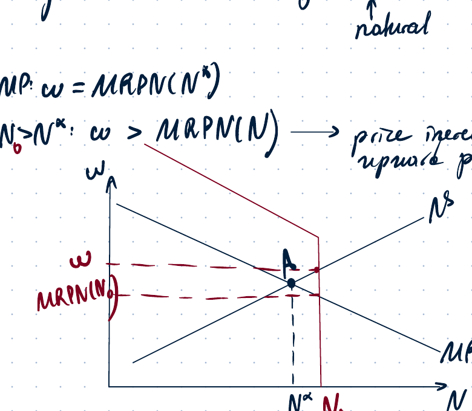
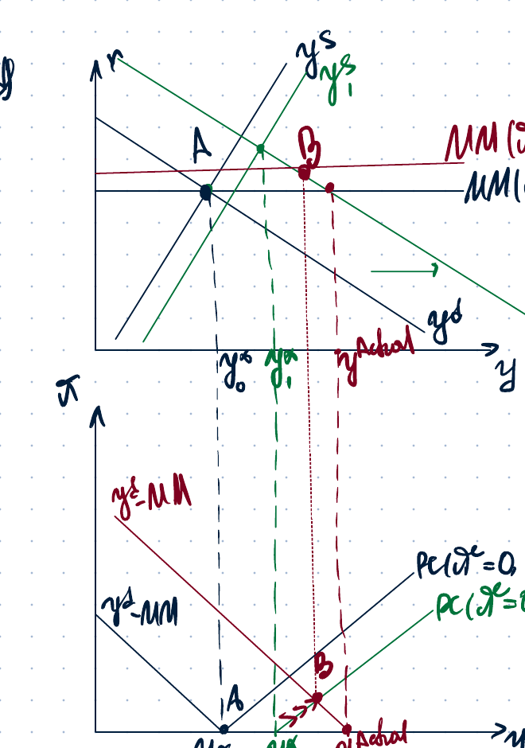
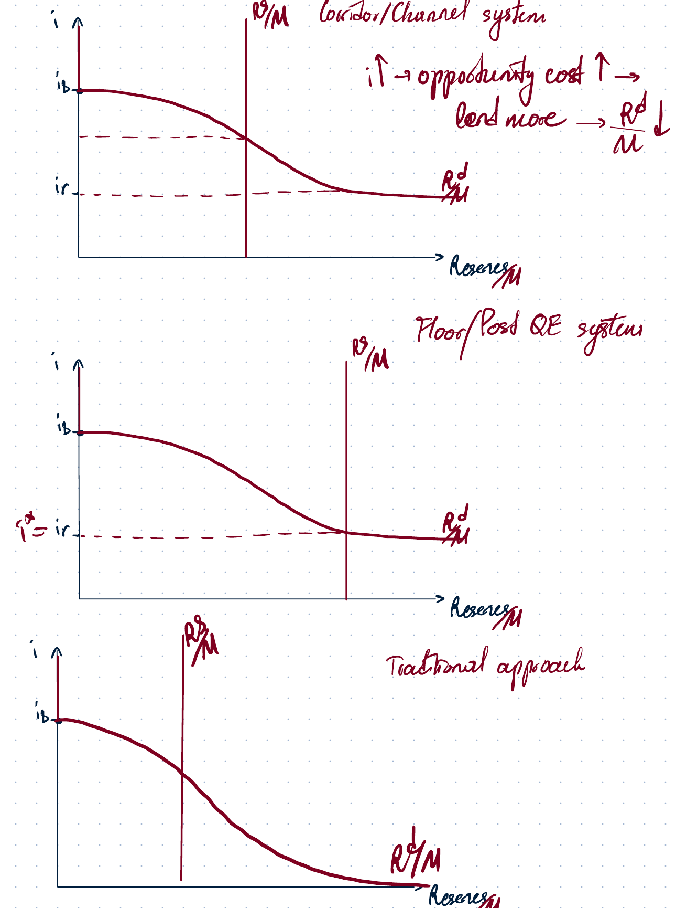
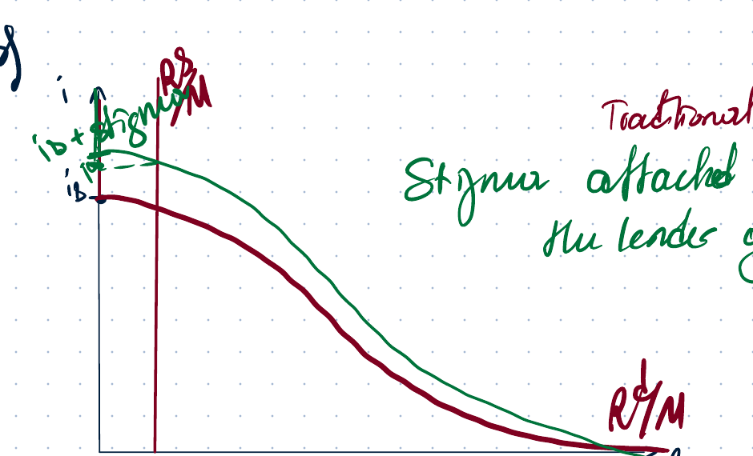
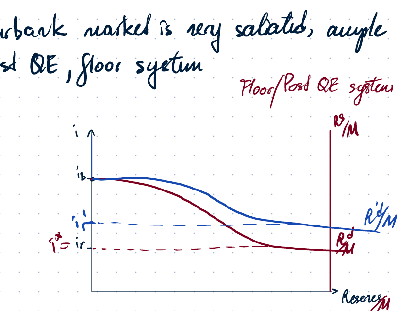
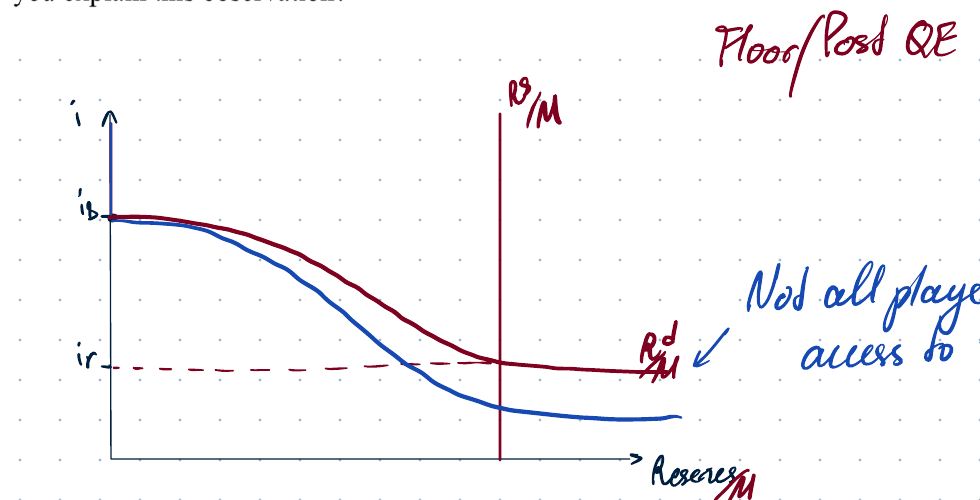
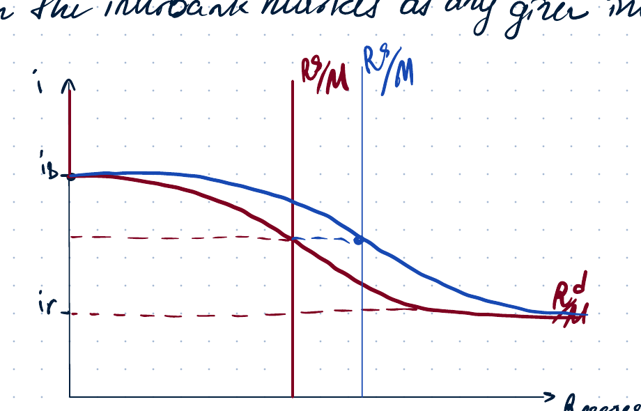
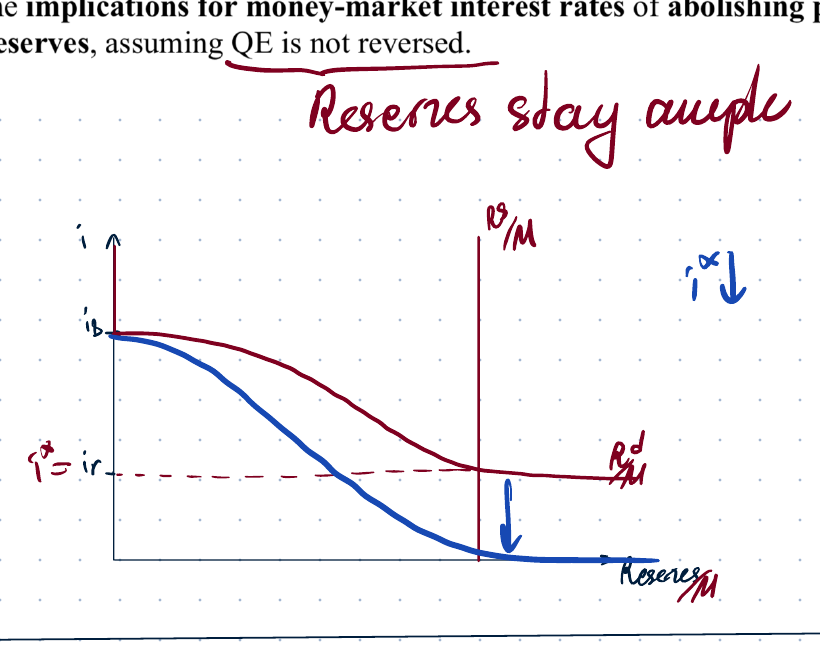
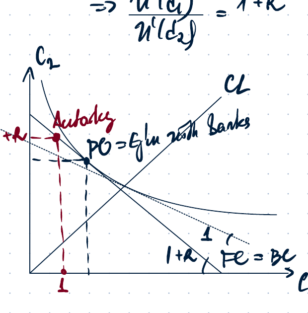

# Macro 2 - Recap 10

## 1. Retake exam: New Keynesian model with partial price adjustment (NKM PPA)

**Problem.** Consider a model of partial price adjustment. Denote $N^*$ and $Y^*$ the natural levels of employment and output.

(a) Explain the concept of the natural level of output. Pay attention to the assumptions of the model.  
(b) Is $Y^*$ equal to, below, or above the socially efficient level of output?  
(c) Suppose that no inflation is expected in the future. Explain why firms adjusting prices would increase prices if aggregate employment $N$ is above $N^*$, and decrease prices if $N$ is below $N^*$.  
(d) Suppose government plans expansionary fiscal policy and the Central Bank does not plan any changes in monetary policy. How is the Phillips curve affected, if at all?

### Notes for parts (a)-(c)

For part (a), the note refers back to Recap 9: with partial stickiness, distinguish **actual output** from **natural output**.

For part (b):

$$
MRS = MPN \quad \text{(socially efficient)}
$$

Under monopolistic competition:

$$
MRS = MPN\left(1-\frac{1}{\varepsilon}\right) < MPN.
$$

Hence the natural level involves underemployment relative to the socially efficient allocation. Therefore $Y^*$ is below the socially efficient level of output.

For part (c), with no expected inflation:

$$
\pi^e = 0,
$$

so the Phillips curve is written as

$$
\pi = \gamma (y-y^*).
$$

The profit-maximizing condition at the natural level is

$$
\omega = MRPN(N^*).
$$

If $N_0 > N^*$, then at the fixed real wage firms are away from the profit-maximizing condition. The notes state that price increase is required: there is upward pressure on prices.

### Part (d): expansionary fiscal policy without monetary-policy change

Expansionary fiscal policy raises government spending:

$$
\Delta G > 0.
$$

Output demand is

$$
y^d = C + I + G.
$$

Since the shock is temporary and $MPC<1$,

$$
|\Delta G| > |\Delta C|,
$$

so $y^d$ shifts to the right.

Output supply is

$$
y^s = zF(K,N).
$$

The notes give the following procedure:

1. Identify the shifts.
2. Identify the output gap: compare new actual output with new natural output.
3. Determine the change in inflation, $\Delta \pi$.
4. Check the reaction of the Central Bank and the MM curve.

In the diagram, the fiscal expansion shifts demand to the right. The actual-output point moves to the right of the new natural level, producing an inflationary gap. The Phillips curve shifts according to the new natural output.

## 2. Problem 1: interbank-market policy system under reserve-demand uncertainty

**Problem.** Consider a model of equilibrium in the interbank market. Suppose that in the considered economy there is high uncertainty concerning the shape of the reserves demand curve.

(a) What is the best system for monetary policy in such an economy? Illustrate by graphs. The graphs must clearly demonstrate uncertainty.

- Graph for traditional system with comments.
- Graph for corridor system with comments.

(b) Data suggest that the interbank interest rate quite often exceeds the discount rate. Is it possible to reconcile this observation with the considered model? Explain carefully.

### Interbank-market systems

The interbank-market diagram uses:

- vertical axis: interbank interest rate $i$;
- horizontal axis: reserves $R/M$;
- reserve demand: $R^d/M$;
- reserve supply: $R^s/M$;
- discount-window rate: $i_b$;
- interest rate on reserves: $i_r$.

In the **corridor/channel system**, the reserve demand curve is bounded above by the discount-window rate and below by the interest rate on reserves. If $i$ rises, the opportunity cost of holding reserves rises, so banks lend more reserves and reserve demand falls.

In the **floor / post-QE system**, reserves are ample and the equilibrium rate is close to the floor, $i^* = i_r$. This makes the rate less sensitive to uncertainty in the reserve-demand curve.

In the **traditional approach**, reserve supply is scarce. With a vertical reserve-supply curve, uncertainty in reserve demand can lead to larger movements in the equilibrium interbank rate.

For part (b), the observation can be reconciled by adding **stigma** to discount-window borrowing. If banks dislike being seen as borrowing from the lender of last resort, the effective cost of borrowing from the central bank is above the official discount rate:

$$
i_b^{eff} = i_b + \sigma.
$$

Hence the market rate can exceed the official discount rate even if the basic model would normally bound it by $i_b$.

## 3. Problem 2: reserve-demand curve and large-scale QE

**Problem.** Consider a model of equilibrium at the interbank market represented in the lecture.

(a) Explain the shape of the reserves demand curve.  
(b) Suppose that the central bank implemented a large-scale QE policy and is not willing to reverse it. At the same time, it finds it optimal to increase the interest rate. Is it possible to attain the desired goals?

### Shape of the reserves demand curve

The reserve-demand curve is downward sloping between the standing-facility bounds.

At low reserve holdings, banks strongly value reserves because they avoid borrowing from the central bank. The upper bound is the discount-window rate $i_b$ or the effective cost $i_b+\sigma$ if stigma is present.

At very high reserve holdings, reserves are abundant. Banks are willing to hold excess reserves if the interbank rate falls to the interest rate paid on reserves, $i_r$. This creates the lower bound / floor.

### Large-scale QE and raising the interest rate

The note says:

> Interbank market is very saturated, ample reserves $\rightarrow$ post-QE floor system.

In a floor system, the central bank can raise the interbank rate by raising the interest rate paid on reserves, $i_r$, without reversing QE. The quantity of reserves can remain high.

## 4. Problem 3: reserve demand and supply in the interbank market

**Problem.** Consider the interbank market for loans of reserves. Answer using a demand-supply diagram.

(a) Briefly explain the shapes of the reserve demand and reserve supply curves in the market for interbank loans.  
(b) Suppose the central bank wants to raise the interest rate in the interbank market. Explain how this can be achieved under the traditional, corridor, and floor systems of monetary policy implementation.

Additional observations in the problem:

- Prior to 2003, the Federal Funds Rate in the US was typically above the Fed's discount rate, the interest rate for bank borrowing through the discount window.
- After the introduction of interest payments on reserves in 2008, the Federal Funds Rate was typically below the interest rate paid on reserves.

### Notes

For part (a), reserve demand slopes downward and is bounded by standing-facility rates. Reserve supply is chosen by the central bank and is drawn as a vertical curve in the standard setup.

For part (b):

- In the traditional system, the central bank raises the rate by reducing reserve supply, shifting the vertical supply line left.
- In the corridor system, the central bank can shift the corridor upward or reduce reserves so that the equilibrium moves to a higher rate inside the corridor.
- In the floor system, the central bank raises the interest rate on reserves, so the floor itself moves up.

For the pre-2003 observation, the note again uses stigma: banks attach a stigma to borrowing from the lender of last resort, so the effective upper bound can be above the official discount rate.

For the post-2008 observation, the note says that not all players have access to the interest rate on reserves. Some institutions can lend below IOR because they cannot themselves earn IOR. Commercial banks may also face capital/regulatory constraints that limit arbitrage.

## 5. Problem 4: standing-facility bounds

**Statement.** "The reserves demand curve is bounded by Central Bank standing facilities interest rates." True or false? Explain carefully.

**Answer in notes: true.**

Required analysis:

- analysis of $R^d$ at $i>i_d$;
- analysis of $R^d$ at $i<i_r$.

Reasoning:

If the interbank rate is above the central-bank lending rate, banks prefer to borrow from the central bank instead of the interbank market. This prevents the market rate from rising above the effective upper bound.

If the interbank rate is below the interest paid on reserves, banks prefer holding reserves at the central bank rather than lending them in the interbank market. This prevents the market rate from falling below the floor.

## 6. Problem 5: fall in bank asset values and collateral

**Problem.** Central banks have standing facilities such as the discount window that provide loans of reserves to commercial banks at an interest rate $i_b$. Commercial banks must offer appropriate collateral to access loans through this borrowing facility.

Suppose the value of commercial banks' assets falls, reducing the amount of collateral they can use to access loans from the central bank. Illustrate the effect this has on the demand curve for reserves and show the impact on the equilibrium interest rate $i$ in the market for interbank lending. Give one example of how the central bank could respond to offset the effect on the interbank interest rate.

### Notes

Effect on demand for reserves:

- if commercial-bank asset values fall, banks have less eligible collateral;
- this reduces their ability to borrow reserves from the central bank via the discount window;
- as a result, banks become more dependent on the interbank market to meet liquidity needs;
- this leads to an increase in the demand for reserves in the interbank market at any given interbank rate.

The reserve-demand curve shifts to the right. With unchanged reserve supply, the equilibrium interbank rate rises.

A possible central-bank response is to increase reserve supply, shifting $R^s/M$ to the right, or otherwise ease liquidity provision so that the interbank rate returns toward its initial level.

## 7. Problem 6: abolishing interest on reserves when QE is not reversed

**Problem.** Since the 2000s, more central banks have begun to pay interest to commercial banks on reserve balances held in accounts at the central bank, and quantitative easing policies have vastly increased the supply of reserves. Now, with rising interest rates, the practice of paying interest on reserves has become more controversial.

Use the interbank-market model with demand and supply curves for reserves to analyze the implications for money-market interest rates of abolishing payment of interest on reserves, assuming QE is not reversed.

### Notes

The key note is:

> Reserves stay ample.

Abolishing IOR means that the floor falls:

$$
i_r \downarrow.
$$

Because QE is not reversed, reserve supply stays high. The economy remains in an ample-reserves system, but the floor is removed or lowered. As a result, the interbank rate falls, potentially toward the zero lower bound.

## 8. Problem 10: Diamond-Dybvig model of banks

**Problem.** Consider the Diamond-Dybvig model of banks. Each of a large number of risk-averse households has a 50% chance of being an early type, receiving utility only from consumption $c_1$ in period 1, and a 50% chance of being a late type, receiving utility from consumption $c_2$ in period 2. All households start in period 0, before they know their type, with one unit of goods.

Per unit of goods invested in period 0, the investment project has payoff $1+R$ if it reaches fruition in period 2, but payoff only $1$ if terminated in period 1. In the absence of banks, households obtain

$$
c_1=1, \qquad c_2=1+R.
$$

Banks offer a deposit contract $(d_1,d_2)$, where $d_1$ and $d_2$ are amounts promised to those who withdraw in periods 1 and 2. Depositors' funds are placed in investment projects, and banks earn zero profits from the deposit contract if

$$
d_1 + \frac{d_2}{1+R}=2.
$$

(a) Show in a diagram how the equilibrium deposit contract is determined. Explain why households may prefer it to investing directly.  
(b) Explain why there is a bank-run equilibrium where all depositors attempt to withdraw in period 1.  
(c) Suppose bank regulators propose a cap on the amount of interest banks can pay to short-term depositors who withdraw in period 1. Explain the maximum period-1 payout $d_1$ for which no bank runs should occur. What is a disadvantage of capping $d_1$ at that level?

### Derivation of the equilibrium deposit contract

The notes set

$$
\pi = 0.5, \qquad 1-\pi=0.5.
$$

Let $x$ be the share stored as reserves. In the normal equilibrium, expected bank profit is written as

$$
E\Pi^{bank}
= Nx + (1-x)N(1+R) - \frac{N}{2}d_1 - \frac{N}{2}d_2,
$$

with choice $x\in[0,1]$ and feasibility condition

$$
Nx \geq \frac{N}{2}d_1.
$$

Hence the lowest feasible storage is

$$
x^* = \frac{d_1}{2}.
$$

Free entry implies zero expected profit:

$$
E\Pi\left(x^*=\frac{d_1}{2}\right)=0.
$$

Substituting gives

$$
\frac{Nd_1}{2} + \left(1-\frac{d_1}{2}\right)N(1+R)
-\frac{Nd_1}{2}-\frac{Nd_2}{2}=0.
$$

After cancellation:

$$
\left(1-\frac{d_1}{2}\right)(1+R)=\frac{d_2}{2}.
$$

Equivalently:

$$
(2-d_1)(1+R)=d_2,
$$

so

$$
2-d_1=\frac{d_2}{1+R},
$$

and therefore

$$
2=d_1+\frac{d_2}{1+R}.
$$

This acts like a budget constraint for a household choosing the deposit contract.

The bank chooses $(d_1,d_2)$ to maximize expected utility:

$$
\max_{d_1,d_2\geq 0}\ \frac{u(d_1)}{2}+\frac{u(d_2)}{2}
$$

subject to

$$
2=d_1+\frac{d_2}{1+R}.
$$

The first-order condition is

$$
\frac{u'(d_1)}{u'(d_2)}=1+R.
$$

Households may prefer the bank contract to direct investment because the bank provides liquidity insurance. The contract lies on a higher indifference curve than the autarky allocation $(1,1+R)$.

### Bank-run equilibrium

The bad equilibrium is a self-fulfilling bank run.

Consider the optimal choice of a late type who expects that $(N-1)$ other agents will withdraw at $t=1$.

The bank needs

$$
d_1(N-1)=c_1^*(N-1)>N-1
$$

to satisfy the demand of withdrawals if the promised early payout exceeds the liquidation value.

By terminating all projects plus using stored goods, the bank can get at most $N$ units in period 1. If $N$ is large,

$$
c_1^*(N-1)>N.
$$

Therefore the bank cannot meet all requests and becomes bankrupt. The best response of a late type is then also to withdraw at $t=1$. Thus a bank run is self-fulfilling.

### Cap on $d_1$

The notes give the maximum cap as

$$
d_1^{\max}=1.
$$

If $d_1\leq 1$, a bank run is not profitable because early withdrawal does not promise more than the liquidation value of the project. However, the disadvantage is that this cap destroys the liquidity-insurance advantage of banking: it pushes the contract back toward the autarky allocation.

