# Macro 2 - Recap 9

Clean transcription of the handwritten/scanned recap notes. Math is written in LaTeX using `$...$` and `$$...$$`. Graphs are preserved as cropped images and described in text.

---

## 1. New Keynesian model with completely sticky prices

### Printed problem fragment

Goods are produced by firms with market power according to the New Keynesian model. Begin by assuming goods prices are completely sticky in units of money. Aggregate demand for goods is negatively related to the real interest rate. The central bank sets the nominal interest rate.

Part (a) asks to explain how the real interest rate $r$ and real GDP $y$ are determined when the central bank keeps $i$ constant, and to illustrate the answer with a diagram containing a $y^d$ curve and an $MM$ line. It also asks why firms do not hire more workers even though the real wage $w$ is below the marginal product of labour $MP_N$.

### Handwritten notes and solution

For the New Keynesian model with completely sticky prices:

$$
\pi = \pi^e = 0,
$$

so from the Fisher equation:

$$
i = r.
$$

If the central bank keeps $i$ constant, it also fixes $r$. Therefore the $MM$ curve is horizontal.

Output market:

$$
y^d = C(r) + I(r) + G.
$$

Labour market:

- Labour demand is demand-determined in the short run.
- Employment is $N^d(y)$.
- Firms do not expand employment beyond the amount needed to produce demanded output.

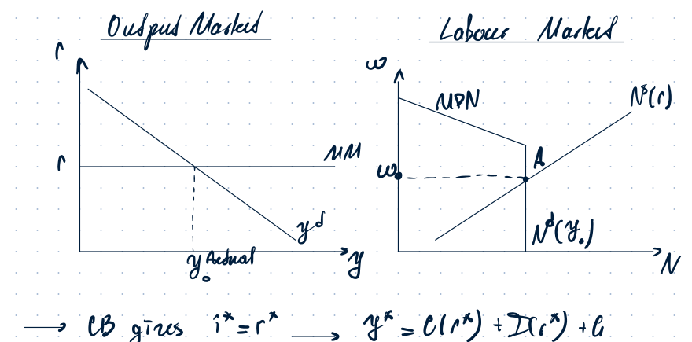

**Graph content.** The output-market diagram has $r$ on the vertical axis and $y$ on the horizontal axis. The $MM$ line is horizontal at the real interest rate set by the central bank. The downward-sloping $y^d$ curve intersects it at actual output $y^{actual}$. The labour-market diagram shows $MP_N$ downward-sloping, $N^s(r)$ upward-sloping, and employment fixed by $N^d(y)$ at point $A$.

The key short-run logic is:

$$
w < MP_N \quad \not\Rightarrow \quad \text{firms hire more}.
$$

Even if firms hire and produce more, they would have to lower prices to sell the additional units. Prices are sticky because of menu costs. Hence firms do not lower prices and cannot sell the additional output.

---

## 2. Natural output and natural real interest rate

### Printed problem fragment

If goods prices were fully flexible, firms would supply output according to an upward-sloping $y^s$ curve. Explain what is meant by the natural level of output $y^*$ and the natural real interest rate $r^*$, and show how they are found in a sticky-price economy. If the central bank knows $r^*$ and wants to avoid an output gap between actual real GDP $y$ and $y^*$, how should monetary policy, the $MM$ line, be set?

### Handwritten notes and solution

The natural level of output $y^*$ is the level of real GDP that would occur if prices were fully flexible and there were no other nominal rigidities. It is determined by the intersection of aggregate demand $y^d$ and the upward-sloping flexible-price supply curve $y^s$.

The natural real interest rate $r^*$ is the real interest rate that makes aggregate demand equal to the natural level of output:

$$
y^d(r^*) = y^*.
$$

With sticky prices, actual output can differ from natural output:

$$
y^{actual} > y^* \quad \Rightarrow \quad \text{inflationary gap},
$$

$$
y^{actual} < y^* \quad \Rightarrow \quad \text{recessionary gap}.
$$

If the central bank knows $r^*$ and wants to avoid an output gap, it should set monetary policy so that:

$$
r = r^*.
$$

Thus the $MM$ line should be horizontal at the level of $r^*$.

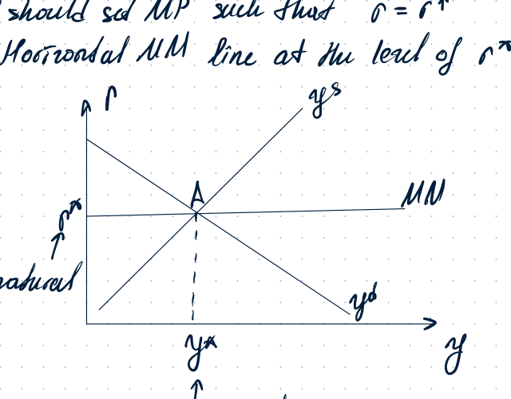

**Graph content.** The diagram has $r$ on the vertical axis and $y$ on the horizontal axis. The downward-sloping $y^d$ curve and upward-sloping $y^s$ curve intersect at point $A$. The horizontal $MM$ line passes through $A$ at $r^*$, giving $y=y^*$.

---

## 3. Central bank does not know $r^*$: responding to demand shocks

### Printed problem fragment

The central bank does not know $r^*$. Instead of following the policy in part (b), it adjusts the interest rate $i$ in the same direction as any change in real GDP $y$. Consider a sticky-price economy with a negative demand shock that shifts $y^d$ left but has no effect on $y^s$.

Part (c) asks to draw the $MM$ line under this assumption and show the effect of the negative demand shock. It also asks what gradient the $MM$ line must have to achieve $y=y^*$, and whether the same monetary policy would also work if both supply and demand shocks shifted $y^s$ and $y^d$.

### Handwritten notes and solution

Policy approach:

$$
y^d \downarrow \Rightarrow y^{actual} \downarrow \Rightarrow CB \text{ reacts by } i\downarrow \Rightarrow r\downarrow,
$$

$$
y^d \uparrow \Rightarrow y^{actual} \uparrow \Rightarrow CB \text{ reacts by } i\uparrow \Rightarrow r\uparrow.
$$

Therefore the $MM$ line is upward-sloping. This policy is useful for demand shocks.

If $MM$ is **flatter** than $y^s$, the economy still experiences a recessionary gap after a negative demand shock. The central bank has to decrease $i$ further.

If $MM$ is **steeper** than $y^s$, the economy experiences an inflationary gap. The central bank has decreased $i$ too much.

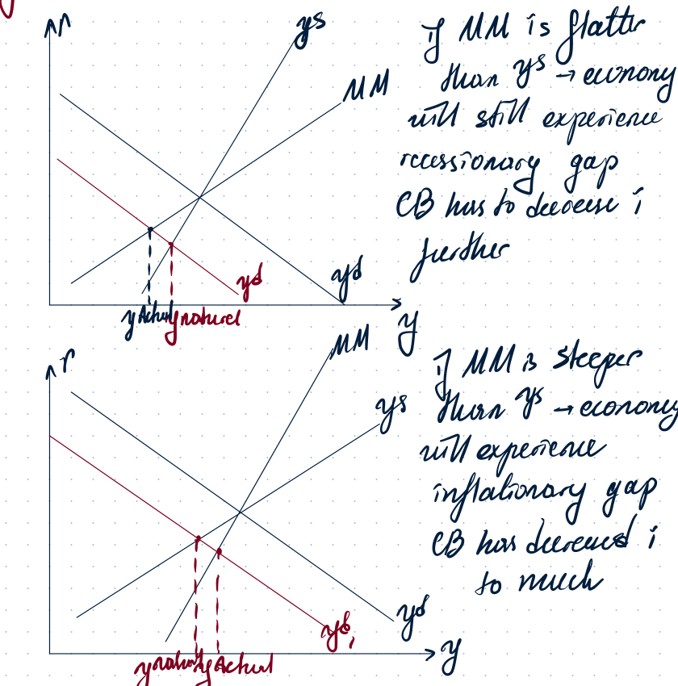

**Graph content.** Two diagrams compare the slope of $MM$ to the slope of $y^s$. In the first, $MM$ is flatter than $y^s$, so after a leftward shift in $y^d$, actual output remains below natural output: recessionary gap. In the second, $MM$ is steeper than $y^s$, so actual output overshoots natural output: inflationary gap.

To avoid any output gaps, the gradient of the $MM$ curve must exactly coincide with the slope of the $y^s$ curve, so that any shift in $y^d$ is offset by a movement in interest rates.

This approach does **not** work for supply shocks. A supply shock shifts $y^s$, so matching $MM$ to the old $y^s$ cannot restore $y=y^*$.

---

## 4. Supply shocks and monetary-policy rules

For a supply shock:

$$
y^s \neq MM.
$$

The notes show that this approach to $MM$ will not offset shocks to $y^s$.

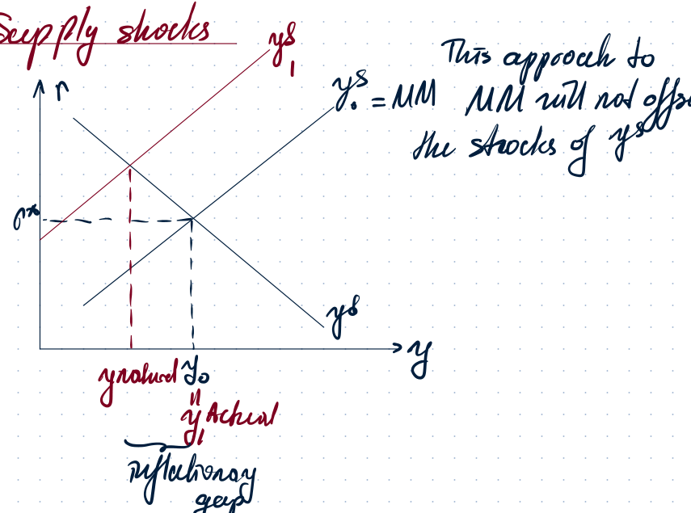

**Graph content.** The supply-shock diagram shows a shifted $y^s$ curve, with actual output and natural output no longer coinciding. The notes then list three policy cases for the $MM$ or $LM$ line.

Policy cases:

1. **Strict interest-rate targeting**

   The $MM$ curve is horizontal:

   $$
   i = i^*.
   $$

2. **Flexible interest-rate targeting / Taylor-rule logic**

   The central bank increases $i$ when $y$ increases:

   $$
   i = i^* + \varphi_y (y-y^*).
   $$

   This gives an upward-sloping $MM$ line.

3. **Strict money-supply targeting**

   The curve is upward-sloping but is now usually called an $LM$ curve:

   $$
   \frac{M^s}{P} = L(y,i).
   $$

If there is also inflation, this is the $MM$ curve in the New Keynesian model with partial price adjustment and in the Barro-Gordon framework.

---

## 5. Taylor rules and inflation targeting

### Taylor-rule cases

General Taylor-rule form in the notes:

$$
i = i^* + \varphi_y (y-y^*) + \varphi_\pi(\pi-\pi^*).
$$

If the central bank cares about output, the $MM$ line is upward-sloping:

$$
i = i^* + \varphi_y (y-y^*) + \varphi_\pi(\pi-\pi^*).
$$

If the central bank does not care about output, the rule becomes:

$$
i = r^* + \varphi_\pi(\pi-\pi^*).
$$

This is associated with a horizontal $MM$ line in the output-market diagram when inflation is fixed by the target.

The notes distinguish:

- strict inflation target: $\pi = \pi^*$;
- default case: central bank has a fixed inflation target;
- if $\pi^e=\pi^*$, then $y^d-MM$ is horizontal.

---

## 6. New Keynesian model with partial price adjustment

### Printed problem fragment

Some but not all firms adjust goods prices if they gain from doing so. This partial price adjustment implies an upward-sloping Phillips curve relationship between inflation $\pi$ and real GDP $y$. If expectations of future inflation are zero, $\pi^e=0$, the Phillips curve passes through $y=y^*$ at $\pi=0$. The central bank adjusts interest rates so that $i$ increases when either $\pi$ or $y$ rises. Its objectives are price stability, $\pi=0$, and avoiding output gaps, $y=y^*$.

Part (d) asks to illustrate how the $y^d-MM$ line is derived from the goods-market diagram, and then, for the same demand shock from part (c), show how the $y^d-MM$ line and the Phillips curve are affected. Explain why the central bank achieves both objectives if the $MM$ line has the same gradient found in part (c).

### Handwritten notes and solution

In the New Keynesian model with partial price adjustment:

$$
\text{NKM PPA} \Rightarrow \text{inflation exists}.
$$

Relevant curves:

$$
y^d, \quad y^s, \quad MM.
$$

If inflation rises and output rises, the $MM$ curve is upward-sloping:

$$
\pi \uparrow, \; y \uparrow \Rightarrow i \uparrow \Rightarrow MM \text{ is upward-sloping}.
$$

Phillips curve:

$$
PC: \pi = \pi^e + \gamma (y-y^N).
$$

Since $\pi^e=0$:

$$
PC: \pi = \gamma (y-y^N).
$$

Rearrange to express output from the Phillips curve:

$$
y = y^N + \frac{1}{\gamma}(\pi-\pi^e).
$$

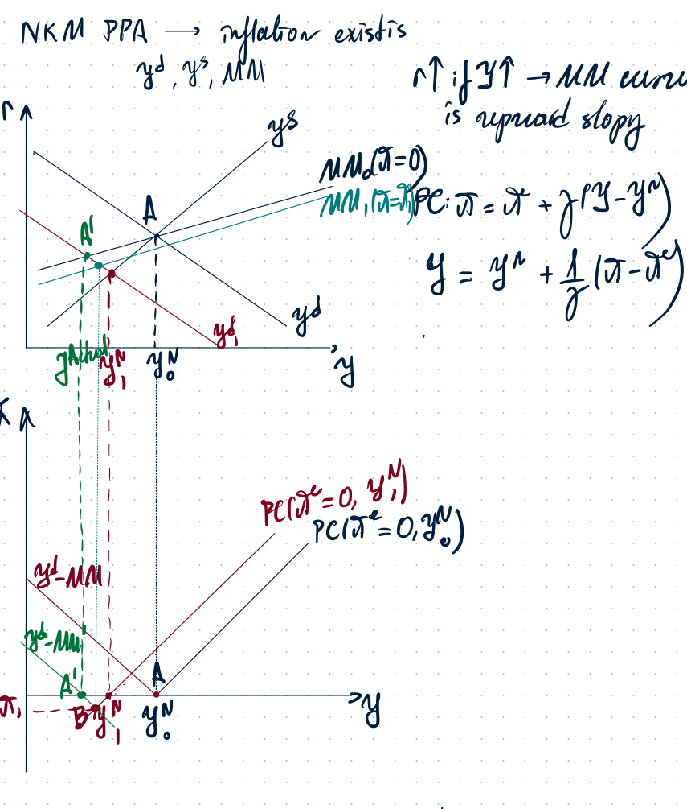

**Graph content.** The upper graph shows the output market with $r$ on the vertical axis and $y$ on the horizontal axis. A negative demand shock shifts $y^d$ left. The $MM$ schedule is upward-sloping. The lower graph shows the Phillips-curve space with $\pi$ on the vertical axis and $y$ on the horizontal axis. The Phillips curve passes through $(y^N_0,0)$ initially, and after the demand shock the diagram tracks the movement from $A$ to $B$ and the associated changes in $y^d-MM$ and $PC$.

The Taylor-rule expression shown in the notes is:

$$
i = i^* + \varphi_\pi(\pi-\hat{\pi}) + \varphi_y(y-\hat{y}),
$$

where $\hat{\pi}$ and $\hat{y}$ are targets.

---

## 7. Deriving the $y^d-MM$ curve in the PPA case

The derivation notes show a movement along $y^d$ caused by the central bank reaction.

When inflation rises:

$$
\pi \uparrow \Rightarrow CB \text{ reacts by increasing } i,
$$

so the $MM$ curve shifts upward and there is a movement along $y^d$:

$$
C \downarrow, \quad I \downarrow, \quad y^d \downarrow.
$$

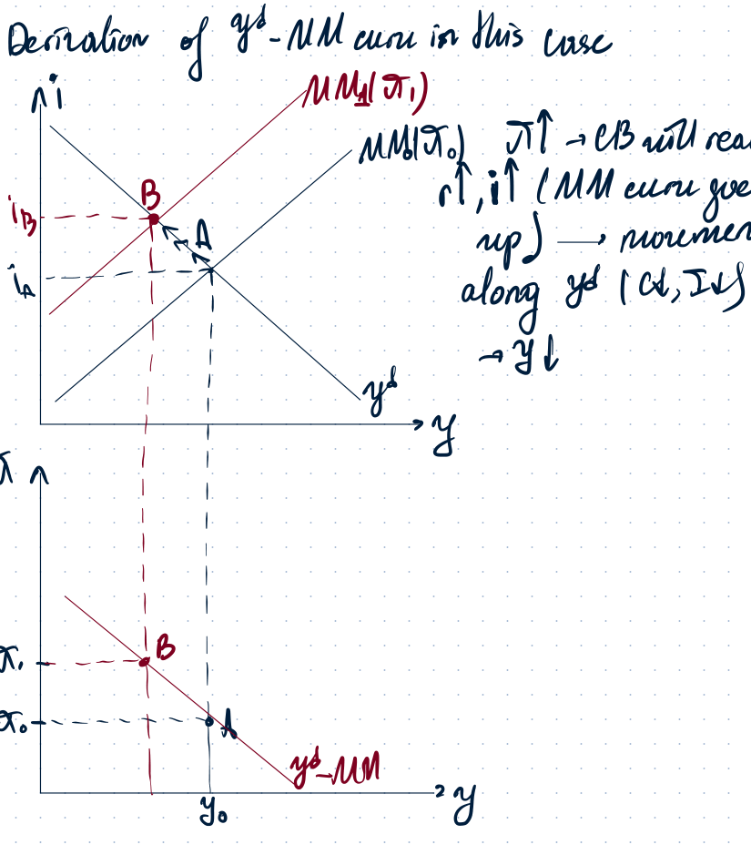

**Graph content.** The upper output-market diagram shows a rise from $i_A$ to $i_B$ and movement along the downward-sloping $y^d$ curve from $A$ to $B$. The lower diagram converts this into a downward-sloping $y^d-MM$ relation in $(\pi,y)$ space.

If the $MM$ line has the same gradient as $y^s$, then after a demand shock there is no output gap and no inflation gap.

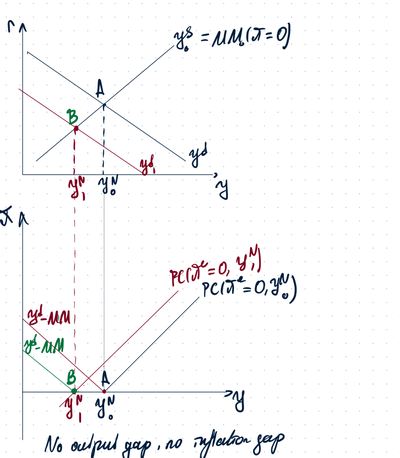

**Graph content.** The output-market graph shows the demand shock moving the equilibrium to $B$ while keeping output at the new natural level. The Phillips-curve graph shows that the economy moves so that $\pi=0$ and $y=y^N$. The note at the bottom says: no output gap, no inflation gap.

---

## 8. More aggressive response to inflation

### Printed problem fragment

There are both supply and demand shocks shifting $y^s$ and $y^d$. The central bank decides to adjust interest rates more strongly in response to $\pi$ deviating from 0.

Part (e) asks how this change to monetary policy affects the gradient of the $y^d-MM$ line, and whether the central bank gets closer to meeting its objectives for both supply and demand shocks.

### Handwritten notes and solution

If the central bank reacts more aggressively to inflation, the coefficient on inflation in the Taylor rule rises:

$$
\varphi_\pi \uparrow.
$$

Taylor rule:

$$
i = i^* + \varphi_\pi(\pi-\hat{\pi}) + \varphi_y(y-\hat{y}).
$$

A larger $\varphi_\pi$ means:

$$
\pi \uparrow \Rightarrow i \uparrow \text{ more strongly}.
$$

In the output-market diagram, the $MM$ curve goes up more for a given rise in $\pi$, so movement along $y^d$ is larger:

$$
y^d \downarrow \text{ more}.
$$

Therefore the $y^d-MM$ curve becomes flatter.

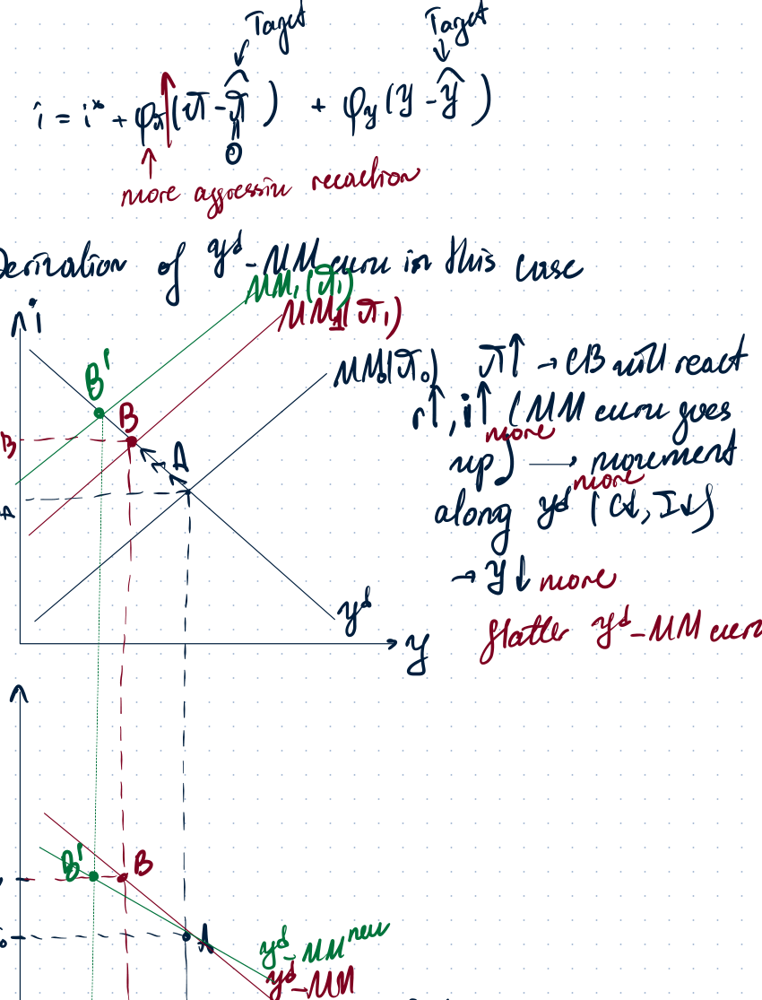

**Graph content.** The diagram compares the old and new $MM$ curves. With a stronger inflation response, a rise in inflation shifts the $MM$ curve up more, causing a larger fall in demand. In $(\pi,y)$ space, the $y^d-MM$ curve becomes flatter.

For **demand shocks**, this helps: a flatter $y^d-MM$ can reduce deviations in inflation and output if calibrated properly.

For **supply shocks**, this does not solve the trade-off completely. A supply shock shifts the Phillips curve, so inflation and output-gap goals are not both achieved.

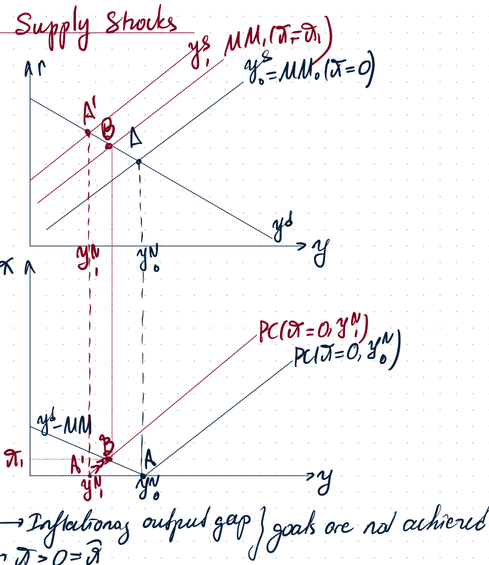

**Graph content.** The upper diagram shows a supply shock shifting $y^s$. The lower diagram shows the Phillips curve shifting upward. The notes state that inflation and output-gap goals are not both achieved: $\pi>0$ remains even if the central bank reacts.

---

## 9. Unexpected lottery prize versus permanent labour-income increase

### Printed problem fragment

An unexpected lottery prize of $30{,}000$ would have a stronger effect on current savings than an annual increase in labour income of $1{,}000$ for 30 years. True or false? Explain with clear reference to the theory studied in the macro course.

The marking note says to use the permanent-income hypothesis (PIH), explain the change in current saving in the lottery-prize case using the MPC out of permanent income, and compare it with the change in current saving in the annual-income case.

### Handwritten notes and solution

Option 1: lottery prize.

$$
\Delta y = 30{,}000
$$

This is a temporary, one-time shock. The change in current consumption is approximately:

$$
\Delta C = \Delta y^p = 1000.
$$

MPC out of the lottery prize:

$$
MPC = \frac{\Delta C}{\Delta y} = \frac{1000}{30{,}000}=\frac{1}{30}<1.
$$

Thus most of the prize is saved.

Option 2: annual income increase.

$$
\Delta y = 1000 \quad \text{each period for 30 periods.}
$$

This is treated as a permanent-income increase over the relevant horizon:

$$
\Delta C^* = \Delta y^p = 1000,
$$

so:

$$
MPC = \frac{1000}{1000}=1.
$$

Savings change:

$$
S = y-C.
$$

Lottery prize:

$$
\Delta S = \Delta y - \Delta C \quad \text{is large and positive}.
$$

Annual income increase:

$$
\Delta S = \Delta y - \Delta C \approx 0.
$$

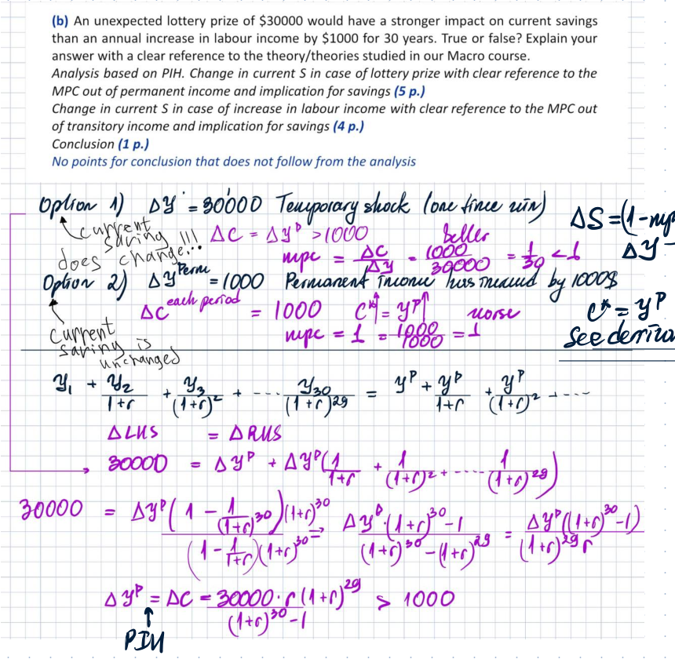

**Image content.** The calculation compares a $30{,}000$ one-time prize with a $1{,}000$ income increase for 30 years. The notes derive that the prize mainly increases saving, while the permanent annual income increase mostly raises current consumption.

Conclusion:

$$
\Delta S_{lottery} > \Delta S_{annual\ income}.
$$

So the statement is **true**.

---

## 10. Permanent income hypothesis derivation

Permanent income hypothesis: individuals smooth consumption over their lifetime based on expected lifetime, or permanent, income rather than only temporary current income. Therefore temporary income changes do not significantly affect consumption, while permanent changes do.

Temporary change:

$$
y^p = C^* \Rightarrow \Delta C^* < \Delta y.
$$

Permanent change:

$$
\Delta C^* = \Delta y^p.
$$

### Math of permanent income hypothesis

Utility maximization problem:

$$
\max_{C,C_{+1}\ge 0} u(C)+\frac{1}{1+\rho}u(C_{+1})
$$

subject to:

$$
C+\frac{C_{+1}}{1+r}=y^p+\frac{y^p_{+1}}{1+r}.
$$

Simplifying assumption:

$$
r=\rho.
$$

FOC / Euler equation:

$$
\frac{u'(C)(1+\rho)}{u'(C_{+1})}=1+r.
$$

Since $r=\rho$:

$$
u'(C)=u'(C_{+1}).
$$

With strictly concave utility:

$$
C=C_{+1}=C^*.
$$

Plug into the budget constraint:

$$
C^*+\frac{C^*}{1+r}=y^p+\frac{y^p_{+1}}{1+r}.
$$

Therefore:

$$
C^*=\left(y^p+\frac{y^p_{+1}}{1+r}\right)\frac{1+r}{2+r}=y^p.
$$

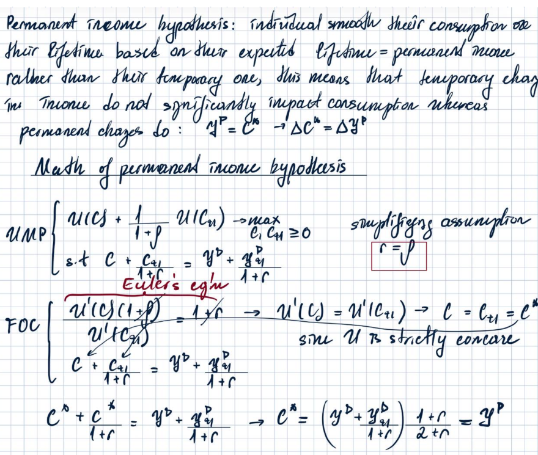

**Image content.** The page writes the permanent-income hypothesis verbally and derives the Euler equation. Under the simplifying assumption $r=\rho$, consumption is constant across periods and equals permanent income.

---

## Compact takeaway

1. With completely sticky prices and fixed nominal interest, $MM$ is horizontal and actual output is demand-determined.
2. Natural output $y^*$ is the flexible-price output level; $r^*$ is the interest rate that makes $y^d=y^*$.
3. If the central bank does not know $r^*$ and reacts to output, $MM$ is upward-sloping.
4. Matching the slope of $MM$ to $y^s$ can neutralize pure demand shocks, but not supply shocks.
5. With partial price adjustment, inflation appears through the Phillips curve.
6. A more aggressive inflation response flattens the $y^d-MM$ curve.
7. A one-time lottery prize mostly increases saving, while a permanent income increase mostly increases consumption.
