# Macro 2 - UOL 2025

Clean transcription of the printed and handwritten notes. Handwriting has been turned into text where readable. Graphs and diagrams are preserved as cropped images, with nearby explanatory text transcribed below them.

---

## Section A

### 1. Malthusian model and land scarcity

**Printed question.** According to the Malthusian model, since low income per worker is the result of scarcity of land, a country with a larger land mass will have higher living standards, even in the long run. Is this statement true or false? Briefly explain.

The handwritten solution for this part is not visible in the provided pages. The question is listed before Question 2.

---

### 2. Cyclicality and volatility of the nominal interest rate

**Printed question.** The graph below shows the time series of a short-term nominal interest rate and real GDP deviations from trend in the United States from 1954 to 2024. Referring to the data in the graph and defining any terminology used, comment on:

- the cyclicality of the nominal interest rate;
- its volatility relative to GDP;
- any leads or lags;
- any stable/unstable pattern over time.

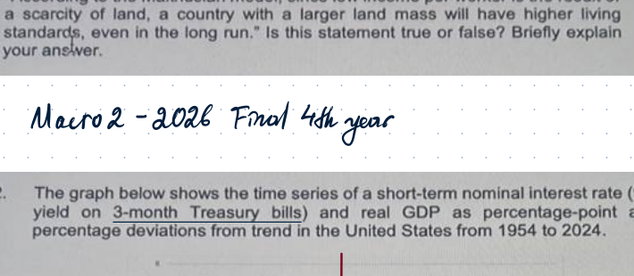

**Extracted notes.**

The red line is the short-term nominal interest rate. The blue line is real GDP.

There is a positive correlation between the nominal interest rate and real GDP deviations, so the nominal interest rate is **procyclical**:

$$
Y^{real}\uparrow \Rightarrow i\uparrow
$$

This can be interpreted as Taylor-rule behaviour: when output is above trend, the central bank raises the interest rate; when output is weak, the central bank lowers the interest rate and conducts more accommodative monetary policy.

GDP deviations are more volatile than interest-rate deviations. One reason is that the nominal interest rate cannot fall below its lower bound.

The nominal interest rate appears to lag real GDP:

- the central bank needs time to react;
- monetary policy has short lags.

The volatility of both series falls after the 1980s, which may reflect structural changes.

---

### 3. Corporate governance, asymmetric information, and credit spreads

**Printed question.** Suppose there is a decline in standards of corporate governance that makes the operation of firms harder for outsiders to scrutinize. If this means lenders now face a higher fraction of bad borrowers when making loans, explain the likely effects on interest-rate spreads and the level of investment.

**Extracted notes.**

This is an asymmetric-information problem explaining the interest-rate spread.

Borrowers:

- good borrowers return enough to repay;
- bad borrowers return nothing.

Both types take the same amount of credit, so bad borrowers can mimic good borrowers.

Expected profit of a lender under free entry and exit:

$$
(1-a)(1+r_L)+a\cdot 0-(1+r)=0,
$$

where:

- $a$ is the fraction/probability of bad borrowers;
- $r_L$ is the loan rate;
- $r$ is the safe/deposit rate.

Hence:

$$
(1-a)(1+r_L)=1+r,
$$

so the spread is

$$
x=r_L-r=\frac{a(1+r)}{1-a}.
$$

A decline in corporate governance makes monitoring/screening harder:

$$
a\uparrow \Rightarrow x\uparrow.
$$

Investment is determined by:

$$
I=K_{t+1}-K_t(1-\delta),
$$

and the target capital stock satisfies a condition of the form

$$
MPK_{t+1}(K^*)-\delta = r+x.
$$

Therefore:

$$
x\uparrow \Rightarrow r+x\uparrow \Rightarrow K^*\downarrow
$$

because $MPK$ is diminishing. The marginal cost of physical capital rises, the target level of capital falls, and investment falls.

---

### 4. Downward-sloping yield curve, expectations theory, and the Taylor rule

**Printed question.** In the last two years, yield curves in several economies have been downward sloping. With reference to the Taylor rule for monetary policy and the expectations theory of interest rates, explain why an inverted yield curve signals an upcoming recession and why it might worry policy makers.

**Extracted notes.**

Expectations theory for a 2-year yield:

$$
I=\frac{i+i^e_{t+1}}{2},
$$

where:

- $I$ is the 2-year long-term yield;
- $i$ is the current short-term interest rate;
- $i^e_{t+1}$ is the expected future short-term interest rate.

Expectations theory states that long-term rates equal the average of current and expected future short-term rates.

The intuition is non-arbitrage pricing: investing in a 2-year bond and selling it after one year should give the same expected return as investing in a 1-year bond and then reinvesting.

Taylor rule:

$$
i=r^*+\pi+\varphi_\pi(\pi-\pi^*)+\varphi_y(y-y^*).
$$

It describes how the central bank should target the short-term interest rate in response to deviations of inflation and output from their targets.

For the slope of the yield curve:

$$
\frac{I-i}{2-1}
=\frac{\frac{i+i^e_{t+1}}{2}-i}{1}
=\frac{i^e_{t+1}-i}{2}.
$$

If the yield curve is downward sloping,

$$
i^e_{t+1}<i.
$$

So markets expect future short-term interest rates to fall. According to the Taylor rule, this usually means the central bank is expected to respond to a recession or weak demand by cutting rates.

---

### 5. Natural/neutral real interest rate and monetary policy

**Printed question.** Explain the concept of a market-clearing real interest rate $r^*$, sometimes referred to as the natural or neutral rate of interest, with reference to the New Keynesian model. Why is information about the level of $r^*$ important for the central bank?

**Extracted notes.**

The market-clearing real interest rate is the **natural/neutral long-run real interest rate**. It is the rate at which output supply intersects output demand.

If the actual real interest rate is above the long-run neutral real interest rate, then interest-sensitive components of demand are too low. This creates a recessionary gap, so the central bank should conduct expansionary monetary policy and cut interest rates.

Accurate knowledge of the neutral real interest rate is needed for the central bank to conduct accurate monetary policy.

Simple Taylor rule:

$$
i=\hat r+\pi^*+\varphi(\pi-\pi^*),
$$

where $\hat r$ is the central bank's estimate of the neutral rate.

Using the Fisher equation:

$$
i=r+\pi^e.
$$

Assume $\pi^e=\pi$. Then:

$$
r+\pi=\hat r+\pi^*+\varphi(\pi-\pi^*).
$$

Rearranging:

$$
r=\hat r+(\varphi-1)(\pi-\pi^*),
$$

so

$$
\pi=\pi^*+\frac{r-\hat r}{\varphi-1}.
$$

If the central bank underestimates the neutral rate, then $r>\hat r$, and inflation is above the desired level, assuming $\varphi>1$. Hence $r^*$ must be estimated accurately.

---

## Section B

### 6. Solow model with labour-augmenting and capital-augmenting technology

**Printed question summary.** An economy produces aggregate output according to

$$
Y=F(K,AN),
$$

where $K$ is capital, $N$ is labour, and $A$ is labour-augmenting technology. The production function satisfies the neoclassical properties. The supply of labour $N$ is constant over time, $n=0$, and technology is initially constant, $A_t=A$. The saving rate is constant and depreciation is $\delta$.

#### (a) Intensive-form accumulation equation and steady state

Define capital per effective worker:

$$
k_e=\frac{K}{AN}.
$$

Capital accumulation:

$$
K_{t+1}-K_t=sY_t-\delta K_t.
$$

Divide by $AN$:

$$
\frac{K_{t+1}}{AN}-\frac{K_t}{AN}=s\frac{F(K_t,AN)}{AN}-\delta \frac{K_t}{AN}.
$$

By constant returns to scale:

$$
\frac{F(K_t,AN)}{AN}=F\left(\frac{K_t}{AN},1\right)=f(k_{e,t}).
$$

Therefore:

$$
k_{e,t+1}-k_{e,t}=s f(k_{e,t})-\delta k_{e,t}.
$$

The steady state satisfies:

$$
sf(k_e^*)=\delta k_e^*.
$$

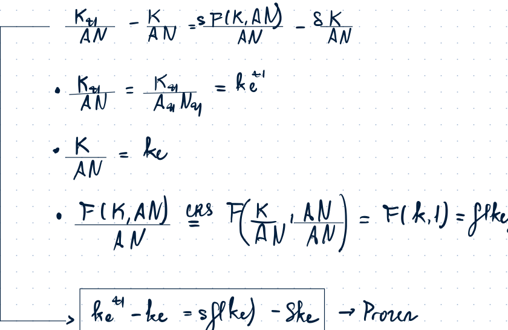

#### (b) One-off increase in labour-augmenting technology $A$

A one-off increase in technology raises $A$ but leaves $K$ and $N$ fixed initially. Therefore:

$$
k_e=\frac{K}{AN}\downarrow.
$$

This creates a movement leftward along the Solow diagram. Since the intensive-form equation is unchanged, the economy subsequently accumulates capital per effective worker back toward the same steady-state level $k_e^*$.

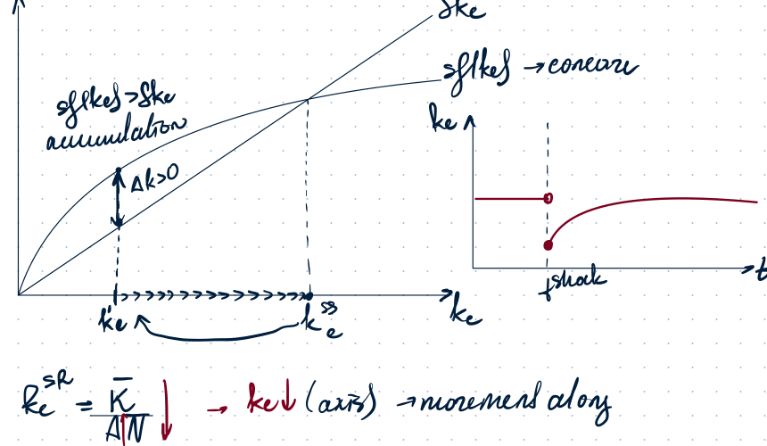

#### (c) Does labour-augmenting technology raise the capital share in the long run?

The income share of capital owners is:

$$
\frac{K\cdot MPK}{Y}.
$$

Using $Y=F(K,AN)=ANf(k_e)$ and $MPK=f'(k_e)$:

$$
\frac{K\cdot MPK}{Y}
=\frac{K f'(k_e)}{AN f(k_e)}
=\frac{k_e f'(k_e)}{f(k_e)}.
$$

In the long run, a one-off rise in $A$ does not change $k_e^*$, so the capital share is unchanged in the long run.

#### (d) Capital-augmenting technology

Now production is written as:

$$
Y=F(BK,N),
$$

where $B$ is capital-augmenting technology. Define:

$$
k_e=\frac{BK}{N}.
$$

Starting from:

$$
K_{t+1}-K_t=sF(BK_t,N)-\delta K_t,
$$

and multiplying/dividing by $BN$, the notes derive:

$$
k_{e,t+1}-k_{e,t}=sB f(k_{e,t})-\delta k_{e,t}.
$$

Thus the saving line is multiplied by $B$:

$$
sf(k_e) \quad \to \quad sBf(k_e).
$$

A one-off rise in $B$ raises capital per effective unit mechanically and shifts the saving curve upward. The new steady-state $k_e$ is higher.

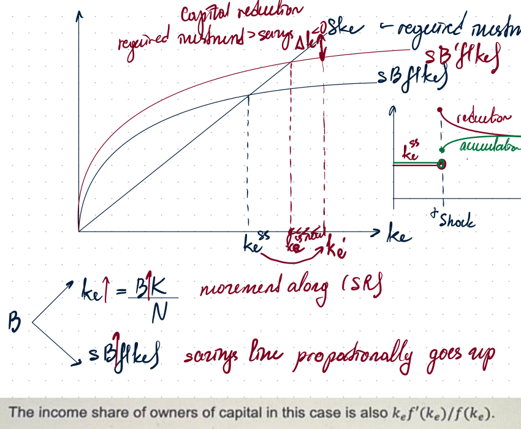

#### (e) Does capital-augmenting technology raise the capital share?

The capital share is again:

$$
\frac{k_e f'(k_e)}{f(k_e)}.
$$

For a pure power function $f(k_e)=k_e^\alpha$, the capital share is

$$
\frac{k_e \alpha k_e^{\alpha-1}}{k_e^\alpha}=\alpha,
$$

so it is unchanged.

For the function:

$$
f(k_e)=k_e^\alpha+k_e^\beta, \qquad 0<\alpha<\beta<1,
$$

we have:

$$
f'(k_e)=\alpha k_e^{\alpha-1}+\beta k_e^{\beta-1}.
$$

The capital share is:

$$
\frac{k_e f'(k_e)}{f(k_e)}
=\frac{\alpha k_e^\alpha+\beta k_e^\beta}{k_e^\alpha+k_e^\beta}.
$$

Divide numerator and denominator by $k_e^\alpha$:

$$
\frac{\alpha+\beta k_e^{\beta-\alpha}}{1+k_e^{\beta-\alpha}}.
$$

Let $x=k_e^{\beta-\alpha}$. Then:

$$
S_K(x)=\frac{\alpha+\beta x}{1+x}.
$$

The derivative is:

$$
\frac{dS_K}{dx}=\frac{\beta-\alpha}{(1+x)^2}>0.
$$

Since a rise in $B$ raises long-run $k_e$, it raises $x$, and therefore raises the capital share.

---

### 7. Housing, borrowing, and limited commitment

**Printed question summary.** A household chooses current and future consumption. It owns a house, has current income $y$, expected future income $y'$, and initial debt $D$ due in the current period. The house is expected to be sold in the future at price $p'$. The household may borrow or save between current and future periods at real interest rate $r$.

#### (a) Budget constraint without an additional borrowing constraint

Let $s$ be saving. Then:

$$
c=y-D-s,
$$

and

$$
c'=y'+p'+s(1+r).
$$

From the first equation:

$$
s=y-D-c.
$$

Substitute into the second equation:

$$
c'=y'+p'+(y-D-c)(1+r).
$$

Hence the combined budget constraint is:

$$
c+\frac{c'}{1+r}=y-D+\frac{y'+p'}{1+r}.
$$

The endowment point is:

$$
E=(y-D,\; y'+p').
$$

The optimal consumption plan satisfies the Euler condition:

$$
MRS(c,c')=1+r.
$$

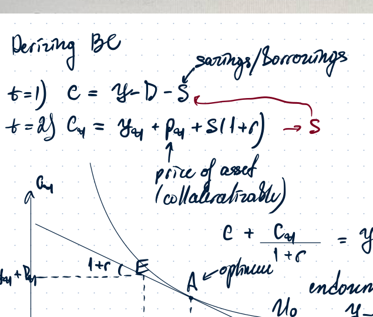

#### (b) Lower expected future house price

Bad news about the future house price means:

$$
\Delta p'<0.
$$

This is a normal temporary shock that affects the second period. The household smooths consumption, so both current and future consumption fall, but the fall in current consumption is smaller than the fall in future wealth.

The budget line shifts inward. The endowment point moves downward because expected future resources fall.

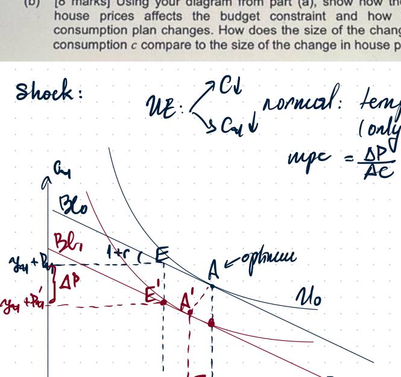

The notes state:

$$
\frac{\Delta C}{\Delta p'}<1,
$$

so current consumption responds less than one-for-one to the fall in the expected house price.

#### (c) Limited-commitment constraint

Let $L$ be the amount borrowed. The household must be able to commit to repay the loan using collateral. If the future house price is $p'$, then the repayment must satisfy:

$$
(1+r)L\le p'.
$$

Thus:

$$
L\le \frac{p'}{1+r}.
$$

Since

$$
L=D-s=D-y+c,
$$

the limited-commitment constraint becomes:

$$
D-y+c\le \frac{p'}{1+r}.
$$

Equivalently:

$$
c\le y-D+\frac{p'}{1+r}.
$$

This is a borrowing constraint on current consumption.

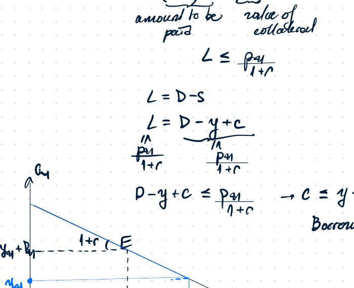

A rational lender can provide a loan only up to the amount the household can credibly commit to repay. If the household would otherwise like to borrow more than $p'/(1+r)$, then the limited-commitment constraint binds.

#### (d) Fall in house prices when the limited-commitment constraint binds

When the constraint binds, a fall in the expected future house price has two effects:

1. the usual wealth effect;
2. a tighter borrowing constraint.

The budget line shifts inward, and the vertical borrowing-constraint line moves left. The notes stress that this is not only the usual wealth effect: the limited-commitment constraint also becomes stronger.

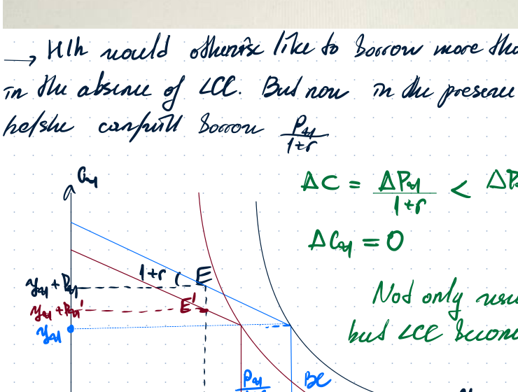

When the household remains constrained, the change in current consumption is tied to the collateral value:

$$
\Delta c=\frac{\Delta p'}{1+r},
$$

and the notes indicate that future consumption may remain unchanged at the constrained optimum in the illustrated case.

#### (e) Case $p'/(1+r)<D$

If

$$
\frac{p'}{1+r}<D,
$$

then even the collateral value of the house is below the existing debt due. The household cannot take more debt in the first period and is obliged to save at least some amount.

From the constraint:

$$
c \le y-D+\frac{p'}{1+r}<y.
$$

Therefore:

$$
s=y-c>0.
$$

The notes then compare no-default and default allocations. The household can declare bankruptcy/default in the first period and default on the initial debt; the house is taken. Default is optimal if the utility from default exceeds the utility from repaying under the constrained allocation.

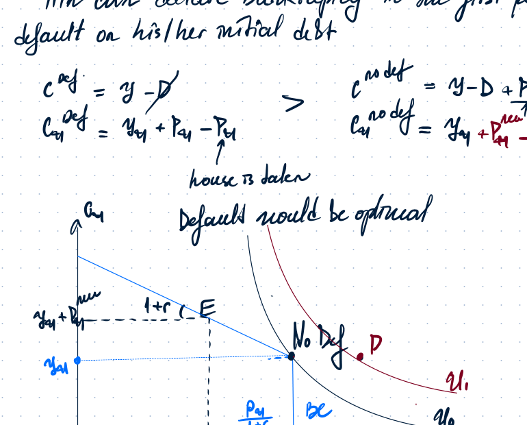

---

### 8. Open economy, exchange rates, and foreign tariffs

**Printed question summary.** Net exports $N_X$ in a small open economy depend on $q$, the relative price of imports to domestically produced goods, including export goods. Domestic consumption and investment are negatively related to the real interest rate. Capital is perfectly mobile. Foreign and domestic goods prices are completely sticky. The central bank initially maintains a fixed exchange rate.

#### Basic definitions

Real exchange rate:

$$
q=\frac{eP^*}{P},
$$

where:

- $e$ is the nominal exchange rate, the price of foreign currency in domestic currency;
- $P^*$ is the foreign price level;
- $P$ is the domestic price level.

A rise in $q$ means real depreciation: foreign goods become more expensive relative to domestic goods, and domestic goods become more competitive.

Output demand:

$$
y^d=C+I+G+N_X(q).
$$

With perfect capital mobility:

$$
r=r^*.
$$

#### (a) Fixed exchange rate

With a fixed exchange rate $\bar e$, the central bank cannot have an independent monetary policy target for inflation or output. With fixed exchange rates and perfect capital mobility, monetary policy must maintain the peg.

Therefore the $MM$ curve follows the $BP$ condition. The only way to keep the currency fixed is to make sure the internal interest rate does not deviate from the international interest rate.

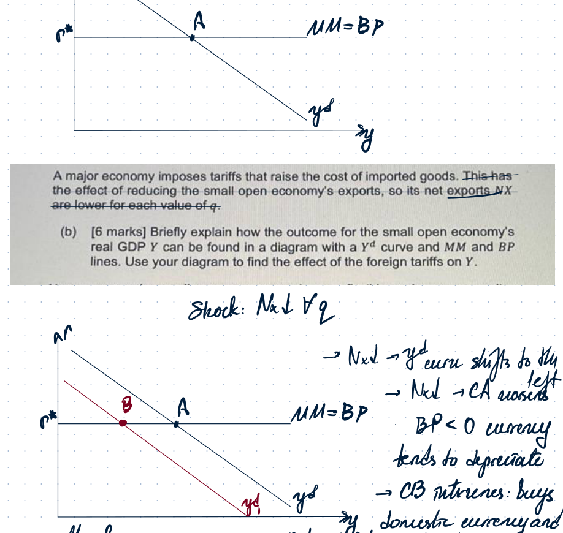

#### (b) Foreign tariffs under fixed exchange rate

A major economy imposes tariffs that reduce the small open economy's exports for each value of $q$.

The shock is:

$$
N_X\downarrow \quad \text{for all } q.
$$

Thus:

$$
y^d \text{ shifts left},
$$

and the current account worsens:

$$
CA\downarrow.
$$

The balance of payments becomes negative:

$$
BP<0,
$$

so the domestic currency tends to depreciate.

Under a fixed exchange rate, the central bank intervenes: it buys domestic currency and sells foreign reserves to prevent depreciation. This reduces money supply and shifts monetary conditions so that the peg is defended.

#### (c) Flexible exchange rate

Under a flexible exchange-rate regime, the central bank does not intervene to defend the currency. Monetary policy can consider domestic objectives, including real GDP.

The foreign tariff initially reduces net exports:

$$
N_X\downarrow \Rightarrow y^d\downarrow.
$$

The domestic return becomes less attractive, generating capital outflow:

$$
FA<0.
$$

The balance of payments pressure leads to depreciation:

$$
e\uparrow \Rightarrow q\uparrow.
$$

Domestic goods become relatively cheaper and more competitive, so net exports rise back:

$$
q\uparrow \Rightarrow N_X\uparrow \Rightarrow y^d \text{ shifts back right}.
$$

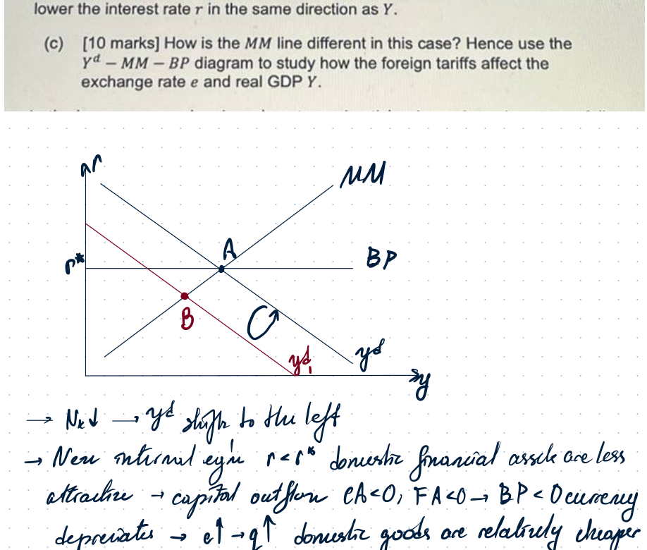

#### (d) Long-run effect through labour supply

In the long run, prices are flexible. If $q$ rises, foreign goods become relatively more expensive. Domestic residents can buy fewer foreign goods with domestic wages. The purchasing power of wages falls, and leisure becomes relatively cheaper. The labour supply curve shifts left.

Hence:

$$
N^s\downarrow \Rightarrow N\downarrow \Rightarrow y^s\downarrow.
$$

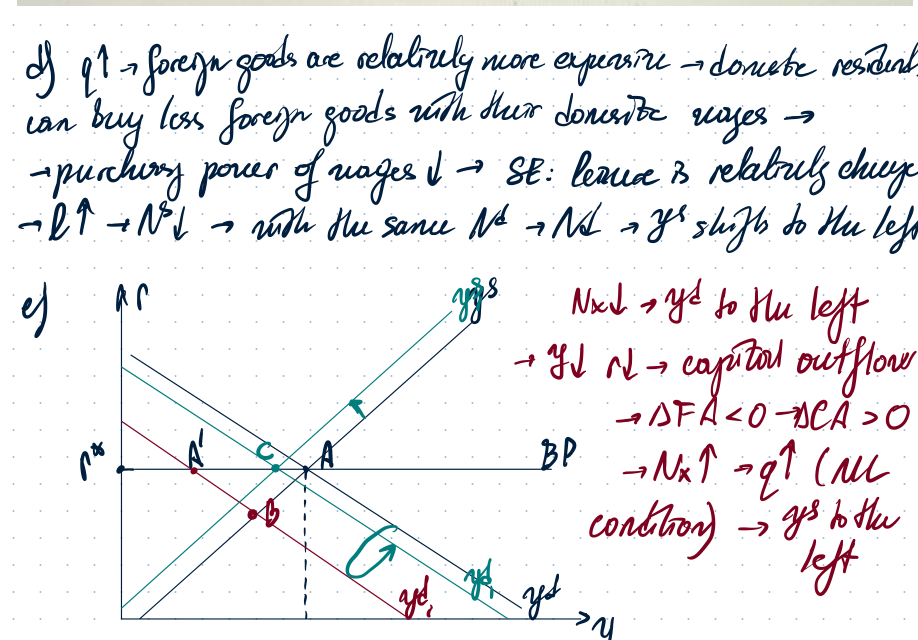

#### (e) Using the $y^d-y^s-BP$ diagram

The tariff lowers exports directly:

$$
N_X\downarrow \Rightarrow y^d \text{ shifts left}.
$$

But under flexible exchange rates, depreciation raises $q$, which improves competitiveness and raises net exports. Therefore the final effect on real GDP depends on the relative strength of the direct export-demand fall and the exchange-rate adjustment.

---

## Extra revision: New Keynesian model with partial price adjustment

### Setup

Some firms adjust prices and some do not. Flexible firms initially set prices. The shock is a temporary negative supply shock:

$$
\Delta z<0, \qquad \Delta y^d=0.
$$

The central bank initially holds the nominal interest rate constant, so the $MM$ line is horizontal. The central bank does not target inflation; the $y^d-MM$ relation is active.

Phillips curve:

$$
\pi=\pi^e+\gamma(y-y^*).
$$

With no expected inflation:

$$
\pi^e=0.
$$

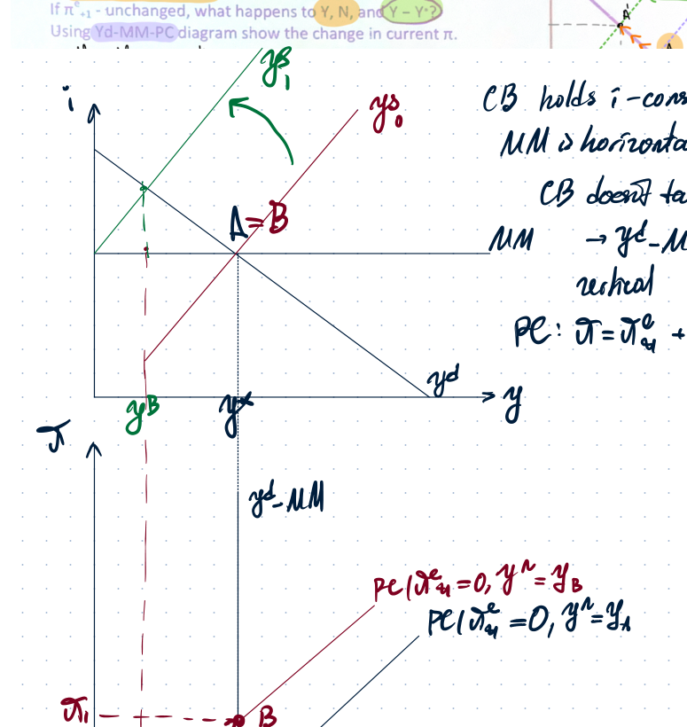

### Supply-side effect

A fall in productivity lowers marginal product of labour:

$$
z\downarrow \Rightarrow MPN\downarrow.
$$

The labour demand curve shifts left, so the natural level of output falls:

$$
y^*\downarrow.
$$

The Phillips curve shifts left/up because, for the same actual output, the output gap becomes more inflationary.

### Demand-side effect

Output demand is unchanged:

$$
y^d=C+I+G.
$$

There is no monetary-policy response. Hence the $y^d-MM$ relation is unchanged.

As a result:

$$
\Delta y^*<0, \qquad \Delta y^{actual}=0.
$$

This creates an inflationary gap:

$$
y^{actual}>y^*.
$$

There is upward pressure on prices. The notes state:

$$
w>MRPN,
$$

so profits are not maximized at unchanged prices.

### Strict inflation targeting

If the central bank strictly targets inflation, it sets policy so that:

$$
\pi=0.
$$

To keep inflation at target, it raises the interest rate and shifts the $MM$ line upward. This reduces actual output.

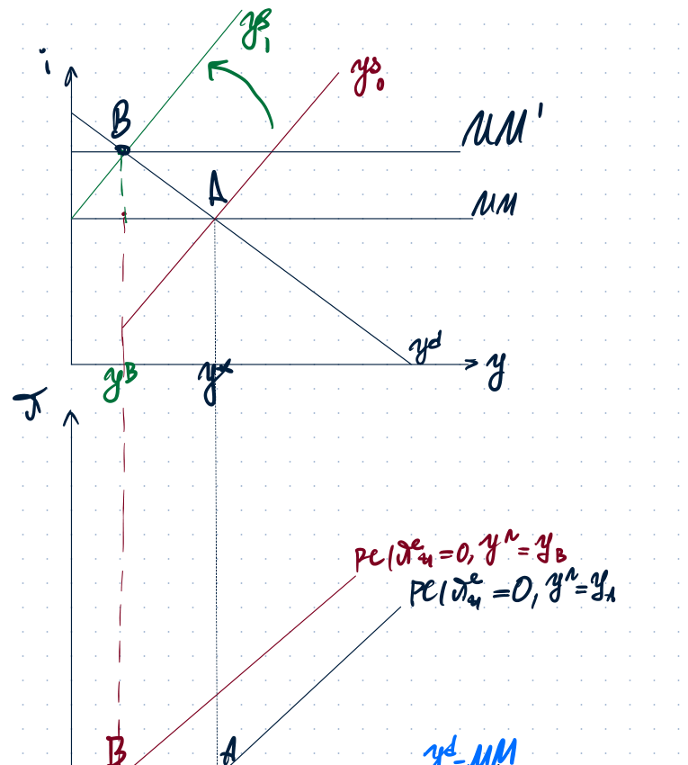

### Conflict of objectives

If the central bank wants both:

$$
\pi=0
$$

and

$$
y-y^*=0,
$$

then a negative supply shock creates a conflict. Stabilizing inflation requires reducing demand/output, while stabilizing the output gap would tolerate higher inflation.

### Efficiency gap with monopolistic competition

Due to monopolistic competition, equilibrium employment is too low relative to the efficient level.

The household's condition is:

$$
MRS(\ell,y)=w.
$$

The firm's pricing condition under monopolistic competition is:

$$
w=\left(1-\frac{1}{\varepsilon}\right)MPN.
$$

To reach the efficient level of employment, we need:

$$
MPN=MRS.
$$

But under monopolistic competition:

$$
MRPN=\left(1-\frac{1}{\varepsilon}\right)MPN<MPN=MRS=w.
$$

Thus:

$$
MRPN<w.
$$

Profits are not maximal from the social-efficiency perspective, and there is upward pressure on prices. This creates a conflict of objectives.

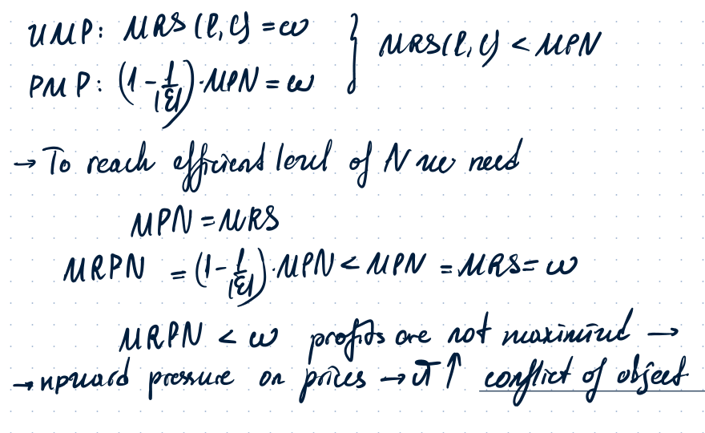
