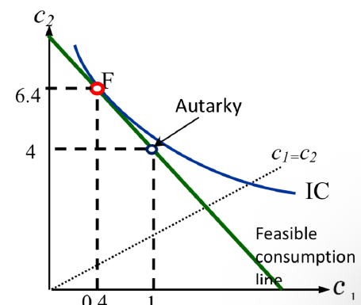
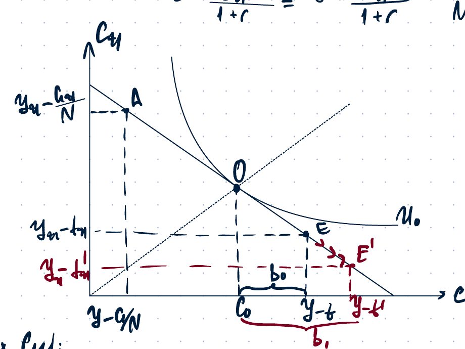
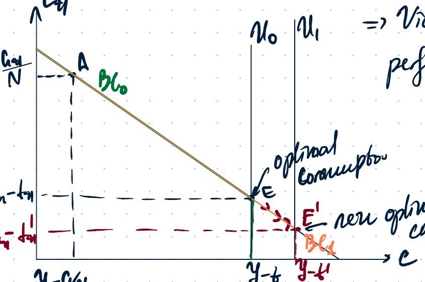

# Midterm 2026

## 1. Diamond-Dybvig model with $N=10$

### Problem statement

Consider a Diamond-Dybvig model introduced at the lecture. Assume that there are 10 agents in this economy. The required information about the model parameters should be inferred from the graph.

**(a)** What is the bank's resource constraint that relates $d_2$ and $d_1$? Write this down precisely, using the particular numerical values inferred from the graph, and explain in words.

Grading comment in the source notes: the constraint must account for the particular return $R$ and the particular share of early and late type agents inferred from the graph. It is an inequality constraint: the left-hand side is the funds to be withdrawn in period 2, and the right-hand side is the resources that the bank has in period 2. If the inequality is violated, the bank is insolvent. No points are given for the PMP, the zero-profit condition, or the ICC here because the question asks only for the resource constraint.

**(b)** Write down the bank's incentive constraint precisely and explain it in words.

Grading comment in the source notes: give the ICC constraint without other irrelevant constraints and with proper explanation.

**(c)** Is there a bank-run equilibrium in the considered economy?

Grading comment in the source notes: prove that a bank-run equilibrium does not exist in this economy.

### Graph and inferred parameters

From the graph, the Pareto-optimal allocation is inferred as the highest attainable indifference curve subject to the feasible-consumption line:

$$
N=10, \qquad c_1^{PO}=0.4, \qquad c_2^{PO}=6.4.
$$

The autarky point is:

$$
(c_1,c_2)=(1,4).
$$

The return and the share of early types are inferred as:

$$
1+R=4 \quad \Rightarrow \quad R=3,
$$

and from the graph/slope condition:

$$
\frac{\pi}{1-\pi}=1 \quad \Rightarrow \quad \pi=\frac12.
$$

Hence:

$$
\pi=\frac12, \qquad 1-\pi=\frac12.
$$

### Part (a): resource constraint

The bank chooses how much to store and how much to invest. Let $x$ be storage per unit of initial wealth. Expected profit is written as:

$$
E\Pi
= 1\cdot N x +(1-x)N(1+R)-\pi N d_1-(1-\pi)N d_2,
\qquad x\in[0,1].
$$

The storage constraint in period 1 is:

$$
xN\geq \pi N d_1
\quad \Rightarrow \quad
x\geq \pi d_1.
$$

Since $E\Pi$ is decreasing in $x$, the bank chooses the lowest feasible storage level:

$$
x^*=\pi d_1.
$$

The period-2 resource constraint requires that late withdrawals do not exceed the resources left invested until period 2:

$$
d_2(1-\pi)N \leq (1-d_1\pi)N(1+R).
$$

Using $1+R=4$ and $\pi=\frac12$:

$$
d_2\cdot \frac12 N \leq \left(1-\frac{d_1}{2}\right)4N.
$$

Cancel $N$:

$$
\boxed{\frac{d_2}{2}\leq 4\left(1-\frac{d_1}{2}\right).}
$$

In words: the total amount promised to late consumers must be no larger than what the bank can pay in period 2 from the part of resources not stored for early withdrawals and invested in the long project.

### Feasibility / zero-profit calculation shown in the notes

With free entry and perfect competition, expected profit is set to zero:

$$
E\Pi(x^*=\pi d_1)
=N\left[\pi d_1+(1-\pi d_1)(1+R)-\pi d_1-(1-\pi)d_2\right]=0.
$$

Thus:

$$
\pi d_1+(1-\pi d_1)(1+R)-\pi d_1-(1-\pi)d_2=0,
$$

so:

$$
(1+R)(1-\pi d_1)=(1-\pi)d_2.
$$

From the household perspective:

$$
c_1=d_1, \qquad c_2=d_2.
$$

Therefore:

$$
c_2=\frac{(1+R)(1-\pi c_1)}{1-\pi},
$$

which is the same as the feasibility condition.

Using the autarky point $d_1=1$, $d_2=4$:

$$
(1+R)(1-\pi\cdot 1)=(1-\pi)4
\quad \Rightarrow \quad
R=3.
$$

Using the Pareto-optimal point $d_1=0.4$, $d_2=6.4$:

$$
4(1-0.4\pi)=6.4(1-\pi)
\quad \Rightarrow \quad
\pi=\frac12.
$$

Then:

$$
x^*=\pi d_1=\frac12\cdot 0.4=0.2,
$$

so the bank stores $20\%$ and invests $80\%$.

### Part (b): incentive compatibility constraint

The notes write the ICC as:

$$
\boxed{d_1\leq d_2.}
$$

Explanation: a late type must get at least as much by waiting as by pretending to be an early type. If the late type had to spend more by waiting, it would mimic the early type's behaviour, and the bank would face an incentive/insolvency problem. Therefore the contract must offer:

$$
d_2\geq d_1.
$$

### Part (c): bank-run equilibrium

The notes conclude that there is **no bank-run Nash equilibrium**.

If all but one agent withdraw early, the bank must pay:

$$
0.4\cdot 9=3.6.
$$

The bank has stored:

$$
10\cdot 0.2=2.
$$

So it needs additional liquid resources of:

$$
3.6-2=1.6.
$$

The bank initially invests:

$$
10\cdot 0.8=8
$$

units in long projects. It can liquidate $1.6$ projects to pay the early withdrawal promises. Then:

$$
8-1.6=6.4
$$

projects remain invested until period 2. These remaining projects bring:

$$
(1+R)\cdot 6.4=4\cdot 6.4=25.6.
$$

This is enough to pay the late type. Hence there is no incentive for the last late type to mimic early types.

Conclusion:

$$
\boxed{\text{No bank run.}}
$$

Reason stated in the notes: $N$ is not large enough.

---

## 2. Ricardian equivalence with altruistic and selfish households

### Problem statement

Assume each of $N$ households, with $N$ fixed, has no initial assets, receives income $y$, and pays a lump-sum tax $t$. A household lives for one period and chooses current consumption $c$ and the amount of wealth $b$ to bequeath to its children. The bequest can be positive, negative, or zero. The children receive bequests of value $(1+r)b$ and receive income $y_{t+1}$ and pay taxes $t_{t+1}$. Government spends $G$ in the current period and $G_{t+1}$ in the future period and may borrow or lend at rate $r$.

### Part (a): altruistic households

Households are altruistic and obtain utility from both their own current consumption and the anticipated consumption of their children. The notes write the utility function as:

$$
U(c,c_{t+1})=u(c)+\beta u(Ec_{t+1}).
$$

#### Individual budget constraint

Current period:

$$
c=y-t-b.
$$

Future period:

$$
c_{t+1}=y_{t+1}-t_{t+1}+b(1+r).
$$

Solve for the bequest:

$$
b=\frac{c_{t+1}-(y_{t+1}-t_{t+1})}{1+r}.
$$

Substitute into the current-period constraint to get the intertemporal budget constraint:

$$
c+\frac{c_{t+1}}{1+r}
= y-t+\frac{y_{t+1}-t_{t+1}}{1+r}.
$$

#### Government budget constraint

Current period:

$$
G=tN+B.
$$

Future period:

$$
G_{t+1}=t_{t+1}N-B(1+r).
$$

Thus:

$$
B=\frac{t_{t+1}N-G_{t+1}}{1+r}.
$$

The government budget constraint is:

$$
G+\frac{G_{t+1}}{1+r}
=\left(t+\frac{t_{t+1}}{1+r}\right)N.
$$

#### Combined individual budget constraint

Using the government budget constraint, the household's combined constraint is:

$$
\boxed{
c+\frac{c_{t+1}}{1+r}
= y+\frac{y_{t+1}}{1+r}
-\frac{1}{N}\left(G+\frac{G_{t+1}}{1+r}\right).
}
$$

#### Effect of a current tax cut

A current tax cut means:

$$
\Delta t<0.
$$

Government spending plans are unchanged, so the present value of government spending is unchanged:

$$
\Delta\left(G+\frac{G_{t+1}}{1+r}\right)=0.
$$

Therefore the present value of taxes is unchanged:

$$
\Delta\left(t+\frac{t_{t+1}}{1+r}\right)N=0.
$$

So:

$$
\Delta t+\frac{\Delta t_{t+1}}{1+r}=0,
$$

and hence:

$$
\boxed{\Delta t_{t+1}=-\Delta t(1+r).}
$$

The tax cut today must be followed by a tax increase tomorrow.

Since the present value of taxes is unchanged, wealth is unchanged:

$$
\Delta \text{PV taxes}=0
\quad \Rightarrow \quad
\Delta \text{wealth}=0.
$$

Therefore:

$$
\Delta c=0, \qquad \Delta c_{t+1}=0.
$$

Rational forward-looking parents expect the future tax increase for their children. They leave a larger bequest to help the children meet the increased future taxes. Current parents' consumption is unchanged, and the size of the bequest increases by the amount of the tax cut.

Conclusion:

$$
\boxed{\text{Ricardian equivalence holds.}}
$$

Tax policy does not change the optimal consumption plan if government spending plans are unchanged.

### Part (b): selfish households and no negative bequests

Now households are selfish and obtain utility only from their own consumption. It is not possible to leave negative bequests to children.

The source notes state that Ricardian equivalence does not hold because one of its assumptions is violated: perfect financial markets / ability to operate freely to the right from the initial endowment is not available.

The graph shows:

- initial endowment $E$;
- new endowment $E'$ after the tax cut;
- a vertical constraint at the no-negative-bequest boundary;
- an initial budget set $B_0$ and a new budget constraint $BC_1$;
- a new optimal consumption point after the tax cut.

Because the household is selfish and cannot leave negative bequests, the tax cut changes the feasible set in a way that changes current consumption. Hence the result differs from part (a):

$$
\boxed{\text{Ricardian equivalence does not hold.}}
$$

The notes write this as a violation of the perfect-financial-markets assumption.
