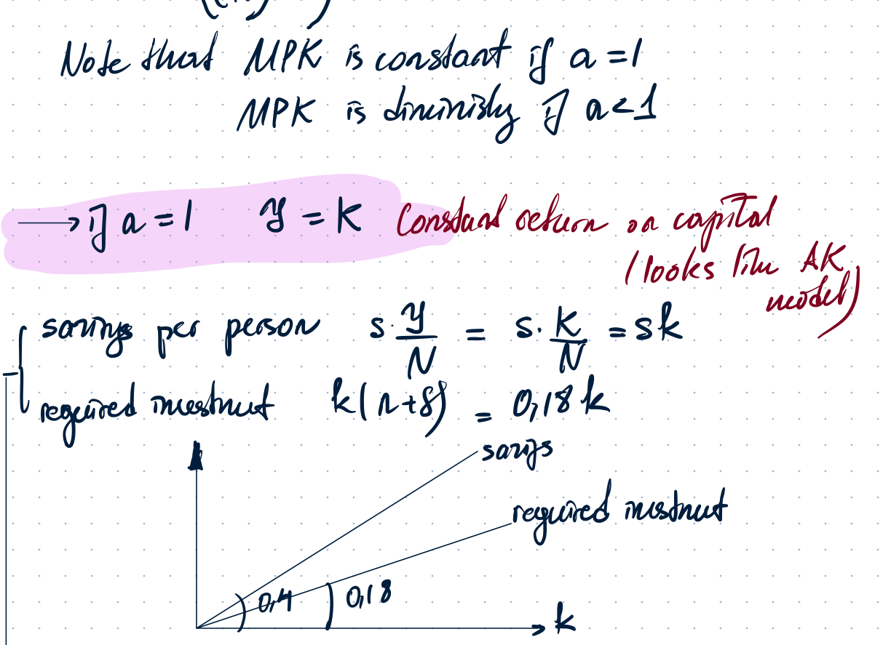
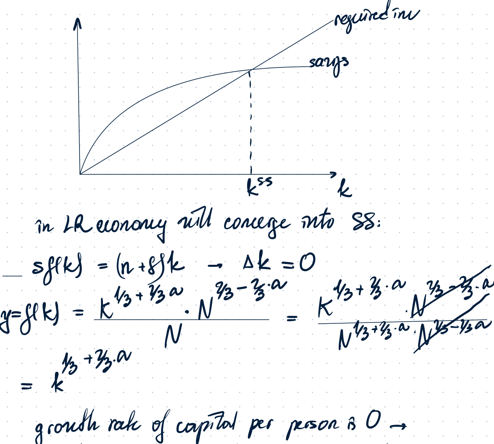
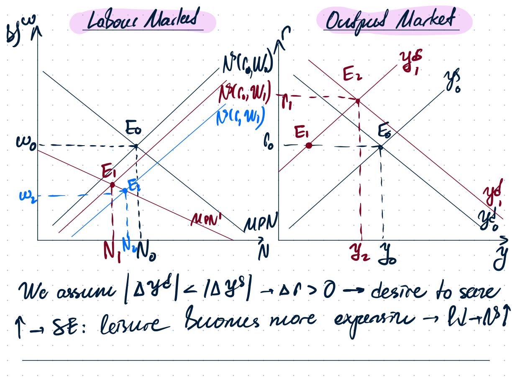
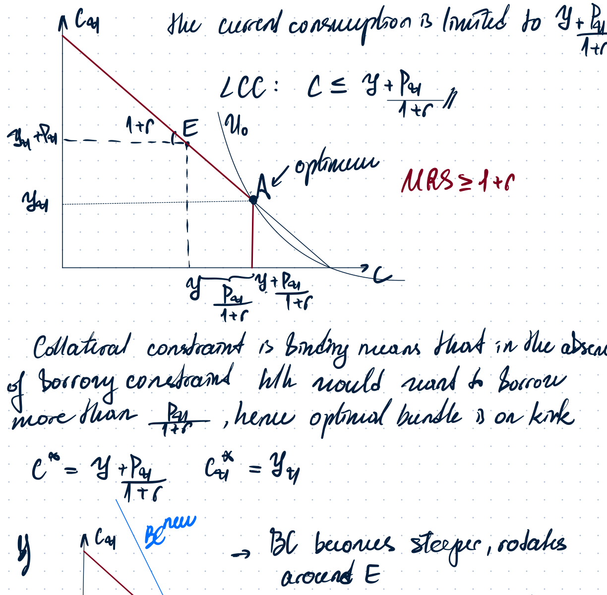
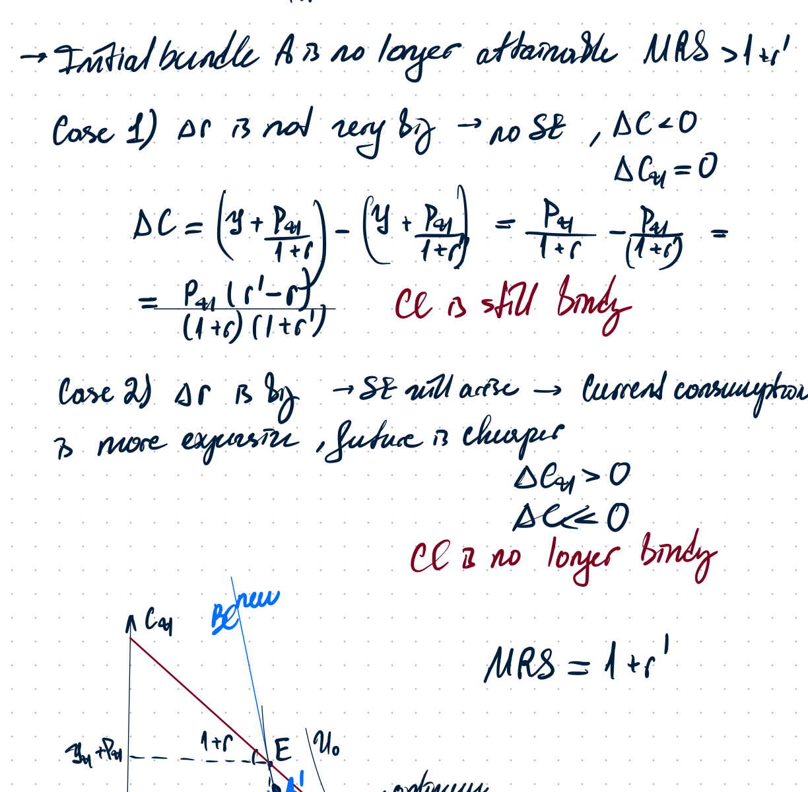
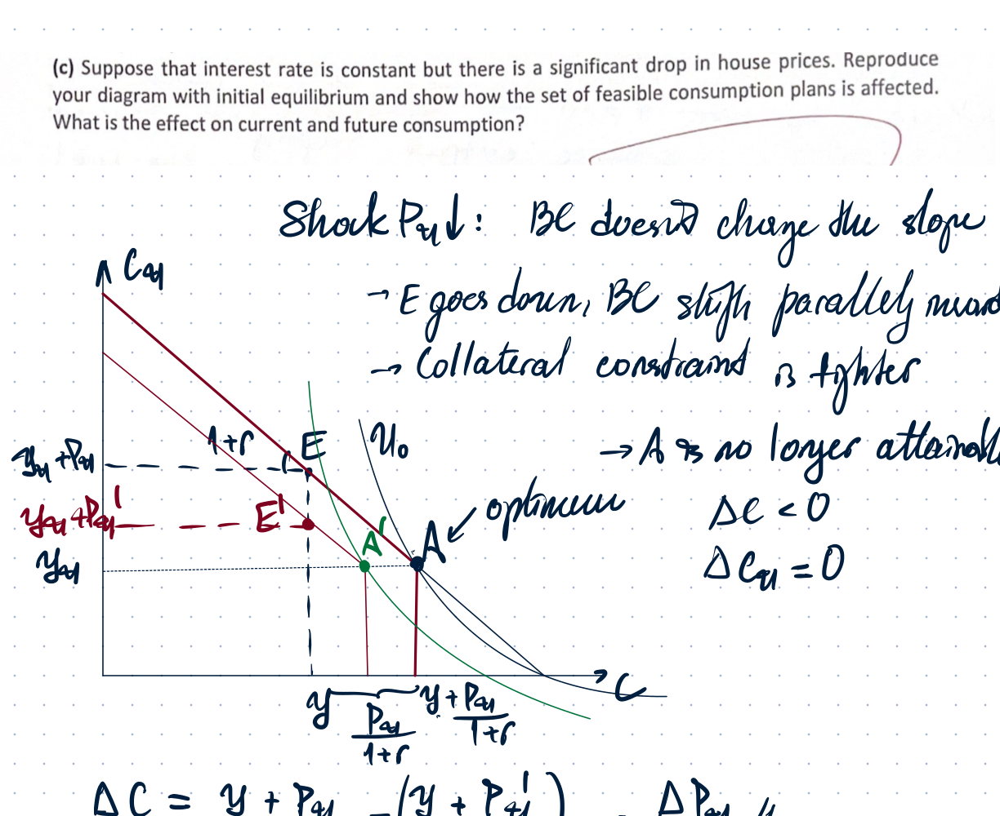
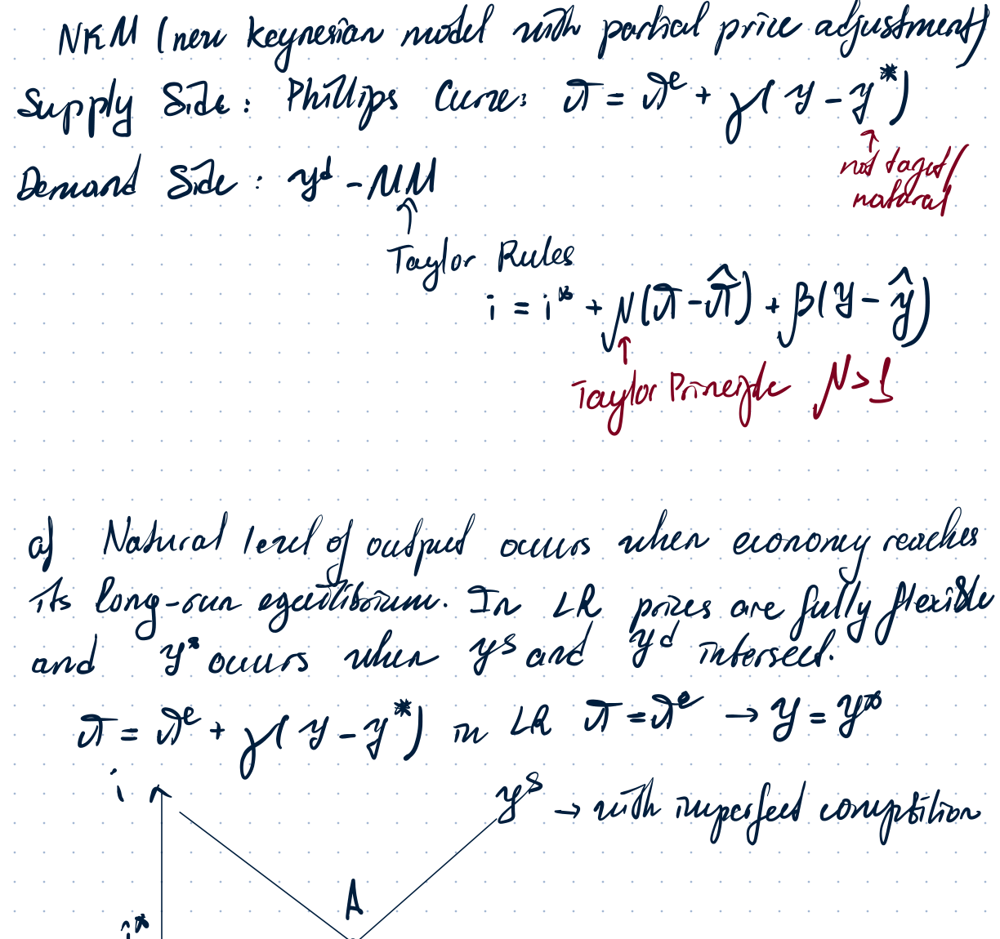
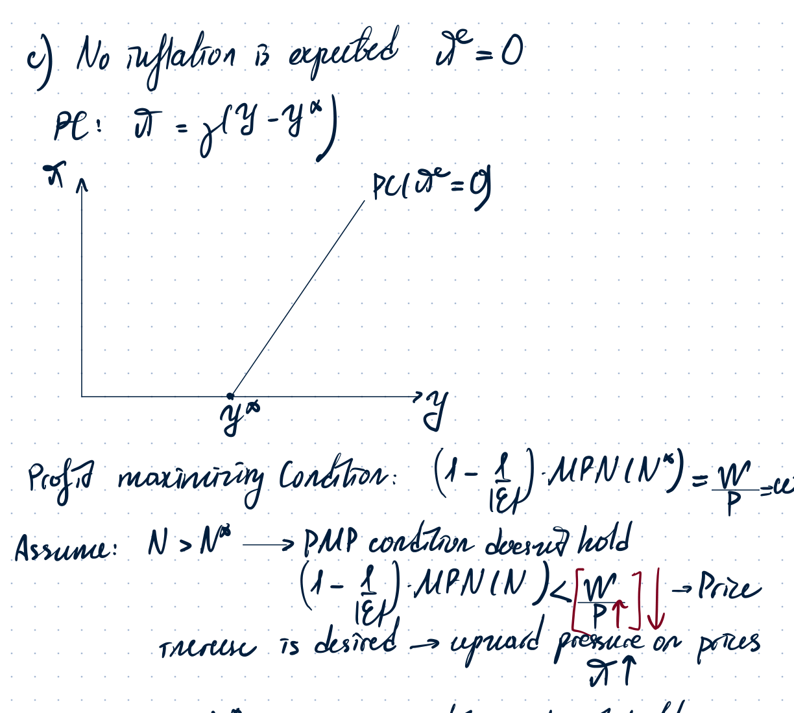
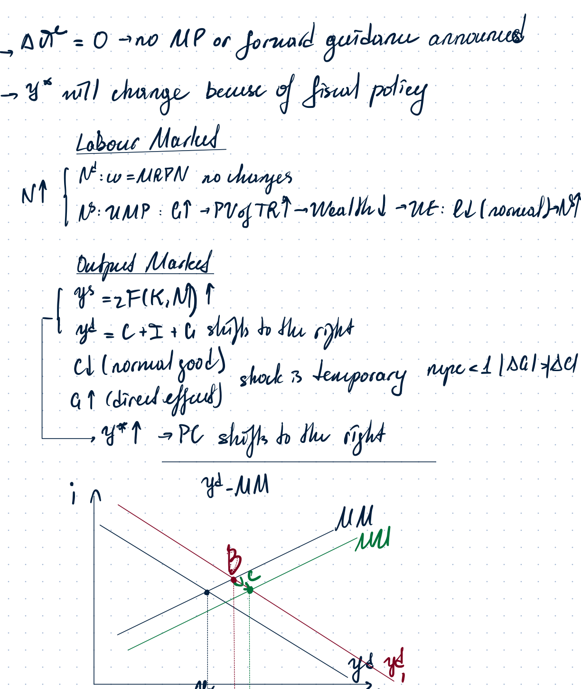
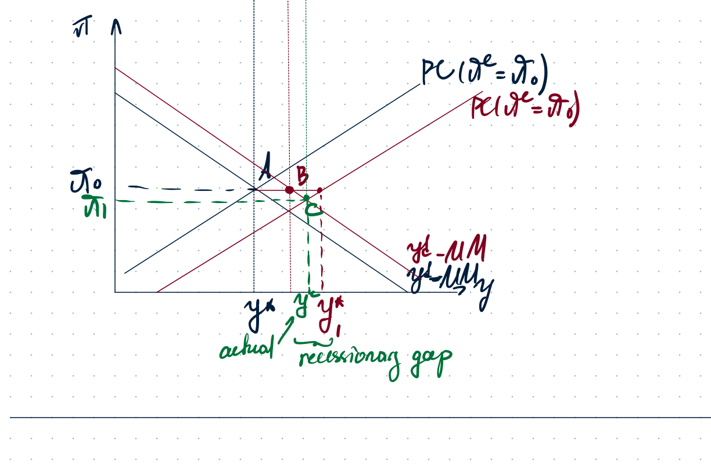

# Recap Notes 1-2

Source: **Recap Notes 1-2 (1).pdf**. Handwritten content has been converted to text where legible. Diagrams are kept as cropped images only where the graph itself is necessary for context.

---

## 1. Retake Exam 2024 September - Solow model with spillovers

### Problem setup

Production function:

$$
y = K^{1/3}(AN)^{1/3}.
$$

Given:

$$
\delta=0.1, \qquad n=0.08, \qquad r=0.05.
$$

Part (a): assume $A$ is constant. Find the saving rate $s$ needed to hit this real interest rate in the long-run equilibrium.

### Part (a): constant $A$

In the Solow steady state:

$$
s f(k) = (n+\delta)k,
$$

where $k=K/(AN)$ and

$$
f(k)=k^{1/3}.
$$

With perfectly competitive markets,

$$
r=MPK-\delta.
$$

Here:

$$
0.05=\frac{1}{3}k^{-2/3}-0.1,
$$

so

$$
0.15=\frac{1}{3}k^{-2/3},
$$

$$
k^{-2/3}=0.45.
$$

Using the steady-state condition:

$$
s k^{1/3}=0.18k,
$$

$$
s=0.18k^{2/3}.
$$

Since $k^{-2/3}=0.45$, then $k^{2/3}=1/0.45$, hence:

$$
s=\frac{0.18}{0.45}=0.4.
$$

**Answer:**

$$
s=0.4.
$$

### Part (b): spillovers, $A=(K/N)^a$

Now:

$$
A=\left(\frac{K}{N}\right)^a, \qquad a\in(0,1].
$$

Substitute into production:

$$
y=K^{1/3}\left[\left(\frac{K}{N}\right)^aN\right]^{1/3}
  =K^{1/3+a/3}N^{1/3-a/3}.
$$

Per-person output is therefore:

$$
\frac{Y}{N}=k^{1/3+a/3}.
$$

The marginal product of capital is constant only if $a=1$; it is diminishing if $a<1$.

#### Case 1: $a=1$

Then:

$$
y=K.
$$

This is effectively an $AK$ model: output is linear in capital and there are constant returns to capital. Per-person output is:

$$
\frac{Y}{N}=\frac{K}{N}=k.
$$

Saving per person:

$$
s\frac{Y}{N}=sk.
$$

Required investment per person:

$$
(n+\delta)k=0.18k.
$$

Since from part (a) $s=0.4>0.18$, actual saving is above required investment for every $k$. Therefore there is no convergence to a steady state and the economy has permanent growth.

The discrete-time growth rate of capital per person is:

$$
g_k=\frac{k_{t+1}}{k_t}-1
   =\frac{(1-\delta+s)K_t}{(1+n)N_t}\frac{N_t}{K_t}-1
   =\frac{1-\delta+s}{1+n}-1.
$$

With $s=0.4$, $\delta=0.1$, and $n=0.08$:

$$
g_k=\frac{1-0.1+0.4}{1.08}-1
    =\frac{1.3}{1.08}-1
    \approx 0.204.
$$

Since $Y/N=k$, the growth rate of output per person is the same:

$$
g_{Y/N}\approx 20.4\%.
$$

#### Case 2: $a<1$

If $a<1$, then:

$$
\frac{1}{3}+\frac{a}{3}<1,
$$

so there are diminishing returns to capital. The economy converges to a steady state. In the long run:

$$
g_k=0, \qquad g_{Y/N}=0.
$$

The parameter $a$ measures the strength of the learning-by-doing effect. If $a=1$, the spillover is strong enough to remove diminishing returns to capital. If $a<1$, the spillover is not strong enough, and the Solow convergence logic remains.

---

## 2. Real dynamic model with investment: one-off capital-scrapping regulation

### Problem setup

The model is the real dynamic general-equilibrium model with investment. A new regulation requires a one-off scrapping of some existing capital that otherwise would have remained in production. The shock is treated as temporary and implemented at the beginning of the first period, so the scrapping must happen immediately.

The shock can be interpreted as:

$$
K_t\downarrow,
$$

with a direct effect on current production capacity and with possible extra investment demand if firms want to restore the capital stock.

### Labour market

Labour demand is chosen by firms through profit/NPV maximization:

$$
w=MPN=F_N(K,N).
$$

Because the production function is neoclassical,

$$
F_{NK}>0.
$$

When existing capital falls, the marginal product of labour falls as well:

$$
K\downarrow \Rightarrow MPN\downarrow.
$$

Therefore labour demand shifts left/down.

Labour supply is chosen by households through the utility-maximization problem. Since part of existing capital has to be scrapped, firm profits fall. This reduces dividends and expected household wealth. Since leisure is a normal good:

$$
\text{wealth}\downarrow \Rightarrow \ell\downarrow \Rightarrow N^s\uparrow.
$$

So labour supply shifts to the right. The final effect on employment is ambiguous in general, but the notes assume the labour-demand fall dominates, so employment falls.

### Output market

Output supply:

$$
y^s=zF(K,N).
$$

The direct capital effect gives:

$$
K\downarrow \Rightarrow y^s\downarrow.
$$

If employment also falls, this further reduces output supply.

Output demand:

$$
y^d=C+I+G.
$$

Government spending is unchanged. Consumption tends to fall due to the negative wealth effect, but investment demand may rise because firms need to replace scrapped capital to reach the desired future capital stock.

The notes assume:

$$
|\Delta y^d|<|\Delta y^s|.
$$

Thus supply falls more than demand, creating excess demand for goods at the initial interest rate. The real interest rate rises:

$$
\Delta r>0.
$$

A higher $r$ increases the desire to save. In the labour market this creates a substitution effect: leisure becomes more expensive, so households supply more labour.

Summary:

$$
K\downarrow \Rightarrow MPN\downarrow \Rightarrow N^d\downarrow,
$$

$$
\text{wealth}\downarrow \Rightarrow \ell\downarrow \Rightarrow N^s\uparrow,
$$

$$
y^s\downarrow, \qquad \Delta r>0.
$$

The graph in the notes shows the labour-demand shift left/down, the labour-supply shift right, and the output-market adjustment with a higher real interest rate.

---

## 3. Limited commitment model with housing collateral

### Problem setup

A household owns a house with expected future value $P_{t+1}$, which can serve as collateral for a loan. The real interest rate is fixed initially. There is no government.

The intertemporal budget constraint is:

$$
c+\frac{c_{t+1}}{1+r}=y+\frac{y_{t+1}+P_{t+1}}{1+r}.
$$

The limited-commitment / collateral constraint is:

$$
c\leq y+\frac{P_{t+1}}{1+r}.
$$

This says that current consumption cannot exceed current income plus the maximum amount that can be borrowed against the future house value.

If the collateral constraint is binding, then without the constraint the household would want to borrow more than

$$
\frac{P_{t+1}}{1+r}.
$$

Therefore the optimum is at the kink of the budget set, denoted by point $A$ in the diagram.

### Initial equilibrium

At the initial equilibrium:

$$
c^*=y+\frac{P_{t+1}}{1+r},
$$

and the household is constrained at the borrowing limit. The marginal rate of substitution at the kink satisfies the relevant inequality for a constrained borrower:

$$
MRS \geq 1+r.
$$

### Interest rate increase

Suppose the central bank raises $r$.

The budget line becomes steeper and rotates around the endowment point $E$. The borrowing limit also tightens because:

$$
\frac{P_{t+1}}{1+r}\downarrow.
$$

So the kink moves left. The initial bundle $A$ is no longer attainable.

#### Case 1: small increase in $r$

If the interest-rate increase is not very large, the collateral constraint remains binding. There is no interior substitution effect because the household is still at the kink. Current consumption falls mechanically with the borrowing limit:

$$
\Delta c=rac{P_{t+1}}{1+r'}-\frac{P_{t+1}}{1+r}<0.
$$

Future consumption stays unchanged in the diagram:

$$
\Delta c_{t+1}=0.
$$

#### Case 2: large increase in $r$

If the interest-rate increase is large enough, the collateral constraint may no longer bind at the new optimum. Then current consumption becomes more expensive relative to future consumption, so the usual substitution effect appears:

$$
c\downarrow, \qquad c_{t+1}\uparrow.
$$

In this case the household moves away from the borrowing limit to an interior optimum satisfying:

$$
MRS=1+r'.
$$

### Fall in house prices

Now suppose the interest rate is unchanged, but the house price falls:

$$
P_{t+1}\downarrow.
$$

The budget-line slope does not change, because $r$ is unchanged. However, the value of collateral falls, so the borrowing limit tightens:

$$
y+\frac{P_{t+1}}{1+r}\downarrow.
$$

Graphically, the kink moves left/down and the feasible set shrinks. The old bundle $A$ is no longer attainable.

If the constraint remains binding, then:

$$
\Delta c=\frac{\Delta P_{t+1}}{1+r}<0,
$$

and in the diagram:

$$
\Delta c_{t+1}=0.
$$

So the main effect is a fall in current consumption because households can borrow less against housing collateral.

---

## 4. New Keynesian model with partial price adjustment

### Model setup

This is the New Keynesian model with partial price adjustment.

Supply side: Phillips curve

$$
\pi=\pi^e+\gamma(y-y^*), \qquad \gamma>0.
$$

Demand side: output-market relation, summarized by the $y^d-MM$ curve.

Taylor rule:

$$
i=\hat r+\mu(\pi-\hat\pi)+\beta(y-\hat y),
$$

where the Taylor principle requires:

$$
\mu>1.
$$

The central bank must raise the nominal interest rate by more than the increase in inflation so that the real interest rate also rises.

### Natural level of output

The natural level of output $y^*$ is the output level reached in long-run equilibrium, when prices are fully flexible.

In the long run:

$$
\pi=\pi^e,
$$

so from the Phillips curve:

$$
y=y^*.
$$

In a standard supply-demand diagram this is where output supply and output demand intersect under flexible prices.

### Socially efficient level of output

The socially efficient level of output is the output level that would arise under:

- perfect competition;
- no market frictions;
- complete markets.

In the New Keynesian model, even in the long run with flexible prices, firms have market power. The firm's profit-maximizing condition is:

$$
w=\left(1-\frac{1}{\varepsilon}\right)MPN<MPN.
$$

The household UMP condition gives:

$$
w=MRS_{\ell,c}.
$$

Therefore in equilibrium:

$$
MPN>MRS_{\ell,c}.
$$

This means employment is inefficiently low:

$$
N^*<N^{SE},
$$

and output is inefficiently low:

$$
y^*<y^{SE}.
$$

Other inefficiencies may also occur even in the long run, such as credit-market imperfections, asymmetric information, efficiency wages, proportional taxes, or cash-in-advance constraints.

### Phillips curve with no expected inflation

If no inflation is expected:

$$
\pi^e=0,
$$

then the Phillips curve becomes:

$$
\pi=\gamma(y-y^*).
$$

If $N>N^*$, then the firm's profit-maximization condition does not hold: marginal profit is too low and a price increase is desired. This creates upward pressure on prices.

If $N<N^*$, then firms want to reduce prices, creating downward pressure on prices.

The Phillips curve therefore passes through:

$$
(y^*,0).
$$

### Expansionary fiscal policy with no monetary-policy response

Suppose fiscal policy expands:

$$
\Delta G>0, \qquad \Delta T=0,
$$

and there is no announced monetary-policy response or forward guidance:

$$
\Delta \pi^e=0.
$$

Output demand:

$$
y^d=C+I+G.
$$

The direct effect of higher government spending shifts output demand to the right. Consumption may fall because higher future taxes reduce wealth, but the notes assume the fiscal shock is temporary, so the direct $G$ effect dominates:

$$
|\Delta G|>|\Delta C|.
$$

Thus:

$$
y^d \text{ shifts right.}
$$

On the labour-market side, the wealth effect from a higher present value of future taxes reduces leisure demand, so labour supply tends to increase. This can raise the natural level of output:

$$
y^*\uparrow.
$$

The graph shows both the demand-side movement and the shift in the Phillips curve associated with the change in the natural level of output.

In the final diagram, the demand-side curve shifts right, while the Phillips curve also shifts because $y^*$ changes. The notes show a case where the new natural level of output moves farther right than actual output, producing a recessionary gap:

$$
y_1<y^{*'}.
$$

With no change in expected inflation, the new inflation rate is read from the shifted Phillips curve:

$$
\pi_1<\pi_0
$$

in the drawn case.

---

## 5. Key formula list

### Solow model

Steady state:

$$
sf(k)=(n+\delta)k.
$$

Perfect competition:

$$
r=MPK-\delta.
$$

With $A=(K/N)^a$:

$$
\frac{Y}{N}=k^{(1+a)/3}.
$$

If $a=1$, the model behaves like an $AK$ model and can generate permanent growth. If $a<1$, returns to capital are diminishing and the economy converges to a steady state.

### Limited commitment

Budget constraint:

$$
c+\frac{c_{t+1}}{1+r}=y+\frac{y_{t+1}+P_{t+1}}{1+r}.
$$

Collateral constraint:

$$
c\leq y+\frac{P_{t+1}}{1+r}.
$$

If the collateral constraint binds, current consumption is pinned down by the borrowing limit:

$$
c=y+\frac{P_{t+1}}{1+r}.
$$

### New Keynesian partial price adjustment

Phillips curve:

$$
\pi=\pi^e+\gamma(y-y^*).
$$

Taylor rule:

$$
i=\hat r+\mu(\pi-\hat\pi)+\beta(y-\hat y), \qquad \mu>1.
$$

With no expected inflation:

$$
\pi=\gamma(y-y^*).
$$
