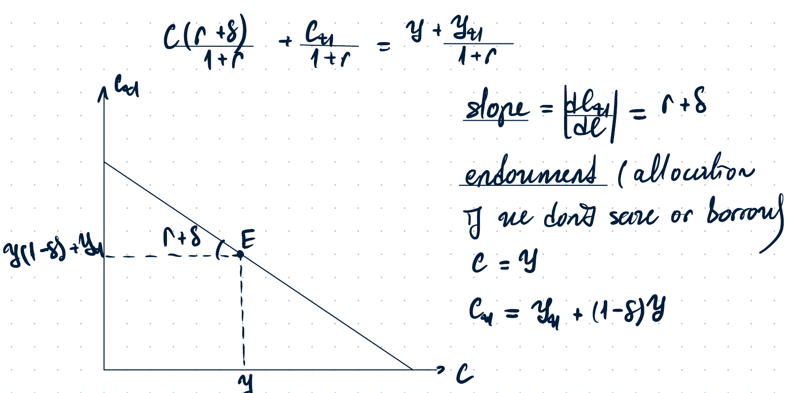
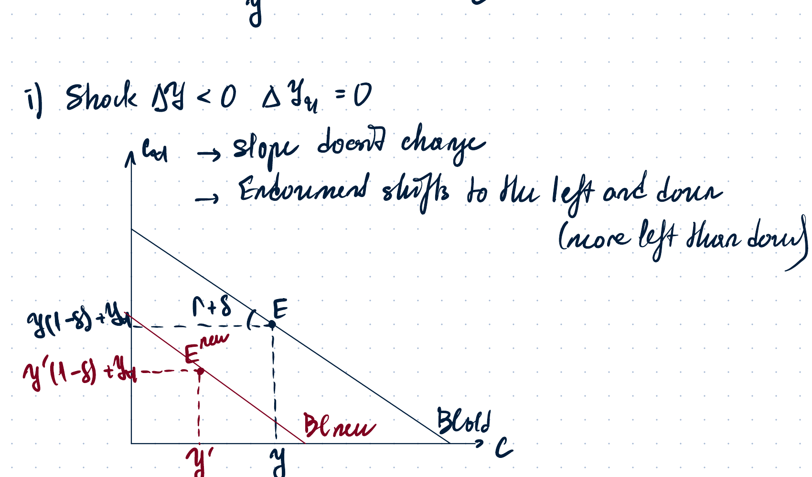
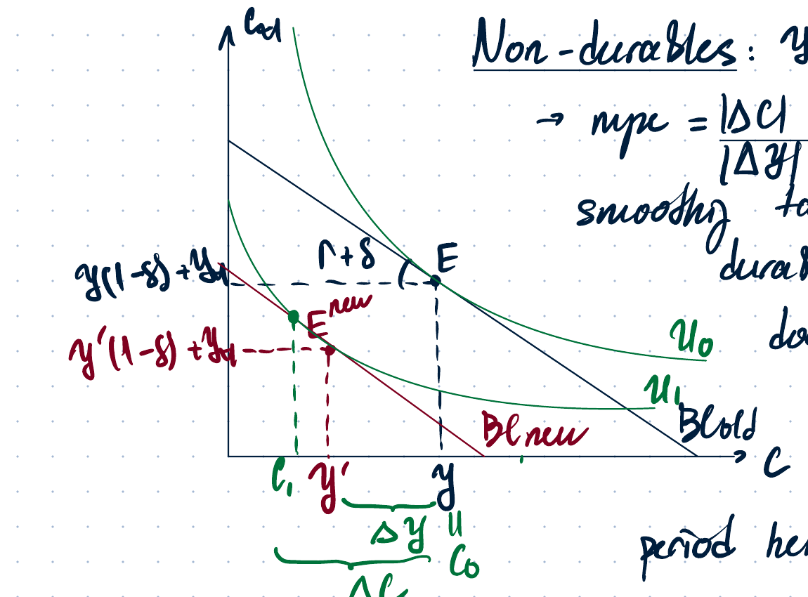

# September Retake 2025

## 1. Fisher's intertemporal consumption choice with durable goods

### Problem setup

Consider a two-period model of consumption choice with fixed real interest rate. Income in every period is exogenous and there are no taxes. The household has diminishing MRS and consumption in every period is a normal good.

The household faces a temporary negative current-period income shock:

$$
\Delta y < 0, \qquad \Delta y_{t+1}=0.
$$

The consumption good is durable. Purchases of new durables in the current and future periods are denoted by $x_t$ and $x_{t+1}$. A negative value of $x_t$ means selling previously acquired durables. Durables depreciate at rate $\delta$, where

$$
0<\delta<1.
$$

The household starts with zero stock of durable goods. The variables $c_t$ and $c_{t+1}$ denote benefits from using durable goods, not new purchases. Hence:

$$
c_t=x_t,
$$

$$
c_{t+1}=x_{t+1}+(1-\delta)c_t,
$$

with

$$
c_t\ge 0, \qquad c_{t+1}\ge 0.
$$

The task is to find the initial endowment and budget line, then show how a temporary negative current-income shock affects durable consumption.

### Deriving the budget line

Start from purchases of durable goods. Let $S$ be saving in the current period.

$$
x_t=y-S,
$$

$$
x_{t+1}=y_{t+1}+S(1+r).
$$

Therefore,

$$
S=\frac{x_{t+1}-y_{t+1}}{1+r}.
$$

Substitute into $x_t=y-S$:

$$
x_t+rac{x_{t+1}}{1+r}=y+rac{y_{t+1}}{1+r}.
$$

Because $x_t=c_t$ and $x_{t+1}=c_{t+1}-(1-\delta)c_t$, we get:

$$
c_t+\frac{c_{t+1}-(1-\delta)c_t}{1+r}=y+rac{y_{t+1}}{1+r}.
$$

Equivalently:

$$
\frac{(r+\delta)c_t}{1+r}+\frac{c_{t+1}}{1+r}=y+rac{y_{t+1}}{1+r}.
$$

Multiplying by $1+r$ gives the compact budget line:

$$
(r+\delta)c_t+c_{t+1}=(1+r)y+y_{t+1}.
$$

With $c_t$ on the horizontal axis and $c_{t+1}$ on the vertical axis, the absolute value of the slope is:

$$
\left|\frac{dc_{t+1}}{dc_t}\right|=r+\delta.
$$

### Initial endowment allocation

If the household does not save or borrow, then:

$$
c_t=y,
$$

$$
c_{t+1}=y_{t+1}+(1-\delta)y.
$$

This is the initial endowment point $E$.

The black budget line passes through $E$. The vertical coordinate of $E$ is $y_{t+1}+(1-\delta)y$, while the horizontal coordinate is $y$. The slope is $-(r+\delta)$.

### Temporary negative current-income shock

The shock is:

$$
\Delta y<0, \qquad \Delta y_{t+1}=0.
$$

The slope of the budget line does not change, since $r$ and $\delta$ are unchanged. The endowment shifts left and down:

$$
E=(y,\ y_{t+1}+(1-\delta)y),
$$

$$
E^{new}=(y',\ y_{t+1}+(1-\delta)y'), \qquad y'<y.
$$

The horizontal fall is:

$$
\Delta y=y'-y<0.
$$

The vertical fall is:

$$
(1-\delta)\Delta y.
$$

Since $0<1-\delta<1$, the endowment moves more to the left than down.

The blue/black line is the old budget line and the red line is the new budget line. The new budget line is parallel to the old one. The new endowment $E^{new}$ lies left and below $E$.

### Why durable consumption is more volatile than income

From the graph, the fall in current durable consumption is larger than the fall in current income:

$$
|\Delta c_t|>|\Delta y|.
$$

So the response of current durable consumption is more than proportional:

$$
\frac{|\Delta c_t|}{|\Delta y|}>1.
$$

For non-durable goods, a temporary negative income shock is smoothed over time:

$$
\frac{|\Delta c_t|}{|\Delta y|}<1.
$$

With durable goods, the standard consumption-smoothing logic works differently. The household receives services from the durable stock for more than one period. By reducing current durable consumption or purchases, the household also affects future durable services. Therefore the adjustment in current durable consumption is stronger than in the non-durable case.

The qualitative result is the same in both cases: current and future consumption fall after a negative temporary income shock. The difference is that with non-durable goods the expenditure response is smoothed across periods, while with durable goods current purchases and the durable stock create a stronger current-period adjustment.

---

## 2. Real dynamic model with investment and a temporary increase in $a$

### Problem setup

Consider a closed economy described by the real dynamic model with investment. The production function is:

$$
y=zF(aK,N),
$$

where $a>0$ is a positive parameter. Initially $a$ is the same in every period. Then, due to a temporary policy or regulation change, $a$ increases by $20\%$ in the current period only. The next-period value of $a$ is not affected and this is common knowledge.

The shock is:

$$
\Delta a>0, \qquad \Delta a_{t+1}=0.
$$

This acts like a temporary increase in effective capital in the current period.

### Labour demand

Labour demand is chosen by firms through profit maximization. The relevant condition is:

$$
w=zF_N(aK,N).
$$

An increase in $a$ raises the marginal product of labour:

$$
a\uparrow \Rightarrow MPN\uparrow.
$$

Therefore labour becomes more productive and firms want to hire more labour at each real wage. Labour demand shifts to the right:

$$
N^d \uparrow.
$$

### Labour supply

The increase in productivity raises firm profits and dividends. Household wealth rises:

$$
\text{profits}\uparrow \Rightarrow \text{dividends}\uparrow \Rightarrow \text{wealth}\uparrow.
$$

Since leisure is a normal good, households want more leisure:

$$
\ell \uparrow.
$$

Therefore labour supply shifts to the left:

$$
N^s \downarrow.
$$

The notes assume wealth effects are small. Hence the labour-demand shift dominates the labour-supply shift, so equilibrium labour increases:

$$
|\Delta N^s|<|\Delta N^d| \Rightarrow N\uparrow.
$$

### Output supply

Output supply is:

$$
y^s=zF(aK,N).
$$

There are two effects:

$$
a\uparrow \Rightarrow y^s\uparrow,
$$

and, because equilibrium labour rises,

$$
N\uparrow \Rightarrow y^s\uparrow.
$$

Therefore the output supply curve shifts to the right.

### Output demand

Output demand is:

$$
y^d=C+I+G.
$$

Consumption increases because wealth rises and consumption is a normal good:

$$
\text{wealth}\uparrow \Rightarrow C\uparrow.
$$

Government spending is unchanged:

$$
\Delta G=0.
$$

Investment is unchanged because the shock to $a$ is only temporary and next-period productivity is unchanged. Desired future capital is determined by the future marginal product condition:

$$
z_{t+1}F_K(a_{t+1}K_{t+1},N_{t+1})-\delta=r.
$$

Since $a_{t+1}$ is unchanged, desired $K_{t+1}$ and hence investment do not change:

$$
I=K_{t+1}-K(1-\delta) \quad \text{unchanged}.
$$

Thus output demand shifts to the right mainly because consumption rises:

$$
y^d \uparrow.
$$

### Summary table

| Curve | Effect | Reason |
|---|---:|---|
| Labour demand $N^d$ | shifts right | $a\uparrow \Rightarrow MPN\uparrow$ |
| Labour supply $N^s$ | shifts left | profits/dividends/wealth rise; leisure is normal |
| Equilibrium labour $N$ | rises | wealth effect is small, demand effect dominates |
| Output supply $y^s$ | shifts right | direct productivity effect and higher $N$ |
| Output demand $y^d$ | shifts right | $C\uparrow$, while $I$ and $G$ are unchanged |
