# Week 1.2 - Malthus Model

This Markdown version preserves the lecture-note context by combining a cleaned transcription with the original page images. Mathematical expressions are written in LaTeX. Graphs and diagrams are embedded as images.

---

## Page 1 - Malthus model of population growth

**Core variables:** land, labour/population, total factor productivity.

$$
Y=zF(L,K,N)
$$

where:

- $z$ = total factor productivity,
- $L$ = land,
- $K$ = capital,
- $N$ = labour / population.

Default production function in the notes:

$$
Y=zF(L,K,N)
$$

### Neoclassical production function

Constant returns to scale:

$$
F(\lambda L,\lambda K,\lambda N)=\lambda F(L,K,N)
$$

The function is homogeneous of degree 1. By Euler's theorem:

$$
\frac{\partial zF}{\partial L}L+\frac{\partial zF}{\partial K}K+\frac{\partial zF}{\partial N}N=zF(L,K,N)=Y.
$$

Equivalently:

$$
MPL\cdot L+MPK\cdot K+MPN\cdot N=Y.
$$

With competitive factor prices:

$$
R_L L+(r+\delta)K+wN=Y,
$$

so with CRS and perfect competition profits are zero:

$$
\pi=0.
$$

Marginal products are positive:

$$
F_L>0,\qquad F_N>0,\qquad F_K>0.
$$

Marginal products are diminishing:

$$
F_{LL}<0,\qquad F_{NN}<0,\qquad F_{KK}<0.
$$

Complementarity examples from the notes:

$$
\frac{\partial^2F}{\partial L\partial N}=\frac{\partial^2F}{\partial N\partial L}=(MPL)'_N>0,
$$

$$
\frac{\partial^2F}{\partial L\partial K}=\frac{\partial^2F}{\partial K\partial L}=(MPL)'_K>0.
$$

Full page image

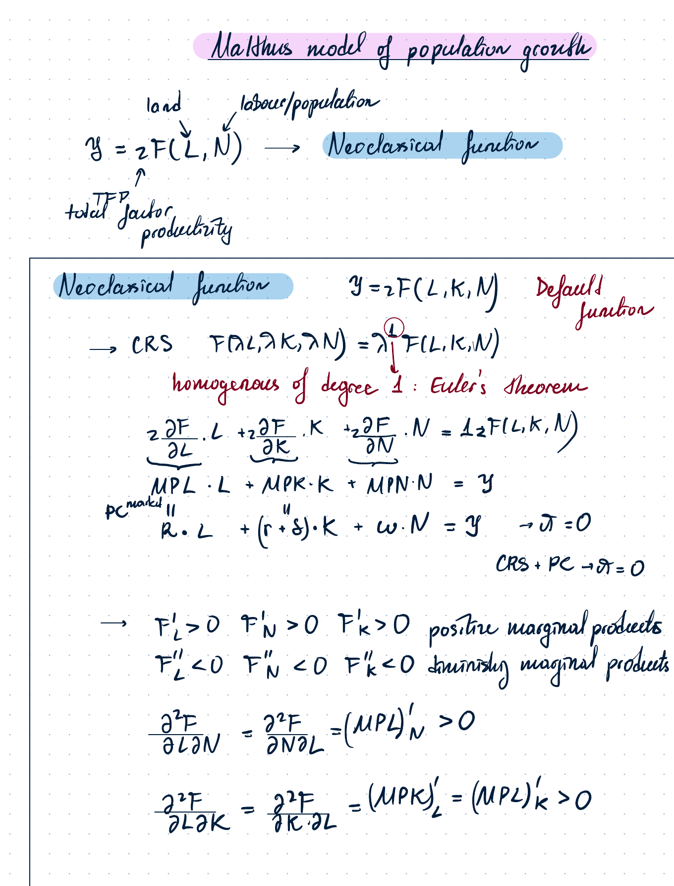

---

## Page 2 - Boundary and Inada conditions

Boundary conditions:

$$
Y=zF(0,K,N)=0,
$$

$$
Y=zF(L,0,N)=0,
$$

$$
Y=zF(L,K,0)=0.
$$

### Inada conditions

The notes list Inada conditions as sufficient, but not necessary, to guarantee the existence of a non-trivial steady state.

For land:

$$
\lim_{L\to 0}Y'_L=\infty, \qquad \lim_{L\to \infty}Y'_L=0.
$$

For labour:

$$
\lim_{N\to 0}Y'_N=\infty, \qquad \lim_{N\to \infty}Y'_N=0.
$$

For capital:

$$
\lim_{K\to 0}Y'_K=\infty, \qquad \lim_{K\to \infty}Y'_K=0.
$$

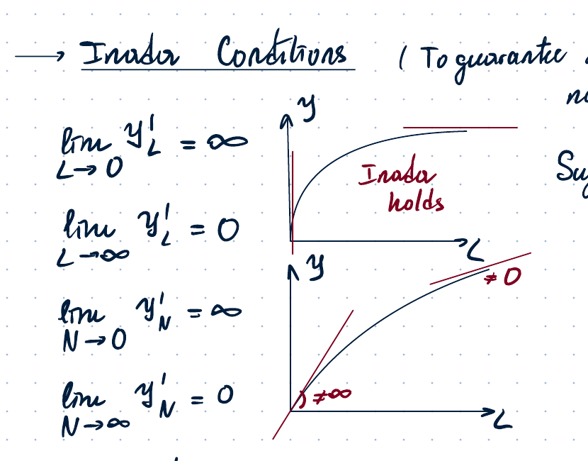

### Malthusian simplifications

Land has fixed supply. There is no capital in the old Malthusian model because it describes a pre-industrial, agricultural economy.

GDP per capita / output per worker:

$$
\frac{Y}{N}=\frac{zF(L,N)}{N}=zF\left(\frac{L}{N},1\right)\equiv zf(\ell),
$$

where:

$$
\ell=\frac{L}{N}.
$$

Full page image

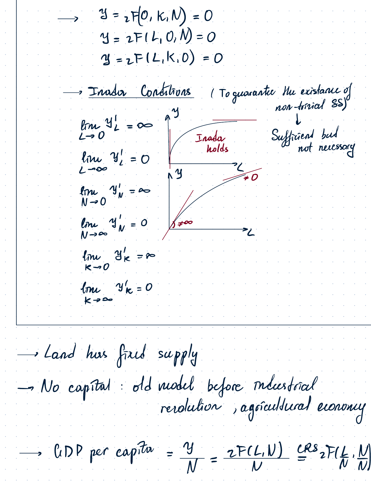

---

## Page 3 - Closed economy and demography

Closed economy with no government:

$$
Y=C.
$$

All output is consumed:

$$
y=c.
$$

Living standards are measured by consumption per capita:

$$
\frac{Y}{N}=\frac{C}{N},
$$

so:

$$
y=c.
$$

### Demographic function

The demographic function is:

$$
\frac{N_{t+1}}{N_t}=g(c), \qquad g'(c)>0.
$$

Population growth:

$$
g_N=\frac{N_{t+1}-N_t}{N_t}=g(c)-1.
$$

Intuition: if consumption rises, nutrition and health improve; birth rate/fertility rises and death rate/mortality falls, so:

$$
N_{t+1}>N_t.
$$

### Steady state condition

In steady state:

$$
N_{t+1}=N_t,
$$

therefore:

$$
g(c)=1,
$$

and:

$$
g_N=0.
$$

Full page image

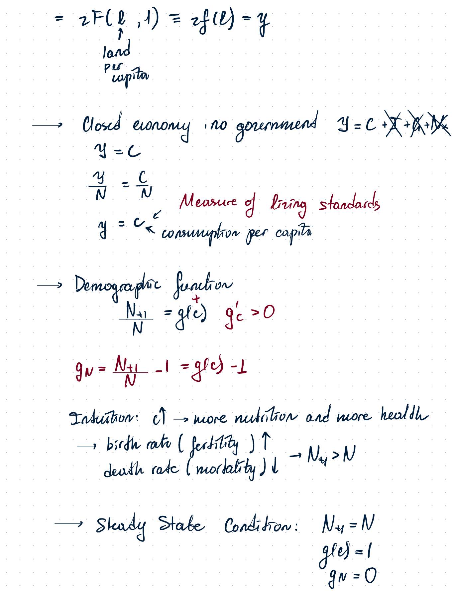

---

## Page 4 - Production, demography, movements, and shifts

The two basic diagrams are:

1. Production/living-standards diagram:

$$
c=y=zf(\ell), \qquad zf'(\ell)>0,\qquad zf''(\ell)<0.
$$

2. Demographic diagram:

$$
\frac{N_{t+1}}{N_t}=g(c).
$$

The steady state is where:

$$
g(c^A)=1.
$$

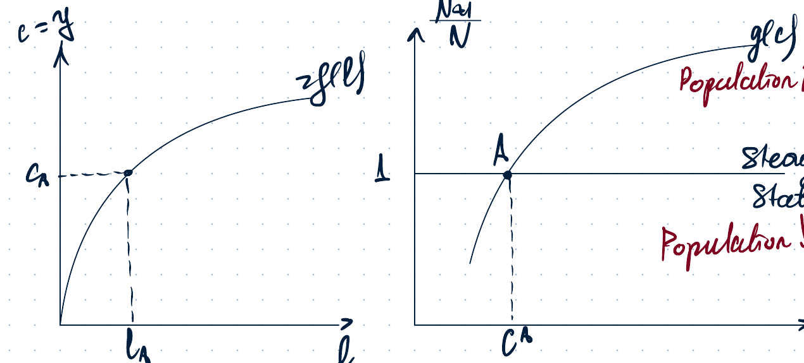

### Movements and shifts

- If $\ell=L/N$ changes, there is movement along the production function.
- If $c$ or $y$ changes, there is movement along the demographic function.
- If $z$ changes, the production function shifts proportionally.
- Advances or losses in demography shift $g(c)$ up or down.

Examples of demographic shocks in the notes:

- pandemic,
- medicine / antibiotics,
- one-child policy,
- war,
- immigration rules.

Full page image

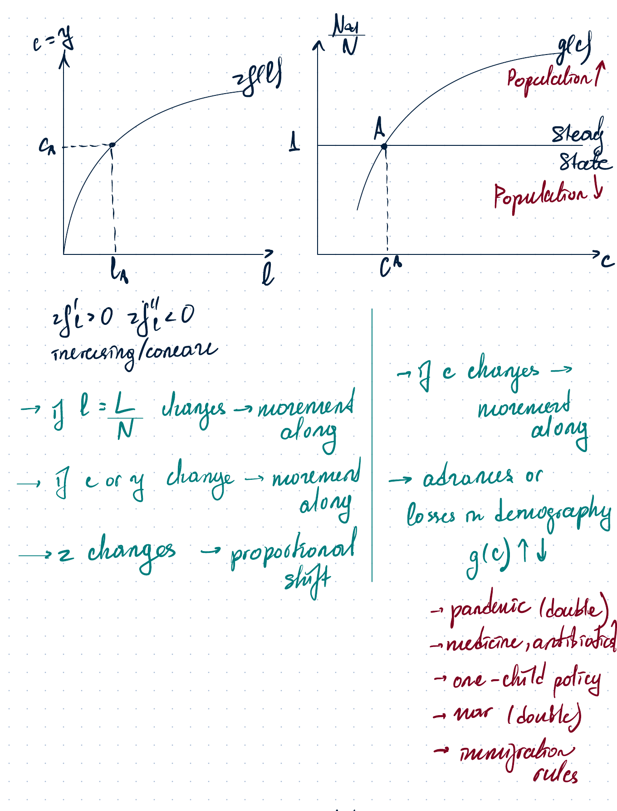

---

## Page 5 - Land rent, wage rate, and Problem 5

### Land rent

Land rent is the marginal product of land:

$$
R=X=MPL=\left(zF(L,N)\right)'_L.
$$

Using the per-worker form $Y=zf(\ell)N$:

$$
R=\left(zf\left(\frac{L}{N}\right)N\right)'_L
=zNf'(\ell)\frac{1}{N}=zf'(\ell).
$$

The derivative with respect to $\ell$ is:

$$
R'_{\ell}=zf''(\ell)<0.
$$

Therefore:

$$
\ell\uparrow \Rightarrow R\downarrow.
$$

Intuition: if land becomes less relatively scarce, land rent falls.

The notes distinguish which form to use:

- use $zF(L,N)'_L$ if only $L$ or $N$ changes;
- use $zf'(\ell)$ if both $L$ and $N$ change through $\ell$.

### Wage rate

The wage rate is the marginal product of labour:

$$
w=MPN=Y'_N=\left(zF(L,N)\right)'_N.
$$

Using the per-worker form:

$$
w=\left(zf\left(\frac{L}{N}\right)N\right)'_N
=z f'(\ell)\left(-\frac{L}{N^2}\right)N+zf(\ell)
=zf(\ell)-\ell zf'(\ell).
$$

The derivative with respect to $\ell$:

$$
w'_\ell=zf'(\ell)-zf'(\ell)-\ell zf''(\ell)=-\ell zf''(\ell)>0.
$$

Therefore:

$$
\ell\uparrow \Rightarrow w\uparrow.
$$

Intuition: if labour becomes relatively scarce, the wage rate rises.

### Problem 5

> Consider a Malthusian Model of population growth described at the lecture. Find algebraically and explain intuitively the immediate and the long-run change due to a one-time decrease in population as a result of migration. Do not produce graphs.

Shock:

$$
N\downarrow.
$$

This is a one-time change, so the demographic function $g(c)$ is unchanged.

Full page image

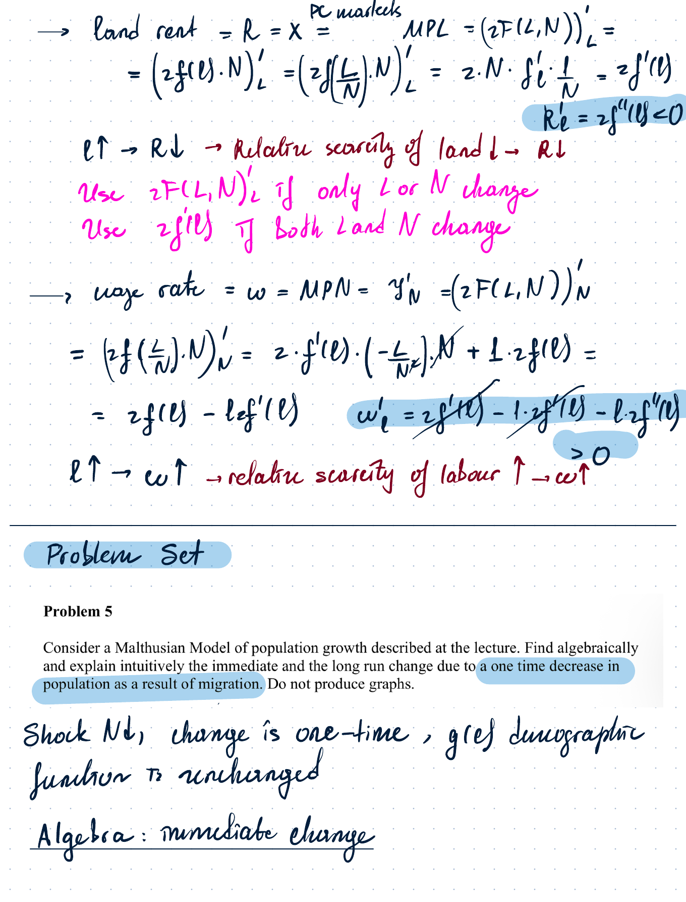

---

## Page 6 - Problem 5: immediate and long-run algebra

### Immediate change

Population falls:

$$
N\downarrow.
$$

Land is fixed, so land per worker rises:

$$
\ell=\frac{L}{N}\uparrow.
$$

Per-worker output and consumption rise:

$$
c=y=\frac{Y}{N}=zf(\ell)\uparrow.
$$

Real wage:

$$
w=zF_N(L,N)=zf(\ell)-\ell zf'(\ell).
$$

Since the marginal product of labour is diminishing in $N$:

$$
N\downarrow \Rightarrow MPN\uparrow \Rightarrow w\uparrow.
$$

Land rent:

$$
X=R=zF_L(L,N)=zf'(\ell).
$$

Since $MPL_N>0$, a fall in $N$ reduces the marginal product of land:

$$
N\downarrow \Rightarrow R\downarrow.
$$

### Long run

The economy converges to steady state:

$$
N_{t+1}=N_t, \qquad g(c)=1.
$$

The demographic function is unchanged, so long-run consumption per worker returns to the initial steady-state level:

$$
\Delta c^{LR}=0.
$$

Since:

$$
y=zf(\ell),
$$

long-run output per worker also returns to the initial level:

$$
\Delta y^{LR}=0.
$$

Therefore:

$$
\Delta \ell^{LR}=0.
$$

With fixed land $L$, this implies:

$$
\Delta N^{LR}=0.
$$

Since $L$ and $N$ are unchanged in the long run:

$$
\Delta R^{LR}=0, \qquad \Delta w^{LR}=0.
$$

Full page image

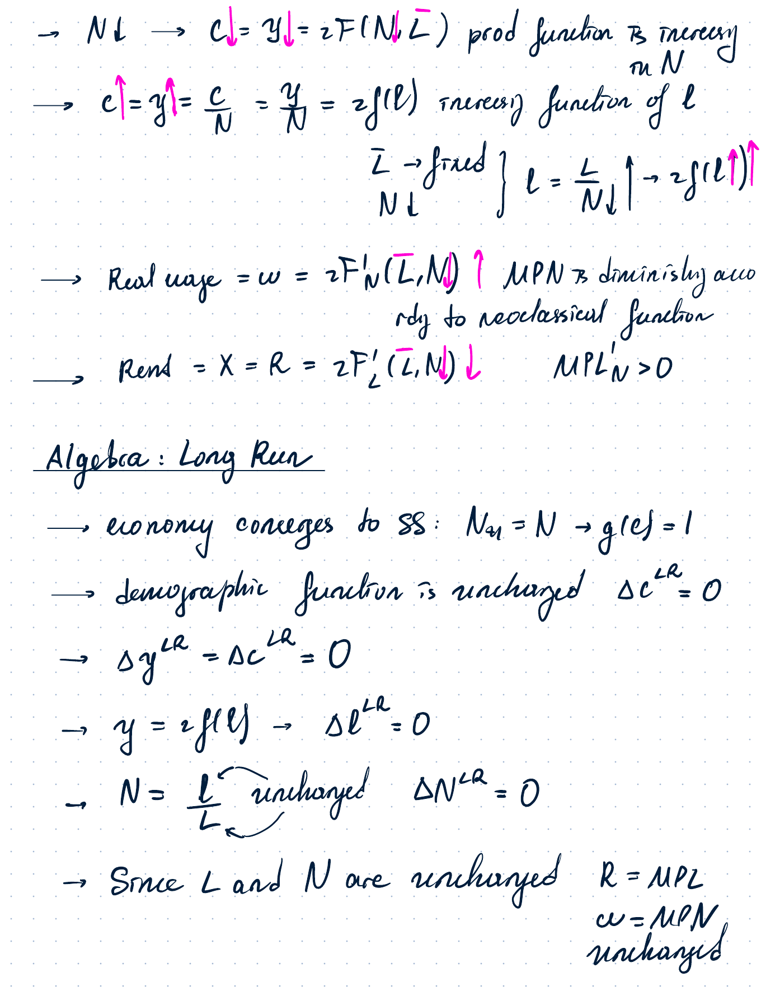

---

## Page 7 - Problem 5: intuition

### Immediate change

A fall in population means more land per worker. Each worker produces and consumes more. Reduced population raises the scarcity of workers and reduces the scarcity of land, so:

$$
w\uparrow, \qquad R\downarrow.
$$

### Long-run intuition

Higher consumption per worker means better nutrition and health. This raises fertility and reduces mortality, so the new generation exceeds the previous one:

$$
N_{t+1}>N_t.
$$

As population rises again, output and consumption per worker fall back. Population returns to the initial level, and relative scarcity returns to its initial state. Hence wages and land rent return to their initial values.

The notes summarize the mechanism as:

- direct effect of migration occurs first;
- indirect effect of renewed population growth later cancels it out;
- the economy moves back to the initial steady state.

Full page image

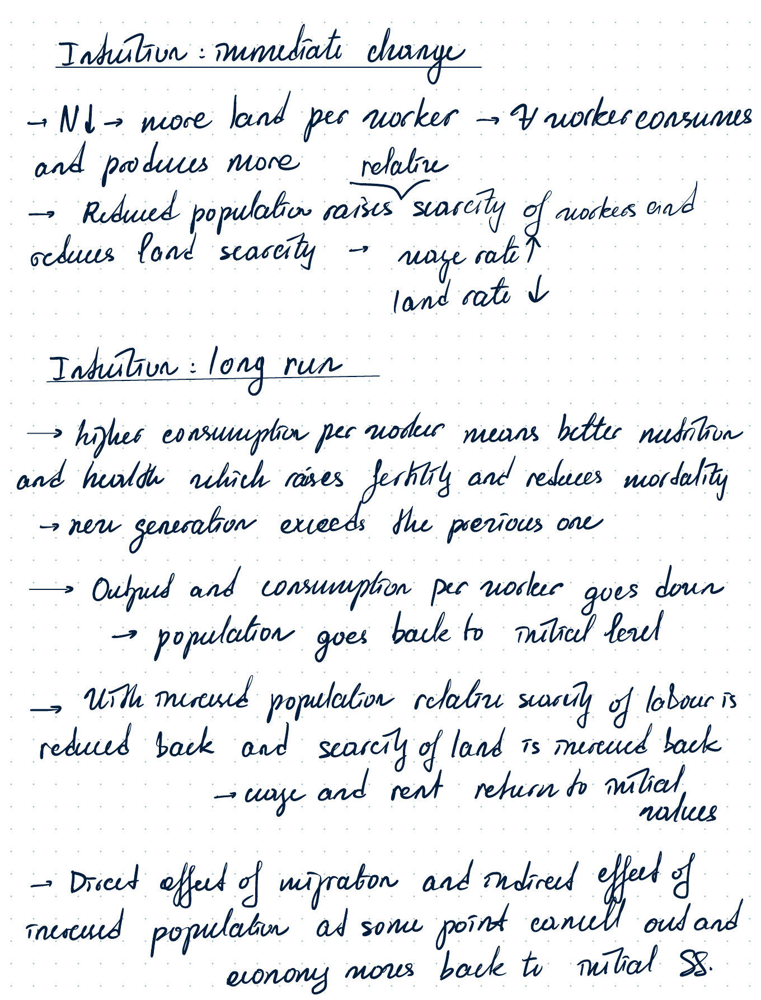

---

## Page 8 - Technology improvement in the Malthusian model

Class 1, Problem 2 / Problem 6 from the problem set.

> Consider the Malthusian model developed at the lecture.  
> (a) Suppose new technologies are discovered and raise TFP from $z_0$ to $z_1$. What is the immediate impact of the new technology on per person consumption before there is any adjustment of population $N$? What would happen to $c$ in the long run?  
> (b) Intuitively explain why the findings in (a) mean that the Malthusian model can explain rising population but stagnating living standards for much of history, even though new technologies were being discovered.  
> (c) Now assume that $g(c)$ is not increasing for all levels of living standards. After rising above 1, for sufficiently high living standards, birth rates decline and $g(c)$ becomes decreasing. Explain this alternative assumption; does this mean the economy has a steady state with higher living standards after increase in $g(c)$?

Better technology shifts up the per-worker production function:

$$
z_0f(\ell) \rightarrow z_1f(\ell), \qquad z_1>z_0.
$$

Immediate change: before there is any adjustment of population $N$, land per worker is still the same:

$$
\ell=\frac{L}{N}\quad \text{unchanged}.
$$

Therefore:

$$
c=y=zf(\ell)\uparrow.
$$

The demographic diagram then implies population growth because higher $c$ raises $g(c)$:

$$
g(c)>1 \Rightarrow N_{t+1}>N_t.
$$

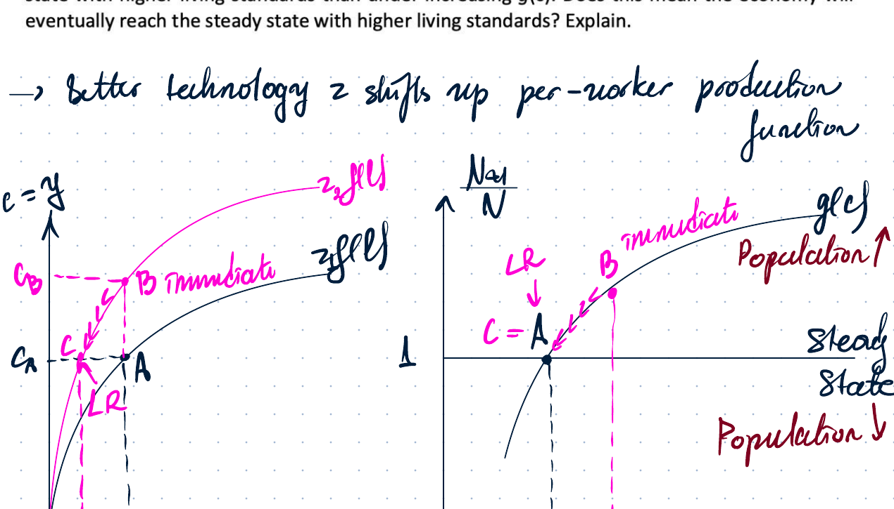

Full page image

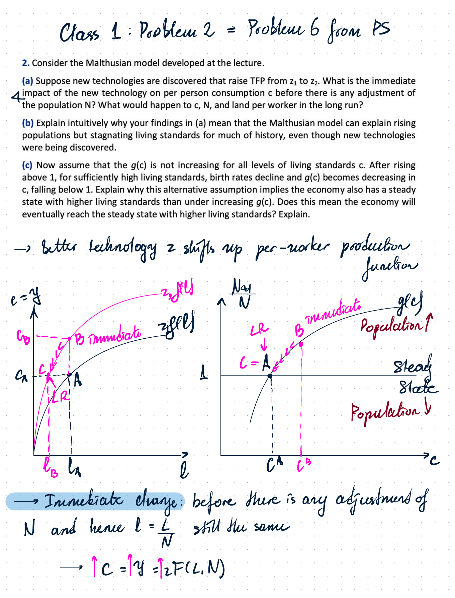

---

## Page 9 - Technology shock: long-run adjustment

Immediate effects of higher $z$:

$$
c\uparrow, \qquad y\uparrow,
$$

because:

$$
y=zf(\ell).
$$

Factor productivity also rises:

$$
R=zF_L(L,N)\uparrow,
$$

$$
w=zF_N(L,N)\uparrow.
$$

### Long run

Higher consumption improves nutrition and health, which increases fertility and reduces mortality:

$$
c\uparrow \Rightarrow g(c)\uparrow \Rightarrow N_{t+1}>N_t.
$$

As population rises:

$$
N\uparrow \Rightarrow \ell=\frac{L}{N}\downarrow.
$$

This pushes output and consumption per worker back down:

$$
y=c=zf(\ell)\downarrow.
$$

At some point, the direct effect of higher TFP and the indirect effect from increased population cancel each other:

$$
\Delta c^{LR}=\Delta y^{LR}=0,
$$

and the steady-state demographic condition again holds:

$$
g(c)=1.
$$

For land rent:

$$
R=zF_L(L,N).
$$

Since the relative scarcity of land rises when $N$ rises, land rent rises.

For wages:

$$
w=zF_N(L,N).
$$

The notes emphasize the scarcity effect: as labour becomes less relatively scarce, this pushes the marginal product of labour downward.

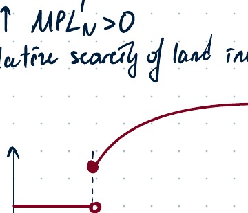

Full page image

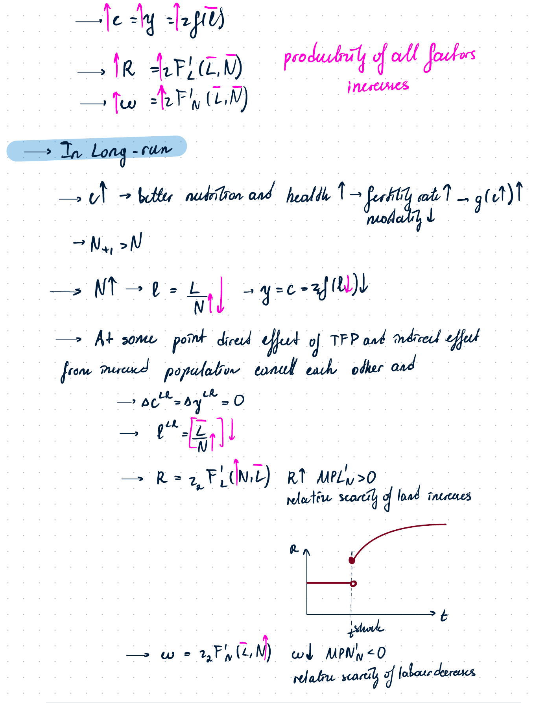

---

## Page 10 - Stagnating living standards and modified Malthus

### Stagnating living standards

In the long run:

$$
c^{LR},y^{LR}\quad \text{are unchanged}.
$$

With $z$ rising in steps over time, the Malthusian model predicts that living standards are always pulled back toward the same constant steady-state level, even though there may be temporary periods when living standards rise.

Intuition: technological improvements allow a larger population to be sustained, but population growth, fixed land, and diminishing returns to labour pull living standards back to the steady-state level.

### Modified version of Malthus

The demographic function can be modified so that $g(c)$ is not increasing forever. It can rise above 1 and then decline for sufficiently high living standards.

In this version, the graph has two steady states, where:

$$
g(c)=1.
$$

One is a low living-standard steady state $c_A$, and the other is a high living-standard steady state $c_B$.

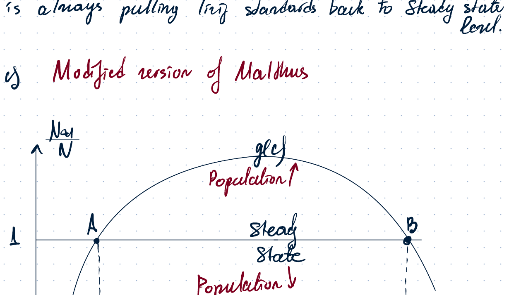

Full page image

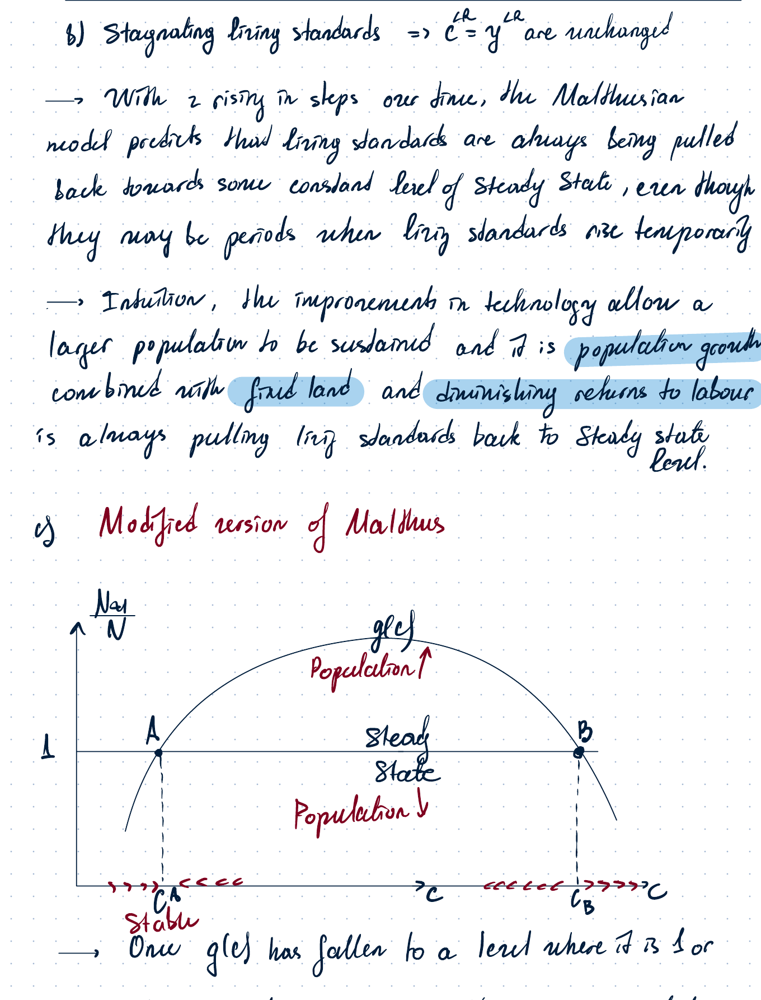

---

## Page 11 - Stability of steady states and transition back to static GE

If living standards are high enough, $g(c)$ can fall to 1 or below and keep decreasing in $c$. Then there is no population growth, so the key Malthusian mechanism does not operate. Living standards can remain high or even grow over time with decreasing population.

### Stability

The low steady state $c_A$ still exists and is stable:

$$
c_A+\varepsilon \Rightarrow N\uparrow \Rightarrow \ell=\frac{L}{N}\downarrow \Rightarrow c\downarrow \Rightarrow c_A.
$$

$$
c_A-\varepsilon \Rightarrow N\downarrow \Rightarrow \ell=\frac{L}{N}\uparrow \Rightarrow c\uparrow \Rightarrow c_A.
$$

The high steady state $c_B$ is also a steady state, but it is unstable:

$$
c_B+\varepsilon \Rightarrow N\downarrow \Rightarrow \ell\uparrow \Rightarrow c\uparrow,
$$

$$
c_B-\varepsilon \Rightarrow N\uparrow \Rightarrow \ell\downarrow \Rightarrow c\downarrow.
$$

Therefore there is no convergence back to $c_B$ after a small deviation.

### Week 1.2 - Real static general equilibrium model

The page then returns to the one-period real static general equilibrium model:

- one-period model;
- no saving;
- no investment;
- no bond market;
- all markets should be in equilibrium;
- all prices are real;
- Robinson Crusoe economy.

Full page image

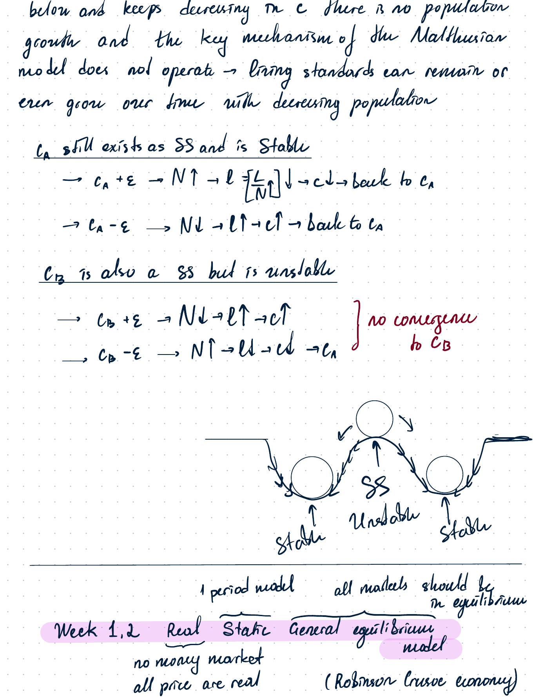

---

## Page 12 - Static GE model assumptions

One period implies:

$$
\text{no saving},\qquad \text{no investment},\qquad \text{no bond market}.
$$

There is a representative agent economy. The household solves a utility-maximization problem (UMP). All households have the same standard/convex preferences, the same money wage, and the same tax burden.

The representative firm solves a profit-maximization problem (PMP):

- it is a price taker in all markets;
- it usually has a neoclassical production function;
- if not told otherwise, output is:

$$
y=F(K,N).
$$

Capital is fixed, given, and exogenous.

Government uses lump-sum taxes:

$$
G=T,
$$

unless told otherwise. Taxes are lump-sum and endogenous in the balanced-budget case.

Closed economy:

$$
Y=C+I+G+NX,
$$

but in this one-period closed-economy setup:

$$
Y=C+G.
$$

All variables are real; there is no money market.

Full page image

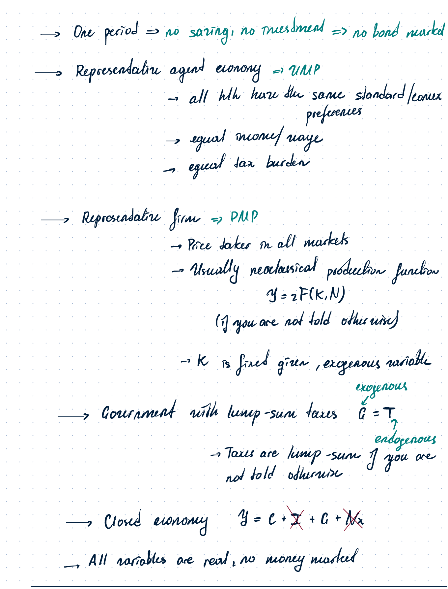

---

## Page 13 - Goods/output market and labour market

There are two markets in the static model:

- goods/output market;
- labour market.

Walras' law:

> If one of the markets is in equilibrium, then the other market is also in equilibrium.

Hint in the notes: start the analysis with the labour market.

### Representative firm's problem: PMP

The firm chooses labour:

$$
\max_{N\ge 0}\left[zF(K,N)-wN\right].
$$

FOC:

$$
zF_N(K,N)=w.
$$

This defines labour demand:

$$
N^d.
$$

With a neoclassical production function, $MPN$ is diminishing:

$$
F_{NN}<0,
$$

so labour demand is decreasing in the real wage.

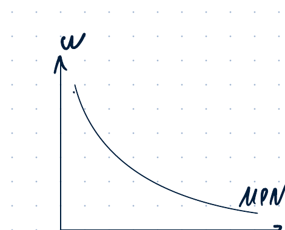

### Representative household problem: UMP

Preferences:

$$
u(c,l)
$$

are convex; $c$ and $l$ are normal goods.

Budget constraint:

$$
c=w(h-l)+\pi-T,
$$

where:

- $h$ = time endowment,
- $l$ = leisure,
- $w(h-l)$ = labour income,
- $\pi$ = dividends from the firm,
- $T$ = lump-sum taxes.

Equivalently:

$$
wl+c=wh+\pi-T.
$$

Household problem:

$$
\max_{c\ge 0,\;l\in[0,h]}u(c,l)
$$

subject to:

$$
wl+c=wh+\pi-T.
$$

Full page image

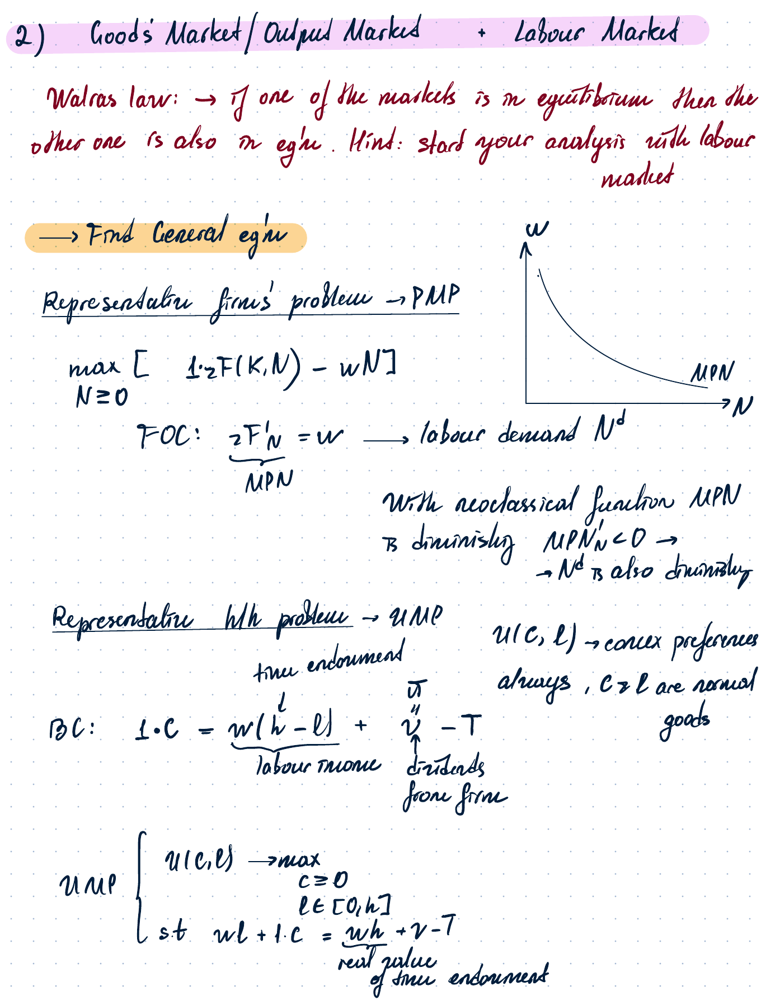

---

## Page 14 - Labour supply and labour-market equilibrium

Household optimum:

$$
MRS_{l,c}=\frac{w}{1}=w,
$$

with budget constraint:

$$
wl+c=wh+\pi-T.
$$

This gives leisure demand. Labour supply is:

$$
N^s=h-l.
$$

### Wage change effects

If $w$ rises:

Substitution effect:

$$
w\uparrow \Rightarrow \text{leisure becomes more expensive} \Rightarrow l\downarrow \Rightarrow N^s\uparrow.
$$

Wealth effect:

$$
w\uparrow \Rightarrow \text{real value of time endowment rises} \Rightarrow l\uparrow \Rightarrow N^s\downarrow,
$$

because leisure is a normal good.

Assumption in the notes:

$$
|SE|>|WE|.
$$

Therefore:

$$
w\uparrow \Rightarrow l\downarrow \Rightarrow N^s\uparrow.
$$

So labour supply is upward-sloping.

### Labour-market equilibrium

$$
N^s=N^d.
$$

At equilibrium:

- $N^*$ = equilibrium employment,
- $w^*$ = equilibrium real wage rate,
- $Y^*=zF(K,N^*)$,
- $C^*=Y^*-G$.

Exogenous variables:

$$
z,K,h,G,\text{ preferences}.
$$

Endogenous variables:

$$
Y,C,N,w,l,T.
$$

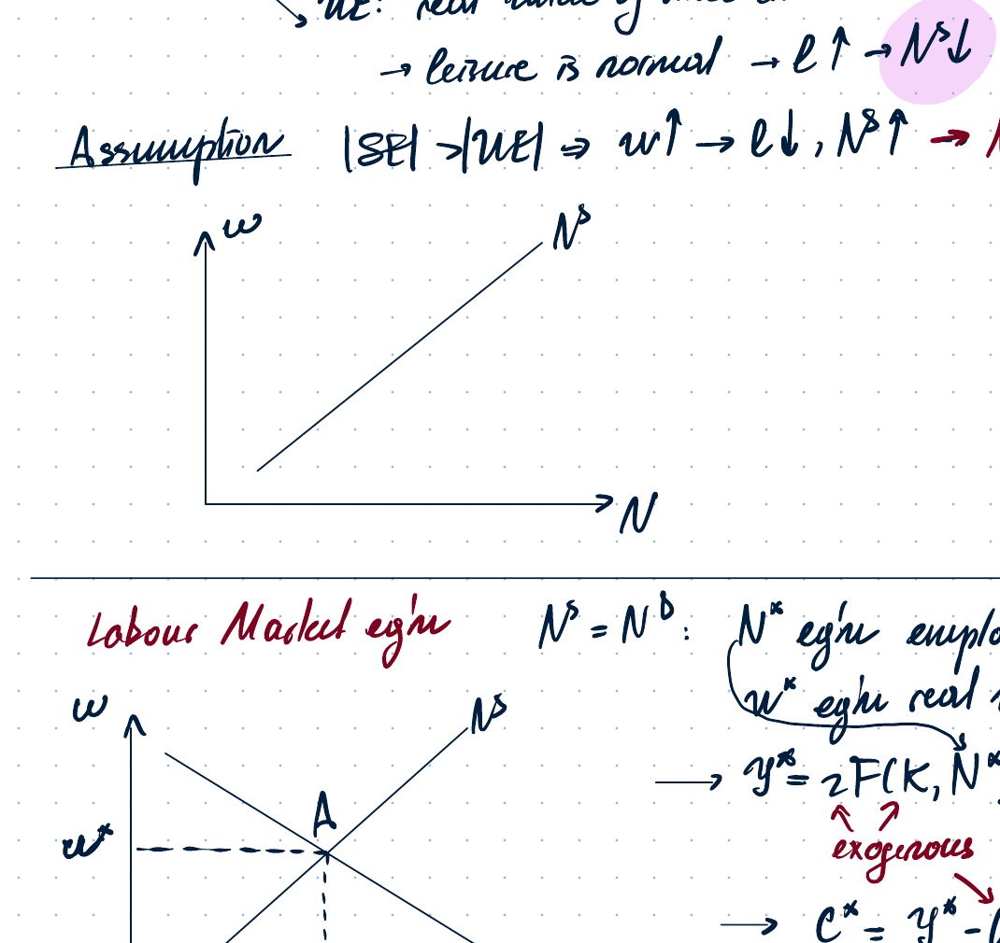

Full page image

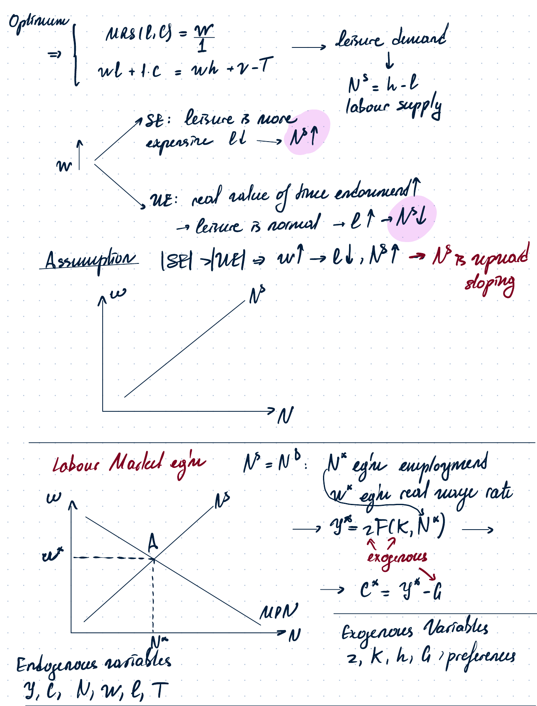

---

## Page 15 - Pareto-efficient allocation and the PPF

Goal: find/show the Pareto-efficient allocation.

First derive the PPF.

Production:

$$
y=zF(K,N).
$$

Resource constraint:

$$
y=c+G.
$$

Time constraint:

$$
N=h-l.
$$

Therefore:

$$
c=zF(K,h-l)-G.
$$

Boundary cases:

If $l=0$:

$$
c=zF(K,h)-G.
$$

If $l=h$:

$$
c=zF(K,0)-G=-G.
$$

The slope of the PPF is the marginal rate of transformation:

$$
MRT=\left|\frac{dc}{dl}\right|
=\left|-zF_N(K,h-l)\cdot(-1)\right|
=MPN.
$$

As $l\uparrow$, labour $N=h-l$ falls, so $MPN$ rises and the PPF becomes steeper.

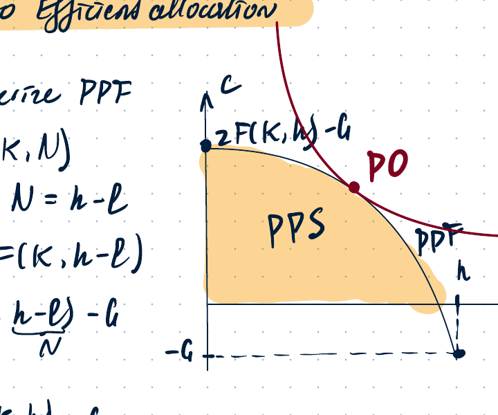

### Pareto optimum

Planner's problem:

$$
\max_{c,l}u(c,l)
$$

subject to:

$$
c=zF(K,h-l)-G.
$$

Pareto optimum condition:

$$
MRS=MRT=MPN.
$$

### Is general equilibrium Pareto efficient?

Firm's problem gives:

$$
w=MPN.
$$

Household problem gives:

$$
w=MRS.
$$

Therefore:

$$
MRS=MPN=MRT,
$$

so the competitive general equilibrium is Pareto optimal under the stated assumptions.

Full page image

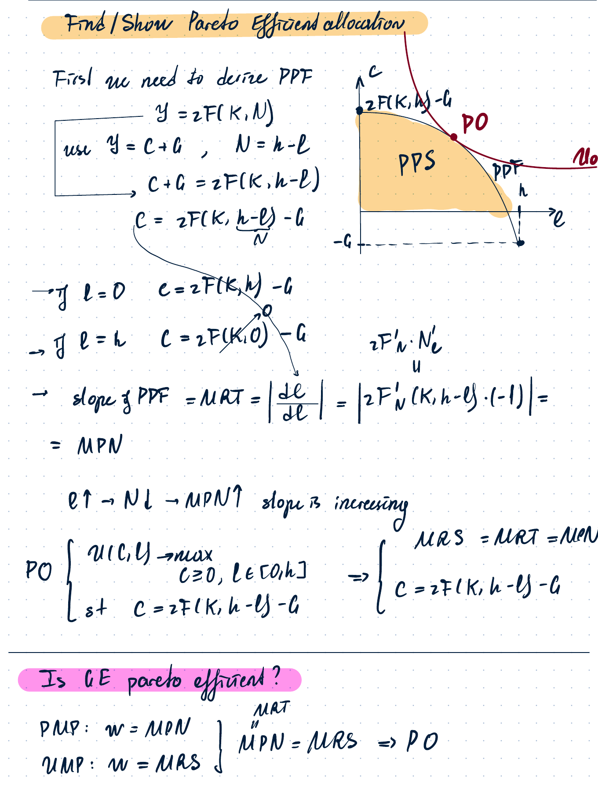

---

## Page 16 - First Welfare Theorem and COVID/time-endowment problem

### First Fundamental Welfare Theorem

Under complete markets and competitive equilibrium, the allocation is Pareto optimal.

Cases where this can fail or require qualification:

- government interventions, especially proportional/distortionary taxes and subsidies;
- asymmetry of information;
- externalities.

The notes emphasize that a lump-sum tax is not distortionary.

### Class 1, Problem 1

> Consider a one-period representative agent model developed at the lecture. Suppose that the economy recovers from the COVID pandemic that lets the time endowment available for work and leisure change from $h_0$ to $h_1$ exogenously. Using a diagram determine the effect on the real wage, treating $G$ as exogenous.

The notes start from the labour market.

Labour demand is decided by the firm through PMP:

$$
w=zF_N(K,N).
$$

The production function is unchanged, and $z$ and $K$ are exogenous and unchanged. Therefore $MPN$ is unaffected.

Labour supply is decided by the household through UMP. The notes say $N^s$ changes for two reasons:

1. Even if demand for leisure stayed constant, a changed time endowment changes the amount of time left for work.
2. A change in $h$ changes the real value of the time endowment $wh$, producing a wealth effect. Since leisure is a normal good, leisure demand changes.

Full page image

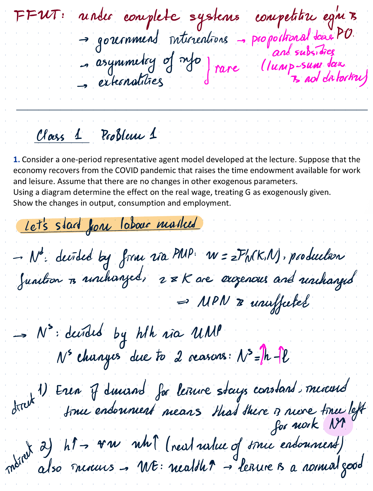

---

## Page 17 - COVID/time-endowment problem: diagram and result

The notes show the case where the time endowment rises from $h_0$ to $h_1$.

Labour supply shifts to the right:

$$
N^s(h_0)\rightarrow N^s(h_1).
$$

The note says that leisure cannot increase as much as the time endowment:

$$
|\Delta l|<|\Delta h|.
$$

Therefore, labour supplied rises.

In the labour market:

$$
N\uparrow, \qquad w\downarrow.
$$

Then output rises:

$$
Y=zF(K,N\uparrow)\uparrow.
$$

With $G$ exogenous:

$$
C=Y-G,
$$

so:

$$
C\uparrow.
$$

The diagram also shows the shift on the PPF/utility diagram and notes:

$$
w_B<w_A.
$$

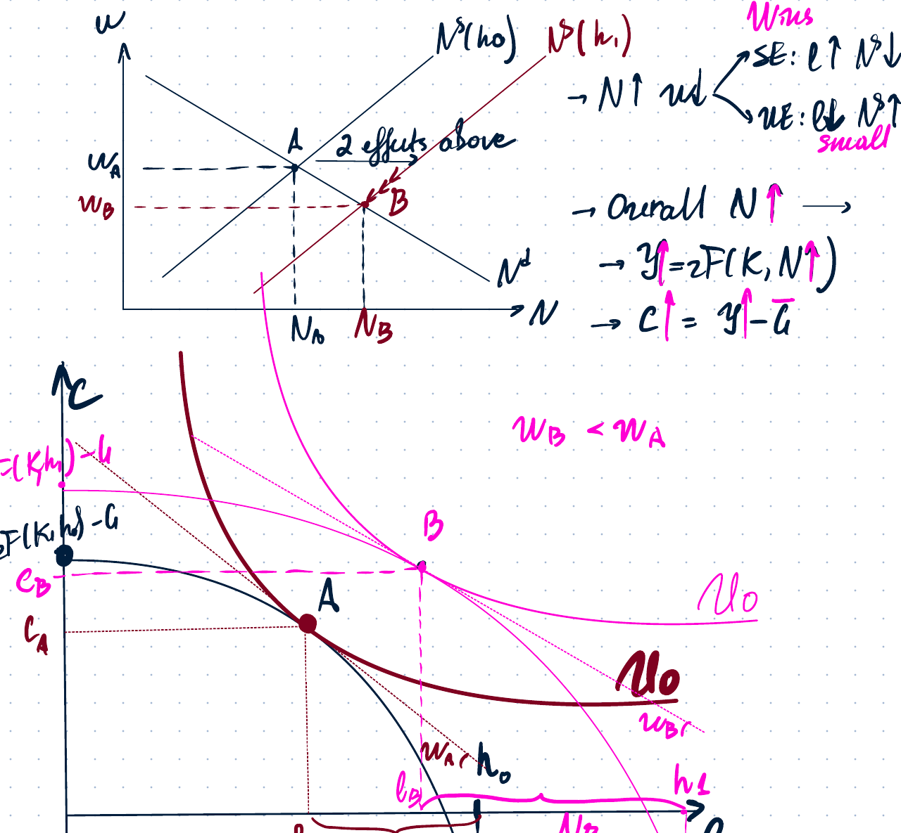

Full page image

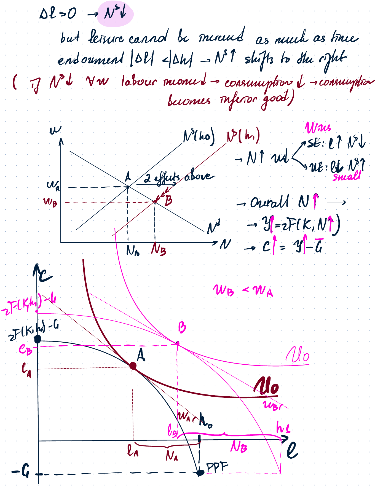

---

## Page 18 - Home assignment comments: land disaster in Malthus model

Problem context:

> Consider the Malthusian model of population growth described at the lecture. Suppose that initially the economy is in steady state and then 50% of the land is destroyed due to a natural disaster, but population remains intact.

Part (a): draw two diagrams:

- one with the production function;
- one with the demographic function.

The notes stress proper notation:

- initial steady state: $A$,
- new immediate equilibrium: $D$,
- new long-run equilibrium: $B$.

Comment from the notes:

$$
A: \quad \ell=\ell_A,\quad c=c_A,\quad g(c_A)=1.
$$

Important graphical comment:

$$
L\downarrow \Rightarrow \ell=\frac{L}{N}\downarrow,
$$

so this is movement along the production function, not a shift of the production function.

Part (b): draw a time chart for land rent per unit of land $X/R$.

The notes use:

$$
X=zF_L(L,N).
$$

Immediately after the shock, land becomes more scarce, so land rent rises. During the long-run adjustment, population changes and the rent path adjusts toward the new long-run level.

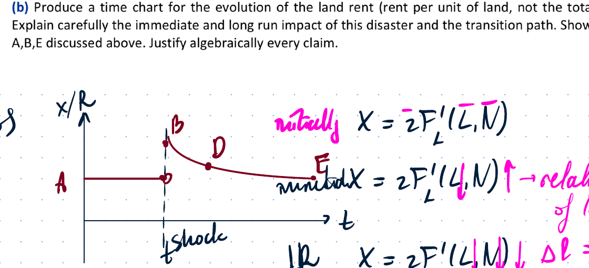

Full page image

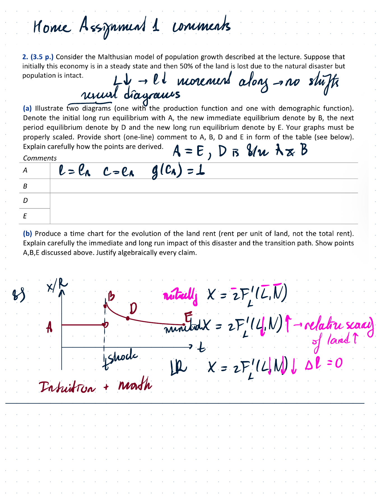

---

## Page 19 - Working with data: variables and data sources

The notes list possible data sources:

- Rosstat,
- World Bank,
- Central Bank of Russia,
- Google,
- Yahoo.

Use real variables, not nominal variables:

$$
x_{real}=\frac{x_{nominal}}{\text{GDP deflator}}.
$$

Variables mentioned:

- consumption,
- employment,
- real GDP,
- average product of labour,
- investment.

Average product of labour:

$$
APL=\frac{Y}{N}.
$$

The printed assignment instructions also require graphs that characterize business cycles, at least 30 observations, a table with the data, and explanation of any manual data modifications.

Full page image

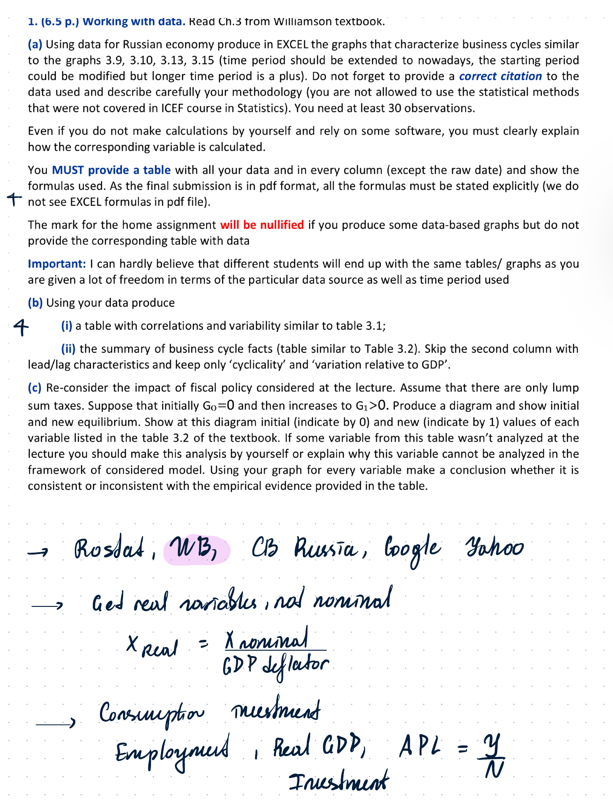

---

## Page 20 - Cyclical properties and fiscal-policy shock

The page includes tables on business-cycle facts and notes on correlation with GDP.

Interpretation of correlation:

$$
\rho(X,Y)>0 \Rightarrow X\text{ is procyclical},
$$

$$
\rho(X,Y)<0 \Rightarrow X\text{ is countercyclical},
$$

$$
\rho(X,Y)=0 \Rightarrow X\text{ is acyclical}.
$$

Relative volatility is measured by:

$$
\frac{\operatorname{std}(X)}{\operatorname{std}(Y)}.
$$

The printed task then asks to reconsider the impact of fiscal policy with only lump-sum taxes. Initially:

$$
G=0,
$$

then government expenditure rises:

$$
G_1>0.
$$

The diagram shows the effect in the static model: the PPF shifts downward in parallel because higher $G$ reduces resources available for private consumption:

$$
C=Y-G.
$$

The note labels this as a parallel shift.

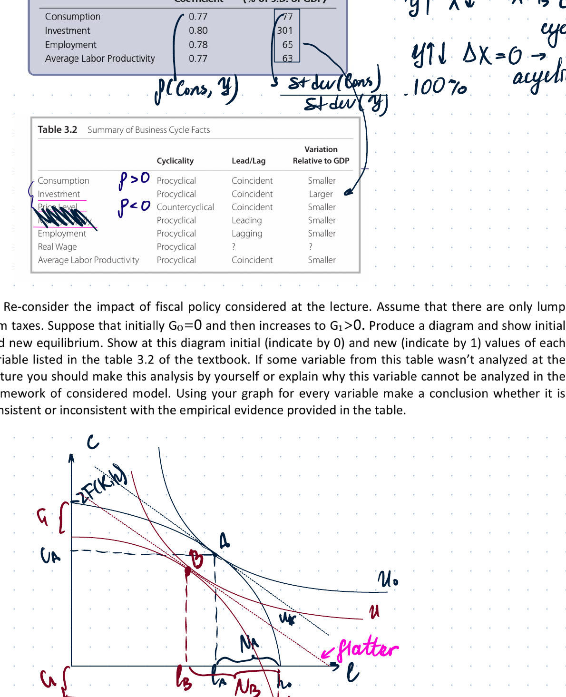

Full page image

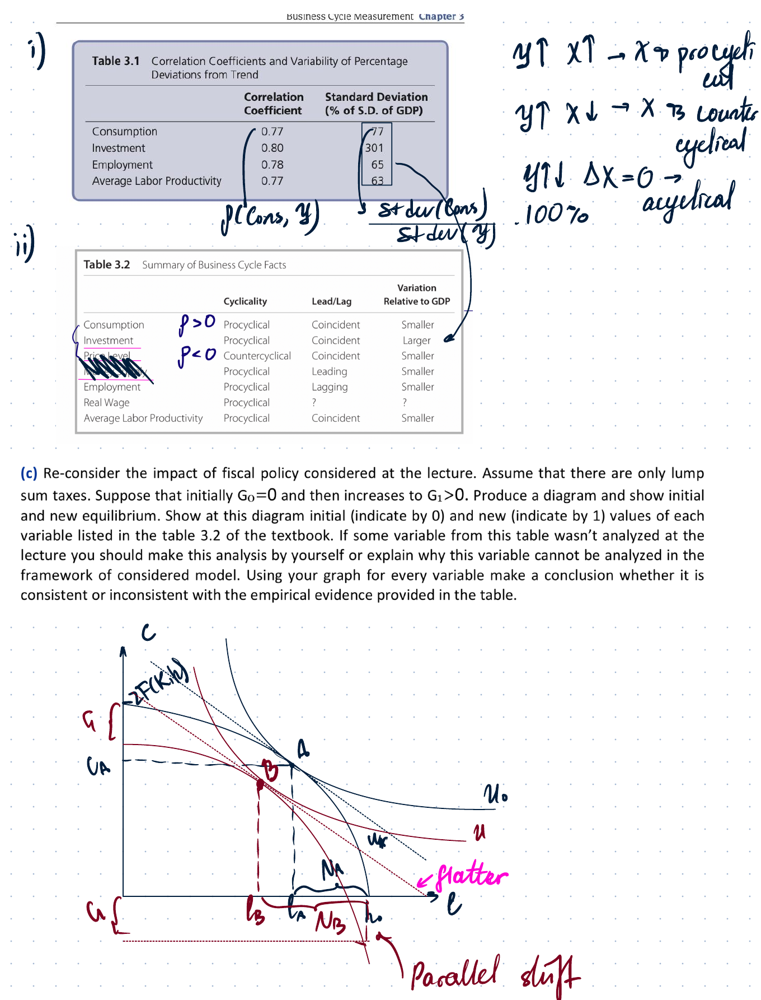

---

## Page 21 - Static model findings for the fiscal shock

Labour demand is unchanged:

$$
N^d \text{ unchanged}, \qquad w=zF_N(K,N).
$$

There is no shift in labour demand.

Labour supply shifts because of the balanced-budget/lump-sum tax effect:

$$
G\uparrow \Rightarrow T\uparrow.
$$

This lowers household wealth. Since leisure is a normal good:

$$
\text{wealth}\downarrow \Rightarrow l\downarrow \Rightarrow N^s\uparrow.
$$

Therefore labour supply shifts to the right.

Equilibrium effects:

$$
N\uparrow,
$$

$$
Y=zF(K,N)\uparrow,
$$

$$
C=Y-G\downarrow.
$$

The fall in private consumption is labelled as crowding out.

### Model findings

The notes summarize:

- $C$ is countercyclical;
- $I$ cannot be analyzed in the static model;
- $N$ is procyclical;
- $APN=Y/N$ is countercyclical.

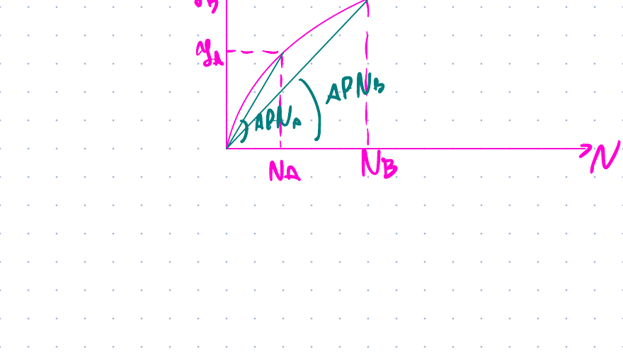

Full page image

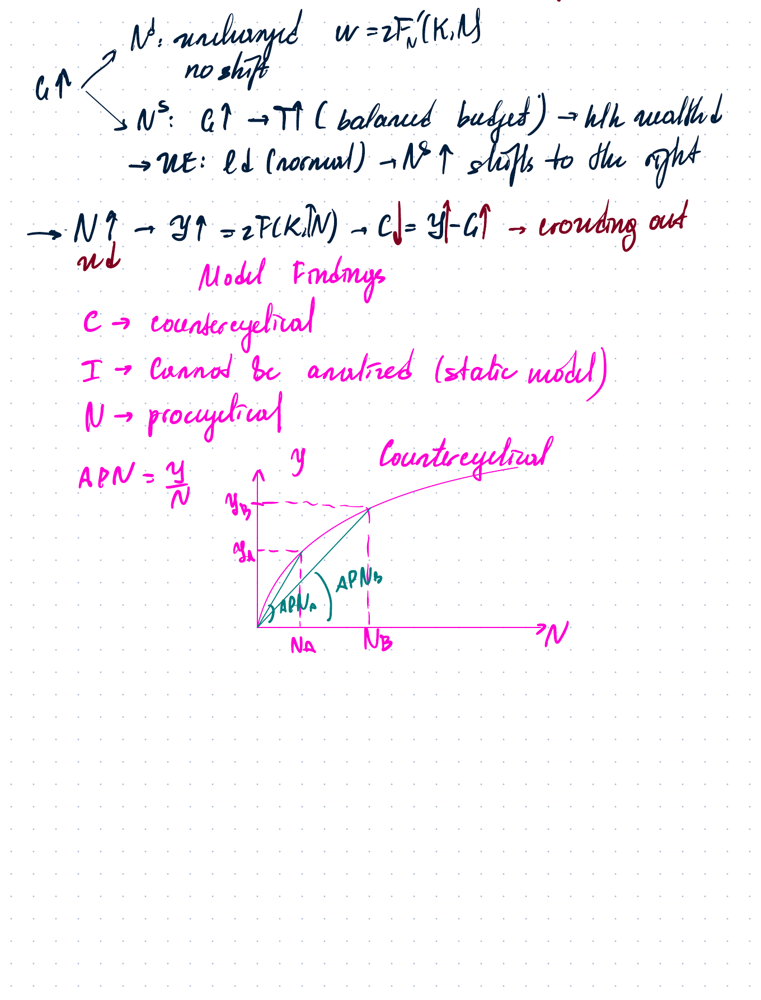

