# Week 10 - Money and Banking

## 1. Money demand and money supply

Money demand:

$$
M^d = P \cdot L\left(y^{+},\, i-i^m\right)
$$

where:

- $P$ is the price level;
- $y$ is real income / transaction volume;
- $i$ is the nominal interest rate on alternative assets;
- $i^m$ is the interest rate paid on money;
- $i-i^m$ is the opportunity cost of holding money.

Modifications discussed earlier:

- taxes;
- security cost of holding money;
- anonymity of cash.

Money supply:

$$
M^s
$$

In the simplest model money supply is treated as **exogenously decided by the Central Bank**. In reality, not only the central bank decides money supply: **commercial banks also participate in money creation**.

### Monetary aggregates

Narrow money / monetary base / high-powered money:

$$
M0 = \text{reserves} + \text{cash}.
$$

Broad money:

$$
M1 = \text{deposits} + \text{cash}.
$$

Reserves are the very small part of broad money that is controlled directly by the central bank.

### Commercial bank balance sheet example

Simple balance sheet with required reserve ratio $q=10\%$:

| Assets | Liabilities |
|---|---|
| Reserves: $10$ | Deposits: $100$ |
| Loans: $90$ | |

If another bank receives the loaned-out funds as deposits, the process continues.

Modern balance-sheet example:

| Assets | Liabilities |
|---|---|
| Reserves: $10$ | Deposits: $10$ |
| Reserves / loans created after lending: $20$ | Deposits: $20$ |
| | Equity: $10$ |

The notes emphasize that money creation depends on bank balance-sheet constraints, not only on the central bank’s direct choice of reserves.

## 2. Balance-sheet constraints of commercial banks

Main constraints on a commercial bank balance sheet:

- **required reserve ratio** $q$ on deposits;
- **capital requirements** on loans.

These constraints limit how far commercial banks can expand deposits and loans.

## 3. Tools of monetary policy

### Open market operations (OMO)

The central bank buys or sells short-run government bonds in the secondary market.

If the central bank **buys bonds**:

$$
R \uparrow \quad \Rightarrow \quad \text{banks can loan out more} \quad \Rightarrow \quad M^s \uparrow .
$$

If the central bank **sells bonds**:

$$
R \downarrow \quad \Rightarrow \quad \text{banks loan out less} \quad \Rightarrow \quad M^s \downarrow .
$$

### Repo and reverse repo agreements

A repo is a purchase with an agreement to sell back at a predetermined price and date.

### Quantitative easing (QE)

The central bank buys long-term and medium-term financial assets and decreases long-term and medium-term rates. The yield curve becomes flatter or inverted. QE is described as a temporary promise.

### Required reserve ratio

$$
q \in (0,1).
$$

If a commercial bank has a shortfall of required reserves, it has to take a loan from the central bank at the **discount rate**, with safe collateral.

### Standing facilities

Standing facilities include:

- $i_b$ - discount rate: the central bank gives credit to commercial banks for collateral;
- $i_r$ - interest rate paid on reserves by the central bank;
- $i_{rr}$ - interest rate paid on required reserves;
- $i_{er}$ - interest rate paid on excess reserves.

## 4. Interbank market

Commercial banks trade **excess reserves** with each other.

### Demand for excess reserves

The model uses the ratio:

$$
\frac{R}{M}.
$$

The **marginal cost** of borrowing in the interbank market is constant:

$$
MC = i.
$$

The **marginal benefit** of borrowing in the interbank market is decreasing in $R/M$:

$$
MB = i_b \lambda\left(\frac{R}{M}\right) + i_r\left[1-\lambda\left(\frac{R}{M}\right)\right],
$$

where $MB$ is not exogenous.

Demand logic:

$$
\begin{cases}
i>i_b \Rightarrow \dfrac{R^d}{M}=0,\\[6pt]
i<i_r \Rightarrow \dfrac{R^d}{M}\to \infty.
\end{cases}
$$

Optimal demand for excess reserves is determined where:

$$
MB=MC.
$$

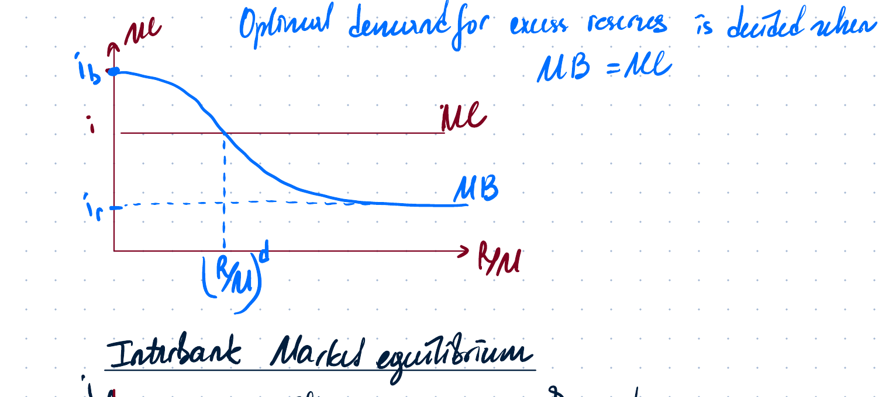

The graph shows the downward-sloping marginal benefit schedule for reserves. The chosen $R/M$ is where the constant marginal cost line intersects the marginal benefit curve.

### Interbank market equilibrium

Supply of reserves is decided by the central bank and is vertical:

$$
\frac{R^s}{M} = \text{given by CB}.
$$

Demand is downward-sloping. The equilibrium interbank rate is determined by the intersection of reserve demand and reserve supply.

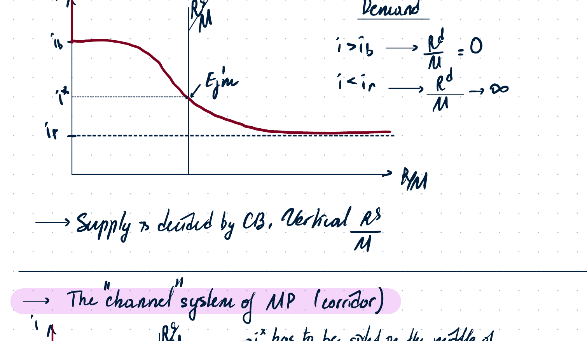

The notes mark the demand cases:

$$
\begin{cases}
i>i_b \Rightarrow R^d/M=0,\\
i<i_r \Rightarrow R^d/M\to\infty.
\end{cases}
$$

## 5. Corridor system of monetary policy

The corridor system is also called the **channel system** of monetary policy.

The target interest rate should be in the middle of the corridor:

$$
i^* = \frac{i_b+i_r}{2}.
$$

Otherwise, the central bank must fine-tune the amount of reserves to hit the middle of the channel.

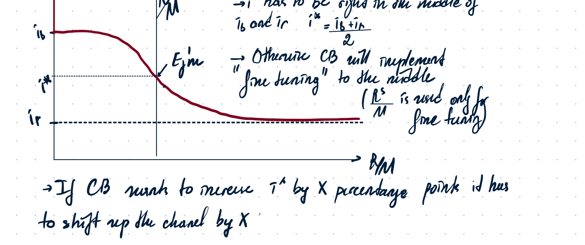

If the central bank wants to increase $i^*$ by $x$ percentage points, it has to shift the whole channel up by $x$.

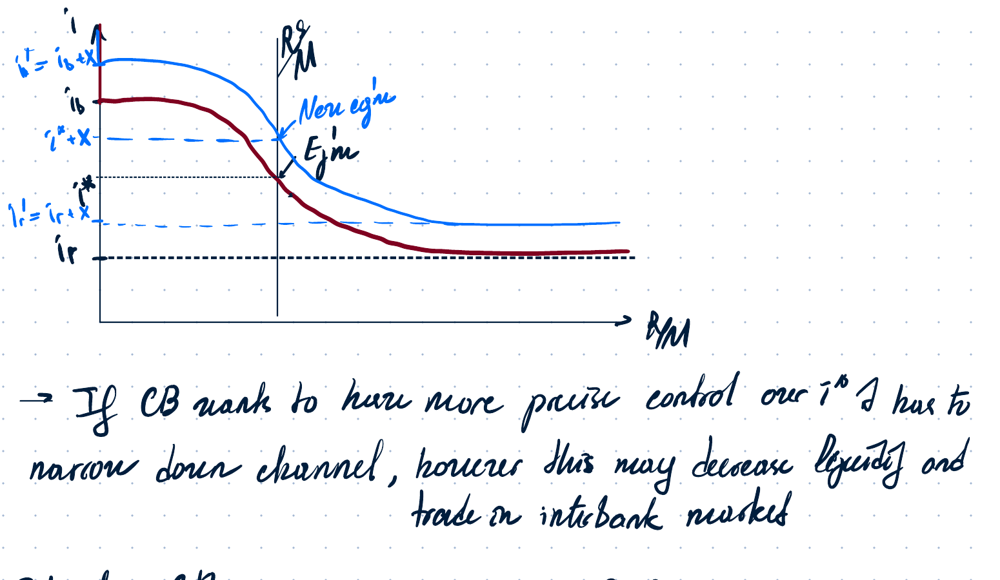

The notes add that narrowing the channel gives more precise control over $i^*$, but may decrease liquidity and trade in the interbank market.

## 6. Floor system of monetary policy

The floor system appears after large injections of liquidity, such as QE.

The central bank sets permanently high reserve supply. Commercial banks have no incentive to use the interbank market because the market rate is pinned to the interest rate on reserves:

$$
i^* = i_r.
$$

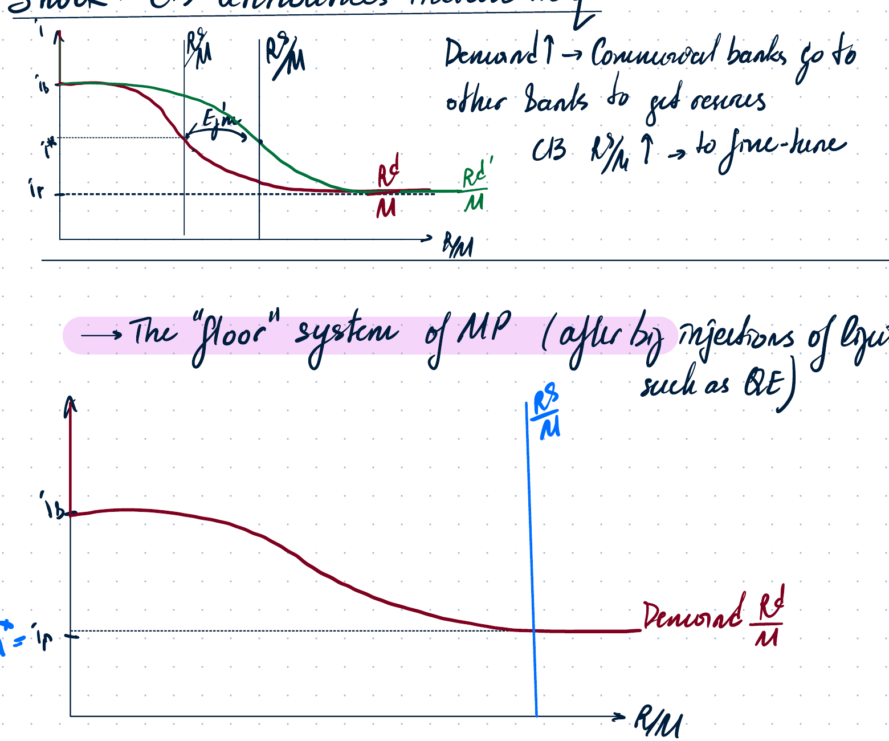

In the floor system, $R^s/M$ and $i_r$ can be used as two separate instruments:

- the central bank can move $i$ by changing $i_r$ without decreasing reserves;
- therefore, it does not need to unwind QE to raise the policy rate.

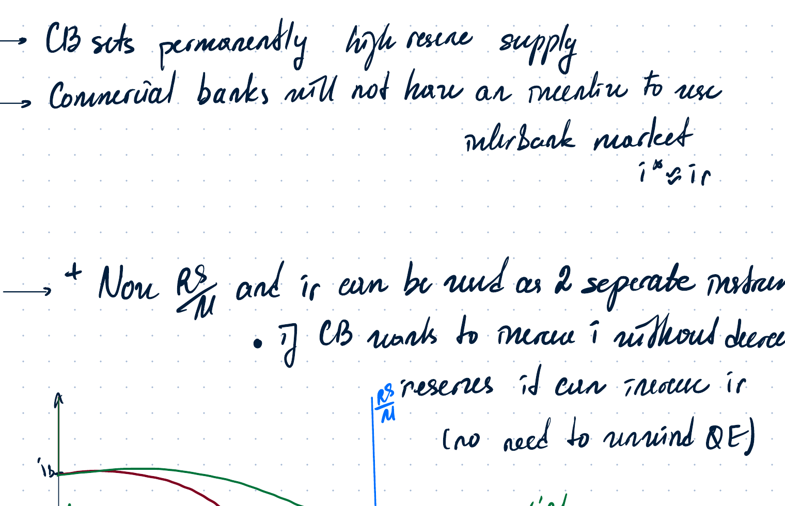

Traditional approach with $i_r=0$:

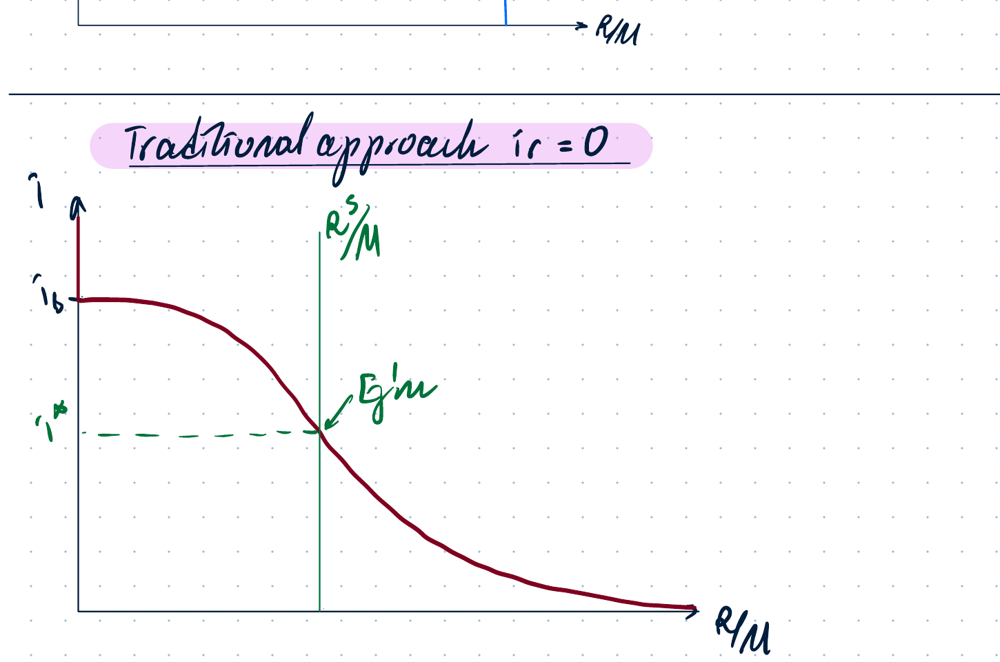

## 7. Revised money-market equilibrium

In the revised money-market model, real money supply is not simply fixed by the central bank. Commercial banks also create deposits.

The notes write:

$$
\frac{M^s}{P} = \frac{R^s}{P}\cdot \frac{M}{R}.
$$

Reserves are controlled by the central bank, while deposits are created by commercial banks.

If the interest rate rises, commercial banks have more motive to loan out funds:

$$
i \uparrow \Rightarrow \text{deposits} \uparrow \Rightarrow M^s \uparrow.
$$

So real money supply becomes upward-sloping.

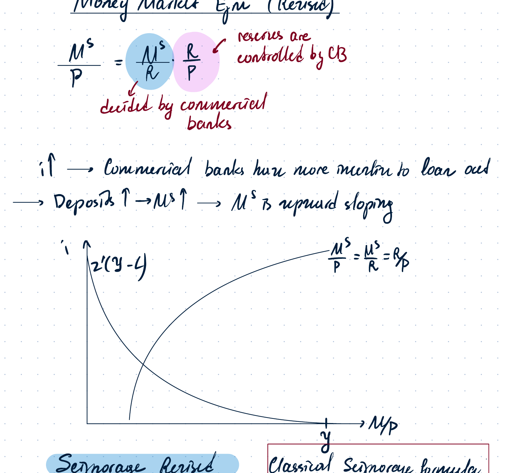

## 8. Seigniorage revised

Classical seigniorage formula:

$$
SE = iL(y,i).
$$

In the revised approach, seigniorage is practically the profit of the central bank.

Central bank balance-sheet idea:

| Central bank assets | Central bank liabilities |
|---|---|
| Bonds | Reserves |

Central bank profit:

$$
\Pi_{CB}=B(1+i)-R(1+i_r).
$$

If reserves and bonds are equal in value, this becomes approximately:

$$
\Pi_{CB}=(i-i_r)R.
$$

This profit is transferred to the Treasury / government budget.

## 9. Section 10 Problem 1 - large-scale liquidity injection and higher target rate

**Problem statement.** Suppose the central bank implemented a large-scale QE policy and is not willing to reverse it. At the same time, it finds it optimal to increase the interest rate. Is it possible to attain the desired goals? Explain and illustrate using the interbank market graph.

Because reserves in the interbank market are very high, the country uses the **floor system of monetary policy**.

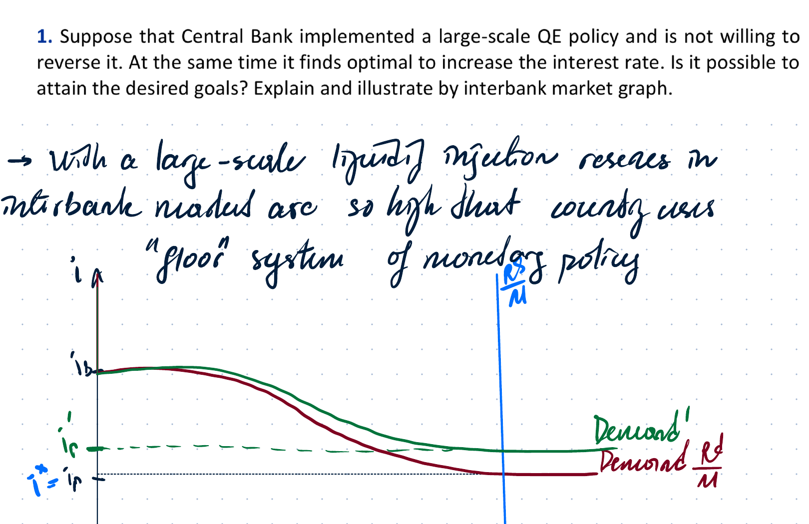

Options discussed in the notes:

1. Decrease $R^s/M$ enough to replace the channel system. This is hard to force, because financial players would have to sell securities. The note labels it a bad option.
2. Wait until financial assets pay interest / mature, so $R^s/M$ declines gradually.
3. Increase $i_r$, the interest rate on excess reserves.

Conclusion:

Since reserves are ample, increasing $i_r$ raises the market rate immediately.

## 10. Section 10 Problem 2 - abolishing interest on reserves

**Problem statement.** Since the 2000s, more central banks began paying interest to commercial banks on reserve balances held in accounts at the central bank. Quantitative easing increased reserve balances dramatically. The practice of paying interest on reserves became more controversial. Use the model of the interbank market with demand and supply curves for reserves to analyze implications for money-market interest rates of abolishing payment of interest on reserves, assuming QE is not reversed.

Assumptions:

$$
QE \text{ is not reversed}, \qquad \frac{R^s}{M} \text{ is unchanged and very high}.
$$

Abolishing interest on reserves means:

$$
i_r=0.
$$

Then there is no floor. If reserve supply remains very high, the demand curve no longer has the previous floor and the interbank interest rate may fall to zero.

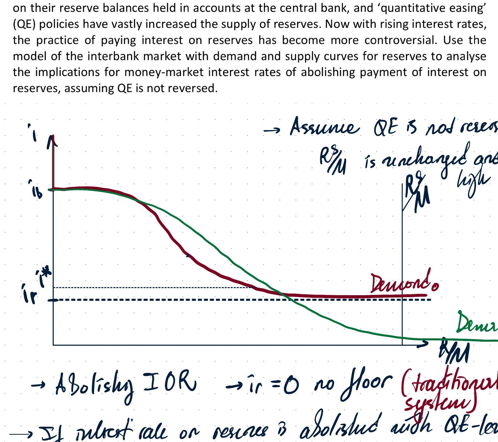

Implications:

- the interest rate reaches the zero lower bound and cannot be decreased further;
- monetary policy becomes less effective;
- central-bank control over short-term interest rates weakens.

## 11. Section 10 Problem 3 - interbank rate exceeding discount rate

**Problem statement.** Data suggest that the interbank interest rate quite often exceeds the discount rate. Is it possible to reconcile this observation with the considered model?

Observation 1:

$$
i>i_b.
$$

In the basic model this looks strange, since banks should borrow from the central bank at the discount rate. The notes give the following explanation:

Banks may avoid borrowing from the central bank even if the rate is lower, because borrowing from the central bank can signal weakness to markets or regulators. This creates stigma effects.

Therefore:

$$
i = i_b + \text{stigma}.
$$

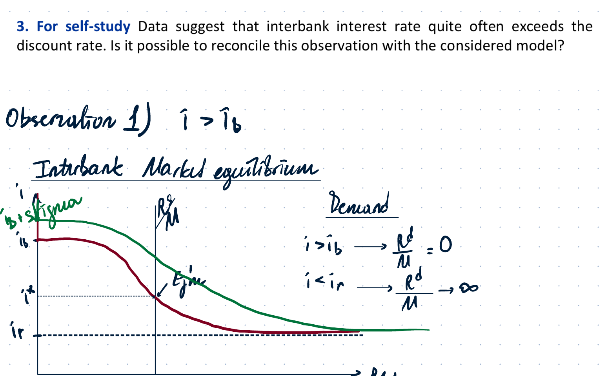

Observation 2:

$$
i^*<i_r.
$$

Two key reasons:

1. **Not all institutions receive IOR.** Some institutions in the interbank market, such as Fannie Mae and Freddie Mac in the U.S. example, have reserve accounts at the Fed but are not eligible to receive IOR. They are willing to lend at lower rates, even below IOR, because they have no alternative use for their funds.
2. **Capital and liquidity regulations.** Commercial banks that do earn IOR may face regulatory constraints, such as capital ratios and liquidity coverage requirements, that discourage borrowing.

## 12. Problem 5 - standing facilities and collateral shock

**Problem statement.** Central banks have standing facilities such as the discount window that provide loans of reserves to commercial banks at an interest rate $i_b$. Commercial banks must offer appropriate collateral to access loans through this borrowing facility. Suppose the value of commercial banks’ assets falls, reducing the amount of collateral they can use to access loans from the central bank. Illustrate the effect this has on the demand curve for reserves and show the impact on the equilibrium interest rate in the market for central bank lending. Give one example of how the central bank could respond to offset it.

Effect on demand for reserves:

- if commercial banks’ asset values fall, they have less eligible collateral;
- this reduces their ability to borrow reserves from the central bank via the discount window;
- banks become more dependent on the interbank market to meet their liquidity needs;
- therefore, demand for reserves in the interbank market increases at any given interest rate.

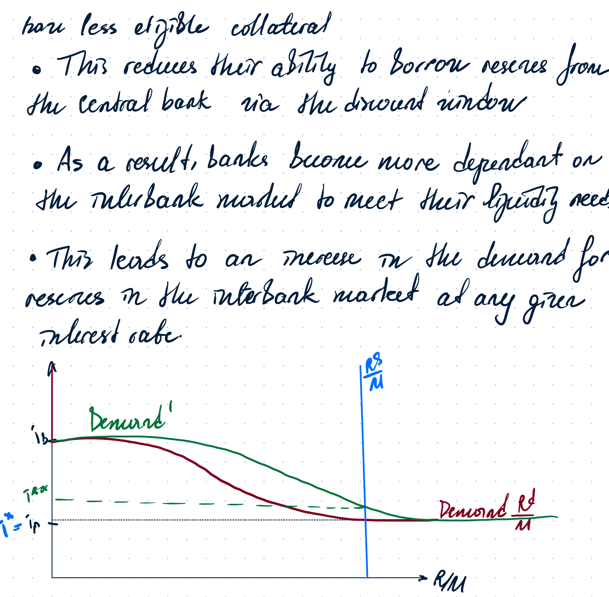

Result:

$$
R^d \uparrow \quad \Rightarrow \quad i \uparrow
$$

unless the central bank offsets the shock.

Possible central-bank response:

- increase reserve supply $R^s/M$;
- or lower / adjust the discount rate corridor;
- or broaden eligible collateral rules.

## 13. Bond maturity and the yield curve

The yield curve, or term structure, plots yield to maturity against bond maturity.

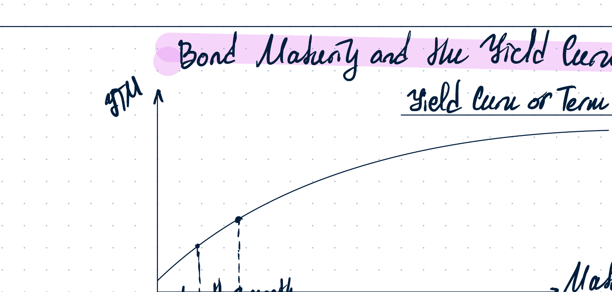

Consider two discount bonds with no coupon payments before maturity.

### One-year zero-coupon bond

Maturity: 1 year. Payoff: 1 unit of money.

Price:

$$
V_1 = \frac{1}{1+i}.
$$

Yield to maturity:

$$
i.
$$

If an investor has 1 unit of money and buys the one-year bond, he can buy $1/V_1$ bonds. Next-period return is:

$$
\frac{1}{V_1}-1=i.
$$

### Two-year zero-coupon bond

Maturity: 2 years. Payoff: 1 unit of money.

Price:

$$
V_2 = \frac{1}{(1+I)^2},
$$

where $I$ is the yield to maturity on the two-year bond.

If the investor wants to earn for only one period, he sells the two-year bond after one year. Since there is still one period until maturity, the selling price is expected to be:

$$
V_1^e = \frac{1}{1+i_1^e}.
$$

Return from buying the two-year bond and selling after one year:

$$
\frac{V_1^e}{V_2}-1
= \frac{(1+I)^2}{1+i_1^e}-1
\approx 2I-i_1^e.
$$

If investors are risk neutral and financial markets are perfect, the return from the short-term bond should equal the expected return from the long-term bond:

$$
i = 2I-i_1^e.
$$

Therefore:

$$
I = \frac{i+i_1^e}{2}.
$$

Main equation of expectations theory:

$$
I = \frac{i+i^e}{2}.
$$

Moral: the long-term interest rate is equal to the average of the current and expected future short-term interest rates.

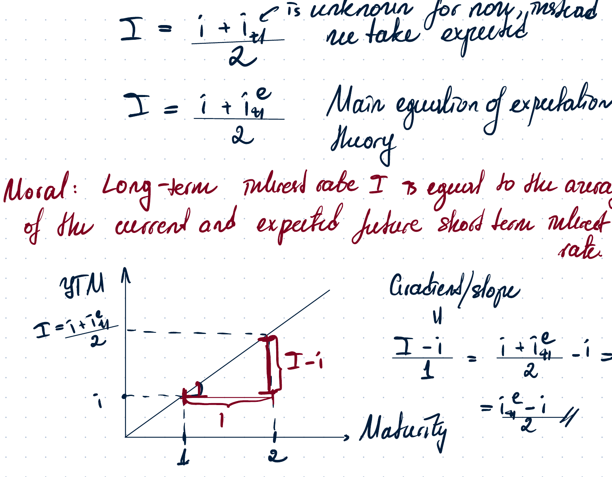

Gradient / slope of the yield curve:

$$
I-i = \frac{i^e-i}{2}.
$$

So:

- upward-sloping yield curve if $i^e>i$;
- downward-sloping yield curve if $i^e<i$.

## 14. Problem 2 - inverted yield curve in 2022

**Problem statement.** During 2022, the yield curve in the United States became inverted / downward-sloping. Use the expectations theory of long-term interest rates to explain why an inverted yield curve is consistent with a recession.

In normal times, the yield curve is upward-sloping:

$$
I>i.
$$

Long-term rates are higher than short-term rates because markets expect future short-term rates to rise. This is often associated with economic growth and inflation.

In an inverted yield curve:

$$
I<i.
$$

This happens only if investors expect future short-term rates to fall:

$$
i^e<i.
$$

This is usually associated with expected central bank rate cuts in response to falling economic activity, i.e. recession expectations.

## 15. Optimal portfolio model - money demand under uncertainty

The optimal portfolio model is a model of money demand based on choice under uncertainty.

The investor can allocate wealth between:

- a risk-free asset with real return $r_f$ and share $X$;
- a risky asset with share $1-X$.

The risky asset has:

- bad state with probability $t$, return $r_1$;
- good state with probability $1-t$, return $r_2$.

State-contingent consumption:

$$
C_1 = X(1+r_f)+(1-X)(1+r_1),
$$

$$
C_2 = X(1+r_f)+(1-X)(1+r_2).
$$

Simplify:

$$
C_1 = 1 + X(r_f-r_1) + r_1,
$$

$$
C_2 = 1 + X(r_f-r_2) + r_2.
$$

Solve the first equation for $X$:

$$
X=\frac{C_1-1-r_1}{r_f-r_1}.
$$

Plug into $C_2$:

$$
C_2
=1+r_2+\frac{r_f-r_2}{r_f-r_1}(C_1-1-r_1).
$$

Budget constraint slope:

$$
\frac{dC_2}{dC_1}=\frac{r_f-r_2}{r_f-r_1}.
$$

This is the contingent-commodities diagram.

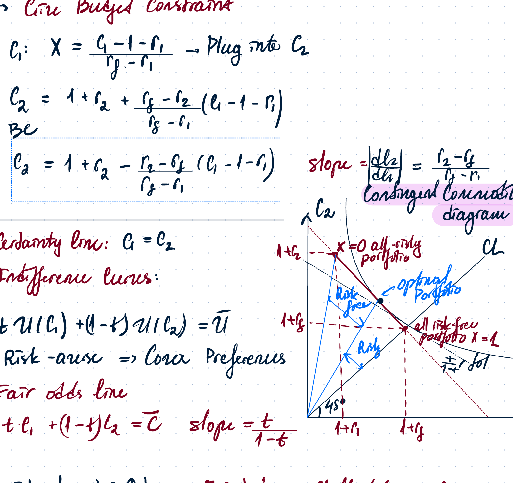

Important lines:

- certainty line: $C_1=C_2$;
- indifference curves: convex for risk-averse preferences;
- fair odds line:

$$
tC_1+(1-t)C_2=\bar C,
$$

with slope:

$$
-\frac{t}{1-t}.
$$

### Shocks in the portfolio model

1. If the risk-free return rises, the budget constraint becomes flatter or steeper from the point $X=0$ depending on the relative-state geometry in the diagram.
2. Quantitative easing reduces the risk-free return. The notes state that $X$ is endogenous and decided by the investor, so it cannot be changed exogenously.
3. If investor preferences change and the investor becomes more risk-averse, indifference curves become more curved.

