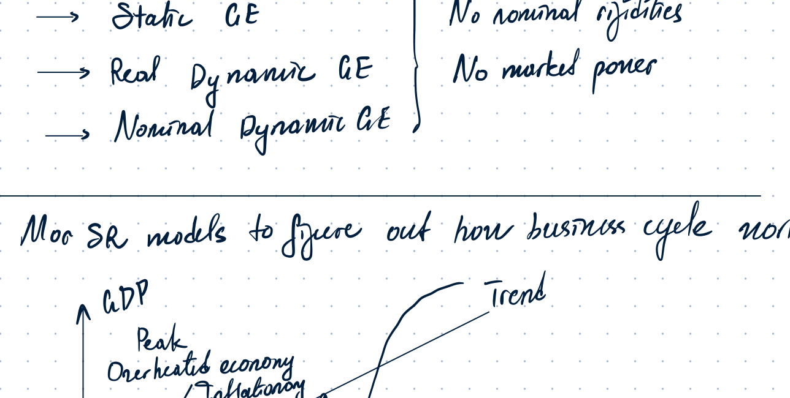
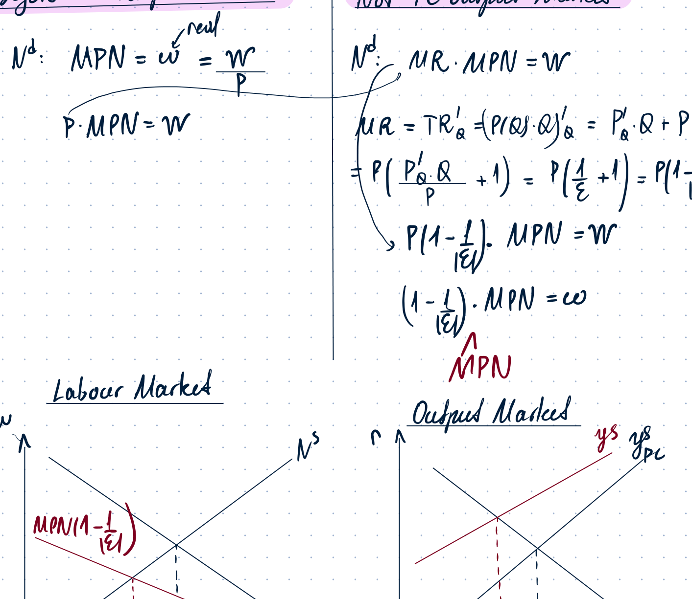
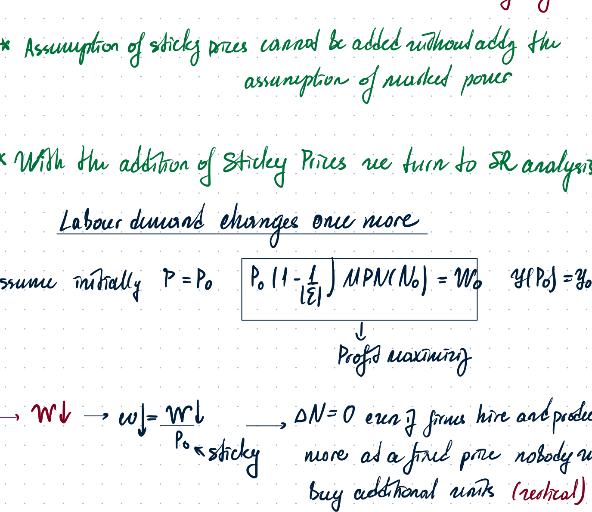
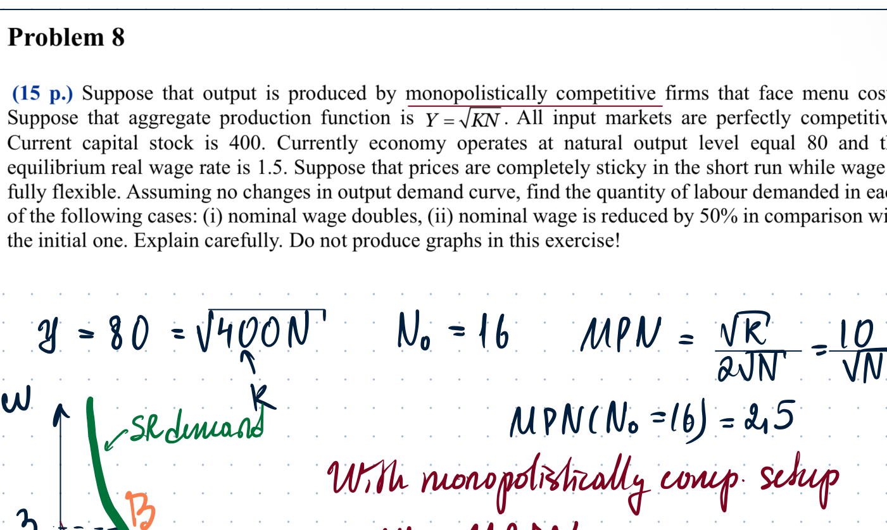
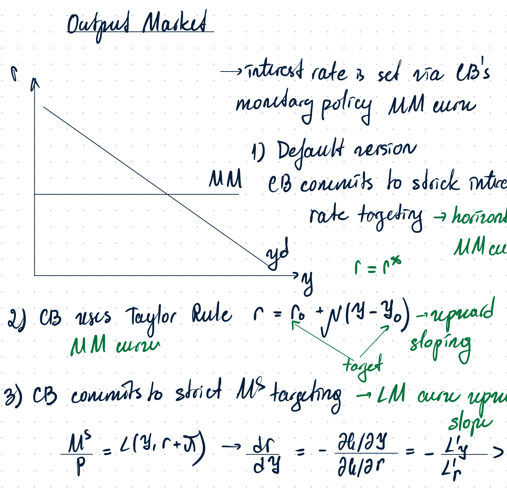
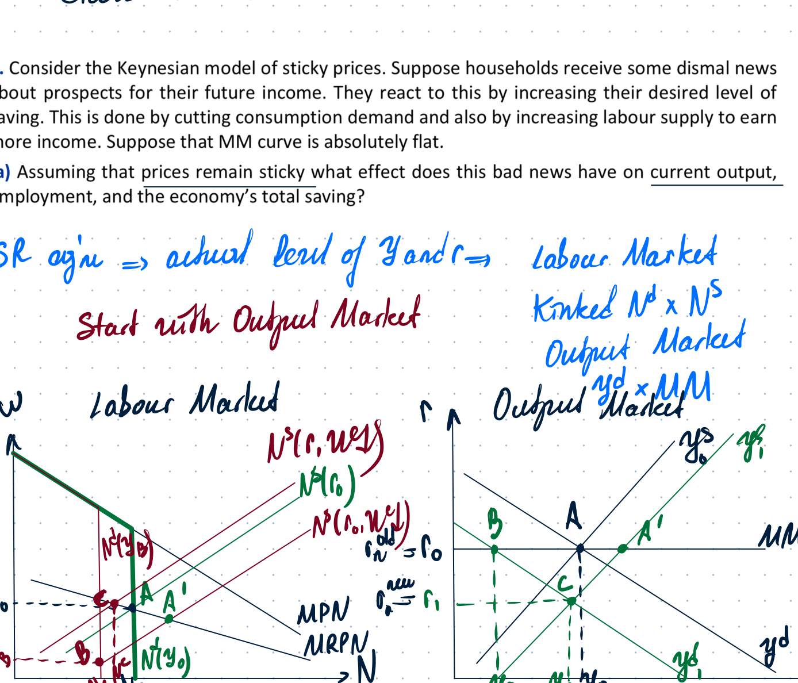
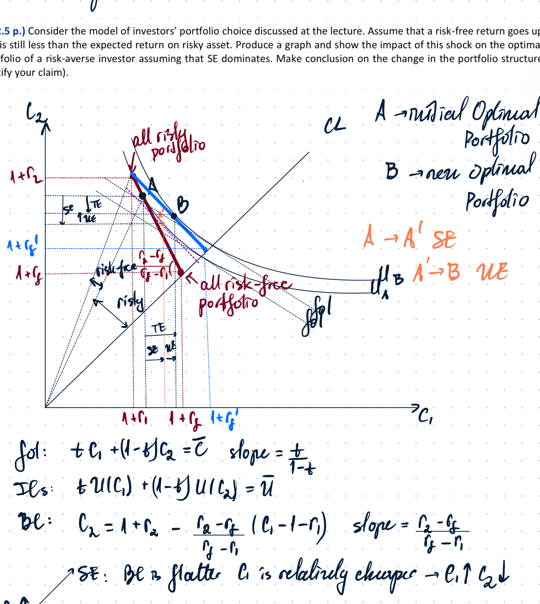
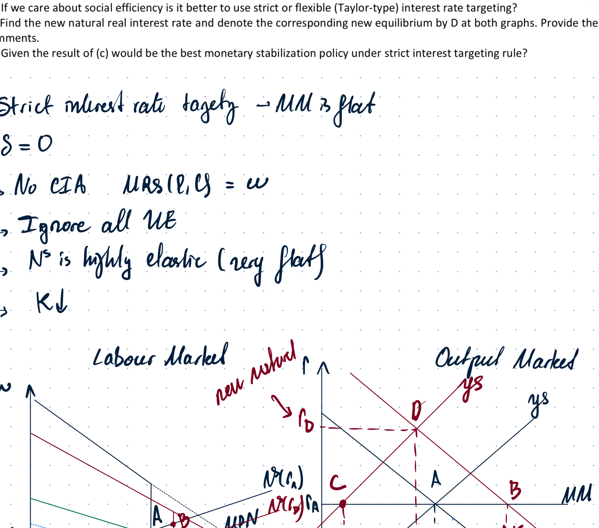
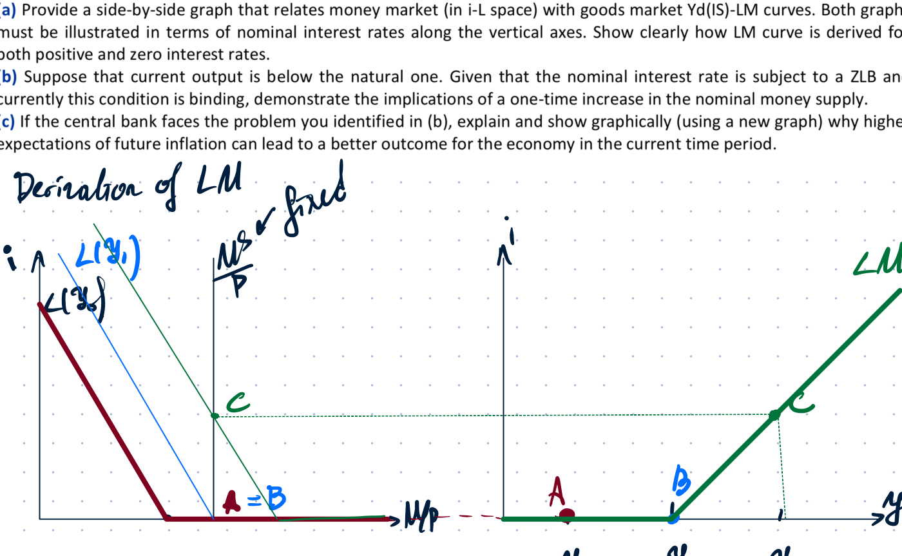
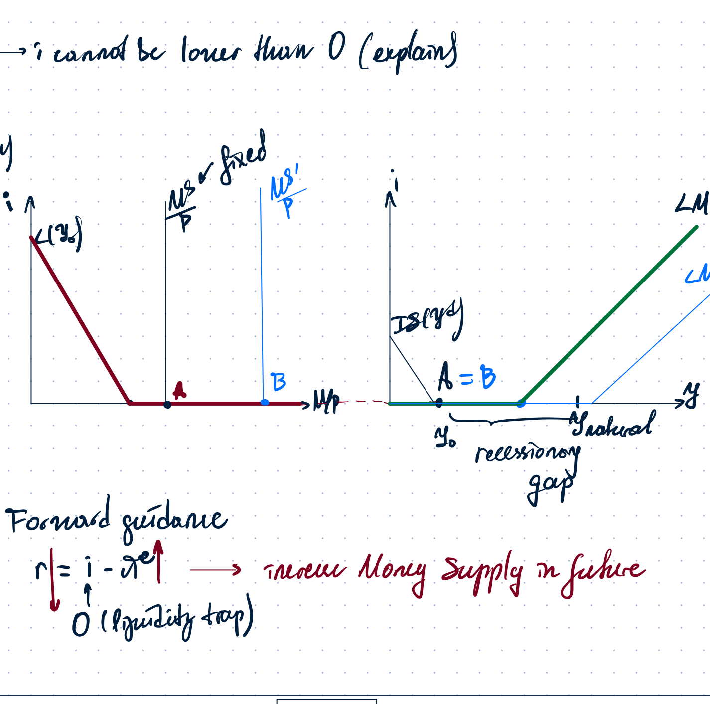

# Week 11 - Business Cycles

Source: `Week 11 - Business cycles(1).pdf`

This Markdown converts the handwritten notes into text as much as possible. Graphs and diagrams are kept as images only where the visual layout is needed to preserve the argument.

---

## 1. Why short-run business-cycle models are needed

Long-run analysis covered earlier models:

- static GE;
- real dynamic GE;
- nominal dynamic GE.

In those versions there were no nominal rigidities and no market power. To explain business cycles in the short run, we need models where output can deviate from trend.

Business-cycle language:

- GDP fluctuates around a long-run trend;
- a **peak** is output above trend;
- a **trough** is output below trend;
- the vertical distance from trend is the **recessionary/overheating gap**.

Main short-run theories listed in the notes:

- Real Business Cycle theory;
- Coordination Failure Model;
- New Keynesian Model (NKM);
- NKM with partial price adjustment.

---

## 2. New Keynesian Model: market power and sticky prices

### Output market is no longer perfectly competitive

In the New Keynesian model, the output market is not perfectly competitive. Firms are **monopolistically competitive**, while the labour market is still treated as perfectly competitive.

Before, with a perfectly competitive output market:

\[
N^d: \quad P \cdot MPN = W
\]

or in real terms:

\[
MPN = \frac{W}{P} = w.
\]

With market power, firms equate marginal revenue product of labour to the nominal wage:

\[
MR \cdot MPN = W.
\]

For a firm facing downward-sloping demand, marginal revenue is below price:

\[
MR = P\left(1 - \frac{1}{\varepsilon}\right),
\]

so the labour-demand condition becomes

\[
\left(1 - \frac{1}{\varepsilon}\right)MPN = w.
\]

Thus, for the same real wage, labour demand is lower than under perfect competition:

\[
N^{d}_{MC} < N^{d}_{PC}.
\]

This also reduces output supply in the output market.

### Sticky prices

Prices are assumed to be absolutely sticky, fixed, or rigid in the short run. Firms do not adjust prices because of **menu costs**, such as:

- changing price tags;
- setting new price positions;
- administrative costs;
- consumer loyalty and customer reaction.

The notes emphasize that the sticky-price assumption cannot be added without also assuming market power. With perfectly competitive firms, price-setting power is absent.

With sticky prices, the model turns into short-run analysis.

---

## 3. Labour demand with sticky prices

Assume initially:

\[
P = P_0,
\]

and the firm is at the initial optimum:

\[
P_0\left(1 - \frac{1}{\varepsilon}\right)MPN(N_0) = W_0.
\]

Equivalently,

\[
\left(1 - \frac{1}{\varepsilon}\right)MPN(N_0)=w_0.
\]

The initial output demanded at the fixed price is

\[
y^d(P_0)=y_0.
\]

### If nominal wage falls

If the nominal wage falls while the price remains fixed, the real wage falls:

\[
w = \frac{W}{P_0}\downarrow.
\]

At the old employment level, marginal profit becomes positive. However, because price is sticky, nobody will buy extra units at the fixed price. Therefore the firm does **not** expand employment simply because labour became cheaper.

So for wage decreases, labour demand is locally vertical at the quantity needed to produce existing demand.

### If nominal wage rises

If the nominal wage rises, then the real wage rises:

\[
w = \frac{W}{P_0}\uparrow.
\]

At the old employment level, marginal profit becomes negative. The firm reduces labour until marginal profit becomes zero again:

\[
\left(1 - \frac{1}{\varepsilon}\right)MPN(N)=w.
\]

Thus, with sticky prices, labour demand becomes **kinked** in the short run.

Important conclusion:

\[
\Delta N^d = 0
\]

for wage decreases when the fixed-price output demand is already satisfied. Output demand becomes a shift factor for labour demand.

---

## 4. Problem 8: sticky prices and monopolistic competition

Problem statement in the notes:

> Suppose output is produced by monopolistically competitive firms that face menu costs. Aggregate production function is \(Y=\sqrt{N}\). All input markets are perfectly competitive. Suppose capital stock is \(400\). Current equilibrium real wage is \(1.5\). Suppose prices are completely sticky in the short run while wage is fully flexible. Assuming no change in output demand, find the quantity of labour demand in the following cases: nominal wage doubles; nominal wage is reduced by 50%; compare with the initial one. Explain carefully. Do not produce graphs in the exercise.

The notes use:

\[
y = \sqrt{400N},
\]

so

\[
N_0 = 16,
\]

and

\[
MPN = \frac{10}{\sqrt{N}},
\qquad
MPN(N_0=16)=2.5.
\]

With monopolistic competition, the real wage is set by marginal revenue product:

\[
w = MRPN.
\]

The initial real wage is

\[
w_0=1.5.
\]

### Case 1: nominal wage doubles

Since prices are sticky, the real wage also doubles:

\[
w' = 2 \cdot 1.5 = 3.
\]

The new real wage is higher than the relevant marginal product/marginal revenue product at the old employment level, so marginal profit becomes negative. In the absence of price rigidity the firm could raise prices, but now prices are fixed due to menu costs. Adjustment happens through employment only.

The firm reduces labour hours until marginal profit becomes zero. The handwritten solution gives:

\[
MPN(N^{new}) = \frac{10}{\sqrt{N}} = 3,
\]

so

\[
N^{new}=\frac{100}{9}.
\]

### Case 2: nominal wage is reduced by 50%

The real wage becomes

\[
w' = 0.75.
\]

Although this is lower than the real value of marginal revenue product, the firm does not increase employment because the fixed-price quantity demanded is still the same. Nobody will purchase additional units.

Hence the firm keeps

\[
N=16.
\]

Conclusion from the notes:

> With sticky prices, the short-run output supply curve does not exist in the usual sense. The supply decision adjusts to output demand.

---

## 5. Output demand and the MM curve

Output demand is written as

\[
y^d = C + I + G.
\]

The interest rate is set through central-bank monetary policy. In the output market diagrams this is represented by an **MM curve**.

Three versions are listed.

### Version 1: strict interest-rate targeting

The central bank commits to a strict interest-rate target:

\[
r=r^*.
\]

The MM curve is horizontal.

### Version 2: Taylor rule

The central bank follows a Taylor-type rule:

\[
r = r_0 + \nu (y-y_0),
\]

so the MM curve is upward-sloping.

### Version 3: strict money-supply targeting

The central bank fixes money supply:

\[
\frac{M^s}{P}=L(y,r+\pi).
\]

Using the implicit function form,

\[
L(y,r+\pi)-\frac{M^s}{P}=0.
\]

Then

\[
\frac{\partial r}{\partial y}
= -\frac{L_y}{L_r}>0,
\]

because money demand increases with output and falls with the interest rate. Therefore the LM/MM curve is upward-sloping.

If the store-of-value function of money is ignored and there is no cash-in-advance constraint, money is neutral and superneutral.

---

## 6. Class 11 Problem 1: bad news about future income

Problem statement:

> Consider the Keynesian model of sticky prices. Suppose households receive dismal news about prospects for their future income. They react to this by increasing their desired level of saving. This is done by cutting consumption demand and by increasing labour supply to earn more. Suppose the MM curve is absolutely flat. Analyze the effects on current output, employment, and total saving.

### Short-run equilibrium: actual output and employment

The notes say to start with the **output market** in the short run.

Initial assumption:

\[
y^{actual}=y^{natural}
\]

before the shock.

#### Output market: move from A to B

The MM curve is unchanged because there is no announced change in the target interest rate.

Households decrease current consumption demand:

\[
C^d \downarrow.
\]

Therefore aggregate demand shifts left:

\[
y^d = C + I + G \downarrow.
\]

Output falls.

#### Labour market: move from A to B

Households increase desired labour supply in order to save more:

\[
N^s \rightarrow \text{right}.
\]

However, because output demand falls and prices are sticky, firms adjust employment downwards rather than cutting prices:

\[
N^d \downarrow.
\]

Employment falls in the short run.

### Total saving and the paradox of thrift

The notes write:

\[
\Delta I = \Delta S^p + \Delta S^{gov}.
\]

Investment is determined by the capital accumulation condition:

\[
I = K_{t+1} - K(1-\delta),
\]

and the optimal capital condition:

\[
MPK_{t+1}-\delta = r.
\]

Since the MM curve is flat and the interest rate is unchanged, investment does not change:

\[
\Delta I=0.
\]

Therefore

\[
\Delta S^p + \Delta S^{gov}=0.
\]

This is the **paradox of thrift**: households try to save more, but aggregate saving does not rise because output and income fall.

---

## 7. Effect on the natural rate of interest

The long-run or natural equilibrium is found from the labour market and the output market.

### Labour market

Labour demand is unchanged:

\[
N^d: \left(1-\frac{1}{\varepsilon}\right)zF_N(K,N)=w.
\]

Households increase labour supply to save more:

\[
N^s \rightarrow \text{right}.
\]

So natural employment increases:

\[
\Delta N^{natural}>0.
\]

### Output market

Output supply shifts right because employment increases:

\[
y^s=zF(K,N), \qquad N\uparrow \Rightarrow y^s \uparrow.
\]

But output demand shifts left because households decrease consumption demand:

\[
C^d \downarrow \Rightarrow y^d \downarrow.
\]

The notes state that the demand-side fall dominates:

\[
|\Delta y^d|>|\Delta y^s|.
\]

Therefore:

\[
\Delta y^{natural}<0,
\qquad
\Delta r^{natural}<0.
\]

---

## 8. Central-bank response

Since the natural interest rate falls, in the short run the old interest rate is too high:

\[
r_0 > r_n^{new}.
\]

Actual output is below potential output:

\[
y^{actual}<y^{potential}.
\]

This is a recessionary gap.

The central bank should conduct expansionary monetary policy:

\[
i \downarrow \Rightarrow r \downarrow.
\]

The MM curve shifts down. Consumption and investment increase, and the economy moves to the new natural output level:

\[
C\uparrow, \qquad I\uparrow, \qquad y \to y^{potential}.
\]

---

## 9. Fiscal-policy suggestions in response to the original shock

The problem considers two fiscal-policy suggestions.

### Policy 1: temporarily increase current government spending

\[
\Delta G>0,
\qquad
\Delta G_{t+1}=0.
\]

The MM curve is unchanged because monetary policy is unchanged.

Output demand is

\[
y^d=C+I+G.
\]

A current fiscal expansion raises the present value of future taxes, which lowers household wealth:

\[
PV(TR)\uparrow \Rightarrow \text{wealth}\downarrow.
\]

Since consumption is a normal good,

\[
C\downarrow.
\]

However, because the fiscal shock is temporary and consumption is smoothed, the fall in consumption is smaller than the rise in government spending:

\[
|\Delta C|<|\Delta G|.
\]

Therefore output demand shifts right:

\[
\Delta y^d = \Delta C + \Delta I + \Delta G>0.
\]

### Policy 2: announce cuts to future government spending while current spending is unchanged

\[
\Delta G_{t+1}<0,
\qquad
\Delta G=0.
\]

The present value of future taxes falls:

\[
PV(TR)\downarrow \Rightarrow \text{wealth}\uparrow.
\]

Consumption rises:

\[
C\uparrow.
\]

Hence output demand shifts right:

\[
\Delta y^d=\Delta C+\Delta I+\Delta G>0.
\]

### If the future cut is not credible

If nobody believes the promise to cut future spending, the policy will not raise consumption today. It only works if the announcement affects expectations.

### Permanent decrease in fiscal stimulus

If the policy is modified so that current government spending is cut by the same amount as the announced future cut, then the fiscal shock becomes permanent.

For a permanent cut:

\[
G\downarrow,
\qquad
PV(TR)\downarrow,
\qquad
\text{wealth}\uparrow,
\qquad
C\uparrow.
\]

With a permanent shock and consumption smoothing, the wealth effect can fully offset the direct effect:

\[
|\Delta C|=|\Delta G|.
\]

So output demand does not change:

\[
\Delta y^d=0.
\]

The recessionary gap is not cured. The notes conclude that this permanent version is ineffective.

---

## 10. Can policy from part (c) be prescribed if the natural rate is negative?

A negative nominal interest rate would mean that money is a better store of value than bonds, because money also helps with transactions. Holding wealth as money would be strictly preferable to holding bonds.

Therefore, in the standard model without security or maintenance costs of holding large amounts of cash, asset markets cannot be in equilibrium with

\[
i<0.
\]

The lower bound is

\[
i\ge 0.
\]

If the natural real interest rate becomes negative, the central bank cannot shift the MM curve downward enough. It cannot reach the point where output demand and output supply intersect. This is the liquidity-trap / zero-lower-bound problem.

---

## 11. Home Assignment 10 comments: portfolio-choice model

The graph discusses the portfolio-choice model when the risk-free return rises while the expected risky return is unchanged.

Main objects:

- point A: initial optimal portfolio;
- point B: new optimal portfolio;
- A to A': substitution effect;
- A' to B: wealth effect;
- all-risky portfolio and all-risk-free portfolio are shown as endpoints.

The budget line in contingent commodities is written in the notes as

\[
tC_1+(1-t)C_2=\bar C,
\]

with slope

\[
\frac{t}{1-t}.
\]

A rise in the risk-free return makes the budget line flatter. The safe asset becomes relatively cheaper in terms of contingent consumption. The wealth effect raises consumption because consumption is a normal good.

---

## 12. Home Assignment 11 / Problem 2: New Keynesian sticky-price model with capital-stock shock

Problem statement in the notes:

> Consider the New Keynesian model with completely sticky prices and flexible nominal wage introduced at the lecture. The central bank follows a policy of strict interest-rate targeting. To simplify the analysis, assume zero depreciation rate and ignore the distortionary effect of the cash-in-advance constraint. Assume that real wealth effects are negligible. Analyze the impact of a shock in which capital stock unexpectedly decreases by some fraction. Consider the economy initially in long-run equilibrium.

The notes state the simplifying assumptions:

- strict interest-rate targeting, so the MM curve is flat;
- \(\delta=0\);
- no CIA distortion, so

\[
MRS(l,c)=w;
\]

- ignore wealth effects;
- labour supply is highly elastic, so it is drawn almost flat.

### Positive impact of the shock

Capital falls unexpectedly:

\[
K\downarrow.
\]

#### Long-run / natural effect

Labour demand falls because the marginal product of labour falls:

\[
MPN(K,N)\downarrow.
\]

So natural employment decreases:

\[
N^{natural}\downarrow.
\]

Output supply shifts left:

\[
y^s=zF(K,N)\downarrow.
\]

#### Short-run effect with sticky prices

Because prices are sticky and the central bank holds the interest rate constant, the MM curve is unchanged. Output demand does not automatically fall enough to match the new natural output.

The short-run equilibrium can display an inflationary gap if actual demand exceeds the new natural supply level.

### Strict interest-rate targeting vs flexible/Taylor-type targeting

Under strict interest-rate targeting, the central bank keeps

\[
r=\text{const.}
\]

The adjustment in output comes mainly through the direct fall in capital and investment:

\[
\Delta Y \approx \Delta I = -\Delta K.
\]

With a flexible/Taylor-type interest-rate rule, the central bank reacts to the output/inflation gap. The handwritten note states that the output fall is smaller with flexible policy than with strict targeting:

\[
|\Delta y|_{flexible}<|\Delta y|_{strict}.
\]

### Long-run adjustment

In the long run, labour demand is significantly lower because \(K\) is lower:

\[
N^d \downarrow.
\]

The output supply curve shifts left significantly. The output demand curve adjusts with the interest rate. The notes describe the resulting gap as inflationary and the policy response as contractionary:

\[
r\uparrow
\]

toward the new natural real interest rate.

---

## 13. Home Assignment 11 / Problem 3: liquidity trap and forward guidance

Problem statement in the notes:

> Consider the New Keynesian model with completely sticky prices and flexible nominal wage. Suppose that the central bank follows a policy of strict money supply targeting. Assume the economy is initially at the zero lower bound and a recessionary gap is present.

### LM curve under a zero lower bound

The nominal interest rate cannot fall below zero:

\[
i\ge 0.
\]

This creates a horizontal part of the LM curve at the zero lower bound. When money supply increases in this region, the economy remains at the ZLB and current output does not increase.

### One-time increase in nominal money supply

A one-time increase in nominal money supply shifts the vertical part of the LM curve to the right. However, if the economy is already on the horizontal ZLB segment, this does not change the current equilibrium:

\[
\Delta y=0,
\qquad
\Delta i=0.
\]

The recessionary gap remains.

### Why a positive expected inflation can help

The real interest rate is

\[
r=i-\pi^e.
\]

At the ZLB, \(i=0\), so lowering the real rate requires increasing expected inflation:

\[
\pi^e\uparrow \Rightarrow r\downarrow.
\]

### Forward guidance

Forward guidance means announcing a higher future money supply. The notes write:

\[
M^s_{future}\uparrow \Rightarrow \pi^e\uparrow.
\]

Then

\[
r=i-\pi^e\downarrow.
\]

This can shift demand up and reduce the recessionary gap even when the current nominal interest rate cannot fall below zero.

---

## 14. Real Business Cycle Theory

Real Business Cycle theory explains business cycles through supply-side shocks, mainly TFP shocks:

\[
z,
\qquad
z^e,
\qquad
\text{or both.}
\]

TFP is measured by the Solow residual, meaning the part of GDP growth not explained by growth in observable factors of production:

\[
\text{TFP growth} = \text{GDP growth} - \text{growth explained by inputs}.
\]

Examples of shocks listed in the notes:

- energy costs and raw materials;
- weather;
- supply disruptions;
- regulatory changes.

Temporary shocks affect either current or future productivity. Permanent shocks affect both current and future productivity.

The notes add that a GE model can be extended to multiple periods. For nominal GE model analysis here, the store-of-value function of money is ignored, so there is no cash-in-advance distortion:

\[
\text{no CIA constraint.}
\]

---

## Compact list of key takeaways

1. New Keynesian short-run models add market power and sticky prices.
2. With monopolistic competition:

\[
\left(1-\frac{1}{\varepsilon}\right)MPN=w.
\]

3. With sticky prices, firms adjust quantities/employment rather than prices.
4. Labour demand becomes kinked: wage falls may not raise employment because output demand is fixed.
5. The MM curve depends on the monetary-policy rule: strict rate target, Taylor rule, or money-supply target.
6. A fall in consumption demand under sticky prices causes a recessionary gap and can produce the paradox of thrift.
7. If the natural interest rate is negative, the zero lower bound prevents the central bank from fully stabilizing output through current nominal-rate cuts.
8. Forward guidance can work by raising expected inflation and reducing the real interest rate.
9. RBC theory explains business cycles through real productivity shocks rather than nominal rigidities.
