# Week 12 - Inflation

Source: `Week 12 - Inflation.pdf`

This Markdown turns the handwritten notes into text where possible. Graphs and diagrams are kept as images only where the visual layout is needed to preserve the argument.

---

## 1. New Keynesian model with partial price adjustment

The notes move from the New Keynesian model with fully sticky prices to a **New Keynesian model with partial price adjustment**.

Related models listed at the start:

- New Keynesian model with partial price adjustment;
- coordination failure model;
- time inconsistency problem.

In the partial price adjustment model, firms are split into two groups:

- **fixed-price firms**: menu costs are high enough, so firms do not change prices and set prices in advance;
- **flexible-price firms**: menu costs are not significant enough, so firms change prices when market conditions change.

Therefore, some inflation occurs even when not all firms adjust prices.

The model has two sides:

- **supply side**: Phillips curve;
- **demand side**: the $y^d-MM$ relation.

In the classical case:

$$
\frac{\partial \pi}{\partial y}=0.
$$

With partial price adjustment:

$$
\frac{\partial \pi}{\partial y}>0.
$$

---

## 2. Supply side: why output gaps create inflation pressure

Firms are monopolistically competitive. The profit-maximizing condition is:

$$
w = \left(1-\frac{1}{\varepsilon}\right)MPN.
$$

Initially:

$$
y=y^*, \qquad N=N^*, \qquad w=w^*.
$$

Here $y^*$ is the long-run / potential / natural level of output, and initially actual output equals potential output.

### Case 1: inflationary gap

If

$$
y_1>y^*, \qquad N_1>N^*,
$$

then labour input is above its natural level. Since $MPN$ is diminishing and labour supply is upward-sloping, the real wage becomes high relative to marginal revenue product:

$$
w > \left(1-\frac{1}{\varepsilon}\right)MPN.
$$

Profits are not maximized. A price increase is desired:

$$
P \uparrow \quad \Rightarrow \quad w=\frac{W}{P}\downarrow, \quad MPN \uparrow.
$$

With partial adjustment:

- some firms keep prices unchanged;
- firms with flexible prices increase prices.

This produces inflation.

### Case 2: recessionary gap

If

$$
y_1<y^*, \qquad N_1<N^*,
$$

then labour input is below its natural level. The wage is low and the marginal product of labour is high:

$$
w < \left(1-\frac{1}{\varepsilon}\right)MPN.
$$

Profits are not maximized. A price decrease is desired:

$$
P \downarrow \quad \Rightarrow \quad w=\frac{W}{P}\uparrow, \quad MPN \downarrow.
$$

With partial adjustment:

- some firms keep prices unchanged;
- firms with flexible prices decrease prices.

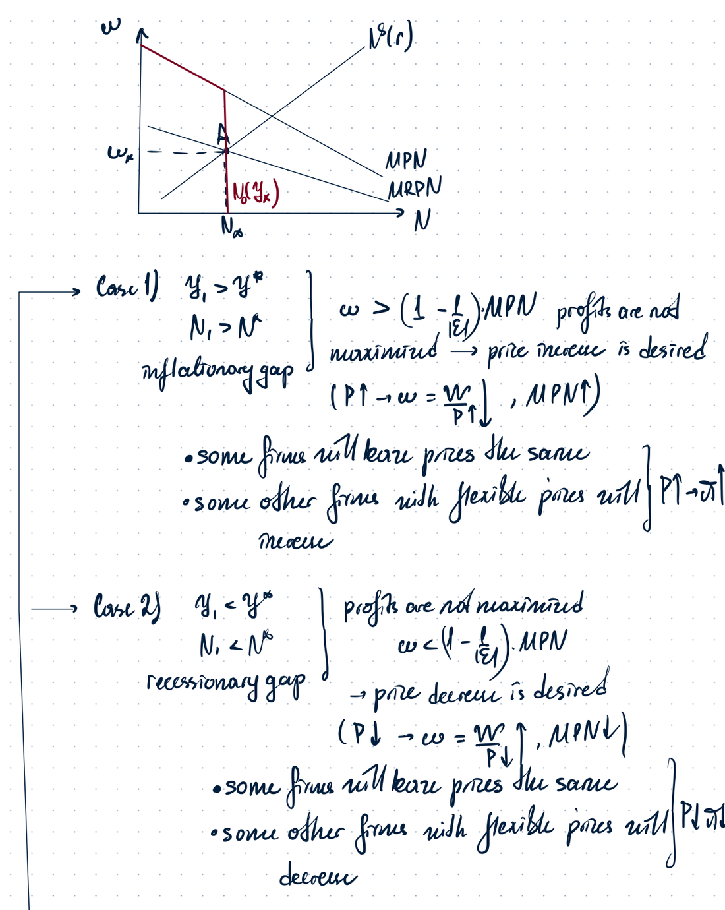

---

## 3. Why a larger output gap means stronger inflation pressure

The higher the output gap, the stronger the pressure on prices.

Reasons:

1. More firms want to change prices.
2. If $y-y^*$ is very large, then $N$ is very large. Since $MPN$ is diminishing, $MPN$ becomes very small. At the same time, the wage $w$ becomes large because $N^s$ is upward-sloping. The marginal cost of the firm is high, so a price increase is desired.
3. If $y-y^*$ is very small or negative, then $N$ is small. $MPN$ is large and $w$ is small. The marginal cost of the firm is low, so a price decrease is desired.

Inflation also depends positively on **expected future inflation**. Sticky-price firms know that they will not be able to change prices continually, so they set prices in advance and incorporate future expected shocks into current prices. The change in the current price level is less than one-for-one because less weight is given to future events.

---

## 4. Phillips curve

The Phillips curve in the notes is:

$$
\pi = \pi^e + \gamma (y-y^*) + \varepsilon,
$$

where:

- $\pi$ is inflation;
- $\pi^e$ is expected inflation;
- $y-y^*$ is the output gap;
- $\varepsilon$ is an unexpected supply shock;
- $\gamma$ is the slope of the Phillips curve.

### Shifting factors

Expected inflation:

$$
\pi^e \uparrow \quad \Rightarrow \quad PC \text{ shifts upward}.
$$

Unexpected supply shock:

$$
\varepsilon \uparrow \quad \Rightarrow \quad PC \text{ shifts upward}.
$$

Potential output:

$$
y^* \uparrow \quad \Rightarrow \quad PC \text{ shifts to the right}.
$$

### Slope

$$
\frac{\partial \pi}{\partial y}=\gamma.
$$

More nominal rigidity makes the Phillips curve flatter:

$$
\text{menu costs} \uparrow \Rightarrow \text{fewer firms with flexible prices} \Rightarrow \gamma \downarrow.
$$

More real rigidity also makes the Phillips curve flatter:

- $MPN$ becomes flatter;
- $MPN$ diminishes at a slower rate;
- marginal cost is flatter;
- there is less pressure on prices;
- labour supply may be flatter;
- efficiency wage mechanisms can make wages less sensitive to economic conditions.

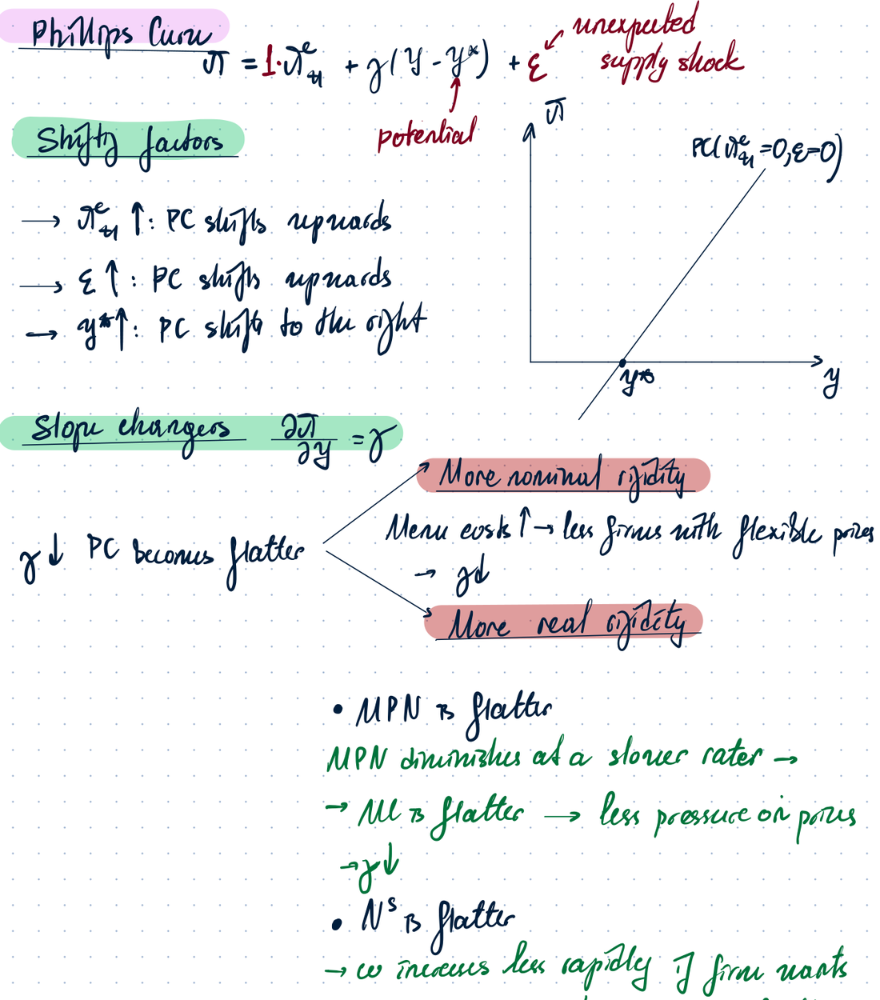

---

## 5. Demand side and the $MM$ curve

Output demand is:

$$
y^d = C + I + G.
$$

The $MM$ curve reflects central bank actions.

### Default case: Taylor-rule monetary policy

The notes use a Taylor-rule form:

$$
i = r^* + \pi + \alpha(\pi-\pi^*) + \beta(y-y^{target}).
$$

In real-interest-rate form:

$$
r = i-\pi = r^* + (\alpha-1)(\pi-\pi^*) + \beta(y-y^{target}).
$$

The **Taylor principle** requires:

$$
\alpha>1.
$$

If inflation rises by one percentage point, the central bank must increase the nominal interest rate by more than one percentage point, so that the ex post real interest rate also increases.

For example:

$$
\pi \uparrow \Rightarrow i \uparrow \text{ by more than } \Delta \pi
\Rightarrow r \uparrow
\Rightarrow C \downarrow, I \downarrow
\Rightarrow y \downarrow.
$$

This gives a downward-sloping $MM$ relation in $(\pi,y)$-space.

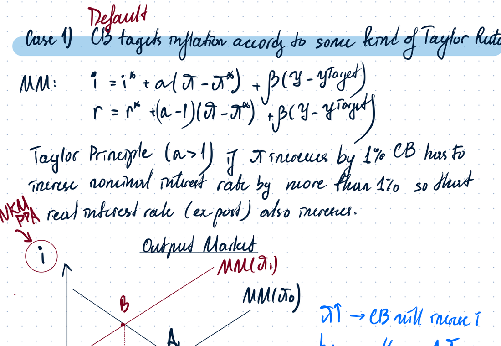

### Other policy regimes

**Case 2: strict inflation targeting**

If the central bank strictly targets inflation,

$$
\pi=\pi^{target},
$$

then the $y^d-MM$ curve is horizontal at the target inflation rate.

**Case 3: strict interest-rate targeting**

If the central bank strictly targets the nominal interest rate,

$$
i=i^*,
$$

then $\Delta i=0$. In the simplified setup, $\Delta C=\Delta I=0$, so $\Delta y^d=0$. The $y^d-MM$ curve is vertical.

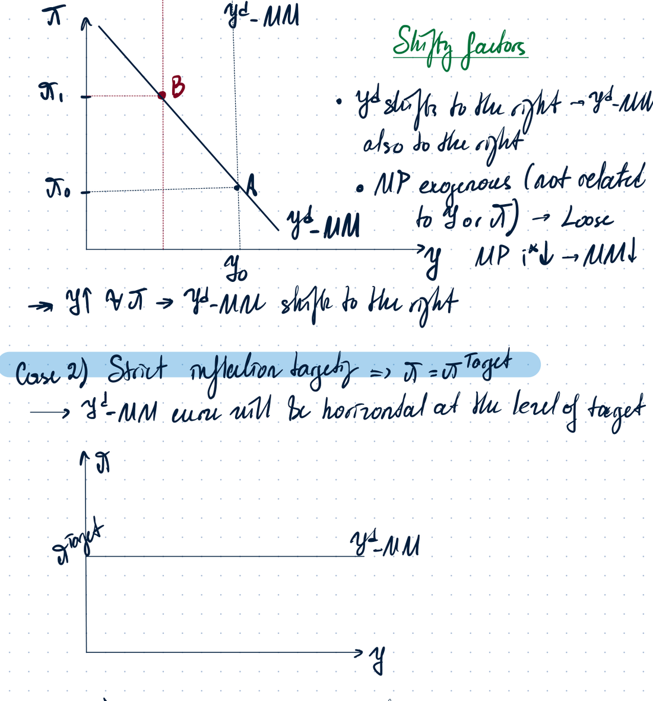

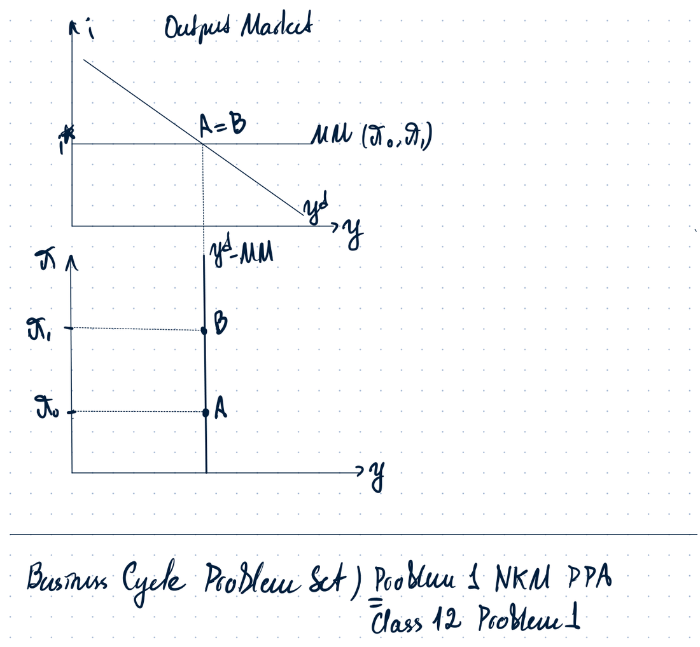

---

## 6. Problem 1: menu costs and tight monetary policy

**Problem setup.** Consider the Phillips curve and $y^d-MM$ in output-inflation space.

### Part (a): different menu costs

Two economies differ only by the size of menu costs. Both economies initially have the same equilibrium, and the same central bank tightens monetary policy. Compare the effect of tight monetary policy on equilibrium output and inflation.

Definition:

- menu costs are costs of changing prices;
- higher menu costs mean more nominal rigidity;
- more firms keep fixed prices;
- the same change in output has less pressure on inflation.

Therefore, the country with higher menu costs has a flatter Phillips curve.

If country A has higher menu costs than country B:

$$
\gamma_A < \gamma_B.
$$

Tight monetary policy means an increase in interest rates. The demand-side curve shifts left:

$$
i \uparrow \Rightarrow r \uparrow \Rightarrow C\downarrow, I\downarrow \Rightarrow y^d\downarrow.
$$

Since the Phillips curve is flatter in country A, the same demand contraction gives:

$$
|\Delta y_A|>|\Delta y_B|,
$$

but inflation falls less in country A:

$$
|\Delta \pi_A|<|\Delta \pi_B|.
$$

With lower menu costs, more firms adjust prices, so inflation responds more strongly and output responds less.

In the long run, monetary policy is neutral:

$$
y^n \text{ does not change}.
$$

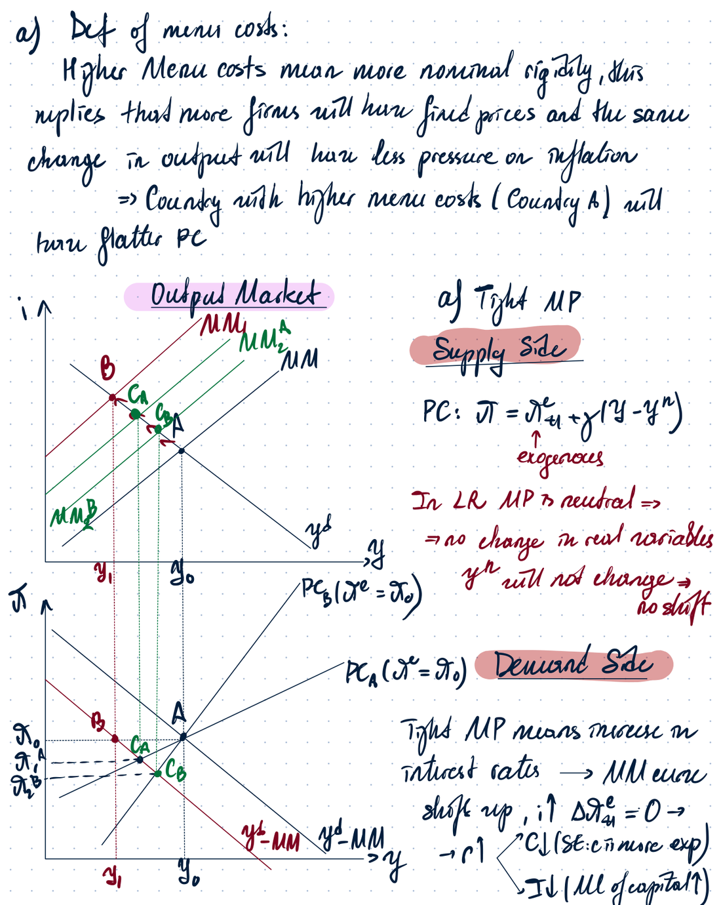

### Part (b): expected inflation from debt-reduction motives

Suppose the government tends to reduce the real burden of debt by causing unexpected inflation. Agents expect continued loose monetary policy.

Expected inflation rises:

$$
\pi^e \uparrow.
$$

Supply side:

$$
\pi^e \uparrow \Rightarrow PC \text{ shifts upward}.
$$

Firms that set prices in advance increase current prices for all levels of output.

Demand side:

$$
\pi^e \uparrow \Rightarrow r=i-\pi^e \downarrow
\Rightarrow C\uparrow, I\uparrow
\Rightarrow y^d-MM \text{ shifts to the right}.
$$

This can create an inflationary pressure. If the economy moves into a recessionary gap later, there is downward pressure on prices, but the central bank reacts according to the Taylor principle:

$$
\pi \uparrow \Rightarrow i \uparrow \text{ more than } \Delta \pi
\Rightarrow r \uparrow.
$$

As a result:

$$
C^{final}\downarrow, \qquad I^{final}\downarrow.
$$

The final outcome can include a recessionary output gap together with higher inflation expectations.

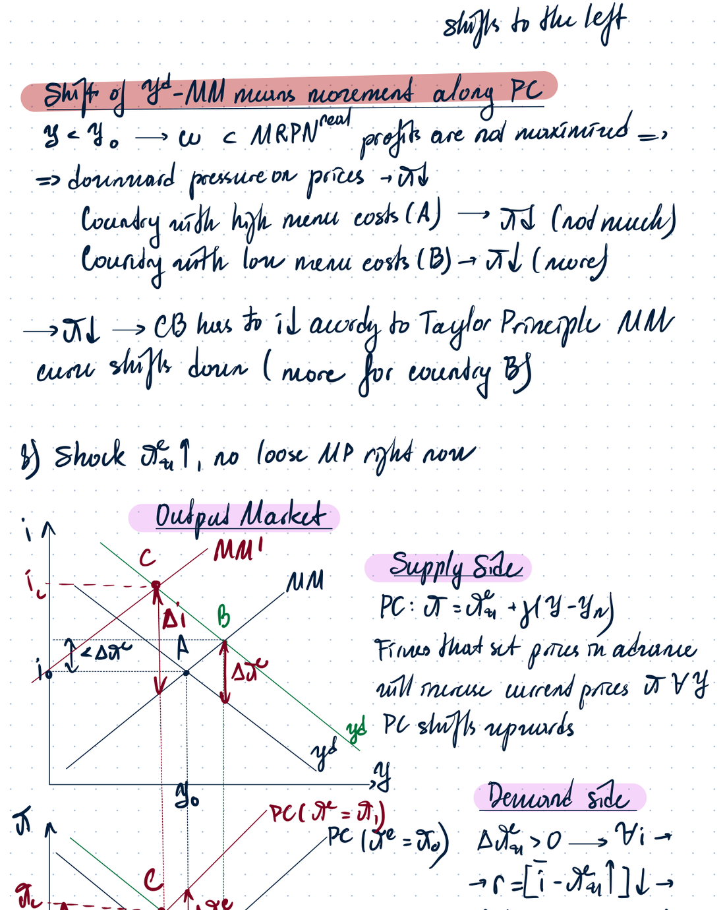

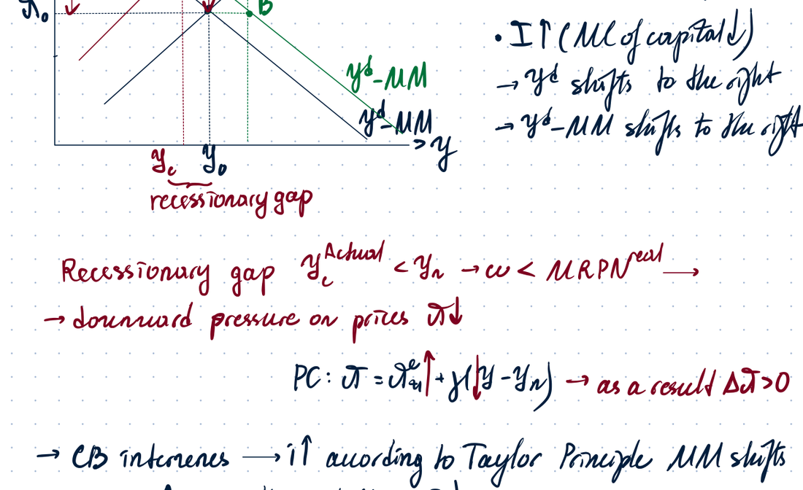

---

## 7. Time inconsistency: rules versus discretion

The policy maker may be called:

- policymaker;
- central planner;
- government;
- monetary authority;
- central bank.

### Rules / commitment

Under rules or commitment, the policymaker precommits to a rule, for example:

- Taylor rule;
- Friedman rule.

The advantage is stability. The disadvantage is less flexibility under uncertainty.

### Discretion

Under discretion:

- the policymaker has freedom of choice;
- there is no precommitment to a rule;
- each shock is treated uniquely.

The advantage is flexibility.

### Timing

The timing of a standard time-inconsistency problem is:

1. The policymaker announces a policy.
2. The public/private sector adjusts expectations rationally.
3. The policymaker conducts the policy that is ex post optimal after expectations have adjusted and shocks are realized.

The solution concept is SPNE. In practice, solve by backward induction.

### Definition

A policy is **time inconsistent** if the policymaker gains in the current period when the announcement is believed, but does not gain by implementing that announced policy when the time comes in the future, even if nothing fundamental has changed.

A policy is **time consistent** if there is no incentive ex post to follow a policy different from the one that was optimal to announce earlier.

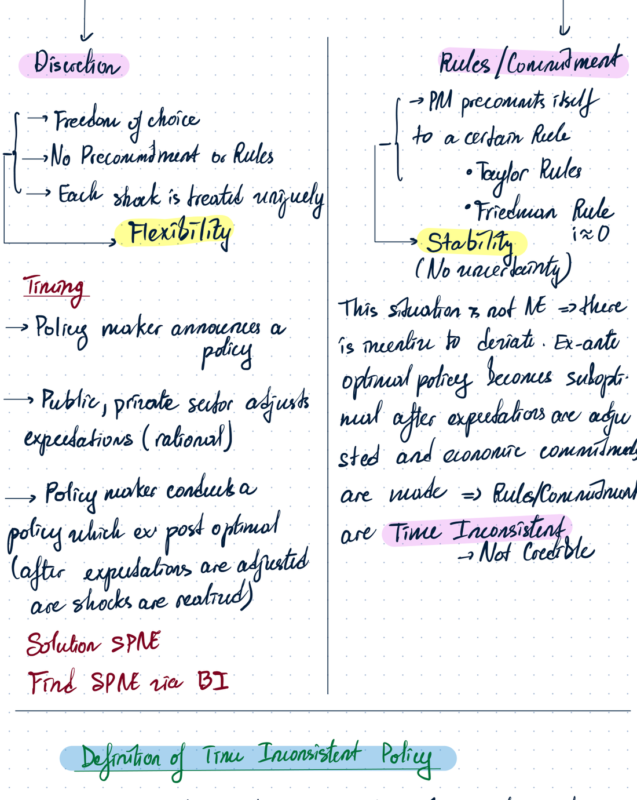

---

## 8. Examples of time-inconsistent policy

### Example 1: capital taxation

The government announces that tax rates on capital and capital income will be low.

If this is believed, it encourages investment and raises the capital stock, because building new capital takes time. Investment decisions depend on expected future tax rates.

But once capital is accumulated, the government has an incentive to impose higher taxes to raise capital-tax revenue.

### Example 2: inflation target

The central bank announces a low inflation target.

If this is believed, expected inflation falls. The nominal interest rate satisfies approximately:

$$
i = r + \pi^e.
$$

Lower expected inflation reduces the nominal interest rate and makes money a better store of value, encouraging economic activity. What matters for the interest rate on nominal bonds and for money-holding decisions is expected future inflation.

Ex post, however, the government has an incentive to tolerate a one-off burst of inflation:

- to reduce the real value of government liabilities;
- to earn higher seigniorage revenue.

---

## 9. Class 12 Problem 2: Barro-Gordon-style debt and inflation problem

**Problem setup.** The government is not concerned with unemployment but wants to reduce the real debt burden. Its loss function is:

$$
L=\pi^2+cD,
$$

where:

- $D$ is the real value of government debt;
- $c$ is the government's preference for reducing debt.

Debt is:

$$
D=(1+r^*+\pi^e-\pi)D_0,
$$

where $D_0$ is debt from last year and $i$ is the nominal interest rate.

The nominal interest rate is determined by:

$$
i=r^*+\pi^e.
$$

The model describes the trade-off between debt and inflation:

$$
\pi \uparrow \Rightarrow D \downarrow,
$$

but inflation is costly because of $\pi^2$.

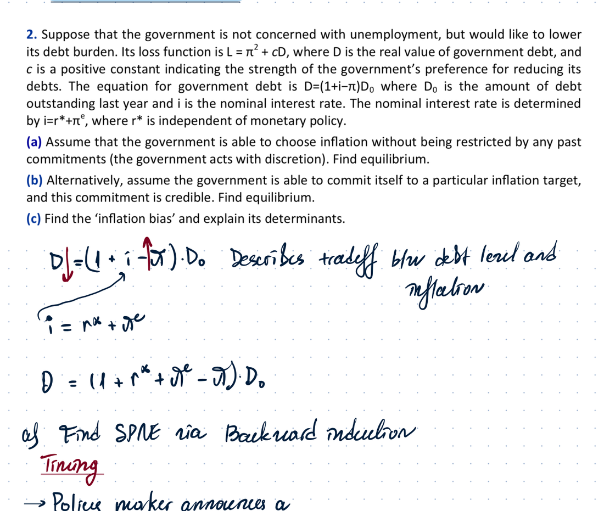

---

## 10. Discretion: find SPNE by backward induction

Timing:

1. The policymaker announces a policy.
2. The private sector sets expectations rationally.
3. The policymaker chooses the ex post optimal policy.

Given $\pi^e$, the policymaker minimizes:

$$
L=\pi^2+c(1+r^*+\pi^e-\pi)D_0.
$$

FOC with respect to $\pi$:

$$
\frac{\partial L}{\partial \pi}=2\pi-cD_0=0.
$$

Therefore the best response of the policymaker is:

$$
\pi(\pi^e)=\frac{cD_0}{2}.
$$

Under rational expectations:

$$
\pi^e=E\pi=\frac{cD_0}{2}.
$$

Hence the discretionary equilibrium is:

$$
\pi^{Disc}=\pi^e=\frac{cD_0}{2}.
$$

Since $\pi^e=\pi$, real debt is:

$$
D^{Disc}=(1+r^*)D_0.
$$

The discretionary loss is:

$$
L^{Disc}=\frac{c^2D_0^2}{4}+c(1+r^*)D_0.
$$

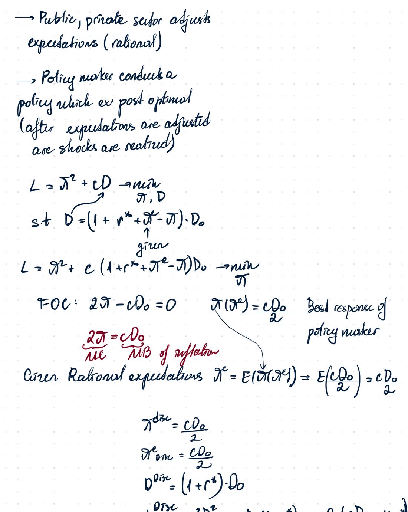

---

## 11. Commitment to an inflation target

Now assume the central bank precommits to a certain inflation level $\bar{\pi}$, and that the commitment is credible.

Then:

$$
\pi^e=\pi=\bar{\pi}.
$$

Debt becomes:

$$
D=(1+r^*)D_0.
$$

The government chooses $\bar{\pi}$ to minimize:

$$
L=\bar{\pi}^2+c(1+r^*)D_0.
$$

FOC:

$$
2\bar{\pi}=0.
$$

Thus:

$$
\pi^{Rule}=0,
$$

$$
D^{Rule}=(1+r^*)D_0,
$$

$$
L^{Rule}=c(1+r^*)D_0.
$$

The rule is preferred ex ante:

$$
L^{Rule}<L^{Disc}.
$$

However, commitment is usually time inconsistent.

If the public believes the rule and sets $\pi^e=0$, the policymaker has an incentive to deviate. The optimal deviation is:

$$
\pi^{Dev}=\frac{cD_0}{2}.
$$

Debt under deviation is:

$$
D^{Dev}=\left(1+r^* - \frac{cD_0}{2}\right)D_0.
$$

Loss under deviation is:

$$
L^{Dev}=\frac{c^2D_0^2}{4}+c\left(1+r^* - \frac{cD_0}{2}\right)D_0.
$$

Equivalently:

$$
L^{Dev}=c(1+r^*)D_0-\frac{c^2D_0^2}{4}<L^{Rule}.
$$

So the policymaker would deviate after expectations are set. This is the time inconsistency.

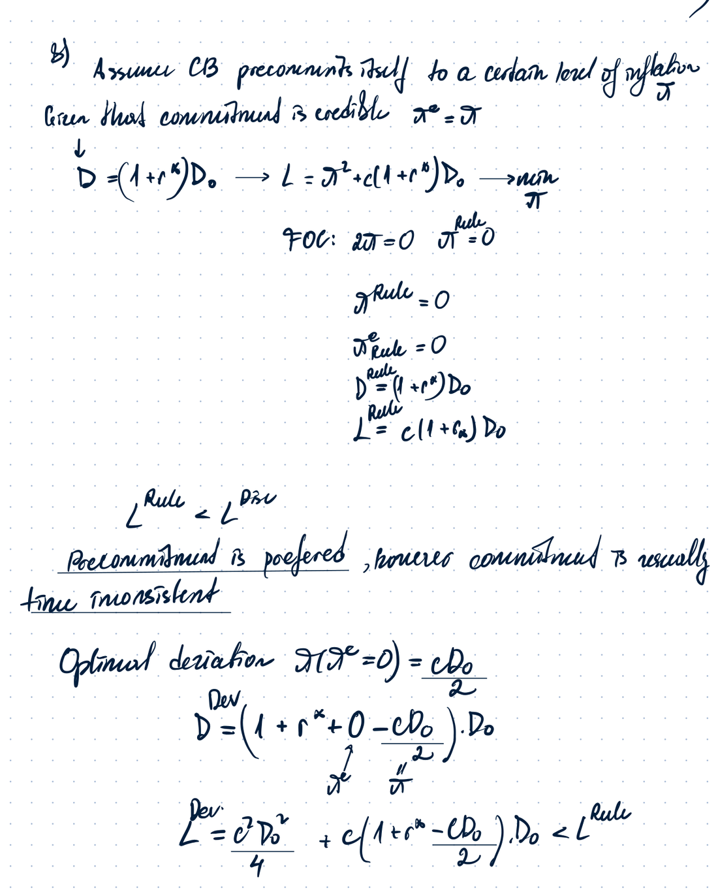

---

## 12. Inflation bias and its determinants

Inflation bias is:

$$
IB=\pi^{Disc}-\pi^{Rule}.
$$

Using the results above:

$$
IB=\frac{cD_0}{2}-0=\frac{cD_0}{2}.
$$

Determinants:

$$
\frac{\partial IB}{\partial c}=\frac{D_0}{2}>0.
$$

If the central bank dislikes debt more, the marginal benefit of inflation is higher, so it tends to increase inflation more.

$$
\frac{\partial IB}{\partial D_0}=\frac{c}{2}>0.
$$

If the initial debt burden is higher, the marginal benefit of inflation is higher, so the policymaker tends to increase inflation more.

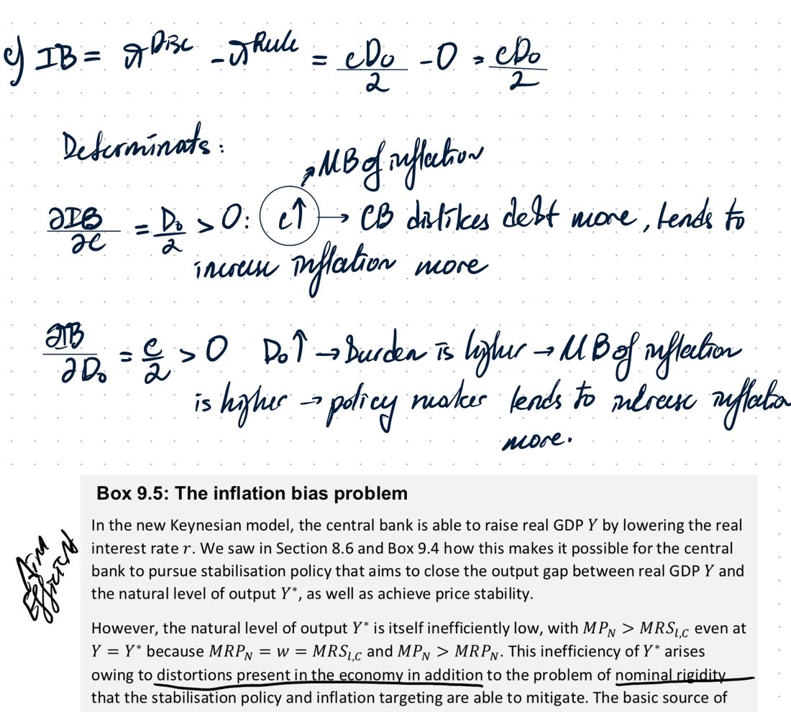

---

## 13. Inflation bias intuition from Box 9.5

The notes connect the inflation-bias problem to the New Keynesian model.

In the New Keynesian model, the central bank can raise real GDP $Y$ by lowering the real interest rate $r$. This makes it possible to close the output gap between real GDP $Y$ and the natural level $Y^*$, while also aiming at price stability.

However, the natural level $Y^*$ may itself be inefficiently low because of distortions such as imperfect competition and efficiency wages. This creates a temptation for monetary policy to push output above $Y^*$.

If the central bank unexpectedly stimulates the economy:

$$
r<r^* \Rightarrow Y>Y^*.
$$

The economy moves along the Phillips curve with both output and inflation rising. This may seem to improve real GDP at the cost of some inflation.

But if the public anticipates this policy, expected inflation rises:

$$
\pi^e \uparrow \Rightarrow PC \text{ shifts upward}.
$$

Then more inflation is required to obtain the same output gain. Eventually, inflation becomes too costly to tolerate. Monetary policy suffers from an **inflation bias**: discretionary policy creates higher inflation without achieving the original output objective.

A credible low-inflation commitment can solve the problem, but the commitment itself is time inconsistent. Institutional mechanisms such as central bank independence and formal inflation targeting can help make the low-inflation rule credible.

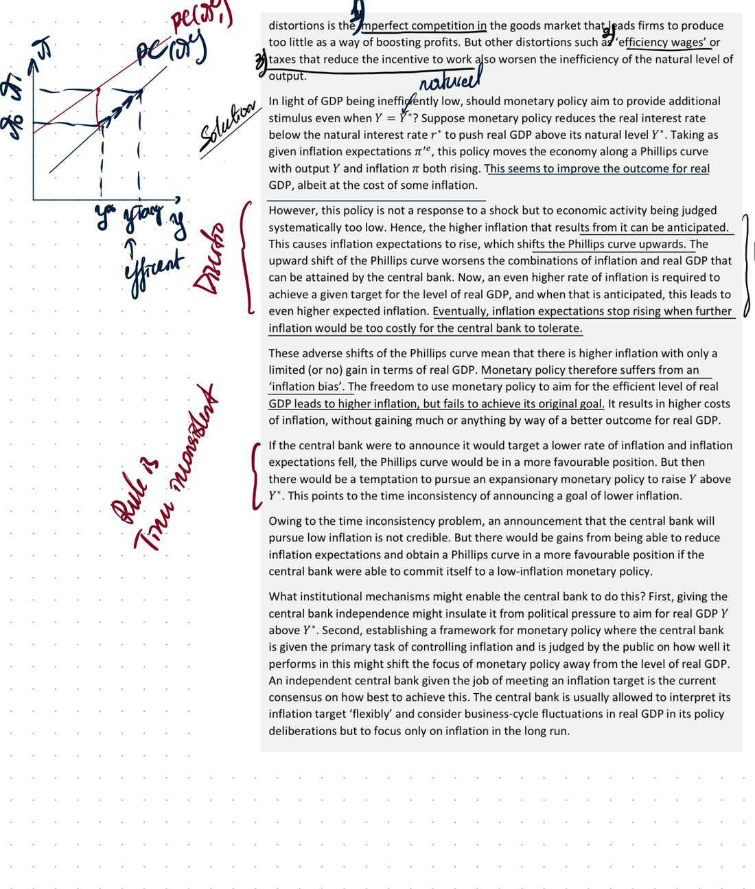
