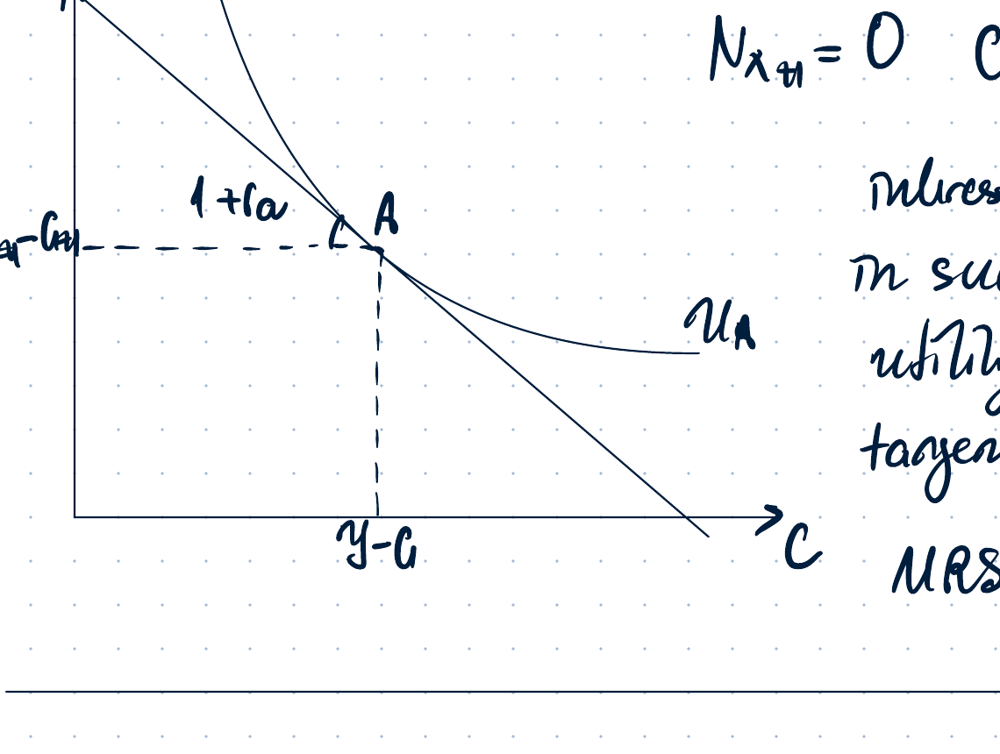
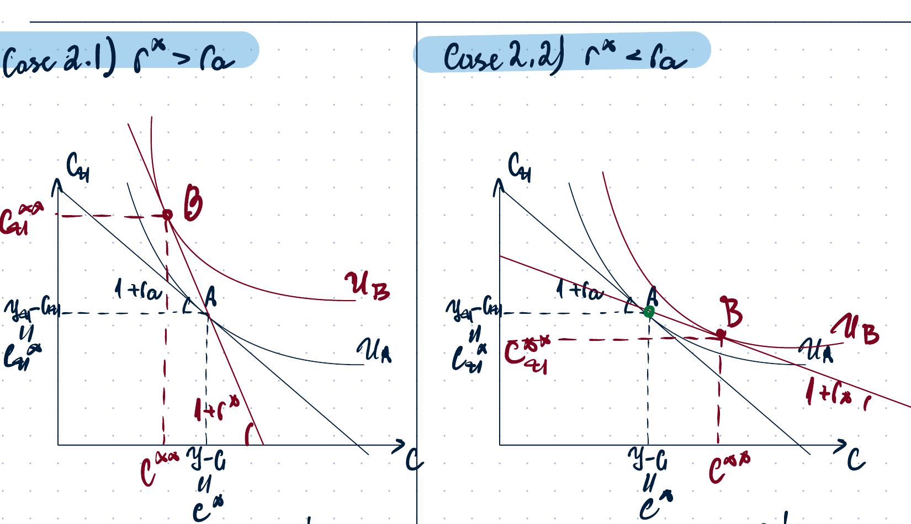
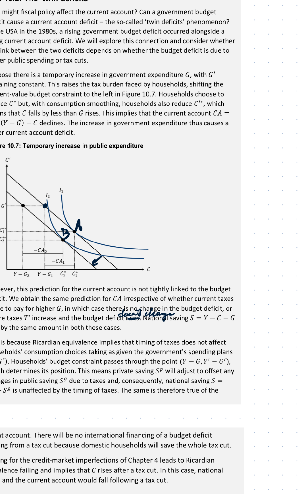
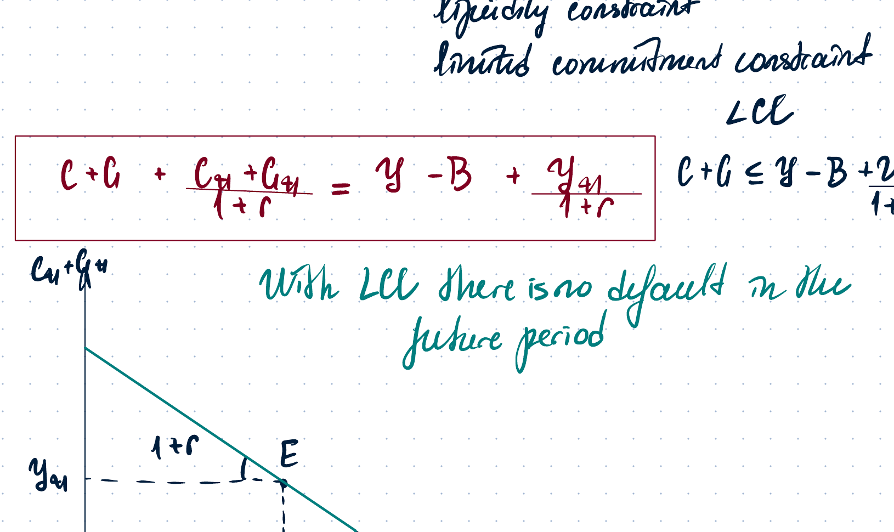
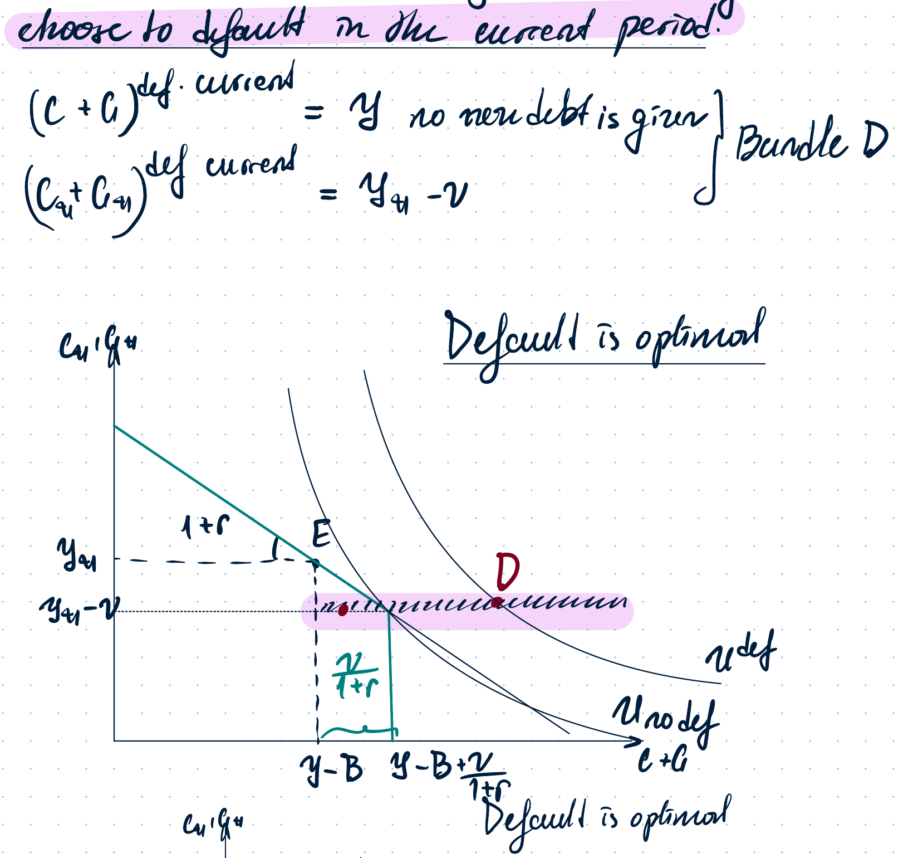
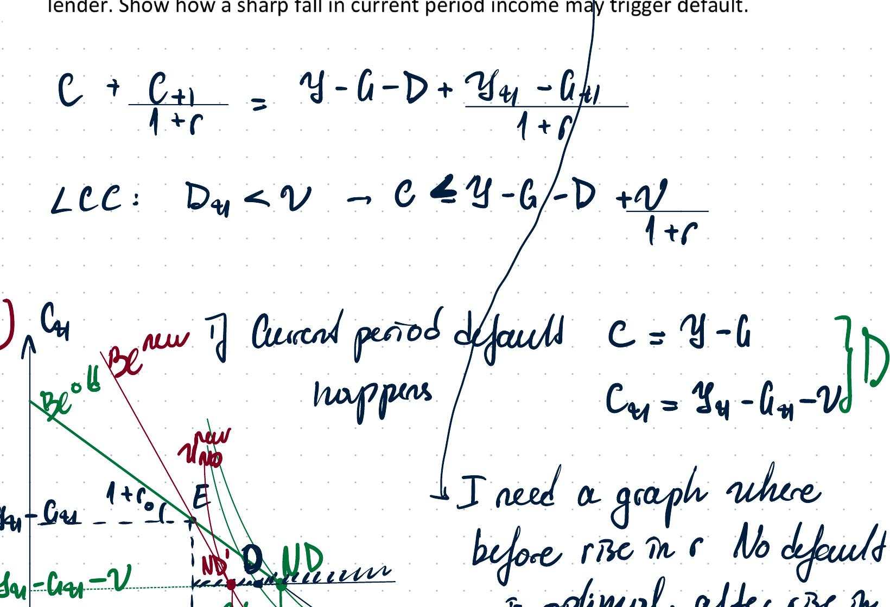
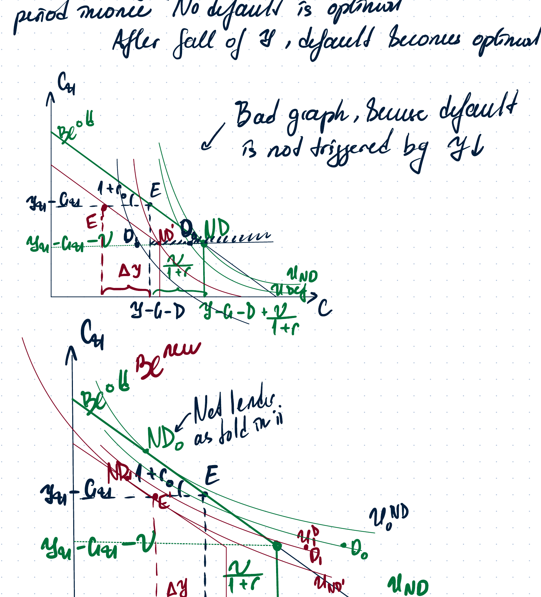
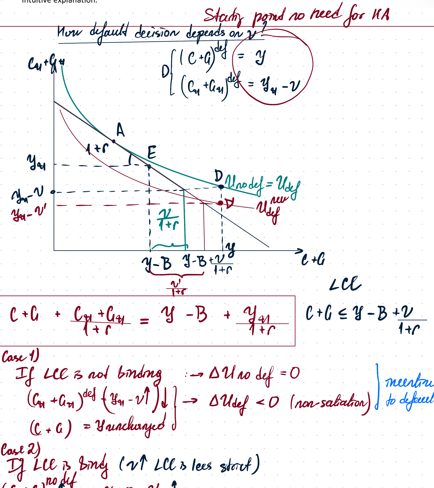
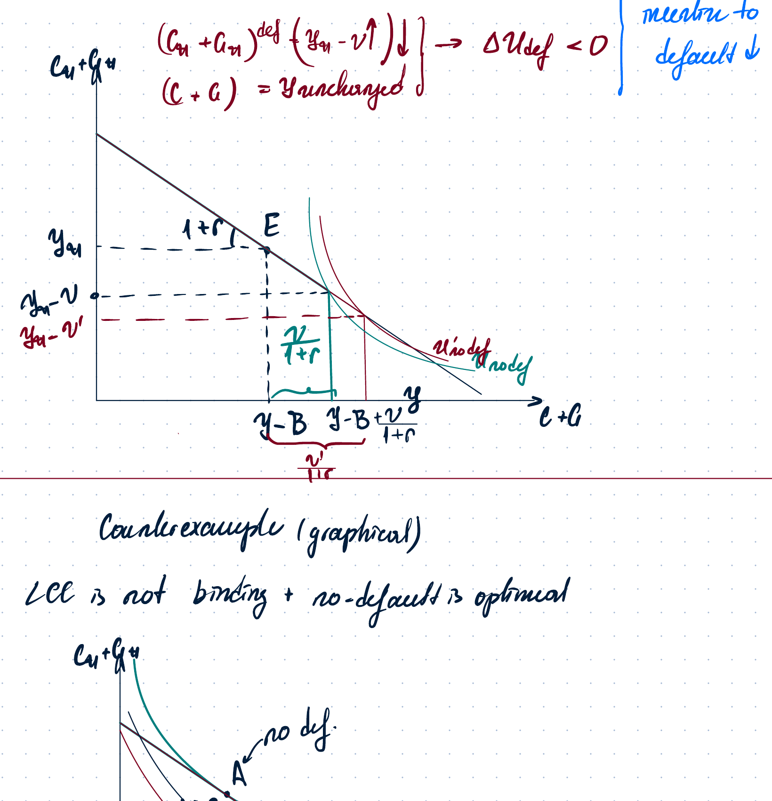

# Week 13 - Open Economy

## 1. Open-economy model overview

Open-economy models in the course are split into two groups.

**Partial-equilibrium models** usually take output and interest rates as exogenous:

1. model of international trade;
2. sovereign default model / limited-commitment-constraint model.

**General-equilibrium models** are the normal GE models extended to an open economy:

1. real GE in an open economy;
2. nominal GE in an open economy;
3. sticky-price open-economy model with capital account.

## 2. Balance of payments

The balance of payments is the sum of the current account and the financial account:

$$
BP = CA + FA.
$$

The current account is

$$
CA = NX + NFI,
$$

where:

- $NX = Ex - Im$ is net exports;
- $NFI$ is net foreign income: domestic income on foreign assets minus foreign income on domestic assets per period.

The financial account is

$$
FA = \text{net foreign purchases of domestic assets}
- \text{net domestic purchases of foreign assets}.
$$

Because the balance of payments must balance,

$$
BP = CA + FA = 0,
$$

so

$$
CA = -FA.
$$

Foreign-exchange-market interpretation:

- if $BP > 0$, there is excess demand for domestic currency, so the domestic currency appreciates;
- if $BP < 0$, there is excess supply of domestic currency, so the domestic currency depreciates.

## 3. Output and saving decomposition

Output decomposition:

$$
y = C + I + G + NX.
$$

Gross national product is

$$
GNP = y + NFI.
$$

National saving is the sum of private and government saving:

$$
S_{nat} = S_p + S_{gov}.
$$

Private saving:

$$
S_p = y - T + INT + NFI - C,
$$

where $INT$ is net interest paid on domestic bonds.

Government saving:

$$
S_{gov} = T - G - INT.
$$

Therefore,

$$
S_{nat}
= y - C - G + NFI
= I + NX + NFI
= I + CA.
$$

Hence the capital-formation equation is

$$
S_{nat} = I + CA,
$$

or

$$
I = S_{nat} - CA.
$$

Interpretation:

- if $CA > 0$ and $FA < 0$, then $I < S_{nat}$ and the economy is a net lender;
- if $CA < 0$ and $FA > 0$, then $I > S_{nat}$ and the economy is a net borrower.

## 4. Net foreign assets

Net foreign assets are a stock:

$$
NFA = \text{domestically owned assets in foreign economies}
- \text{foreign-owned assets in the domestic economy}.
$$

The law of motion is

$$
NFA_{t+1}
= NFA_t
+ \text{net domestic purchases of foreign assets}
- \text{net foreign purchases of domestic assets}.
$$

Since the financial account is defined as net foreign purchases of domestic assets minus net domestic purchases of foreign assets,

$$
NFA_{t+1} = NFA_t - FA_t.
$$

Using $CA_t = -FA_t$,

$$
NFA_{t+1}=NFA_t+CA_t.
$$

## 5. Model of international trade

This is a partial-equilibrium model. Output in both periods is taken as exogenous:

$$
y, y_1 \quad \text{given exogenously.}
$$

Assumptions used in the derivation:

$$
NFI = r \cdot NFA,
$$

$$
I = 0 \quad \text{for simplicity,}
$$

$$
NFA_0 = 0 \quad \text{no initial asset position,}
$$

and there are only two periods, so

$$
NFA_2 = 0.
$$

Since

$$
NFA_1 = CA_0,
$$

and

$$
NFA_2 = NFA_1 + CA_1 = 0,
$$

we get

$$
CA_0 + CA_1 = 0
$$

in stock terms. With interest, the two-period current-account restriction is written as

$$
CA_0 + \frac{CA_1}{1+r} = 0.
$$

The notes derive it through net exports. In period 0, because $NFI_0=0$,

$$
CA_0 = NX_0.
$$

In period 1,

$$
NFI_1 = rNFA_1 = rCA_0,
$$

so

$$
CA_1 = NX_1 + rCA_0.
$$

Substituting into the intertemporal condition gives

$$
NX_0 + \frac{NX_1}{1+r}=0.
$$

Since

$$
NX_0 = y - G - C,
$$

and

$$
NX_1 = y_1 - G_1 - C_1,
$$

the combined household/resource constraint is

$$
C + \frac{C_1}{1+r}
=
y-G+\frac{y_1-G_1}{1+r}.
$$

This is the main two-period open-economy budget line.

## 6. Case 1: autarky, no trade, closed economy

In autarky there is no trade:

$$
NX_0 = 0,
$$

$$
NX_1 = 0.
$$

Therefore consumption equals domestic resources in each period:

$$
C^A = y-G,
$$

$$
C_1^A = y_1-G_1.
$$

The interest rate is endogenous. It adjusts so that utility is maximized at the endowment point $A$:

$$
MRS(y-G,\, y_1-G_1)=1+r_a.
$$

The graph shows the closed-economy endowment point $A$. Since $NX=0$ in each period, the country cannot move consumption away from its own endowment bundle through international borrowing or lending.

## 7. Case 2: open economy with perfect capital mobility

Now assume the economy is open and international trade in assets is allowed.

Perfect capital mobility means the domestic interest rate must equal the international interest rate:

$$
r = r^*.
$$

If initially

$$
r^* > r,
$$

individuals sell domestic bonds and buy foreign bonds. The price of domestic bonds falls, so the domestic interest rate rises:

$$
P_{bond}\downarrow \quad \Rightarrow \quad r\uparrow.
$$

If initially

$$
r^* < r,
$$

individuals buy domestic bonds and sell foreign bonds. The price of domestic bonds rises, so the domestic interest rate falls:

$$
P_{bond}\uparrow \quad \Rightarrow \quad r\downarrow.
$$

For a small open economy, internal shocks do not affect the world interest rate:

$$
\Delta r^* = 0.
$$

### 7.1. Case $r^* > r_a$: economy is a net lender

If the world interest rate is above the autarky rate, the intertemporal budget line becomes steeper. The country moves from the autarky point $A$ to a new point $B$ with lower current consumption and higher future consumption.

The current account is

$$
CA = NX = y-G-C^{eq}>0.
$$

Therefore the economy is a net lender.

### 7.2. Case $r^* < r_a$: economy is a net borrower

If the world interest rate is below the autarky rate, the intertemporal budget line becomes flatter. The country moves from $A$ to $B$ with higher current consumption and lower future consumption.

The current account is

$$
CA = NX = y-G-C^{eq}<0.
$$

Therefore the economy is a net borrower.

In both cases,

$$
U_B > U_A.
$$

There are gains from trade because the economy can still afford the old bundle $A$, but it chooses a better bundle $B$ on a higher indifference curve. This follows from WARP and smooth preferences.

## 8. Class problem: temporary government-purchases increase in a small open economy

Setup: a small open economy with perfect capital mobility and fixed $r^*$ experiences a temporary increase in current government purchases:

$$
\Delta G > 0,
$$

$$
\Delta G_1 = 0.
$$

There are two financing cases:

1. the increase is financed by borrowing;
2. the increase is financed by current taxes.

A **twin deficit** means both a current-account deficit and a government budget deficit:

$$
CA < 0,
$$

and

$$
BD = -S_{gov}<0
$$

in the budget-deficit notation used in the notes.

### 8.1. Borrowing finance

If the government borrows today, then

$$
\Delta T = 0.
$$

The government accumulates debt today and must repay it tomorrow:

$$
\Delta T_1 = (1+r)\Delta G.
$$

A higher future tax burden reduces household wealth. Since consumption is a normal good,

$$
\text{wealth}\downarrow \quad \Rightarrow \quad C\downarrow.
$$

Because the shock is temporary and households smooth consumption,

$$
0 < |\Delta C| < \Delta G.
$$

The current account is

$$
CA = y-G-C.
$$

Therefore,

$$
\Delta CA = -\Delta G - \Delta C < 0.
$$

So the current account worsens.

Savings decomposition:

$$
S_p = y-T+NFI-C,
$$

so with $\Delta T=0$,

$$
\Delta S_p = -\Delta C > 0.
$$

Government saving is

$$
S_{gov}=T-G-INT,
$$

so

$$
\Delta S_{gov} = -\Delta G < 0.
$$

National saving changes by

$$
\Delta S_{nat}=\Delta S_p+\Delta S_{gov}
= -\Delta C-\Delta G<0.
$$

This is the same as the current-account deterioration.

### 8.2. Tax finance

If the current government-purchases increase is financed by current taxes,

$$
\Delta G = \Delta T > 0,
$$

and

$$
\Delta T_1=0.
$$

Again, the tax burden increases and household wealth falls. Consumption falls, but by less than the temporary fiscal shock:

$$
0<|\Delta C|<\Delta G.
$$

The current account still changes as

$$
\Delta CA = -\Delta G-\Delta C<0.
$$

Savings decomposition:

$$
\Delta S_p = -\Delta T-\Delta C<0,
$$

$$
\Delta S_{gov}=\Delta T-\Delta G=0,
$$

so

$$
\Delta S_{nat}=-\Delta T-\Delta C=\Delta CA<0.
$$

### 8.3. Main result

Financing does not matter for the current account here. In both cases:

$$
\Delta CA<0.
$$

The budget deficit worsens only under borrowing finance, but the current account worsens under both financing methods. This is the Ricardian-equivalence logic in the two-period open-economy setting.

The source excerpt explains that a temporary increase in government purchases reduces national saving and worsens the current account. The timing of taxes does not matter when Ricardian equivalence holds, because households internalize future taxes.

## 9. Sovereign default model

The sovereign default model is an external-debt partial-equilibrium model. Output is exogenous:

$$
y,\ y_1 \quad \text{given exogenously.}
$$

Main assumptions:

- there is no distinction between private and public debt;
- default is a rational decision;
- old debt is exogenous;
- new debt is chosen subject to the lender's willingness to lend.

Let $B$ denote inherited debt. Let $B_1$ denote new debt. Period 0 budget constraint:

$$
c+g = y-B+\frac{B_1}{1+r}.
$$

Period 1 budget constraint:

$$
c_1+g_1 = y_1-B_1.
$$

Combining:

$$
c+g+\frac{c_1+g_1}{1+r}
=
y-B+\frac{y_1}{1+r}.
$$

This is the preliminary intertemporal budget constraint before default incentives are imposed.

Default can happen either:

1. in the current period;
2. in the future period.

## 10. Default in the future period and the limited commitment constraint

If the country repays in the current period but may default in the future, the period 0 constraint is

$$
c+g = y-B+\frac{B_1}{1+r}.
$$

If it defaults in the future, then future resources are reduced by the default penalty $v$:

$$
(c_1+g_1)^{def}_{future}=y_1-v.
$$

If it does not default in the future,

$$
(c_1+g_1)^{no\ def}_{future}=y_1-B_1.
$$

Lenders will lend only if no future default is expected:

$$
(c_1+g_1)^{no\ def}_{future}
\geq
(c_1+g_1)^{def}_{future}.
$$

Thus,

$$
y_1-B_1 \geq y_1-v,
$$

so

$$
B_1 \leq v.
$$

This is the **liquidity constraint / limited commitment constraint (LCC)**. New borrowing is constrained by the default penalty or collateral value.

Substituting $B_1\leq v$ into the period 0 budget constraint gives the current-period borrowing limit:

$$
c+g \leq y-B+\frac{v}{1+r}.
$$

With the LCC, there is no default in the future period.

The graph shows the kinked feasible set with the borrowing limit. The vertical segment corresponds to the maximum amount that lenders are willing to lend without expecting future default.

## 11. Default in the current period

Even if future default is ruled out by the LCC, the country can still choose to default in the current period because inherited debt $B$ is exogenous.

If the country defaults now, no new debt is given. The default bundle is

$$
(c+g)^{def}_{current}=y,
$$

$$
(c_1+g_1)^{def}_{current}=y_1-v.
$$

This is bundle $D$ in the notes.

If the country does not default, it chooses the best feasible point under the budget constraint and LCC. The country compares

$$
U^{def}
$$

with

$$
U^{no\ def}.
$$

Default is optimal if

$$
U^{def}>U^{no\ def}.
$$

No default is optimal if

$$
U^{no\ def}\geq U^{def}.
$$

The first graph shows a case where the default bundle lies on a higher indifference curve, so default is optimal. The second graph shows a case where the best no-default allocation gives higher utility, so no default is optimal.

## 12. Class problem: interest-rate increase and current income fall

Setup: a small open economy with perfect capital mobility and fixed income. Initial debt $D$ includes both principal and interest. If default occurs in either the current or future period, a cost $v$ is paid.

The no-default budget constraint is written as

$$
c+\frac{c_1}{1+r}
=
y-D+\frac{y_1}{1+r}.
$$

The limited commitment constraint is

$$
D_1 < v,
$$

or equivalently in current consumption form,

$$
c \leq y-G-D+\frac{v}{1+r}.
$$

### 12.1. Increase in the interest rate

A higher interest rate increases the burden of inherited debt and shifts the no-default feasible set inward. The requested graph is one where before the rise in $r$ no default is optimal, but after the rise in $r$ default becomes optimal.

The graph compares the no-default feasible set before and after the interest-rate increase. After the shock, the best no-default bundle can fall below the default bundle in utility terms, so current-period default becomes optimal.

### 12.2. Fall in current income after the country expected to become a net lender

If the country was initially expecting to repay debt and become a net lender, a fall in current income can make default optimal. The notes stress that the graph must show default being triggered by the fall in current income itself, not by some unrelated shift.

The page first marks a “bad graph” because default is not actually triggered by the fall in $y$. The corrected graph shows the fall in current income shifting the relevant no-default feasible set so that default becomes optimal.

## 13. Home-assignment comments: forward guidance and liquidity trap

For the liquidity-trap / forward-guidance question, the notes use the expectation-theory logic for the long-term rate:

$$
I = \frac{i+i_1^e}{2}.
$$

At the zero lower bound,

$$
i \approx 0.
$$

Conventional monetary policy is ineffective because the current short-term nominal rate cannot be pushed further down. Forward guidance works by reducing expected future nominal rates:

$$
\Delta i_1^e<0.
$$

This reduces the long-term rate:

$$
\Delta I<0,
$$

which stimulates current consumption:

$$
C\uparrow.
$$

The notes also add: if a question asks about real rigidity, check how real rigidity changes the slope of the Phillips curve.

## 14. Home-assignment comments: sovereign default with limited commitment

Question: in a sovereign default model with limited commitment, analyze whether a country is better off after defaulting if foreign debt is low.

The default allocation is

$$
(c+g)^{def}=y,
$$

$$
(c_1+g_1)^{def}=y_1-v.
$$

The no-default allocation is chosen under the intertemporal constraint and the LCC:

$$
c+g+\frac{c_1+g_1}{1+r}=y-B+\frac{y_1}{1+r},
$$

$$
c+g \leq y-B+\frac{v}{1+r}.
$$

The decision depends on whether the LCC is binding.

### 14.1. Case 1: LCC is not binding

If the LCC is not binding, a change in $v$ does not affect the no-default optimum:

$$
\Delta U^{no\ def}=0.
$$

But default becomes worse when the future penalty is larger, because future default consumption is lower:

$$
\Delta U^{def}<0
$$

when the penalty increases.

Therefore, the incentive to default falls.

### 14.2. Case 2: LCC is binding

If the LCC is binding, a lower penalty $v$ makes the LCC stricter. This shrinks the no-default feasible set:

$$
v\downarrow \quad \Rightarrow \quad \text{borrowing limit tightens}.
$$

Then no-default utility can fall. In this case, the effect on default incentives is not mechanically the same as in the non-binding case.

The notes separate the case where the LCC is not binding from the case where it is binding. The default decision depends on how the feasible set changes, not only on the size of foreign debt.

### 14.3. Graphical counterexample

The notes give a graphical counterexample: when the LCC is not binding and no default is optimal, low foreign debt does not imply that default becomes optimal.

The counterexample shows that the claim is false in general. If the limited commitment constraint is not binding and the no-default allocation remains preferred, default is not optimal even when debt is low.
