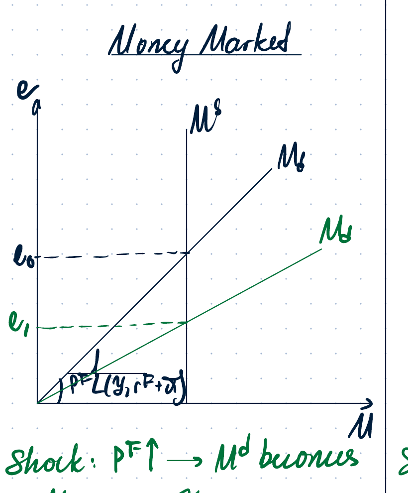
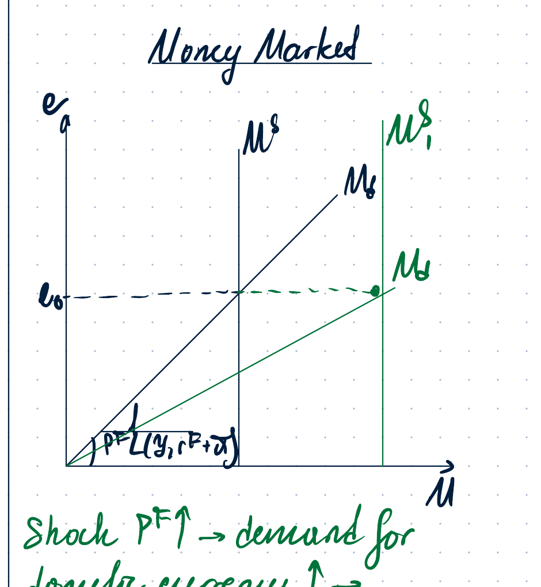
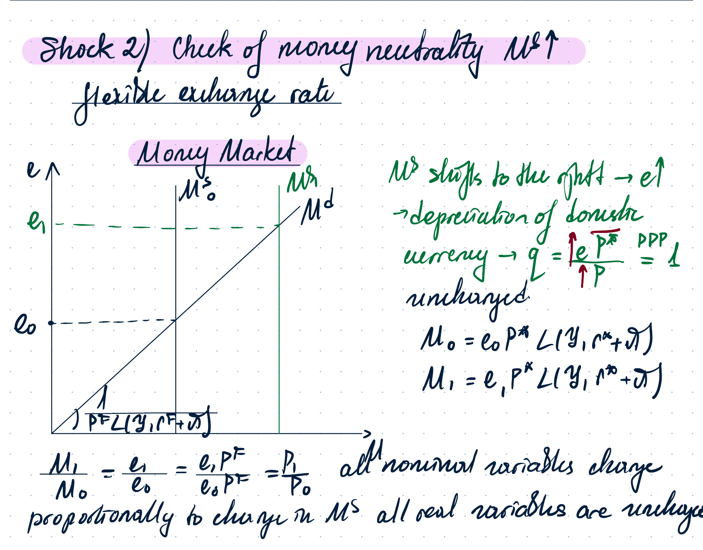
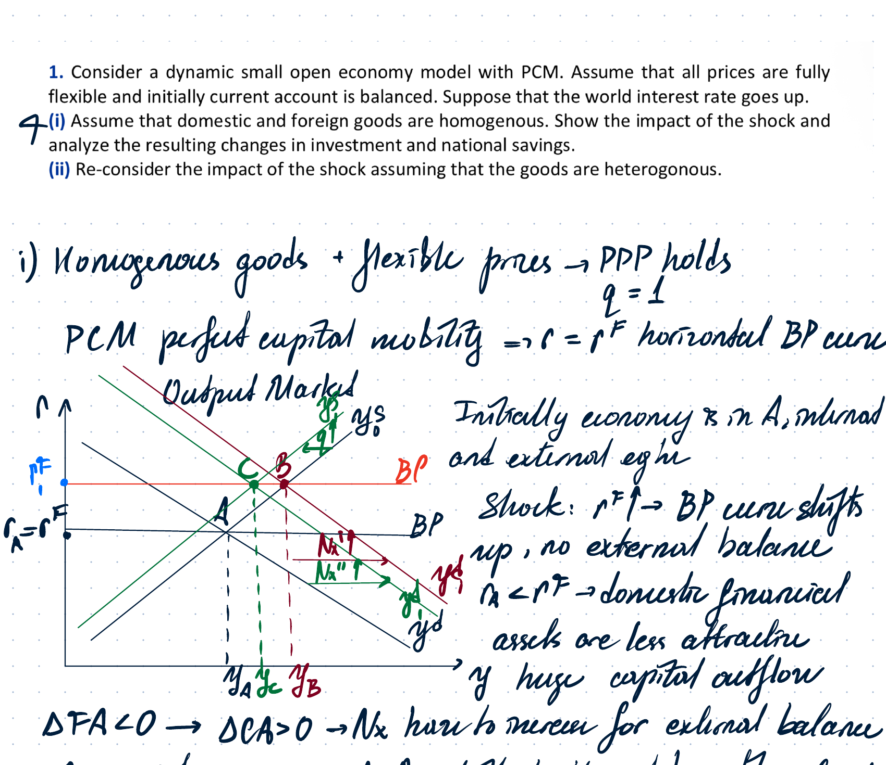
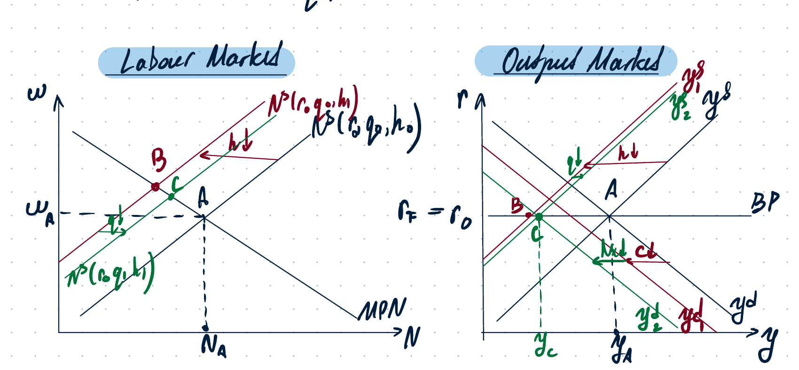
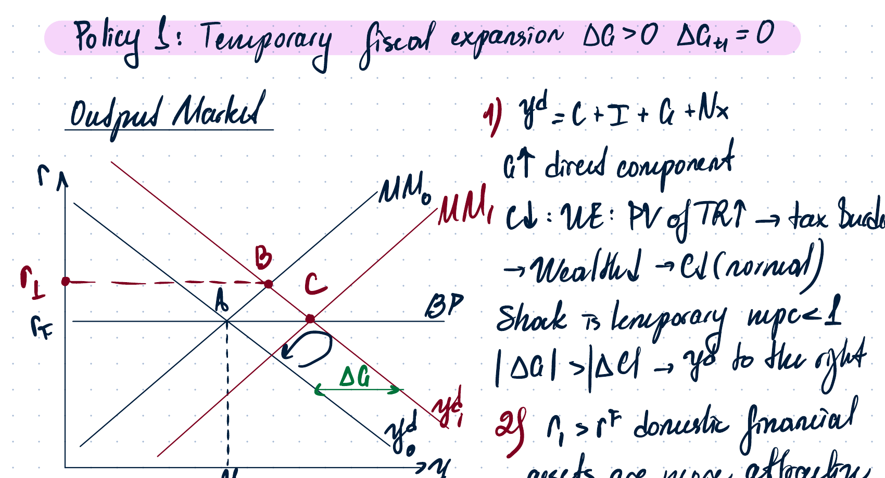
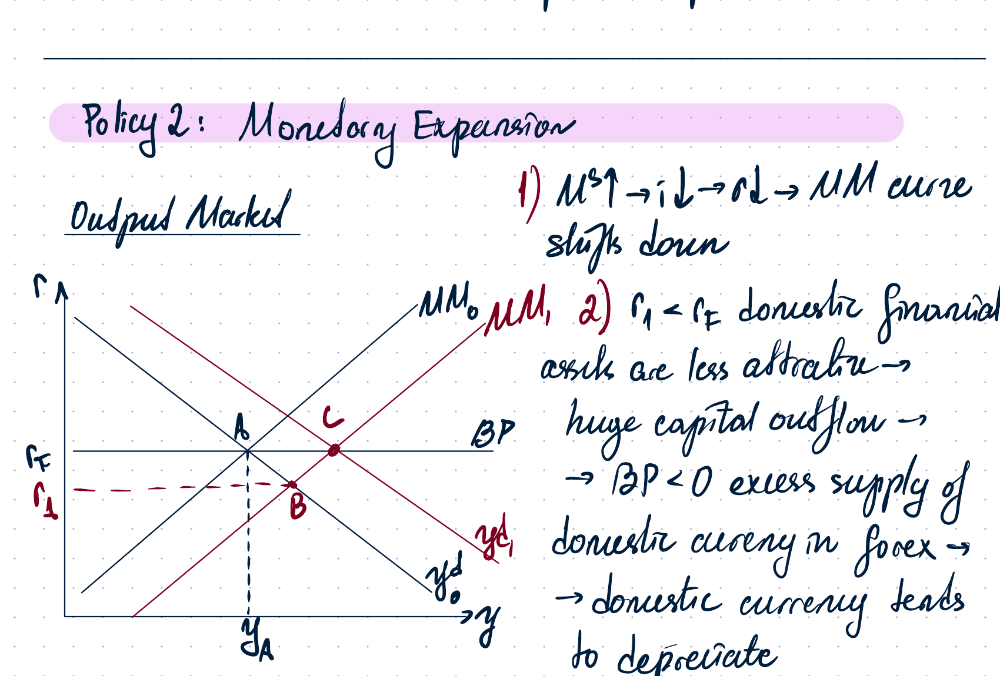
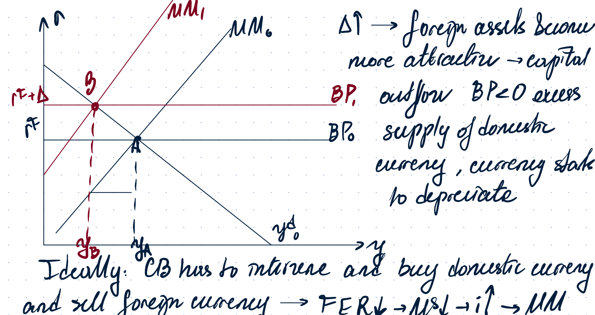
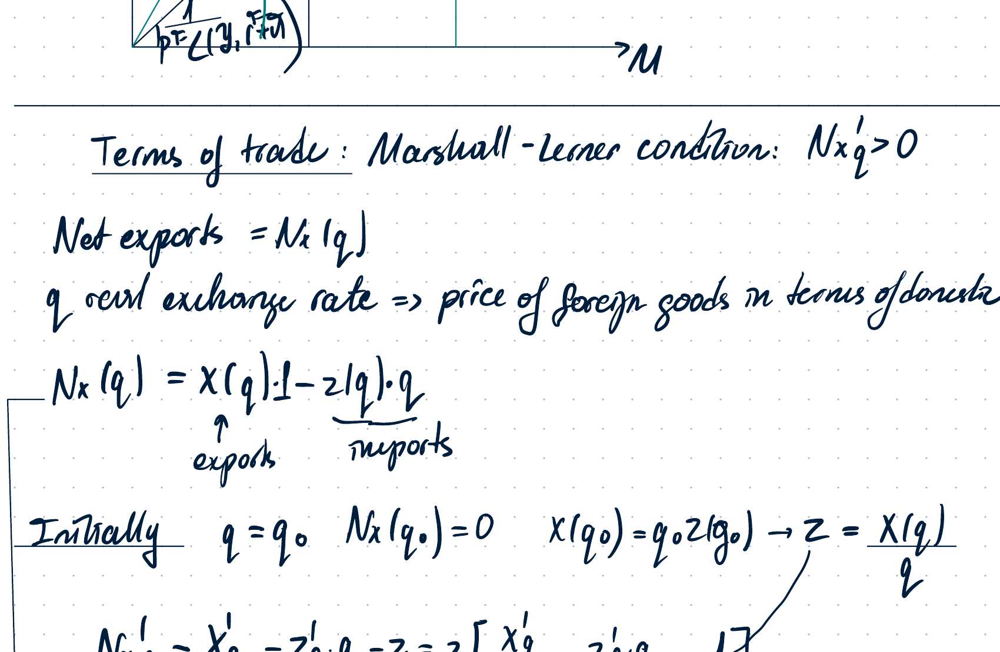
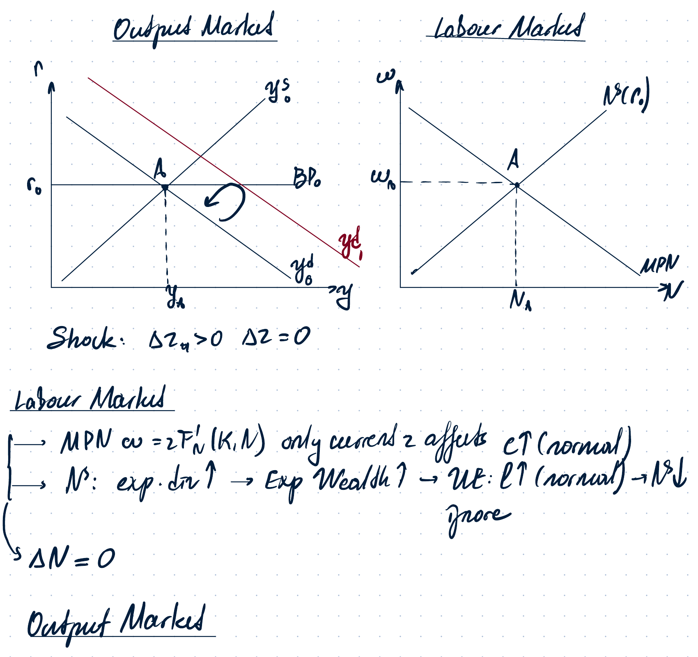

# Week 14 - Open Economy 2

## 1. Models covered

This week continues open-economy macroeconomics. The lecture distinguishes three related frameworks:

- **Real GE open-economy model, long run.**
- **Nominal international GE model, long run.**
- **International sticky-price model / New Keynesian model for an open economy, short run.**

The main new object is the exchange rate and the distinction between nominal and real exchange rates.

## 2. Exchange rates

The **nominal exchange rate** $e$ is the price of foreign currency in terms of domestic currency. This is an indirect quote, like RUB per USD.

- $e \uparrow$ means a **depreciation** of the domestic currency.
- $e \downarrow$ means an **appreciation** of the domestic currency.

The **real exchange rate** is

$$
q = \frac{eP^*}{P},
$$

where:

- $P^*$ is the foreign price level;
- $P$ is the domestic price level.

If $q \uparrow$, this is a **real depreciation**: domestic goods become relatively cheaper, foreign goods become relatively more expensive, and the competitiveness of domestic goods rises. If the Marshall-Lerner condition holds, net exports increase:

$$
q \uparrow \Rightarrow NX \uparrow.
$$

If $q \downarrow$, this is a **real appreciation**.

## 3. Purchasing Power Parity

Purchasing Power Parity is written as

$$
q = 1 \quad \Longleftrightarrow \quad \frac{eP^*}{P}=1 \quad \Longleftrightarrow \quad P=eP^*.
$$

PPP requires the standard strong assumptions:

- goods are homogeneous;
- goods are tradable;
- no shipping costs;
- no tariffs;
- prices are flexible.

When PPP holds, changes in $e$ and $P^*$ are reflected in $P$ so that the real exchange rate stays equal to one.

## 4. Assumptions of the nominal dynamic GE model for an open economy

The lecture uses the following assumptions:

- Money market with flexible prices and wages.
- Small open economy: $P^*$ and $r^*$ are exogenously given.
- PPP always holds: $q=1$.
- Perfect capital mobility: $r=r^*$.
- Fisher equation:

$$
i = r^* + \pi.
$$

There are two exchange-rate regimes.

### Fixed / pegged exchange rate

The exchange rate is chosen by the central bank:

$$
e = \bar e.
$$

There is no monetary-policy discretion. Money supply is endogenous and adjusts to keep $e$ constant.

### Flexible / floating exchange rate

The central bank does not intervene in the foreign-exchange market. The exchange rate is determined by market forces:

$$
e \text{ is endogenous}, \qquad M^s \text{ is exogenous}.
$$

## 5. Shock 1: increase in the foreign price level $P^*$

Money-market equilibrium:

$$
M^s = M^d,
$$

where money demand is

$$
M^d = P \cdot L(y,r^*+\pi).
$$

Under PPP,

$$
P=eP^*.
$$

Therefore money demand can be written as

$$
M^d = eP^* L(y,r^*+\pi).
$$

The slope of money demand in the $(e,M)$ diagram is

$$
\frac{1}{P^*L(y,r^*+\pi)}.
$$

### Flexible exchange-rate regime

If $P^* \uparrow$, money demand becomes flatter. With the same money supply, the domestic currency appreciates:

$$
P^* \uparrow \Rightarrow M^d \text{ flatter} \Rightarrow e \downarrow.
$$

The intuition is that with higher foreign prices, the same domestic currency buys more nominal value abroad, so demand for the domestic currency rises and it appreciates.

### Fixed exchange-rate regime

If $P^* \uparrow$ and the central bank wants to keep $e=\bar e$, it must prevent appreciation of domestic currency. It sells domestic currency and buys foreign currency. This increases the supply of liquid assets / money:

$$
P^* \uparrow \Rightarrow M^d \uparrow \Rightarrow \text{CB sells domestic currency} \Rightarrow M^s \uparrow.
$$

According to PPP,

$$
e_0P_0^* = e_1P_1^* = P.
$$

So if $e$ adjusts flexibly, domestic prices may remain unchanged. If $e$ is fixed, domestic prices increase proportionally with the foreign price level:

$$
\frac{P_1}{P_0}=\frac{P_1^*}{P_0^*}.
$$

In either case, the real exchange rate is unchanged:

$$
q=1.
$$

Hence there is no change in the output market or labour market and no real consequences.

## 6. Shock 2: check of money neutrality under flexible exchange rates

Suppose money supply increases:

$$
M^s \uparrow.
$$

Under a flexible exchange rate, money supply shifts right and the nominal exchange rate rises:

$$
M^s \uparrow \Rightarrow e \uparrow.
$$

This is a depreciation of the domestic currency. By PPP,

$$
q=\frac{eP^*}{P}=1,
$$

so if $e$ rises, domestic prices rise proportionally:

$$
\frac{M_1}{M_0}=\frac{e_1}{e_0}=\frac{e_1P^*}{e_0P^*}=\frac{P_1}{P_0}.
$$

All nominal variables change proportionally to the change in $M^s$, while real variables are unchanged. Money is neutral.

## 7. International open-economy dynamic real GE model

Now $y$ and $y_{+1}$ are not exogenous. We also need the balance of payments:

$$
BP = CA + FA = 0.
$$

Since

$$
CA = NX + NFI,
$$

and in the simplified setting $NFI=0$, current account equals net exports:

$$
CA = NX.
$$

### Cases

1. **Homogeneous goods, no capital mobility / full capital control.**

Capital flows are fully blocked:

$$
FA=0.
$$

Then

$$
BP=CA=NX.
$$

The model looks like a closed economy.

2. **Homogeneous goods, perfect capital mobility.**

PPP holds:

$$
q=1.
$$

The balance-of-payments curve is horizontal because

$$
r=r^*.
$$

3. **Heterogeneous goods, perfect capital mobility.**

PPP does not hold:

$$
q \ne 1.
$$

The BP curve is still horizontal because capital mobility gives

$$
r=r^*.
$$

But because goods are imperfect substitutes, real exchange-rate changes affect net exports.

## 8. Problem 1: world interest rate increases, homogeneous goods

Consider a dynamic small open economy with perfect capital mobility. Prices are fully flexible and the current account is initially balanced. The world interest rate rises:

$$
r^* \uparrow.
$$

With homogeneous goods and flexible prices, PPP holds:

$$
q=1.
$$

Perfect capital mobility gives a horizontal BP curve at $r=r^*$.

Initial equilibrium is at point $A$, with internal and external equilibrium. When $r^*$ increases, the BP curve shifts up. At the old domestic interest rate, domestic financial assets become less attractive, causing a large capital outflow:

$$
r<r^* \Rightarrow FA<0.
$$

To restore external balance, net exports must increase:

$$
BP=0, \quad FA<0 \Rightarrow NX \uparrow.
$$

Since

$$
y^d=C+I+G+NX,
$$

the output-demand curve shifts right until external balance is restored.

Effects recorded in the notes:

$$
\Delta FA<0, \qquad \Delta CA>0, \qquad NX \uparrow.
$$

Investment falls because the higher interest rate raises the cost of capital:

$$
r^* \uparrow \Rightarrow I \downarrow.
$$

National saving rises ambiguously through the model mechanisms, but the important exam conclusion is that the current account improves because net exports must increase to offset the capital outflow.

## 9. Problem 1(ii): heterogeneous goods

If goods are heterogeneous, PPP does not hold:

$$
q \ne 1.
$$

The same increase in $r^*$ creates capital outflow pressure. Foreign goods become relatively more expensive and domestic goods become relatively cheaper. Domestic residents can buy fewer foreign goods with the same wage, so their purchasing power falls. Leisure becomes relatively cheaper, causing a small negative labour-supply effect.

The notes summarize the mechanism as:

$$
q \uparrow \Rightarrow NX \uparrow
$$

under the Marshall-Lerner condition, but the labour-market response can create an additional small shift.

## 10. Problem 2: current endowment falls, future endowment unchanged

Now domestic and foreign goods are heterogeneous, and domestic current-time endowment is reduced while future endowment remains intact. Real wealth effects are small.

Perfect capital mobility still implies

$$
r=r^*.
$$

Goods are imperfect substitutes, so PPP does not hold:

$$
q \ne 1.
$$

### Labour market

Labour demand is unchanged in its basic condition:

$$
w=MPN.
$$

Labour supply shifts left for two reasons:

1. Direct effect: lower current time endowment means less time can be allocated between work and leisure.
2. Wealth effect: lower current endowment reduces household wealth; since leisure is a normal good, households want less leisure. This effect is small in the notes.

Overall:

$$
N \downarrow.
$$

### Output market

Output supply shifts left because employment falls:

$$
y^s=zF(K,N) \quad \Rightarrow \quad N\downarrow \Rightarrow y^s\downarrow.
$$

Output demand also shifts left:

$$
y^d=C+I+G+NX.
$$

Consumption falls slightly because of the wealth effect. At $r=r^*$, demand for domestic goods can exceed supply, so net exports adjust.

The notes state:

$$
N^d \text{ unchanged}, \qquad N^s \downarrow, \qquad y^s \downarrow, \qquad y^d \downarrow.
$$

Because $y^d$ shifts more left than $y^s$ in the drawn case, the final output equilibrium is lower.

## 11. International sticky-price model for an open economy

This is the short-run open-economy New Keynesian model.

Assumptions:

- Domestic prices $P$ and foreign prices $P^*$ are absolutely sticky because of menu costs.
- Domestic and foreign goods are not perfect substitutes.
- PPP does not hold.
- Perfect capital mobility holds.
- The key financial condition is **uncovered interest parity**.

Uncovered interest parity:

$$
1+i=(1+i^*)\frac{e^{exp}}{e}.
$$

Equivalently, using a Taylor approximation:

$$
i=i^*+\Delta^{exp},
$$

where $\Delta^{exp}$ is expected depreciation of domestic currency.

- $\Delta^{exp}>0$: expected depreciation.
- $\Delta^{exp}<0$: expected appreciation.

Because prices are sticky,

$$
\pi=\pi^*=0,
$$

so Fisher gives

$$
i=r, \qquad i^*=r^*.
$$

Hence the BP curve can be written as

$$
r=r^*+\Delta^{exp}.
$$

With imperfect competition and sticky prices, production is demand-oriented. The output-demand curve is central, and the MM/LM curve is upward sloping.

## 12. Policy 1: temporary fiscal expansion

Assume a temporary increase in government purchases:

$$
\Delta G>0, \qquad \Delta G_{+1}=0.
$$

Output demand is

$$
y^d=C+I+G+NX.
$$

A higher $G$ directly raises demand. There is also a negative wealth effect because the present value of taxes rises, but since the shock is temporary, $mpc<1$, so the direct effect dominates:

$$
|\Delta G|>|\Delta C| \Rightarrow y^d \text{ shifts right}.
$$

At the same interest rate, domestic financial assets become more attractive, generating capital inflow:

$$
r>r^* \Rightarrow FA>0.
$$

This creates excess demand for domestic currency in the foreign-exchange market, so the domestic currency tends to appreciate.

### Flexible exchange-rate regime

The currency appreciates:

$$
e\downarrow.
$$

Then

$$
q=\frac{eP^*}{P}\downarrow,
$$

so domestic goods become relatively more expensive and less competitive:

$$
NX\downarrow.
$$

If the Marshall-Lerner condition holds, the output-demand curve shifts back. Fiscal policy is ineffective because of full crowding out through consumption and net exports:

$$
\Delta y=\Delta C+\Delta I+\Delta G+\Delta NX=0.
$$

### Fixed exchange-rate regime

The central bank intervenes to prevent appreciation. It sells domestic currency and buys foreign currency. Therefore money supply rises:

$$
M^s\uparrow \Rightarrow i\downarrow,
$$

and the MM curve shifts down. The final equilibrium involves a positive output effect:

$$
\Delta y>0.
$$

In the fixed exchange-rate regime, temporary fiscal policy is effective.

## 13. Policy 2: monetary expansion

Suppose the central bank increases money supply:

$$
M^s\uparrow.
$$

This reduces the domestic interest rate and shifts the MM curve down:

$$
M^s\uparrow \Rightarrow i\downarrow \Rightarrow MM \text{ shifts down}.
$$

At $r<r^*$, domestic financial assets become less attractive. There is capital outflow:

$$
r<r^* \Rightarrow FA<0.
$$

So the balance of payments has excess supply of domestic currency, and the domestic currency tends to depreciate.

### Flexible exchange-rate regime

The currency depreciates:

$$
e\uparrow.
$$

Then

$$
q=\frac{eP^*}{P}\uparrow,
$$

so domestic goods become relatively cheaper and more competitive. Net exports rise:

$$
NX\uparrow.
$$

Therefore output demand shifts right. Monetary policy is effective under flexible exchange rates:

$$
\Delta y>0.
$$

### Fixed exchange-rate regime

The central bank must prevent depreciation. It buys domestic currency and sells foreign reserves. Money supply falls back:

$$
M^s\downarrow,
$$

so the MM curve shifts back up. The final effect of monetary policy is zero:

$$
\Delta y=0.
$$

Thus monetary policy is ineffective under fixed exchange rates.

## 14. The trilemma of monetary policy

The central bank cannot simultaneously have all three:

1. fixed exchange rate $e=\bar e$;
2. monetary-policy autonomy, where monetary policy can be used to pursue macroeconomic objectives;
3. free capital flows.

The central bank can choose any two, but not all three.

## 15. Currency crisis under a fixed exchange rate

There are two types discussed:

1. Self-fulfilling currency crisis with sticky prices.
2. Inconsistent government policy in a nominal GE framework.

### Self-fulfilling crisis

Agents believe there will be expected depreciation:

$$
e^{exp}>e \Rightarrow \Delta^{exp}>0.
$$

This makes foreign assets more attractive and causes capital outflow:

$$
\Delta^{exp}>0 \Rightarrow FA<0.
$$

Then the balance of payments turns negative:

$$
BP<0.
$$

There is excess supply of domestic currency in the foreign-exchange market, so the currency starts to depreciate.

To defend the peg, the central bank has to buy domestic currency and sell foreign reserves:

$$
FER\downarrow \Rightarrow M^s\downarrow \Rightarrow i\uparrow \Rightarrow MM \text{ shifts up}.
$$

The central bank faces a trade-off:

- sacrifice output to defend the exchange rate;
- abandon the fixed exchange-rate regime, causing a crash.

### Inconsistent government policy

If the central bank prints money to earn seigniorage revenue and buys government bonds in the open market, then money supply rises:

$$
M^s\uparrow \Rightarrow e \uparrow.
$$

To defend the peg, the central bank must again buy domestic currency and sell foreign reserves. If it does this repeatedly, reserves are exhausted:

$$
FER\downarrow \Rightarrow \text{reserves exhausted} \Rightarrow e\uparrow \Rightarrow P=eP^*\uparrow \Rightarrow \pi\uparrow.
$$

For a prolonged period, this creates pressure toward collapse of the fixed exchange-rate regime.

## 16. Terms of trade and Marshall-Lerner condition

Net exports are written as a function of the real exchange rate:

$$
NX=N(q).
$$

The real exchange rate is the price of foreign goods in terms of domestic goods:

$$
q=\frac{eP^*}{P}.
$$

The notes write net exports as exports minus import value:

$$
NX(q)=X(q)-Z(q)q.
$$

Initially assume

$$
q=q_0, \qquad NX(q_0)=0.
$$

Then

$$
X(q)=qZ(q).
$$

Differentiating:

$$
NX_q=X_q-Z_q q-Z.
$$

Using the elasticity form, the Marshall-Lerner condition becomes:

$$
PED^X + |PED^Z| > 1.
$$

Intuition:

1. If $q\uparrow$, domestic goods become cheaper in foreign terms, so exports rise:

$$
X\uparrow.
$$

2. Import value effect: because each imported unit becomes more expensive, the value of imports rises.

3. Import volume effect: imports fall in volume.

The Marshall-Lerner condition says the export increase plus the import-volume decrease must dominate the import-value effect.

## 17. General-equilibrium open-economy model: anticipated future TFP increase

In the GE open-economy model:

- prices are flexible;
- perfect capital mobility holds;
- the BP curve is horizontal at $r=r^*$;
- PPP holds in the homogeneous-goods case.

Problem setup: developed economy, anticipated increase in future TFP. Current TFP does not change:

$$
\Delta z=0, \qquad \Delta z_{+1}>0.
$$

### Labour market

Current labour demand is unchanged because current productivity is unchanged:

$$
MPN=zF_N(K,N), \qquad \Delta z=0 \Rightarrow N^d \text{ unchanged}.
$$

Labour supply response comes through wealth effects. Anticipated higher future TFP increases expected wealth. Since leisure is a normal good, households want more leisure:

$$
\text{expected wealth}\uparrow \Rightarrow N^s\downarrow.
$$

The notes then say to ignore/keep the labour-market effect small in the simplified analysis, so in the drawn case:

$$
\Delta N=0.
$$

### Output market

Output supply is unchanged:

$$
y^s=zF(K,N) \quad \Rightarrow \quad y^s \text{ unchanged}.
$$

Output demand is

$$
y^d=C+I+G+NX.
$$

Investment rises because future marginal product of capital rises:

$$
MPK_{+1}\uparrow \Rightarrow I\uparrow.
$$

Capital evolves as

$$
I=K_{+1}-(1-\delta)K.
$$

The notes state that at $r=r^*$ demand for goods exceeds supply, so net exports fall and output demand shifts left to restore equilibrium:

$$
NX\downarrow \Rightarrow y^d \text{ shifts left}.
$$

## 18. Final note from the last page

For $r=r^*$, if demand for goods exceeds supply, then net exports must fall:

$$
y^d>y^s \Rightarrow NX\downarrow \Rightarrow y^d \text{ shifts left}.
$$
