# Week 1.2 - Real Static General Equilibrium Model

Source: handwritten/annotated lecture recap on the one-period static general equilibrium model.

## 1. Core setup

**Model type:** one-period, real, static, general equilibrium model.

Main characteristics:

- All prices are **real**.
- There is **no money market**.
- All markets are in equilibrium.
- It can be interpreted as a **Robinson Crusoe economy**.

Because the model has only one period:

$$
\text{one period} \Rightarrow \text{no saving, no investment} \Rightarrow \text{no bond market}.
$$

So there is no asset/financial market in the model.

### Representative agent

The representative household solves a utility maximization problem (UMP). Assumptions:

- all households have the same standard/convex preferences;
- no corner solutions;
- equal income;
- equal tax burden.

### Representative firm

The representative firm solves a profit maximization problem (PMP). Assumptions:

- the firm is a price taker in all markets;
- usually the production function is neoclassical;
- if not told otherwise,

$$
Y=zF(K,N),
$$

where:

- $z$ is total factor productivity;
- $K$ is fixed, given, and exogenous;
- $N$ is labour input.

### Government

The government exogenously chooses government expenditures $G$ and adjusts lump-sum taxes $T$.

If not told otherwise, $T$ is endogenous and the government budget is balanced:

$$
G=T.
$$

Original page 1 image

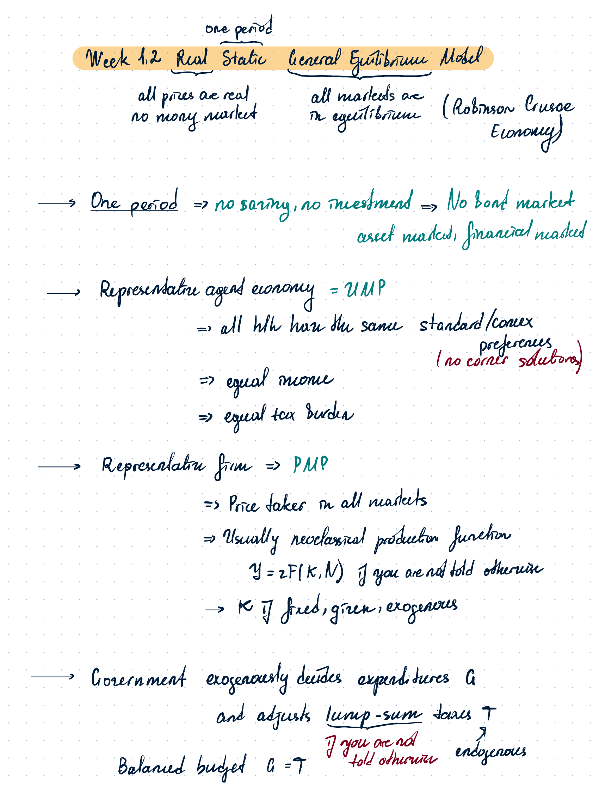

---

## 2. Markets in the closed economy

Closed economy resource constraint:

$$
Y=C+\cancel{I}+G+\cancel{NX}=C+G.
$$

All variables are real, and there is no money market.

### Labour market

Labour market:

- **Demand:** determined by the firm through PMP.
- **Supply:** determined by the household through UMP.

### Output/goods market

Output market:

- **Demand:** household consumption plus government demand.
- **Supply:** output produced by the firm.

By **Walras' Law**, if enough markets are in equilibrium, the remaining market will automatically be in equilibrium. Therefore, start the analysis from the labour market.

---

## 3. Firm problem: labour demand

The representative firm solves:

$$
\max_{N\ge 0}\left[zF(K,N)-wN\right].
$$

First-order condition:

$$
zF_N'(K,N)-w=0,
$$

so

$$
zF_N'(K,N)=w.
$$

This determines labour demand $N^d$.

Second-order condition:

$$
zF_{NN}''(K,N)<0.
$$

This follows from the neoclassical production function. Because the marginal product of labour is diminishing, labour demand is decreasing in $N$.

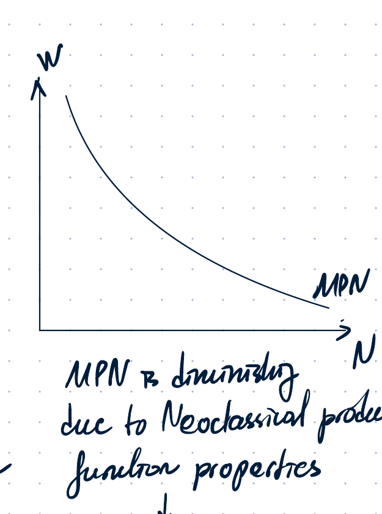

Original page 2 image

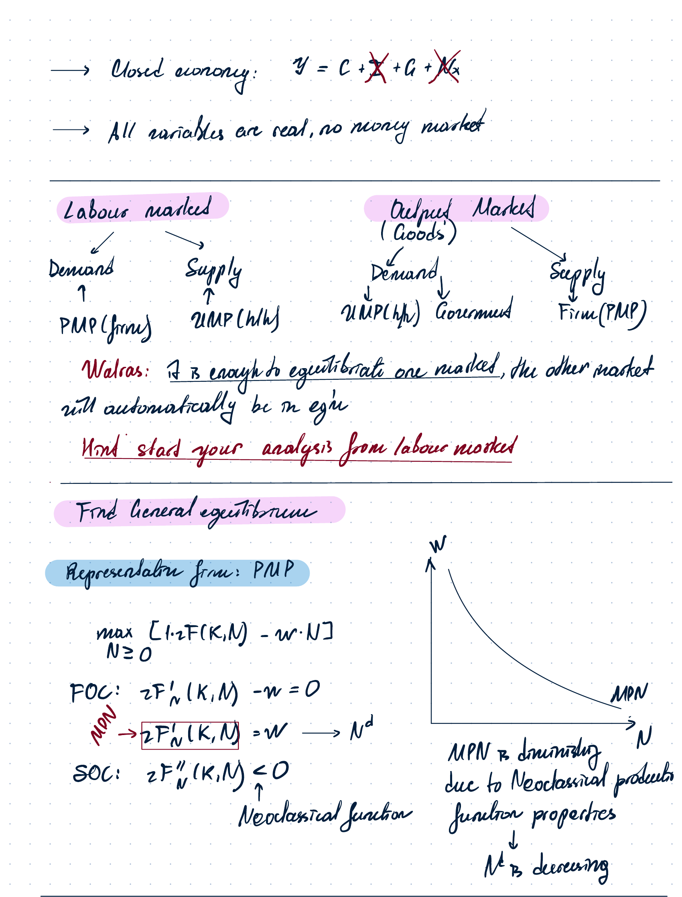

---

## 4. Household problem: labour supply

The representative household solves a utility maximization problem:

$$
u(c,l),
$$

with convex preferences. Consumption $c$ and leisure $l$ are always normal goods.

The household has time endowment $h$. The budget line is:

$$
c=w(h-l)-T+v,
$$

where:

- $w(h-l)$ is labour income;
- $T$ is lump-sum tax;
- $v$ is dividends/profits received from the firm.

Equivalently:

$$
wl+c=wh-T+v.
$$

The value $wh-T+v$ is the real value of the household's full endowment/wealth.

The household problem is:

$$
\max_{c,l} u(c,l)
$$

subject to:

$$
c\ge 0, \qquad l\in[0,h], \qquad wl+c=wh-T+v.
$$

At an interior optimum:

$$
MRS_{l,c}=\frac{w}{1}=w.
$$

The household chooses leisure demand $l$. Labour supply is then:

$$
N^s=h-l.
$$

### Effect of an increase in the real wage

When $w\uparrow$:

**Substitution effect:** leisure becomes more expensive.

$$
\Delta l^{SE}<0 \Rightarrow \Delta N^{s,SE}>0.
$$

**Wealth effect:** the real value of the time endowment rises. Since leisure is a normal good:

$$
\Delta l^{IE}>0 \Rightarrow \Delta N^{s,IE}<0.
$$

Assumption used in the notes:

$$
|SE|>|WE|.
$$

Therefore:

$$
w\uparrow \Rightarrow N^s\uparrow.
$$

So labour supply is upward-sloping.

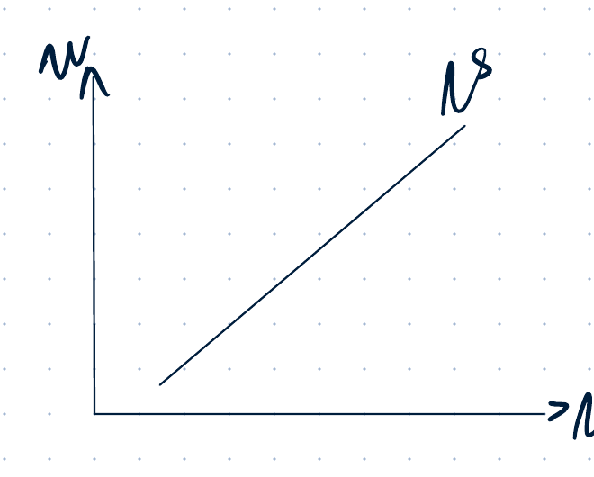

Original page 3 image

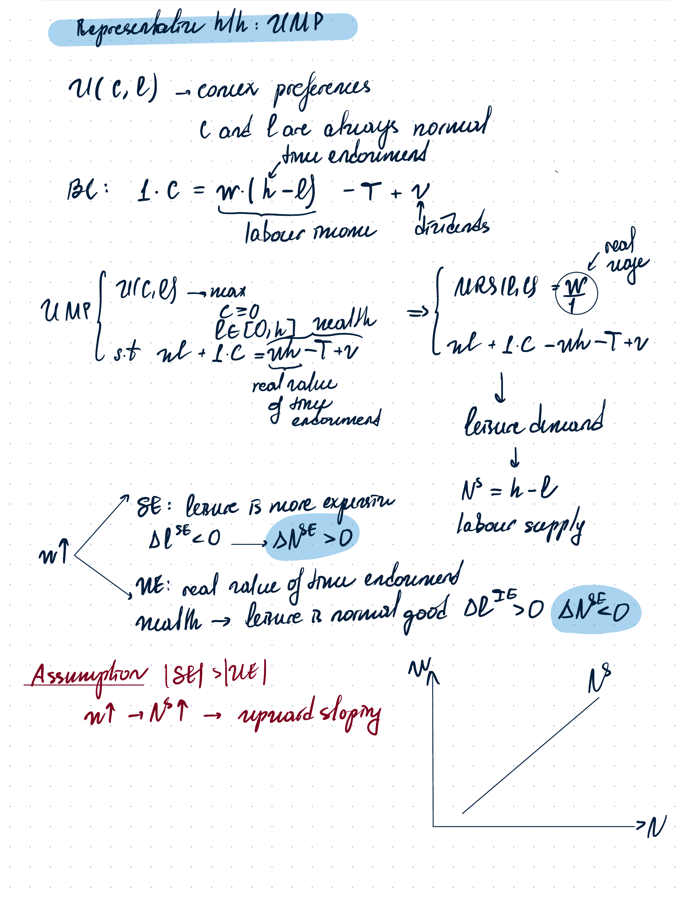

---

## 5. Labour market equilibrium

Labour market equilibrium is defined by:

$$
N^s=N^d.
$$

This gives equilibrium employment and the equilibrium real wage:

$$
N^*, \qquad w^*.
$$

Then equilibrium output is:

$$
Y^*=zF(K,N^*).
$$

Since government spending is exogenous:

$$
C^*=Y^*-G.
$$

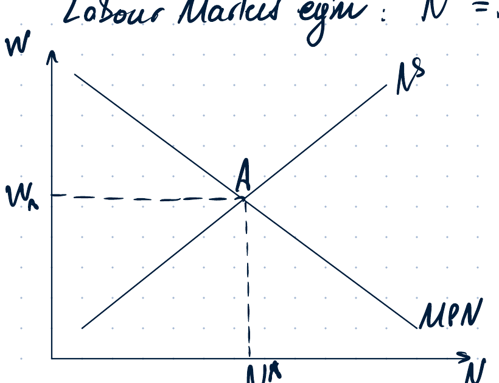

---

## 6. Pareto efficient allocation and the PPF

To find or show the Pareto efficient allocation, solve the household UMP over the production possibilities frontier (PPF):

$$
\max_{c,l} u(c,l), \qquad c\ge 0, \quad l\in[0,h],
$$

subject to the PPF.

### Deriving the PPF

Start from production:

$$
Y=zF(K,N).
$$

Since labour is time not spent on leisure:

$$
N=h-l.
$$

The goods market condition is:

$$
Y=C+G.
$$

Therefore:

$$
C+G=zF(K,h-l),
$$

so the PPF is:

$$
C=zF(K,h-l)-G.
$$

Boundary values:

$$
l=0 \Rightarrow C=zF(K,h)-G,
$$

and, if $F(K,0)=0$,

$$
l=h \Rightarrow C=zF(K,0)-G=-G.
$$

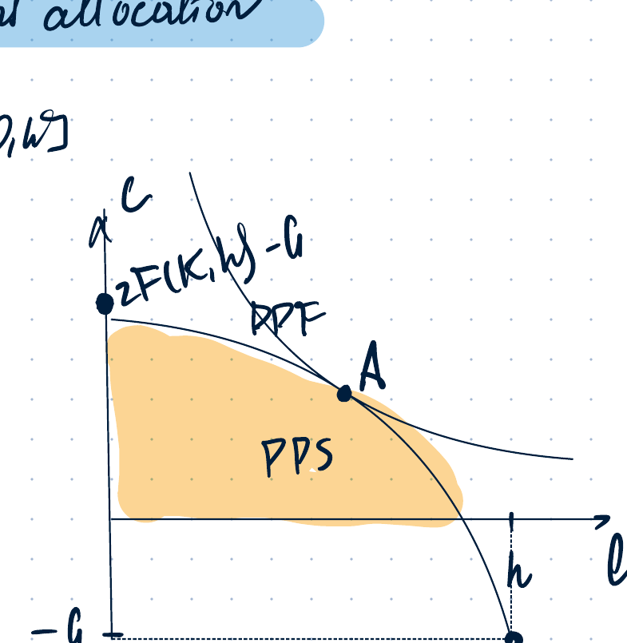

Original page 4 image

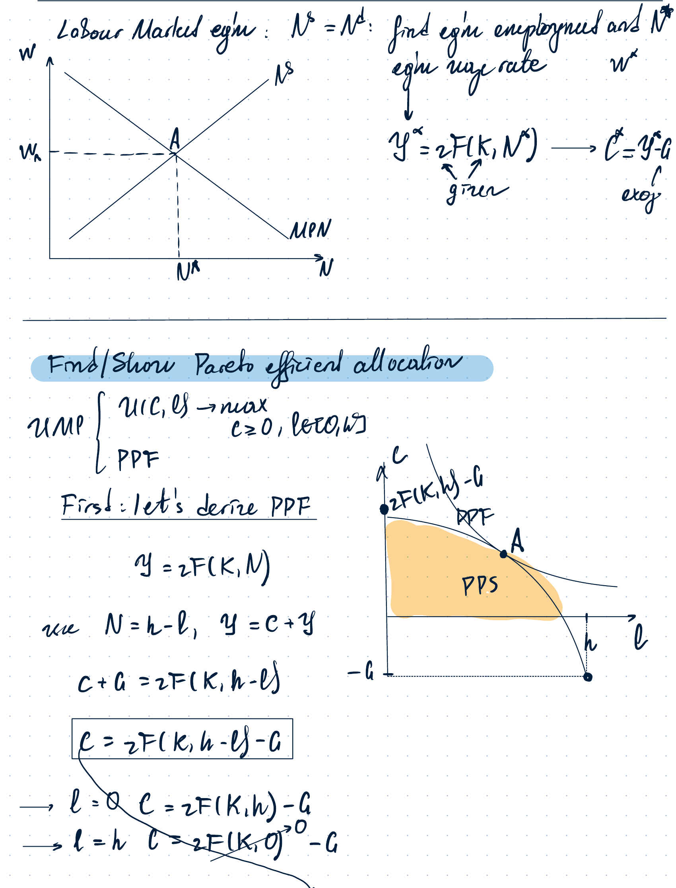

---

## 7. Slope of the PPF and Pareto optimality

The slope of the PPF is the marginal rate of transformation:

$$
\text{slope of PPF}=MRT=\left|\frac{dC}{dl}\right|.
$$

Using:

$$
C=zF(K,h-l)-G,
$$

we get:

$$
\left|\frac{dC}{dl}\right|=\left|-zF_N'(K,N)\right|=MPN.
$$

As $l\uparrow$, labour input falls:

$$
l\uparrow \Rightarrow N\downarrow.
$$

Because of diminishing marginal product of labour:

$$
N\downarrow \Rightarrow MPN\uparrow.
$$

So the absolute slope of the PPF rises as leisure increases.

At a Pareto optimum:

$$
MRT=MPN=MRS_{l,c},
$$

with:

$$
C=zF(K,h-l)-G.
$$

### Is general equilibrium Pareto optimal?

Yes, in this benchmark model.

Algebra:

Firm PMP gives:

$$
w=MPN=MRT.
$$

Household UMP gives:

$$
w=MRS_{l,c}.
$$

Therefore:

$$
MRT=MRS_{l,c}.
$$

So the competitive general equilibrium is Pareto optimal.

This is the **First Fundamental Welfare Theorem**: under complete competitive markets, a competitive equilibrium is Pareto optimal.

Possible reasons why this can fail:

- asymmetric information;
- externalities;
- government interventions through proportional distortionary taxes and subsidies.

Original page 5 image

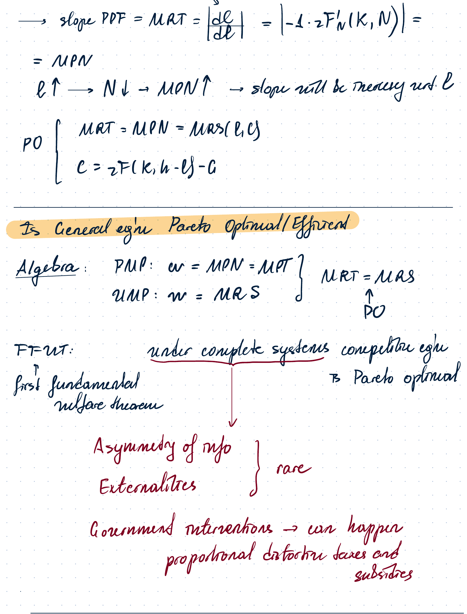

---

# Problem 5 - Education as time away from work and leisure

## Problem statement

Consider a one-period representative agent model developed at the lecture. In this model education can be represented as time spent by the representative consumer that is neither leisure time nor time applied to producing output. What the economy gains in the future is the increase in TFP.

**(a)** Using the one-period model, show graphically what effects additional education has in the present on equilibrium consumption, leisure, employment, aggregate output, and the real wage. Prove every claim.

- Well-labelled graph with comments on each curve: 0.5 p.
- Change in real wage rate, $c$, $y$, and $N$, with detailed proof and no points otherwise: 1 p.

**(b)** Show the effects the additional education that people acquire today will have in the future on equilibrium consumption, aggregate output, and employment. Prove every claim.

- Well-labelled graph with comments on each curve: 0.25 p.
- Change in $y$ and $c$, with detailed proof and no points otherwise: 0.5 p.
- Change in employment: 0.25 p.

**(c)** What does your analysis in parts (a) and (b) have to say about the trade-offs society makes between the present and the future in investing in education?

- Trade-off analysis: 0.5 p.

## Main idea

There are no modifications to the basic one-period model except that education reduces the time available for both labour and leisure today.

Education creates a trade-off:

$$
\text{short run: } c\downarrow,\ y\downarrow,
$$

but

$$
\text{long run: } c\uparrow,\ y\uparrow.
$$

Additional education today means:

$$
education\uparrow \Rightarrow h=l+N \downarrow \quad \text{for now}.
$$

In future periods, education increases productivity:

$$
education\uparrow \Rightarrow z\uparrow \quad \text{in the future}.
$$

---

## 5(a). Present effect of additional education

Additional education today reduces the available time endowment:

$$
h\downarrow.
$$

### Labour demand

Labour demand is determined by the firm through PMP:

$$
w=zF_N'(K,N).
$$

There is no shift in labour demand, because $z$ and $K$ are unchanged.

### Labour supply

Labour supply is determined by the household through UMP. Since:

$$
N^s=h-l,
$$

the change in labour supply is:

$$
\Delta N^s=\Delta h-\Delta l.
$$

**Direct effect:**

$$
h\downarrow \Rightarrow \text{the individual has less time to work and rest} \Rightarrow N^s\downarrow.
$$

**Indirect effect:**

$$
h\downarrow \Rightarrow \text{real value of time endowment falls} \Rightarrow \text{wealth}\downarrow.
$$

Since leisure is a normal good:

$$
\text{wealth}\downarrow \Rightarrow l\downarrow \Rightarrow N^s\uparrow.
$$

The direct effect wins, because leisure will not decrease as much as the time endowment. Otherwise, consumption would not behave as a normal good in the intended model logic.

Therefore labour supply shifts left:

$$
N^s\downarrow.
$$

### Equilibrium effects

With labour supply shifting left and labour demand unchanged:

$$
N\downarrow, \qquad w\uparrow.
$$

Then output falls:

$$
Y\downarrow=zF(K,N\downarrow).
$$

Since government expenditure is exogenous:

$$
C\downarrow=Y\downarrow-\bar G.
$$

The equilibrium move is from point $A$ to point $B$.

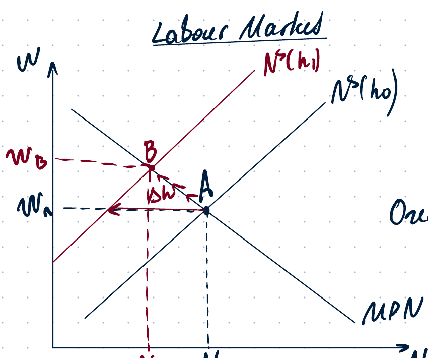

In the consumption-leisure diagram, the fall in available time shifts the feasible set inward. Consumption and employment fall. Leisure also falls in the drawn equilibrium:

$$
C_B<C_A, \qquad N_B<N_A, \qquad l_B<l_A.
$$

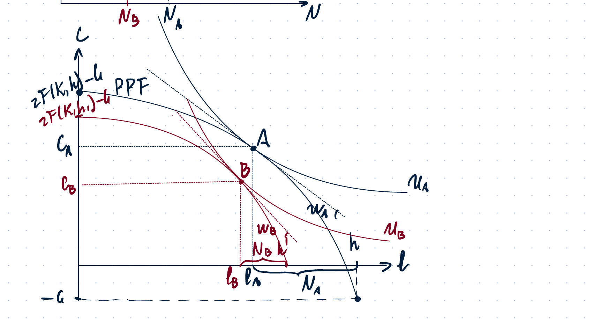

Original page 6 image

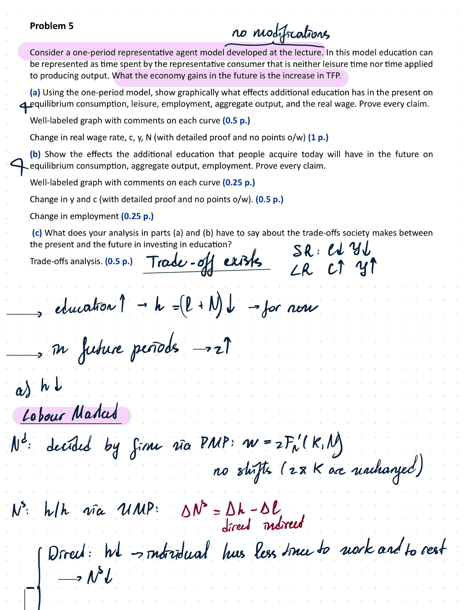

Original page 7 image

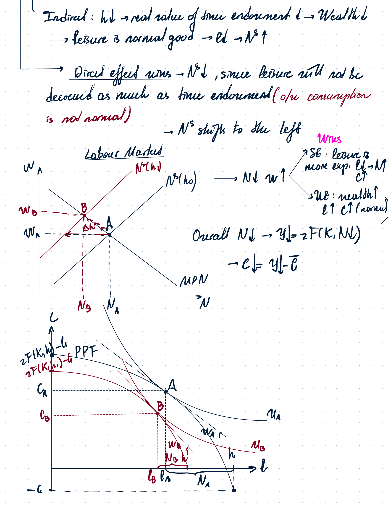

---

## 5(b). Future effect of education through higher TFP

In the future, education increases total factor productivity:

$$
z\uparrow.
$$

### Labour demand

Labour demand is still determined by the firm through PMP:

$$
w=zF_N'(K,N).
$$

When $z\uparrow$, labour becomes more productive. Therefore labour demand shifts right/up:

$$
z\uparrow \Rightarrow MPN\uparrow \Rightarrow N^d\uparrow.
$$

### Labour supply

Labour supply is determined by the household through UMP. Higher productivity raises profits:

$$
z\uparrow \Rightarrow \text{profits}\uparrow \Rightarrow \text{dividends}\uparrow.
$$

This increases household wealth:

$$
\text{wealth of household}\uparrow.
$$

Since leisure is a normal good:

$$
\Delta l^{WE}>0 \Rightarrow \Delta N^{s,WE}<0.
$$

So labour supply shifts left.

The notes assume that the labour demand shift dominates:

$$
|\Delta N^d|>|\Delta N^s|.
$$

### Equilibrium effects

Therefore:

$$
N\uparrow, \qquad w\uparrow.
$$

The wage increase has two household effects:

**Substitution effect:**

$$
w\uparrow \Rightarrow \text{leisure is more expensive} \Rightarrow l\downarrow,\ c\uparrow,\ N^s\uparrow.
$$

**Wealth effect:**

$$
\text{wealth}\uparrow \Rightarrow l\uparrow,\ c\uparrow,\ N^s\downarrow.
$$

Final effect on output:

$$
N\uparrow \Rightarrow Y\uparrow=z\uparrow F(K,N\uparrow).
$$

Since government spending is exogenous:

$$
C\uparrow=Y\uparrow-\bar G.
$$

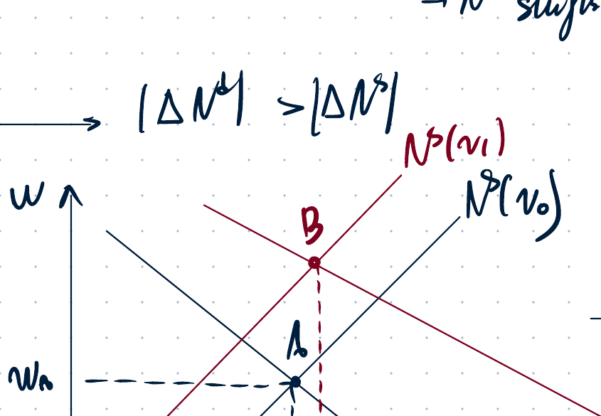

The PPF shifts outward/up because higher $z$ raises output for any given labour input.

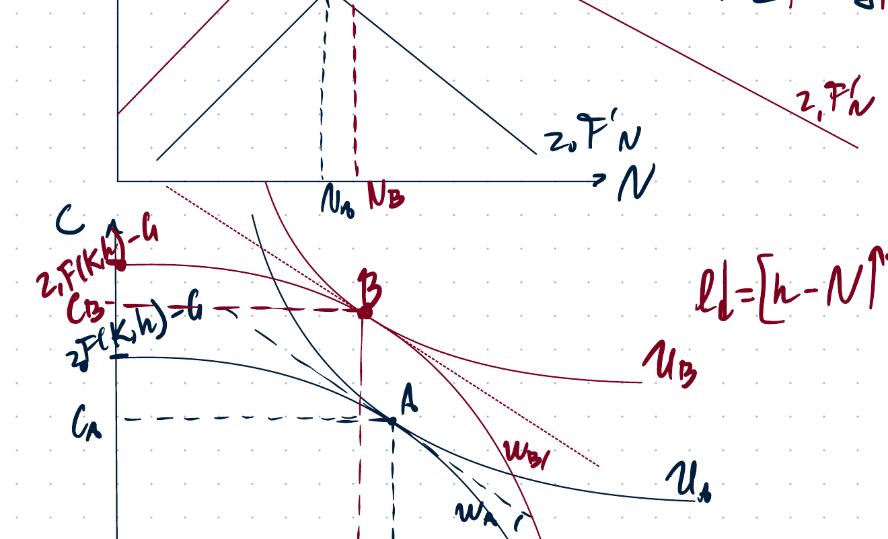

Original page 8 image

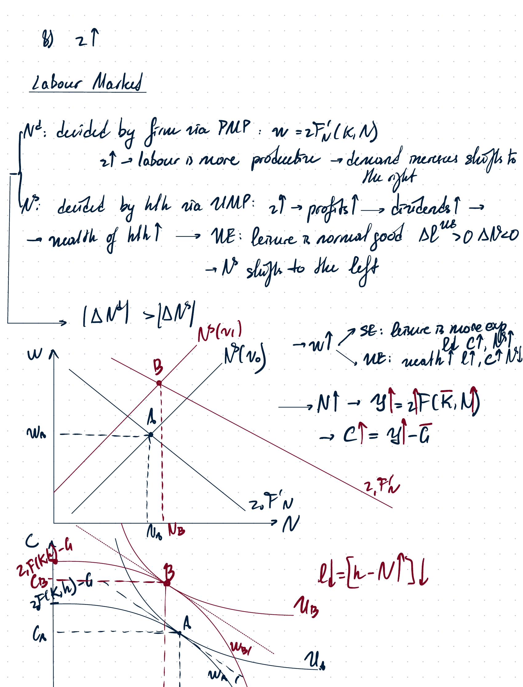

---

## 5(c). Trade-off from education

Education creates an intertemporal trade-off:

$$
\text{present: } h\downarrow \Rightarrow N\downarrow,\ Y\downarrow,\ C\downarrow,
$$

but

$$
\text{future: } z\uparrow \Rightarrow N\uparrow,\ Y\uparrow,\ C\uparrow.
$$

So society gives up current production and consumption to increase future productivity, output, and consumption.

---

# Problem 9 - Linear production and productive government spending

## Problem statement

Consider a simplified version of the one-period representative agent model developed at the lecture, assuming that the production function takes the form:

$$
Y=zN.
$$

Suppose that total factor productivity $z$ affects the productivity of government production just as it affects private production. That is, when the government collects taxes, it acquires goods that are then turned into government-produced goods according to:

$$
G=zT.
$$

Thus, $z$ units of government goods are produced for each unit of taxes collected.

Using a diagram, determine the effects of an increase in $z$ from $z_0=1$ to $z_1>1$ on output, consumption, employment, and the real wage, treating $G$ as exogenously given. Explain the results.

## Modification 1: labour demand with linear production

The firm solves:

$$
\max_{N\ge 0} \left[zN-wN\right].
$$

Equivalently:

$$
\max_{N\ge 0} N(z-w).
$$

Labour demand is:

$$
z>w \Rightarrow N^d\to \infty,
$$

$$
z<w \Rightarrow N^d=0,
$$

$$
z=w \Rightarrow N^d\in[0,\infty).
$$

In equilibrium:

$$
w^*=z,
$$

and firm profits are zero:

$$
\pi=0=v.
$$

Therefore labour demand is horizontal at $w=z$.

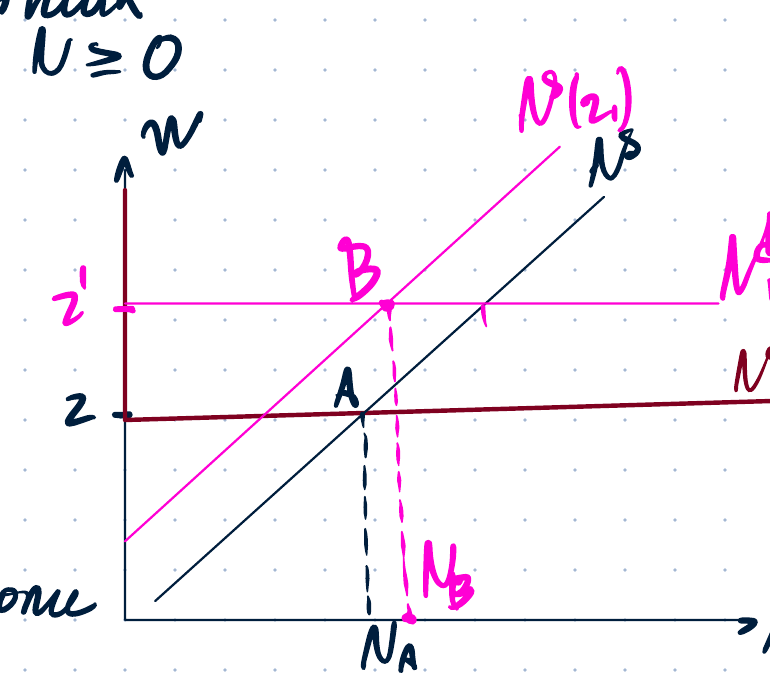

## Modification 2: productive government spending

Government spending is produced according to:

$$
G=zT.
$$

Here $G$ is treated as exogenous, so taxes are endogenous:

$$
T=\frac{G}{z}.
$$

When productivity rises:

$$
z\uparrow \Rightarrow T\downarrow.
$$

This lowers the tax burden and increases household wealth.

## Shock: $z\uparrow$

### Labour demand

Since the marginal product of labour rises:

$$
z\uparrow \Rightarrow MPN\uparrow.
$$

Labour becomes more productive, so the horizontal labour demand line shifts up:

$$
N^d\uparrow.
$$

Thus the real wage rises:

$$
w\uparrow.
$$

### Labour supply

Dividends remain unchanged:

$$
\pi=0 \Rightarrow v=0.
$$

But because:

$$
T=\frac{G}{z},
$$

an increase in $z$ implies:

$$
T\downarrow.
$$

So the tax burden falls:

$$
T\downarrow \Rightarrow \text{wealth}\uparrow.
$$

Since consumption and leisure are normal goods:

$$
\text{wealth}\uparrow \Rightarrow l\uparrow,\ c\uparrow.
$$

Hence labour supply shifts left:

$$
N^s\downarrow.
$$

However, in the drawn equilibrium the increase in labour demand dominates, so employment rises:

$$
N\uparrow.
$$

### Equilibrium effects

The final effects are:

$$
w\uparrow,
$$

$$
N\uparrow,
$$

$$
Y\uparrow=z\uparrow N\uparrow,
$$

and, since $G$ is exogenous:

$$
C\uparrow=Y\uparrow-\bar G.
$$

The consumption-leisure graph shows the equilibrium moving from $A$ to $B$, with higher consumption and lower leisure:

$$
C_B>C_A, \qquad l_B<l_A.
$$

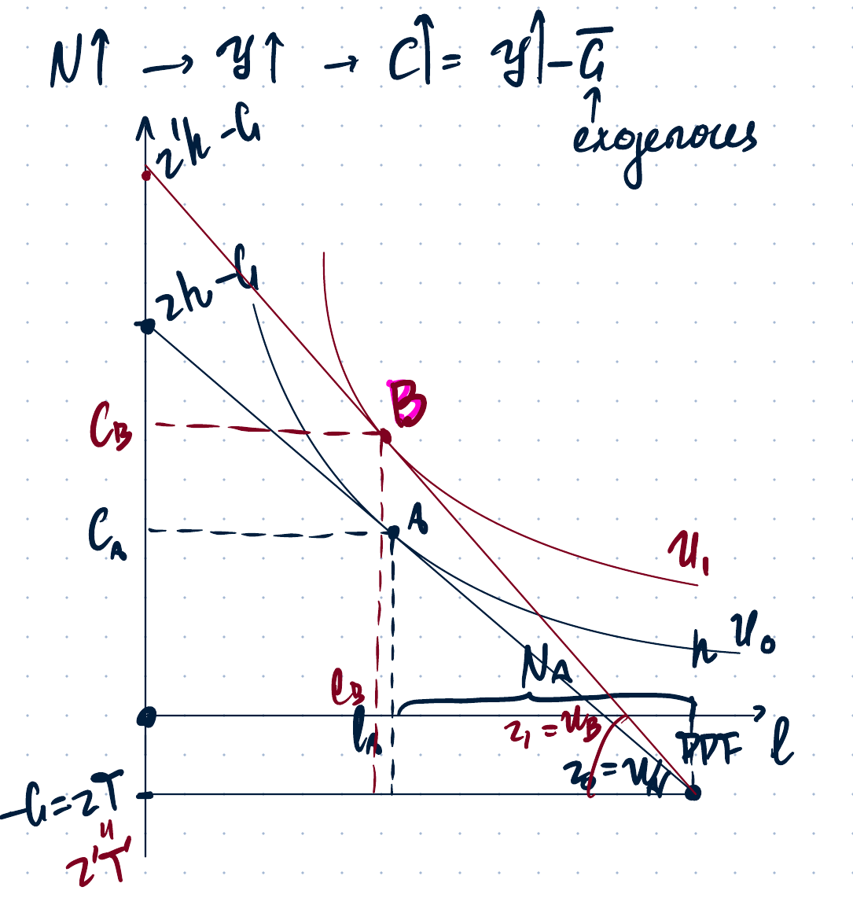

Original page 9 image

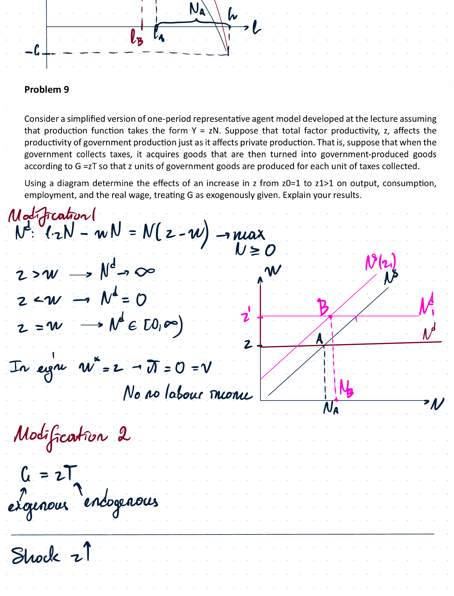

Original page 10 image

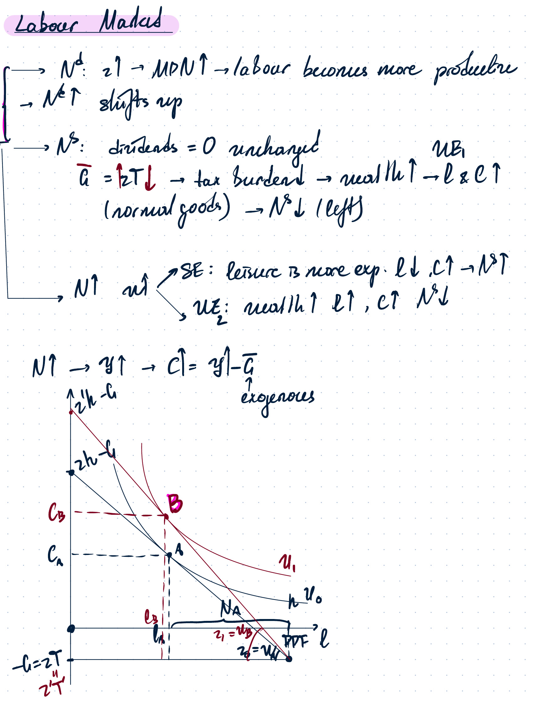

