# Week 2.2 - Solow Model 2

This file preserves the lecture-note context with cleaned transcription, LaTeX math, graph crops, and full page scans.

---

## Page 1 - Golden Rule steady state

The **Golden Rule steady state** is the steady state where consumption per effective labour is maximized, fixing $n$, $\delta$, $g$, $g n$, and $f(k)$.

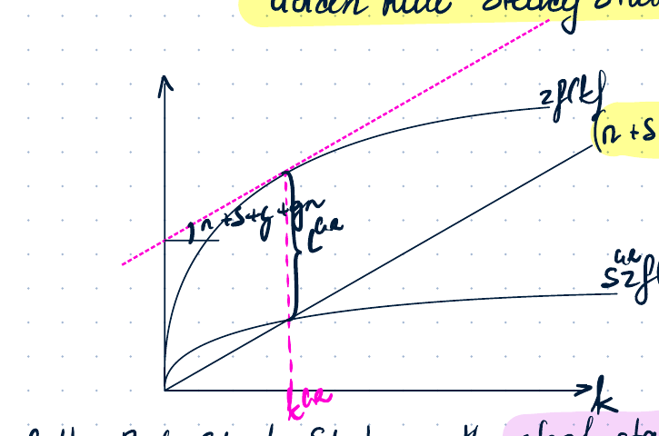

Consumption per effective labour:

$$
c=(1-s)y=(1-s)z f(k^{ss}).
$$

Using the steady-state condition,

$$
s z f(k^{ss})=(n+\delta+g+gn)k^{ss},
$$

we can write consumption as

$$
c=z f(k^{ss})-s z f(k^{ss})
=z f(k^{ss})-(n+\delta+g+gn)k^{ss}.
$$

Golden Rule problem:

$$
\max_{k^{ss}\ge 0}
\left[
z f(k^{ss})-(n+\delta+g+gn)k^{ss}
\right].
$$

First-order condition:

$$
z f'(k^{GR})=n+\delta+g+gn.
$$

This is the **Golden Rule condition**: the slope of the production function equals the slope of the required-investment line.

In perfect competition,

$$
r=MPK-\delta=z f'(k)-\delta.
$$

At the Golden Rule,

$$
r(k^{GR})+\delta=n+\delta+g+gn,
$$

so

$$
r(k^{GR})=n+g+gn.
$$

The note also records the elasticity form:

$$
\varepsilon_x^y=\frac{y_x' x}{y}.
$$

Full page image

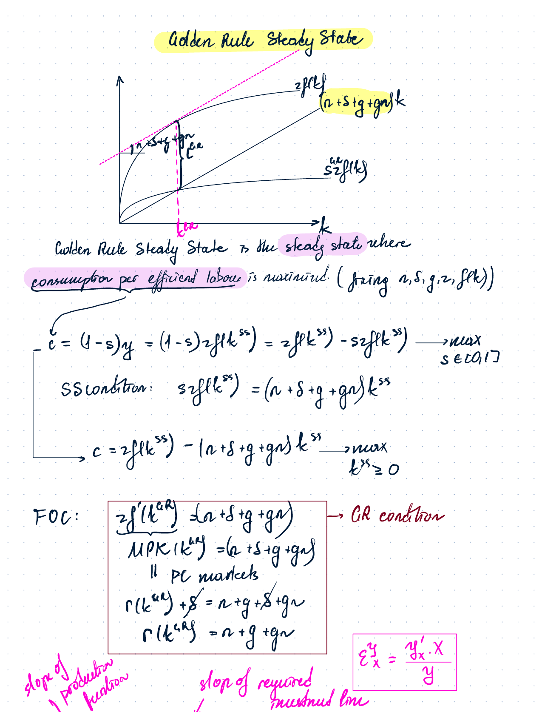

---

## Page 2 - Golden Rule saving rate and income interpretation

From the steady-state condition,

$$
(n+g+\delta+gn)=\frac{s z f(k)}{k}.
$$

Using the Golden Rule condition,

$$
z f'(k^{GR})=n+\delta+g+gn,
$$

we get

$$
z f'(k^{GR})=\frac{s z f(k^{GR})}{k^{GR}}.
$$

Therefore,

$$
s^{GR}
=
\frac{z f'(k^{GR})k^{GR}}{z f(k^{GR})}
=
\varepsilon_k^y.
$$

So the Golden Rule saving rate equals the capital share of income.

The notes state:

> In the Golden Rule steady state, all capital income should be saved, and all labour income should be spent.

Savings:

$$
S=s z F(K,AN)
=
\varepsilon_k^y \cdot Y
=
\frac{Y_K'K}{Y}\cdot Y
=
Y_K'K
=
MPK\cdot K.
$$

With depreciation, capital income required for maintaining capital is

$$
(n+\delta)K=nK+\delta K.
$$

Using CRS and Euler's theorem,

$$
Y=MPK\cdot K+MPN\cdot N.
$$

Consumption:

$$
C=(1-s)Y
=
Y-sY
=
Y-MPK\cdot K
=
MPN\cdot N.
$$

Thus consumption corresponds to labour income.

### What if the economy is not in the Golden Rule?

Case 1 begins with

$$
z f'(k^{ss})>n+\delta+g+gn.
$$

Since

$$
z f'(k^{GR})=n+\delta+g+gn,
$$

we have

$$
z f'(k^{ss})>z f'(k^{GR}).
$$

Because $f''(k)<0$,

$$
k^{ss}<k^{GR}.
$$

Hence

$$
s<s^{GR}.
$$

This is **undersaving**.

Full page image

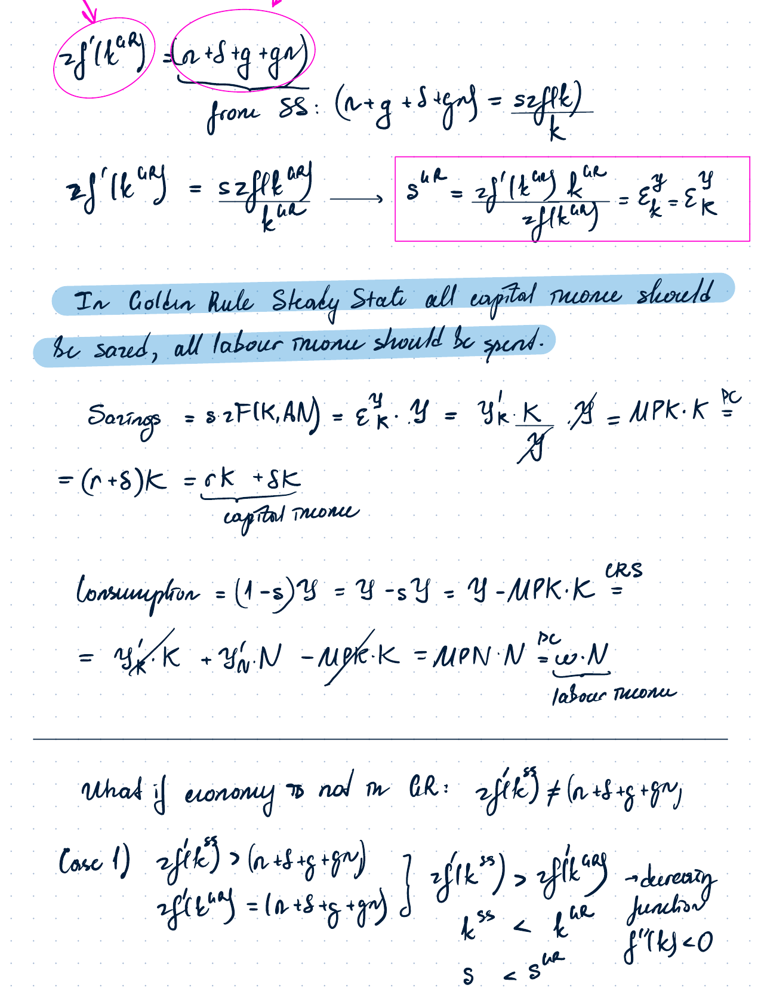

---

## Page 3 - Case 1: undersaving and dynamic efficiency

Condition:

$$
z f'(k^{ss})>n+\delta+g+gn.
$$

The economy has too little capital:

$$
k^{ss}<k^{GR}.
$$

To increase long-run consumption, the economy must raise the saving rate because it undersaves.

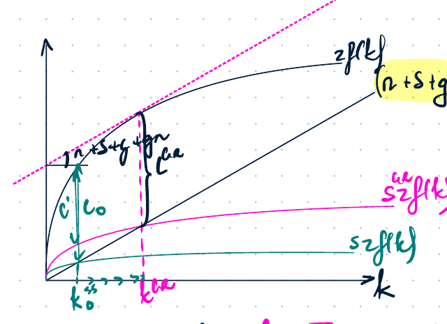

Immediate effect of increasing saving:

$$
c^{SR}=(1-s)z f(k_0)\downarrow.
$$

Current generations are worse off.

Long-run effect:

$$
s\uparrow
\Rightarrow
s z f(k)>(n+\delta+g+gn)k
\Rightarrow
\Delta k>0
\Rightarrow
k\uparrow
\Rightarrow
y\uparrow
\Rightarrow
c\uparrow.
$$

Future generations are better off.

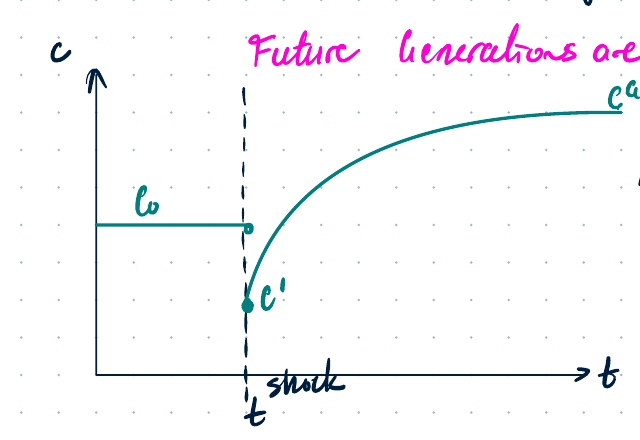

Because current generations are worse off while future generations are better off, there is **no Pareto improvement**. Therefore the economy is **dynamically efficient**.

### Case 2 begins

The opposite case is

$$
z f'(k^{ss})<n+\delta+g+gn.
$$

Since

$$
z f'(k^{GR})=n+\delta+g+gn,
$$

we get

$$
z f'(k^{ss})<z f'(k^{GR}).
$$

With diminishing marginal product,

$$
k^{ss}>k^{GR}.
$$

Hence

$$
s>s^{GR}.
$$

This is **oversaving**.

Full page image

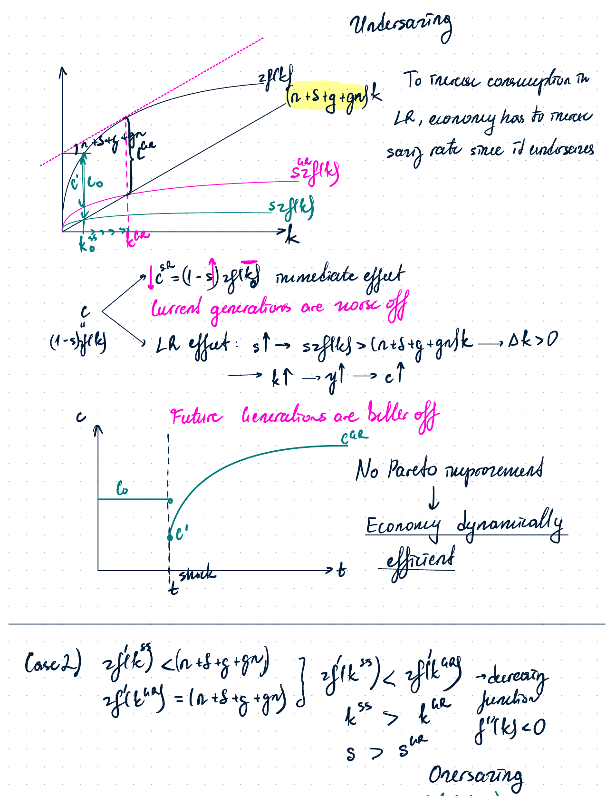

---

## Page 4 - Effect of the saving rate on steady-state capital

Start from the steady-state condition:

$$
s z f(k^{ss})-(n+\delta+g+gn)k^{ss}=0.
$$

Let

$$
H(s,k^{ss})=s z f(k^{ss})-(n+\delta+g+gn)k^{ss}.
$$

By the implicit function theorem,

$$
\frac{d k^{ss}}{ds}
=
-\frac{\partial H/\partial s}{\partial H/\partial k^{ss}}
=
-\frac{z f(k^{ss})}{s z f'(k^{ss})-(n+\delta+g+gn)}.
$$

Using the steady-state condition,

$$
n+\delta+g+gn=\frac{s z f(k^{ss})}{k^{ss}},
$$

so

$$
\frac{d k^{ss}}{ds}
=
-\frac{z f(k^{ss})}{s z f'(k^{ss})-\dfrac{s z f(k^{ss})}{k^{ss}}}.
$$

Equivalently,

$$
\frac{d k^{ss}}{ds}
=
\frac{z f(k^{ss})}
{s z\left(\dfrac{f(k^{ss})}{k^{ss}}-f'(k^{ss})\right)}
>0.
$$

The sign follows from concavity:

$$
\frac{f(k)}{k}=APK>MPK=f'(k).
$$

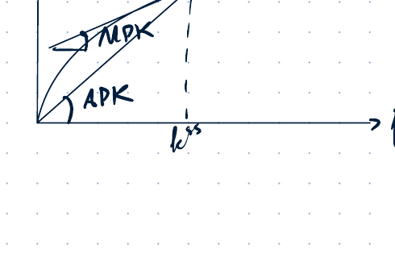

Thus a higher saving rate raises steady-state capital.

Full page image

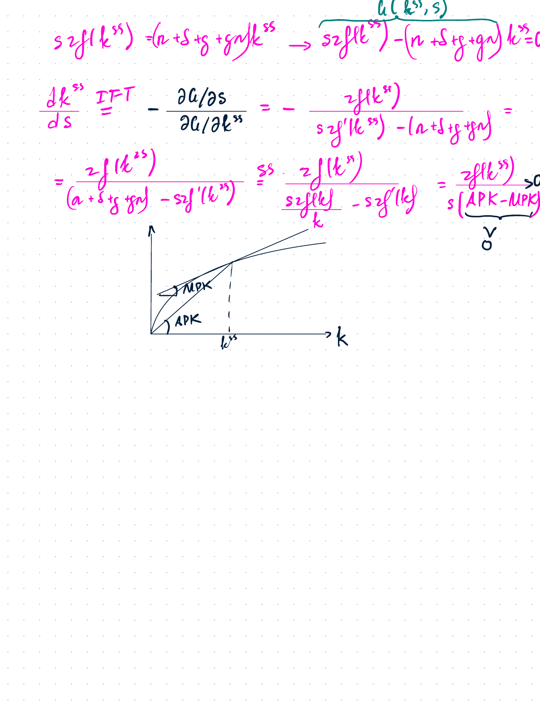

---

## Page 5 - Case 2: oversaving and dynamic inefficiency

In the oversaving case,

$$
k^{ss}>k^{GR}.
$$

To increase consumption in the long run, the economy has to decrease the saving rate because it oversaves.

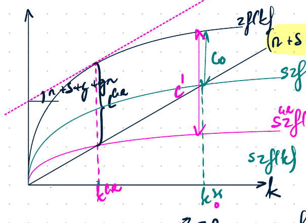

Immediate effect of lowering saving:

$$
s\downarrow
\Rightarrow
c^{SR}=(1-s)z f(k_0)\uparrow.
$$

Current generations are better off.

Long-run effect:

$$
s\downarrow
\Rightarrow
s^{new}z f(k)<(n+\delta+g+gn)k
\Rightarrow
\Delta k<0
\Rightarrow
k\downarrow
\Rightarrow
y\downarrow.
$$

However, because the initial economy was overaccumulating capital, long-run consumption rises:

$$
\Delta c^{total}>0.
$$

Future generations are also better off.

Therefore a Pareto improvement exists, and the economy is **dynamically inefficient**.

The page also summarizes the relationship between the saving rate and long-run consumption:

- if $s<s^{GR}$, the economy undersaves;
- if $s=s^{GR}$, long-run consumption is maximized;
- if $s>s^{GR}$, the economy oversaves.

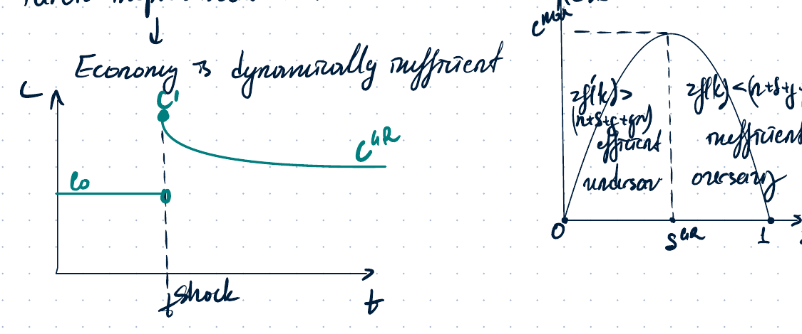

Full page image

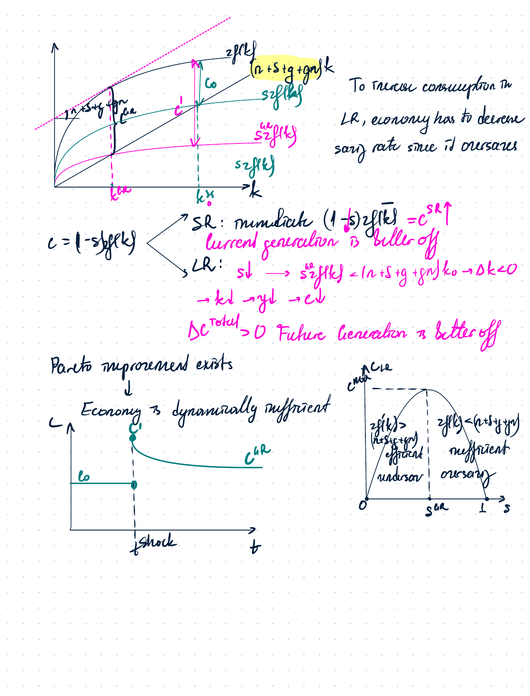

---

## Page 6 - Home Assignment 2, Problem 1: transition diagram and dynamic efficiency

Problem statement:

Consider a discrete-time version of the Solow growth model with labour-augmenting technological progress. The capital-accumulation process is illustrated by the graph.

(a) Suppose the current stock of capital per efficient labour is $k_0$.

(i) Derive graphically the capital stock per efficient worker for the next three periods. Explain the derivation.

(ii) Find graphically the long-run value of $k$. Explain.

(b) Set up the optimization problem and derive the Golden Rule saving rate for this economy. Do not use the continuous-time model.

(c) Suppose capital depreciates completely during one period and population is constant. If

$$
k_{t+1}(k_t)=3\sqrt{k_t},
$$

and the economy saves $60\%$ of income, is the economy dynamically efficient?

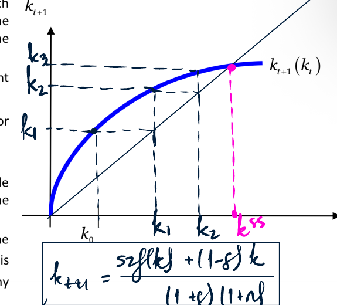

Given:

$$
\delta=1,\qquad n=0,\qquad s=0.6.
$$

For the discrete-time Golden Rule check, the notes compare the slope of the transition relation with the required slope:

$$
z f'(k^{GR})=\frac{n+\delta+g+gn}{1+g}.
$$

Equivalently, using the transition curve,

$$
\frac{s z f'(k)}{(1+g)(1+n)}=s.
$$

Here,

$$
\frac{3}{2\sqrt{k}}=0.6.
$$

This gives the Golden Rule level $k^{GR}$.

The steady state satisfies:

$$
k_{t+1}=k,
$$

so

$$
k=3\sqrt{k}
\quad\Rightarrow\quad
k^{ss}=9.
$$

At the steady state,

$$
\frac{3}{2\sqrt{9}}=\frac{3}{6}=0.5<0.6.
$$

Thus the economy is in **case 2**: it has too much capital relative to the Golden Rule. It is dynamically inefficient.

Full page image

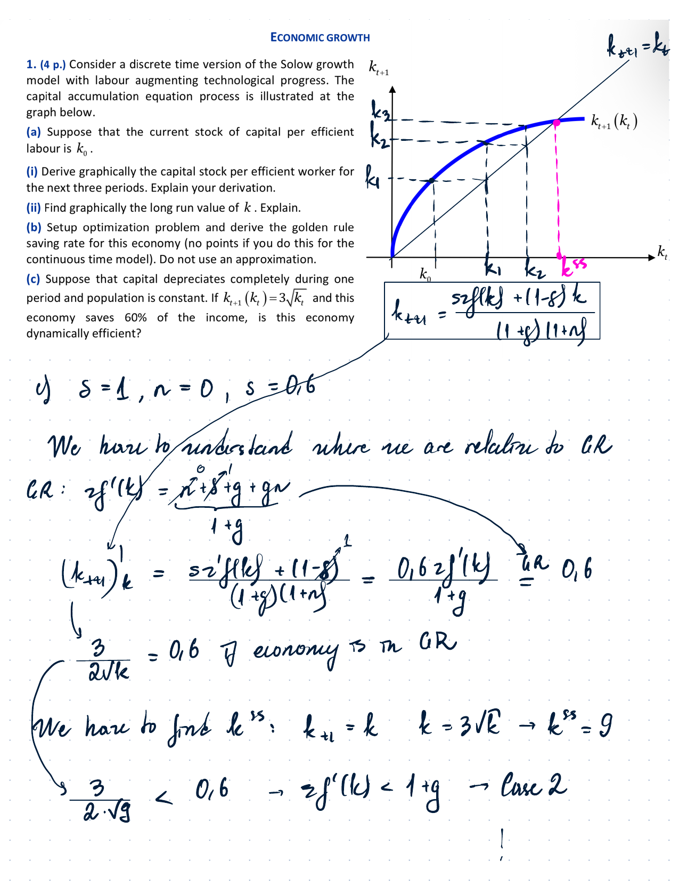

---

## Page 7 - Russia dynamic-efficiency task and AK model task

### Problem 2: Russia and dynamic efficiency

Problem statement:

Suppose the Russian economy is described by the Solow model with discrete time. Using data from the Penn World Table version 11.0, evaluate whether the Russian economy is dynamically efficient. Produce the table with data and explain the calculations and approach used to get the conclusion. Re-derive the results from the lecture; do not use an approximation.

Decision rule:

$$
r \quad \text{vs.} \quad n+g+gn.
$$

The real interest rate should be calculated as

$$
r=\frac{1+i}{1+\pi}-1.
$$

Then:

$$
r>n+g+gn
\Rightarrow
\text{case 1: dynamically efficient},
$$

$$
r<n+g+gn
\Rightarrow
\text{case 2: dynamically inefficient}.
$$

### Problem 3: AK model

Problem statement:

Consider an economy described by the AK model with production function

$$
Y=3K.
$$

Time is continuous. The current saving rate is

$$
s=0.25,
$$

and the current growth rate of person income is

$$
15\%.
$$

(a) Find algebraically and show graphically the time paths of

$$
\ln(Y/N)
\quad\text{and}\quad
\ln(C/N)
$$

using the same graph.

(b) Reproduce the time paths from part (a), mark the current moment of time as $t_0$, and assume the saving rate is suddenly reduced to

$$
s=0.2
$$

forever. Find algebraically and illustrate the resulting new time paths of $\ln(Y/N)$ and $\ln(C/N)$ by dashed lines.

(c) Is this economy dynamically efficient under the new saving rate?

For the AK model,

$$
Y=3K,
$$

so

$$
a=3.
$$

Consumption:

$$
C=(1-s)Y.
$$

Output per worker:

$$
\frac{Y}{N}=\frac{3K}{N}=3k.
$$

Since $Y$ is proportional to $K$,

$$
g_y=g_k=g_c.
$$

The initial growth rate is

$$
g_{Y/N}=0.15=sa-(n+\delta).
$$

With $s=0.25$ and $a=3$,

$$
0.15=0.25\cdot 3-(n+\delta),
$$

so

$$
n+\delta=0.6.
$$

Part (a): both $\ln(Y/N)$ and $\ln(C/N)$ grow permanently at rate

$$
0.15.
$$

The two lines have the same slope; $\ln(C/N)$ is below $\ln(Y/N)$ because $C=(1-s)Y$.

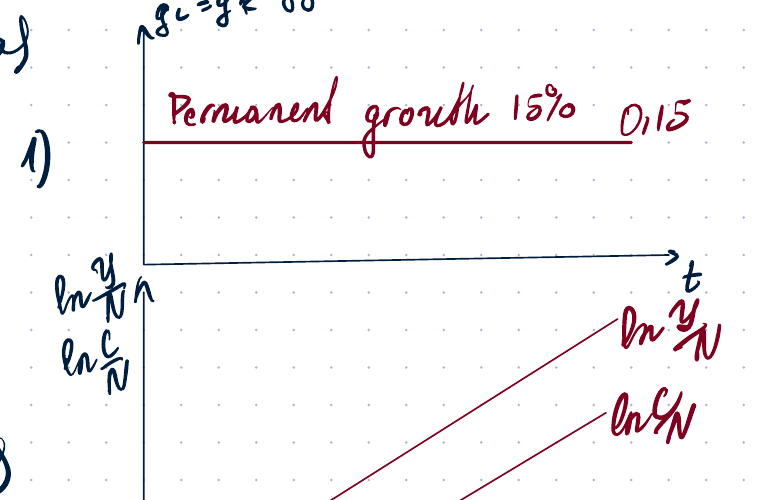

Full page image

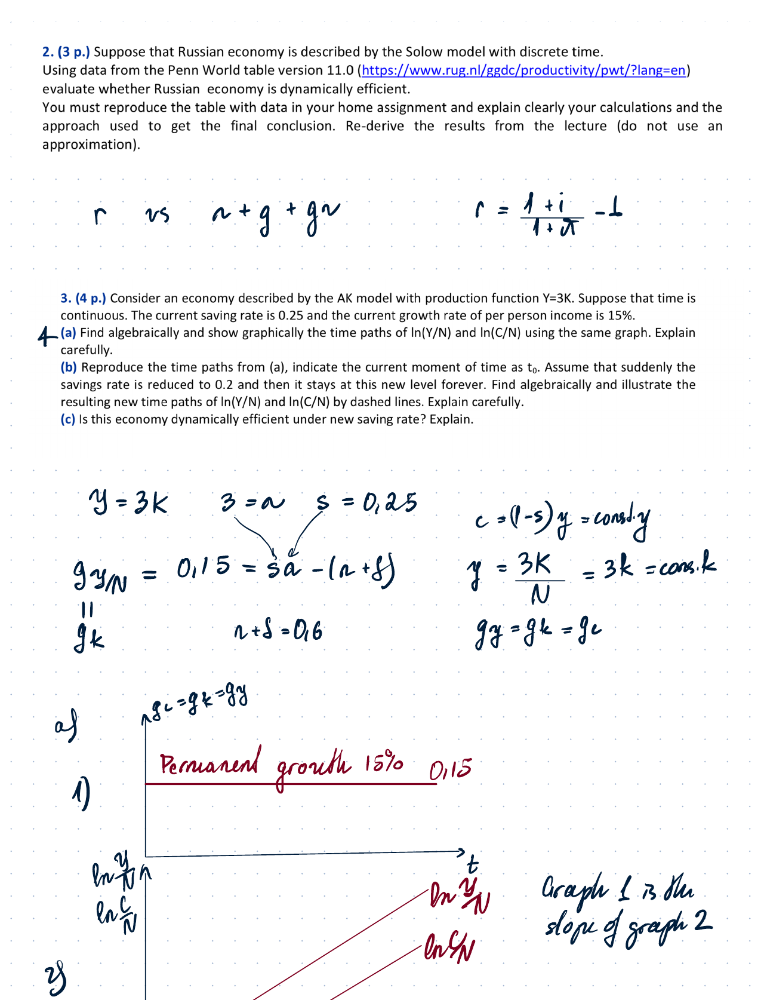

---

## Page 8 - AK model after the saving-rate cut

The vertical gap between $\ln(Y/N)$ and $\ln(C/N)$ is

$$
\ln\frac{Y}{N}-\ln\frac{C}{N}
=
\ln\frac{Y}{C}
=
\ln\frac{Y}{(1-s)Y}
=
\ln\frac{1}{1-s}
=
-\ln(1-s).
$$

After the saving rate falls to

$$
s^{new}=0.2,
$$

the new growth rate is

$$
g_k^{new}=g_y^{new}=g_c^{new}
=
s^{new}a-(n+\delta)
=
0.2\cdot 3-0.6=0.
$$

Thus:

- $\ln(Y/N)$ has **no jump** at the shock date, but its slope falls from $0.15$ to $0$.
- $\ln(C/N)$ has an **upward jump** at the shock date because $1-s$ rises.
- After the jump, $\ln(C/N)$ also has slope $0$.

The page marks the old permanent growth rate as $15\%$ and the new permanent growth rate as $0$.

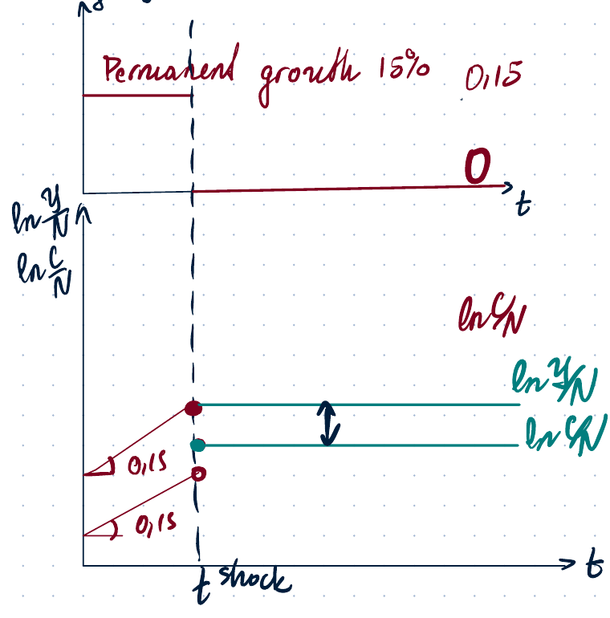

Full page image

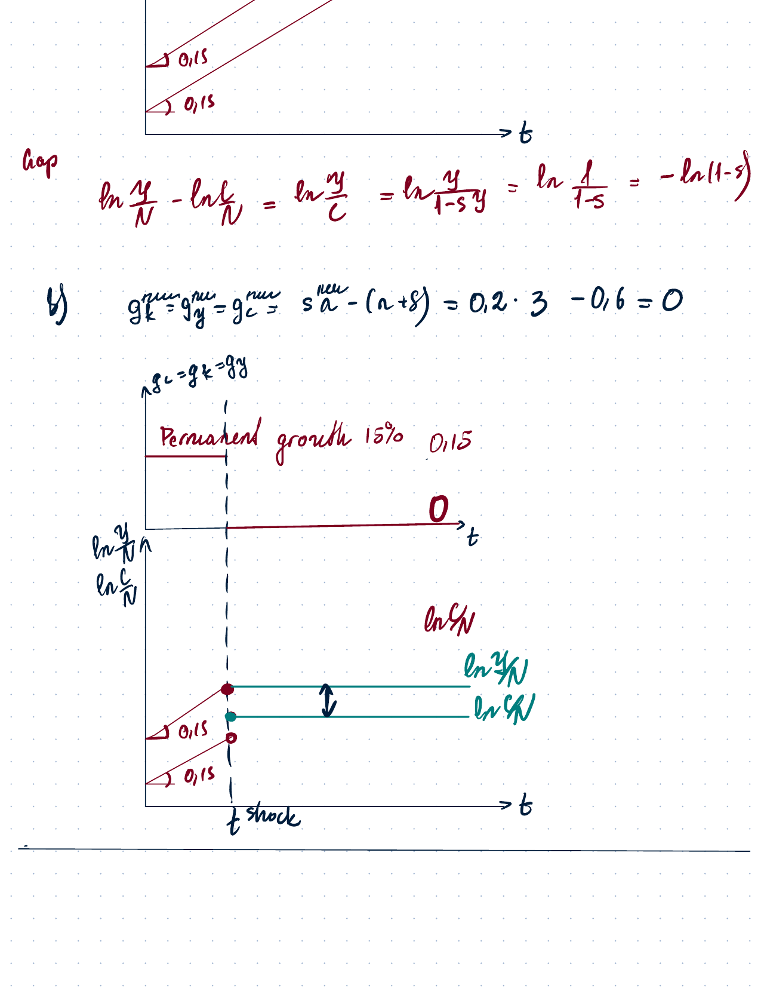

---

## Page 9 - Problem 2: Solow with government

Problem statement:

Use the Solow model with labour-augmenting technical progress to incorporate the government. Government consumption constitutes a constant fraction of output:

$$
G=\alpha Y,\qquad 0<\alpha<1.
$$

It is financed by a per-unit tax on output. Households must first deduct taxes from their income before they can save and consume. The saving rate is still constant. Assume that TFP equals $1$, population is constant, and depreciation is zero.

Part (a): derive the capital-accumulation equation. Explain how an increase in government purchases affects the steady-state income per effective worker.

The handwritten setup:

$$
G=\alpha Y,
$$

where $\alpha Y$ is procyclical.

Balanced budget:

$$
\alpha Y=\tau Y
\quad\Rightarrow\quad
\alpha=\tau.
$$

Households' disposable income:

$$
Y(1-\tau).
$$

Private saving:

$$
S_p=sY(1-\alpha).
$$

Private consumption:

$$
C_p=(1-s)Y(1-\alpha).
$$

Production side:

$$
z=1,\qquad Y=F(K,AN).
$$

Population is constant:

$$
n=0.
$$

Depreciation is zero:

$$
\delta=0.
$$

Goods-market equilibrium:

$$
I=S.
$$

Investment:

$$
I=K_{t+1}-K_t(1-\delta)=K_{t+1}-K_t.
$$

Total saving:

$$
S=S_p+S_{gov}.
$$

Full page image

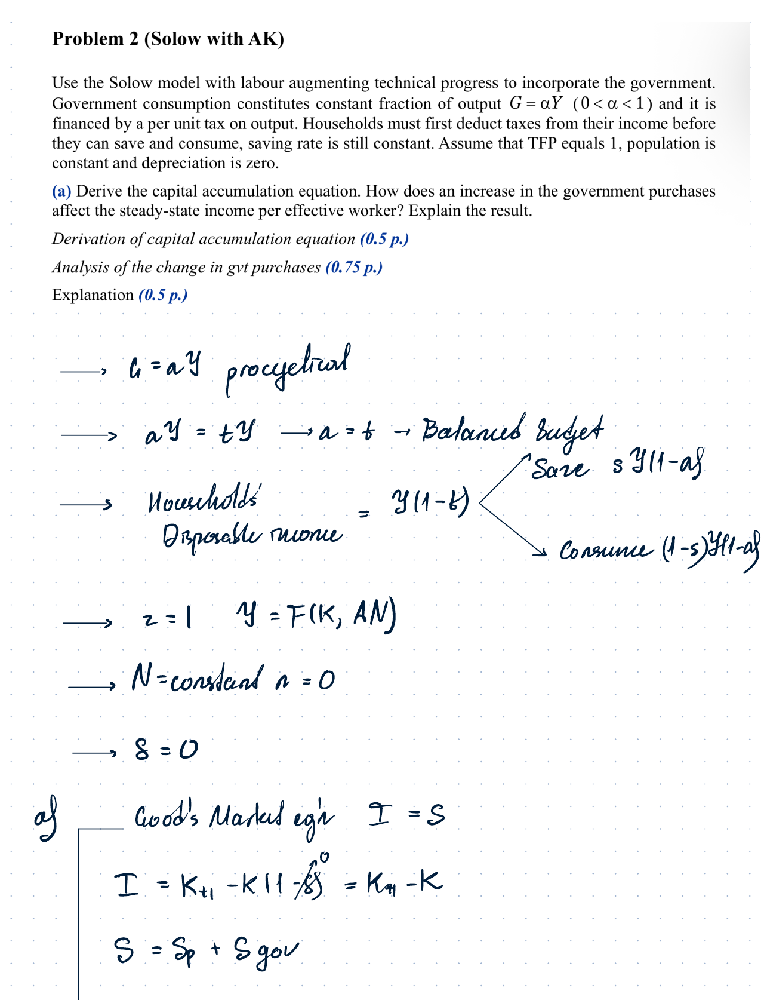

---

## Page 10 - Capital accumulation with government purchases

Private saving is

$$
S_p=s(1-\alpha)F(K,AN).
$$

Government saving is zero under the balanced budget:

$$
S_{gov}=0.
$$

Thus

$$
K_{t+1}-K_t=s(1-\alpha)F(K_t,A_tN_t).
$$

### Intensive form

Divide by $A_tN_t$:

$$
\frac{K_{t+1}}{A_tN_t}-\frac{K_t}{A_tN_t}
=
s(1-\alpha)\frac{F(K_t,A_tN_t)}{A_tN_t}.
$$

Since

$$
k_t=\frac{K_t}{A_tN_t},
$$

and

$$
A_{t+1}=(1+g)A_t,
$$

we have

$$
\frac{K_{t+1}}{A_tN_t}
=
\frac{K_{t+1}}{A_{t+1}N_{t+1}}(1+g)
=
k_{t+1}(1+g),
$$

where population is constant, so $N_{t+1}=N_t$.

Also, by CRS,

$$
\frac{F(K_t,A_tN_t)}{A_tN_t}
=
F\left(\frac{K_t}{A_tN_t},1\right)
=
f(k_t).
$$

Therefore

$$
k_{t+1}(1+g)-k_t=s(1-\alpha)f(k_t).
$$

Hence

$$
k_{t+1}=\frac{s(1-\alpha)f(k_t)+k_t}{1+g}.
$$

Subtract $k_t$:

$$
k_{t+1}-k_t
=
\frac{s(1-\alpha)f(k_t)-gk_t}{1+g}.
$$

This is the **capital-accumulation equation**.

Intuition for an increase in government purchases:

$$
\alpha\uparrow
\Rightarrow
\text{disposable income}\downarrow
\Rightarrow
\text{private saving}\downarrow
\Rightarrow
\text{total saving}\downarrow.
$$

At the old steady state, required investment exceeds saving:

$$
\Delta k<0.
$$

Therefore

$$
k\downarrow
\Rightarrow
y\downarrow.
$$

Full page image

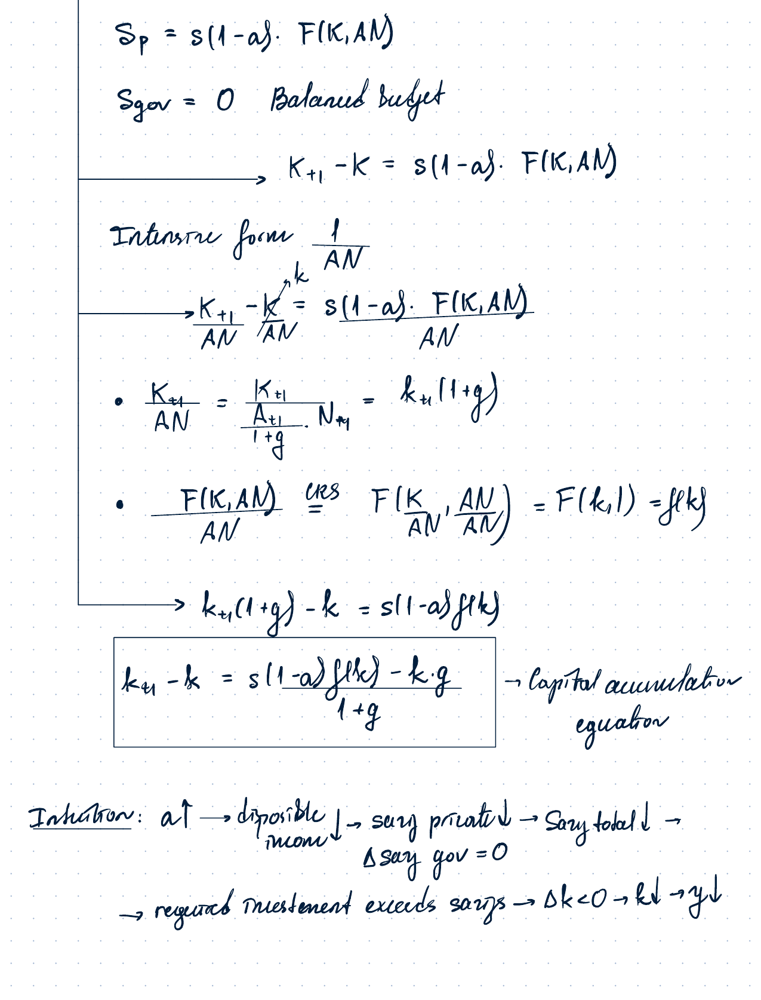

---

## Page 11 - Algebra for the effect of government purchases

Steady-state output per effective worker is

$$
y^{ss}=f(k^{ss}(\alpha)).
$$

The derivative is

$$
\frac{dy^{ss}}{d\alpha}
=
\frac{d f(k^{ss}(\alpha))}{d\alpha}
=
\frac{df(k^{ss})}{dk^{ss}}\cdot
\frac{dk^{ss}}{d\alpha}
<0.
$$

The first term is positive:

$$
\frac{df(k^{ss})}{dk^{ss}}=f'(k^{ss})>0.
$$

The sign depends on

$$
\frac{dk^{ss}}{d\alpha}.
$$

Use the steady-state condition:

$$
k_{t+1}=k_t,
$$

so

$$
s(1-\alpha)f(k^{ss})-gk^{ss}=0.
$$

Let

$$
H(k^{ss},\alpha)=s(1-\alpha)f(k^{ss})-gk^{ss}.
$$

By the implicit function theorem,

$$
\frac{dk^{ss}}{d\alpha}
=
-\frac{\partial H/\partial \alpha}{\partial H/\partial k^{ss}}
=
-\frac{-s f(k^{ss})}
{s(1-\alpha)f'(k^{ss})-g}.
$$

Using the steady-state condition,

$$
g=\frac{s(1-\alpha)f(k^{ss})}{k^{ss}}.
$$

Then

$$
\frac{dk^{ss}}{d\alpha}
=
\frac{s f(k^{ss})}
{s(1-\alpha)f'(k^{ss})-
s(1-\alpha)\dfrac{f(k^{ss})}{k^{ss}}}
=
\frac{f(k^{ss})}
{(1-\alpha)\left(MPK-APK\right)}
<0.
$$

The denominator is negative because

$$
MPK<APK
$$

for a concave production function. Therefore,

$$
\frac{dk^{ss}}{d\alpha}<0,
$$

and hence

$$
\frac{dy^{ss}}{d\alpha}<0.
$$

So an increase in government purchases lowers steady-state income per effective worker.

Full page image

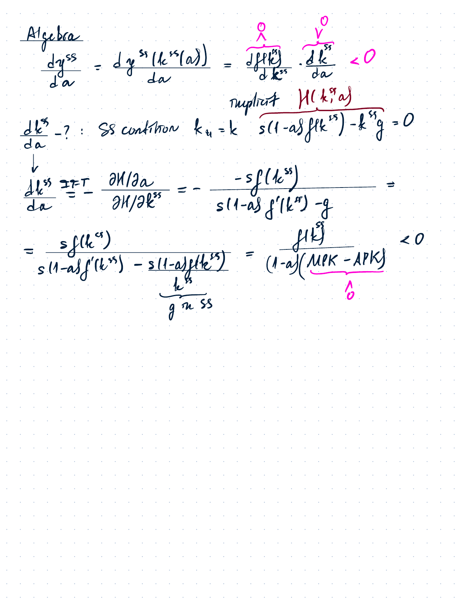

---

## Compact formula list

Golden Rule:

$$
z f'(k^{GR})=n+\delta+g+gn.
$$

Golden Rule real interest rate:

$$
r^{GR}=n+g+gn.
$$

Golden Rule saving rate:

$$
s^{GR}=\frac{z f'(k^{GR})k^{GR}}{z f(k^{GR})}.
$$

Dynamic efficiency test:

$$
r>n+g+gn
\Rightarrow
\text{undersaving, dynamically efficient}.
$$

$$
r<n+g+gn
\Rightarrow
\text{oversaving, dynamically inefficient}.
$$

AK growth:

$$
g_{Y/N}=sa-(n+\delta).
$$

Solow with government share $\alpha$:

$$
k_{t+1}-k_t
=
\frac{s(1-\alpha)f(k_t)-gk_t}{1+g}.
$$

Government-purchases effect:

$$
\alpha\uparrow
\Rightarrow
k^{ss}\downarrow
\Rightarrow
y^{ss}\downarrow.
$$
