# Week 2 - Long-Run Growth

This Markdown version preserves the lecture-note context by combining a cleaned transcription with original page images. Mathematical expressions are written in LaTeX. Graphs and diagrams are embedded as images.

---

## Page 1 - Solow model of exogenous economic growth

The **Solow model** studies **exogenous economic growth**.

Growth in the steady state is given from outside the model and cannot be changed by agents inside the model. The notes focus on the growth rate of GDP per capita / consumption per capita.

### Continuous time notation

For any variable $X$, its growth rate is:

$$
g_X = \frac{\dot X}{X} = \left(\ln X\right)'_t .
$$

### Discrete time notation

The default case in the notes is discrete time:

$$
g_X = \frac{X_{t+1}-X_t}{X_t}=\frac{\Delta X}{X_t}.
$$

### Solow model with labour-augmenting technical progress

Production function:

$$
Y = F(K,AN),
$$

where:

- $K$ = capital stock,
- $N$ = population / labour,
- $A$ = labour-augmenting technology,
- $AN$ = effective labour.

There is no unemployment in the default model.

The production function must be neoclassical.

Growth of technology:

$$
g_A = \frac{A_{t+1}-A_t}{A_t}, \qquad A_{t+1}=(1+g)A_t.
$$

Growth of population:

$$
g_N = \frac{N_{t+1}-N_t}{N_t}, \qquad N_{t+1}=(1+n)N_t.
$$

Notes:

- $g$ is treated like a public-good type technology-growth parameter.
- $n$ is country-specific.
- TFP $z$ is constant unless stated otherwise.

Full page image

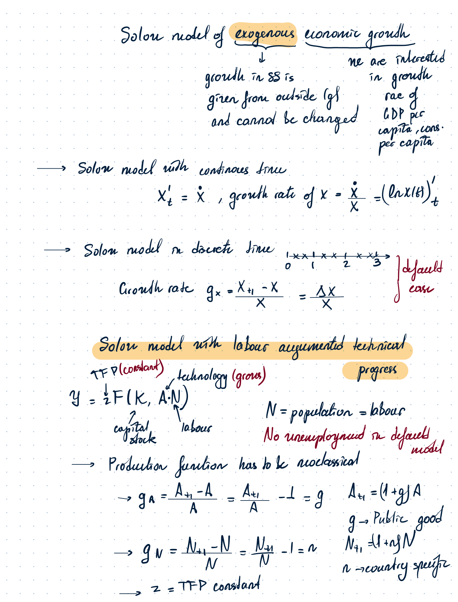

---

## Page 2 - Derivation of the Solow model

Assume a closed economy without government.

Goods-market equilibrium:

$$
Y=C+I.
$$

Investment is the part of output not consumed:

$$
I=Y-C=sY,
$$

where $s$ is the saving rate.

Capital accumulation:

$$
K_{t+1}=K_t(1-\delta)+sF(K_t,A_tN_t).
$$

Equivalently:

$$
K_{t+1}-K_t=sF(K_t,A_tN_t)-\delta K_t.
$$

### Intensive form

State variable:

$$
k_t=\frac{K_t}{A_tN_t},
$$

capital per unit of effective labour.

Output per unit of effective labour:

$$
y_t=\frac{Y_t}{A_tN_t}=\frac{F(K_t,A_tN_t)}{A_tN_t}=F\left(\frac{K_t}{A_tN_t},1\right)=f(k_t).
$$

Divide the capital-accumulation equation by effective labour:

$$
\frac{K_{t+1}}{A_tN_t}=s f(k_t)+(1-\delta)k_t.
$$

Since:

$$
A_{t+1}N_{t+1}=(1+g)(1+n)A_tN_t,
$$

we have:

$$
\frac{K_{t+1}}{A_tN_t}=k_{t+1}(1+g)(1+n).
$$

Therefore:

$$
k_{t+1}(1+g)(1+n)=s f(k_t)+(1-\delta)k_t,
$$

or:

$$
k_{t+1}=\frac{s f(k_t)+(1-\delta)k_t}{(1+g)(1+n)}.
$$

Full page image

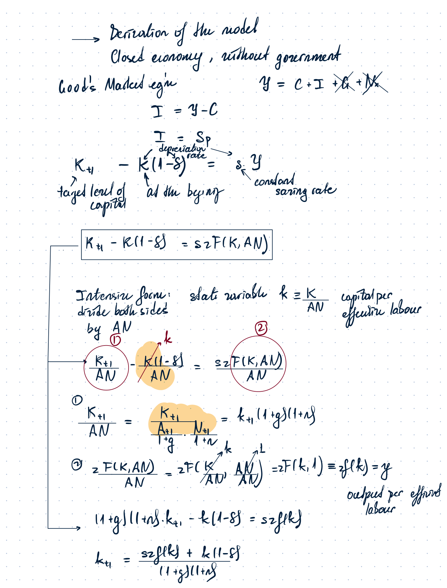

---

## Page 3 - Capital accumulation and steady state

Subtract $k_t$ from both sides:

$$
k_{t+1}-k_t
=\frac{s f(k_t)+(1-\delta)k_t}{(1+g)(1+n)}-k_t.
$$

After rearranging:

$$
\Delta k
= k_{t+1}-k_t
=\frac{s f(k_t)-\left(n+g+gn+\delta\right)k_t}{(1+g)(1+n)}.
$$

The numerator is the key capital-accumulation condition:

$$
s f(k_t)-\left(n+g+gn+\delta\right)k_t.
$$

### Continuous-time version

In continuous time, the equivalent equation is:

$$
\dot k=s f(k)-(n+g+\delta)k.
$$

### Steady state

Steady state means:

$$
k_{t+1}-k_t=\Delta k=0.
$$

Capital per effective labour is constant:

$$
k=\frac{K}{AN}=\text{constant}.
$$

Steady-state condition:

$$
s f(k^{ss})=(n+g+gn+\delta)k^{ss}.
$$

Interpretation:

- $s f(k)$ = saving per unit of effective labour.
- $(n+g+gn+\delta)k$ = required investment / break-even investment per unit of effective labour.

Thus:

$$
s f(k)>(n+g+gn+\delta)k \Rightarrow \Delta k>0,
$$

so capital accumulates.

$$
s f(k)<(n+g+gn+\delta)k \Rightarrow \Delta k<0,
$$

so capital is reduced / depleted.

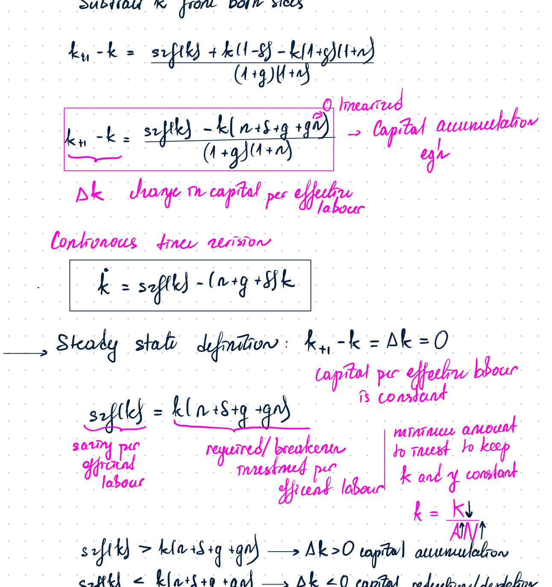

Full page image

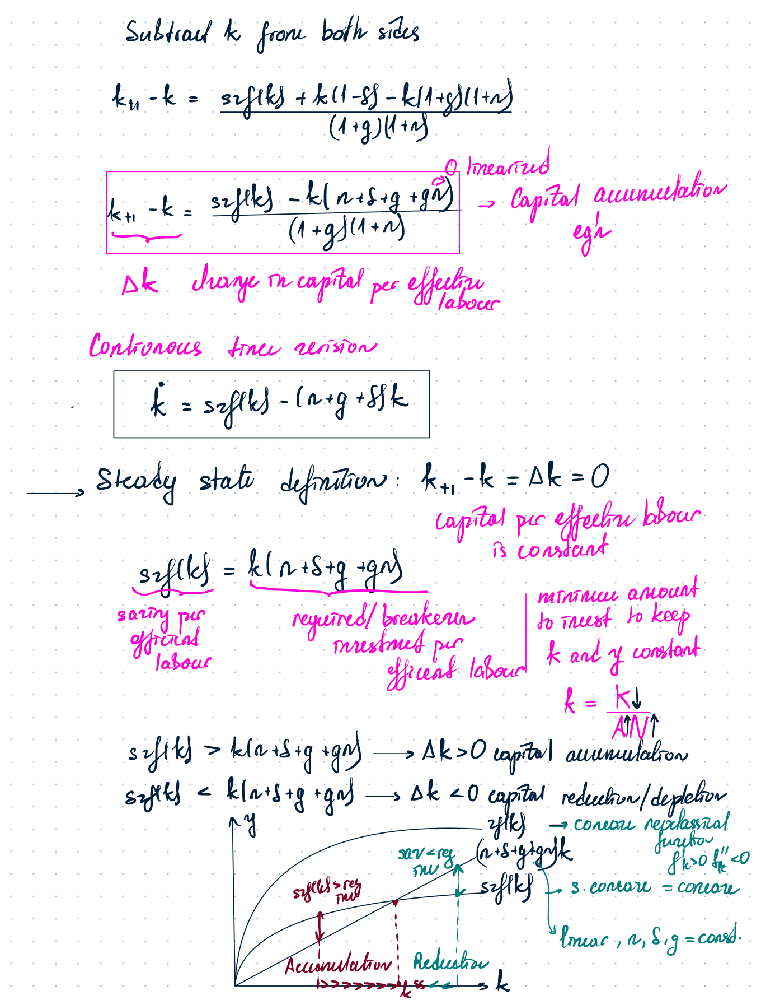

---

## Page 4 - Convergence intuition and Inada conditions

The closer the economy is to the steady state, the lower capital accumulation or depletion becomes.

Reason: with each extra unit of capital, marginal income earned decreases. Therefore marginal saving also decreases because of diminishing returns to capital. Required investment is linear in $k$ because $n$, $g$, and $\delta$ are constant.

At some point, saving per effective labour is exactly enough to keep $k$ constant.

The notes distinguish:

- **trivial steady state**, $k=0$,
- **non-trivial steady state**, $k^{ss}>0$.

Inada conditions are needed to guarantee the existence of a non-trivial steady state.

Typical Inada-style conditions:

$$
\lim_{k\to 0} f'(k)=\infty,
$$

$$
\lim_{k\to \infty} f'(k)=0.
$$

Without these conditions, the model may have only the trivial steady state.

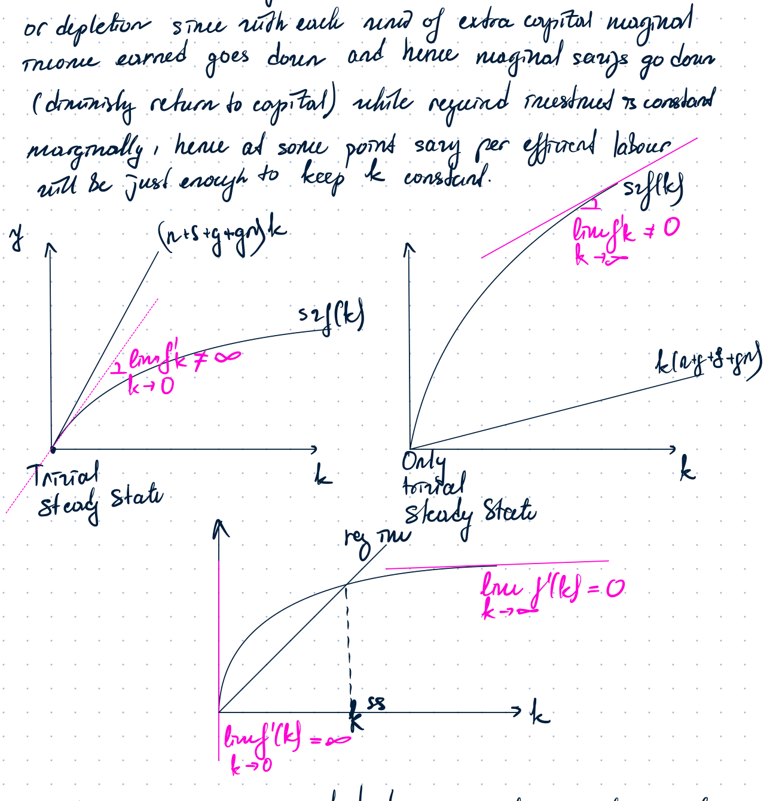

Full page image

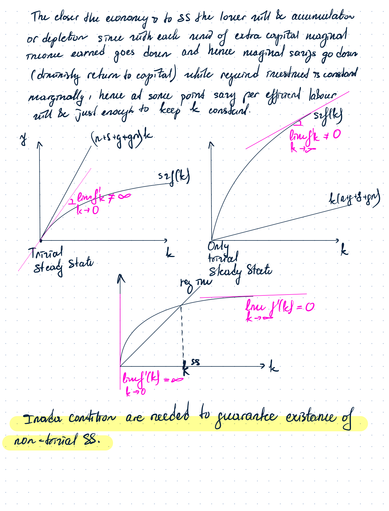

---

## Page 5 - Growth rate of output in the discrete Solow model

Aggregate output:

$$
Y_t=A_tN_t f(k_t).
$$

The growth rate of aggregate output is:

$$
g_Y
=\frac{Y_{t+1}}{Y_t}-1
=\frac{A_{t+1}N_{t+1}f(k_{t+1})}{A_tN_t f(k_t)}-1.
$$

Since:

$$
\frac{A_{t+1}}{A_t}=1+g, \qquad \frac{N_{t+1}}{N_t}=1+n,
$$

we get:

$$
g_Y=\frac{f(k_{t+1})}{f(k_t)}(1+g)(1+n)-1.
$$

In steady state, $k_{t+1}=k_t=k^{ss}$, so:

$$
g_Y^{ss}=(1+g)(1+n)-1=g+n+gn.
$$

For output per worker:

$$
\frac{Y_t}{N_t}=A_t f(k_t).
$$

Hence:

$$
g_{Y/N}=\frac{A_{t+1}f(k_{t+1})}{A_tf(k_t)}-1.
$$

In steady state:

$$
g_{Y/N}^{ss}=g.
$$

Full page image

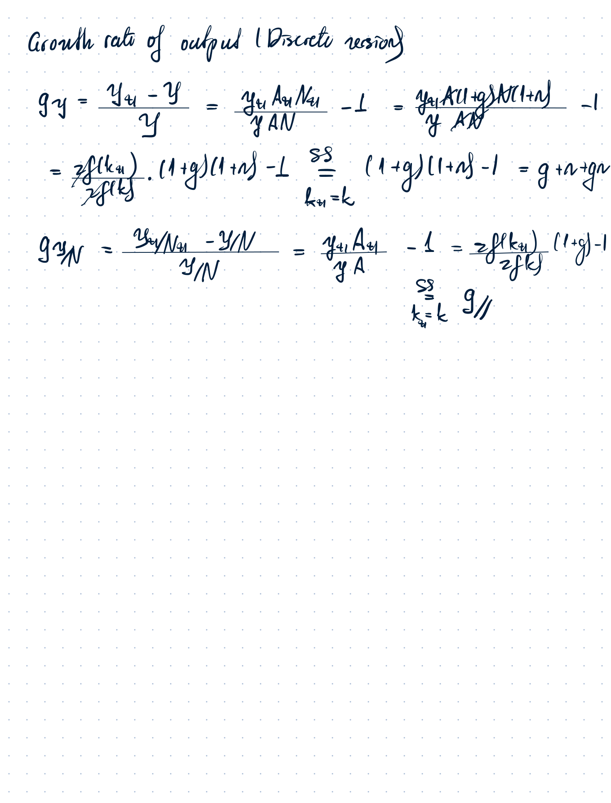

---

## Page 6 - Problem 1: Solow model with Cobb-Douglas production

Problem setup:

$$
Y=K^{1/3}(AN)^{2/3},
$$

capital depreciates at:

$$
\delta=0.1,
$$

and population evolves as:

$$
N_t=(1.08)^t.
$$

Thus:

$$
n=\frac{N_{t+1}-N_t}{N_t}=\frac{1.08^{t+1}-1.08^t}{1.08^t}=1.08-1=0.08.
$$

### Part (a): $A$ is constant and the long-run real interest rate is 5%

If $A$ is constant:

$$
g=0.
$$

Long-run real interest rate:

$$
r=0.05.
$$

In competitive markets:

$$
r=MPK-\delta.
$$

Therefore:

$$
MPK=r+\delta=0.05+0.1=0.15.
$$

Intensive-form production:

$$
f(k)=k^{1/3}.
$$

Marginal product of capital:

$$
f'(k)=\frac{1}{3}k^{-2/3}.
$$

Set $f'(k)=0.15$:

$$
\frac{1}{3}k^{-2/3}=0.15.
$$

Hence:

$$
k^{2/3}=\frac{1}{3\cdot 0.15}=\frac{1}{0.45}.
$$

Steady-state condition:

$$
s f(k)=k(n+\delta+g).
$$

Since $n=0.08$, $\delta=0.1$, and $g=0$:

$$
s k^{1/3}=0.18k.
$$

Therefore:

$$
s=0.18k^{2/3}=0.18\cdot \frac{1}{0.45}=0.4.
$$

So the saving rate is:

$$
\boxed{s=0.4}.
$$

Full page image

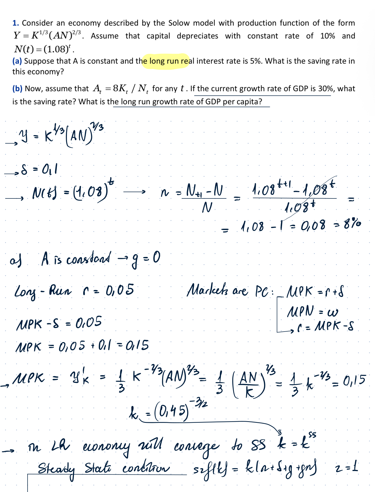

---

## Page 7 - AK model derivation

The notes then move to the **AK model**, where output is linear in capital:

$$
y=aK.
$$

The marginal product of capital is constant:

$$
MPK=a=\text{constant}.
$$

This is different from the standard Solow model because there are no diminishing returns to capital.

### Capital accumulation

If investment is saving:

$$
I=S,
$$

then:

$$
K_{t+1}-K_t(1-\delta)=saK_t.
$$

Equivalently:

$$
K_{t+1}=saK_t+K_t(1-\delta).
$$

In per-worker or per-capita terms, with population growth $n$:

$$
\frac{K_{t+1}}{N_{t+1}}=\frac{saK_t+(1-\delta)K_t}{(1+n)N_t}.
$$

Let:

$$
k_t=\frac{K_t}{N_t}.
$$

Then:

$$
k_{t+1}=\frac{sa+(1-\delta)}{1+n}k_t.
$$

Subtract $k_t$:

$$
\frac{k_{t+1}-k_t}{k_t}=\frac{sa-\delta-n}{1+n}.
$$

In continuous-time notation:

$$
\dot k=sa k-(n+\delta)k.
$$

The AK model has no steady-state level of $k$ in the standard Solow sense. It can generate permanent growth, so it is an **endogenous growth** model.

Full page image

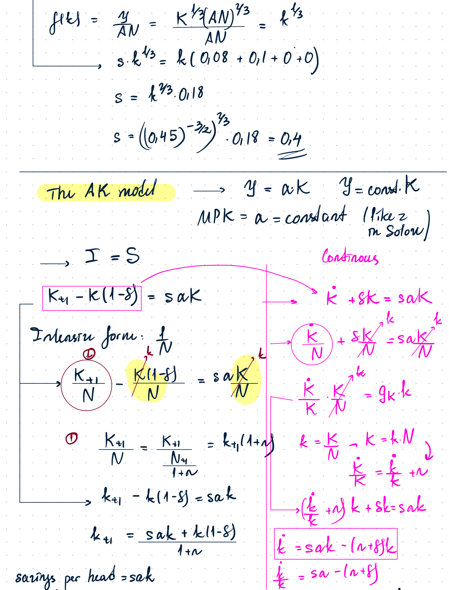

---

## Page 8 - Useful AK results and Problem 1(b)

In the AK model:

$$
y=aK.
$$

Since $y$ is proportional to $K$:

$$
g_y=g_K.
$$

From the capital law of motion:

$$
K_{t+1}-(1-\delta)K_t=saK_t.
$$

Therefore:

$$
\frac{K_{t+1}-K_t}{K_t}=sa-\delta.
$$

Thus:

$$
g_Y=g_K=sa-\delta.
$$

For output per worker:

$$
g_{Y/N}=\frac{sa-\delta-n}{1+n}
$$

in the discrete-time version, and approximately:

$$
g_{Y/N}\approx sa-\delta-n.
$$

### Applying to Problem 1(b)

Given:

$$
Y=K^{1/3}(AN)^{2/3}, \qquad A_t=\frac{8K_t}{N_t}.
$$

Then:

$$
AN=8K.
$$

So:

$$
Y=K^{1/3}(8K)^{2/3}=4K.
$$

Hence this becomes an AK model with:

$$
a=4.
$$

If aggregate GDP grows at 30%:

$$
g_Y=0.3.
$$

Using:

$$
g_Y=sa-\delta,
$$

we get:

$$
0.3=4s-0.1.
$$

Therefore:

$$
s=0.1.
$$

So the saving rate is:

$$
\boxed{s=0.1}.
$$

Full page image

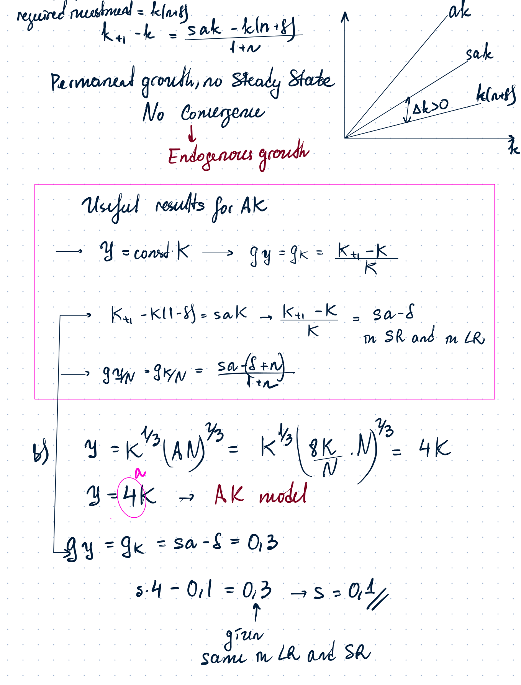

---

## Page 9 - GDP per capita growth and Golden Rule introduction

For Problem 1(b), the growth rate of GDP per capita is:

$$
g_{Y/N}=\frac{Y_{t+1}/N_{t+1}}{Y_t/N_t}-1.
$$

Since $Y=4K$:

$$
g_{Y/N}=\frac{4K_{t+1}/N_{t+1}}{4K_t/N_t}-1.
$$

Thus:

$$
g_{Y/N}=\frac{K_{t+1}/K_t}{N_{t+1}/N_t}-1.
$$

Using $g_Y=0.3$ and $n=0.08$:

$$
g_{Y/N}=\frac{1+0.3}{1+0.08}-1
=\frac{1.3}{1.08}-1
\approx 0.2037.
$$

So:

$$
\boxed{g_{Y/N}\approx 0.20}.
$$

### Week 2.2 Part 2: Golden Rule steady state

The **Golden Rule steady state** is the steady state where consumption per effective labour is maximized.

Consumption per effective labour:

$$
c=(1-s)y=(1-s)z f(k^{ss}).
$$

Using the steady-state condition:

$$
s z f(k^{ss})=(n+\delta+g+gn)k^{ss},
$$

we can write:

$$
c=z f(k^{ss})-(n+\delta+g+gn)k^{ss}.
$$

The Golden Rule chooses $k^{ss}$ to maximize $c$.

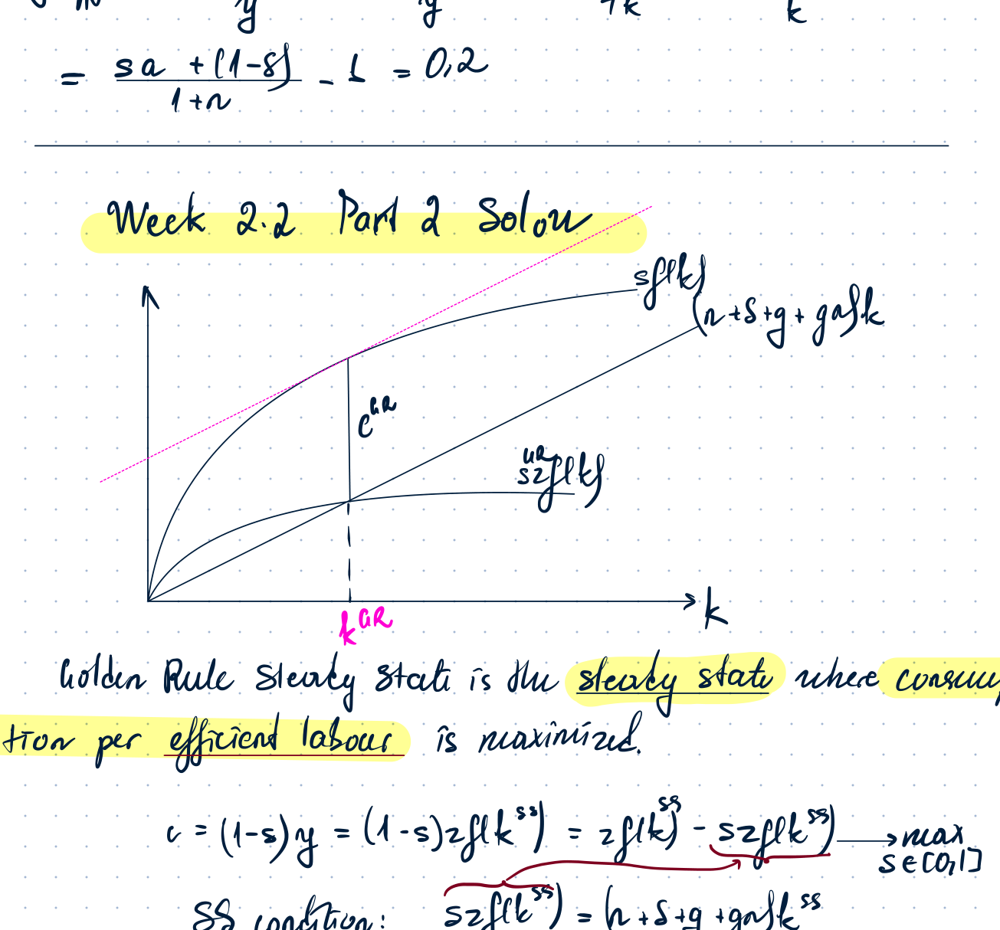

Full page image

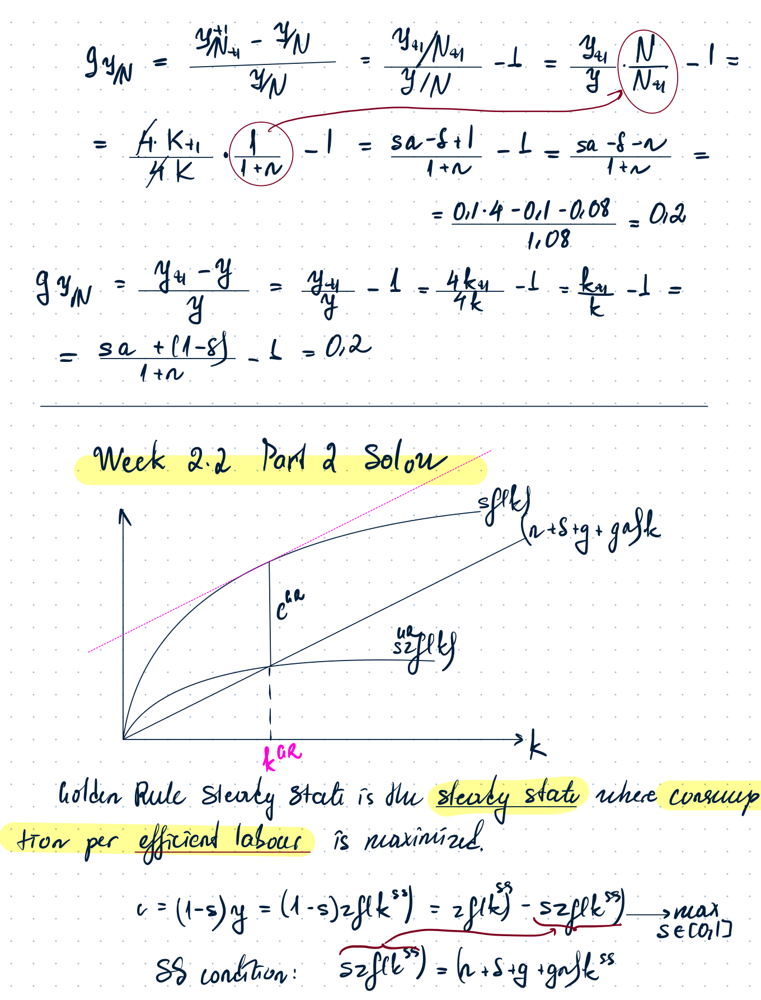

---

## Page 10 - Golden Rule condition

Golden Rule problem:

$$
\max_{k^{ss}\ge 0} c=z f(k^{ss})-(n+\delta+g+gn)k^{ss}.
$$

First-order condition:

$$
z f'(k^{GR})=n+\delta+g+gn.
$$

This is the Golden Rule condition.

Interpretation: choose the level of $k$ such that the slope of the production function equals the slope of the required-investment line.

In competitive markets:

$$
r=z f'(k)-\delta.
$$

Thus at the Golden Rule:

$$
r^{GR}=n+g+gn.
$$

### Golden Rule saving rate

Steady-state condition:

$$
sz f(k^{ss})=(n+\delta+g+gn)k^{ss}.
$$

At the Golden Rule:

$$
s^{GR}z f(k^{GR})=(n+\delta+g+gn)k^{GR}.
$$

Using the Golden Rule condition:

$$
z f'(k^{GR})=n+\delta+g+gn,
$$

we get:

$$
s^{GR}z f(k^{GR})=z f'(k^{GR})k^{GR}.
$$

Therefore:

$$
s^{GR}=\frac{z f'(k^{GR})k^{GR}}{z f(k^{GR})}.
$$

This is the capital share of income in the Golden Rule allocation.

The notes state: in the Golden Rule, all capital income is saved and all labour income is consumed.

Full page image

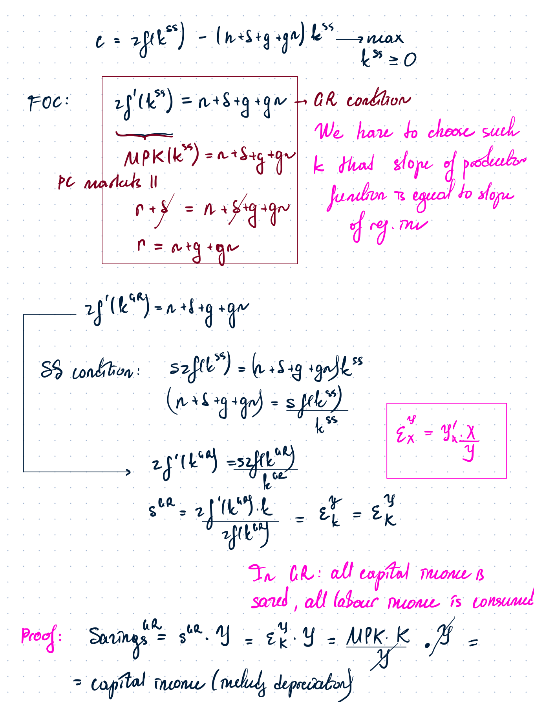

---

## Page 11 - Dynamic efficiency: case 1, undersaving

Consumption at the Golden Rule can be interpreted through factor income. With CRS and Euler's theorem:

$$
y=MPK\cdot K + \omega N.
$$

At the Golden Rule, savings correspond to capital income net of depreciation, so consumption corresponds to labour income.

### Case 1: actual capital is below Golden Rule capital

Condition:

$$
z f'(k^{ss})>n+\delta+g+gn.
$$

Equivalently:

$$
r>n+g+gn.
$$

Since $MPK$ is diminishing:

$$
k^{ss}<k^{GR}.
$$

This means the economy saves too little:

$$
s<s^{GR}.
$$

The economy is **undersaving**.

To increase long-run consumption, the economy must raise the saving rate and move toward $k^{GR}$.

Immediate effect:

$$
s\uparrow \Rightarrow c=(1-s)z f(k_0)\downarrow.
$$

Current generations are worse off.

Long-run effect:

$$
s\uparrow \Rightarrow k\uparrow \Rightarrow c^{LR}\uparrow.
$$

Future generations are better off.

Since current generations lose, there is **no Pareto improvement**.

The economy is **dynamically efficient**.

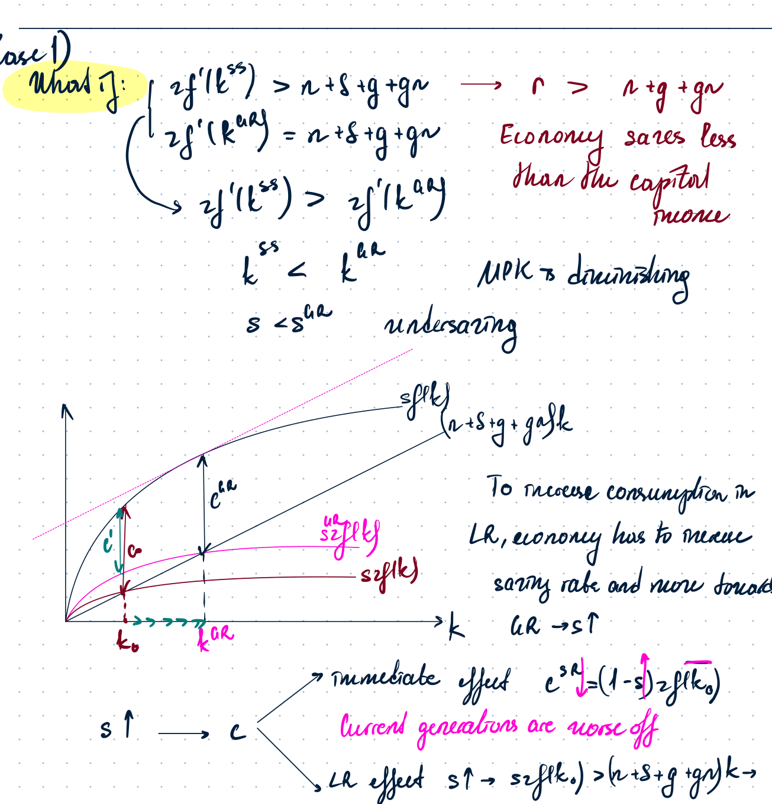

Full page image

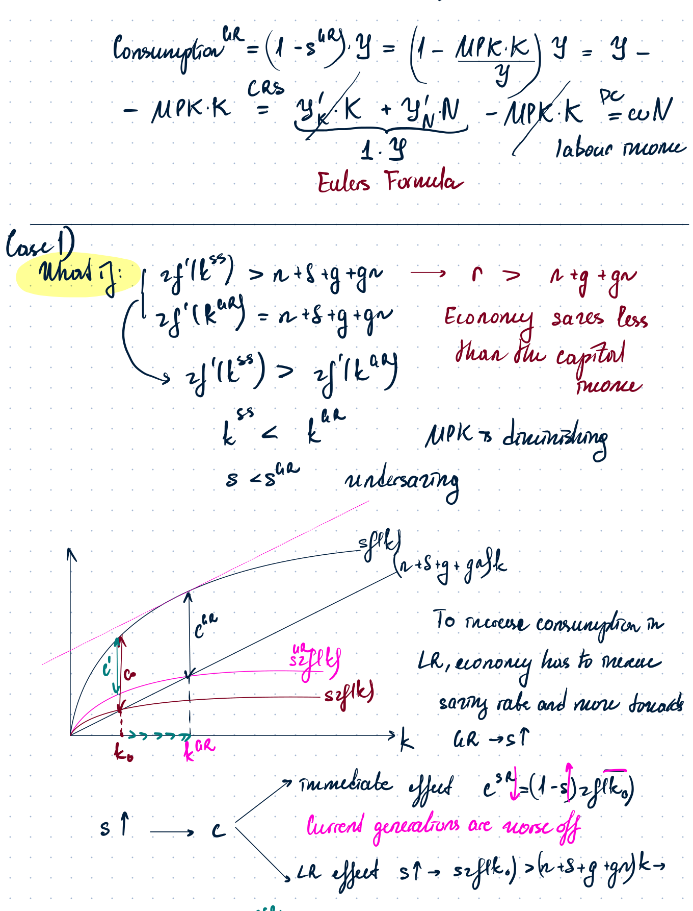

---

## Page 12 - Dynamic efficiency: case 2, oversaving

### Case 2: actual capital is above Golden Rule capital

Condition:

$$
z f'(k^{ss})<n+\delta+g+gn.
$$

Equivalently:

$$
r<n+g+gn.
$$

Then:

$$
k^{ss}>k^{GR}.
$$

This means the economy saves too much:

$$
s>s^{GR}.
$$

The economy is **oversaving**.

To increase consumption in the long run, the economy should lower the saving rate and move toward $k^{GR}$.

Immediate effect:

$$
s\downarrow \Rightarrow c=(1-s)z f(k_0)\uparrow.
$$

Current generations are better off.

Long-run effect:

$$
s\downarrow \Rightarrow k\downarrow \Rightarrow c^{LR}\uparrow.
$$

Future generations are also better off.

Therefore a Pareto improvement exists.

The economy is **dynamically inefficient**.

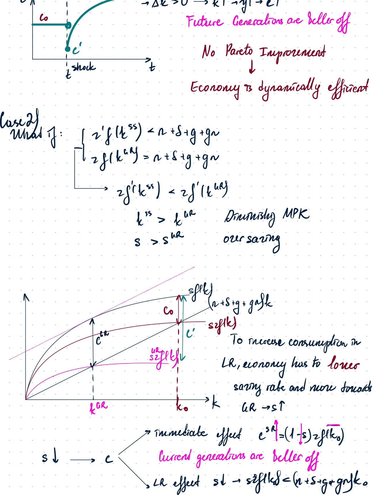

Full page image

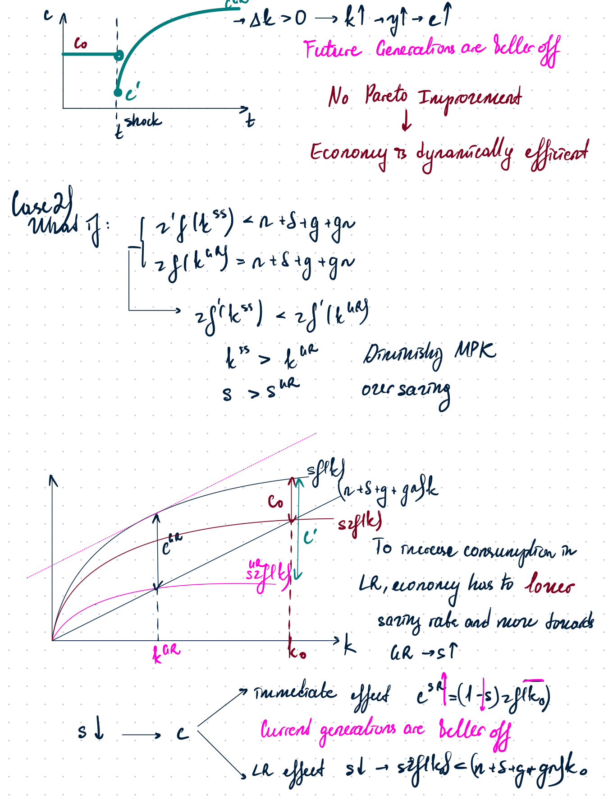

---

## Page 13 - Time paths and Home Assignment 2 comments

For the oversaving case, after a reduction in the saving rate:

$$
\Delta k<0 \Rightarrow k\downarrow,
$$

but consumption rises immediately and remains higher in the long run.

The notes summarize:

- Future generations are better off.
- A Pareto improvement exists.
- The economy is dynamically inefficient.

### Home Assignment 2 comments

Discrete-time Solow capital law:

$$
k_{t+1}=\frac{s z f(k_t)+(1-\delta)k_t}{(1+g)(1+n)}.
$$

For graphing the transition:

- Put $k_t$ on the horizontal axis.
- Put $k_{t+1}$ on the vertical axis.
- Draw the $45^\circ$ line.
- Intersections of the transition curve with the $45^\circ$ line are steady states.

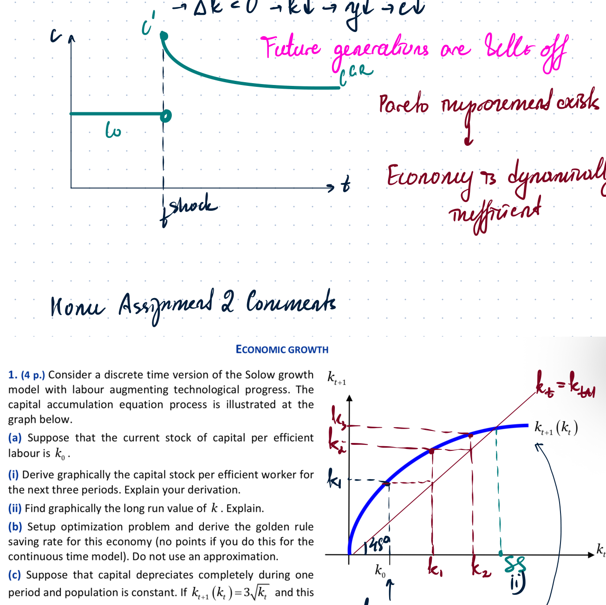

Full page image

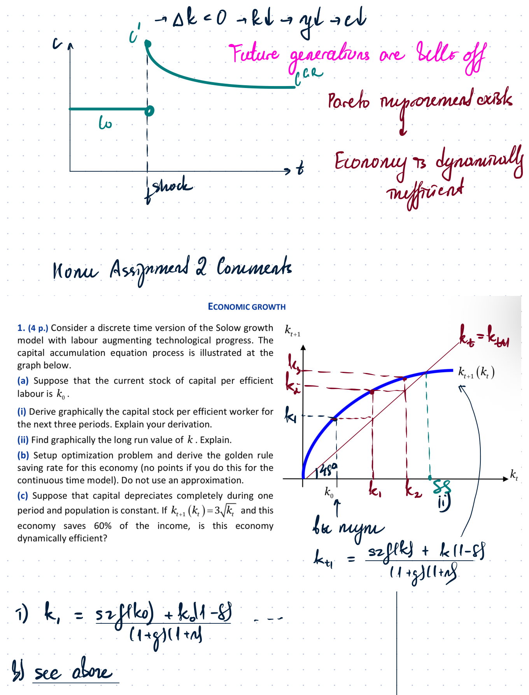

---

## Page 14 - Home Assignment 2: Golden Rule and dynamic efficiency check

The notes continue the Home Assignment 2 calculation.

The steady state is found from:

$$
k_{t+1}=k_t=k^{ss}.
$$

For the given numerical case in the notes, the steady-state value is written as:

$$
k^{ss}=9.
$$

The Golden Rule condition is checked by comparing:

$$
z f'(k^{ss})
$$

with the required return term:

$$
1+g+n+gn
$$

in the discrete-time setup, or with the relevant continuous-time equivalent if that version is used.

The note's conclusion for the case shown:

- the economy is **not** in the Golden Rule steady state;
- it is treated as **case 2**;
- therefore it is **dynamically inefficient**.

### Russian economy data problem

The notes also state a data-based exercise using Penn World Table data.

Decision rule:

$$
r>n+g+gn \Rightarrow \text{case 1},
$$

$$
r<n+g+gn \Rightarrow \text{case 2}.
$$

The calculation should use exact values from the data and should not rely on rough approximations.

Full page image

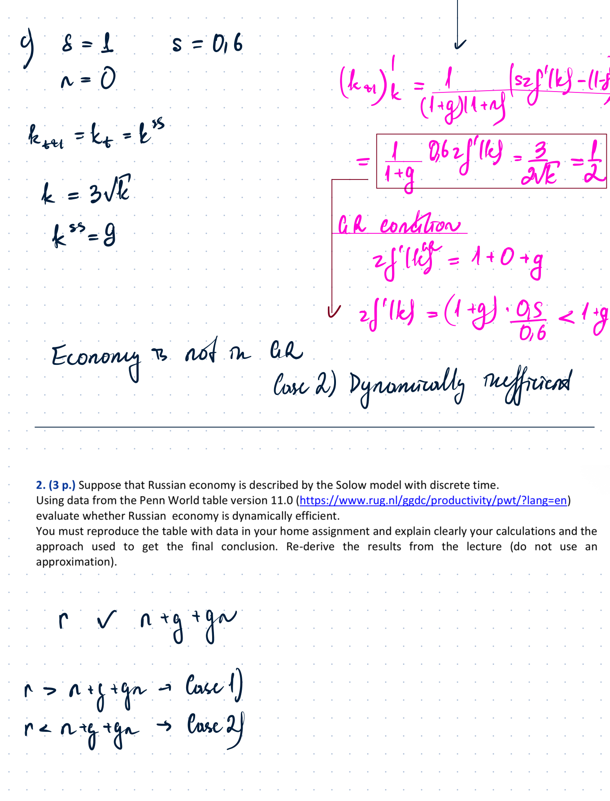

---

## Page 15 - AK model with $Y=3K$

Problem setup:

$$
Y=3K.
$$

The notes use:

$$
s=0.25,
$$

and a combined population-growth/depreciation term such that:

$$
n+\delta=0.6.
$$

For the AK model:

$$
g_{Y/N}=g_k=sa-(n+\delta),
$$

where $a=3$.

Initial growth:

$$
g_{Y/N}=0.25\cdot 3-0.6=0.75-0.6=0.15.
$$

So $\ln(Y/N)$ and $\ln(C/N)$ grow at the same permanent rate in the short run and long run:

$$
0.15.
$$

### Saving-rate reduction

If the saving rate is reduced to:

$$
s=0.2,
$$

then:

$$
g_{Y/N}=0.2\cdot 3-0.6=0.
$$

Effects:

- $\ln(Y/N)$ has **no jump**, but its slope falls from $0.15$ to $0$.
- $\ln(C/N)$ has an **upward jump**, because $(1-s)$ increases.
- After the jump, $\ln(C/N)$ also grows with the new slope $0$.

The notes mark that there is no Solow-type steady state and no Golden Rule steady state in this AK setup.

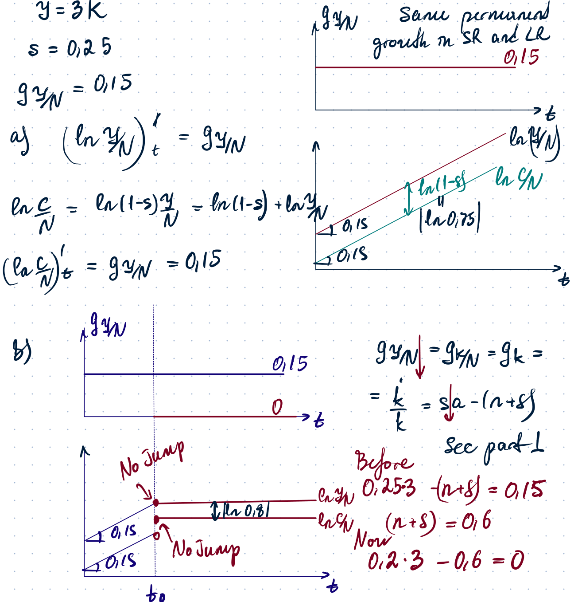

Full page image

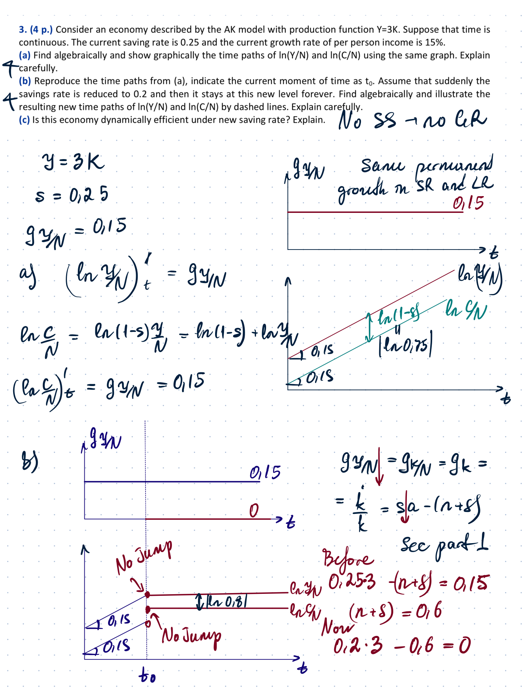

---

## Page 16 - Problem 2: Solow with government and AK-style growth models

Problem setup:

Government consumption enters as:

$$
G=aY, \qquad 0<a<1.
$$

It is financed by a proportional tax rate $\tau$ on output.

Households save and consume from disposable income:

$$
Y(1-\tau).
$$

Private saving:

$$
S_p=sY(1-\tau).
$$

Private consumption:

$$
C_p=(1-s)Y(1-\tau).
$$

The notes assume:

$$
z=1,
$$

$$
Y=F(K,AN),
$$

and population is constant:

$$
n=0.
$$

Goods-market equilibrium for investment:

$$
I=S_p=sY(1-\tau).
$$

Full page image

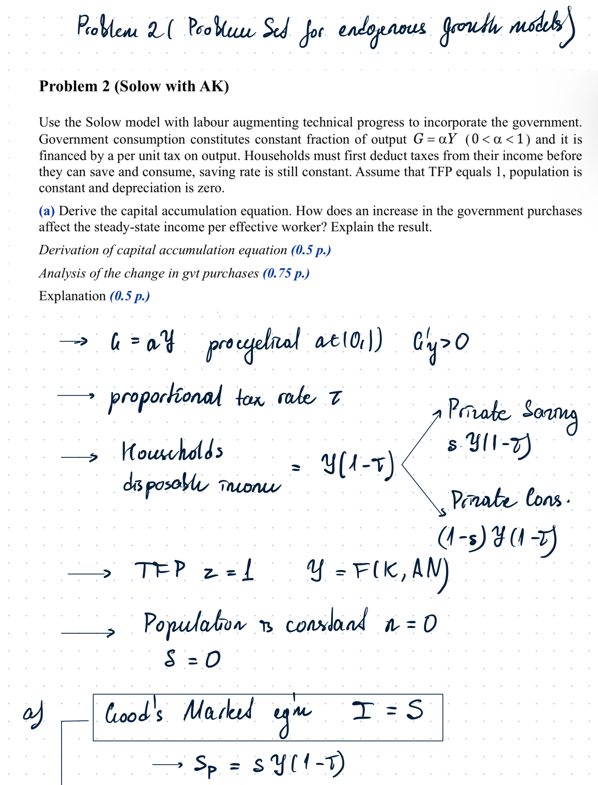

---

## Page 17 - Capital accumulation with government purchases

Balanced budget:

$$
G=\tau Y,
$$

and because:

$$
G=aY,
$$

we have:

$$
\tau=a.
$$

Capital accumulation:

$$
K_{t+1}-K_t=sY(1-\tau).
$$

With $\tau=a$:

$$
K_{t+1}-K_t=sF(K_t,A_tN_t)(1-a).
$$

In intensive form, divide by $A_tN_t$.

Using:

$$
\frac{F(K_t,A_tN_t)}{A_tN_t}=f(k_t),
$$

and:

$$
A_{t+1}=(1+g)A_t,
$$

we obtain:

$$
k_{t+1}(1+g)-k_t=s f(k_t)(1-a).
$$

Thus:

$$
k_{t+1}=\frac{s f(k_t)(1-a)+k_t}{1+g}.
$$

Subtract $k_t$:

$$
k_{t+1}-k_t=\frac{s f(k_t)(1-a)-gk_t}{1+g}.
$$

This is the capital-accumulation equation in the problem.

Full page image

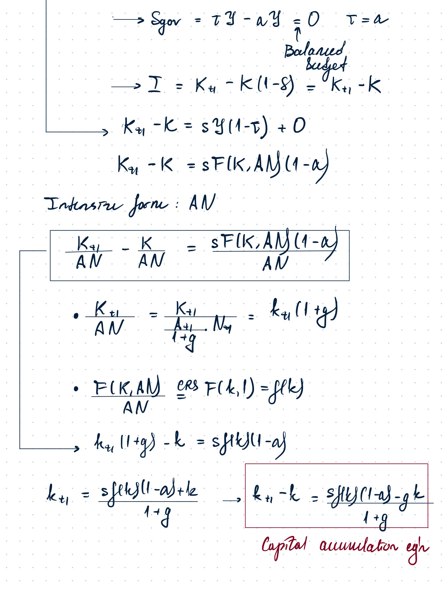

---

## Page 18 - Effect of higher government purchases

Consider an increase in government purchases:

$$
a\uparrow.
$$

Because the government budget is balanced, a higher $a$ requires a higher proportional tax rate:

$$
\tau\uparrow.
$$

Then disposable private income falls:

$$
Y(1-\tau)\downarrow.
$$

Private saving falls:

$$
S_p=sY(1-\tau)\downarrow.
$$

At the initial steady state, required investment now exceeds saving, so capital per effective worker falls:

$$
k\downarrow.
$$

Output per effective worker also falls:

$$
y=f(k)\downarrow.
$$

### Algebra

Steady-state condition:

$$
s f(k^{ss})(1-a)-gk^{ss}=0.
$$

Define:

$$
\Phi(a,k)=s f(k)(1-a)-gk=0.
$$

By the implicit function theorem:

$$
\frac{dk^{ss}}{da}
=-\frac{\partial \Phi/\partial a}{\partial \Phi/\partial k}.
$$

Now:

$$
\frac{\partial \Phi}{\partial a}=-s f(k)<0,
$$

and:

$$
\frac{\partial \Phi}{\partial k}=s(1-a)f'(k)-g<0
$$

at the stable steady state.

Therefore:

$$
\frac{dk^{ss}}{da}<0.
$$

Since:

$$
y=f(k),
$$

and $f'(k)>0$:

$$
\frac{dy}{da}=f'(k)\frac{dk^{ss}}{da}<0.
$$

So higher government purchases reduce steady-state output per effective labour.

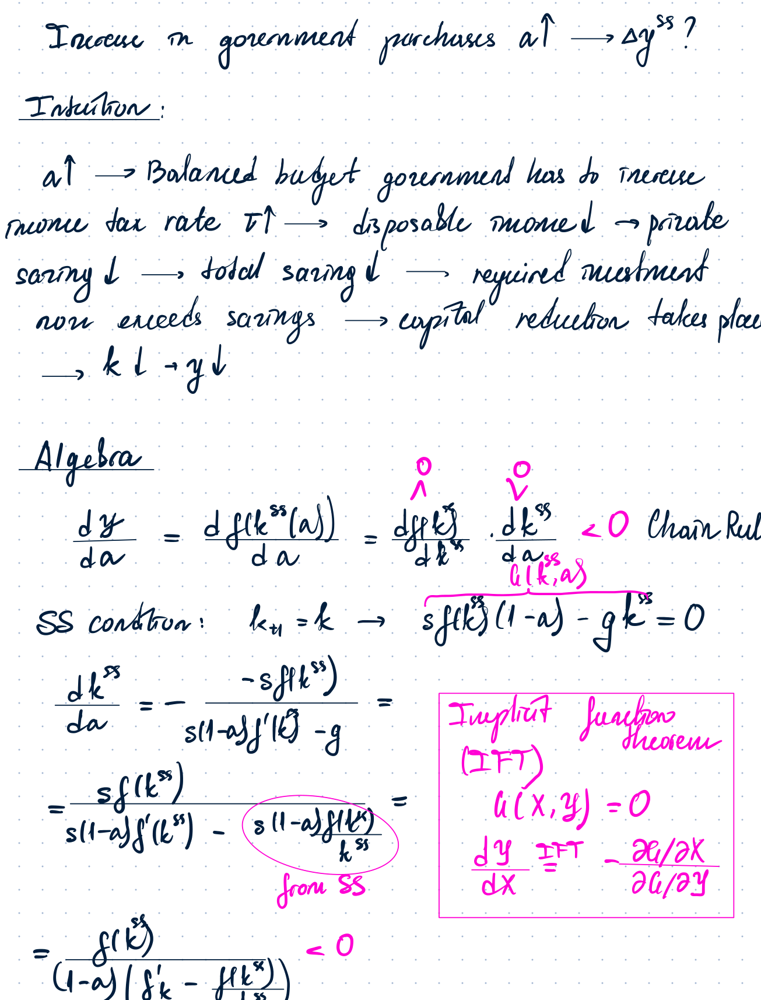

Full page image

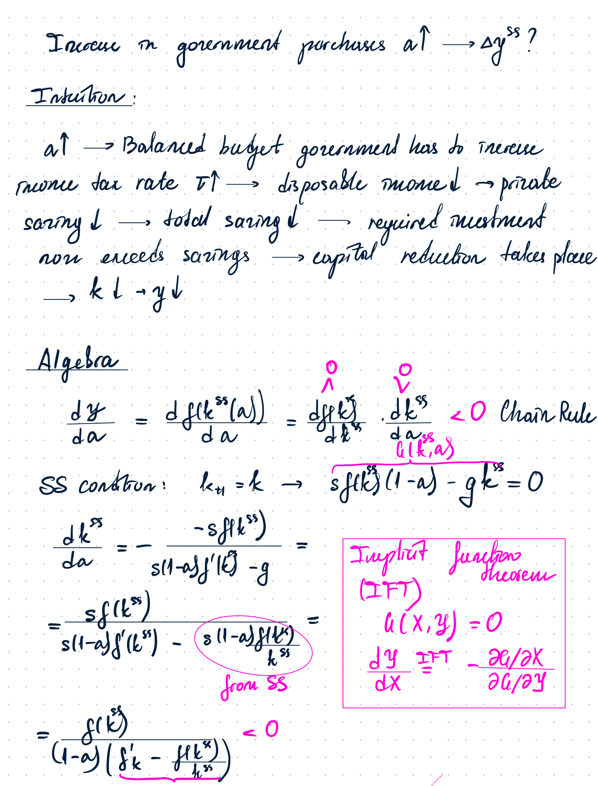

---

## Page 19 - Government and private consumption as perfect substitutes

Now suppose government and private consumption are perfect substitutes.

Total consumption per effective unit of labour is:

$$
c^{total}=c^{private}+g^{public}.
$$

Private consumption per effective labour:

$$
c^{private}=(1-s)(1-a)y.
$$

Government consumption per effective labour:

$$
g^{public}=ay.
$$

Therefore:

$$
c^{total}=ay+(1-s)(1-a)y.
$$

Simplify:

$$
c^{total}=ay+y-ay-sy+asy.
$$

Hence:

$$
c^{total}=y-sy+asy=y\left[1-s(1-a)\right].
$$

Since $y=f(k)$:

$$
c^{total}=f(k)\left[1-s(1-a)\right].
$$

Using the steady-state condition:

$$
s(1-a)f(k)=gk,
$$

we can write:

$$
c^{total}=f(k)-gk.
$$

The problem becomes:

$$
\max_a \left[f(k(a))-gk(a)\right].
$$

First-order condition:

$$
k'(a)\left[f'(k)-g\right]=0.
$$

For an interior optimum:

$$
f'(k)=g.
$$

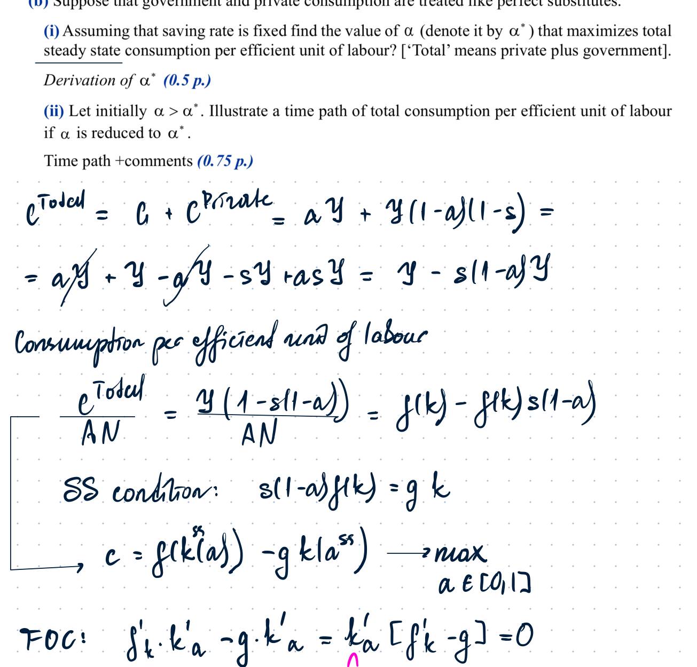

Full page image

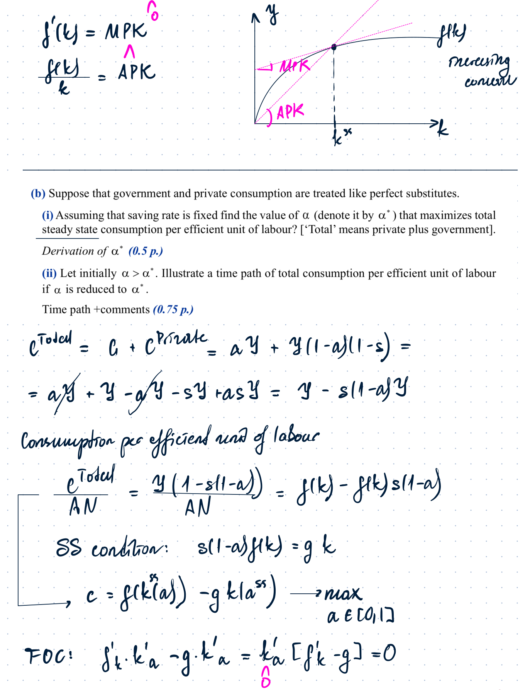

---

## Page 20 - Optimal government share $a^*$

Interior optimality condition:

$$
f'(k)=g.
$$

Using the steady-state condition:

$$
s(1-a)f(k)=gk,
$$

and substituting $g=f'(k)$:

$$
s(1-a)f(k)=f'(k)k.
$$

Therefore:

$$
1-a=\frac{f'(k)k}{s f(k)}.
$$

Thus:

$$
a^*=1-\frac{f'(k^*)k^*}{s f(k^*)}.
$$

Since:

$$
s^{GR}=\frac{f'(k^*)k^*}{f(k^*)},
$$

we can write:

$$
a^*=1-\frac{s^{GR}}{s}.
$$

However, if this expression is negative, the feasible optimum is at the boundary:

$$
a^*=0.
$$

So the final rule in the notes is:

$$
\boxed{
a^*=\begin{cases}
0, & s\le s^{GR},\\[4pt]
1-\dfrac{s^{GR}}{s}, & s\ge s^{GR}.
\end{cases}
}
$$

Interpretation:

- If private saving is already too low, the government should not reduce disposable income further: $a^*=0$.
- If private saving is sufficiently high, positive government consumption can be optimal when it moves the economy toward the Golden Rule condition.

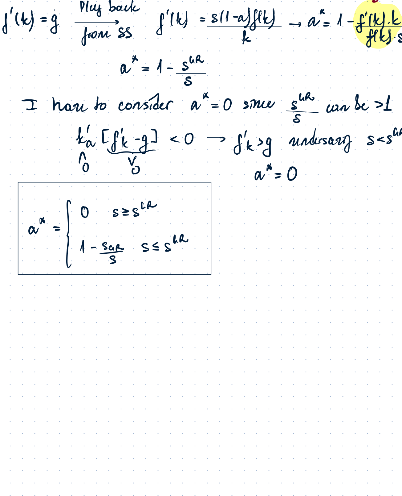

Full page image

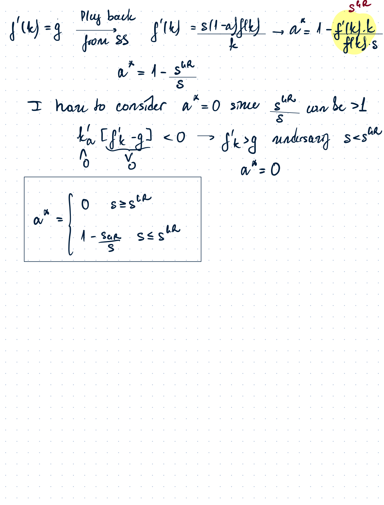

---

## Compact formula list

### Solow with labour-augmenting technology

$$
Y=F(K,AN), \qquad k=\frac{K}{AN}, \qquad y=f(k).
$$

Capital accumulation:

$$
k_{t+1}=\frac{s f(k_t)+(1-\delta)k_t}{(1+g)(1+n)}.
$$

Change in capital per effective labour:

$$
\Delta k=\frac{s f(k_t)-(n+g+gn+\delta)k_t}{(1+g)(1+n)}.
$$

Steady-state condition:

$$
s f(k^{ss})=(n+g+gn+\delta)k^{ss}.
$$

Steady-state growth rates:

$$
g_Y^{ss}=g+n+gn,
$$

$$
g_{Y/N}^{ss}=g.
$$

### Golden Rule

Consumption per effective labour:

$$
c=z f(k)-(n+\delta+g+gn)k.
$$

Golden Rule condition:

$$
z f'(k^{GR})=n+\delta+g+gn.
$$

Competitive-market form:

$$
r^{GR}=n+g+gn.
$$

Golden Rule saving rate:

$$
s^{GR}=\frac{z f'(k^{GR})k^{GR}}{z f(k^{GR})}.
$$

### Dynamic efficiency

Undersaving / dynamically efficient:

$$
r>n+g+gn \Rightarrow k^{ss}<k^{GR}.
$$

Oversaving / dynamically inefficient:

$$
r<n+g+gn \Rightarrow k^{ss}>k^{GR}.
$$

### AK model

$$
Y=aK.
$$

Aggregate output growth:

$$
g_Y=sa-\delta.
$$

Output-per-worker growth in discrete time:

$$
g_{Y/N}=\frac{sa-\delta-n}{1+n}.
$$

Approximation:

$$
g_{Y/N}\approx sa-\delta-n.
$$

---

## Original page scans

For full context, all original page scans are preserved below.

