# Week 3.2 - Consumption

This Markdown file extracts the handwritten/scanned notes into typed text, with formulas rewritten in LaTeX. Original page scans are included after each page section to preserve visual context. Graphs are inserted as images.

---

## Page 1 - Intertemporal consumption choice model

### Representative-agent setup

The model is an **intertemporal consumption choice model**. The representative agent has standard preferences, usually over two periods, although the logic can be extended to more periods.

Utility can be written as

$$
U(c_t,c_{t+1})=u(c_t)+\beta u(c_{t+1}),
$$

where:

- $c_t$ is current consumption;
- $c_{t+1}$ is future consumption;
- $\beta$ is the subjective discount factor, also interpreted as a time-preference or patience parameter.

Equivalently, using the subjective discount rate $\rho$,

$$
U(c_t,c_{t+1})=u(c_t)+\frac{1}{1+\rho}u(c_{t+1}).
$$

### Preferences

Preferences are assumed to be convex and smooth. The period utility function satisfies

$$
u'(c)>0,$$

which means non-satiation, and

$$
u''(c)<0,$$

which means diminishing marginal utility / risk aversion.

Consumption in both periods is treated as a normal good:

$$
c_t, c_{t+1} \text{ are normal goods.}
$$

The marginal rate of substitution is diminishing.

### Source page scan

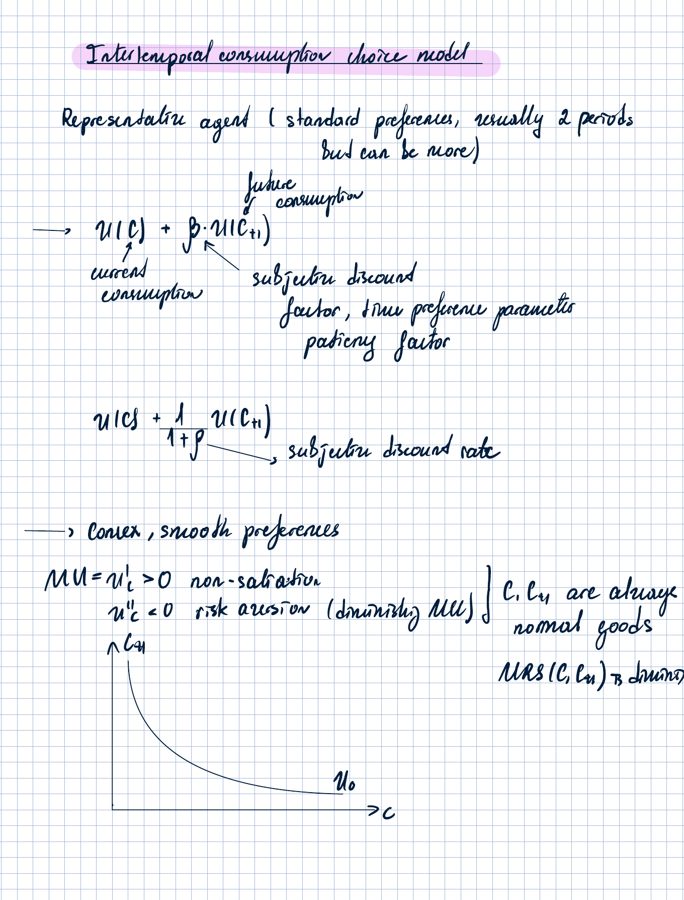

---

## Page 2 - Budget constraints and lifetime wealth

### Period-by-period budget constraints

At time $t$:

$$
c_t=A+y_t^D-B,
$$

where:

- $A$ is initial wealth;
- $y_t^D$ is current disposable income;
- $B$ denotes bond holdings / lending. A negative $B$ corresponds to borrowing.

At time $t+1$:

$$
c_{t+1}=y_{t+1}^D+B(1+r).
$$

Hence

$$
B=\frac{c_{t+1}-y_{t+1}^D}{1+r}.
$$

Substitute this into the current-period budget constraint:

$$
c_t=A+y_t^D-\frac{c_{t+1}-y_{t+1}^D}{1+r}.
$$

Therefore the intertemporal budget constraint is

$$
c_t+\frac{c_{t+1}}{1+r}=A+y_t^D+\frac{y_{t+1}^D}{1+r}.
$$

The left-hand side is **lifetime consumption**, and the right-hand side is **lifetime wealth**:

$$
W=A+y_t^D+\frac{y_{t+1}^D}{1+r}.
$$

The slope of the budget line in the $(c_t,c_{t+1})$ space is

$$
-\frac{dc_{t+1}}{dc_t}=1+r.
$$

The endowment point is

$$
E=\left(A+y_t^D,\; y_{t+1}^D\right).
$$

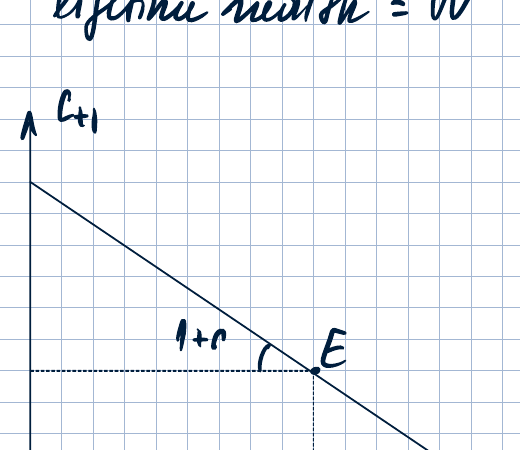

### Household optimization problem

The representative household solves

$$
\max_{c_t,c_{t+1}\ge 0}\; u(c_t)+\frac{1}{1+\rho}u(c_{t+1})
$$

subject to

$$
c_t+\frac{c_{t+1}}{1+r}=A+y_t^D+\frac{y_{t+1}^D}{1+r}.
$$

### Source page scan

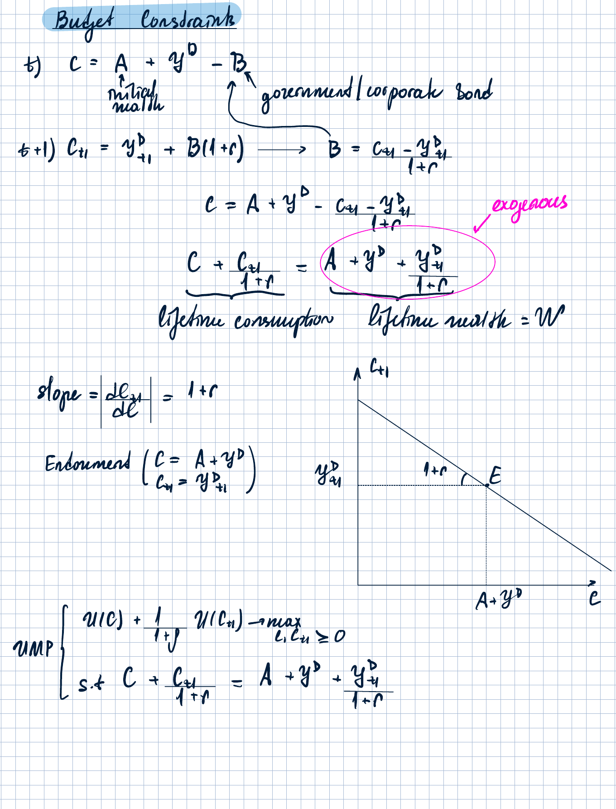

---

## Page 3 - Optimum, Euler equation, and perfect smoothing

### Optimality conditions

The optimum is characterized by the Euler equation and the intertemporal budget constraint:

$$
\frac{u'(c_t)(1+\rho)}{u'(c_{t+1})}=1+r,
$$

and

$$
c_t+\frac{c_{t+1}}{1+r}=A+y_t^D+\frac{y_{t+1}^D}{1+r}.
$$

The graph illustrates a **net lender** case: the chosen current consumption is below the current-period endowment, so the household lends part of current resources.

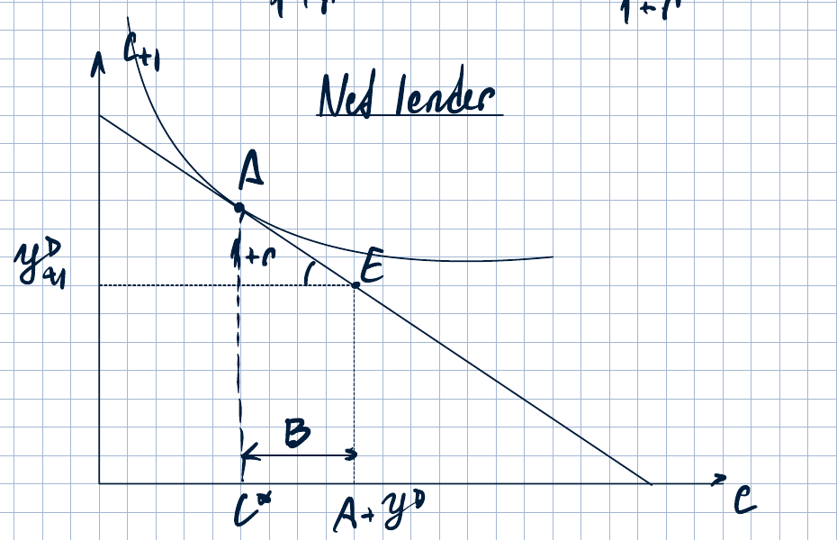

### Permanent Income Hypothesis / Life-Cycle Theory

Assume

$$
\rho=r.
$$

Then the Euler equation becomes

$$
u'(c_t)=u'(c_{t+1}).$$

Because $u$ is strictly concave, this implies perfect consumption smoothing:

$$
c_t=c_{t+1}=c^*.
$$

Substitute this into the lifetime budget constraint:

$$
c^*+\frac{c^*}{1+r}=A+y_t^D+\frac{y_{t+1}^D}{1+r}.
$$

Hence

$$
c^*=\left(A+y_t^D+\frac{y_{t+1}^D}{1+r}\right)\frac{1+r}{2+r}.
$$

### Source page scan

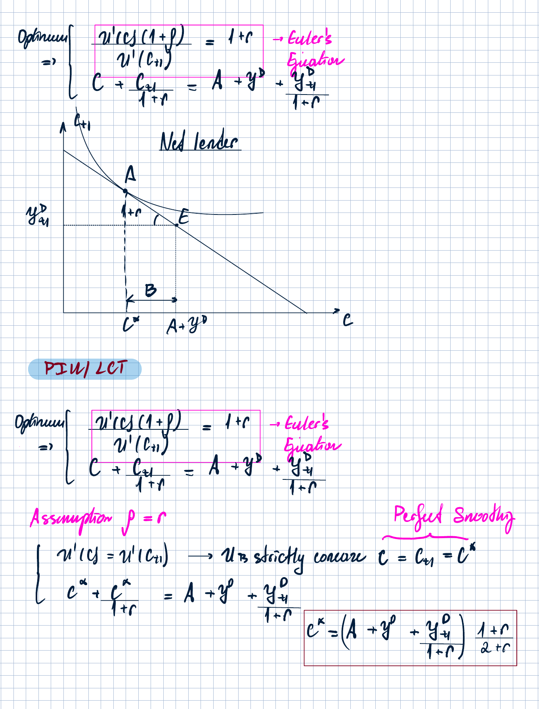

---

## Page 4 - Different taxes

### Lump-sum taxes

With lump-sum taxes, the budget constraint is

$$
c_t+\frac{c_{t+1}}{1+r}=y_t-t_t+\frac{y_{t+1}-t_{t+1}}{1+r}.
$$

The endowment point is

$$
E=\left(y_t-t_t,\; y_{t+1}-t_{t+1}\right).
$$

The slope of the budget line is

$$
1+r.
$$

### Proportional consumption tax

With proportional consumption taxes $\tau_t$ and $\tau_{t+1}$,

$$
c_t(1+\tau_t)+\frac{c_{t+1}(1+\tau_{t+1})}{1+r}=y_t+\frac{y_{t+1}}{1+r}.
$$

The endowment point is written as

$$
E=\left(\frac{y_t}{1+\tau_t},\;\frac{y_{t+1}}{1+\tau_{t+1}}\right).
$$

The absolute slope is

$$
\frac{(1+r)(1+\tau_t)}{1+\tau_{t+1}}.
$$

### Saving tax

At time $t$:

$$
c_t=y_t-B.
$$

At time $t+1$:

$$
c_{t+1}=y_{t+1}+B(1-\tau)(1+r).
$$

Therefore

$$
B=\frac{c_{t+1}-y_{t+1}}{(1+r)(1-\tau)}.
$$

The lifetime budget constraint becomes

$$
c_t+\frac{c_{t+1}}{(1+r)(1-\tau)}=y_t+\frac{y_{t+1}}{(1+r)(1-\tau)}.
$$

The endowment point is

$$
E=(y_t,y_{t+1}).
$$

The absolute slope is

$$
(1+r)(1-\tau).
$$

### Source page scan

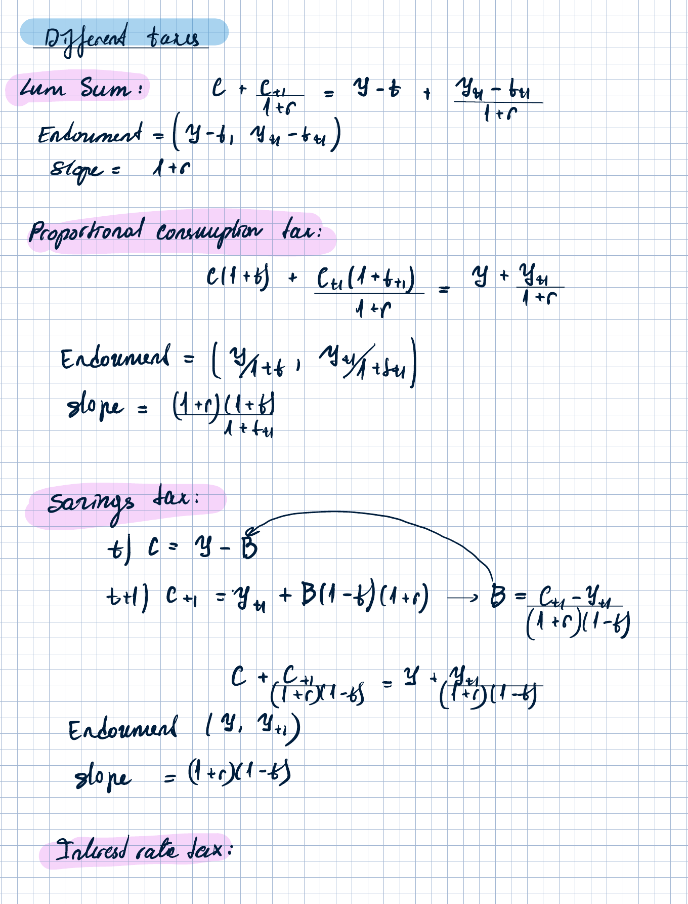

---

## Page 5 - Interest-rate tax and Problem 2 statement

### Interest-rate tax

At time $t$:

$$
c_t=y_t-B.
$$

At time $t+1$:

$$
c_{t+1}=y_{t+1}+B+Br(1-\tau).
$$

Equivalently,

$$
c_{t+1}=y_{t+1}+B\left[1+r(1-\tau)\right].
$$

Therefore

$$
B=\frac{c_{t+1}-y_{t+1}}{1+r(1-\tau)}.
$$

The intertemporal budget constraint becomes

$$
c_t+\frac{c_{t+1}}{1+r(1-\tau)}=y_t+\frac{y_{t+1}}{1+r(1-\tau)}.
$$

The endowment point is

$$
E=(y_t,y_{t+1}).
$$

The absolute slope is

$$
1+r(1-\tau).
$$

### Problem 2 - Consumption choice with exogenous income shock

**Problem statement.** Consider a two-period model of consumption choice with exogenous incomes. Assume no government in this economy. Suppose the household is subject to a temporary negative current-period income shock. Assume the interest rate is fixed.

**(a)** How does the size of the change in current-period consumption compare to the change in current-period income? Illustrate by graph and show algebraically.

**(b)** Now assume that consumption is a durable good. Purchases of new durables in the current and future time periods are denoted by $z_t$ and $z_{t+1}$. Negative $z$ means selling previously purchased durables. Durables depreciate at $\delta$, where $0<\delta<1$, and the household begins the current period with zero stock of durable goods. The variables $c_t$ and $c_{t+1}$ denote the benefits the household derives from using durable goods, not new purchases of these goods:

$$
c_t=z_t,
$$

$$
c_{t+1}=(1-\delta)c_t+z_{t+1}.
$$

Assume

$$
c_t\ge 0, \qquad c_{t+1}\ge 0.
$$

**(i)** Write down the current-period budget constraint and the future-period budget constraint. Derive the intertemporal budget constraint linking $z_t$ and $z_{t+1}$ in terms of future values. Then proceed to the intertemporal constraint in terms of consumption.

**(ii)** Find the point of intersection of the intertemporal constraint derived above with the $c_t$ axis. Compare the corresponding value of $c_t$ with the present value of agent incomes and carefully explain the result. Find the implied value of current-period savings.

**(iii)** Suppose this household faces a temporary negative current-period income shock. Find algebraically its initial endowment before the shock, denoted by $E$, and illustrate the initial budget line by blue colour. Find algebraically the change in the initial endowment, denote the new endowment by $E^{new}$, and illustrate the new budget line on the same graph by black colour.

**(iv)** Reproduce the graph from (iii) and demonstrate an example where consumption is more volatile than income. Explain the reason intuitively.

### Source page scan

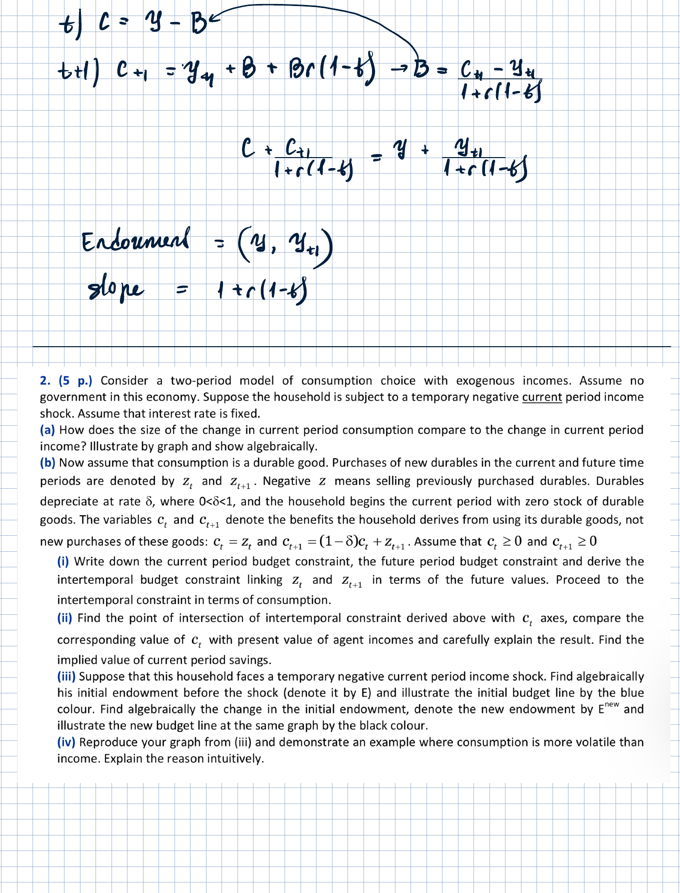

---

## Page 6 - Problem 2 solution notes

### Part (a): temporary current-income shock

The shock is temporary:

$$
\Delta y_t<0, \qquad \Delta y_{t+1}=0.
$$

With consumption smoothing, current consumption changes by less than current income:

$$
|\Delta c_t|<|\Delta y_t|.
$$

Equivalently, the marginal propensity to consume out of a temporary income shock is below one:

$$
0<\frac{\Delta c_t}{\Delta y_t}<1.
$$

Under the simplifying assumption $\rho=r$ and no initial wealth,

$$
c^*=\left(y_t+\frac{y_{t+1}}{1+r}\right)\frac{1+r}{2+r}.
$$

Therefore

$$
\Delta c^*=\Delta y_t\frac{1+r}{2+r},
$$

and

$$
\frac{\Delta c^*}{\Delta y_t}=\frac{1+r}{2+r}<1.
$$

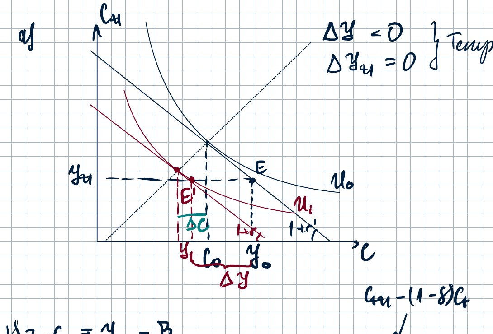

### Part (b): durable consumption good

The durable purchase variables satisfy

$$
c_t=z_t,
$$

and

$$
c_{t+1}=(1-\delta)c_t+z_{t+1}.
$$

The period budget constraints are

$$
z_t=y_t-B,
$$

and

$$
z_{t+1}=y_{t+1}+B(1+r).
$$

Combining the two gives the intertemporal constraint in terms of durable purchases:

$$
z_t+\frac{z_{t+1}}{1+r}=y_t+\frac{y_{t+1}}{1+r}.
$$

Using $z_t=c_t$ and $z_{t+1}=c_{t+1}-(1-\delta)c_t$ gives

$$
c_t+\frac{c_{t+1}-(1-\delta)c_t}{1+r}=y_t+\frac{y_{t+1}}{1+r}.
$$

Collecting terms:

$$
\frac{r+\delta}{1+r}c_t+\frac{c_{t+1}}{1+r}=y_t+\frac{y_{t+1}}{1+r}.
$$

Equivalently,

$$
(r+\delta)c_t+c_{t+1}=(1+r)y_t+y_{t+1}.
$$

The absolute slope of the durable-consumption budget line is

$$
r+\delta.
$$

The $c_t$-axis intercept is found by setting $c_{t+1}=0$:

$$
c_t^{\max}=\frac{(1+r)y_t+y_{t+1}}{r+\delta}.
$$

The $c_{t+1}$-axis intercept is found by setting $c_t=0$:

$$
c_{t+1}^{\max}=(1+r)y_t+y_{t+1}.
$$

The graph illustrates that durable consumption can move more than the income shock:

$$
|\Delta c_t|>|\Delta y_t|.
$$

Intuition: because the durable good provides services over time, the household adjusts the stock of durables, not only current purchases. A small current-income shock can therefore induce a large adjustment in the current durable stock/service flow.

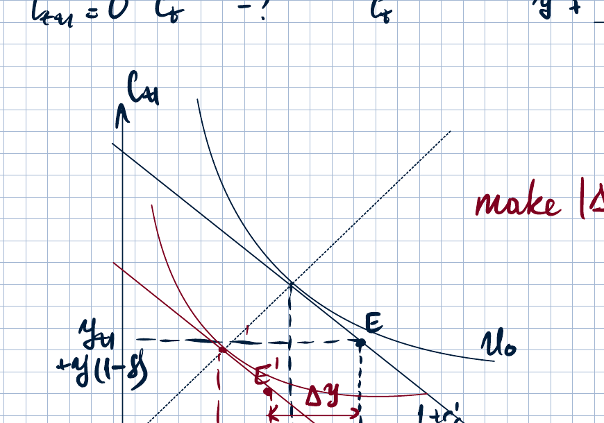

### Source page scan

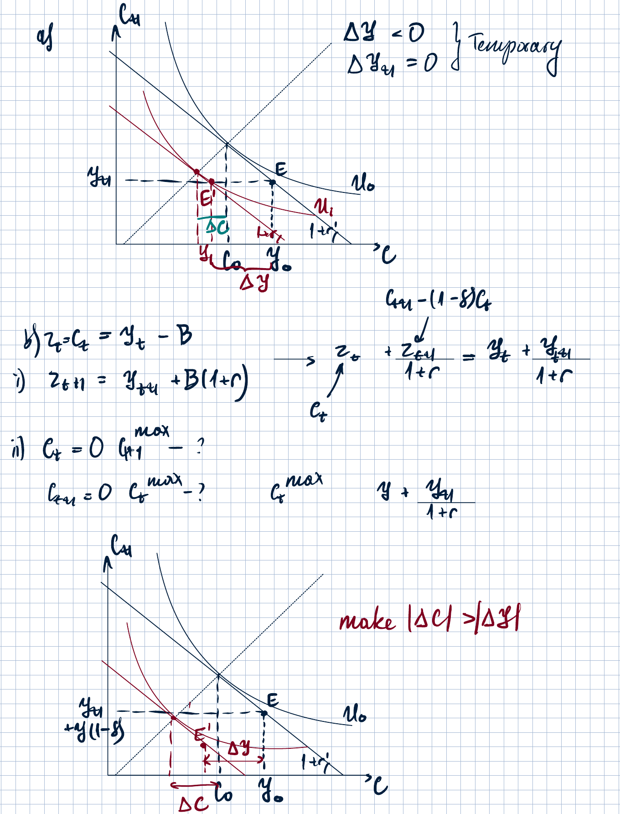

---

## Page 7 - Problem 3: international technology transfer

### Problem statement

Consider the international technology-transfer model with two economies discussed in the lecture. Economy 1 is the innovating economy and economy 2 is the imitating economy. Due to migration, the population of the innovating economy permanently increases, while the population of the imitating economy stays unchanged.

Provide a time chart for $\ln y_1$ and $\ln y_2$ on the same graph, assuming the production functions

$$
Y_i=\sqrt{A_i u_i N_i}
$$

for country $i$. Explain carefully the time paths.

### Growth-rate logic

The shock is

$$
N_1\uparrow, \qquad \Delta N_2=0.
$$

The growth rate of the innovating economy's technology is

$$
g_1=\frac{(1-u_1)N_1}{\mu_1}.
$$

For the imitating economy,

$$
g_2=\frac{(1-u_2)N_2}{c(a)},
$$

where

$$
a=\frac{A_1}{A_2}
$$

is the knowledge gap. A larger knowledge gap makes imitation easier, so $g_2$ rises when $a$ rises.

After $N_1$ increases, $g_1$ rises immediately. The steady-state equality between growth rates requires a larger knowledge gap:

$$
g_1^{new}=g_2(a^{new}), \qquad a^{new}>a^*.
$$

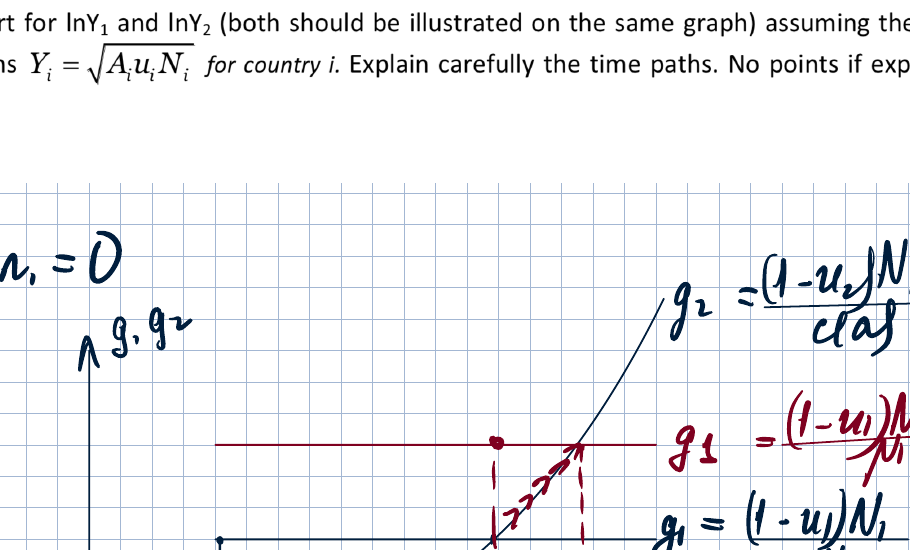

### Source page scan

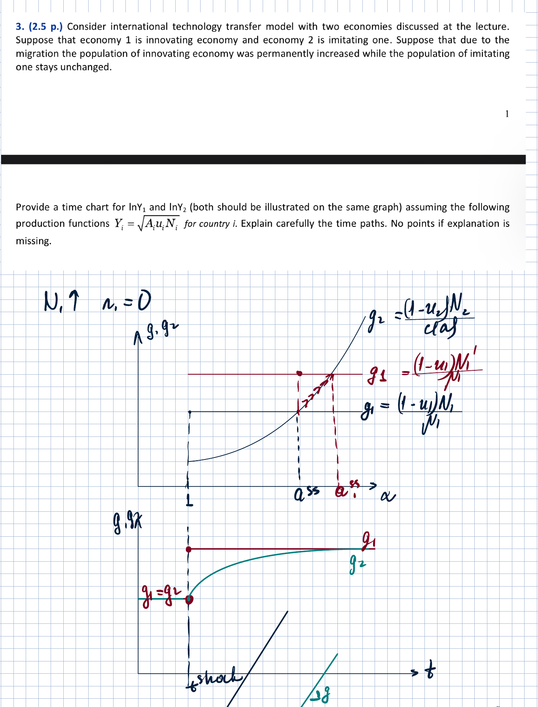

---

## Page 8 - Time paths for $\ln y_1$, $\ln y_2$ and Problem 1 setup

### Time paths in the technology-transfer model

Given

$$
Y_i=\sqrt{A_i u_i N_i},
$$

output per capita is

$$
y_i=\frac{Y_i}{N_i}=\sqrt{\frac{A_i u_i}{N_i}}.
$$

Taking logs gives

$$
\ln y_i=\frac{1}{2}\ln A_i+\frac{1}{2}\ln u_i-\frac{1}{2}\ln N_i.
$$

Since $N_1$ increases once and permanently, $\ln y_1$ jumps down immediately by

$$
-\frac{1}{2}\Delta \ln N_1,
$$

but then grows faster because $g_1$ is now higher:

$$
\frac{d\ln y_1}{dt}=\frac{1}{2}g_1^{new}.
$$

For country 2, $N_2$ is unchanged, so there is no immediate jump in $\ln y_2$. However, the larger knowledge gap makes imitation easier, so $g_2$ rises gradually until it equals the new growth rate of country 1. Hence the slope of $\ln y_2$ gradually rises and eventually reaches

$$
\frac{1}{2}g_1^{new}.
$$

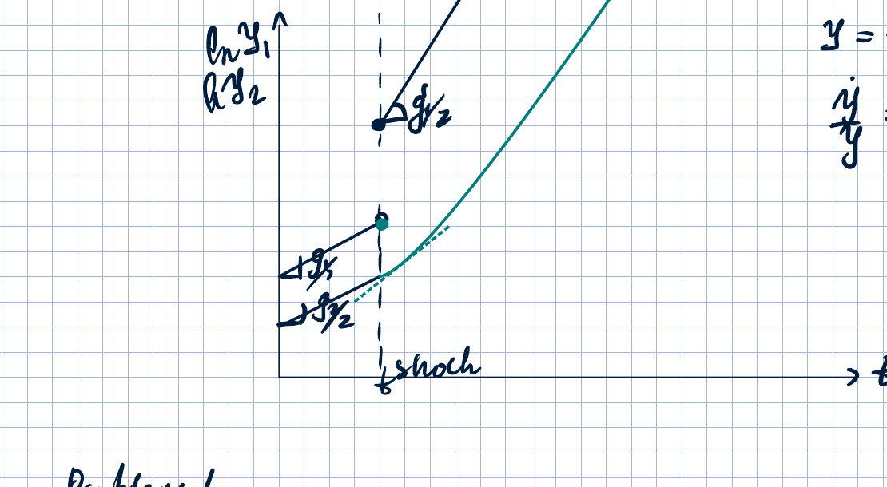

### Problem 1 - Two-period general equilibrium model

**Problem statement.** Consider a two-period general-equilibrium model with fixed incomes discussed in the lecture. Keep the notation introduced in the lecture but re-derive the results. Suppose that current-period government purchases are reduced while future policy stays the same. Analyze the impact on the resulting equilibrium and illustrate by graph.

### Notes copied from lecture setup

The model is based on intertemporal consumption choice.

Incomes are exogenous:

$$
y_t, y_{t+1} \text{ are exogenous.}
$$

The interest rate $r$ is endogenous.

Goods-market equilibrium can be written as

$$
c(r^{eq})+g=y.
$$

Equivalently,

$$
c(r^{eq})=y-g.
$$

With a balanced budget,

$$
g=T.
$$

Therefore

$$
c(r^{eq})=y-T=y^D.
$$

In aggregate equilibrium, savings are zero.

### Shock logic

A reduction in current government purchases implies

$$
g_t\downarrow.
$$

With a balanced budget,

$$
T_t\downarrow,
$$

so current disposable income rises:

$$
y_t^D\uparrow.
$$

Because consumption is a normal good, the wealth effect raises desired consumption in both periods:

$$
c_t^d\uparrow, \qquad c_{t+1}^d\uparrow.
$$

However, the increase in desired current consumption is smaller than the increase in current disposable income:

$$
|\Delta c_t^d|<|\Delta y_t^D|.
$$

Thus desired savings rise:

$$
S^d\uparrow.
$$

This increases the demand for bonds:

$$
D_B\uparrow.
$$

Therefore bond prices rise and the interest rate falls:

$$
P_B\uparrow \quad \Rightarrow \quad r\downarrow.
$$

The substitution effect of a lower interest rate makes current consumption relatively cheaper:

$$
c_t\uparrow, \qquad c_{t+1}\downarrow.
$$

### Source page scan

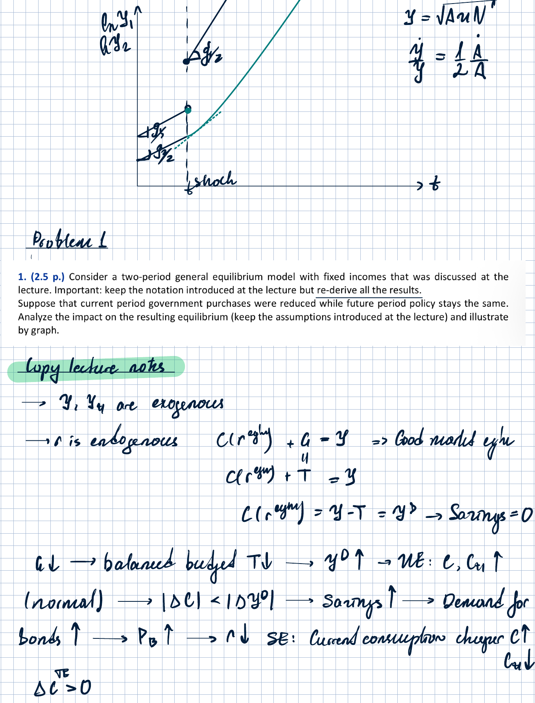

---

## Page 9 - General-equilibrium graph and final effects

The final graph shows the equilibrium movement from $E$ to $E'$ after current government purchases fall.

Because future policy is unchanged, future disposable income and future consumption remain unchanged:

$$
\Delta c_{t+1}^{TE}=0.
$$

Hence

$$
c_{t+1}=\bar c_{t+1}=y_{t+1}-\tau_{t+1}.
$$

Current consumption increases:

$$
\Delta c_t>0.
$$

The interest rate falls:

$$
r'<r_0.
$$

The final effects are

$$
\Delta g_t<0, \qquad \Delta T_t<0,
$$

$$
\Delta y_t^D>0,
$$

$$
\Delta c_t>0, \qquad \Delta c_{t+1}=0,
$$

$$
\Delta r<0.
$$

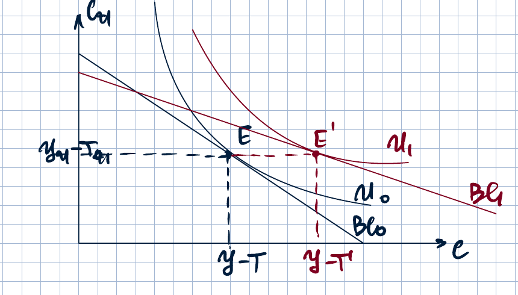

### Source page scan

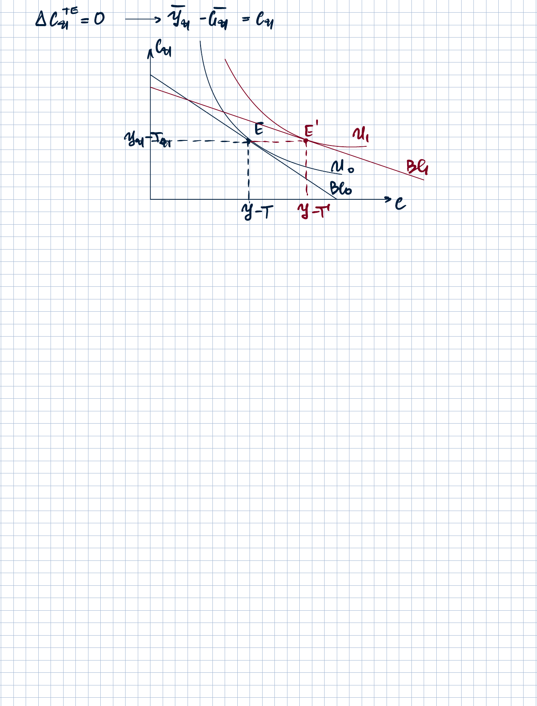
