# Week 3.3 - Macro 2 Problem Solving 1: Endogenous Growth and Consumption

This Markdown file extracts the handwritten and printed content from the PDF while preserving graph context with page scans and graph crops. Mathematical expressions are rewritten in LaTeX.

---

## Problem set: Solow with endogenous growth

### Problem 3: Solow with Learning by Doing

Consider an economy with production function

$$
Y = K^{0.5}(AN)^{0.5},
$$

where $A$ stands for the level of technological progress. Suppose it has:

$$
s=0.2, \qquad n=0.02, \qquad \delta=0.1, \qquad g=0.08.
$$

Assume that all markets are perfectly competitive. Use linear approximation for required investment to simplify the calculations.

**Tasks:**

(a) Suppose the economy operates along its balanced growth path. Find per-capita income and decompose it into labour income, capital income, economic profit, and depreciation. Points are given for decomposition only.

(b) Should you increase, decrease, or keep unchanged the rate of savings to attain the maximum possible steady-state level of consumption per efficient worker? Do not calculate the exact point of maximum at this part; prove every claim.

(c) Determine what saving rate $s^{GR}$ would yield the Golden Rule level of capital in this model. Would setting $s=s^{GR}$ be a Pareto improvement?

(d) Suppose technical progress is not exogenous but a by-product of capital accumulation, so that

$$
A = 0.25 \frac{K}{N}.
$$

Suppose that $s=s^{GR}$ from part (c). Find the current and the long-run growth rates of capital per worker and output per worker.

(e) Reconsider part (d). Suppose that a one-shot exogenous 20% increase in total factor productivity takes place. Analyze algebraically its immediate and long-run impact on average productivity of capital $(Y/K)$ and illustrate the transition time chart with comments.

**General notes from the page:**

- All markets are perfectly competitive:

$$
w = MPN, \qquad r+\delta = MPK.
$$

- Required investment with a linear approximation:

$$
(n+\delta+g+ng)k \approx (n+\delta+g)k.
$$

- In the Solow model, a steady state exhibits a balanced growth path.

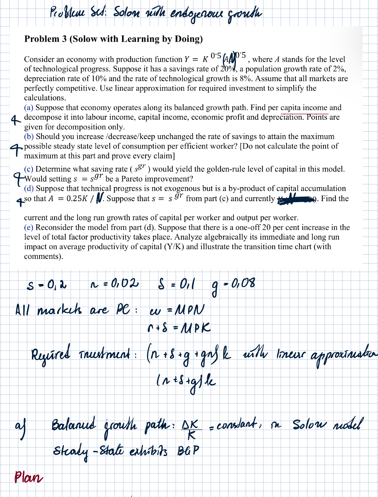

---

## Solution to Problem 3

### Part (a): Balanced growth path and income decomposition

**Plan from notes:**

1. Write down the steady-state condition.
2. Find $k^{ss}$ and $y^{ss}$.
3. Use Euler's formula for decomposition.

The intensive-form production function is

$$
f(k)=\frac{Y}{AN}=k^{0.5}.
$$

The steady-state condition is

$$
sf(k)=(n+\delta+g)k.
$$

Substitute parameters:

$$
0.2k^{0.5}=(0.02+0.08+0.1)k=0.2k.
$$

Therefore,

$$
k^{0.5}=1 \quad \Rightarrow \quad k^{ss}=1.
$$

Output per efficient unit of labour is

$$
y^{ss}=f(k^{ss})=1.
$$

Per-capita output is

$$
\frac{Y}{N}=Ay^{ss}=A.
$$

Since $Y=F(K,AN)$ is homogeneous of degree 1, Euler's theorem gives

$$
F_KK + F_NN = Y.
$$

Under perfect competition:

$$
MPK \cdot K + MPN \cdot N = Y.
$$

Since

$$
r=MPK-\delta,
$$

we can write total income as

$$
rK+\delta K+wN=Y.
$$

In per-capita terms:

$$
rk+\delta k+w=\frac{Y}{N}.
$$

Compute the components:

$$
MPK=\frac{1}{2}K^{-0.5}(AN)^{0.5}=\frac{0.5}{\sqrt{k}}=0.5,
$$

so

$$
r=MPK-\delta=0.5-0.1=0.4.
$$

Capital income per capita:

$$
r\frac{K}{N}=rkA=0.4A.
$$

Depreciation per capita:

$$
\delta \frac{K}{N}=\delta kA=0.1A.
$$

Labour income per capita:

$$
w=MPN=0.5A.
$$

Thus:

$$
\frac{Y}{N}=A=0.4A+0.1A+0.5A.
$$

| Component | Per-capita value |
|---|---:|
| Capital income | $0.4A$ |
| Depreciation | $0.1A$ |
| Labour income | $0.5A$ |
| Economic profit | $0$ |
| Total income per capita | $A$ |

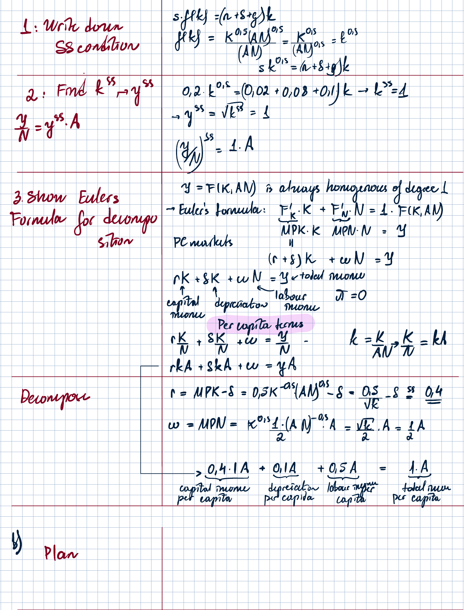

---

### Part (b): Should the saving rate change?

**Plan from notes:**

1. Check the Golden Rule condition.
2. Determine whether the economy undersaves or oversaves.
3. Propose the policy.

The Golden Rule condition is

$$
f'(k^{GR}) = n+\delta+g.
$$

At the current steady state, $k^{ss}=1$, so

$$
f'(k^{ss})=\frac{1}{2\sqrt{k^{ss}}}=0.5.
$$

The required return is

$$
n+\delta+g=0.02+0.1+0.08=0.2.
$$

Hence

$$
f'(k^{ss}) > n+\delta+g.
$$

The economy is not at the Golden Rule. Since $MPK$ is diminishing, this means

$$
k^{ss}<k^{GR}.
$$

So the current steady-state capital stock is too low. The economy undersaves.

Therefore, the saving rate should be **increased**.

---

### Part (c): Golden Rule saving rate and Pareto improvement

**Plan from notes:**

1. Express consumption per efficient labour as a function of $s$.
2. Set up the maximization problem and find the FOC.
3. Analyze the immediate and long-run effects of switching to $s^{GR}$.

From the steady-state condition:

$$
s\sqrt{k}=0.2k.
$$

If $k>0$, then

$$
\sqrt{k}=5s.
$$

Therefore,

$$
f(k^{ss})=\sqrt{k^{ss}}=5s.
$$

Consumption per efficient labour is

$$
c=(1-s)f(k^{ss})=(1-s)5s.
$$

Maximize:

$$
\max_{s\in[0,1]} 5s(1-s).
$$

FOC:

$$
5(1-2s)=0.
$$

Thus

$$
s^{GR}=\frac{1}{2}.
$$

Since the current saving rate is $s=0.2$, moving to the Golden Rule requires

$$
s \uparrow.
$$

Immediate effect after the increase in $s$:

$$
c^{SR}=(1-s)f(k),
$$

but $k$ has not accumulated yet, so current consumption falls. Hence current generations are worse off.

Long-run effect: new saving per efficient labour exceeds required investment, so capital accumulation takes place. Then $k\uparrow$, $y\uparrow$, and long-run consumption rises until the economy converges to the Golden Rule.

Future generations are better off.

Conclusion:

$$
\text{No Pareto improvement.}
$$

The economy is dynamically efficient: reaching the Golden Rule helps future generations but harms current generations.

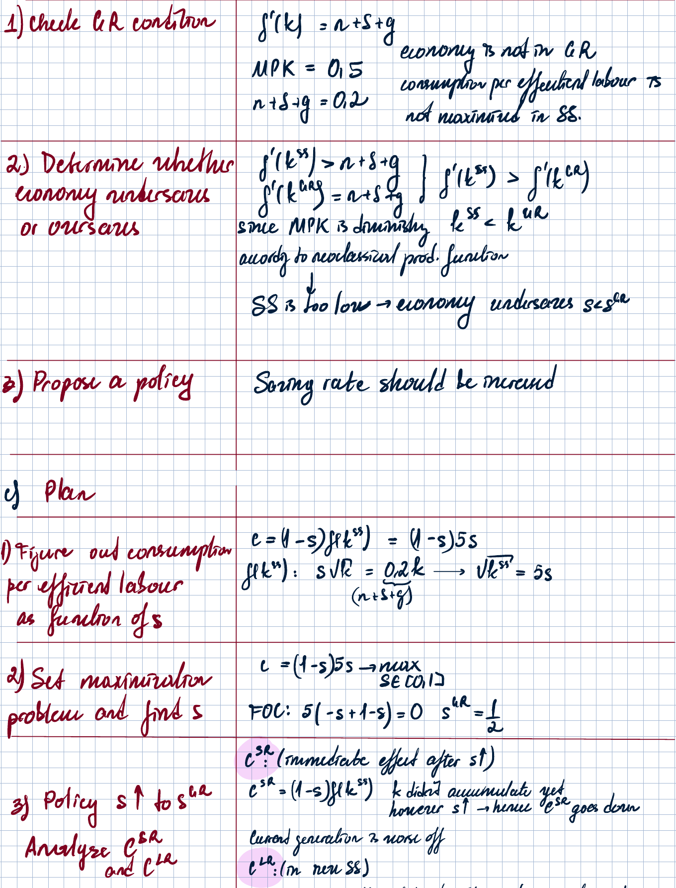

---

### Part (d): Learning-by-doing case

Now technological progress is generated by capital accumulation:

$$
A=0.25\frac{K}{N}.
$$

Plug this into the production function:

$$
Y=K^{0.5}(AN)^{0.5}
=K^{0.5}\left(0.25\frac{K}{N}N\right)^{0.5}
=K^{0.5}(0.25K)^{0.5}
=0.5K.
$$

Thus output per worker is

$$
y=\frac{Y}{N}=0.5k.
$$

Goods market equation:

$$
K_{t+1}-K_t(1-\delta)=s\cdot 0.5K_t.
$$

Divide by $N_t$:

$$
\frac{K_{t+1}}{N_t}-\frac{K_t(1-\delta)}{N_t}=s\cdot 0.5k_t.
$$

Use

$$
\frac{K_{t+1}}{N_t}=k_{t+1}(1+n).
$$

Then

$$
k_{t+1}(1+n)-k_t(1-\delta)=s\cdot 0.5k_t.
$$

So

$$
k_{t+1}=\frac{s\cdot0.5k_t+k_t(1-\delta)}{1+n}.
$$

The growth rate of capital per worker is

$$
g_k=\frac{k_{t+1}-k_t}{k_t}
=\frac{s\cdot0.5-(n+\delta)}{1+n}.
$$

Since $s=s^{GR}=0.5$,

$$
g_k=\frac{0.5\cdot0.5-(0.02+0.1)}{1.02}
=\frac{0.25-0.12}{1.02}
\approx 0.127.
$$

Therefore,

$$
g_k\approx 12.7\%.
$$

Since

$$
y=0.5k,
$$

output per worker grows at the same rate:

$$
g_y=g_k\approx 12.7\%.
$$

This is the same both in the short run and in the long run, because if the learning-by-doing effect is large enough, the economy exhibits permanent constant growth.

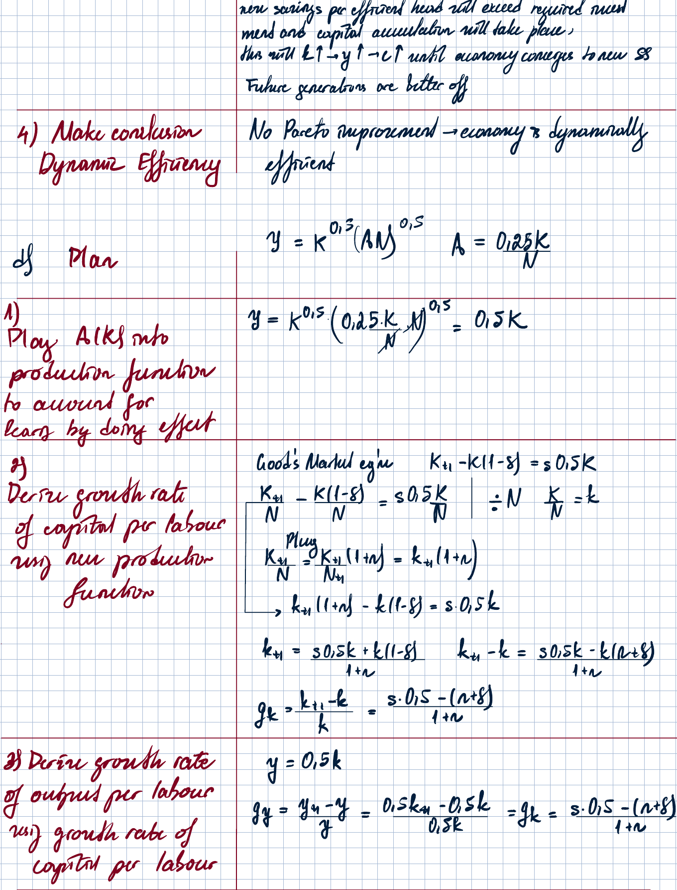

---

### Part (e): One-shot 20% increase in TFP

Before the shock:

$$
y=0.5k,
$$

so average productivity of capital is

$$
APK=\frac{Y}{K}=0.5.
$$

After a one-shot 20% increase in TFP:

$$
APK^{new}=1.2\cdot0.5=0.6.
$$

Thus, after the shock:

$$
y=0.6k.
$$

The transition path for $APK$ is a one-time upward jump:

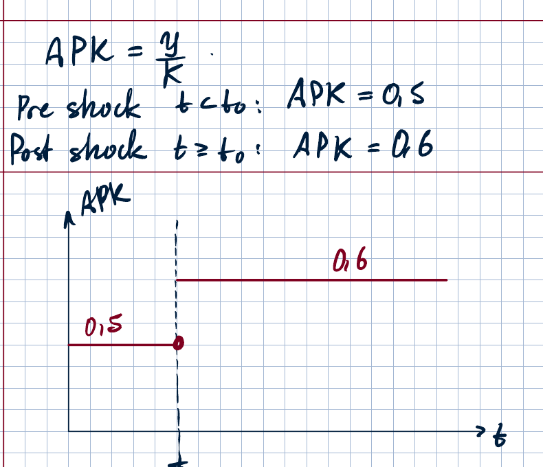

The notes' interpretation:

- Pre-shock, at $t<t_0$:

$$
APK=0.5.
$$

- Post-shock, at $t\geq t_0$:

$$
APK=0.6.
$$

If the learning-by-doing effect is strong enough, the final production function still gives constant returns to capital. Return to capital is always the same, both in the short run and in the long run. Hence

$$
g_y=g_k,
$$

and

$$
\frac{Y}{K}=\text{constant after the one-time jump.}
$$

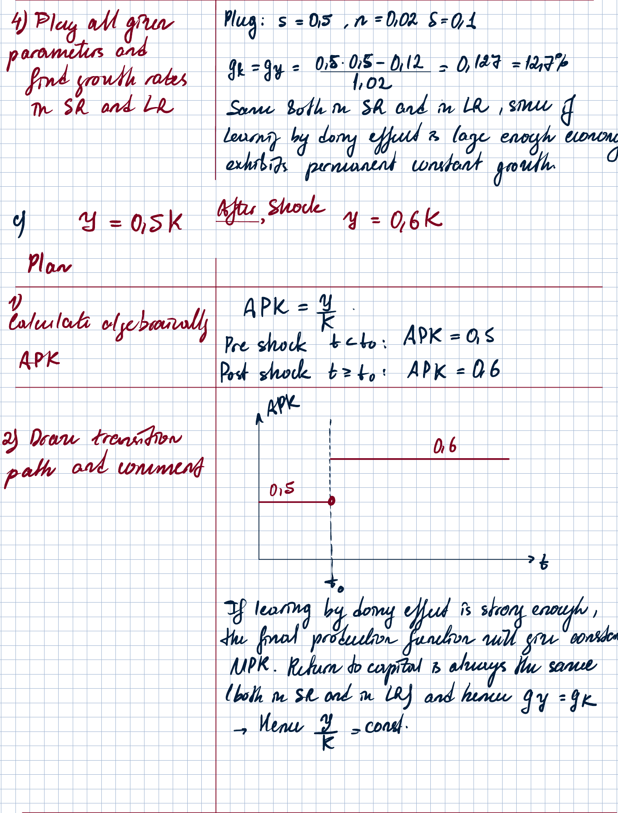

---

## Consumption

### Problem 5

Consider an economy which lasts for two periods and is made up of two generations. The parent generation lives only in period 1 and gets income $Y_1$, and the child generation lives only in period 2 and gets income $Y_2$.

A household is composed of one parent and one child and has utility function

$$
\beta U(C_1)+U(C_2), \qquad \beta>1,
$$

where

$$
U'(C)>0, \qquad U''(C)<0
$$

for every $C$.

The parent may decide to leave a bequest $B$, positive or negative. This bequest is fully invested in government bonds that pay interest rate $r$. There is also a government, which lives in both periods. The government can impose lump-sum taxes $T_1$ and $T_2$ to finance government purchases $G_1$ and $G_2$. The government must have a balanced budget over the two periods, not in every period.

**Tasks:**

(a) Set the utility maximization problem in terms of bequest and derive the optimal amount of bequest for the case when $r=\beta-1$. Under which condition is this bequest positive? Derive the condition algebraically and provide an intuitive explanation.

(b) Suppose that the interest rate goes up. The increase might violate the condition introduced in (a). If government purchases stay constant in both periods, explain how the household's budget set is affected. Provide algebraic solution and illustrate graphically. Hint: do not forget about the government budget constraint.

(c) Assume the optimal bequest is positive.

(i) If government purchases stay constant in both periods, express the parent's consumption in terms of government purchases.

(ii) Explain verbally and show graphically how the parent's consumption is affected as a result of the interest-rate change considered in (b).

(d) Assume that interest rate is constant and the optimal bequest is positive. Suppose that the government defaults on its debt in period 2, but this default was perfectly unanticipated in period 1. Find the impact of this default on children's consumption.

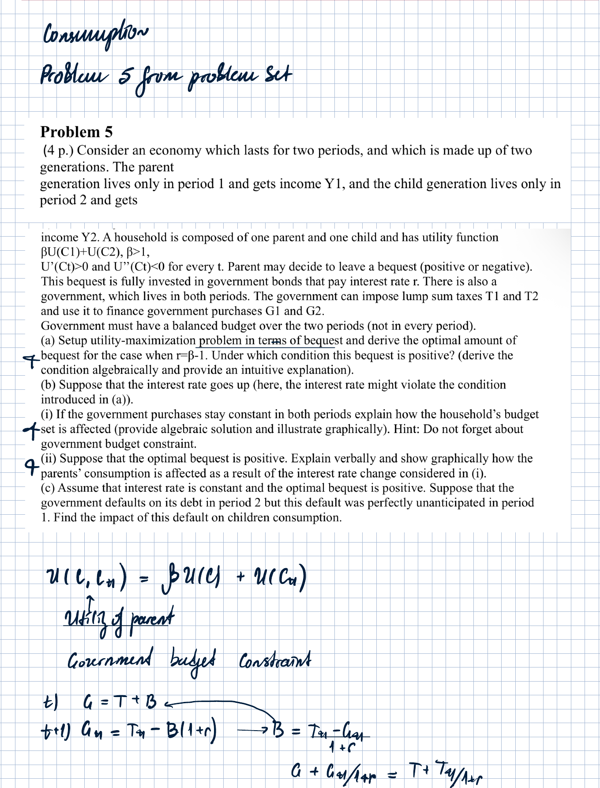

---

## Solution to Problem 5

### Part (a): Optimal bequest

**Plan from notes:**

1. Write down utility in terms of bequest.
2. Maximize with respect to bequest using $r=\beta-1$.
3. Derive the condition under which bequest is positive.

The household chooses $B$.

The individual budget constraints are:

$$
C = Y-T-B,
$$

$$
C_{+1}=Y_{+1}-T_{+1}+B(1+r).
$$

The maximization problem is

$$
\max_B \; \beta U(Y-T-B)+U(Y_{+1}-T_{+1}+B(1+r)).
$$

FOC with respect to $B$:

$$
-\beta U'(Y-T-B)+(1+r)U'(Y_{+1}-T_{+1}+B(1+r))=0.
$$

Since

$$
r=\beta-1 \quad \Rightarrow \quad \beta=1+r,
$$

we get

$$
U'(Y-T-B)=U'(Y_{+1}-T_{+1}+B(1+r)).
$$

Because $U$ is strictly concave, the two consumption levels must be equal:

$$
Y-T-B=Y_{+1}-T_{+1}+B(1+r).
$$

Solving for $B$:

$$
B^*=\frac{(Y-T)-(Y_{+1}-T_{+1})}{2+r}.
$$

The bequest is positive if

$$
B^*>0
\quad \Leftrightarrow \quad
Y-T>Y_{+1}-T_{+1}.
$$

Intuition: if the parent's disposable income is higher than the child's disposable income, the parent leaves a positive inheritance.

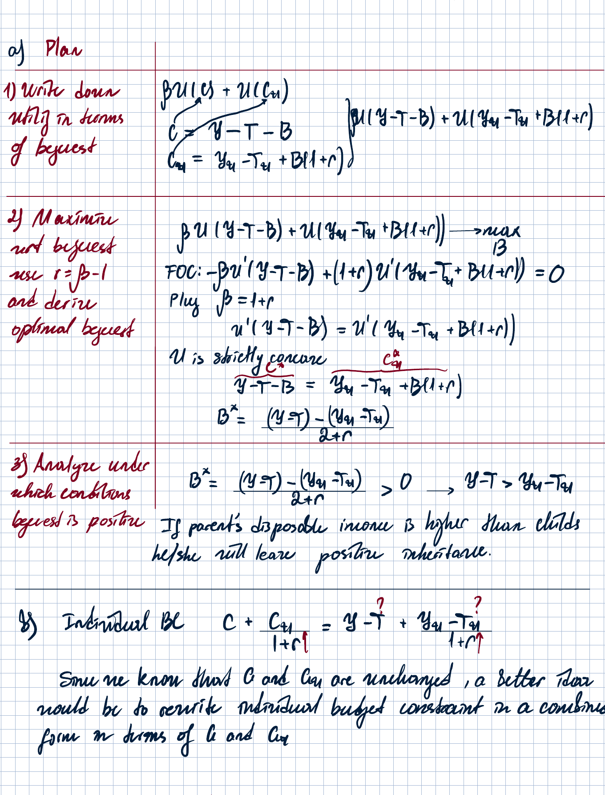

---

### Part (b): Increase in the interest rate and the household budget set

**Plan from notes:**

1. Express the individual budget constraint in combined form.
2. Use the government intertemporal budget constraint.
3. Draw the combined budget line.
4. Analyze the impact of an increase in $r$.

Individual intertemporal budget constraint:

$$
C+\frac{C_{+1}}{1+r}
=Y+\frac{Y_{+1}}{1+r}-\left(T+\frac{T_{+1}}{1+r}\right).
$$

Government intertemporal budget constraint:

$$
G+\frac{G_{+1}}{1+r}=T+\frac{T_{+1}}{1+r}.
$$

Substitute the government budget constraint into the household budget constraint:

$$
C+\frac{C_{+1}}{1+r}
=Y+\frac{Y_{+1}}{1+r}-\left(G+\frac{G_{+1}}{1+r}\right).
$$

Equivalently,

$$
C+\frac{C_{+1}}{1+r}
=(Y-G)+\frac{Y_{+1}-G_{+1}}{1+r}.
$$

The combined budget line has slope

$$
1+r,
$$

and passes through the endowment point

$$
(Y-G,\;Y_{+1}-G_{+1}).
$$

When $r$ increases, the budget line becomes steeper and rotates around the endowment point $A$.

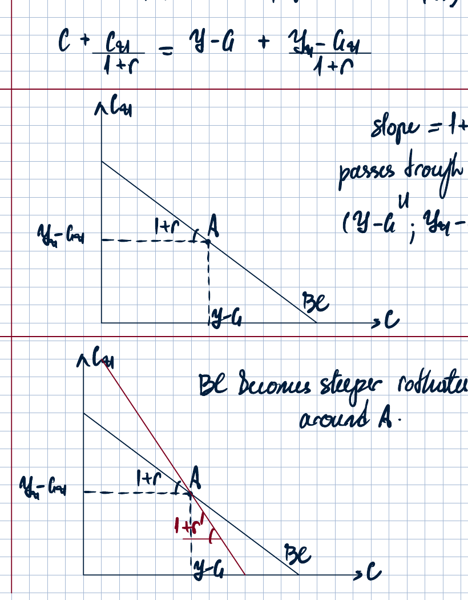

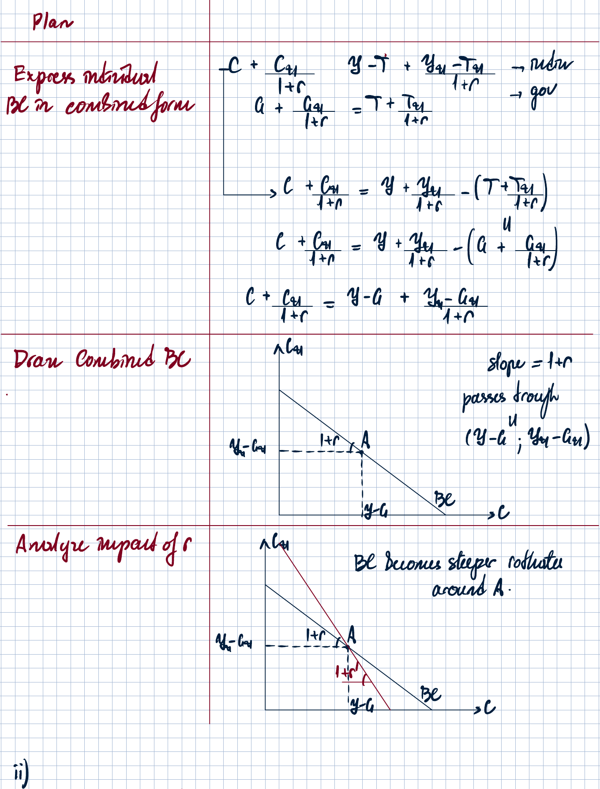

---

### Part (c): Positive bequest and effect on parent's consumption

#### (i) Parent's consumption in terms of government purchases

The parent leaves bequest entirely in the form of government bonds.

The parent's bequest is

$$
B=Y-T-C^*.
$$

From the government bond side:

$$
B=G-T.
$$

Therefore,

$$
Y-T-C^*=G-T.
$$

So

$$
C^*=Y-G.
$$

Thus the parent's consumption is current income net of current government purchases.

#### (ii) Effect of the interest-rate increase

Graphically, the budget line becomes steeper and rotates around point $A$.

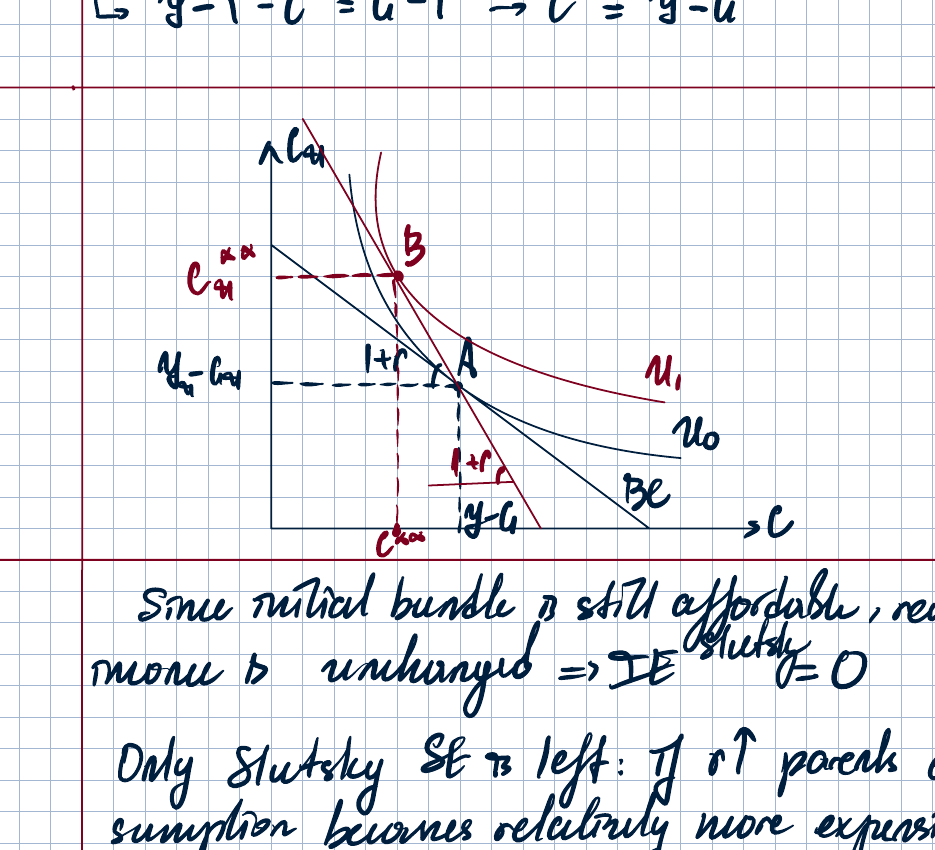

The same material bundle is still affordable, and real wealth is unchanged. Thus, there is no wealth effect:

$$
WE=0.
$$

Only the substitution effect remains. Parent's consumption becomes relatively more expensive, so the parent substitutes away from current consumption toward future consumption.

Therefore,

$$
\Delta C < 0,
$$

and

$$
\Delta C_{+1}>0.
$$

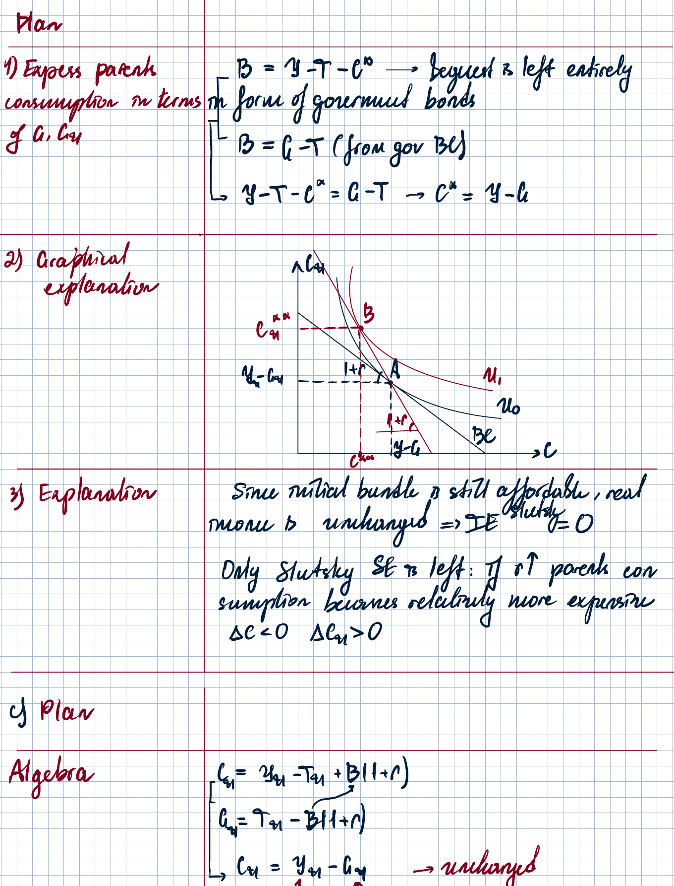

---

### Part (d): Unanticipated government default in period 2

The child's period-2 consumption is

$$
C_{+1}=Y_{+1}-T_{+1}+B(1+r).
$$

If the government defaults in period 2, the child does not receive the bequest payment from government bonds. This decreases the child's wealth.

However, because the government does not repay its debt, it also does not need to collect the corresponding taxes in period 2. Thus taxes fall, which increases the child's wealth.

Since the default is unanticipated in period 1, the parent could not adjust his or her consumption.

The two effects cancel out:

$$
\Delta C_{+1}=0.
$$

Moral from the notes:

> Government bonds are not part of the economy's wealth.

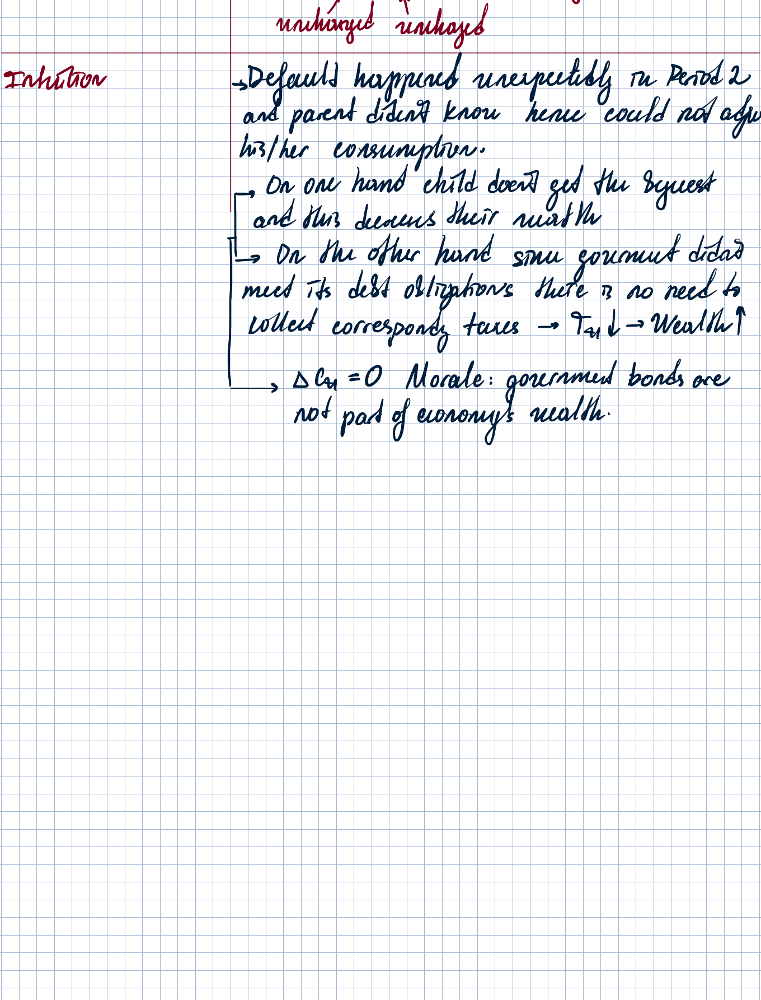
