# Week 3 - Endogenous Growth and Consumption

This Markdown version preserves the lecture-note context by combining a cleaned transcription with the original page scans. Mathematical expressions are written in LaTeX. Graphs and diagrams are embedded as images.

---

## Page 1 - Endogenous growth models: AK model and learning by doing

### Model 1: AK model

Production function:

$$
y=aK.
$$

The marginal product of capital is constant:

$$
MPK=a=\text{constant}.
$$

This is a linear production function, not concave as in the Solow model.

Capital accumulation:

$$
\dot k=sak-(n+\delta)k,
$$

so the growth rate of capital is:

$$
\frac{\dot k}{k}=sa-(n+\delta).
$$

There is permanent growth both in the short run and in the long run.

Why is growth endogenous? A change in the saving rate changes the growth rate permanently:

$$
s \uparrow \;\Rightarrow\; g_k \uparrow \;\Rightarrow\; g_y \uparrow \text{ permanently.}
$$

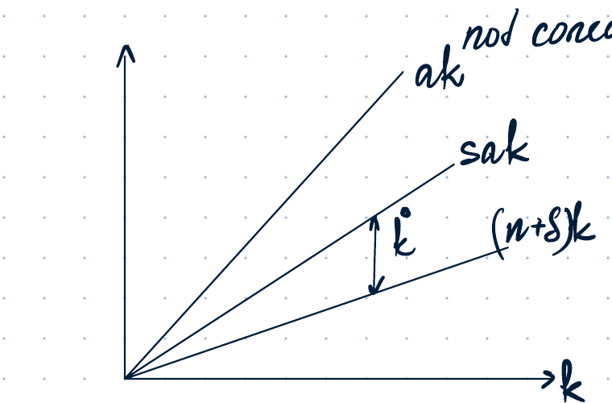

### Model 2: learning by doing

Learning by doing means that skills or knowledge are accumulated as a by-product of the production process. It creates a positive externality effect.

Each firm has:

$$
y_i=F(K_i,AN_i),
$$

where $A$ is a public good / common for all firms.

In perfectly competitive markets:

$$
w=MPN,
$$

and wages are the same across all firms.

For the aggregate economy, with identical firms, constant population and no population growth:

$$
N=\text{constant}, \qquad n=0.
$$

Aggregate production:

$$
y=Ny_i=NF(K_i,AN_i).
$$

With constant returns to scale:

$$
y=NF(K_i,AN_i)=F(NK_i,AN_iN)=F(K,AN).
$$

Full page image

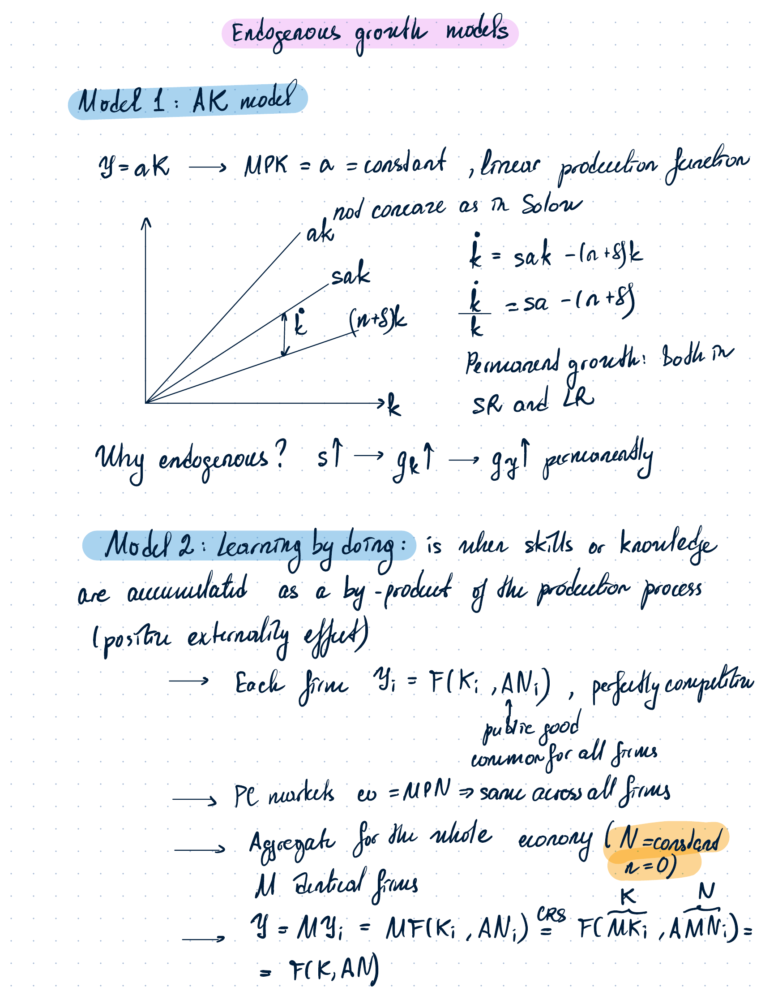

---

## Page 2 - Learning-by-doing mechanism

Key assumption: the learning-by-doing function is

$$
A=K^\lambda.
$$

The more capital the economy employs, the more the economy learns.

Plugging $A=K^\lambda$ into the production function gives:

$$
y=F(K,K^\lambda N).
$$

Using CRS:

$$
y=F(K,K^\lambda N)=K F(1,K^{\lambda-1}N).
$$

If $\lambda=1$, then $K^{\lambda-1}=1$ and

$$
y=K F(1,N)=\text{constant}\cdot K.
$$

Thus the model looks like the AK model:

$$
y=\text{constant}\cdot k.
$$

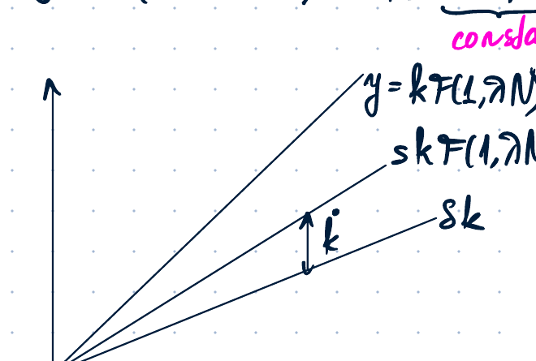

Capital growth:

$$
\dot k=sKF(1,\lambda N)-\delta k.
$$

Hence:

$$
\frac{\dot k}{k}=sF(1,\lambda N)-\delta = g_y.
$$

Since $k=K/N$ and $N$ is constant,

$$
\frac{\dot K}{K}=\frac{\dot y}{y}=sF(1,\lambda N)-\delta+n^0.
$$

Limitation: $A$ and $K$ have to be proportional to each other.

If instead:

$$
A=\lambda K \quad \Rightarrow \quad \%\Delta A=\%\Delta K,
$$

then the learning effect is strong enough to obtain AK-type growth. But if

$$
A=\sqrt K\,\lambda,
$$

then

$$
\ln A=\ln \lambda+\frac12 \ln K, \qquad \frac{\dot A}{A}=\frac12\frac{\dot K}{K},
$$

so the learning-by-doing effect is not strong enough.

Full page image

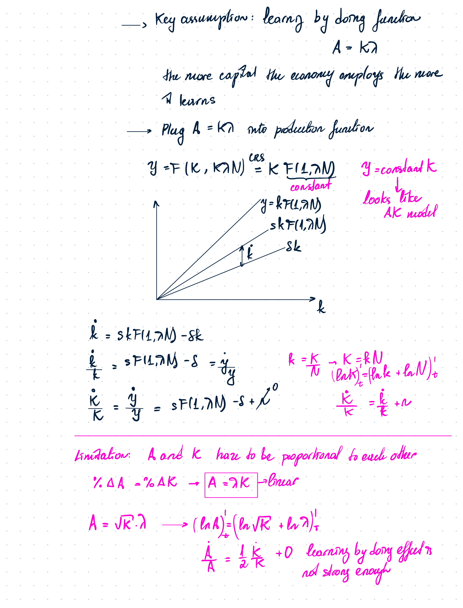

---

## Page 3 - Human capital model

### Model 3: human capital as a source of endogenous economic growth

Human capital refers to education, skills and training of workers that affect their productivity.

Human capital:

- can be accumulated, just like physical capital;
- can be depreciated.

Assume:

$$
N=\text{constant}, \qquad n=0.
$$

Let $u$ be the proportion of the population dedicated to production of goods.

Production of final goods:

$$
y=zF(K,uH),
$$

where $K$ is physical capital and $uH$ is human capital used in production.

Allocation of human capital:

$$
H= uH +(1-u)H.
$$

- $uH$ goes to production of final goods.
- $(1-u)H$ goes to R&D / accumulation of new human capital.

Physical capital accumulation:

$$
I=K_{t+1}-K_t(1-\delta),
$$

or equivalently:

$$
K_{t+1}=I+K_t(1-\delta).
$$

Human capital accumulation:

$$
H_{t+1}=H(1-\delta_H)+G((1-u)H),
$$

where:

- $H(1-\delta_H)$ is undepreciated human capital;
- $G((1-u)H)$ is new human capital.

$G((1-u)H)$ is the production function for new human capital.

Diminishing returns to human capital:

$$
G_H'>0, \qquad G_H''<0.
$$

Full page image

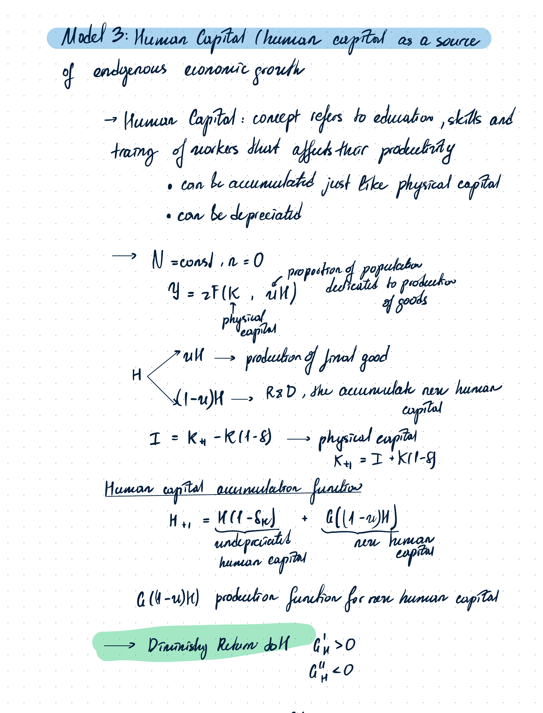

---

## Page 4 - Human capital: no endogenous growth vs endogenous growth

If $G((1-u)H)$ has diminishing returns, then a steady state exists and $H$ is constant in the long run.

The model becomes similar to a normal Solow model without technical progress and with constant population:

$$
y=zF(K,uH), \qquad H=\text{constant in LR}.
$$

Therefore there is **no endogenous growth**.

If the human-capital accumulation function has constant returns to $H$:

$$
G_H'>0, \qquad G_H''=0,
$$

then no finite steady state for $H$ exists. Human capital grows permanently in the long run, giving endogenous growth.

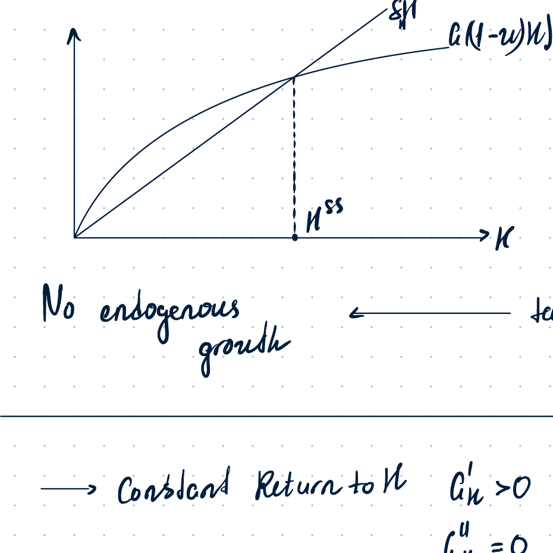

Policy shock: more education and training means

$$
u \downarrow \quad \Rightarrow \quad (1-u)\uparrow.
$$

Short run sacrifice:

$$
y^{SR}\downarrow = zF(K,uH).
$$

Long run:

$$
y^{LR}=zF(K,u^{new}H) \uparrow,
$$

because more human capital is accumulated. There is an optimal $u$ that maximizes $y$ in the long run.

### Model 4: Research and Development

Assumptions:

$$
n=0, \qquad N=\text{constant}.
$$

Technologies are non-rival but excludable.

Full page image

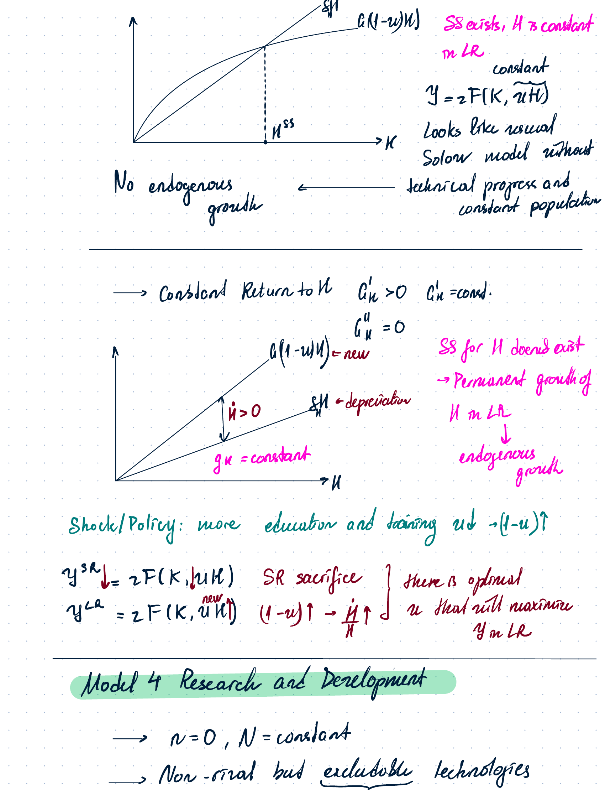

---

## Page 5 - R&D model and international technology transfer

In the R&D model, $A$ is the stock of ideas generated in R&D. Ideas can be protected by patents.

Production function:

$$
y=F(K,uAN),
$$

where $u$ is the proportion of augmented/effective labour dedicated to production of final goods.

Production function for innovation / accumulation of ideas:

$$
\frac{A_{t+1}-A_t}{A_t}=\frac{(1-u)N}{\mu},
$$

where $\mu$ is the cost of innovation.

There is no depreciation of ideas: once an idea is discovered, it is never lost.

Growth of ideas:

$$
g_A=\frac{A_{t+1}-A_t}{A_t}=\frac{(1-u)N}{\mu}.
$$

Constant returns to $(1-u)N$ imply:

$$
g_{Y/N}=g_y=g_A=\frac{(1-u)N}{\mu}
$$

in the long run.

### Model 5: International technology transfer

- Economy 1 is at the frontier of knowledge and innovates.
- Economy 2 lacks knowledge and copies / imitates.
- $N_1=N_2=N=\text{constant}$ and $n_1=n_2=0$.
- Based on Model 4.
- $A_1>A_2$ because

$$
(1-u_1)>(1-u_2), \qquad u_1<u_2.
$$

Full page image

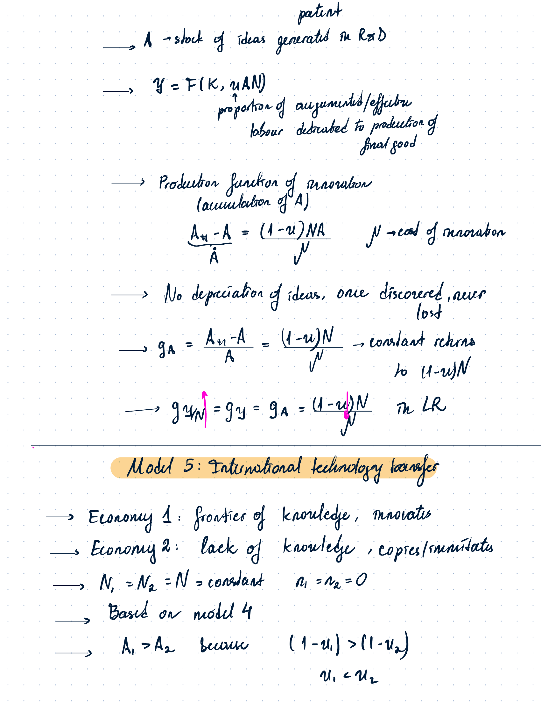

---

## Page 6 - Technology transfer and knowledge gap

Innovation growth in economy 1:

$$
g_{A_1}=\frac{(1-u_1)N}{\mu_1}.
$$

Imitation growth in economy 2:

$$
g_{A_2}=\frac{(1-u_2)N}{\mu_2}.
$$

The cost of imitation depends on the knowledge gap:

$$
\mu_2=\mu_c=c\left(\frac{A_1}{A_2}\right)=c(a),
$$

where

$$
a=\frac{A_1}{A_2}
$$

is the knowledge gap.

If

$$
A_1=A_2,
$$

then the two economies are on the same level. There is no sense in copying, so:

$$
c\left(\frac{A_1}{A_2}\right)=\mu_1.
$$

When

$$
\frac{A_1}{A_2}\uparrow
$$

copying becomes easier, because the country copies simpler things:

$$
c'(a)<0.
$$

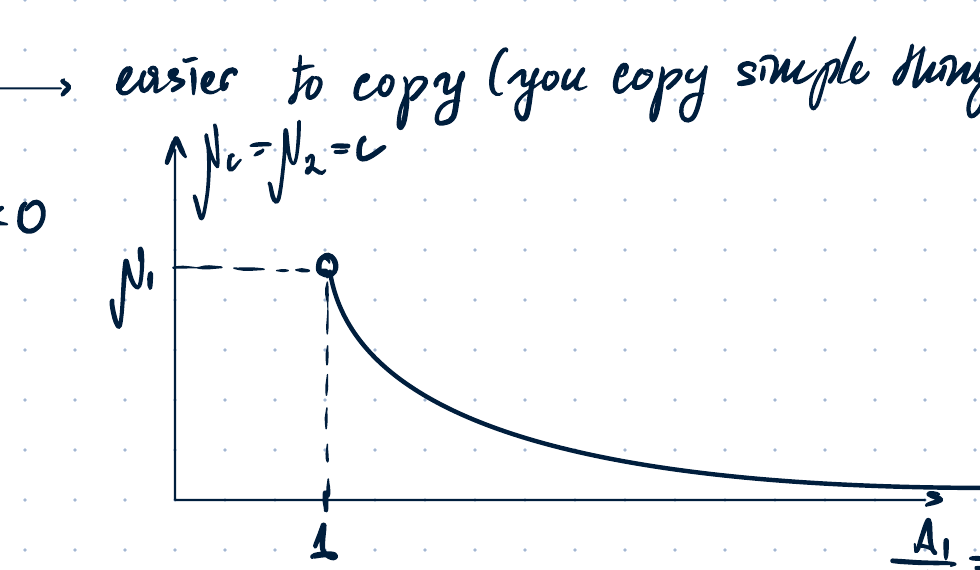

Definition of steady state:

$$
g_1=g_2.
$$

That is:

$$
\frac{(1-u_1)N}{\mu_1}=\frac{(1-u_2)N}{c(a^*)}.
$$

Therefore:

$$
c\left(\frac{A_1}{A_2}\right)=\frac{(1-u_2)\mu_1}{(1-u_1)},
$$

with

$$
\mu_1<\mu_2.
$$

Full page image

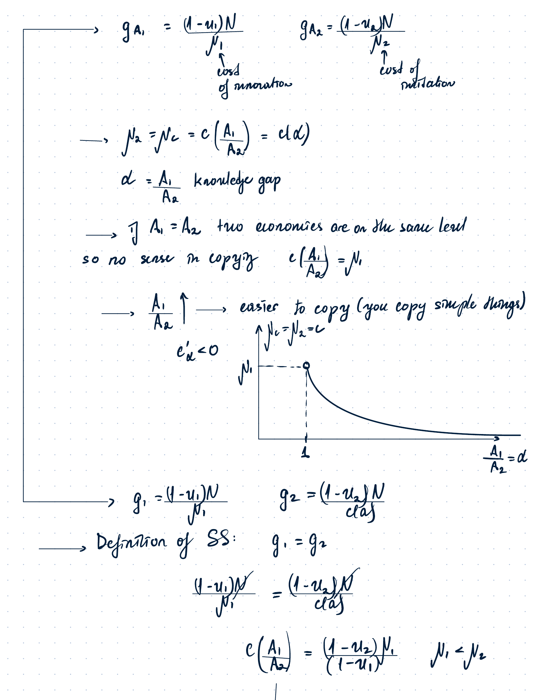

---

## Page 7 - Class 3, Problem 1: technology transfer reform

The graph relates the knowledge gap $a=A_1/A_2$ to the growth gap $g_2-g_1$.

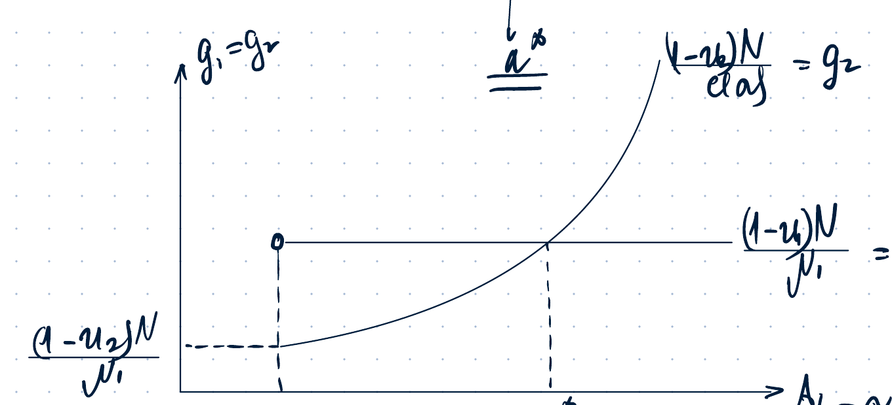

### Problem statement

Consider the international technology-transfer model with two economies discussed in the lecture. Assume a simplified production function:

$$
Y_i=A_iN_{Y_i},
$$

where $N_{Y_i}$ is labour used in production in economy $i$.

Economy 1 is innovating and economy 2 is imitating. Due to structural reforms in economy 2, more labour is used in production of knowledge, but this share is still less than in economy 1. Show graphically and algebraically the immediate and long-run impact of these reforms on the knowledge gap using a diagram that relates growth rates of knowledge in each economy and the size of the knowledge gap.

### Notes / setup

Production:

$$
y_1=A_1N_{Y_1}, \qquad y_2=A_2N_{Y_2}.
$$

Economy 1: innovating.

Economy 2: imitating.

Growth rates:

$$
g_1=\frac{(1-u_1)N}{\mu_1}, \qquad
 g_2=\frac{(1-u_2)N}{c(a)}.
$$

Initially:

$$
u_2>u_1.
$$

Shock:

$$
u_2\downarrow \quad \Rightarrow \quad (1-u_2)\uparrow.
$$

Initially the economy is in steady state:

$$
g_1=g_2, \qquad a=a^*.
$$

After the shock:

$$
u_2\downarrow \Rightarrow (1-u_2)\uparrow,
$$

so the $g_2$ curve shifts upward.

Full page image

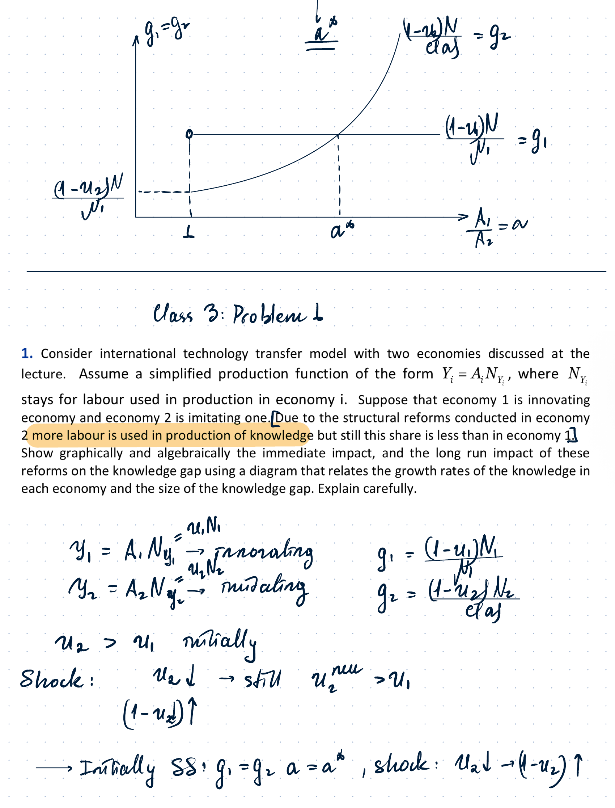

---

## Page 8 - Technology transfer: transition after reform

Because more labour is used for R&D in the imitating country, the growth rate of $A_2$ rises temporarily:

$$
g_2>g_1.
$$

This implies:

$$
\frac{A_1}{A_2}\downarrow,
$$

so the knowledge gap decreases:

$$
a\downarrow.
$$

As the knowledge gap falls, imitation becomes more difficult:

$$
c(a)\uparrow.
$$

Therefore $g_2$ slows down until it becomes equal to $g_1$ again in the new steady state.

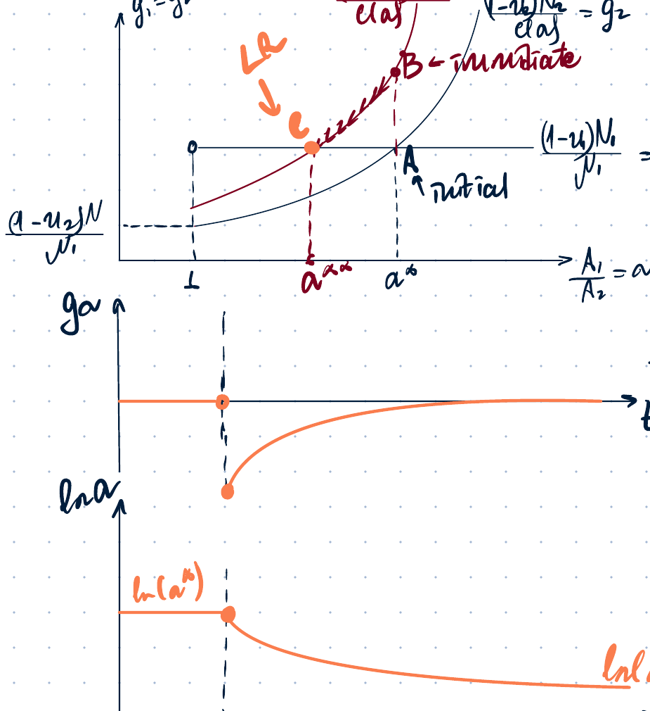

Time paths:

- $g_2$ jumps up initially and then converges back to $g_1$.
- $\ln(A_1)$ continues to grow with slope $g_1$.
- $\ln(A_2)$ grows faster during transition and then with the same slope as $\ln(A_1)$.

### Problem 12 from problem set: R&D model

Consider a one-country model of research and development. Suppose share $u$ of total labour $N$ is used in production and share $1-u$ is used in R&D. Assume:

$$
Y=AN_Y,
$$

where $N_Y$ is labour used in production. Productivity grows over time:

$$
\dot A=\frac{(1-u)N}{\mu}A,
$$

where $\mu$ is the cost of R&D. Assume $N$ is constant.

Questions:

1. Find the growth rate of output per capita. Explain intuitively how this growth rate is affected by population.
2. Suppose at time $t_0$ there is a one-time decrease in the cost of R&D. Produce time charts for the logarithms of productivity $A$ and output per capita.
3. Suppose at time $t_0$ there is a one-time decrease in the share of labour used in R&D. Produce time charts for the logarithms of productivity $A$ and output per capita. Explain the results.

Full page image

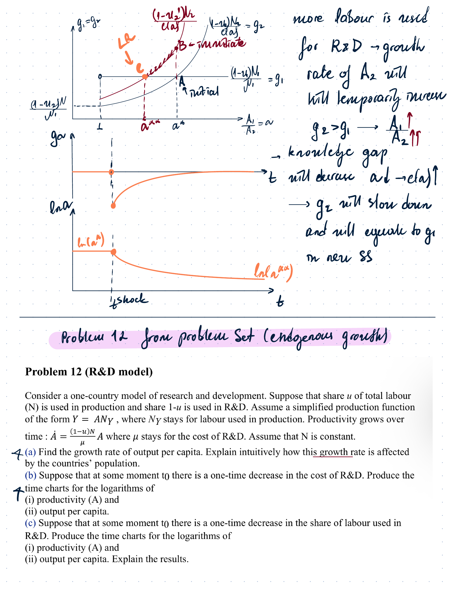

---

## Page 9 - R&D model: population and lower R&D cost

For the one-country R&D model:

$$
Y=AN_Y, \qquad N_Y=uN, \qquad N=\text{constant}, \quad n=0.
$$

Productivity growth:

$$
g_A=\frac{\dot A}{A}=\frac{(1-u)N}{\mu}.
$$

Output per capita:

$$
\frac{y}{N}=Au.
$$

Taking logs:

$$
\left(\ln \frac{y}{N}\right)'_t = \left(\ln A+\ln u\right)'_t.
$$

Since $u$ is constant:

$$
g_{y/N}=\frac{\dot A}{A}+0=\frac{(1-u)N}{\mu}.
$$

Intuition: more population means more people working in R&D. With constant $u$, this gives a higher chance of coming up with new innovations.

### One-time decrease in cost of R&D

Shock:

$$
\mu\downarrow \quad \Rightarrow \quad g_A\uparrow.
$$

Time charts:

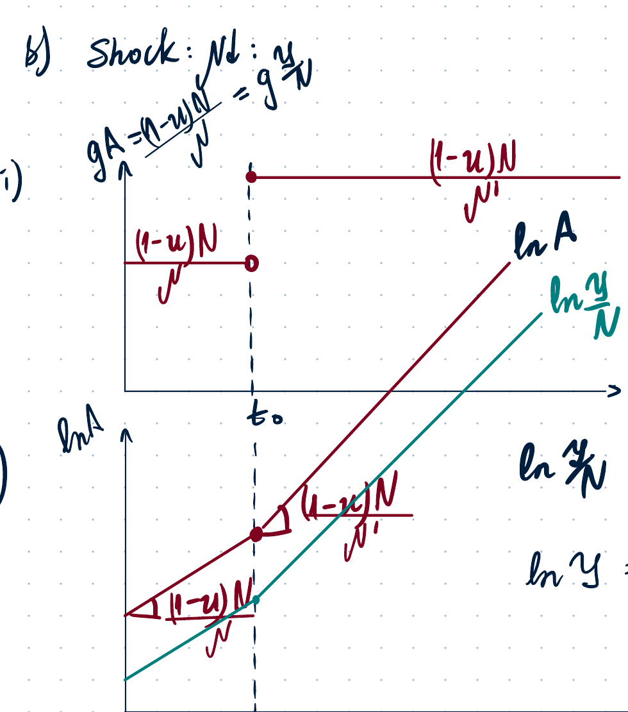

- $g_A$ jumps upward permanently.
- $\ln A$ becomes steeper permanently.
- Since $\ln(y/N)=\ln A+\ln u$, and $u$ is constant, $\ln(y/N)$ has the same new slope as $\ln A$.

Full page image

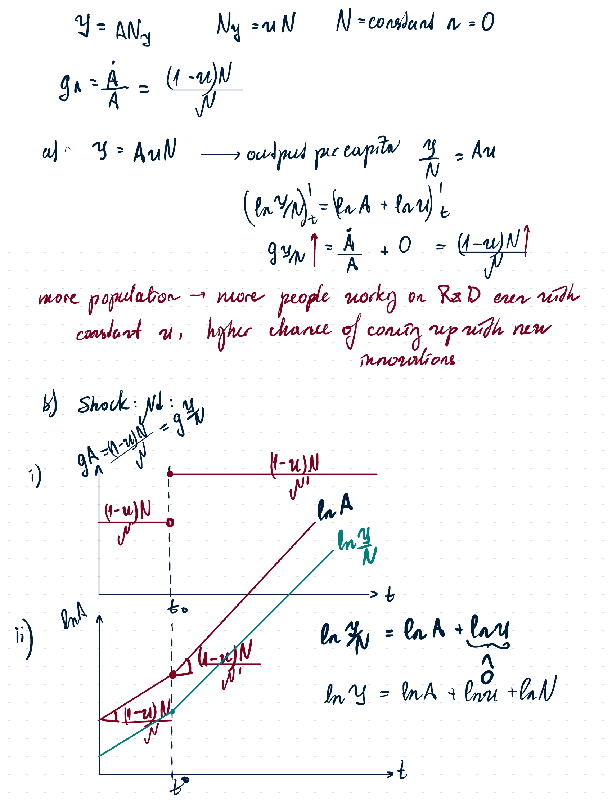

---

## Page 10 - R&D model: lower share of labour in R&D

If the share of labour used in R&D falls, then production labour rises:

$$
(1-u)\downarrow \quad \Rightarrow \quad u\uparrow.
$$

Output per capita:

$$
\frac{y}{N}=Au.
$$

Growth of productivity becomes lower:

$$
g_A=\frac{(1-u)N}{\mu}\downarrow.
$$

Time-chart implication:

- $\ln A$ has a lower slope after the shock.
- $\ln(y/N)=\ln A+\ln u$ jumps up because $u$ increases, but then grows at a lower slope because $g_A$ decreases.

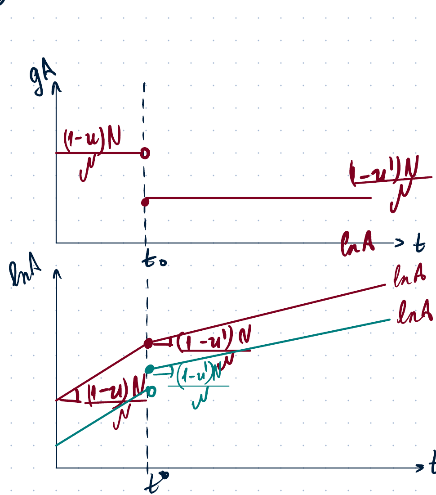

### Fisher's intertemporal consumption choice

Representative agent with standard preferences, usually over two periods, but the model can be extended to more periods.

Utility:

$$
u(c)+\beta u(c_{t+1}),
$$

or equivalently:

$$
u(c)+\frac{1}{1+\rho}u(c_{t+1}).
$$

Here:

$$
\beta=\frac{1}{1+\rho},
$$

where $\rho$ is the subjective discount factor / time-preference parameter.

Full page image

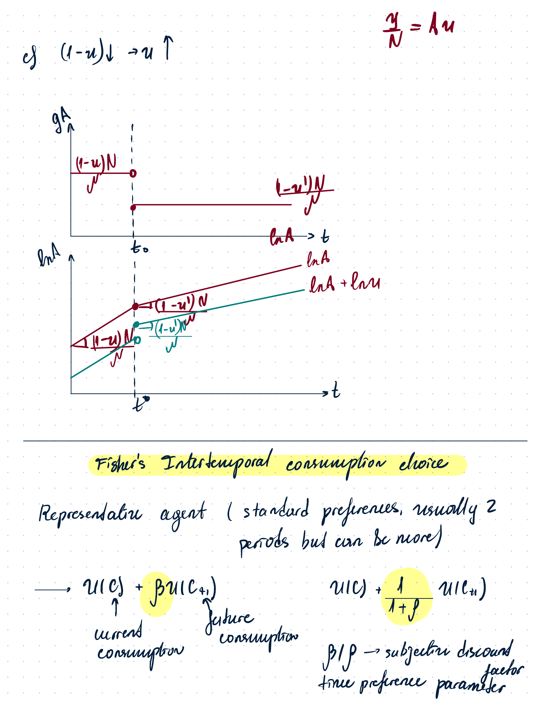

---

## Page 11 - Preferences and budget constraints

Preferences are convex and smooth:

$$
u'(c)>0, \qquad u''(c)<0.
$$

This gives non-satiation and risk aversion. Consumption in both periods is normal, and the marginal rate of substitution is diminishing.

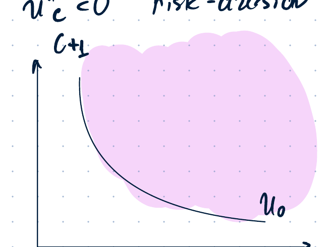

### Budget constraints

Period $t$:

$$
c=A+y^D-B,
$$

where:

- $A$ is initial wealth;
- $B$ is lending/borrowing through bonds.

Period $t+1$:

$$
c_{t+1}=y^D_{t+1}+B(1+r).
$$

Therefore:

$$
B=\frac{c_{t+1}-y^D_{t+1}}{1+r}.
$$

Intertemporal budget constraint:

$$
c+\frac{c_{t+1}}{1+r}=A+y^D+\frac{y^D_{t+1}}{1+r}.
$$

Left-hand side: lifetime consumption.

Right-hand side: lifetime wealth.

Borrowing/lending is done via bonds, more likely government bonds.

The slope of the budget line is:

$$
\left|\frac{dc_{t+1}}{dc}\right|=1+r.
$$

Full page image

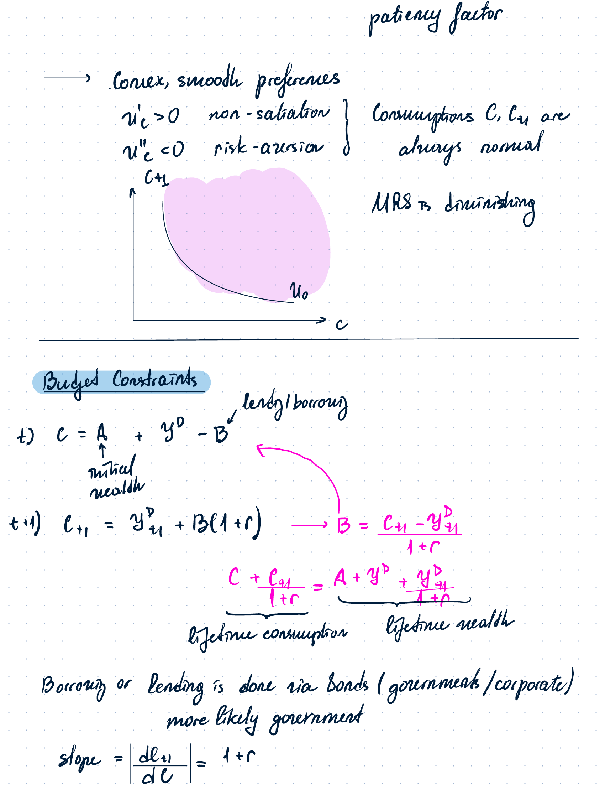

---

## Page 12 - Endowment, Euler equation and Permanent Income Hypothesis

Endowment point:

$$
(c,c_{t+1})=(A+y^D,\; y^D_{t+1}).
$$

The household problem:

$$
\max_{c,c_{t+1}\ge 0} u(c)+\frac{1}{1+\rho}u(c_{t+1})
$$

subject to

$$
c+\frac{c_{t+1}}{1+r}=A+y^D+\frac{y^D_{t+1}}{1+r}.
$$

FOC / Euler equation:

$$
\frac{u'(c)(1+\rho)}{u'(c_{t+1})}=1+r.
$$

Equivalently:

$$
MRS(c,c_{t+1})=1+r.
$$

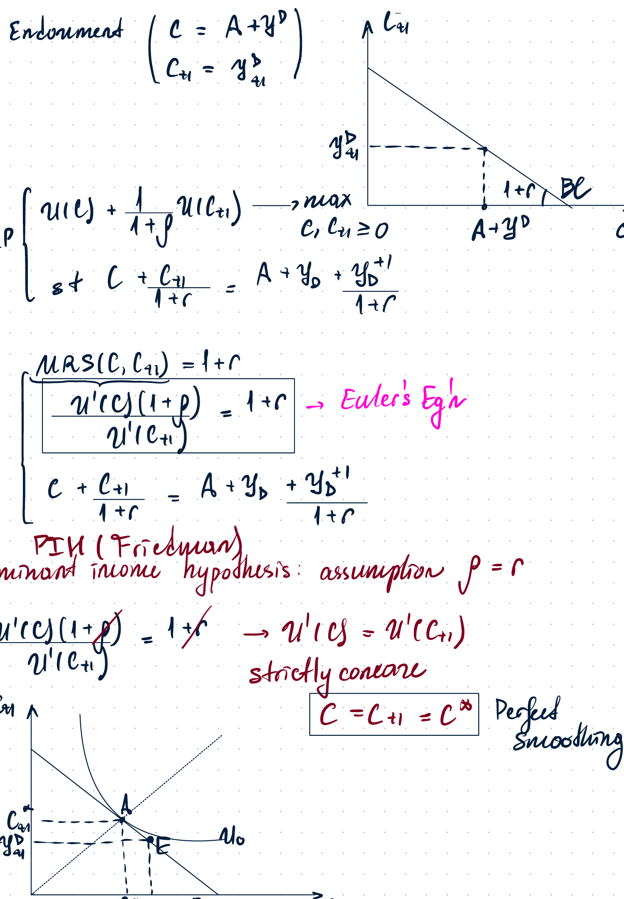

### Permanent Income Hypothesis (Friedman)

Assumption:

$$
\rho=r.
$$

Then:

$$
\frac{u'(c)(1+\rho)}{u'(c_{t+1})}=1+r
\quad \Rightarrow \quad
u'(c)=u'(c_{t+1}).
$$

With strictly concave utility:

$$
c=c_{t+1}=c^*.
$$

This gives perfect smoothing.

Using the budget constraint:

$$
c^*+\frac{c^*}{1+r}=A+y^D+\frac{y^D_{t+1}}{1+r}.
$$

Thus:

$$
c^*=\left(A+y^D+\frac{y^D_{t+1}}{1+r}\right)\frac{1+r}{2+r}.
$$

Full page image

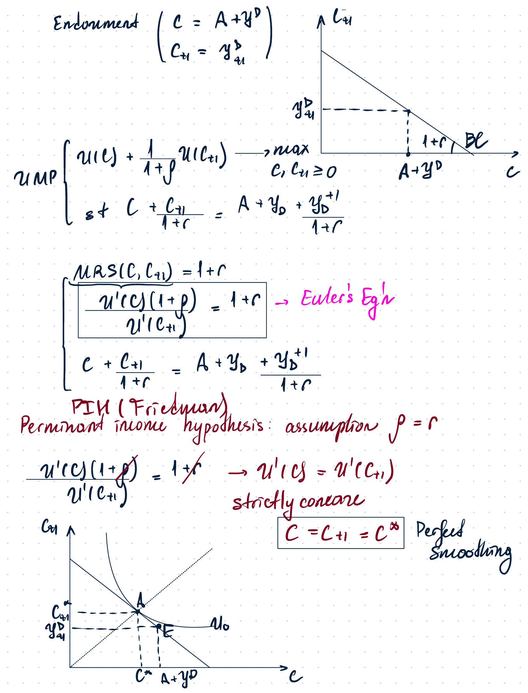

---

## Page 13 - Different taxes in the intertemporal model

### Lump-sum tax

$$
c+\frac{c_{t+1}}{1+r}=A+y-t+\frac{y_{t+1}-b_{t+1}}{1+r}.
$$

### Proportional income tax

$$
c+\frac{c_{t+1}}{1+r}=A+y(1-b)+\frac{y_{t+1}(1-b_{t+1})}{1+r}.
$$

### Proportional consumption tax

$$
c(1+b)+\frac{c_{t+1}(1+b_{t+1})}{1+r}=A+y+rac{y_{t+1}}{1+r}.
$$

Endowment:

$$
\left(\frac{A+y}{1+b},\; \frac{y_{t+1}}{1+b_{t+1}}\right).
$$

Slope:

$$
\frac{(1+r)(1+b)}{1+b_{t+1}}.
$$

### Proportional saving tax

$$
c+\frac{c_{t+1}}{(1+r)(1-b)}=A+y+\frac{y_{t+1}}{(1+r)(1-b)}.
$$

Alternative bond representation:

$$
c=A+y-B,
$$

$$
c_{t+1}=y_{t+1}+B(1-b)(1+r).
$$

Endowment:

$$
(A+y,\;y_{t+1}).
$$

Slope:

$$
(1+r)(1-b).
$$

### Interest income tax

$$
c+\frac{c_{t+1}}{1+r(1-b)}=A+y+\frac{y_{t+1}}{1+r(1-b)}.
$$

Endowment:

$$
(A+y,\;y_{t+1}).
$$

Slope:

$$
1+r(1-b).
$$

### Home assignment 3 comments

Comment in notes: this is not a general equilibrium setup.

Full page image

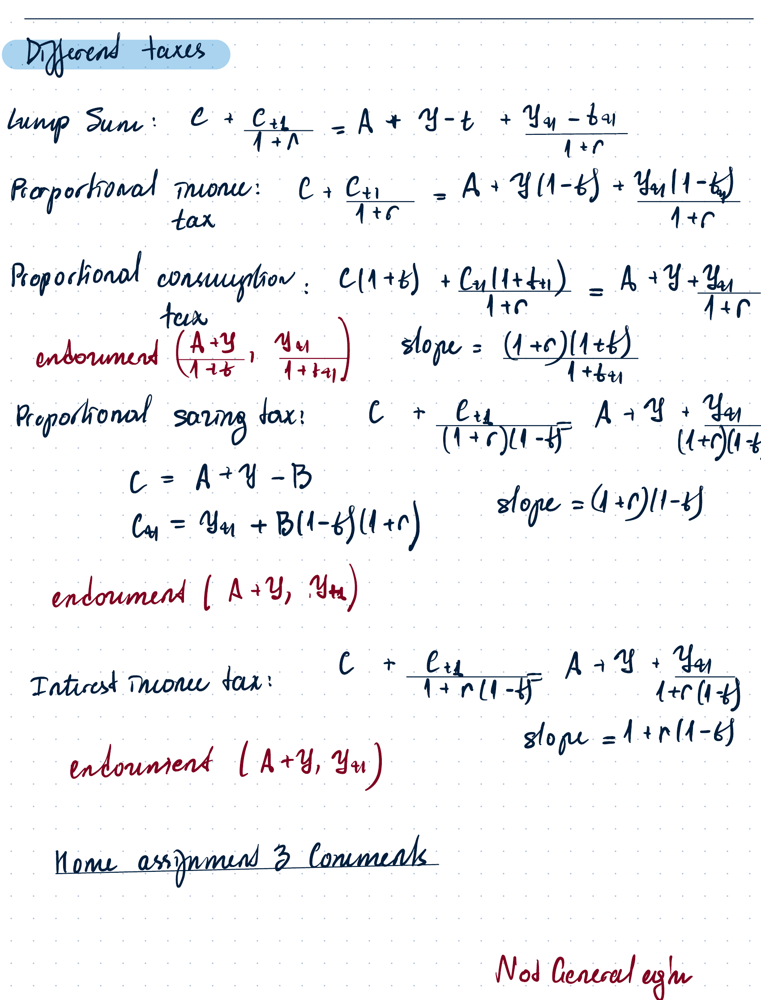

---

## Page 14 - Temporary negative current-income shock

### Problem statement

Consider a two-period model of consumption choice with exogenous incomes. There is no government. The household faces a temporary negative current-period income shock and the interest rate is fixed.

Part (a): how does the size of the change in current consumption compare to the change in current income?

Shock:

$$
\Delta y^d<0.
$$

Under the PIH condition $\rho=r$, there is perfect smoothing:

$$
c=c_{t+1}=c^*.
$$

Budget constraint:

$$
c^*+\frac{c^*}{1+r}=y^d+\frac{y^d_{t+1}}{1+r}.
$$

Thus:

$$
c^*=\left(y^d+\frac{y^d_{t+1}}{1+r}\right)\frac{1+r}{2+r}.
$$

For a temporary shock to current income:

$$
\Delta c^* = \Delta y^d \frac{1+r}{2+r}.
$$

Therefore:

$$
\frac{\Delta c^*}{\Delta y^d}=\frac{1+r}{2+r}<1,
$$

so current consumption changes by less than current income:

$$
|\Delta c|<|\Delta y|.
$$

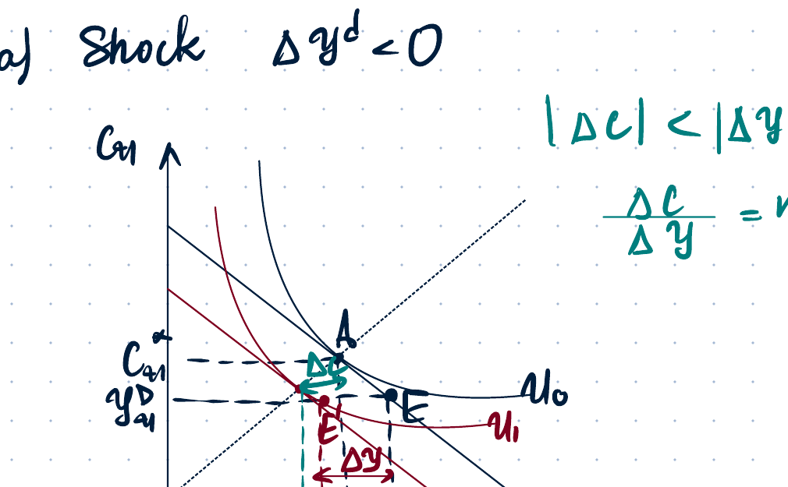

Full page image

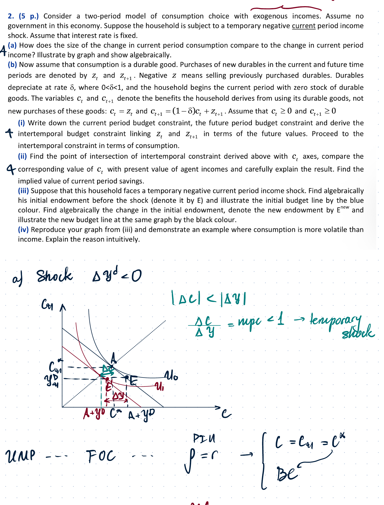

---

## Page 15 - Durable goods: budget constraints and endowment

Assume consumption is a durable good. Purchases of new durables are $z_t$ and $z_{t+1}$.

Consumption services are:

$$
c_t=z_t,
$$

$$
c_{t+1}=(1-\delta)c_t+z_{t+1}.
$$

Budget constraints:

$$
z_t=y_t-B,
$$

$$
z_{t+1}=y_{t+1}+B(1+r).
$$

Combining them:

$$
z_t+\frac{z_{t+1}}{1+r}=y_t+\frac{y_{t+1}}{1+r}.
$$

Substitute durable services:

$$
\frac{(r+\delta)c_t}{1+r}+\frac{c_{t+1}}{1+r}=y_t+rac{y_{t+1}}{1+r}.
$$

Equivalently:

$$
(r+\delta)c_t+c_{t+1}= (1+r)y_t+y_{t+1}.
$$

Endowment in consumption-service terms:

$$
(c_t,c_{t+1})=(y_t,\;(1-\delta)y_t+y_{t+1}).
$$

The slope of the intertemporal budget line is:

$$
r+\delta.
$$

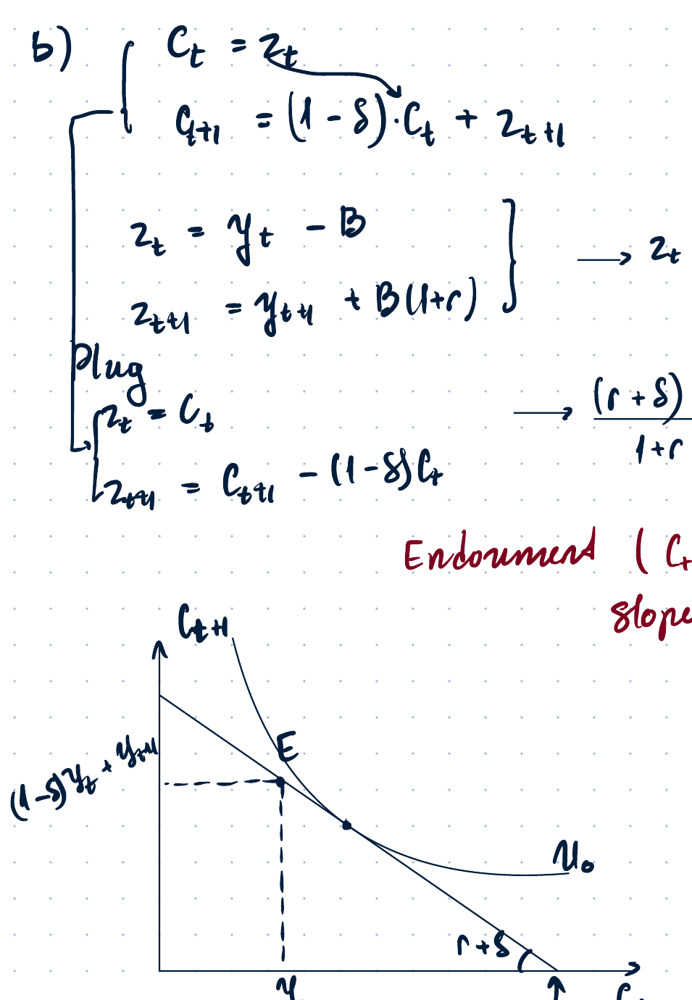

The horizontal intercept for $c_t$ is:

$$
\frac{y_t+\frac{y_{t+1}}{1+r}}{\frac{r+\delta}{1+r}}
=rac{(1+r)y_t+y_{t+1}}{r+\delta}.
$$

Full page image

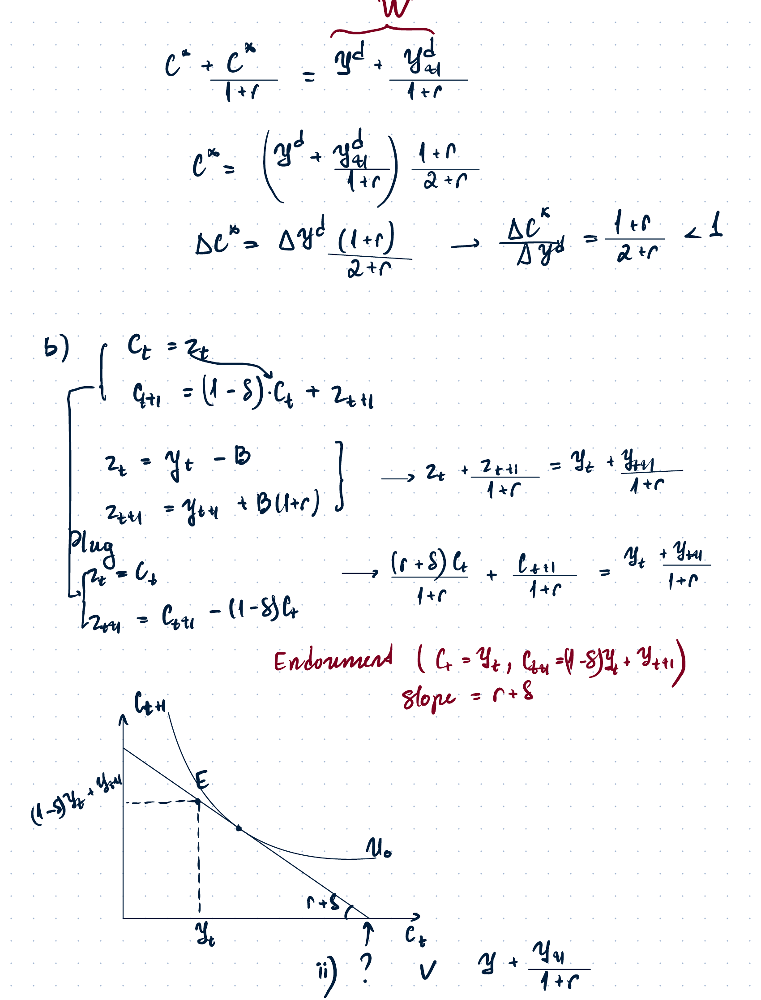

---

## Page 16 - Durable goods: solution options and volatility

### Option 1

Use the MRS condition directly:

$$
MRS=r+\delta.
$$

The budget constraint is:

$$
\frac{(r+\delta)c_t}{1+r}+\frac{c_{t+1}}{1+r}=y_t+\frac{y_{t+1}}{1+r}.
$$

This gives optimal current consumption $c_t^*$, and savings are:

$$
S=y-c_t^*.
$$

### Option 2

Solve the utility maximization problem:

$$
\max_B \; u(y_t-B)+\frac{1}{1+\rho}u\left((1-\delta)(y_t-B)+y_{t+1}+B(1+r)\right).
$$

That is:

$$
c_t=z_t=y_t-B,
$$

$$
c_{t+1}=(1-\delta)c_t+z_{t+1}=(1-\delta)(y_t-B)+y_{t+1}+B(1+r).
$$

### Volatility under durable consumption

After a negative current-income shock:

$$
\Delta y_t<0.
$$

The notes show a case with less smoothing, where durable consumption reacts more strongly than non-durable consumption:

$$
\left|\frac{\Delta C}{\Delta y}\right|_{durable}>
\left|\frac{\Delta C}{\Delta y}\right|_{non\text{-}durable}.
$$

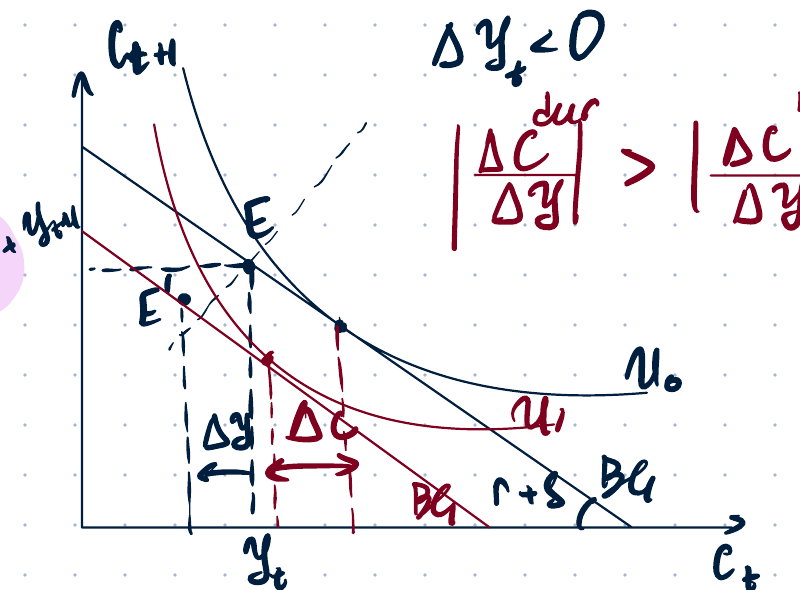

Full page image

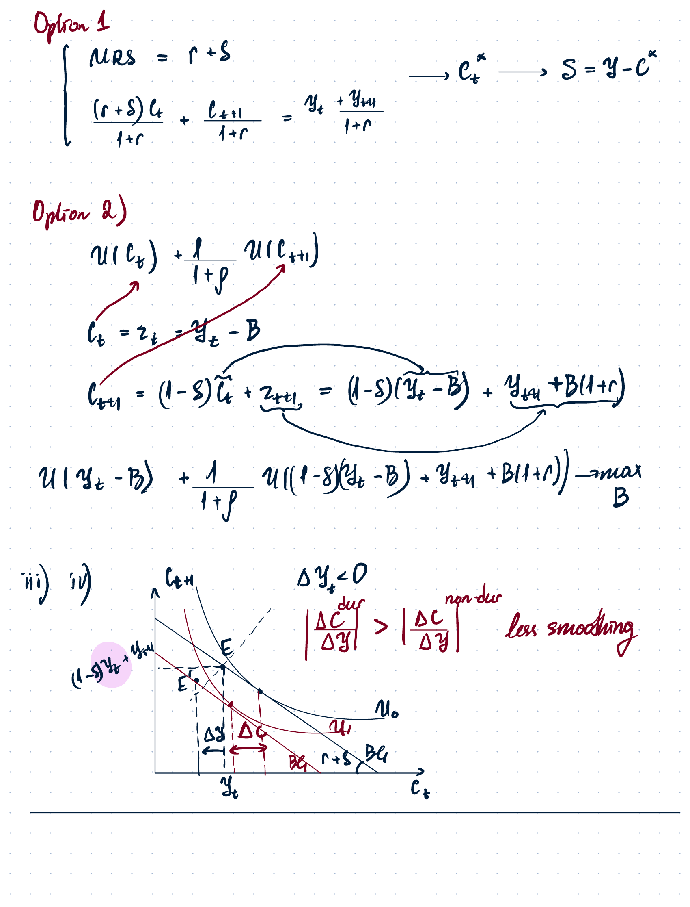

---

## Page 17 - Technology transfer with migration

### Problem statement

Consider the international technology-transfer model with two economies. Economy 1 is innovating and economy 2 is imitating. Due to migration, the population of the innovating economy permanently increases while the population of the imitating economy stays unchanged.

Initial shock:

$$
N_1\uparrow, \qquad \Delta N_2=0.
$$

Growth rate in the innovating economy rises:

$$
g_1\uparrow=\frac{(1-u_1)N_1}{\mu_1}\uparrow.
$$

Production functions for the time chart:

$$
Y_i=\sqrt{A_i u_i N_i} \quad \text{for country } i.
$$

Graphical effect:

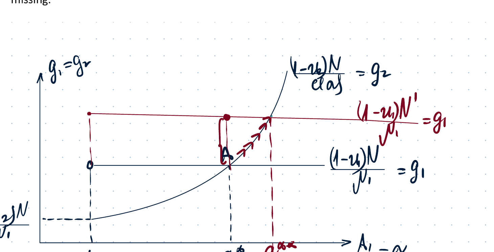

Immediately:

$$
g_1>g_2.
$$

Therefore:

$$
\frac{A_1}{A_2}\uparrow \quad \Rightarrow \quad a\uparrow \quad \Rightarrow \quad c(a)\downarrow.
$$

Then $g_2$ increases until

$$
g_1=g_2
$$

at the new steady state.

For country 1:

$$
y_1=\sqrt{A_1u_1N_1}.
$$

Taking logs:

$$
(\ln y_1)'_t=\left(\frac12\ln A_1+\frac12\ln u_1+\frac12\ln N_1\right)'_t.
$$

Since $u_1$ is constant and after the jump $N_1$ is constant:

$$
g_{y_1}=\frac12 g_1.
$$

Full page image

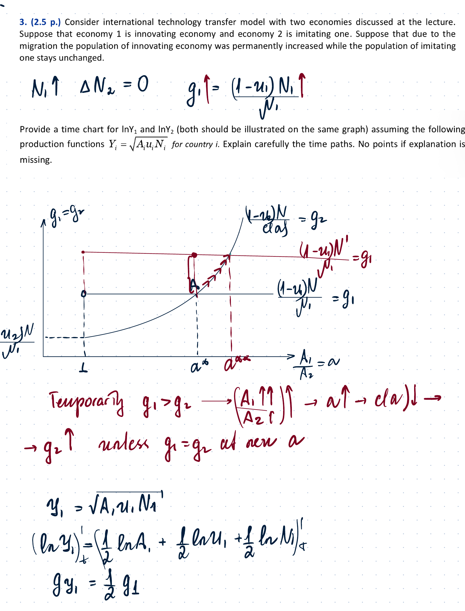

---

## Page 18 - Time paths and general equilibrium consumption problem

For the migration problem, the time paths show:

- $g_{y_1}$ jumps to a higher steady-state level.
- $\ln y_1$ jumps because $N_1$ increases and then grows with the new slope $g_1/2$.
- $\ln y_2$ does not jump immediately in the same way, but its growth rises during transition as imitation becomes easier, then reaches the same long-run slope.

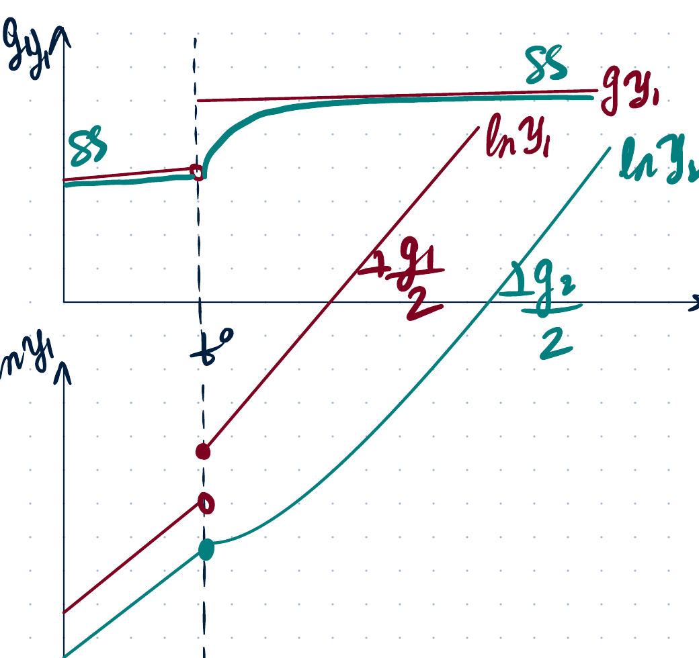

### Problem 1 - two-period general equilibrium with fixed incomes

Based on the intertemporal consumption-choice model.

Exogenous incomes:

$$
y, \qquad y_{t+1}.
$$

Aggregate output:

$$
y=Ny, \qquad y_{t+1}=Ny_{t+1}.
$$

No capital / no investment:

$$
I=0.
$$

Goods-market equilibrium:

$$
y=c+a,
$$

where $a$ is government purchases.

The problem asks what happens when current government purchases are reduced while future policy stays the same.

Full page image

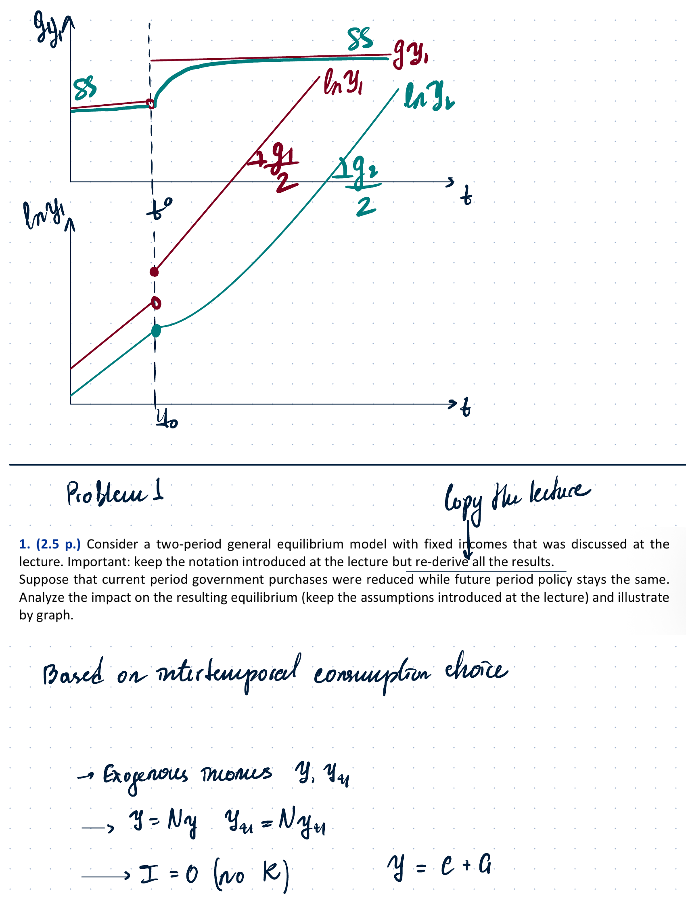

---

## Page 19 - Two-period GE: initial equilibrium

In each period:

$$
y_t=c_t+a_t,
$$

$$
y_{t+1}=c_{t+1}+a_{t+1}.
$$

Balanced budget in every period:

$$
a=N\tau=T,
$$

$$
a_{t+1}=N\tau_{t+1}=T_{t+1}.
$$

Unlike before, the interest rate adjusts endogenously.

Equilibrium current consumption and future consumption satisfy:

$$
c^*(r)N=y-a,
$$

$$
c^*_{t+1}(r)N=y_{t+1}-a_{t+1}.
$$

Household problem:

$$
\max_{c,c_{t+1}\ge 0} u(c,c_{t+1})
$$

subject to

$$
c+\frac{c_{t+1}}{1+r}=y-t+\frac{y_{t+1}-t_{t+1}}{1+r}.
$$

Optimum:

$$
MRS(c,c_{t+1})=1+r.
$$

Initially there is no borrowing and no saving:

$$
c(0)=y-t,
$$

$$
c_{t+1}(0)=y_{t+1}-t_{t+1}.
$$

Initial equilibrium:

$$
MRS(y-t,\;y_{t+1}-t_{t+1})=1+r_0.
$$

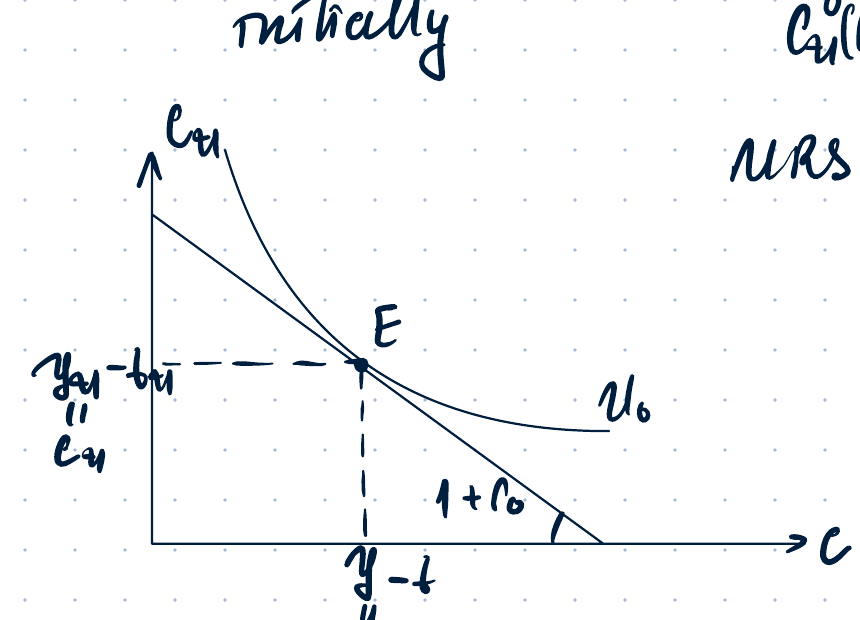

If $\Delta G<0$, then initially $\Delta c_{t+1}=0$.

Full page image

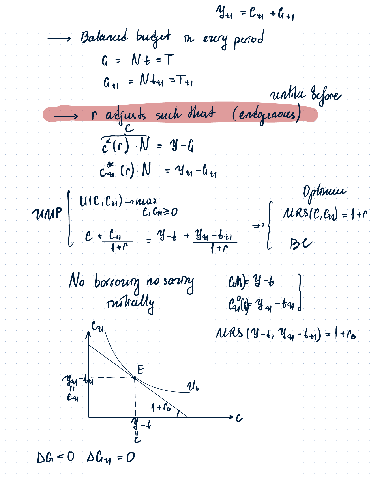

---

## Page 20 - Two-period GE: reduction in current government purchases

A fall in current government purchases implies, through the balanced budget:

$$
G\downarrow \Rightarrow T\downarrow,
$$

so the current tax burden falls and disposable income rises.

Income effect:

$$
\text{disposable income}\uparrow \quad \Rightarrow \quad c,c_{t+1}\uparrow
$$

because both consumptions are normal goods.

However, the interest rate also changes.

### Asset / bond market

Demand for assets is decided by the private sector. Since $t\downarrow$, the current income shock is spread smoothly across periods:

$$
\Delta t \Rightarrow c \uparrow \text{ by less than } \Delta t.
$$

Thus demand for bonds rises.

Supply of assets is decided by the government and is unchanged.

Therefore bond price rises and the interest rate falls:

$$
P_B\uparrow \quad \Rightarrow \quad r\downarrow.
$$

Substitution effect:

$$
r\downarrow \quad \Rightarrow \quad \text{current consumption becomes cheaper}
\quad \Rightarrow \quad c\uparrow,\;c_{t+1}\downarrow.
$$

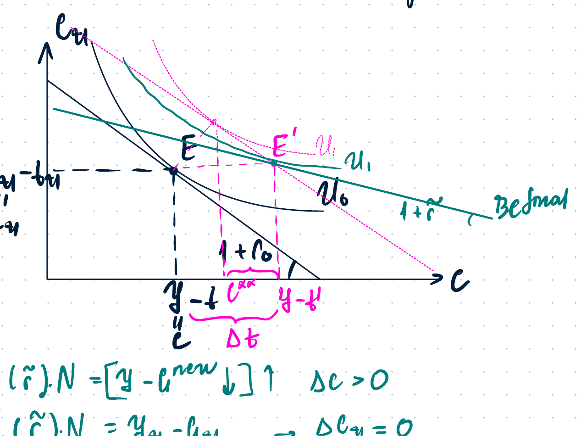

New equilibrium:

$$
\tilde c(\tilde r)N=[y-t^{new}]\uparrow,
$$

so

$$
\Delta c>0.
$$

Future government purchases and taxes are unchanged:

$$
\tilde c_{t+1}(\tilde r)N=y_{t+1}-t_{t+1},
$$

so

$$
\Delta c_{t+1}=0.
$$

Full page image

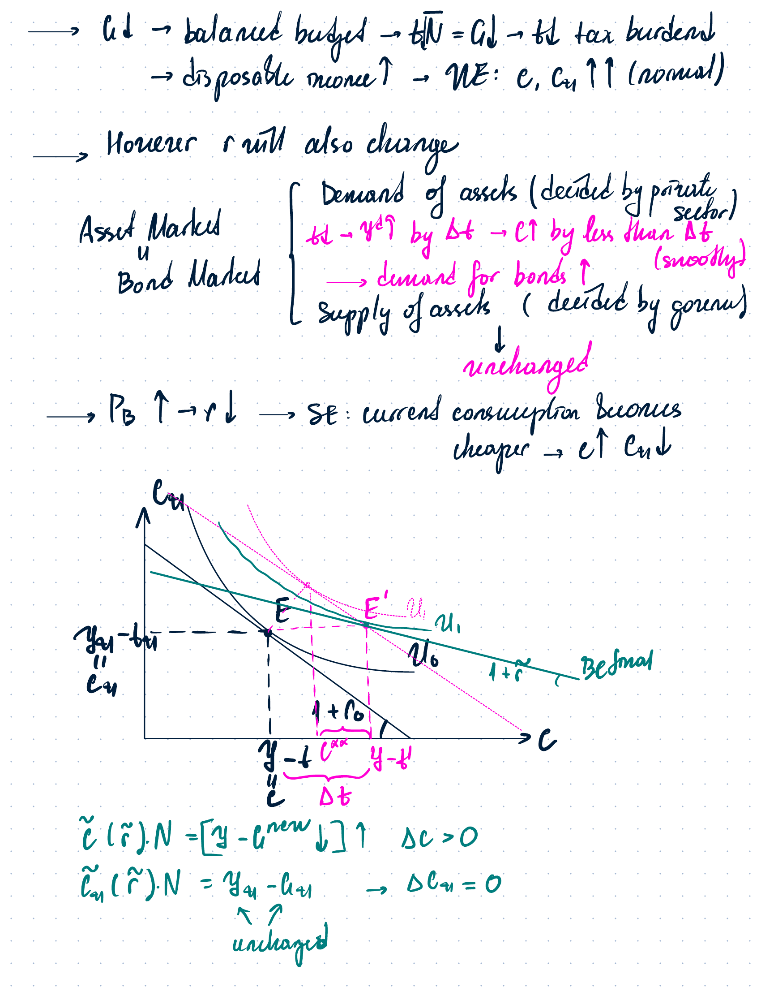

---

## Page 21 - Final equilibrium conditions

At the new equilibrium point $E'$:

$$
MRS(\tilde c,\tilde c_{t+1})=1+\tilde r.
$$

The intertemporal budget constraint is:

$$
\tilde c+\frac{\tilde c_{t+1}}{1+\tilde r}=y-t^{new}+\frac{y_{t+1}-t_{t+1}}{1+\tilde r}.
$$

Result from the diagram:

$$
\Delta c_{t+1}=0,
$$

$$
\Delta c>0.
$$

The MRS expression:

$$
MRS=\frac{u'(\tilde c)}{\beta u'(\tilde c_{t+1})}=1+\tilde r.
$$

Since current consumption rises while future consumption stays unchanged, the MRS falls:

$$
\tilde r<r_0.
$$

Full page image

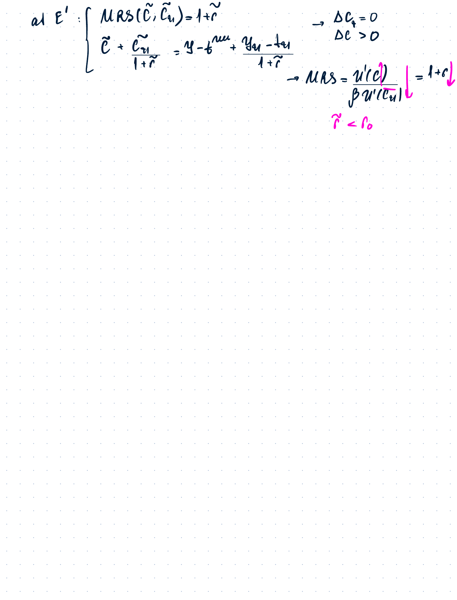

