# Week 4 - RDGE

Source: `Week 4 - RDGE.pdf`  
Output format: cleaned Markdown transcription with LaTeX math. Original page scans are embedded after each page section to preserve handwritten context and graphs.

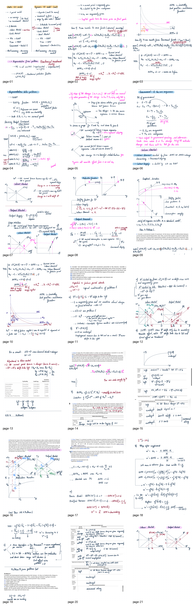

> Note: the source is handwritten and partly scanned. Where handwriting is unclear, the closest readable macro notation is preserved.

---

## Page 1 - Static GE model vs dynamic GE model

### Static GE model

- One-period model.
- No saving.
- No investment.
- No bond market.
- Two markets:
  - labour market - start here;
  - goods market.
- Household: utility maximization problem (UMP).
- Firm: profit maximization problem (PMP).
- Government decides government purchases, $G$.
- Real economy: no money market.

### Dynamic GE model, real

- Two periods, although the model can be extended to more periods.
- Investment is done by firms.
- Saving is done by other sectors, so the bond market appears.
- Three markets in the current period:
  - labour market;
  - goods market;
  - bond market.
- By Walras' law, if two of the markets are in equilibrium, the remaining market is also in equilibrium.
- Household: UMP.
- Firm: net present value / investment problem.
- Government decides $G_t$ and $G_{t+1}$.
- Real economy: no money market.

### Representative firm's problem

- Neoclassical investment theory.
- The firm is a price-taker in all markets:
  - input market;
  - output market.
- Production is usually represented by a neoclassical production function:

$$
Y_t = z_t F(K_t,N_t),
$$

with capital $K_t$, labour $N_t$, and productivity $z_t$.

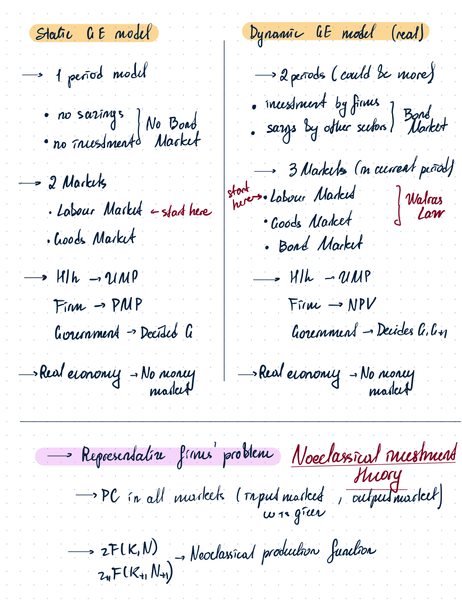

---

## Page 2 - Firm investment problem: retained earnings case

### Timing and assumptions

- Current-period capital $K_t$ is exogenously given.
- Future capital $K_{t+1}$ is chosen by the firm and is endogenous.
- Productivity levels $z_t$ and $z_{t+1}$ are exogenous.
- Capital goods have the same price as final goods.

### Case 1: firm invests using own funds, retained earnings

The firm maximizes the present value of profits:

$$
\max_{N_t,N_{t+1},K_{t+1}\ge 0}
\left[
 z_tF(K_t,N_t)-w_tN_t-I_t
 +\frac{z_{t+1}F(K_{t+1},N_{t+1})-w_{t+1}N_{t+1}+K_{t+1}(1-\delta)}{1+r}
\right],
$$

subject to

$$
I_t=K_{t+1}-(1-\delta)K_t.
$$

After substituting investment into the objective:

$$
\max_{N_t,N_{t+1},K_{t+1}\ge 0}
\left[
 z_tF(K_t,N_t)-w_tN_t-igl(K_{t+1}-(1-\delta)K_t\bigr)
 +\frac{z_{t+1}F(K_{t+1},N_{t+1})-w_{t+1}N_{t+1}+K_{t+1}(1-\delta)}{1+r}
\right].
$$

### First-order conditions

Current-period labour demand:

$$
z_t F_N(K_t,N_t)-w_t=0
\quad\Rightarrow\quad
MPN_t=w_t.
$$

Future-period labour demand:

$$
z_{t+1}F_N(K_{t+1},N_{t+1})-w_{t+1}=0
\quad\Rightarrow\quad
MPN_{t+1}=w_{t+1}.
$$

Investment / capital choice:

$$
-1+\frac{z_{t+1}F_K(K_{t+1},N_{t+1})+(1-\delta)}{1+r}=0.
$$

Hence

$$
MPK_{t+1}-\delta=r.
$$

This condition determines the optimal future capital stock $K_{t+1}^*$ and therefore investment:

$$
I_t=K_{t+1}^*-(1-\delta)K_t.
$$

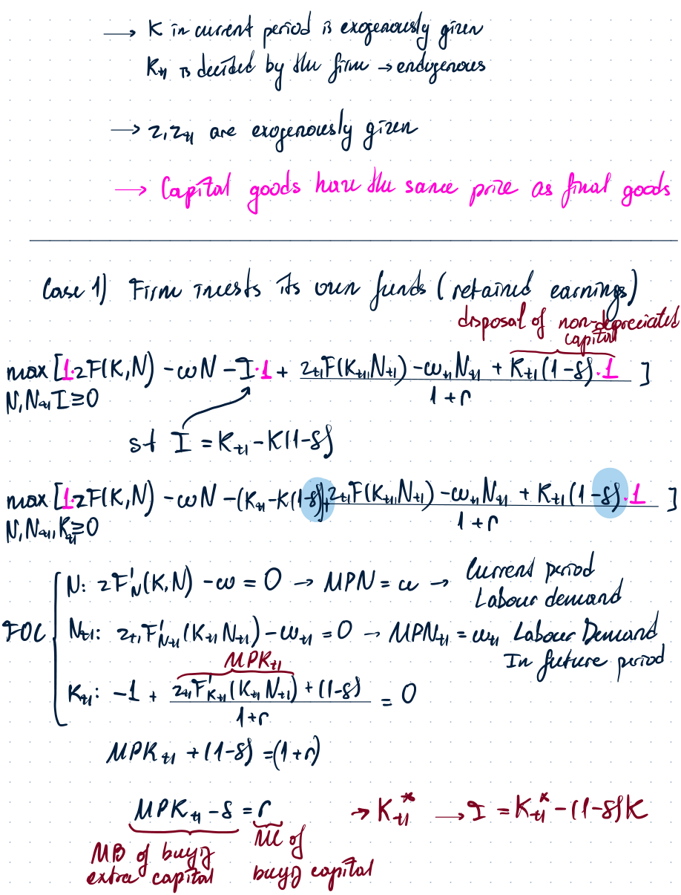

---

## Page 3 - Investment demand and borrowing case

The marginal product of capital is positive but diminishing under a neoclassical production function. Therefore the investment condition can be drawn as the intersection of the downward-sloping $MPK_{t+1}-\delta$ schedule with the horizontal real interest rate / user cost line.

### Case 2: firm invests using borrowed funds

The firm borrows to finance investment and repays debt in the future. The maximization problem can be written as:

$$
\max_{N_t,N_{t+1},K_{t+1}\ge 0}
\left[
 z_tF(K_t,N_t)-w_tN_t
 +\frac{z_{t+1}F(K_{t+1},N_{t+1})-w_{t+1}N_{t+1}
 -\bigl(K_{t+1}-K_t(1-\delta)\bigr)(1+r)}{1+r}
\right].
$$

The first-order conditions are the same as in the retained-earnings case:

$$
MPN_t=w_t,
$$

$$
MPN_{t+1}=w_{t+1},
$$

$$
MPK_{t+1}-\delta=r.
$$

Thus the source of finance does not change the firm's optimal capital-demand condition in this setup.

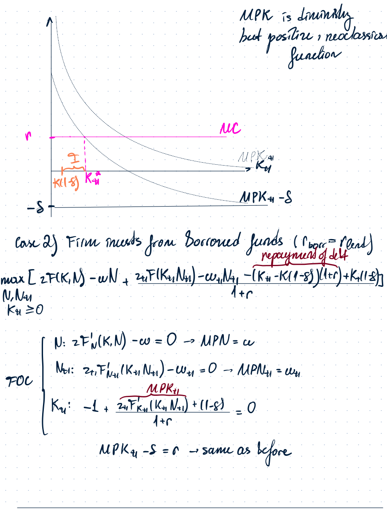

---

## Page 4 - Representative household problem

The household solves a utility maximization problem:

$$
\max_{c_t,c_{t+1},l_t,l_{t+1}\ge 0}
 u(c_t,l_t)+\beta u(c_{t+1},l_{t+1}),
$$

where $\beta$ is the subjective discount factor.

Assumptions:

$$
u'>0, \qquad u''<0.
$$

Preferences are convex and marginal rates of substitution are diminishing. Current consumption, future consumption, current leisure, and future leisure are treated as normal goods:

$$
c_t,\ c_{t+1},\ l_t,\ l_{t+1}\text{ are normal goods.}
$$

### Lifetime budget constraint

The intertemporal budget constraint can be written as:

$$
w_t l_t+c_t+rac{w_{t+1}l_{t+1}+c_{t+1}}{1+r}
=
 w_t h_t+v_t-T_t+rac{w_{t+1}h_{t+1}+v_{t+1}-T_{t+1}}{1+r}.
$$

Here:

- $h_t,h_{t+1}$ are time endowments;
- $l_t,l_{t+1}$ are leisure;
- $w_t,w_{t+1}$ are real wages;
- $v_t,v_{t+1}$ are dividends / non-labour income;
- $T_t,T_{t+1}$ are lump-sum taxes.

### Household first-order conditions

Current leisure-consumption margin:

$$
MRS(l_t,c_t)=\frac{u_l(c_t,l_t)}{u_c(c_t,l_t)}=w_t.
$$

Future leisure-consumption margin:

$$
MRS(l_{t+1},c_{t+1})=w_{t+1}.
$$

Intertemporal consumption Euler equation:

$$
MRS(c_t,c_{t+1})
=\frac{u_c(c_t,l_t)}{\beta u_c(c_{t+1},l_{t+1})}
=1+r.
$$

Intertemporal leisure condition:

$$
MRS(l_t,l_{t+1})
=\frac{u_l(c_t,l_t)}{\beta u_l(c_{t+1},l_{t+1})}
=\frac{w_t(1+r)}{w_{t+1}}.
$$

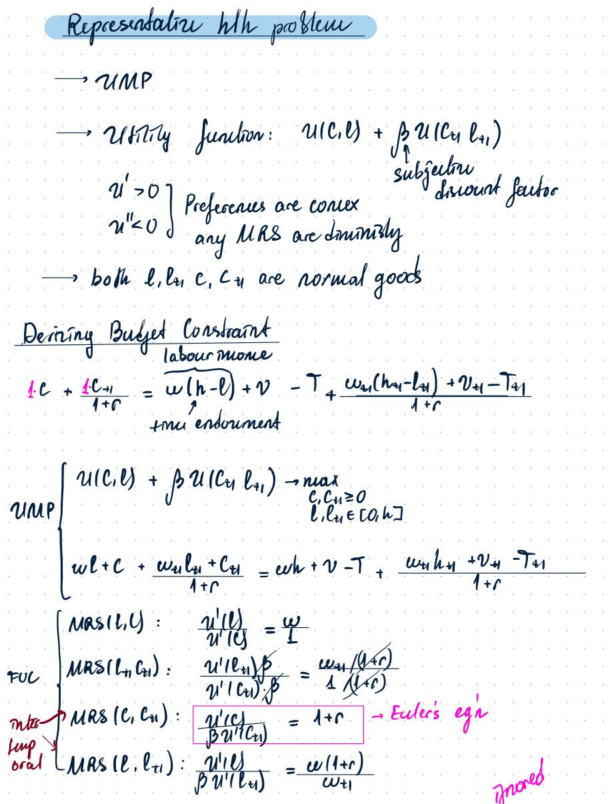

---

## Page 5 - Slopes, substitution effects, and wealth effects

If the slope of the household budget line changes, substitution effects and wealth effects are both relevant. The slope changes when one of the relative prices changes, for example:

$$
w_t,\quad r,\quad w_{t+1}.
$$

If other parameters of the budget constraint change, such as

$$
h_t,\ h_{t+1},\ T_t,\ T_{t+1},\ v_t,\ v_{t+1},
$$

then the change is a wealth effect only.

The slope of the budget constraint shows the relative price of current leisure in terms of future leisure. The steeper the budget constraint, the more expensive current leisure is.

To draw the leisure graph, fix $c_t$ and $c_{t+1}$ and draw $l_{t+1}$ against $l_t$.

### Increase in current wage $w_t$

If

$$
w_t\uparrow,
$$

then current-period leisure becomes more expensive. Substitution effect:

$$
l_t\downarrow \quad\Rightarrow\quad N_t^s\uparrow.
$$

The labour supply curve shifts upward / to the right. The notes state that wealth effects from changes in $r,w_t,w_{t+1}$ are ignored when using this graph.

### Increase in the real interest rate $r$

If

$$
r\uparrow,
$$

then current-period leisure becomes more expensive relative to future leisure. Substitution effect:

$$
l_t\downarrow \quad\Rightarrow\quad N_t^s\uparrow.
$$

The wealth effect from the redistribution caused by a change in $r$ is ignored in this simplified analysis.

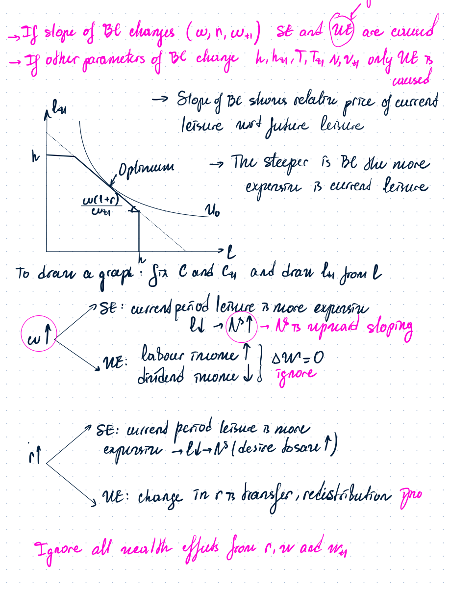

---

## Page 6 - Government budget constraint and labour market

Government purchases are exogenous:

$$
G_t,\ G_{t+1}\quad \text{exogenous}.
$$

The government budget constraint is:

$$
G_t=T_t+B_t,
$$

and in the future period:

$$
G_{t+1}=T_{t+1}-B_t(1+r).
$$

Solving for bonds:

$$
B_t=\frac{T_{t+1}-G_{t+1}}{1+r}.
$$

The present-value government budget constraint is:

$$
G_t+\frac{G_{t+1}}{1+r}
=
T_t+\frac{T_{t+1}}{1+r}.
$$

Thus $G_t$ and $G_{t+1}$ are exogenous, while $T_t$ and $T_{t+1}$ are endogenous. Taxes adjust to government spending, not the other way round.

Whenever $G_t$ or $G_{t+1}$ changes, the present value of taxes also changes, creating a wealth effect for the household.

### Labour market

Labour demand is chosen by the firm:

$$
MPN_t=w_t.
$$

Since the marginal product of labour is diminishing, labour demand is downward sloping.

Labour supply is chosen by the household through the UMP.

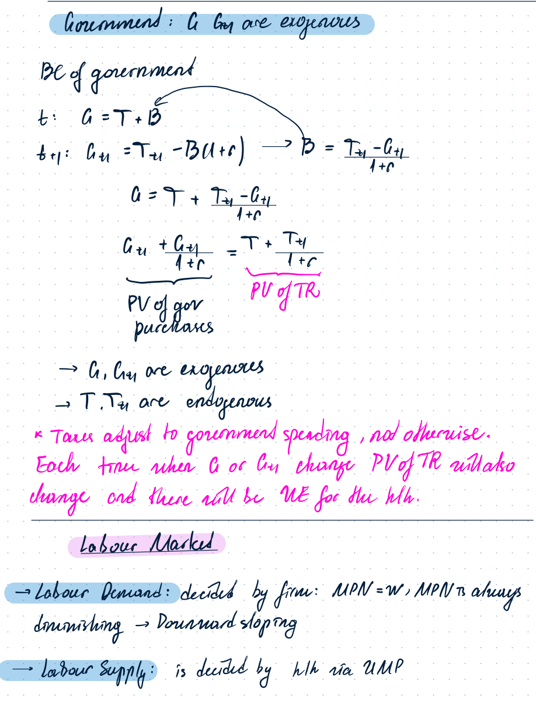

---

## Page 7 - Labour supply, output supply, and the real interest rate

### Labour supply response to $r\uparrow$

When the real interest rate rises, current leisure becomes more expensive. The substitution effect gives:

$$
l_t\downarrow \quad\Rightarrow\quad N_t^s\uparrow.
$$

With wealth effects ignored, the labour supply curve shifts to the right / upward.

### Output supply

Output supply is determined by the labour market:

$$
y^s=zF(K,N).
$$

Here $z$ and $K$ are exogenous. Since employment $N$ is determined in the labour market, changes in labour supply or labour demand affect output supply.

If $r\uparrow$, households want to save more and current leisure becomes more expensive. Therefore:

$$
l_t\downarrow \quad\Rightarrow\quad N_t^s\uparrow
\quad\Rightarrow\quad N\uparrow
\quad\Rightarrow\quad y^s\uparrow.
$$

This gives an upward-sloping output supply curve in the $(y,r)$ diagram.

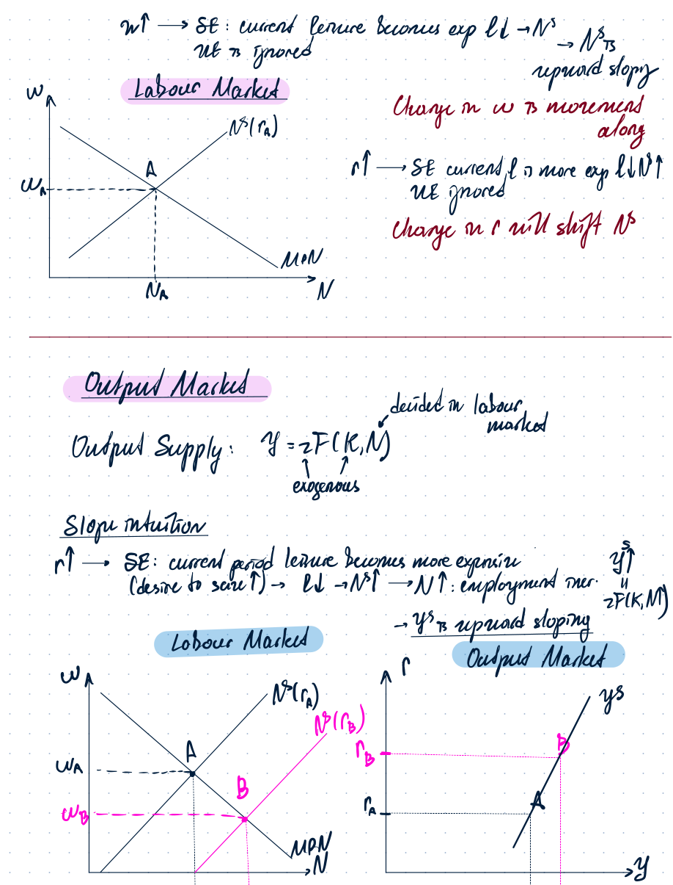

---

## Page 8 - Production function and output demand

### Production function

Output is determined by:

$$
y=zF(K,N).
$$

The production-function graph maps employment $N$ into output $y$.

### Shifting factors for output supply

Output supply shifts when factors affecting labour-market equilibrium or production change. The notes list labour-supply factors, labour-demand factors, and production factors. In the standard model, important exogenous variables include:

$$
z,\ z_{t+1},\ h_t,\ h_{t+1},\ K,\ \delta,\ G_t,\ G_{t+1},\ \beta.
$$

### Output demand

Output demand is written as:

$$
y^d=C(y,r)+I(r)+G.
$$

The output-market equilibrium condition is:

$$
P(y,r)=C(y,r)+I(r)+G-y^d=0.
$$

Differentiating implicitly gives the slope of the output-demand curve:

$$
\frac{dr}{dy}
=-\frac{\partial P/\partial y}{\partial P/\partial r}
=\frac{1-C_y}{C_r+I_r}<0,
$$

because $C_y<1$ and $C_r+I_r<0$.

If the real interest rate rises:

$$
r\uparrow,
$$

then current consumption becomes more expensive, so

$$
c_t\downarrow.
$$

Investment also falls because the real cost of capital rises:

$$
K_{t+1}\downarrow \quad\Rightarrow\quad I_t\downarrow.
$$

Therefore output demand is downward sloping in the $(y,r)$ diagram.

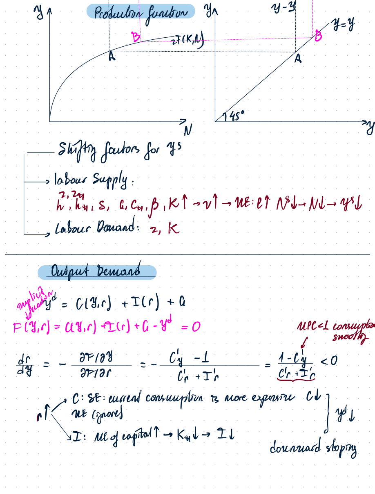

---

## Page 9 - Graphical derivation of output demand and shifting factors

The graphical derivation uses aggregate expenditure:

$$
AE=C(r)+I(r)+G.
$$

The output-demand level is found from the intersection of aggregate expenditure with the $45^\circ$ line:

$$
y=AE.
$$

Shifting factors for output demand include:

- government purchases: $G$;
- investment determinants such as $K$, $\delta$, and future productivity / profitability terms;
- consumption determinants, mainly household wealth.

A standard list of exogenous variables in the model is:

$$
z_t,\ z_{t+1},\ h_t,\ h_{t+1},\ K_t,\ \delta,\ G_t,\ G_{t+1},\ \beta.
$$

### Class 4, Problem 1

Consider the neoclassical model of investment. In the lecture, current and future depreciation rates were not differentiated. Now suppose that capital is expected to depreciate faster in the future. The task is to formulate the profit maximization problem and derive investment demand. The key question is how investment responds to a higher expected depreciation rate of capital in the future.

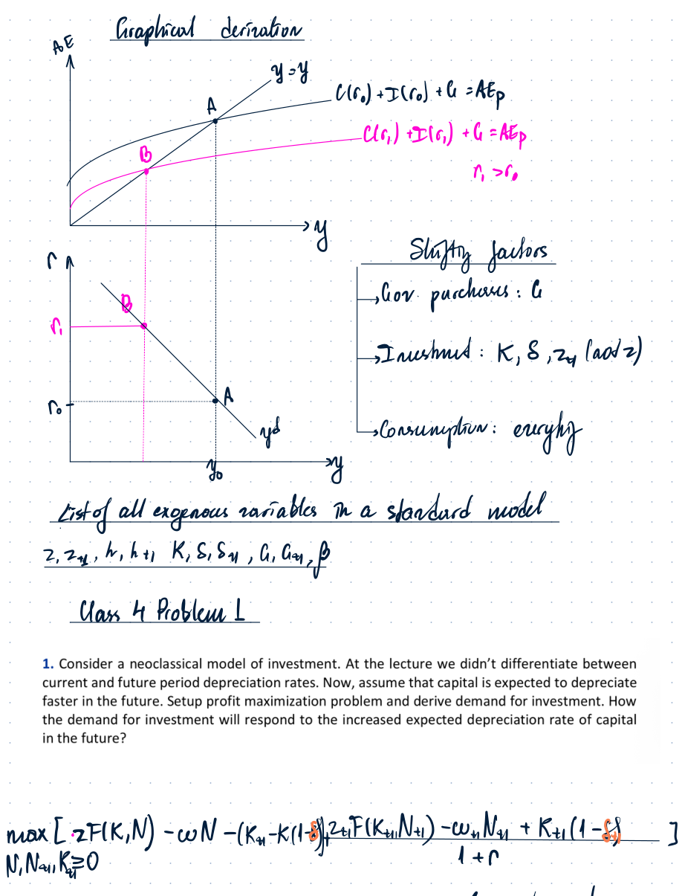

---

## Page 10 - Higher expected future depreciation and investment demand

With expected future depreciation written explicitly, the firm's capital-choice condition becomes:

$$
-1+\frac{MPK_{t+1}+(1-\delta_{t+1})}{1+r}=0.
$$

Thus:

$$
MPK_{t+1}-\delta_{t+1}=r.
$$

If the expected future depreciation rate rises,

$$
\delta_{t+1}\uparrow,
$$

then the net return to future capital falls:

$$
MPK_{t+1}-\delta_{t+1}\downarrow.
$$

Therefore the desired future capital stock falls:

$$
K_{t+1}^*\downarrow.
$$

Since investment is

$$
I_t=K_{t+1}^*-(1-\delta_t)K_t,
$$

investment falls:

$$
I_t\downarrow.
$$

Graphically, $MPK_{t+1}-\delta_{t+1}$ shifts downward and the chosen $K_{t+1}$ decreases.

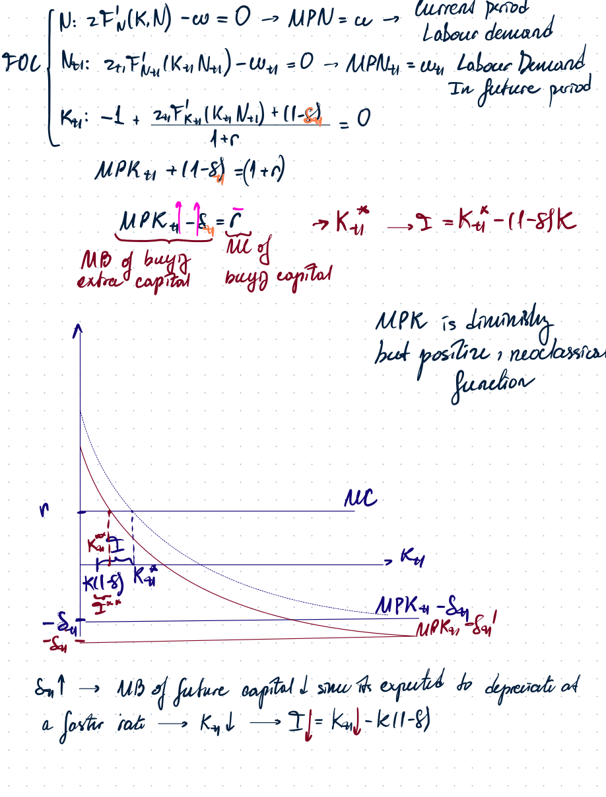

---

## Page 11 - Expected future depreciation shock in the RDGE model

### Problem setup

Consider a real intertemporal model with investment. A climate shock increases the expected depreciation of capital in the future, but it has no direct effect on the current period. There is no change in fiscal policy:

$$
\Delta G=0.
$$

The shock is:

$$
\Delta \delta_{t+1}>0.
$$

### Effect on output demand

Output demand is:

$$
y^d=C_t+I_t+G_t.
$$

Government purchases do not change:

$$
\Delta G_t=0.
$$

From the investment problem:

$$
\delta_{t+1}\uparrow \quad\Rightarrow\quad I_t\downarrow.
$$

Future profits also fall because future capital is expected to depreciate more and the proceeds from disposed capital are lower. This reduces household lifetime wealth. Since consumption is normal:

$$
WE\downarrow \quad\Rightarrow\quad C_t\downarrow.
$$

Therefore output demand shifts left:

$$
y^d\downarrow.
$$

### Effect on output supply

Output supply is:

$$
y^s=zF(K,N).
$$

The shock does not directly change current productivity or current capital:

$$
\Delta z=0,\qquad \Delta K=0.
$$

However, lower wealth affects labour supply. Since leisure is normal, lower wealth reduces desired leisure and increases labour supply. Employment rises and output supply shifts to the right.

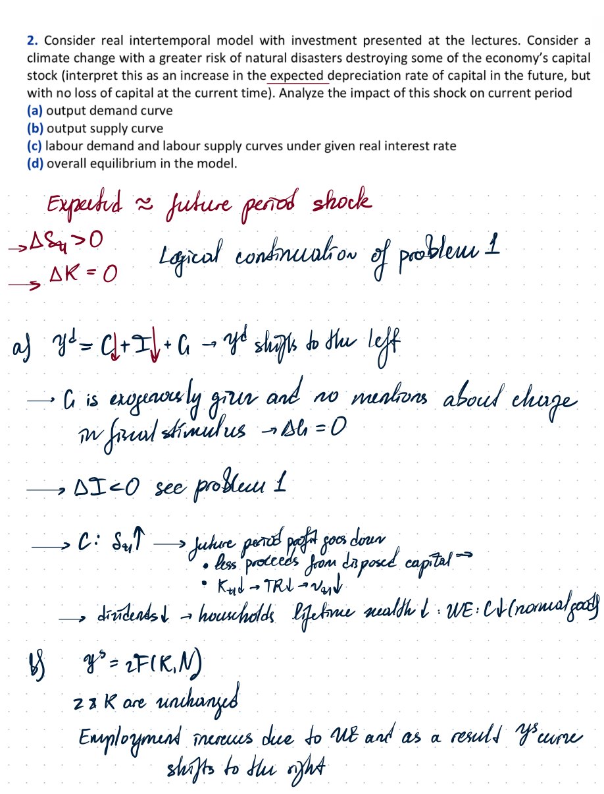

---

## Page 12 - Labour-market and output-market effects of the expected depreciation shock

Labour demand is chosen by firms:

$$
zF_N(K,N)=w.
$$

There is no direct labour-demand shift because $z$ and $K$ are unchanged.

Labour supply is chosen by households. The shock lowers household wealth. Since leisure is normal:

$$
WE\downarrow \quad\Rightarrow\quad l_t\downarrow \quad\Rightarrow\quad N_t^s\uparrow.
$$

Thus labour supply shifts right, employment rises, and the wage falls:

$$
N\uparrow,\qquad w\downarrow.
$$

In the output market:

- output demand shifts left because both consumption and investment fall;
- output supply shifts right because employment rises through the wealth effect.

The notes emphasize that the output-demand shift is stronger because output supply shifts only through a secondary wealth effect, while output demand shifts through both the wealth effect and the direct fall in investment.

Therefore the likely result is:

$$
y\downarrow,\qquad r\downarrow.
$$

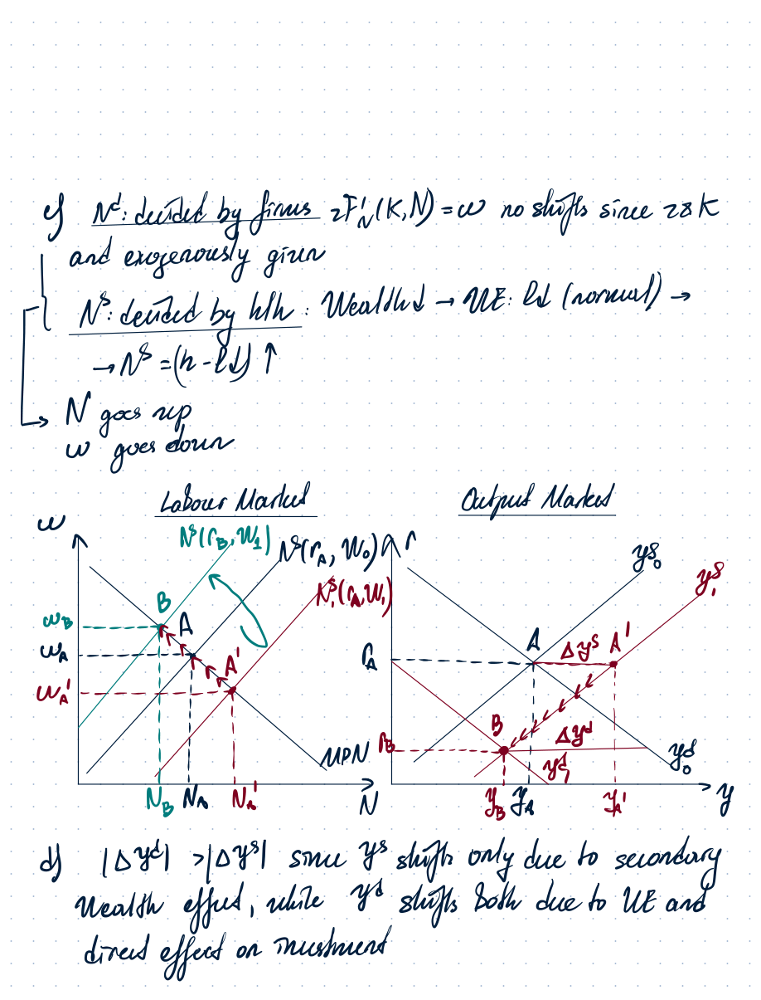

---

## Page 13 - Adjustment after the interest rate changes

The notes conclude:

$$
\Delta y<0
$$

because the demand shock is stronger, and

$$
\Delta r<0.
$$

After the real interest rate falls, there is an adjustment in the labour market:

$$
r\downarrow.
$$

Current-period leisure becomes cheaper. The substitution effect gives:

$$
l_t\uparrow \quad\Rightarrow\quad N_t^s\downarrow.
$$

So labour supply shifts back left after the interest-rate adjustment.

### Business-cycle comparison table copied in the notes

| Variable | Cyclicality | Lead/Lag | Variation relative to GDP |
|---|---:|---:|---:|
| Consumption | Procyclical | Coincident | Smaller |
| Investment | Procyclical | Coincident | Larger |
| Price level | Countercyclical | ? | Smaller |
| Money supply | Procyclical | Leading | Smaller |
| Employment | Procyclical | Lagging | Smaller |
| Real wage | Procyclical | ? | ? |
| Average labour productivity | Procyclical | Coincident | Smaller |

The notes also summarize the demand decomposition as:

$$
\Delta y=\Delta C+\Delta I+\Delta G.
$$

Here $\Delta G=0$, while $\Delta C$ and $\Delta I$ are endogenous responses.

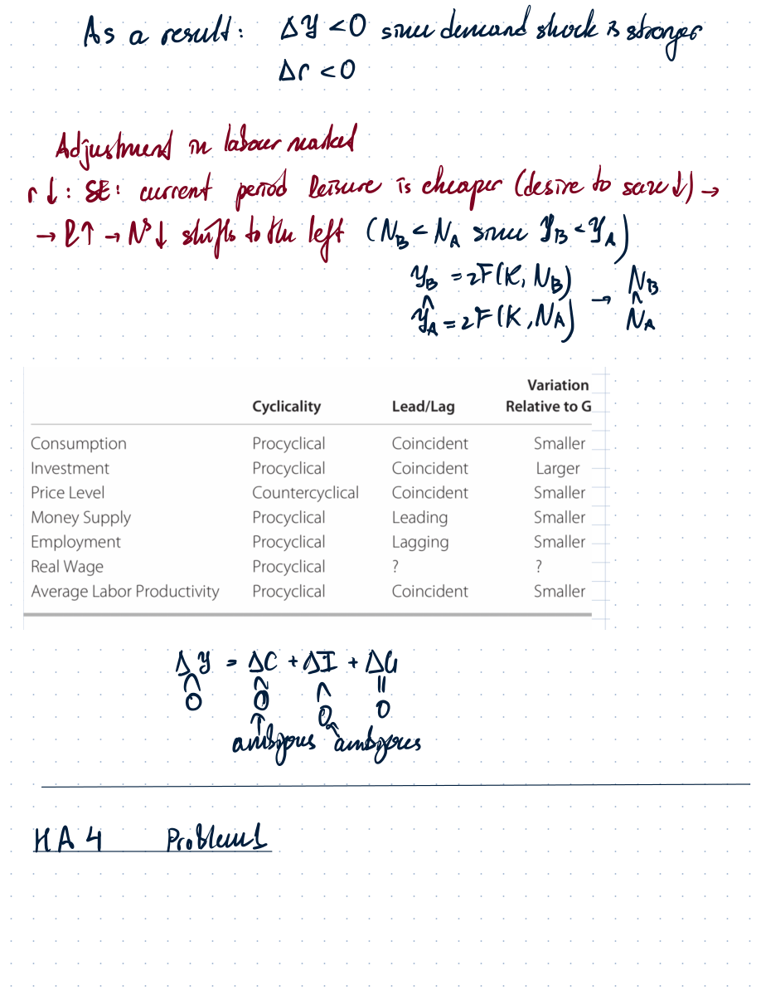

---

## Page 14 - HA4 Problem 1: capital-goods price in the investment model

The problem asks to treat capital goods as equivalent to other goods. Let:

- $P_t$ be the price of final goods;
- $P_t^K$ be the price of capital goods.

The nominal firm problem can be written as:

$$
\max_{N_t,N_{t+1},K_{t+1}\ge 0}
\left[
P_t z_tF(K_t,N_t)-W_tN_t-igl(K_{t+1}-K_t(1-\delta)\bigr)P_t^K
+\frac{P_{t+1}z_{t+1}F(K_{t+1},N_{t+1})-W_{t+1}N_{t+1}+K_{t+1}(1-\delta)P_{t+1}^K}{1+i}
\right].
$$

The capital FOC can be rearranged as:

$$
P_{t+1}MPK_{t+1}
=
(1+i)P_t^K-(1-\delta)P_{t+1}^K.
$$

Equivalently, in real terms:

$$
MPK_{t+1}
=
\frac{(1+i)P_t^K-(1-\delta)P_{t+1}^K}{P_{t+1}}.
$$

Intuition: if the future capital-goods price rises relative to the current price,

$$
P_{t+1}^K\uparrow,
$$

then the benefit from holding capital into the future rises and desired future capital increases:

$$
K_{t+1}\uparrow.
$$

The page also begins another problem on the effect of a fall in a foreign real interest rate on the domestic economy.

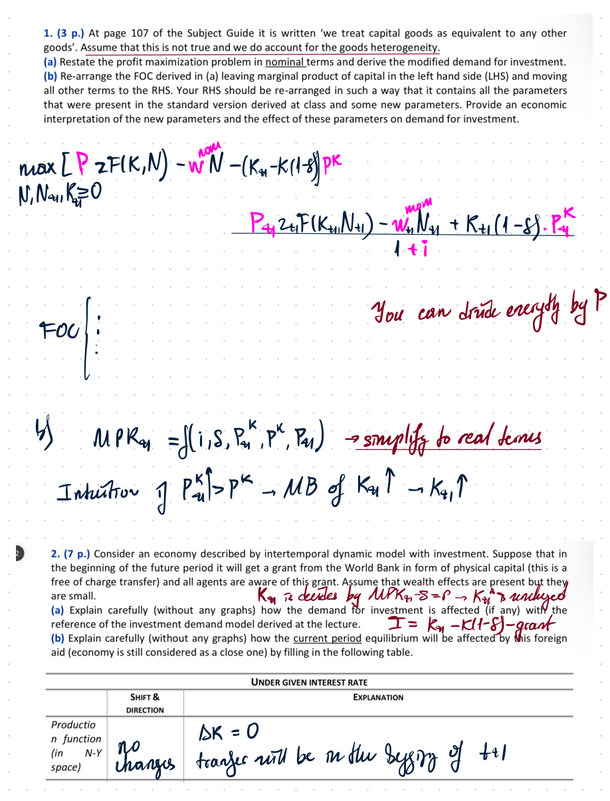

---

## Page 15 - Foreign interest-rate shock: table of curve shifts

The notes fill a table for the case of a fall in the foreign real interest rate under a given domestic real interest rate.

Under the given interest rate:

| Curve / object | Shift or movement | Explanation |
|---|---:|---|
| Production function in $(N,y)$ space | No change | $y=zF(K,N)$; $z$ and $K$ are exogenous and unchanged. |
| Labour supply curve | Left | Dividends / wealth increase; since leisure is normal, $l\uparrow$ and $N^s\downarrow$. |
| Labour demand curve | No change | $z$ and $K$ are unchanged. |
| Output demand curve | Left | $y^d=C_t+I_t+G_t$; the consumption component changes through the wealth effect. |
| Output supply curve | Left | Lower labour supply reduces employment; $N\downarrow$, so $y^s=zF(K,N)\downarrow$. |
| Adjustment of interest rate | Depends on relative shift sizes | The notes compare $|\Delta y^d|$ and $|\Delta y^s|$. |

After the domestic interest rate adjusts:

| Curve | Effect |
|---|---|
| Labour supply | Shifts left because lower $r$ makes current leisure cheaper, so $l\uparrow$ and $N^s\downarrow$. |
| Labour demand | Unchanged because it does not directly depend on $r$. |
| Output demand | No further curve shift from $r$; movement along the curve. |
| Output supply | No further curve shift from $r$; movement along the curve. |

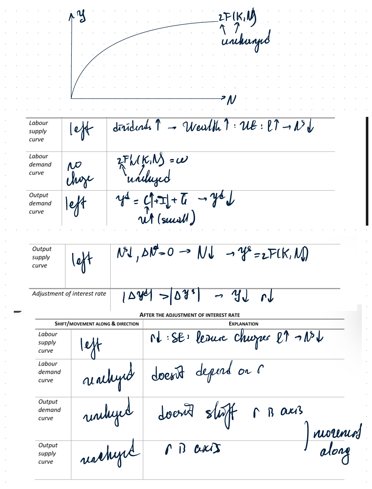

---

## Page 16 - Graphical illustration with labour market, production function, and output market

The page gives a required graphical format for the HA4 problem.

The task requires three diagrams:

1. Labour market.
2. Production function.
3. Goods / output market.

Notation in the graph:

- $E_0$ is the initial equilibrium.
- $E_1$ and $E_2$ show intermediate and final effects.
- Red shifts are attributed to substitution effects.
- Blue shifts are attributed to wealth effects.
- If a shift reflects simultaneous effects, use a colour that corresponds to the dominant effect.

The handwritten note at the bottom refers to the previous year's HA4 problem.

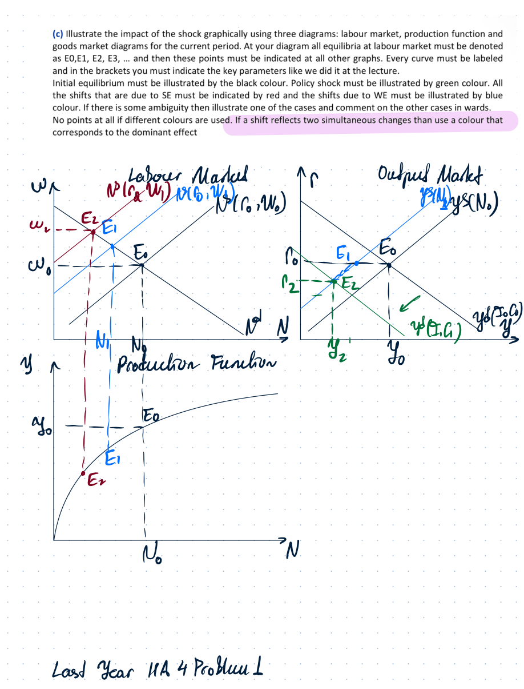

---

## Page 17 - Capital income tax problem: effect on capital per worker

### Problem setup

Output is produced by a neoclassical production function:

$$
y=F(K,N).
$$

Capital goods depreciate at rate $\delta$. Firms can borrow at the real interest rate $r$. All markets are perfectly competitive. Government taxes capital income at rate $\tau$ and redistributes the revenue to workers.

In steady state:

$$
I=K_{t+1}-K_t(1-\delta).
$$

Since $K_{t+1}=K_t=K$ in steady state,

$$
I^{ss}=\delta K.
$$

Perfect competition gives:

$$
MPK=r+\delta,
$$

and

$$
MPN=w.
$$

### Basic model

Without the tax:

$$
MPK(k^*)-\delta=r
\quad\Rightarrow\quad
MPK(k^*)=r+\delta.
$$

### Modified model with capital income tax

With a tax on capital income:

$$
(1-\tau)MPK(\tilde{k})=r+\delta,
$$

so

$$
MPK(\tilde{k})=\frac{r+\delta}{1-\tau}.
$$

Since

$$
\frac{r+\delta}{1-\tau}>r+\delta,
$$

we have

$$
MPK(\tilde{k})>MPK(k^*).
$$

Because $MPK$ is diminishing:

$$
\tilde{k}<k^*.
$$

Therefore an increase in the capital income tax reduces the optimal capital stock per worker.

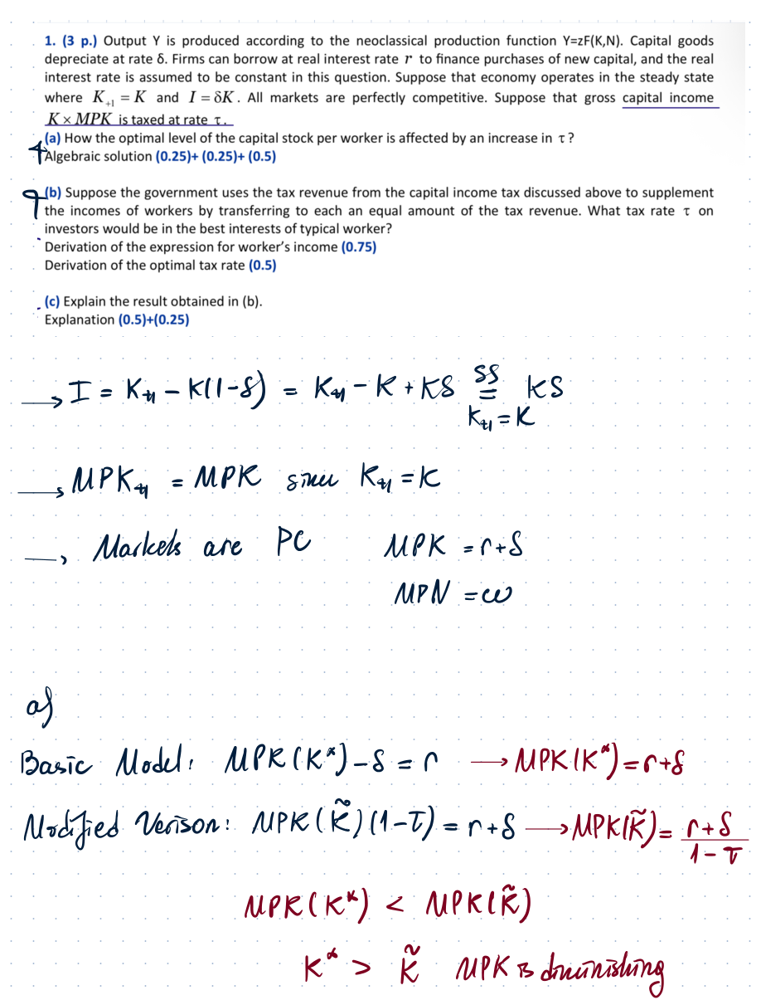

---

## Page 18 - Wage supplement financed by the capital income tax

Government uses tax revenue to supplement wages. The after-supplement wage is:

$$
w'=w+\frac{\tau\,MPK\cdot K}{N}.
$$

Using $k=K/N$:

$$
w'=MPN+\tau\,MPK\cdot k.
$$

For a constant-returns production function in intensive form $f(k)$:

$$
MPN=f(k)-kf'(k),
$$

and

$$
MPK=f'(k).
$$

Thus:

$$
w'=z f(k)-kz f'(k)+\tau kz f'(k),
$$

or

$$
w'=z f(k)-kz f'(k)(1-\tau).
$$

In steady state, $k=\tilde{k}(\tau)$ and the tax-distorted capital condition is:

$$
z f'(\tilde{k})=\frac{r+\delta}{1-\tau}.
$$

Substituting this into the wage expression gives:

$$
w'=z f(\tilde{k})-\tilde{k}(r+\delta).
$$

The objective is to choose $\tau\in[0,1]$ to maximize $w'$.

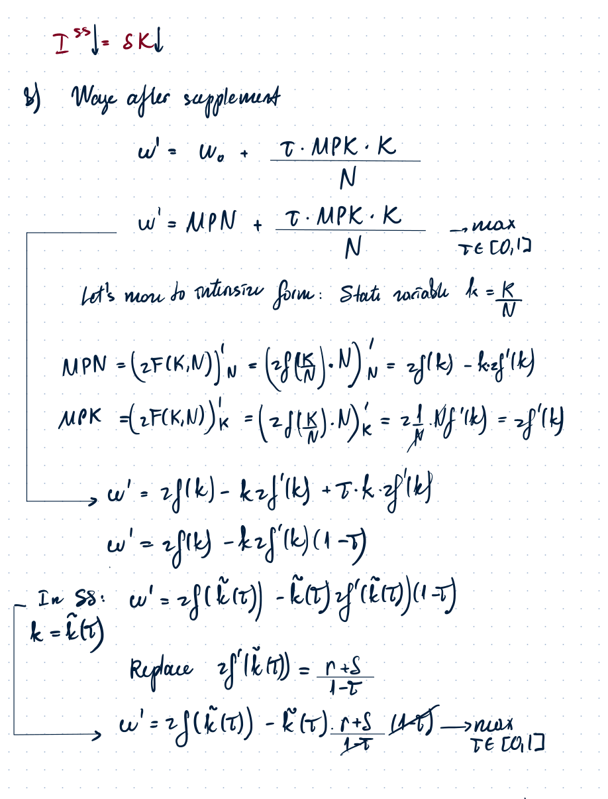

---

## Page 19 - Optimal capital tax and Problem 8

### Optimal tax conclusion

The derivative of the after-supplement wage with respect to the tax rate has the sign:

$$
\frac{dw'}{d\tau}
=
\tilde{k}'\left(\frac{r+\delta}{1-\tau}-(r+\delta)\right)<0.
$$

Therefore the after-supplement wage is decreasing in $\tau$. The optimal tax is:

$$
\tau^*=0.
$$

Intuition:

- Higher $\tau$ raises tax revenue and therefore allows a larger wage supplement per worker.
- But higher $\tau$ lowers steady-state capital per worker $k$.
- Lower capital makes workers less productive and reduces the base wage.
- The second effect dominates, so the optimal tax is zero.

### Problem 8: future government purchases

The next problem considers the intertemporal model with government purchases. Previously, the change in current government purchases was analysed. Now assume that government increases future purchases while current purchases are unchanged:

$$
\Delta G_t=0,
\qquad
\Delta G_{t+1}>0.
$$

The task is to analyse:

1. the output supply curve;
2. the output demand curve;
3. the resulting general equilibrium in the goods market and labour market;
4. effects on current output, employment, real wage, and real interest rate.

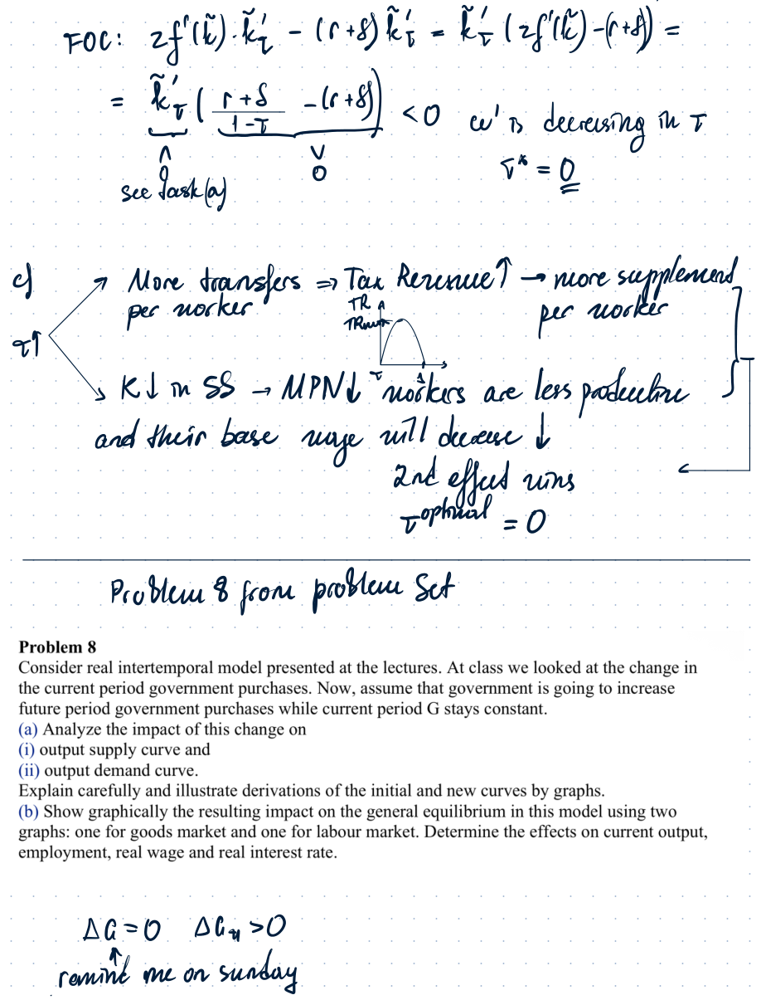

---

## Page 20 - Increase in future government purchases: curve shifts

Given:

$$
\Delta G_t=0,
\qquad
\Delta G_{t+1}>0.
$$

### Under the given interest rate

| Curve / object | Shift or movement | Explanation |
|---|---:|---|
| Production function in $(N,y)$ space | No change | $y=zF(K,N)$; $z$ and $K$ are exogenous and unchanged. |
| Labour supply curve | Shifts to the right | Higher future government purchases raise the present value of future taxes, reducing household wealth. Since leisure is normal, $l\downarrow$ and $N^s\uparrow$. |
| Labour demand curve | Unchanged | $z$ and $K$ do not change. |
| Output demand curve | Shifts down / left | $y^d=C_t+I_t+G_t$. Current $G_t$ is unchanged, investment is unchanged under the given $r$, but current consumption falls because wealth falls. |
| Output supply curve | Shifts to the right | Labour supply rises, employment rises, and $y^s=zF(K,N)$ increases. |

The notes compare the shifts and use the simple case where the fall in output demand is stronger than the rise in output supply.

### After interest-rate adjustment

If the real interest rate falls:

$$
r\downarrow,
$$

then current leisure becomes cheaper. The substitution effect gives:

$$
l_t\uparrow \quad\Rightarrow\quad N_t^s\downarrow.
$$

So labour supply shifts back left after the interest-rate adjustment. Labour demand remains unchanged. Output demand and output supply then adjust mainly through movements along the curves.

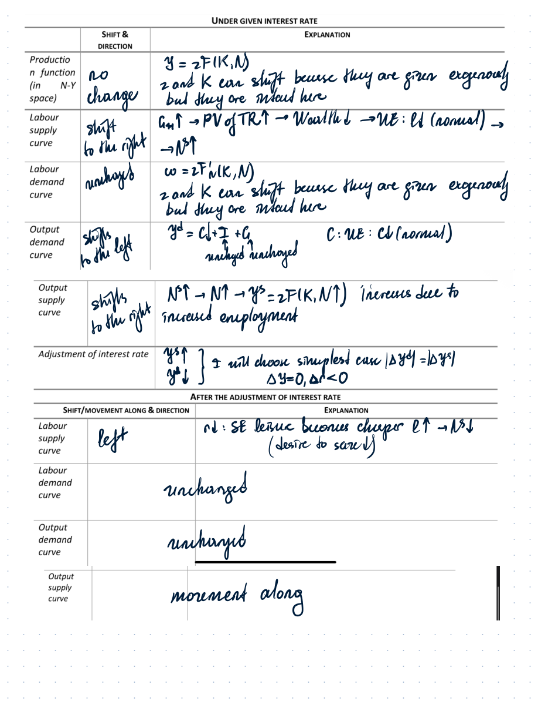

---

## Page 21 - Final labour-market and output-market diagrams

The final page gives the two-equilibrium diagram for the future-government-purchases shock.

### Labour market

The initial equilibrium is $E_0$. The labour supply curve shifts because household wealth changes:

$$
N^s(C,w)\rightarrow N^s(C',w).
$$

The new equilibrium is labelled $E_1$.

### Output market

The output-market graph shows shifts in output demand and output supply, with the final equilibrium labelled $E_1$. The diagram is used to determine the signs of:

$$
\Delta y,\quad \Delta N,\quad \Delta w,\quad \Delta r.
$$

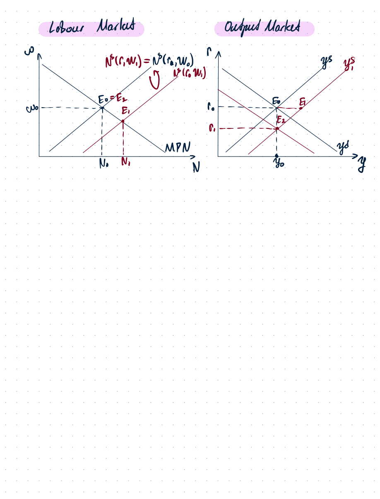
