# Week 5 - Fiscal Policy and Credit Market Imperfections

> Graphs, tables, and handwritten diagrams are preserved as page images after each page section. Mathematical expressions are written in LaTeX. Some handwritten fragments were normalized where the intended notation was clear; unclear marginal words are omitted rather than guessed.

---

## Page 1 - Class 5, Problem 1: future government purchases

Problem setup: the government plans to increase purchases in the future and announces this policy. Analyze the policy in a dynamic macroeconomic model.

Main diagrams: labour market and output market.

Initial equilibrium is denoted by $E_0$. The new equilibrium after the announcement is denoted by $E_1$.

In the labour market:

- labour supply shifts right: $N^s(r_1,w)$ relative to $N^s(r_0,w)$;
- labour demand is $MPN$;
- employment rises from $N_0$ to $N_1$;
- real wage falls from $w_0$ to $w_1$.

In the output market:

- output supply shifts right because employment rises;
- output demand shifts left;
- the real interest rate adjusts downward from $r_0$ to $r_1$.

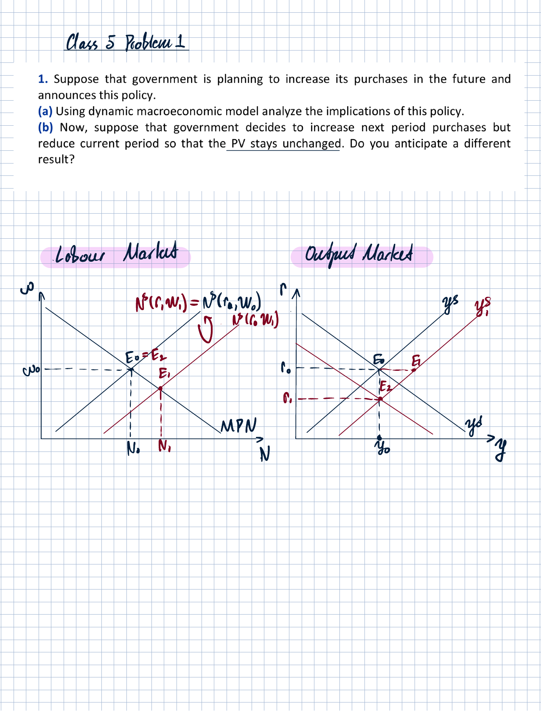

---

## Page 2 - Future government purchases under a given interest rate

Given interest rate case:

$$
\Delta G = 0, \qquad \Delta G_{+1} > 0.
$$

Under a given interest rate:

| Curve | Direction | Explanation |
|---|---:|---|
| Production function in $(N,y)$ space | no change | $y = zF(K,N)$, and $z,K$ are exogenous and unchanged. |
| Labour supply curve | shifts right | $G_{+1}\uparrow \Rightarrow PV(TR)\downarrow \Rightarrow$ wealth falls; since leisure is normal, desired leisure falls and $N^s$ rises. |
| Labour demand curve | unchanged | $zF_N(K,N)=w$, and $z,K$ are unchanged. |
| Output demand curve | shifts left | $y^d=C+I+G$; current consumption falls while $G$ is unchanged. |
| Output supply curve | shifts right | $N\uparrow \Rightarrow y^s=zF(K,N)\uparrow$. |
| Adjustment of interest rate | $r\downarrow$ | demand shock is stronger, so $\Delta y^d<\Delta y^s$ and output demand must be stimulated by a lower $r$. |

After the adjustment of the interest rate:

| Curve | Direction |
|---|---:|
| Labour supply | shifts left |
| Labour demand | unchanged |
| Output demand | unchanged |
| Output supply | movement along |

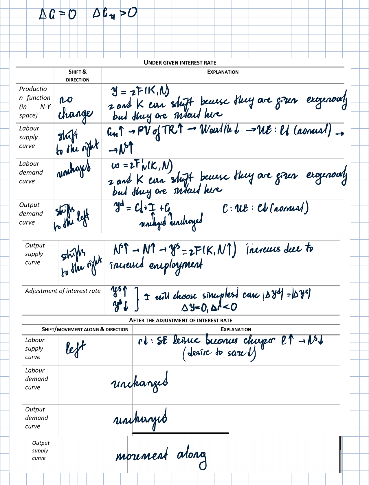

---

## Page 3 - Part (b): increase future purchases but reduce current purchases

Question: suppose the government wants to increase next-period purchases but reduce current-period purchases so that the present value of purchases remains unchanged. Do we anticipate a different result?

Government budget constraint:

$$
G + \frac{G_{+1}}{1+r}=T+\frac{T_{+1}}{1+r}.
$$

If the present value of taxes/transfers is unchanged, there is no wealth effect:

$$
PV(TR) \text{ unchanged} \Rightarrow WE=0.
$$

Then:

- labour demand: $w=zF_N(K,N)$ unchanged;
- labour supply: unchanged because there is no wealth effect;
- output supply: unchanged;
- output demand: shifts left because current government purchases fall.

The horizontal shift of output demand isolates the substitution effect:

$$
\Delta y^d = \Delta C + \Delta G,
$$
where the direct fiscal change is $\Delta G<0$ and the consumption response is smaller in absolute value.

Conclusion: with unchanged present value of government purchases/taxes, the labour market is unchanged and the main effect is a leftward shift of output demand.

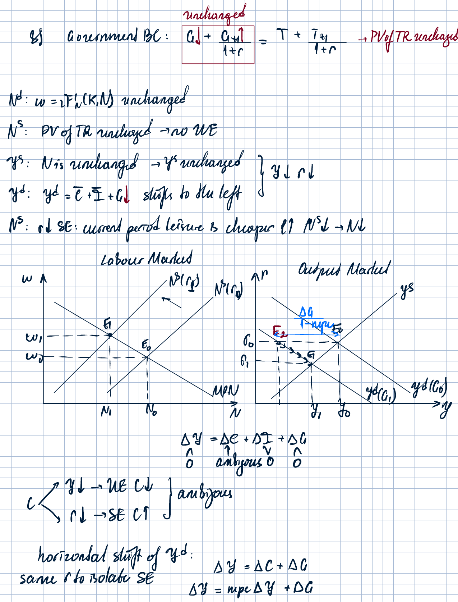

---

## Page 4 - Ricardian Equivalence

Ricardian Equivalence is mainly a partial-equilibrium result from the intertemporal choice model.

Core statement:

> Tax policy has no power to affect the optimal consumption plan if government spending plans are unchanged.

Therefore, the timing of taxes does not matter.

If taxes change but consumption does not change, Ricardian Equivalence holds.

Assumptions:

- taxes are lump-sum;
- all households share the same tax burden;
- perfect financial markets:
  - borrowing and saving have no interest-rate spread;
  - no liquidity constraints;
  - no transaction costs;
- infinite horizon planning;
- no uncertainty.

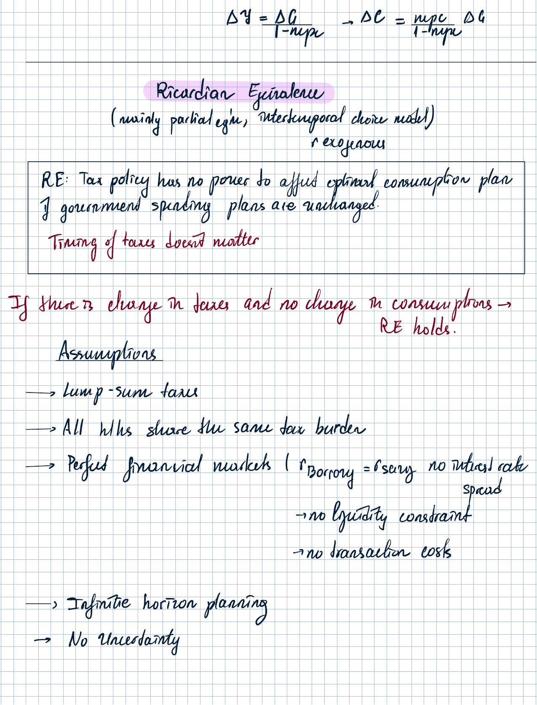

---

## Page 5 - Policy: current tax cut with unchanged spending plans

Policy: the government announces a current-period tax cut without changing spending plans.

Assume all Ricardian Equivalence assumptions hold.

Individual budget constraint:

$$
C+\frac{C_{+1}}{1+r}=y-t+\frac{y_{+1}-t_{+1}}{1+r}.
$$

Slope:

$$
\frac{dC_{+1}}{dC}=-(1+r).
$$

Endowment point:

$$
(y-t,\; y_{+1}-t_{+1}).
$$

Government budget constraint:

$$
G+\frac{G_{+1}}{1+r}=T+\frac{T_{+1}}{1+r}.
$$

With equal tax burden:

$$
T=Nt, \qquad T_{+1}=Nt_{+1}.
$$

Combined individual budget constraint:

$$
C+\frac{C_{+1}}{1+r}
= y+\frac{y_{+1}}{1+r}
-\frac{1}{N}\left(G+\frac{G_{+1}}{1+r}\right).
$$

If $G$ and $G_{+1}$ are unchanged, the combined budget constraint is unchanged. The household saves the tax cut because it expects higher future taxes.

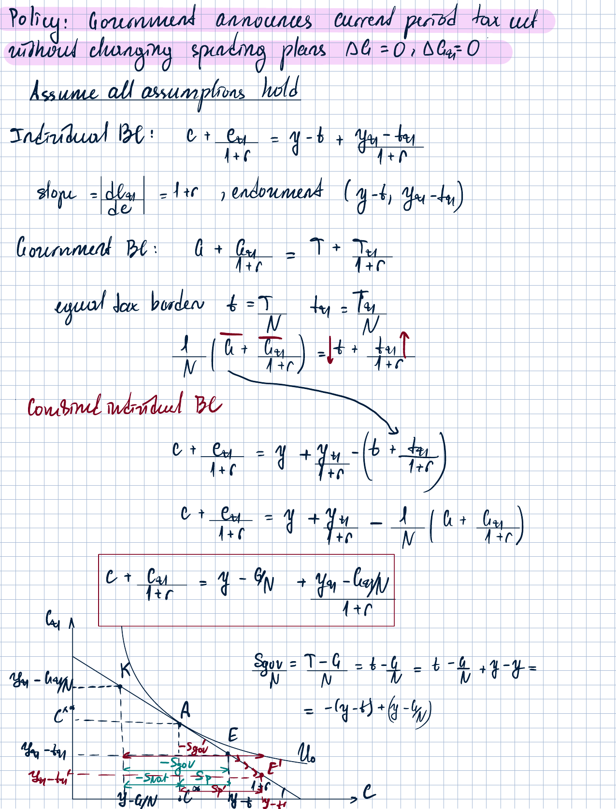

---

## Page 6 - Tax cut, bond market, and violations

A tax cut with unchanged spending means the government accumulates more debt, which must be repaid next period by higher taxes:

$$
\Delta t_{+1}=(1+r)\Delta t.
$$

Forward-looking households rationally expect the future tax increase and save the extra disposable income. The optimal consumption plan does not change.

Question: will the real interest rate change?

Bond market:

- bond supply is decided by the government;
- bond demand is decided by households.

Government bond supply:

$$
B^s = G-T.
$$

Household bond demand:

$$
B^d = y-T-C^*N.
$$

After the policy:

$$
\Delta B^s=-\Delta T,
$$

and the household saves exactly the tax cut, so bond demand shifts correspondingly. The interest rate need not change.

Violations of Ricardian Equivalence begin when its assumptions fail. The notes introduce a proportional consumption tax as the first violation.

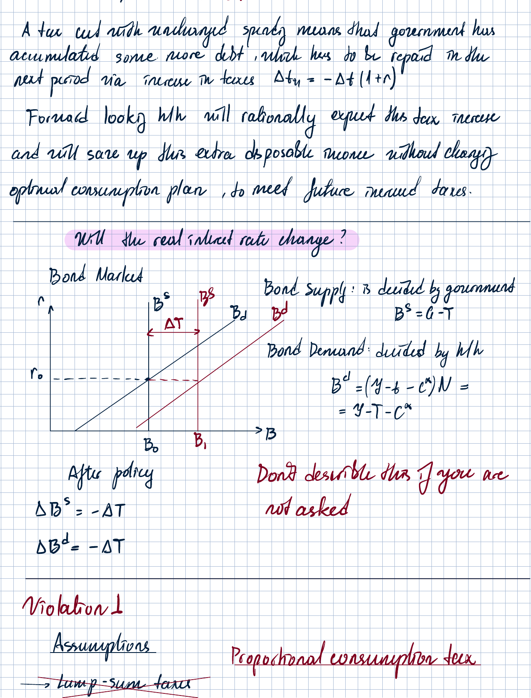

---

## Page 7 - Violation: proportional consumption tax

Ricardian Equivalence assumptions repeated:

- lump-sum taxes;
- equal tax burden;
- perfect financial markets:
  - no borrowing-saving interest-rate spread;
  - no liquidity constraints;
  - no transaction costs;
- infinite horizon planning;
- no uncertainty.

With a proportional consumption tax, the individual budget constraint is:

$$
C(1+\tau)+\frac{C_{+1}(1+\tau_{+1})}{1+r}
= y+\frac{y_{+1}}{1+r}.
$$

The slope is:

$$
\frac{dC_{+1}}{dC}
= -\frac{(1+\tau)(1+r)}{1+\tau_{+1}}.
$$

Endowment:

$$
\left(\frac{y}{1+\tau},\; \frac{y_{+1}}{1+\tau_{+1}}\right).
$$

Government budget constraint:

$$
\frac{1}{N}\left(G+\frac{G_{+1}}{1+r}\right)
= \tau C^* + \frac{\tau_{+1}C^*_{+1}}{1+r}.
$$

Important note: the individual and government budget constraints can only be combined at the optimal point. They are not the same constraint generally; they intersect at the optimum.

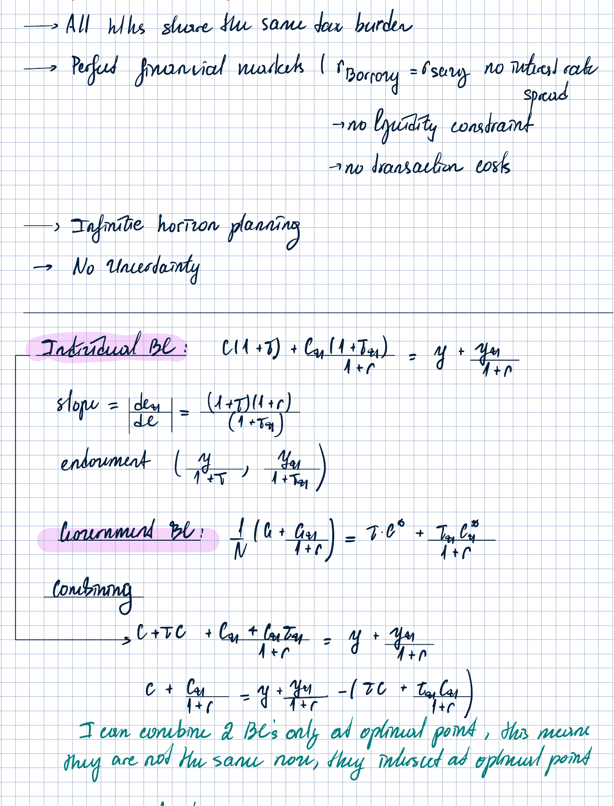

---

## Page 8 - Proportional tax and failure of Ricardian Equivalence

Assume initially:

$$
\tau=\tau_{+1}.
$$

The individual budget constraint and combined budget constraint coincide at the optimum.

Policy:

$$
\tau \downarrow, \qquad \tau_{+1}\uparrow.
$$

Then the individual budget constraint becomes flatter:

$$
\frac{(1+\tau)(1+r)}{1+\tau_{+1}} \downarrow.
$$

The combined budget constraint remains unchanged because $G$ and $G_{+1}$ are unchanged.

Substitution effect: current consumption becomes cheaper, so

$$
C\uparrow, \qquad C_{+1}\downarrow.
$$

The optimal consumption plan changes. Therefore, Ricardian Equivalence does not hold.

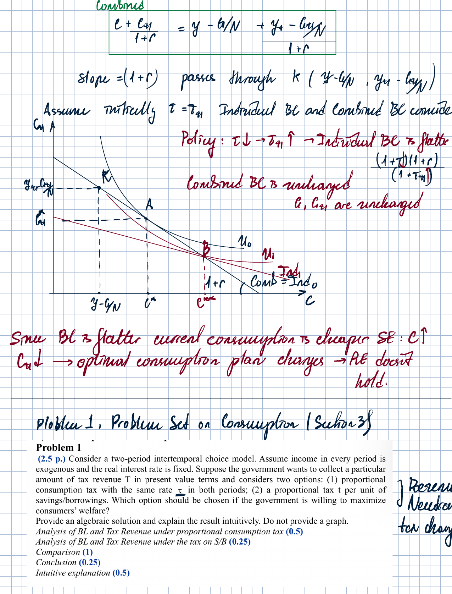

---

## Page 9 - Problem set on consumption: proportional consumption tax and saving tax

Partial-equilibrium model with exogenous incomes.

### 1. Proportional consumption tax

For tax rate $\tau$ in both periods:

$$
C_1(1+\tau)+\frac{C_2(1+\tau)}{1+r}
= y_1+\frac{y_2}{1+r}.
$$

Equivalently:

$$
C_1+\frac{C_2}{1+r}
= \frac{y_1}{1+\tau}+\frac{y_2}{(1+\tau)(1+r)}.
$$

Slope:

$$
-(1+r).
$$

Endowment:

$$
\left(\frac{y_1}{1+\tau},\;\frac{y_2}{1+\tau}\right).
$$

The household problem:

$$
\max_{C_1,C_2} u(C_1)+\beta u(C_2)
$$

subject to the tax-adjusted budget constraint.

### 2. Proportional saving tax

Period 1:

$$
C_1=y_1-S.
$$

Period 2:

$$
C_2=y_2+S(1-\tau)(1+r).
$$

Eliminating $S$:

$$
C_1+\frac{C_2}{(1-\tau)(1+r)}
= y_1+\frac{y_2}{(1-\tau)(1+r)}.
$$

Slope:

$$
-(1-\tau)(1+r),
$$
which is flatter than $-(1+r)$.

Endowment:

$$
(y_1,y_2).
$$

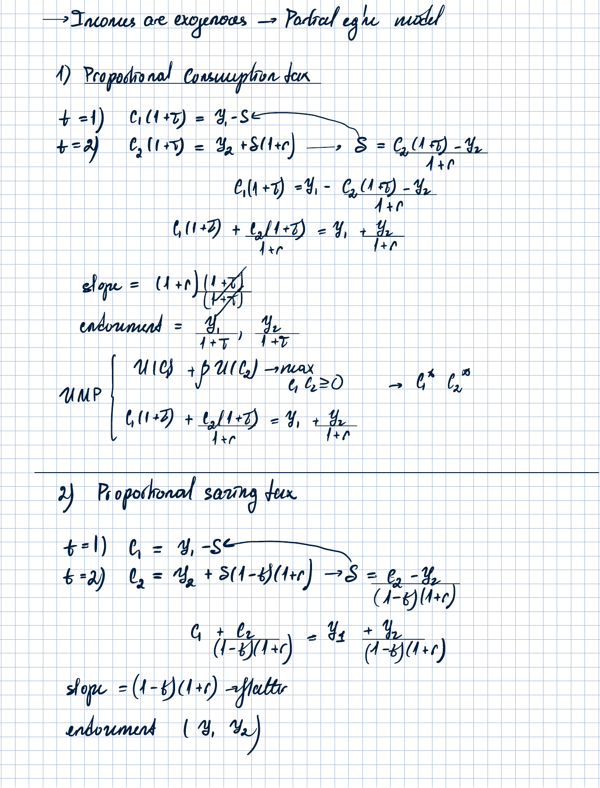

---

## Page 10 - Affordability check: consumption tax vs saving tax

The notes check whether the individual can afford the original optimum under different tax systems.

Under the proportional consumption tax, the relevant wealth expression can be written as:

$$
(1+\tau)\left(C_1+\frac{C_2}{1+r}\right)=W.
$$

Under a saving tax:

$$
C_1+\frac{C_2}{(1-\tau)(1+r)}=	ext{new wealth}.
$$

The old optimum bundle is compared with the new budget constraint to see whether it is still affordable.

The notes use this affordability test to apply the weak axiom of revealed preference style logic: if the old bundle is affordable under the new system, but the household chooses another bundle, the new bundle must be preferred.

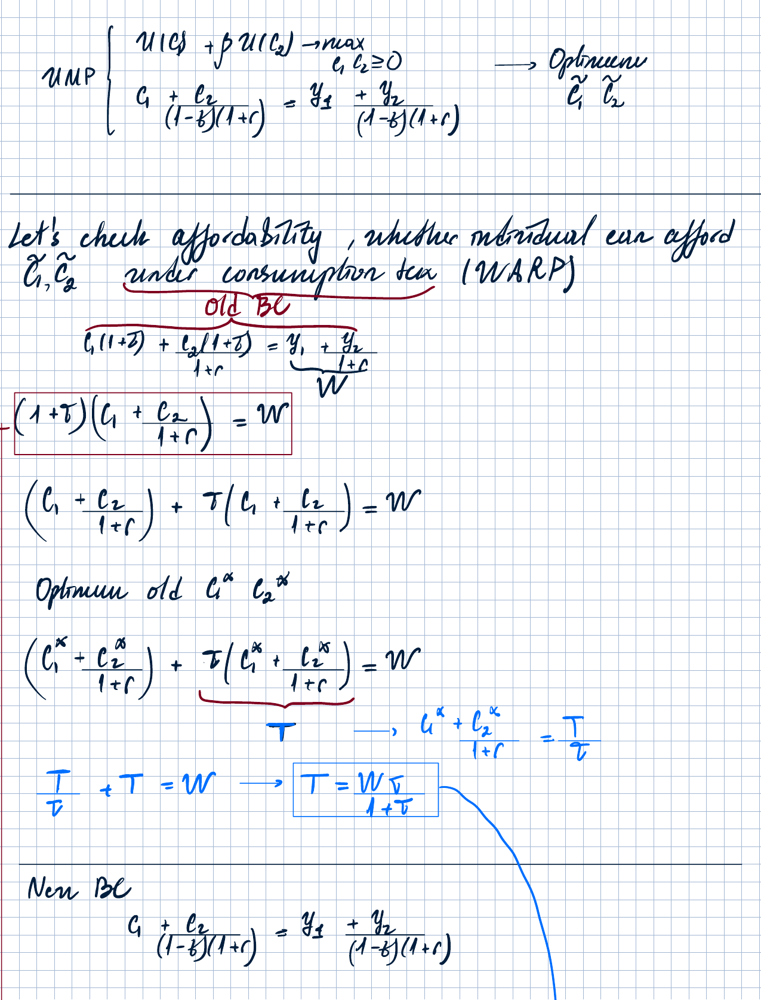

---

## Page 11 - Preferred bundle under saving tax

The new bundle $(\tilde C_1,\tilde C_2)$ is affordable under the consumption tax comparison.

The notes conclude:

$$
(\tilde C_1,\tilde C_2) \text{ was affordable under the consumption tax,}
$$

but the household still chose $(C_1^*,C_2^*)$. Therefore:

$$
U(C_1^*,C_2^*)>U(\tilde C_1,\tilde C_2).
$$

Conclusion: the consumption-tax allocation is preferred in the comparison shown in the graph.

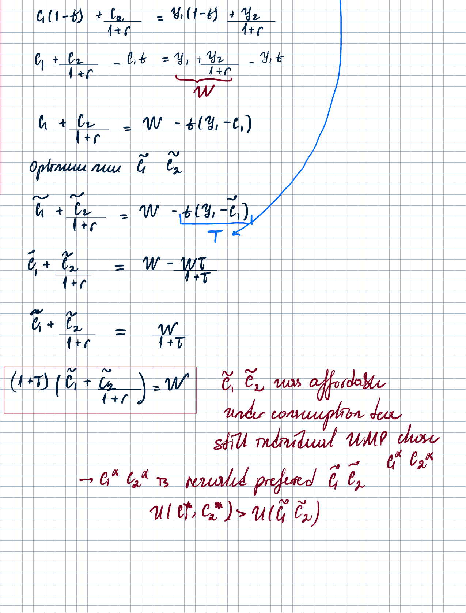

---

## Page 12 - Violation 2: liquidity constraint

Ricardian Equivalence assumptions:

- lump-sum taxes;
- all households share the same tax burden;
- perfect financial markets:
  - no borrowing-saving interest-rate spread;
  - no liquidity constraint;
  - no transaction costs;
- infinite horizon planning;
- no uncertainty.

Violation introduced here: households can borrow only up to a limited amount $L$.

The graph compares:

- no consumption tax / preferred bundle;
- consumption tax allocation;
- saving tax allocation;
- a binding borrowing constraint.

When the constraint binds, the household cannot reach the unconstrained optimum.

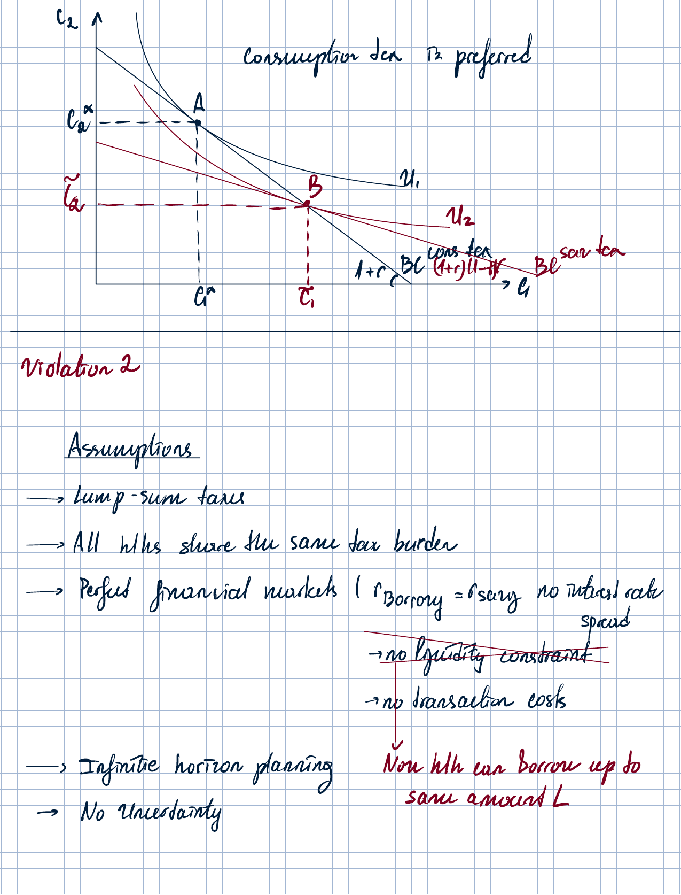

---

## Page 13 - Ricardian Equivalence with binding liquidity constraint

No binding liquidity constraint:

$$
C+\frac{C_{+1}}{1+r}=y-t+\frac{y_{+1}-t_{+1}}{1+r}.
$$

Binding liquidity constraint:

$$
C\le y-t+L.
$$

A tax cut policy:

$$
\Delta t<0,\qquad \Delta t_{+1}>0,
$$

where the government announces a current-period tax cut without changing spending plans. The current tax cut is followed by a future tax increase.

If the liquidity constraint binds, new points on the budget set become available. The optimal consumption plan changes, so Ricardian Equivalence does not hold.

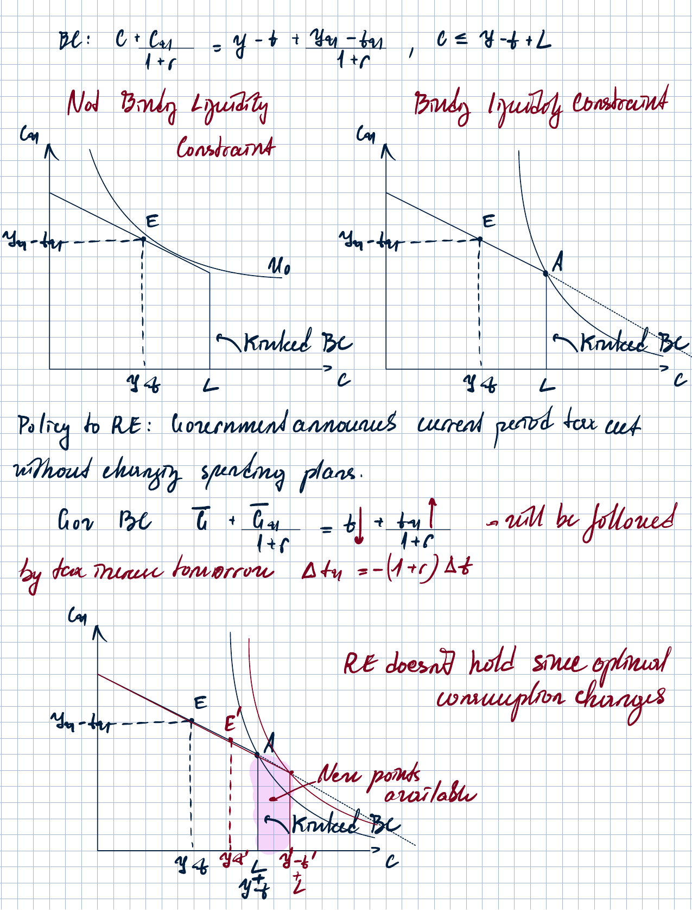

---

## Page 14 - Home Assignment 5, Problem 2: tax stimulus article

The page contains a problem based on a newspaper article about whether tax cuts can stimulate demand.

The article excerpt discusses a temporary VAT cut or a temporary sales-tax holiday. The idea is that if consumers know the tax cut is temporary, current consumption becomes relatively cheaper, so they may bring purchases forward.

Main comments in the notes:

1. A tax cut today: current consumption rises, so Ricardian Equivalence does not hold under the discussed policy.
2. A permanent tax increase/cut changes permanent income and affects consumption differently.
3. With a temporary consumption-tax cut, current consumption is cheaper. The substitution effect pushes $C$ up.

The page links this to the same intertemporal budget-constraint logic used above.

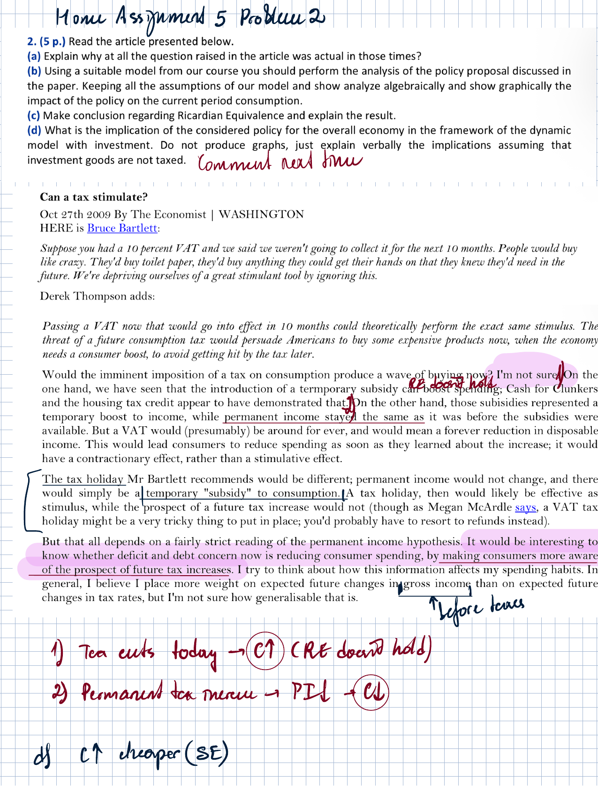

---

## Page 15 - HA5 comments and labour market with consumption/leisure taxes

If current leisure becomes more expensive, households want less leisure and supply more labour:

$$
\ell \downarrow, \qquad N^s \uparrow.
$$

Labour demand is unchanged. Employment rises:

$$
N \uparrow.
$$

Output supply shifts right:

$$
Y^s=zF(K,N)\uparrow.
$$

The notes then write the representative household problem with taxes in current and future periods:

$$
\max u(C,\ell)+\beta u(C_{+1},\ell_{+1})
$$

subject to an intertemporal budget constraint including wages, labour income, taxes, and transfers.

Key marginal-rate expressions indicate that taxes change the relative price of current leisure versus current consumption.

---

## Page 16 - HA5 Problem 1: extra labour costs for firms

Problem: the government introduces an extra cost $\beta$ per unit of labour in the current period.

Firm problem is modified by an additional current-period labour cost:

$$
\max_{N,N_{+1},K_{+1}}\left[ zF(K,N)-wN-\beta N + \frac{zF(K_{+1},N_{+1})-w_{+1}N_{+1}+K_{+1}(1-\delta)}{1+r} - I \right].
$$

Current-period labour-demand FOC:

$$
zF_N(K,N)-w-\beta=0,
$$
so

$$
MPN=w+\beta.
$$

Thus current labour demand shifts down by $\beta$.

Effects:

- $N^d$ shifts down;
- profits/dividends fall;
- household wealth falls;
- because leisure is normal, labour supply shifts right, but the shift is small;
- employment falls if the labour-demand shift dominates.

Output market:

$$
N\downarrow \Rightarrow Y^s\downarrow.
$$

Current output demand shifts left because consumption falls.

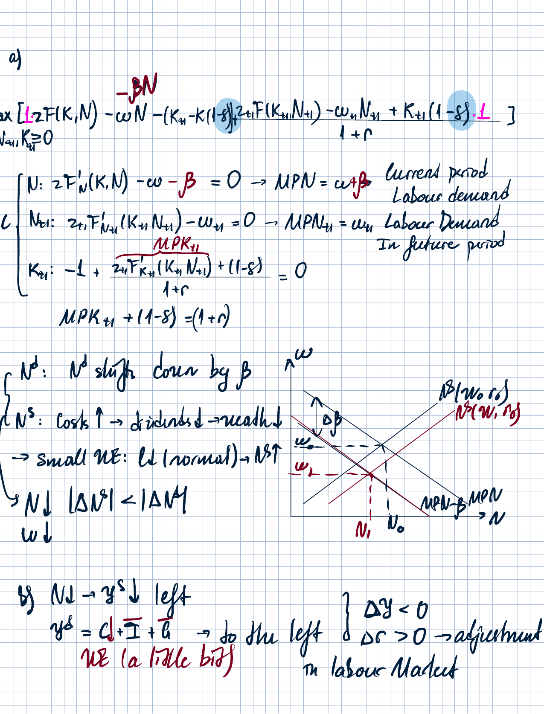

---

## Page 17 - Four-quadrant graph and liquidity constraint theory

The notes show a four-quadrant graph linking:

- labour market;
- output market;
- production function;
- equilibrium output and employment.

They note that $Y^s$ and $Y^d$ are both vertical in one representation and should be explained through the output-market/labour-market diagrams.

### Liquidity constraint theory

A liquidity constraint can be explained by limited commitment.

Collateral/limited commitment constraint:

$$
\frac{P_{+1}}{1+r}
$$

represents the present value of collateral or property in the future period. This determines the maximum amount of borrowing possible.

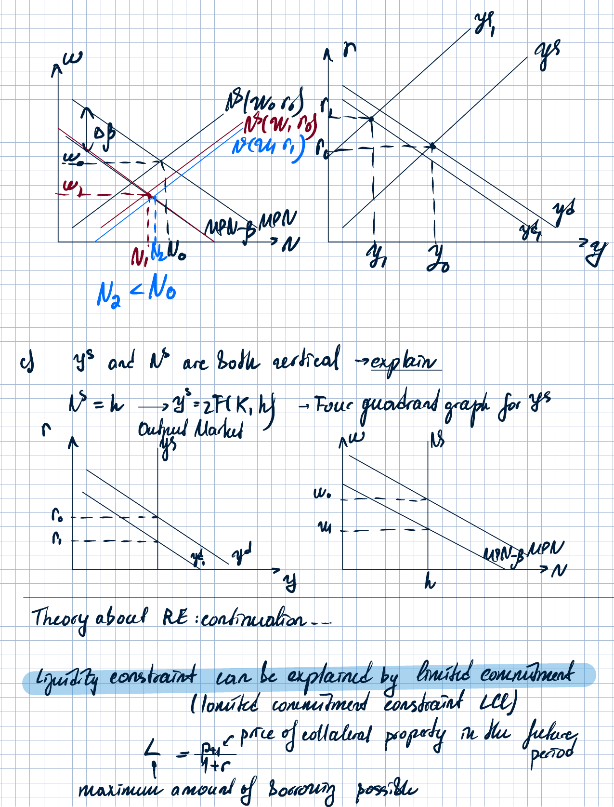

---

## Page 18 - Binding vs non-binding liquidity constraint

Budget constraint with collateral:

$$
C+\frac{C_{+1}}{1+r}=y_t+\frac{y_{t+1}}{1+r}+\frac{P_{t+1}}{1+r}.
$$

If the borrowing constraint binds, current consumption is limited by current income plus the amount that can be borrowed against collateral.

Shock 1: financial crisis; the liquidity constraint tightens:

$$
P_{t+1}\downarrow.
$$

For an unconstrained household, there is consumption smoothing:

$$
\Delta C<0, \qquad \Delta C_{+1}<0.
$$

For a constrained household, there is no consumption smoothing:

$$
\Delta C<0, \qquad \Delta C_{+1}=0.
$$

The binding constraint forces the current consumption drop to occur immediately.

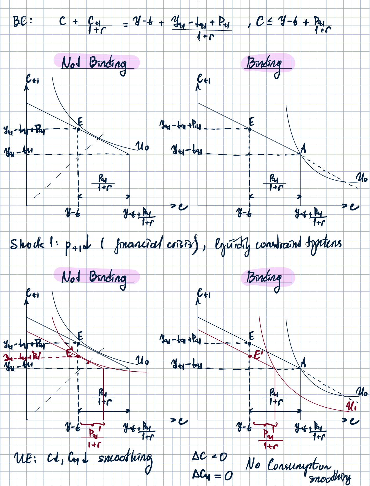

---

## Page 19 - Tax cut with binding constraint

Shock: current tax cut, $t\downarrow$.

For a non-binding household, the usual Ricardian logic applies: the household saves the tax cut because it expects future taxes.

For a binding household, the tax cut relaxes the constraint. Current consumption rises:

$$
C\uparrow.
$$

The page repeats Ricardian Equivalence assumptions and emphasizes the violated assumption:

- perfect financial markets fail because of a liquidity constraint.

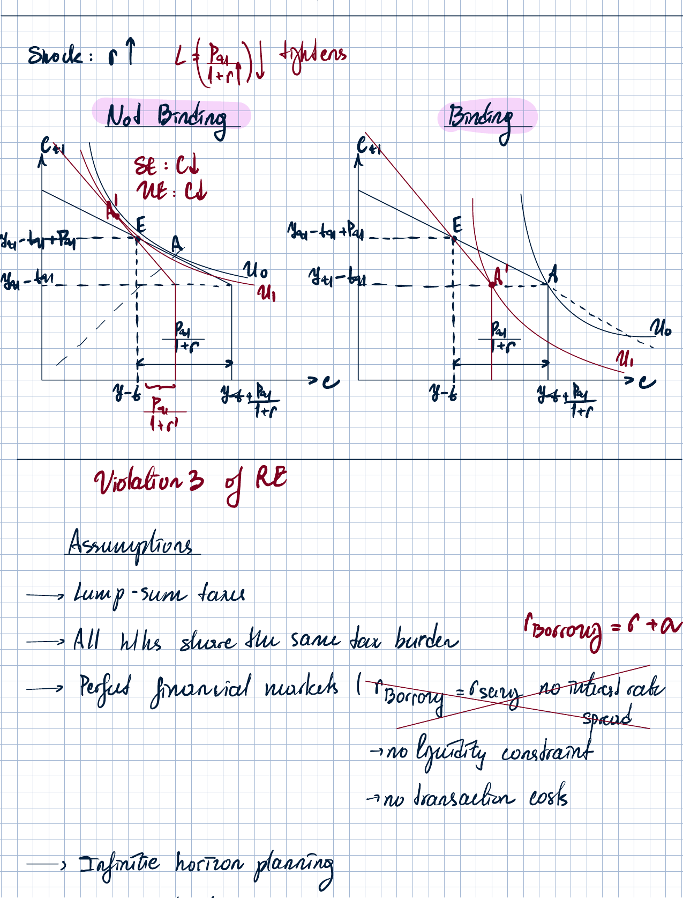

---

## Page 20 - Net lender and net borrower

Individual budget constraints:

For a lender:

$$
C+\frac{C_{+1}}{1+r}=y-t+\frac{y_{+1}-t_{+1}}{1+r}, \qquad C<y-t.
$$

For a borrower with borrowing rate $r+\alpha$:

$$
C+\frac{C_{+1}}{1+r+\alpha}=y-t+\frac{y_{+1}-t_{+1}}{1+r+\alpha}, \qquad C>y-t.
$$

Government budget constraint:

$$
\frac{1}{N}\left(G+\frac{G_{+1}}{1+r}\right)=t+\frac{t_{+1}}{1+r}.
$$

Tax cut policy:

$$
\Delta t<0, \qquad \Delta t_{+1}>0.
$$

For a net lender, optimal consumption does not change. Ricardian Equivalence holds for the lender.

For a net borrower, the interest-rate spread matters and Ricardian Equivalence can fail.

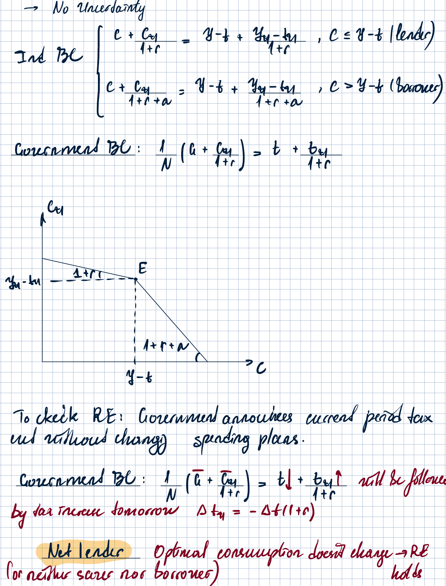

---

## Page 21 - Wealth effects for net borrower

For a lender, wealth is unchanged under the tax-timing change:

$$
W=y+\frac{y_{+1}}{1+r}-\left(t+\frac{t_{+1}}{1+r}\right).
$$

For a borrower, the household discounts future taxes using the borrowing rate $r+\alpha$, while the government budget uses $r$.

This creates a wealth effect:

$$
\Delta W>0.
$$

Because consumption is normal:

$$
C\uparrow, \qquad C_{+1}\uparrow.
$$

Therefore, the optimal consumption plan changes and Ricardian Equivalence does not hold for the borrower.

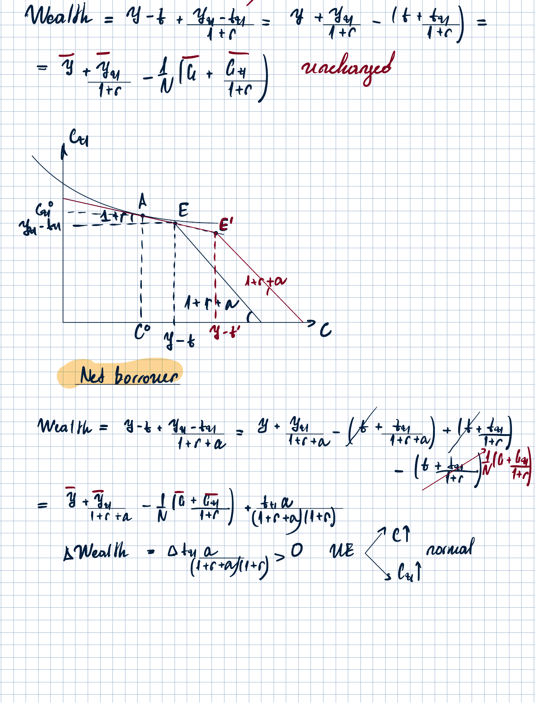

---

## Page 22 - Interest-rate spread from asymmetric information

An interest-rate spread can be explained by asymmetric information.

The lender does not know the borrower's type:

- good type with probability $1-\alpha$: repays;
- bad type with probability $\alpha$: does not repay.

Both good and bad types ask for the same loan amount $L$, so bad types mimic good types.

Loans are funded by safe deposits or bonds at rate $r$.

Expected profit of lenders:

$$
\pi = \alpha\cdot 0 + (1-\alpha)L(1+r_b)-L(1+r).
$$

With free entry/zero profit:

$$
\pi=0.
$$

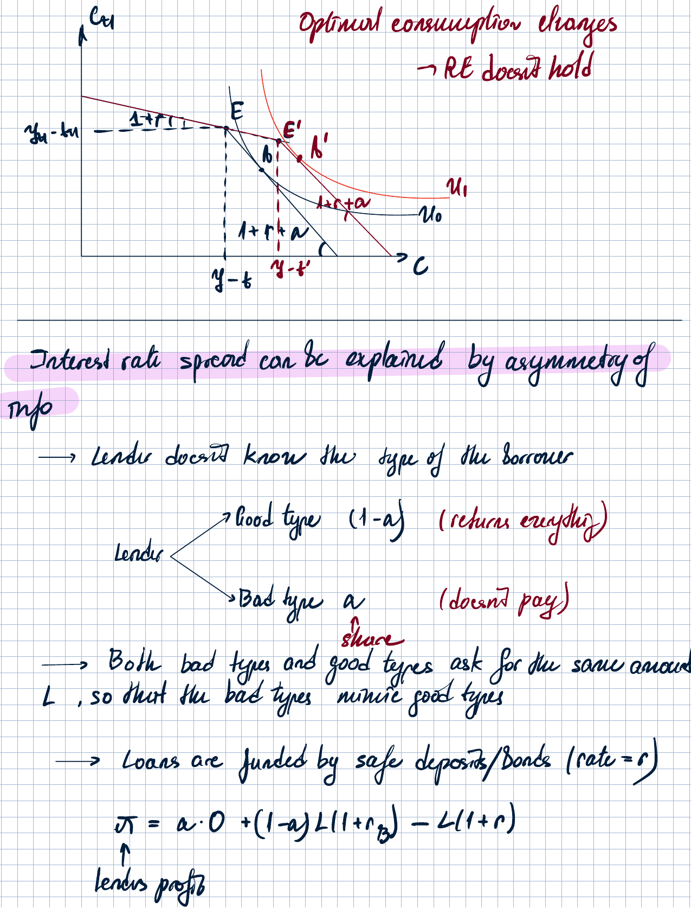

---

## Page 23 - Spread formula and firms borrowing funds

From the lender zero-profit condition:

$$
(1-\alpha)L(1+r_b)=L(1+r).
$$

Therefore:

$$
1+r_b=\frac{1+r}{1-\alpha},
$$

so

$$
r_b=\frac{1+r}{1-\alpha}-1
=\frac{r+\alpha}{1-\alpha}.
$$

The spread is:

$$
r_b-r=\frac{\alpha(1+r)}{1-\alpha}.
$$

If $\alpha\uparrow$, the spread rises.

The spread can also affect firms.

Firm needing borrowed funds faces borrowing rate $r+\alpha$ instead of $r$.

Firm objective includes repayment at the higher borrowing rate, so the investment FOC becomes:

$$
MPK_{+1}-\delta=r+\alpha.
$$

Higher spread lowers desired future capital and investment.

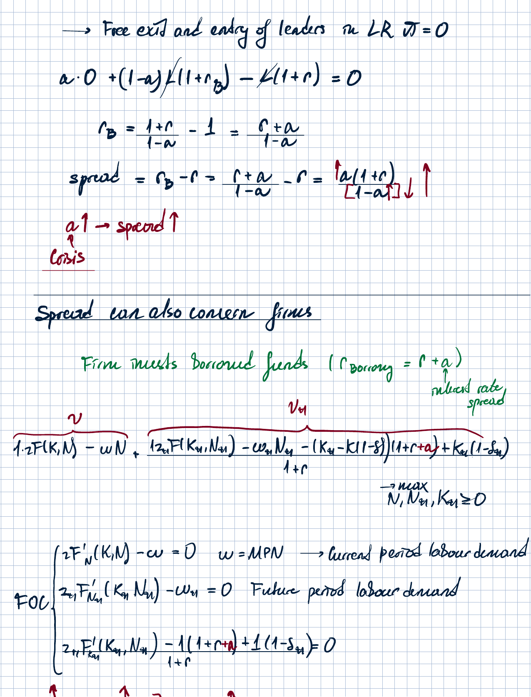

---

## Page 24 - Problem 1: interest income tax

Problem setup: two-period intertemporal choice model with utility

$$
u(c)+\frac{1}{1+\rho}u(c_{+1}),
$$

where $u'>0$ and $u''<0$.

The agent enters the world with no initial assets and earns income $y$ in period 1 and $y_{+1}$ in period 2.

Government initially raises revenue only by taxing interest income. The budget constraint is:

$$
C+\frac{C_{+1}}{1+(1-\tau)r}
= y+\frac{y_{+1}}{1+(1-\tau)r}.
$$

Questions covered:

1. Is the person a net borrower or a net lender under the interest-income tax?
2. What happens if the tax is replaced by a revenue-neutral lump-sum tax/subsidy?
3. If revenue is paid as a subsidy to everyone, what happens to first-period consumption?
4. Is this different from Ricardian Equivalence?

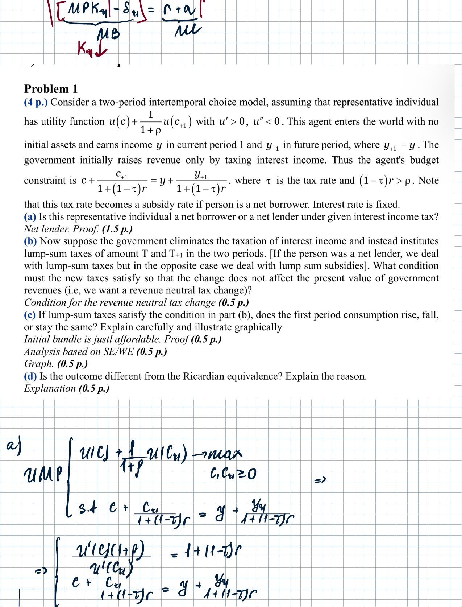

---

## Page 25 - Interest income tax: Euler equation and net lender result

Household problem:

$$
\max_{C,C_{+1}} u(C)+\frac{1}{1+\rho}u(C_{+1})
$$

subject to:

$$
C+\frac{C_{+1}}{1+(1-\tau)r}
= y+\frac{y_{+1}}{1+(1-\tau)r}.
$$

Euler equation:

$$
\frac{u'(C)}{u'(C_{+1})}
=\frac{1+(1-\tau)r}{1+\rho}.
$$

In the notes, the result implies:

$$
C<C_{+1}.
$$

Therefore:

$$
C<y,
$$

so the person is a net lender.

### Revenue-neutral tax change

Old budget line with interest-income tax:

$$
C+\frac{C_{+1}}{1+(1-\tau)r}=y+\frac{y_{+1}}{1+(1-\tau)r}.
$$

New budget line with lump-sum taxes:

$$
C+\frac{C_{+1}}{1+r}=y-T+\frac{y_{+1}-T_{+1}}{1+r}.
$$

The tax reform is revenue-neutral:

$$
TR=0.
$$

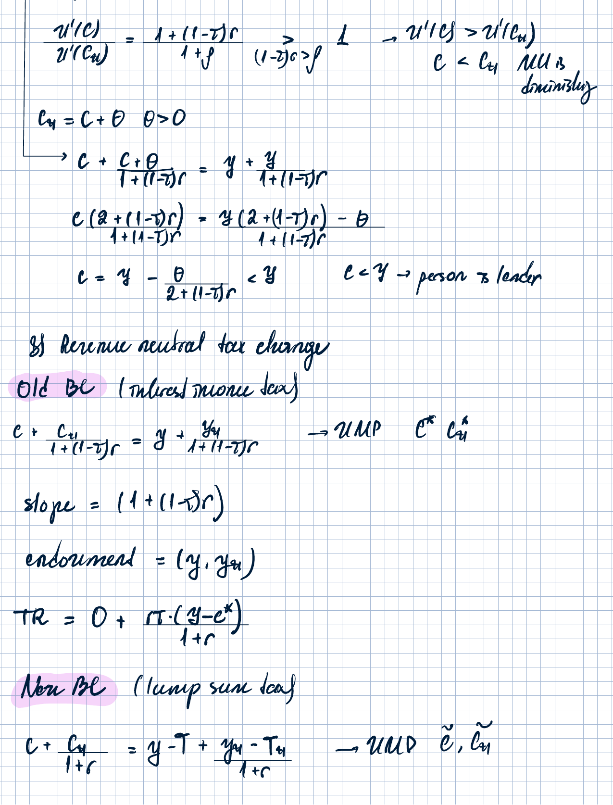

---

## Page 26 - Revenue neutrality and affordability

The new budget line with lump-sum tax has slope:

$$
-(1+r),
$$
which is steeper than under the interest-income tax.

Endowment after lump-sum taxes:

$$
(y-T,\; y_{+1}-T_{+1}).
$$

Revenue-neutral tax change condition:

$$
\tau r(y-C^*)=T+\frac{T_{+1}}{1+r}.
$$

Affordability check: the old optimal bundle is just affordable under the new budget line.

The notes plug the old optimum into the new budget constraint and show that equality holds.

Therefore, real income according to the Slutsky decomposition is unchanged:

$$
WE=0.
$$

Only the substitution effect remains.

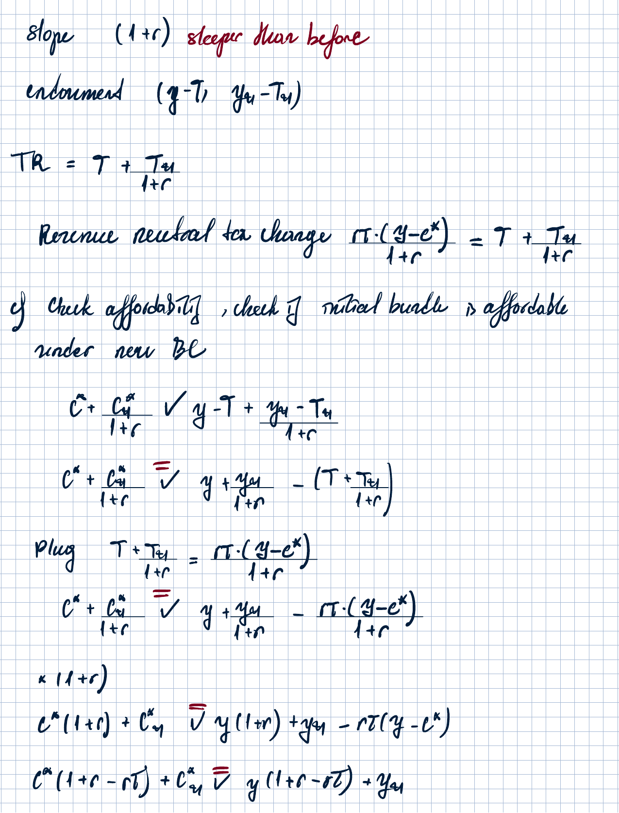

---

## Page 27 - Final conclusion: interest tax vs lump-sum tax

The initial bundle is just affordable under the new budget line. Therefore, real income according to Slutsky is unchanged:

$$
WE=0.
$$

The interest-income tax made current consumption relatively cheaper/expensive depending on the comparison; after replacement by a lump-sum tax, the relative price changes.

The notes conclude:

$$
C \downarrow.
$$

Ricardian Equivalence does not hold because the original tax was not lump-sum:

$$
\text{RE does not hold: taxes are not lump-sum.}
$$

