# Week 6 - Pension Systems

> Graphs, handwritten diagrams, and scanned page context are preserved as page images after each page section. Mathematical expressions are written in LaTeX. Some handwritten fragments were normalized where the intended notation was clear; unclear marginal words are omitted rather than guessed.

---

## Page 1 - Pension systems and the OLG setup

Two pension-system types:

### Pay-As-You-Go system (PAYG)

Young agents pay taxes and the government redirects these funds to retired people as pensions.

Per-retiree pension:

$$
P = \frac{tN_y}{N_o} = t(1+n),
$$

where $t$ is the tax paid by each young agent, $N_y$ is the number of young agents, $N_o$ is the number of old agents, and $n$ is population growth.

Gross return:

$$
1+n.
$$

Net return:

$$
n.
$$

### Fully funded system

Young agents pay into funds that are invested in assets. The assets bring a return when the generation retires.

Gross return:

$$
1+r.
$$

Net return:

$$
r.
$$

This setup is connected to Fisher's intertemporal choice model, where the relevant return is $r$.

### Overlapping generations model (OLG)

There are two generations alive in each period:

- young generation at time $t$;
- old generation at time $t$.

Each generation lives for two periods only. Generations overlap for one period.

Notation:

- $c$ - current consumption of the young generation;
- $c_{+1}$ - future consumption of the young generation, when old;
- $c^o$ - current consumption of the old generation.

To measure the welfare of the young generation, look at both $c$ and $c_{+1}$:

$$
(c,c_{+1}) \uparrow \Rightarrow \text{young generation is better off.}
$$

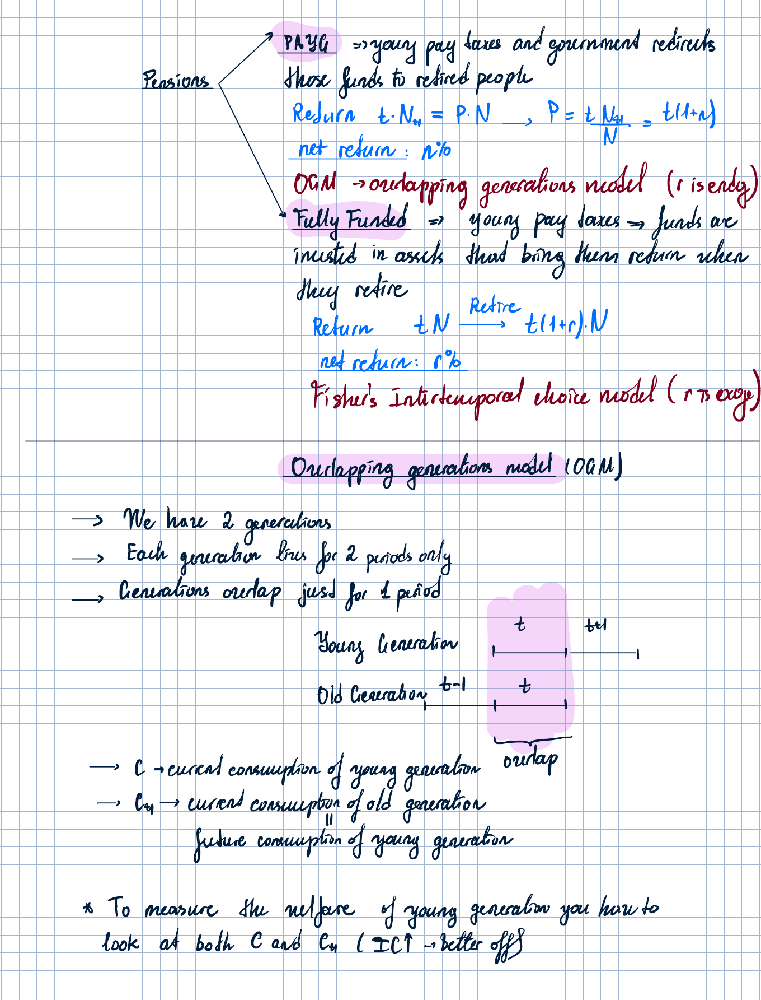

---

## Page 2 - Utility and the feasible consumption line

To measure the welfare of the old generation, only old-age consumption matters:

$$
c^o \uparrow \Rightarrow \text{old generation is better off.}
$$

Utility function of the young generation:

$$
U(c,c_{+1}) = u(c)+\beta u(c_{+1}).
$$

Assumptions:

$$
u'(c)>0, \qquad u''(c)<0.
$$

Thus preferences are nonsatiated, smooth, and convex, with diminishing marginal utility. Both current and future consumption are normal goods, and the marginal rate of substitution is diminishing.

Demographics:

$$
N_y = \text{number of young residents}, \qquad N_o = \text{number of old residents}.
$$

Population grows at rate $n$:

$$
N_y = N_o(1+n).
$$

### Feasible consumption line

The feasible consumption line is similar to a PPF; it is **not** a budget constraint.

Aggregate feasibility:

$$
cN_y + c^oN_o = yN_y + y_oN_o.
$$

Divide by $N_y$ and use $N_o/N_y=1/(1+n)$:

$$
c + \frac{c^o}{1+n} = y + \frac{y_o}{1+n}.
$$

Slope:

$$
\frac{dc^o}{dc}=-(1+n).
$$

The feasible consumption line always passes through the aggregate endowment point:

$$
(c,c^o)=(y,y_o).
$$

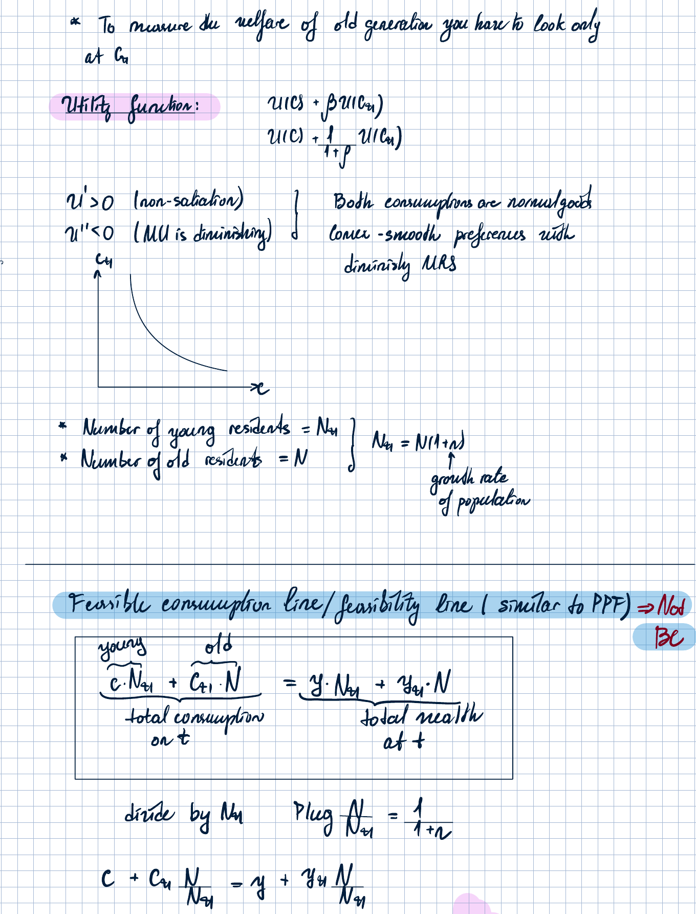

---

## Page 3 - Case 1: no pension system, no government, no central planner

This case is autarky.

Individual budget constraint:

$$
c+\frac{c_{+1}}{1+r}=y+\frac{y_{+1}}{1+r}.
$$

The budget line:

- has slope $-(1+r)$;
- passes through $(y,y_{+1})$.

There is no opportunity to save or borrow:

- no lending or borrowing between generations because each generation overlaps only for one period;
- no lending or borrowing with the government.

Therefore the young consume their endowment:

$$
c=y, \qquad c_{+1}=y_{+1}.
$$

The real interest rate is endogenous. It adjusts so that the endowment point is optimal:

$$
1+r_0 = MRS(y,y_{+1}).
$$

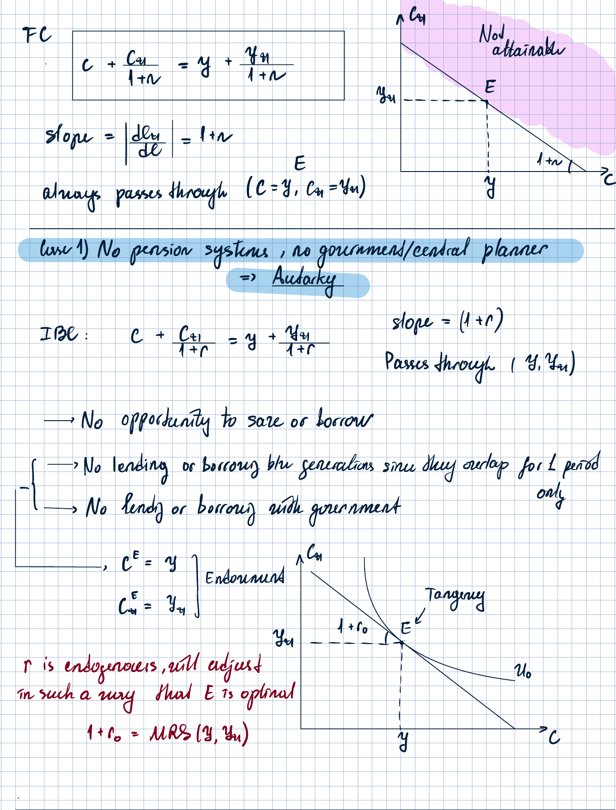

---

## Page 4 - Case 2: PAYG introduced by government

Now there is a central planner/government that implements a PAYG pension system. The government still has no other spending.

Each old resident receives a lump-sum pension $P$. Each young resident pays a lump-sum tax $t$.

Government budget constraint:

$$
tN_y = PN_o.
$$

Divide by $N_o$:

$$
P = t\frac{N_y}{N_o}=t(1+n).
$$

Individual budget constraint with PAYG:

$$
c+\frac{c_{+1}}{1+r}=y-t+\frac{y_{+1}+P}{1+r}.
$$

Substitute $P=t(1+n)$:

$$
c+\frac{c_{+1}}{1+r}=y+\frac{y_{+1}}{1+r}+t\frac{n-r}{1+r}.
$$

Thus PAYG changes lifetime wealth by:

$$
\Delta W = t\frac{n-r}{1+r}.
$$

The slope remains:

$$
-(1+r).
$$

The interest rate $r$ adjusts after PAYG is introduced.

Optimal consumption under PAYG:

$$
c^{PAYG}=y-t, \qquad c_{+1}^{PAYG}=y_{+1}+P.
$$

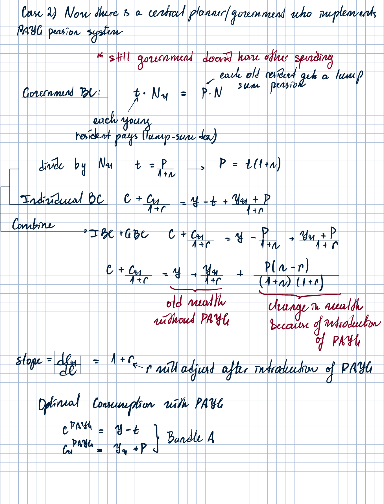

---

## Page 5 - PAYG welfare cases: $n>r_0$ and $n<r_0$

Two cases are compared.

### Case 2.1: $n>r_0$

PAYG raises lifetime wealth because:

$$
\Delta W=t\frac{n-r_0}{1+r_0}>0.
$$

The PAYG budget line passes above the old one. With normal goods:

$$
c \uparrow, \qquad c_{+1}\uparrow.
$$

The old generation also receives pensions:

$$
c^o \uparrow.
$$

Conclusion:

$$
\text{welfare of young rises}, \qquad \text{welfare of old rises}.
$$

Therefore PAYG can generate a Pareto improvement when $n>r_0$.

### Case 2.2: $n<r_0$

PAYG lowers lifetime wealth because:

$$
\Delta W=t\frac{n-r_0}{1+r_0}<0.
$$

The PAYG budget line passes below the old one. With normal goods:

$$
c \downarrow, \qquad c_{+1}\downarrow.
$$

The old generation receives pensions, so:

$$
c^o \uparrow.
$$

Conclusion:

$$
\text{young worse off}, \qquad \text{old better off}.
$$

Therefore there is no Pareto improvement when $n<r_0$.

Interpretation: when PAYG is introduced, current consumption becomes relatively more expensive for the young because taxes reduce current income.

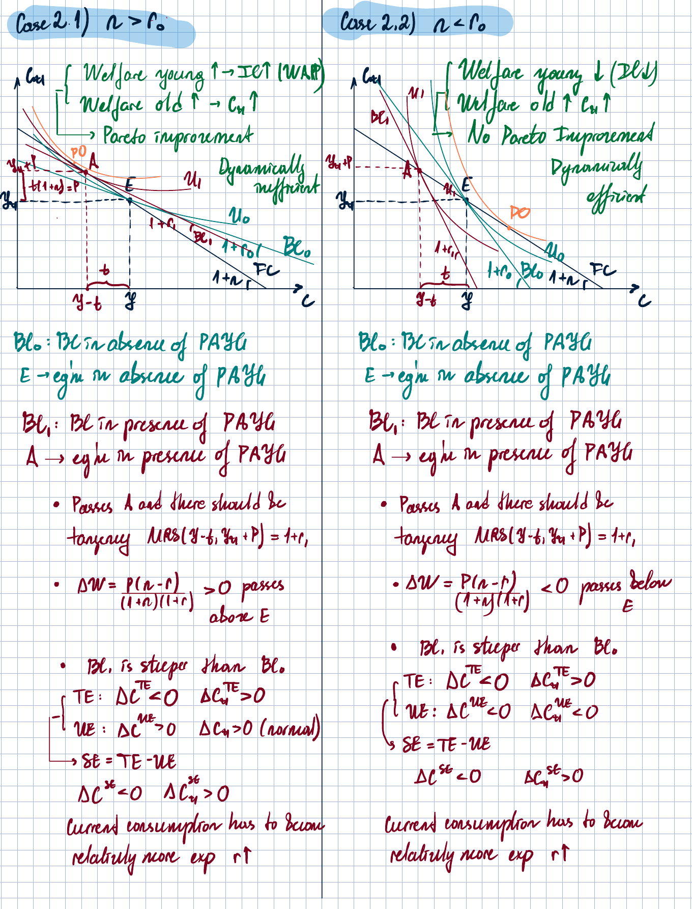

---

## Page 6 - Class 6 Problem 1: PAYG when $n>r$

Problem setup:

- two-period consumption model;
- individual receives income $y$ when young;
- the individual retires in the second period and receives no non-financial income:

$$
y_{+1}=0;
$$

- individual can borrow or save at fixed real interest rate $r$;
- assume:

$$
n>r.
$$

Because $n>r$, the government decides to operate a PAYG pension system. The current young contribute $b$ and the current old receive benefits.

### Part (a)

Analyze the lifetime budget constraint of the young individual and explain why PAYG makes all generations better off.

Without PAYG:

$$
c+\frac{c_{+1}}{1+r}=y.
$$

With PAYG:

$$
c+\frac{c_{+1}}{1+r}=y-b+\frac{b(1+n)}{1+r}.
$$

Hence the change in lifetime wealth is:

$$
\Delta W=b\left(\frac{1+n}{1+r}-1\right)
=b\frac{n-r}{1+r}>0.
$$

Since both consumptions are normal goods:

$$
c \uparrow, \qquad c_{+1}\uparrow.
$$

The current old also receive the transfer, so they are better off. Therefore PAYG is a Pareto improvement when $n>r$.

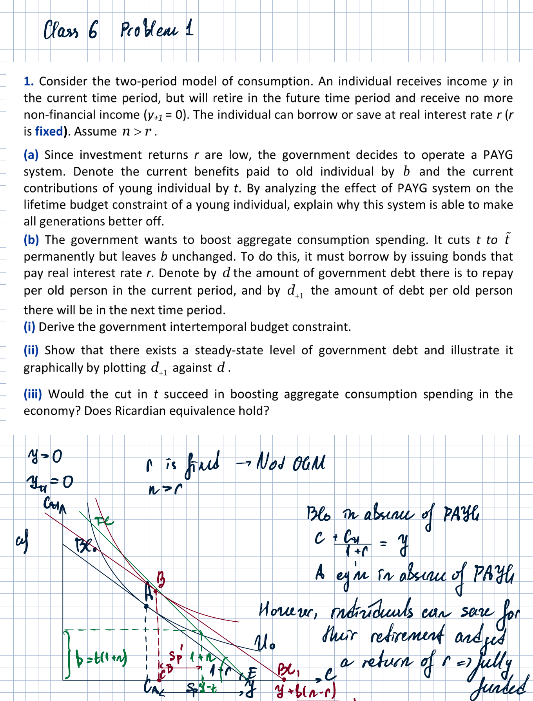

---

## Page 7 - PAYG implementation and debt policy

With PAYG:

Individual budget constraint:

$$
c+\frac{c_{+1}}{1+r}=y-b+\frac{b(1+n)}{1+r}.
$$

Government budget constraint:

$$
bN_y = \text{benefits paid to old}.
$$

The combined budget line shifts outward if $n>r$. Only the wealth effect is caused; both current and future consumption are normal goods, so everyone is better off.

### Part (b): government debt policy

The government wants to boost aggregate consumption spending. It cuts taxes from $t$ to $\bar t$ permanently, leaving debt to finance the difference. There is an initial old debt $d_t$ and new debt $d_{t+1}$.

Old government budget relation:

$$
tN_y + d_{t+1}N_y = bN_o + d_t(1+r)N_o.
$$

Divide by $N_y$:

$$
t+d_{t+1}=\frac{b+d_t(1+r)}{1+n}.
$$

Therefore:

$$
d_{t+1}=\frac{b+d_t(1+r)}{1+n}-t.
$$

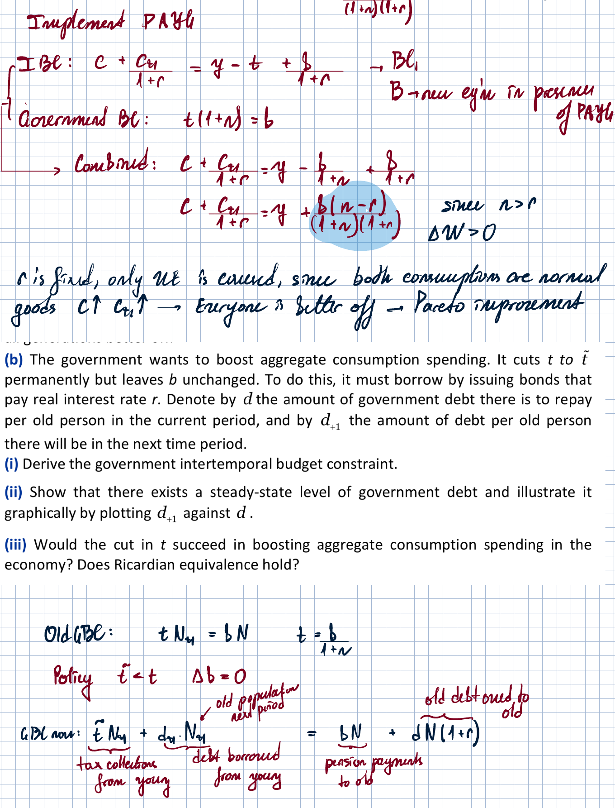

---

## Page 8 - Debt dynamics and steady state

Debt dynamics per young person:

$$
d_{t+1}=\frac{b+d_t(1+r)}{1+n}-t.
$$

Graphically, plot $d_{t+1}$ against $d_t$. The slope is:

$$
\frac{1+r}{1+n}.
$$

If $n>r$, then:

$$
\frac{1+r}{1+n}<1,
$$

so the debt-dynamics line crosses the 45-degree line and there is a stable steady-state debt level.

If $n<r$, then:

$$
\frac{1+r}{1+n}>1,
$$

so debt accumulates without a stable finite steady state.

Steady state:

$$
d_{t+1}=d_t=d^*.
$$

Then:

$$
d^*=\frac{b}{n-r}-t\frac{1+n}{n-r}.
$$

A tax cut raises disposable income and current consumption if Ricardian equivalence fails in this OLG setting. Wealth rises because the government can roll over debt when $n>r$.

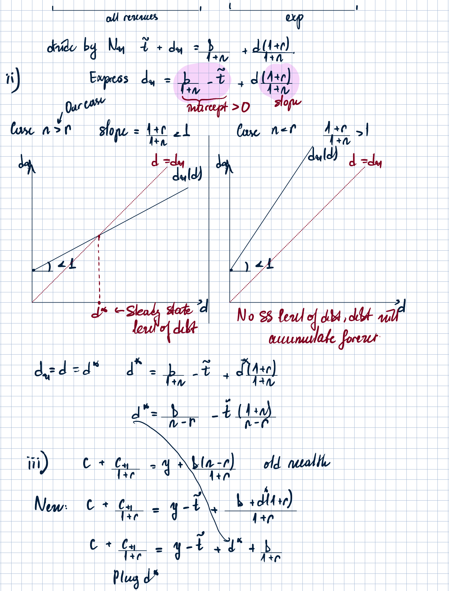

---

## Page 9 - Home Assignment 6: limited commitment and collateral constraint

Problem setup:

A household owns a house with expected future value $p_{+1}$. It can provide collateral for a loan. The household has a mortgage debt $d$ and collateral constraint:

$$
d \leq p_{+1}.
$$

The collateral constraint is binding.

### Budget constraint

Current period:

$$
c = y - d + \frac{p_{+1}}{1+r},
$$

or equivalently with borrowing and repayment terms:

$$
c+\frac{c_{+1}}{1+r}=y-d+\frac{y_{+1}+p_{+1}}{1+r}.
$$

The graph shows the household budget line with the collateral constraint. The constraint limits how much the household can shift consumption into the current period.

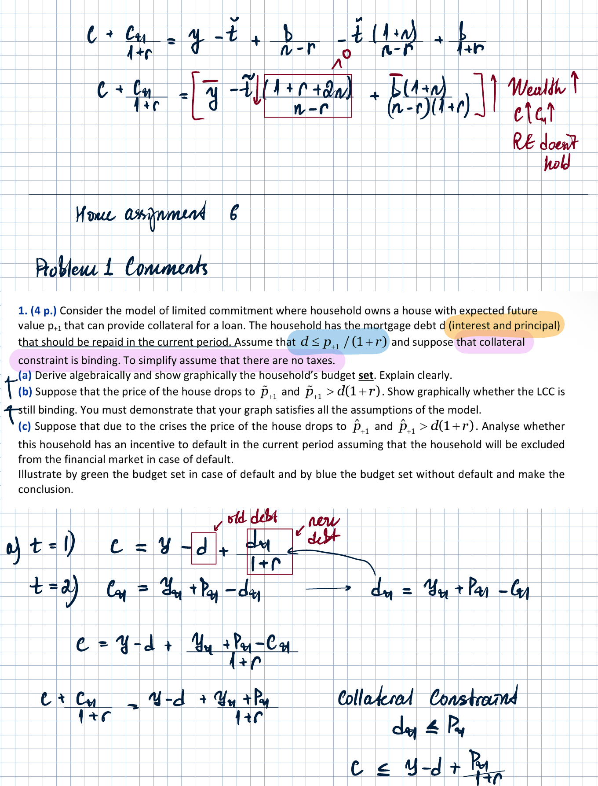

---

## Page 10 - Collateral constraint and default states

Future-period default is considered.

Future consumption if there is no default:

$$
c_{+1}^{no\ default}=y_{+1}+p_{+1}-d_{+1}.
$$

Future consumption if default occurs:

$$
c_{+1}^{default}=y_{+1}+p_{+1}-p_{+1}=y_{+1}.
$$

The default penalty is linked to the loss of collateral.

The graphs compare:

- unconstrained choice;
- constrained choice;
- default and no-default options.

When the collateral constraint is binding, the available budget line is kinked/truncated. The borrower cannot borrow beyond the collateral value.

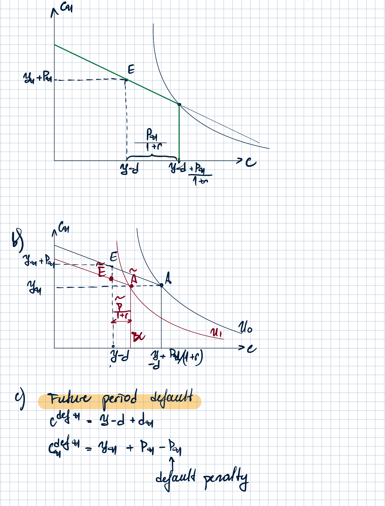

---

## Page 11 - Collateral constraint and default incentives

Lenders lend only if no default is expected in the future.

No default in the future requires:

$$
y_{+1}+p_{+1}-d_{+1} \geq y_{+1}.
$$

Thus:

$$
d_{+1}\leq p_{+1}.
$$

This is the collateral constraint.

With the collateral constraint, future-period default is irrational, because borrowing is limited to the value of collateral.

For current-period default there are two possible cases:

### Current default

Current consumption if defaulting now:

$$
c^{default}=y.
$$

### No default / binding collateral constraint

Current and future consumption are constrained by the maximum sustainable debt.

The graph compares the current default point $D$ with the no-default constrained choice. Different cases are possible depending on preferences and endowments.

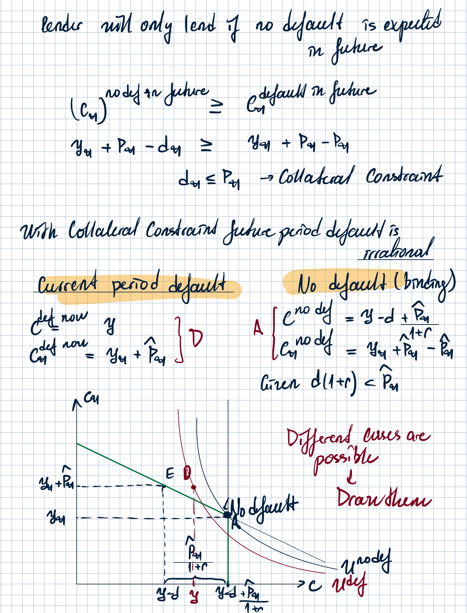

---

## Page 12 - OLG numerical problem: feasible line and household choice

Problem setup:

Utility:

$$
u(c,c_{+1})=2\ln(c)+\ln(c_{+1}).
$$

Endowments:

$$
y=24, \qquad y_o=12.
$$

Population growth:

$$
n=0.2.
$$

There is initially no government intervention.

### Feasible consumption line

Aggregate feasibility:

$$
cN_y+c^oN_o=24N_y+12N_o.
$$

Divide by $N_y$ and use $N_o/N_y=1/(1+n)=1/1.2$:

$$
c+\frac{c^o}{1.2}=24+\frac{12}{1.2}=34.
$$

Thus:

$$
c^o=1.2(34-c).
$$

### Household maximization

The representative young solves:

$$
\max_{c,c_{+1}} 2\ln(c)+\ln(c_{+1})
$$

subject to:

$$
c+\frac{c_{+1}}{1+r}=24+\frac{12}{1+r}.
$$

Optimality:

$$
MRS=1+r.
$$

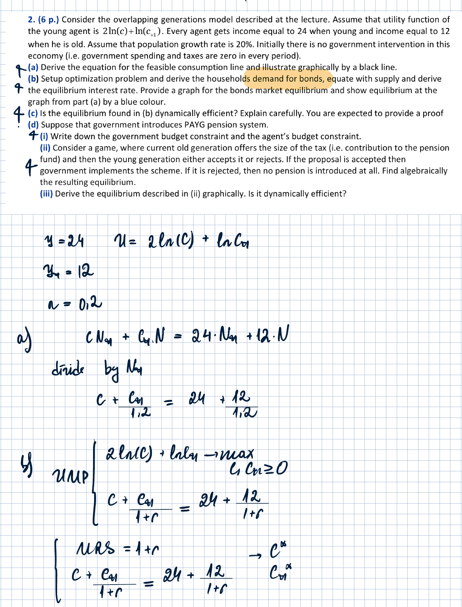

---

## Page 13 - Bond market and dynamic efficiency

Demand for bonds:

$$
B^d = y-c.
$$

Supply of bonds:

$$
B^s=0,
$$

because no borrowing or lending is possible between generations and there is no government debt.

Bond-market equilibrium:

$$
B^d=B^s=0.
$$

Thus:

$$
c=y=24.
$$

Given the utility function, the old-age consumption consistent with the optimum is:

$$
c_{+1}=12.
$$

The equilibrium point is marked as $E$ on the feasible line. The notes indicate that the old generation can be better off under a PAYG policy while the young must be checked using their utility.

The case is connected to dynamic inefficiency: if a PAYG scheme can make all generations better off, the initial equilibrium is dynamically inefficient.

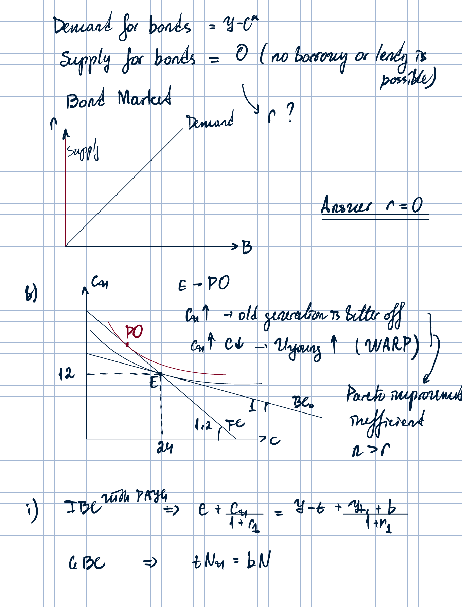

---

## Page 14 - PAYG comparison and Problem 4 setup

For the PAYG comparison, the notes compare utility of the young with and without the pension system.

With PAYG, old-age consumption becomes:

$$
c_{+1}=12+b.
$$

The young pay contribution $t$ when young, so current consumption falls:

$$
c=24-t.
$$

The comparison checks:

$$
U^{young}_{PAYG} \gtrless U^{young}_{no\ PAYG}.
$$

The graph shows that if $t$ is too high, the young are worse off; if $t$ is sufficiently small and the old gain, PAYG may be preferred by the current old but not necessarily by the young. The notes conclude **no Pareto improvement** in that illustrated case.

### Problem 4

Problem setup:

- OLG model;
- each generation has same size;
- population growth:

$$
n=0.25;
$$

- government spends $20\%$ of young income on pensions;
- young income:

$$
y=12;
$$

- old income:

$$
y_o=6;
$$

- pension scheme is financed by a proportional consumption tax.

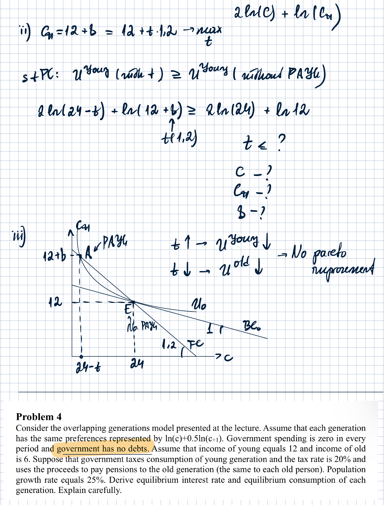

---

## Page 15 - Problem 4: consumption tax pension scheme

Utility:

$$
u(c,c_{+1})=\ln(c)+\frac{1}{2}\ln(c_{+1}).
$$

Parameters:

$$
y=12, \qquad y_o=6, \qquad n=0.25, \qquad \tau=0.2.
$$

The tax is a consumption tax, not a lump-sum tax.

Government budget constraint:

$$
0.2N_y c = PN_o.
$$

Divide by $N_y$:

$$
0.2c = \frac{P}{1+n}.
$$

Since $1+n=1.25$:

$$
P=0.25c.
$$

Individual budget constraint with consumption tax:

$$
c(1+\tau)+\frac{c_{+1}}{1+r}=12+\frac{6+P}{1+r}.
$$

There is no borrowing or saving between generations because generations overlap for one period only, and no borrowing/saving with government because government has no debt.

Equilibrium consumption from the notes:

$$
c^*=10, \qquad c_{+1}^*=6+0.25\cdot 10=8.5.
$$

Tangency condition:

$$
MRS(c^*,c_{+1}^*)=(1+r)(1+\tau).
$$

From the notes:

$$
r^*=\frac{5}{12}.
$$

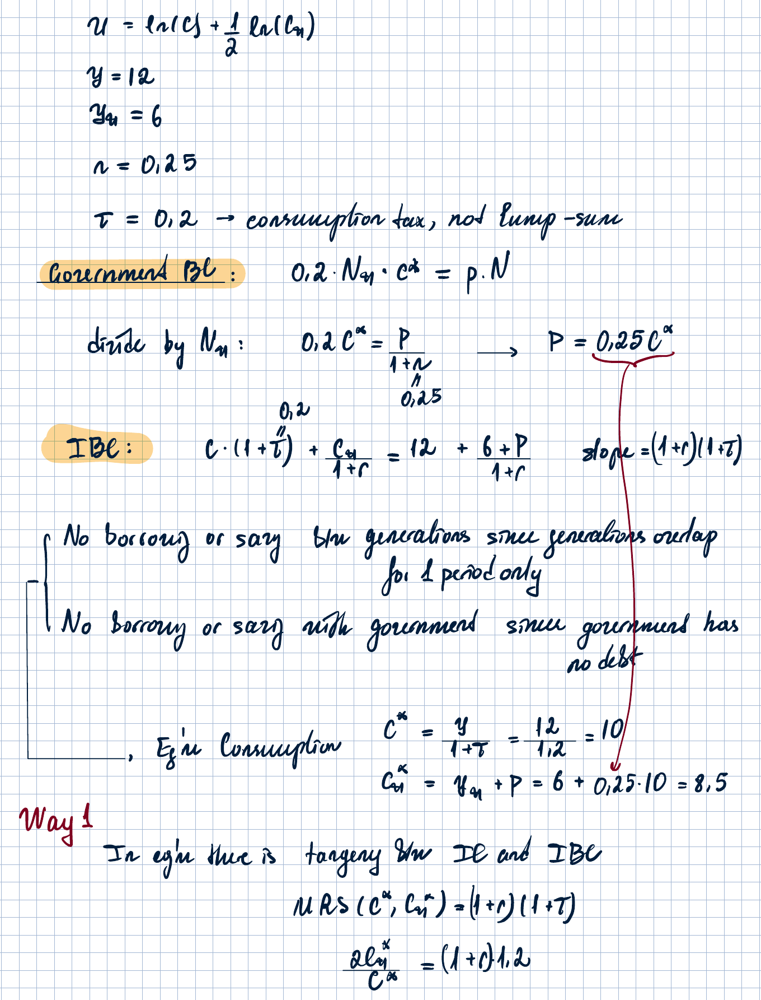

---

## Page 16 - Problem 5: OLG with no intervention and PAYG

Problem setup:

Utility:

$$
u(c,c_{+1})=\ln(c)+0.5\ln(c_{+1}).
$$

Income:

$$
y=24, \qquad y_o=12.
$$

Population growth:

$$
n=0.2.
$$

Initially there is no government.

### Part (a): feasible consumption line

Aggregate feasibility:

$$
cN_y+c^oN_o=24N_y+12N_o.
$$

Divide by $N_y$:

$$
c+\frac{c^o}{1.2}=24+\frac{12}{1.2}=34.
$$

Hence the feasible line is:

$$
c+\frac{c^o}{1.2}=34.
$$

### Part (b): equilibrium interest rate and consumption

No borrowing or saving is possible between generations, since generations overlap for one period only. No borrowing or saving with the government is possible because initially the government has no debt.

Therefore:

$$
c=24, \qquad c_{+1}=12.
$$

The real interest rate adjusts to make this endowment point optimal.

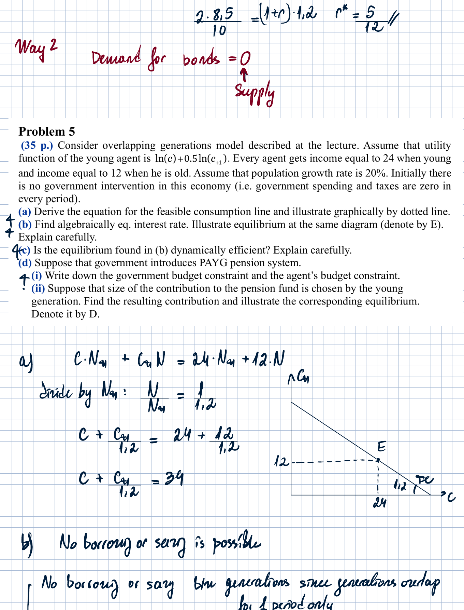

---

## Page 17 - Problem 5: equilibrium and dynamic efficiency

At equilibrium without intervention:

$$
c=24, \qquad c_{+1}=12.
$$

Optimality requires:

$$
MRS(24,12)=1+r_0.
$$

For utility $u(c,c_{+1})=\ln(c)+0.5\ln(c_{+1})$:

$$
MRS=\frac{u_c}{u_{c_{+1}}}=\frac{1/c}{0.5/c_{+1}}=\frac{2c_{+1}}{c}.
$$

Thus:

$$
1+r_0=\frac{2\cdot 12}{24}=1,
$$

so:

$$
r_0=0.
$$

Since:

$$
n=0.2>r_0=0,
$$

the economy is dynamically inefficient. A PAYG scheme can potentially generate a Pareto improvement.

The notes compute the PAYG point:

$$
c^{PO}=\frac{68}{3}, \qquad c_{+1}^{PO}=\frac{68}{5},
$$

and compare young utility to the initial allocation. The conclusion written in the notes is:

$$
\text{young better off}, \qquad \text{old better off}.
$$

Therefore:

$$
\text{Pareto improvement} \Rightarrow \text{economy is dynamically inefficient.}
$$

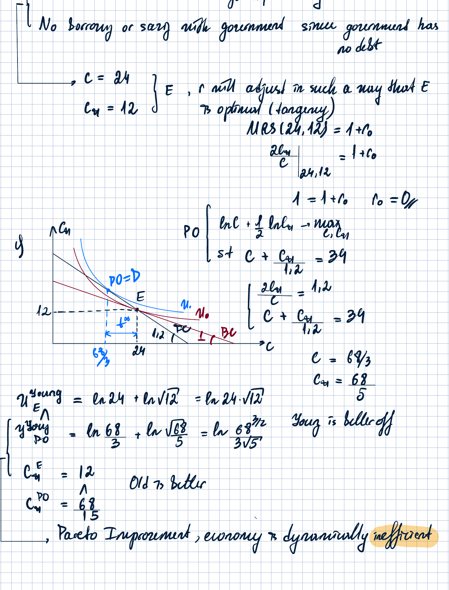

---

## Page 18 - Problem 5(d): PAYG contribution and equilibrium

PAYG government budget constraint:

$$
tN_y=PN_o.
$$

Divide by $N_y$:

$$
t=\frac{P}{1+n}=\frac{P}{1.2}.
$$

Individual budget constraint:

$$
c+\frac{c_{+1}}{1+r}=24-t+\frac{12+P}{1+r}.
$$

Using $P=t(1+n)$:

$$
c+\frac{c_{+1}}{1+r}=24-t+\frac{12+t(1+n)}{1+r}.
$$

The notes solve for a PAYG allocation:

$$
c=\frac{68}{3}, \qquad c_{+1}=\frac{68}{5},
$$

with a contribution:

$$
t=24-\frac{68}{3}=\frac{4}{3}.
$$

This page then starts Problem 2 from the problem set, comparing PAYG budget lines and feasible consumption lines.

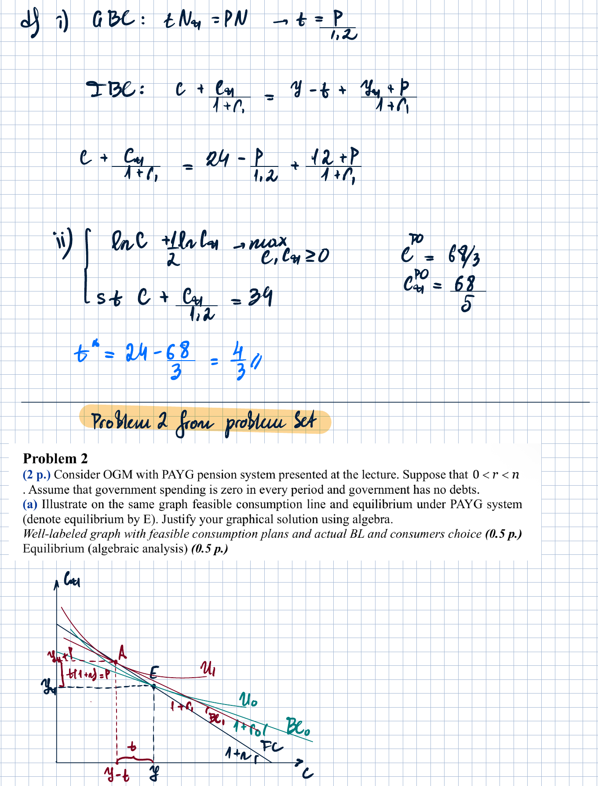

---

## Page 19 - Problem 2: PAYG financed by proportional consumption tax

The page compares:

- $BC_0$: budget constraint in the absence of PAYG;
- $E_0$: equilibrium in the absence of PAYG;
- $BC_1$: budget constraint in the presence of PAYG;
- $A$: equilibrium in the presence of PAYG.

Government budget constraint for PAYG with a consumption tax:

$$
\tau N_y c = N_oP.
$$

Thus:

$$
P=\tau c(1+n).
$$

Individual budget constraint:

$$
c(1+\tau)+\frac{c_{+1}}{1+r}=y+\frac{y_{+1}+P}{1+r}.
$$

The notes check whether the individual can afford the old optimum under PAYG. The old bundle is just affordable under the new budget line.

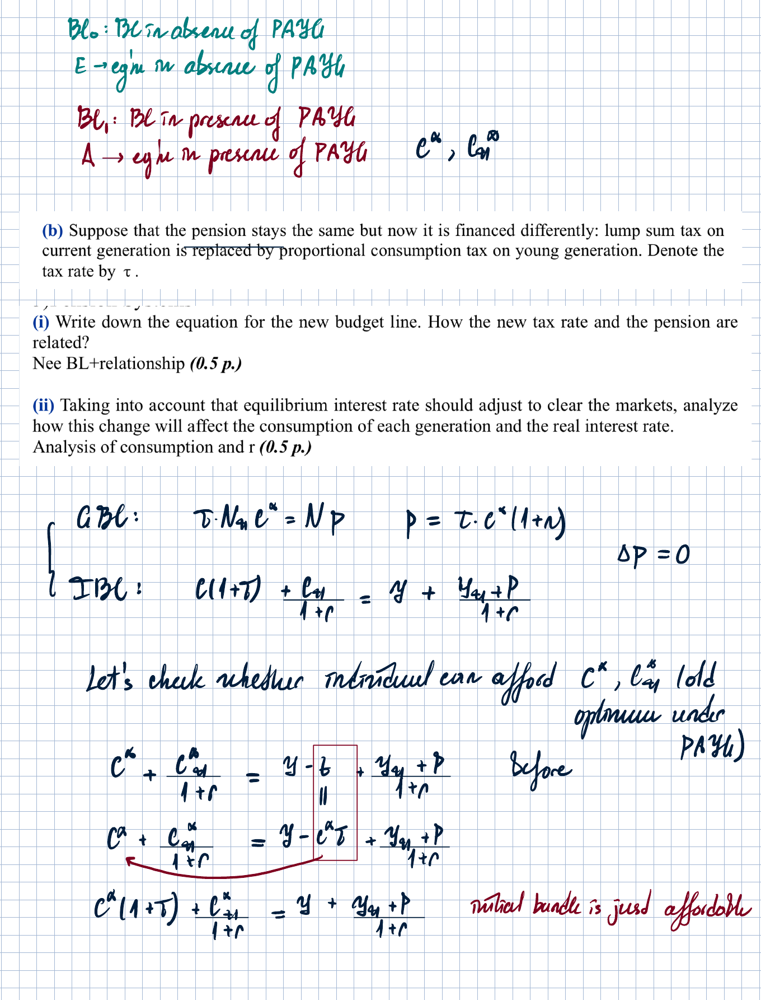

---

## Page 20 - Consumption tax result

Switching from a lump-sum tax to a proportional consumption tax, while preserving the same pension system, leaves the introduced consumption plan unchanged in the notes.

The budget line is also unchanged at the optimum because the new budget line passes through the same relevant allocation.

The condition written on the page is:

$$
(1+\tau)(1+r^*)=1+r^{ss}.
$$

Therefore:

$$
r^{ss}=\frac{1+r^*}{1+\tau}-1.
$$

For the parameters on the page, this becomes:

$$
r^{ss}=\frac{1.2}{1.25}-1<0.
$$

The graph shows the budget line and feasible consumption line with the equilibrium point preserved.

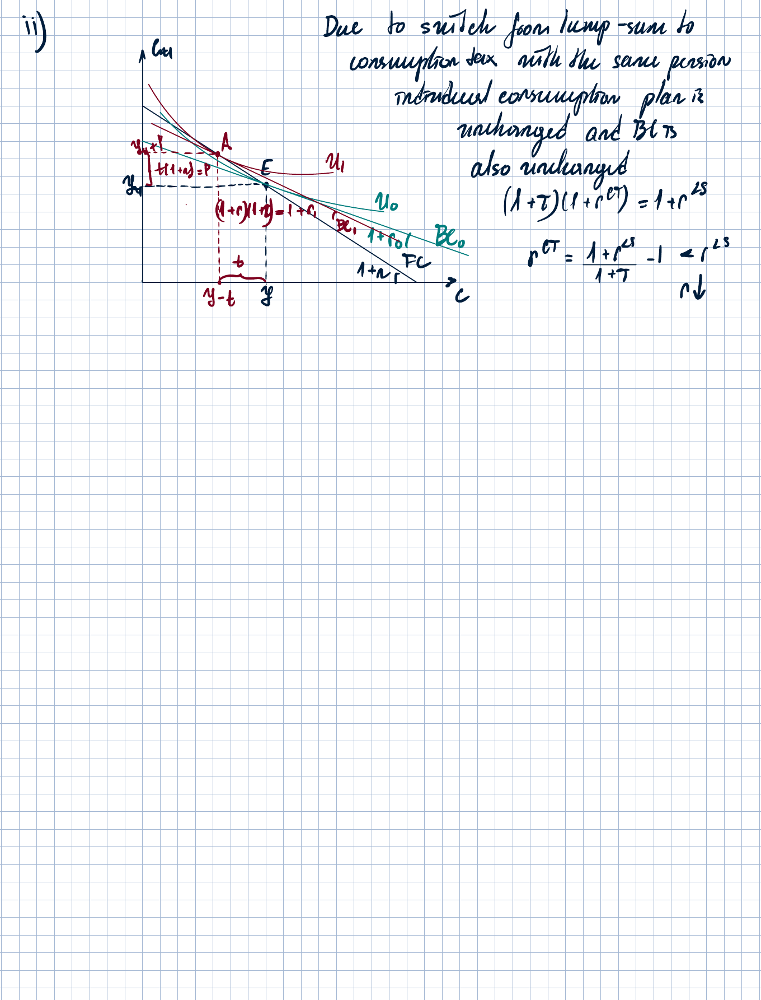
