# Week 7 - Unemployment

## 1. Types of unemployment

Unemployment can be split into short-run unemployment and long-run unemployment.

Short-run unemployment is connected with business cycles:

- cyclical unemployment;
- Keynesian unemployment.

Long-run unemployment is natural unemployment, or NAIRU: **non-accelerating inflation rate of unemployment**.

Long-run unemployment includes:

- **frictional unemployment**: unemployment between jobs;
  - Model 2: one-sided job search;
  - Model 3: two-sided job search;
- **structural unemployment**: demand-deficient unemployment;
- **classical real-wage unemployment**:
  - Model 1: Yellen's model of efficiency wages.

## 2. Model 1: Yellen's model of efficiency wages

Yellen's model of efficiency wages explains **classical real-wage unemployment**.

The key labour-market idea is that the real wage cannot clear down to the equilibrium wage because of **real wage rigidity**. Causes mentioned in the notes:

- binding minimum-wage laws;
- labour unions;
- efficiency wages:
  - labour turnover;
  - adverse selection;
  - moral hazard;
  - nutrition effect;
  - sociological effects.

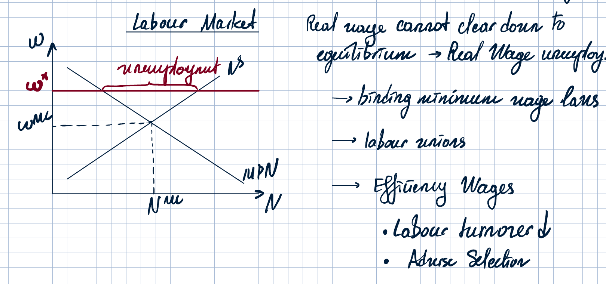

If the real wage is fixed above the market-clearing wage, labour supply exceeds labour demand. Employment is determined by labour demand, and the gap is unemployment.

## 3. Efficiency-wage firm problem

The representative firm is perfectly competitive in the output market and chooses employment and wages in the input market.

Production depends on **effective labour**:

$$
Y = F(e(w)N),
$$

where:

- $N$ is employment;
- $w$ is the real wage;
- $e(w)$ is effort per worker.

The notes use the standard neoclassical assumptions:

$$
F_N > 0, \qquad F_{NN}<0.
$$

Effort is not controlled directly by the firm, but it can be influenced by the wage:

$$
e'(w)>0.
$$

The effort function is increasing and has changing curvature: at low wages effort rises slowly, then more quickly, then the effect of additional wage increases diminishes.

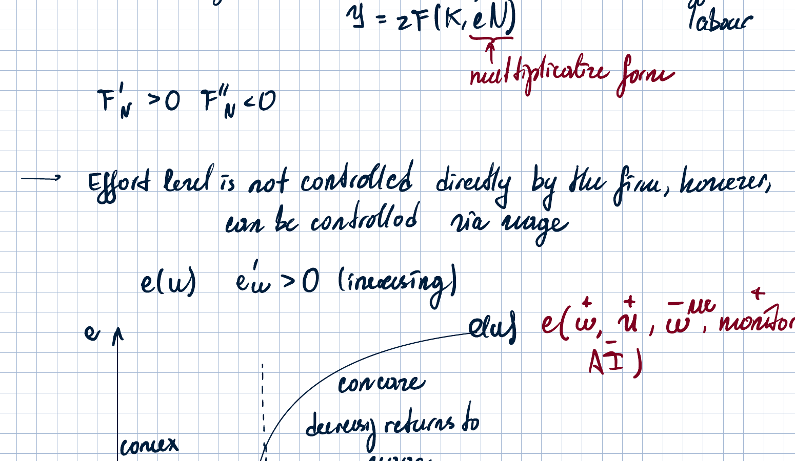

The firm solves:

$$
\max_{w,N} \left[zF(e(w)N)-wN\right].
$$

FOC with respect to $N$:

$$
zF'(e(w)N)e(w)=w.
$$

FOC with respect to $w$:

$$
zF'(e(w)N)e'(w)N=N.
$$

Dividing the second FOC by the first gives the **Solow condition**:

$$
\frac{w e'(w)}{e(w)}=1.
$$

Equivalently, the firm chooses the wage that minimizes the cost per unit of effective labour:

$$
\frac{w}{e(w)}.
$$

FOC:

$$
e(w)-w e'(w)=0
\quad\Longleftrightarrow\quad
\frac{w e'(w)}{e(w)}=1.
$$

Thus the efficiency wage $w^*$ depends on the effort function only, not on the production function.

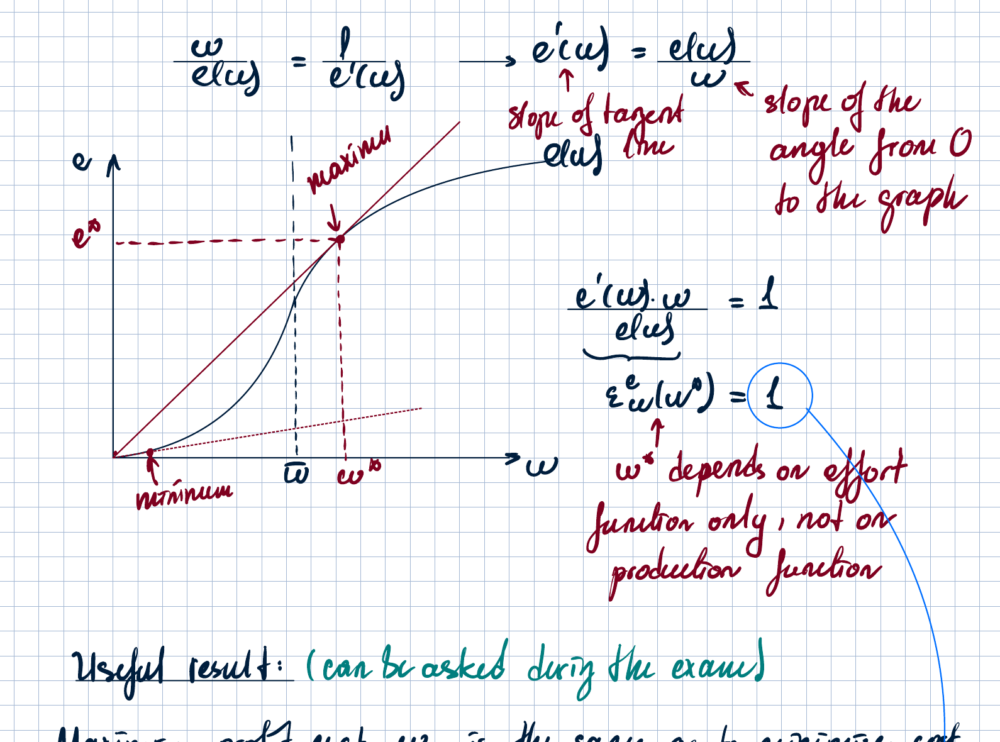

## 4. How unemployment is caused in the efficiency-wage model

If

$$
w^*>w^{mc},
$$

where $w^{mc}$ is the market-clearing wage, firms are unwilling to cut wages even though unemployed workers would accept a lower wage. If firms cut wages, workers exert less effort and profits fall. Therefore excess labour supply does not create downward pressure on wages.

The wage remains above the market-clearing level. The result is **classical real-wage unemployment**: unemployment caused by real wage rigidity, not by nominal rigidity. It can exist at any price level.

If

$$
w^*<w^{mc},
$$

there is excess demand in the labour market. Employment is decided by labour supply, and the wage eventually rises to the equilibrium wage. In that case no unemployment is caused by the efficiency wage.

## 5. Flows in the labour market

Notation:

- $E$ - employed workers;
- $U$ - unemployed workers;
- $LF$ - labour force;
- $f$ - job-finding rate, probability of finding and accepting a job;
- $s$ - job-separation rate, probability of leaving a job.

Assume the labour force is constant:

$$
LF=E+U.
$$

The law of motion for unemployment is:

$$
U_{t+1}-U_t=sE_t-fU_t.
$$

Since $E_t=LF-U_t$:

$$
U_{t+1}-U_t=s(LF-U_t)-fU_t.
$$

In unemployment-rate form, with $u=U/LF$:

$$
u_{t+1}-u_t=s(1-u_t)-fu_t.
$$

In the steady state:

$$
u_{t+1}=u_t=u^*,
$$

so

$$
s(1-u^*)=fu^*.
$$

Therefore:

$$
u^*=\frac{s}{s+f}.
$$

The notes state that $s$ is usually exogenously given, while $f$ needs to be modelled.

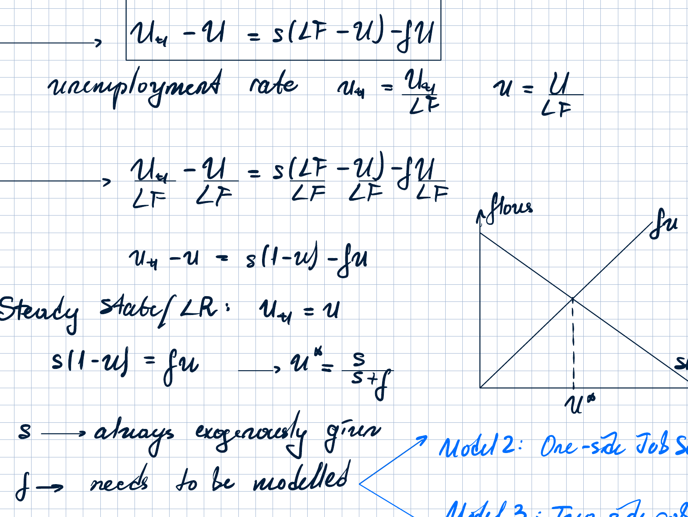

## 6. Model 2: one-sided job-search model

The one-sided job-search model explains the job-finding rate $f$.

The probability of finding a job is:

$$
f=p\left(1-F(w^{res})\right),
$$

where:

- $p$ is the probability of getting a job offer;
- $F(w^{res})$ is the probability that the offered wage is below the reservation wage;
- $1-F(w^{res})$ is the probability that the offered wage is accepted;
- $w^{res}$ is the reservation wage.

$F(w^{res})$ is a cumulative distribution function: it gives the probability that the offered wage is lower than the reservation wage.

The **reservation wage** is the wage at which the individual is indifferent between employment and unemployment:

$$
V_e(w^{res})=V_u.
$$

Factors affecting $V_u$ and therefore $w^{res}$:

- unemployment benefits: duration and size;
- social insurance packages;
- value of leisure and perks;
- taxes;
- potential future job opportunities.

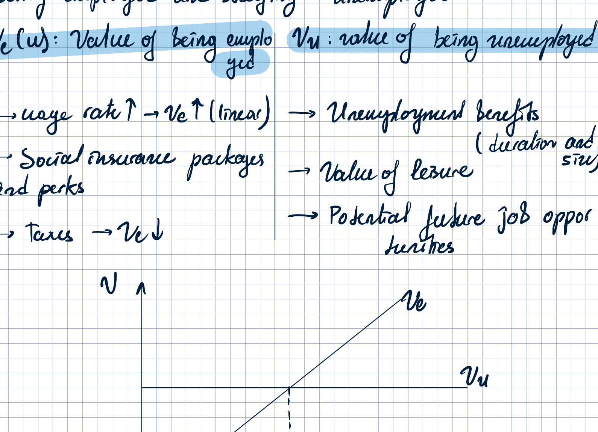

### Class 7, Problem 1: increase in probability of a job offer

Problem: in the one-sided job-search model, analyze how an increase in the probability of a job offer affects the reservation wage and equilibrium unemployment rate.

Main logic from the notes:

$$
p \uparrow \quad\Rightarrow\quad V_u \uparrow,
$$

because the unemployed worker has better future job opportunities. Therefore:

$$
w^{res}\uparrow.
$$

This lowers the probability of accepting a given offer:

$$
1-F(w^{res})\downarrow.
$$

The total effect on

$$
f=p\left(1-F(w^{res})\right)
$$

is ambiguous in the notes because $p$ rises directly, but the acceptance probability falls indirectly.

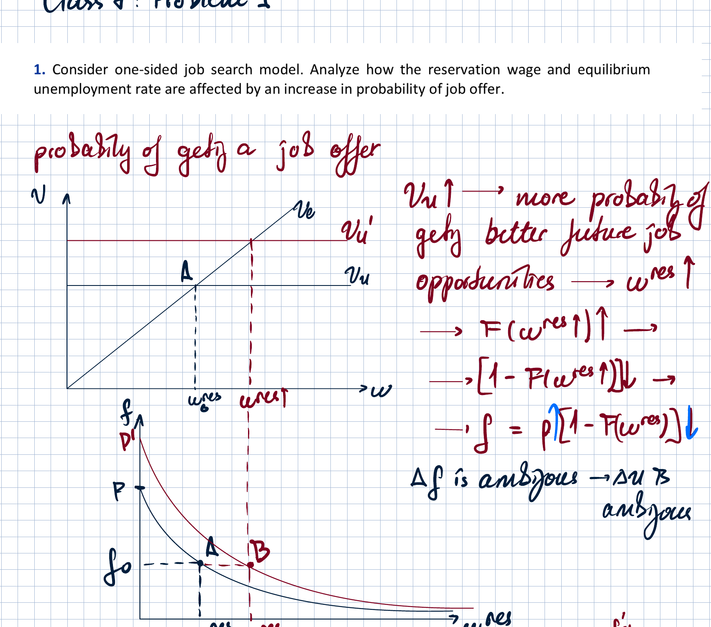

## 7. Efficiency-wage problem with monitoring cost

Problem statement from the notes: consider an efficiency-wage model with effort function

$$
e(w)=\ln\left(\frac{w}{a}\right),
$$

where $a>0$ is a parameter interpreted as monitoring difficulty. Suppose it becomes more difficult for firms to observe worker effort. Show the effect on the efficiency wage and unemployment.

Since

$$
e(w)=\ln w-\ln a,
$$

the parameter $a$ can be interpreted as a wage threshold above which some effort appears. Higher $a$ means monitoring is more difficult.

The efficiency-wage condition is:

$$
\frac{w e'(w)}{e(w)}=1.
$$

Here:

$$
e'(w)=\frac{1}{w}.
$$

Therefore:

$$
\frac{w\cdot \frac{1}{w}}{\ln(w/a)}=1
\quad\Longrightarrow\quad
\ln(w/a)=1.
$$

Thus:

$$
w^*=ae.
$$

If monitoring becomes more expensive:

$$
a\uparrow \quad\Rightarrow\quad w^*\uparrow.
$$

At the efficiency wage, $e(w^*)=1$. Employment is determined by labour demand:

$$
F_N(e(w^*)N)e(w^*)=w^*.
$$

Since $w^*$ rises, labour demand falls:

$$
N^d\downarrow,
$$

so unemployment rises.

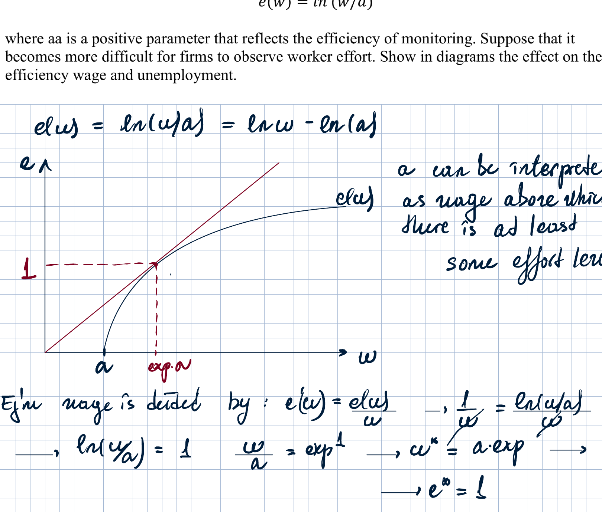

The notes summarize the shock as:

$$
a\uparrow \quad\Rightarrow\quad w^*=ae\uparrow \quad\Rightarrow\quad N^d\downarrow \quad\Rightarrow\quad u\uparrow.
$$

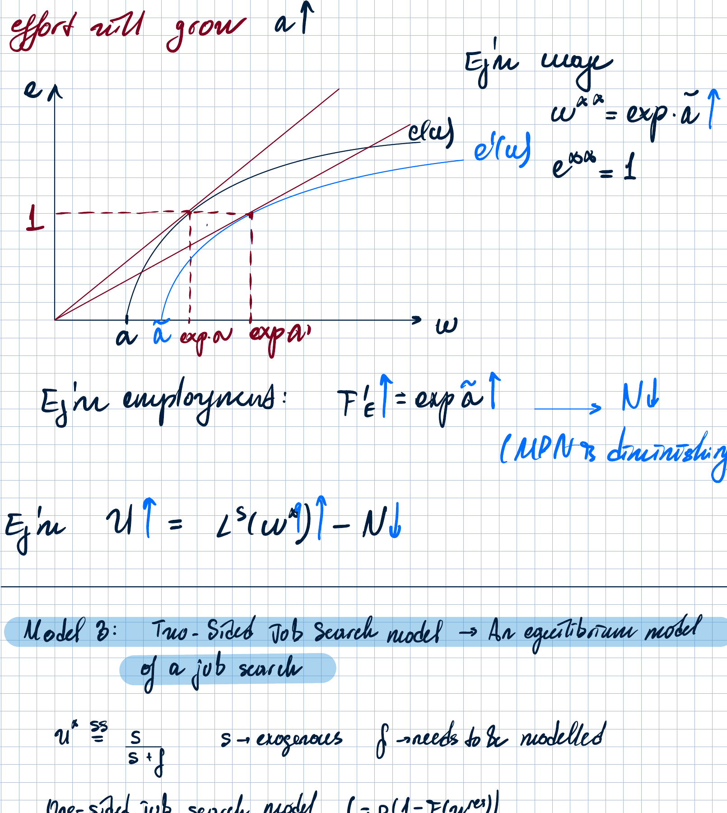

## 8. Model 3: two-sided job-search model

The two-sided job-search model is an equilibrium model of job search.

In the one-sided model:

$$
f=p\left(1-F(w^{res})\right),
$$

so $f$ is still partly exogenous and needs to be modelled.

In the two-sided model:

$$
f=\frac{m}{u},
$$

where:

- $m$ is the number/rate of matches;
- $u$ is the unemployment rate.

The model has three components:

1. **Matching function**: describes how a match between an empty vacancy and an unemployed person occurs.
2. **Wage bargaining curve**: describes bargaining between the firm and worker.
3. **Job creation curve**: describes firms' decision over how many vacancies to create.

## 9. Matching function and Beveridge curve

The matching function is:

$$
m=\mu M(u,v),
$$

where:

- $u$ is the unemployment rate;
- $v$ is the vacancy rate;
- $\mu$ is matching efficiency, or matching TFP.

The matching function has neoclassical-style properties:

$$
M_u>0,\quad M_v>0,\quad M_{uu}<0,\quad M_{vv}<0.
$$

It also satisfies constant returns to scale:

$$
M(\lambda u,\lambda v)=\lambda M(u,v).
$$

There are Inada-type conditions on marginal products.

The unemployment dynamics are:

$$
u_{t+1}-u_t=s(1-u_t)-fu_t.
$$

Using

$$
f=\frac{m}{u}=\frac{\mu M(u,v)}{u},
$$

the steady-state Beveridge curve is:

$$
s(1-u)=\mu M(u,v).
$$

This curve describes the relationship between vacancy rate and unemployment rate.

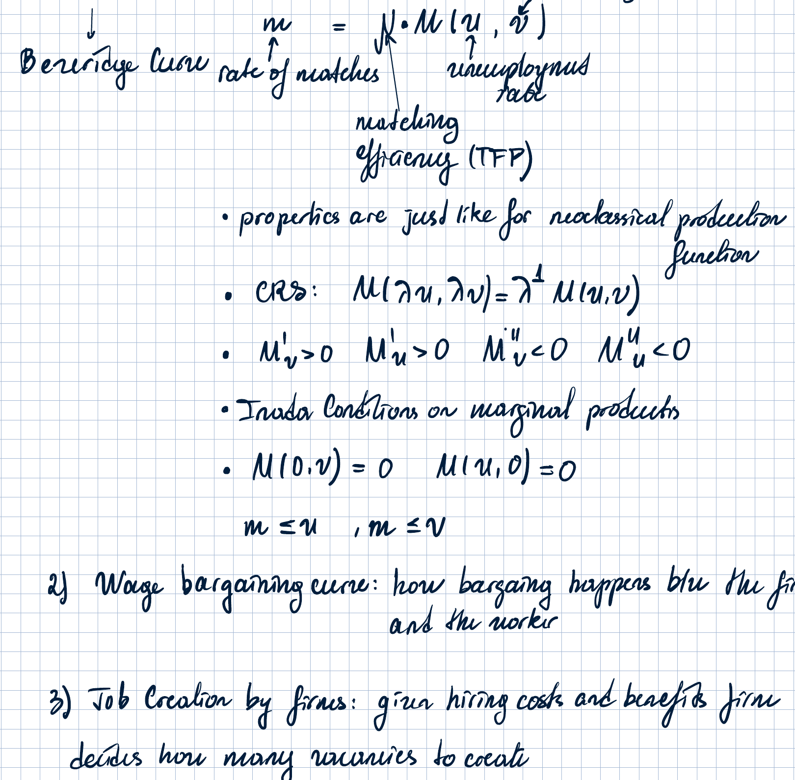

The Beveridge curve is downward sloping. A rightward/outward shift means that for the same vacancy rate the unemployment rate is higher; this is interpreted as a negative/recessionary shift.

Main shift factors noted:

- job separation rate $s$;
- matching efficiency $\mu$;
- other shocks that affect matching and labour-market frictions.

## 10. Labour-market tightness

Labour-market tightness is:

$$
\theta=\frac{v}{u}.
$$

It measures the relative difficulty for firms to find workers.

High market tightness means:

$$
\theta>1.
$$

There are more vacancies per unemployed worker. Workers find jobs quickly, while firms struggle to hire.

To determine equilibrium $u$ and $v$, one needs:

- the Beveridge curve;
- labour-market tightness $\theta$.

Equilibrium tightness and the real wage are determined by the **wage bargaining curve** and the **job creation curve**.

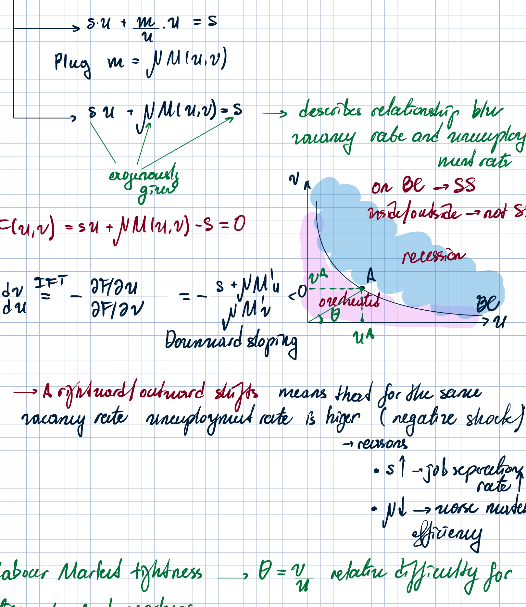

## 11. Wage bargaining curve

The wage bargaining curve shows the relationship between the real wage $w$ and labour-market tightness $\theta$.

Bargaining is between workers and firms. The notes use Nash bargaining: each side gets a constant share of total surplus.

The total surplus from hiring a worker is split into:

- surplus of the firm;
- surplus of the worker.

From the notes, the wage curve is:

$$
w=\gamma(y-b)+b+\gamma c\theta,
$$

where:

- $\gamma$ is the worker's bargaining power;
- $y$ is productivity per worker;
- $b$ is the worker's outside option/unemployment benefit;
- $c$ is the vacancy/recruitment cost;
- $\theta$ is labour-market tightness.

Slope:

$$
\frac{\partial w}{\partial \theta}=\gamma c>0.
$$

The wage bargaining curve is upward sloping. Intuition: when $\theta$ is high, it is hard to replace a worker because there are many vacancies relative to unemployed workers. The worker has a stronger bargaining position and can negotiate a higher real wage.

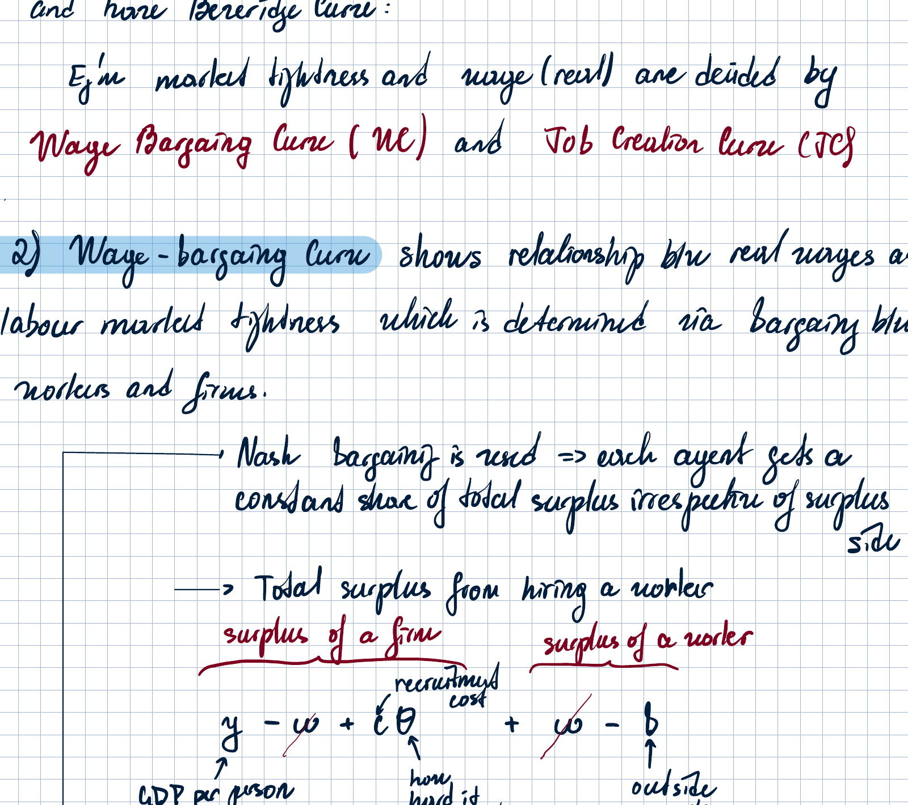

### Wage bargaining curve: shift factors

1. Higher unemployment benefits $b\uparrow$ increase the worker's outside option and bargaining power:

$$
b\uparrow \quad\Rightarrow\quad WB \text{ shifts up}.
$$

2. Higher worker productivity $y\uparrow$ means firms can afford to pay higher wages because each worker generates more revenue:

$$
y\uparrow \quad\Rightarrow\quad WB \text{ shifts up}.
$$

3. Higher worker bargaining power $\gamma\uparrow$, for example due to unions or collective agreements, raises wages:

$$
\gamma\uparrow \quad\Rightarrow\quad WB \text{ shifts up}.
$$

4. Stronger employment protection or mandatory benefits can increase workers' bargaining position and raise wages.

5. Greater mismatch between job seekers' skills and job openings can put workers in a stronger bargaining position in some cases.

6. Higher recruitment cost $c\uparrow$ changes the slope/position of the wage bargaining curve because workers become more costly to replace.

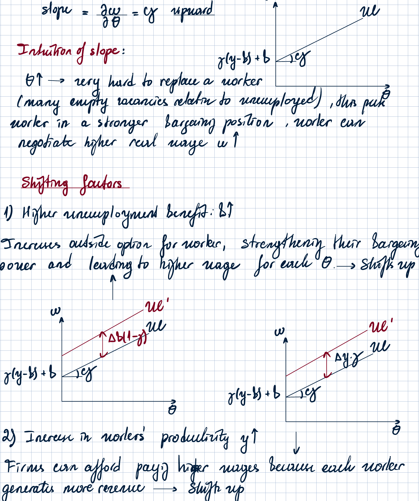

## 12. Job creation curve

The job creation curve represents the relationship between labour-market tightness $\theta$ and the real wage $w$, motivated by firms' desire to create new vacancies.

The marginal benefit of creating an extra vacancy falls when tightness rises, because vacancies become harder to fill.

Let $q(\theta)$ be the vacancy-filling rate. Then:

$$
q'(\theta)<0.
$$

The notes give the job creation condition in the form:

$$
w=y-\frac{c(r+s)}{q(\theta)}.
$$

This curve is downward sloping:

$$
\frac{\partial w}{\partial \theta}<0.
$$

Intuition: if $\theta$ rises, the marginal benefit of creating an extra vacancy falls. The firm will create fewer vacancies unless the wage is lower.

### Job creation curve: shift factors

1. Productivity increases:

$$
y\uparrow \quad\Rightarrow\quad MB \text{ of each vacancy }\uparrow
\quad\Rightarrow\quad v\uparrow,\ \theta\uparrow,
$$

so the job creation curve shifts up/right.

2. Recruitment cost increases:

$$
c\uparrow \quad\Rightarrow\quad MB \text{ of each vacancy }\downarrow
\quad\Rightarrow\quad v\downarrow,\ \theta\downarrow,
$$

so the job creation curve shifts down.

3. Interest rate increases:

$$
r\uparrow \quad\Rightarrow\quad \text{expected value of a vacancy falls}
\quad\Rightarrow\quad JC \text{ shifts down}.
$$

4. Job separation rate increases:

$$
s\uparrow \quad\Rightarrow\quad \text{employees leave jobs more often}
\quad\Rightarrow\quad MB \downarrow
\quad\Rightarrow\quad JC \text{ shifts down}.
$$

5. Matching efficiency increases:

$$
\mu\uparrow \quad\Rightarrow\quad q(\theta)\uparrow
\quad\Rightarrow\quad \text{more job creation}
\quad\Rightarrow\quad JC \text{ shifts to the right/up}.
$$

## 13. Class 7, Problem 2: productivity shock in the two-sided search model

Problem: consider a two-sided job-search model.

### Case (a): workers have no bargaining power

Assume workers have no bargaining power:

$$
\gamma=0.
$$

Then the wage bargaining curve is horizontal:

$$
w=b.
$$

The job creation curve is:

$$
w=y-\frac{c(r+s)}{q(\theta)}.
$$

A productivity increase affects only the job creation curve:

$$
y\uparrow \quad\Rightarrow\quad JC \text{ shifts to the right/up}.
$$

The real wage is unchanged because workers have no bargaining power:

$$
\Delta w=0.
$$

Labour-market tightness rises:

$$
\theta\uparrow.
$$

With more vacancies available, more unemployed workers are matched with jobs, so unemployment falls:

$$
u\downarrow.
$$

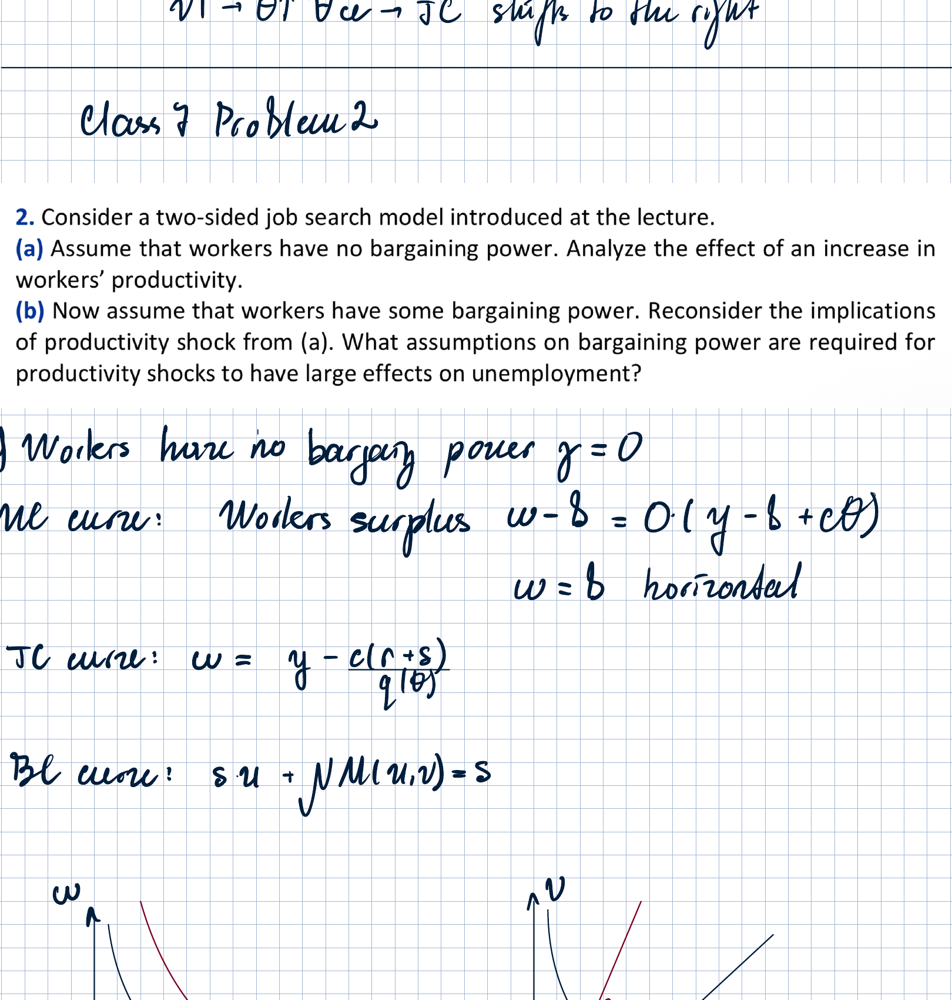

### Case (b): workers have bargaining power

With positive bargaining power, the wage bargaining curve is:

$$
w=\gamma(y-b)+b+\gamma c\theta.
$$

A productivity increase affects both curves:

$$
y\uparrow \quad\Rightarrow\quad JC \text{ shifts up/right},
$$

and

$$
y\uparrow \quad\Rightarrow\quad WB \text{ shifts up by } \gamma\Delta y.
$$

Since workers are more productive, total surplus from hiring a worker rises and firms can afford to pay a higher wage:

$$
w\uparrow.
$$

Tightness also rises, but not as much as in case (a), because part of the productivity gain is absorbed by higher wages:

$$
\theta\uparrow \quad \text{but less than when } \gamma=0.
$$

Unemployment falls, but the effect is smaller than in the no-bargaining-power case.

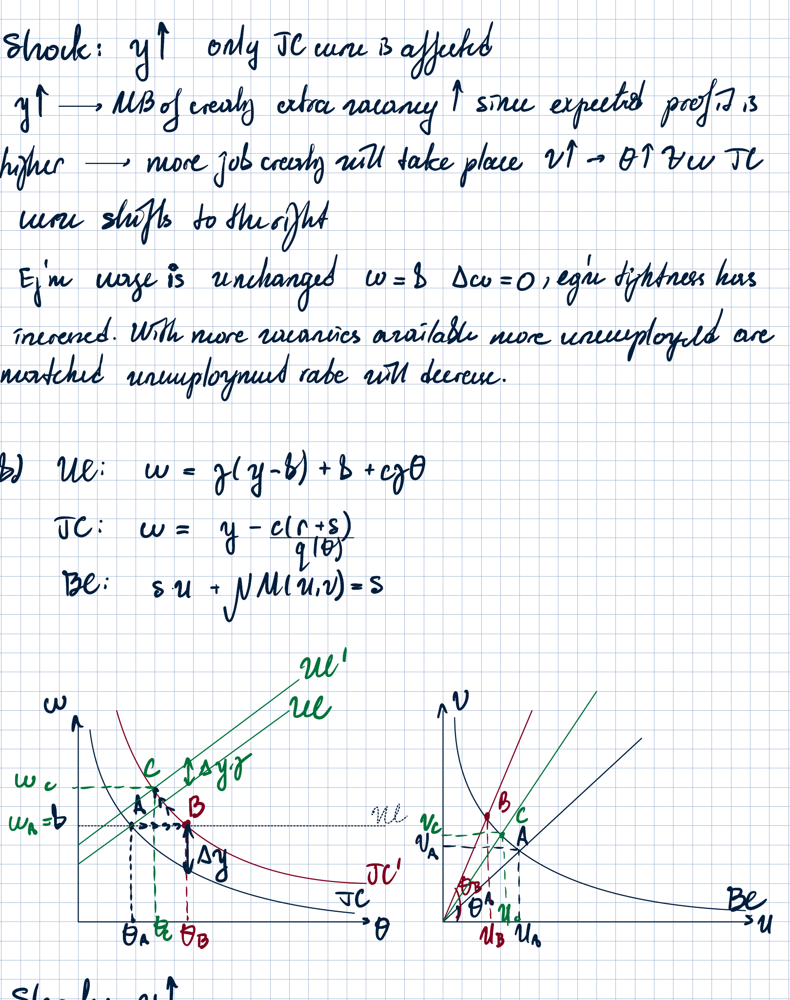

## 14. Home assignment 7: data and Beveridge curve

The notes mention an HSE data task:

- work with HSE dataset from the unified archive of macroeconomic statistics;
- produce a table with quarterly data on unemployment rate, vacancy rate and market tightness from 2001 to the present;
- use the table to draw the Beveridge curve for 2001-Q1 to 2020-Q1 and for 2021-Q1 to 2024-Q4;
- explain why some points are outliers and lie above the curve.

Formula for labour-market tightness:

$$
\theta=\frac{v}{u}.
$$

The notes indicate that vacancy rate should be calculated from vacant and occupied units. The comment reads approximately:

$$
\text{Vacant units}=\text{Total units}-\text{Occupied units}.
$$

Then use unemployed/employed/labour-force measures consistently to build $u$ and $v$.

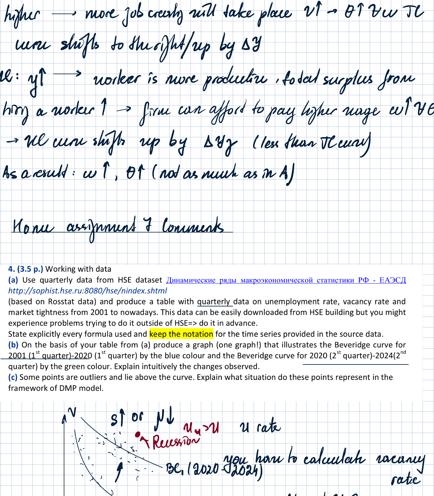

## 15. Home assignment: efficiency wage with TFP increase

Problem: consider the efficiency-wage model. Analyze the impact of an increase in TFP. The notes say to use the model of unemployment and compare different efficiency-wage theories.

Firm problem:

$$
\max_{w,N}\left[zF(e(w)N)-wN\right].
$$

FOC with respect to $N$:

$$
zF'(e(w)N)e(w)=w.
$$

FOC with respect to $w$:

$$
zF'(e(w)N)e'(w)N=N.
$$

Dividing the two FOCs gives:

$$
\frac{w e'(w)}{e(w)}=1.
$$

Thus the efficiency wage does not depend on the production function or on TFP:

$$
z\uparrow \quad\Rightarrow\quad w^* \text{ unchanged}.
$$

Employment condition:

$$
zF_N(e(w^*)N)e(w^*)=w^*.
$$

If TFP rises, labour becomes more productive. Since $w^*$ is unchanged, the firm hires more workers:

$$
z\uparrow \quad\Rightarrow\quad N\uparrow.
$$

Therefore unemployment falls:

$$
u\downarrow.
$$

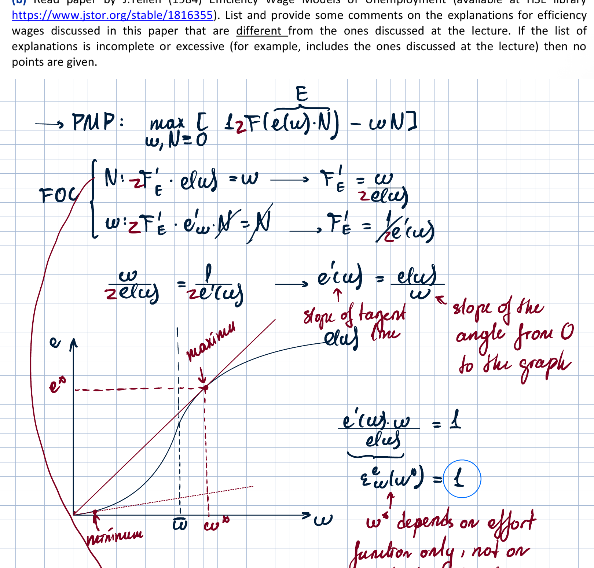

## 16. Home assignment: lower job separation rate

Problem statement from the last page:

Consider the one-sided job-search model. Suppose the job separation rate falls.

Tasks:

1. Analyze graphically how equilibrium reservation wage, job-finding rate and unemployment rate are affected. Provide explanation.
2. Explain intuitively the impact of reduced job separation in the framework of the two-sided model. Every new and current job should be matched with a new line.

Using the one-sided steady-state formula:

$$
u^*=\frac{s}{s+f},
$$

a fall in the job separation rate directly lowers unemployment:

$$
s\downarrow \quad\Rightarrow\quad u^*\downarrow.
$$

The effect on the reservation wage depends on how a lower separation rate changes the value of employment and unemployment. Intuitively, lower separation makes employment more stable and raises the value of being employed, so the reservation wage may rise if workers become more selective. The direct steady-state effect through $s$ is a lower unemployment rate.
