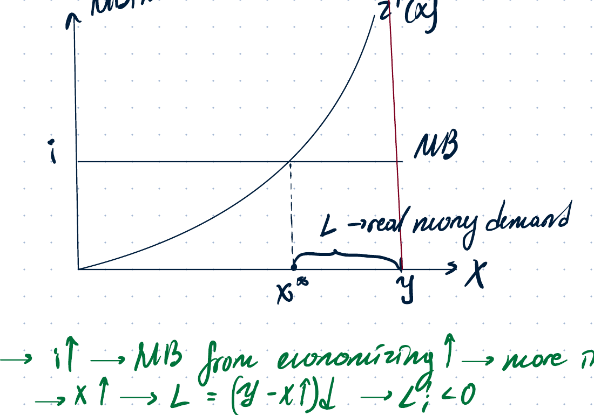
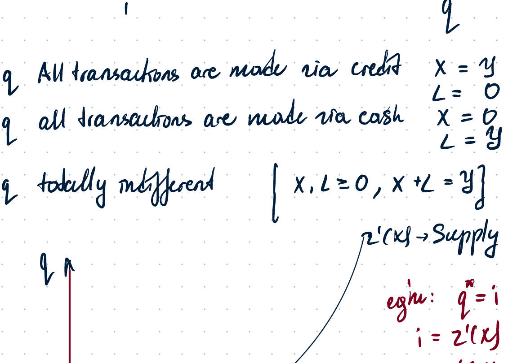
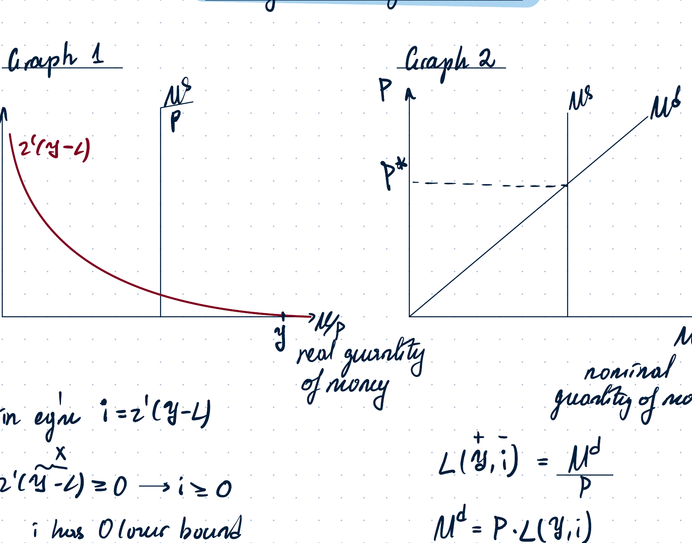
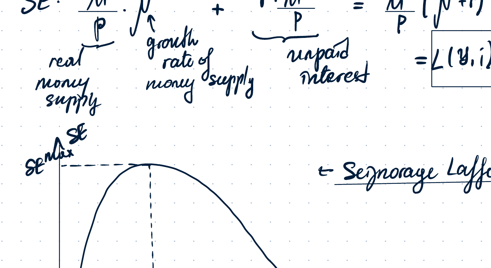
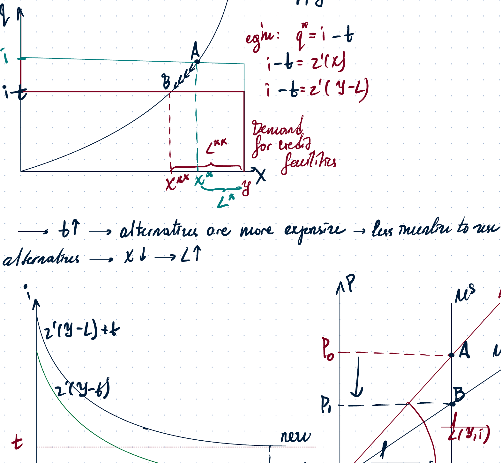
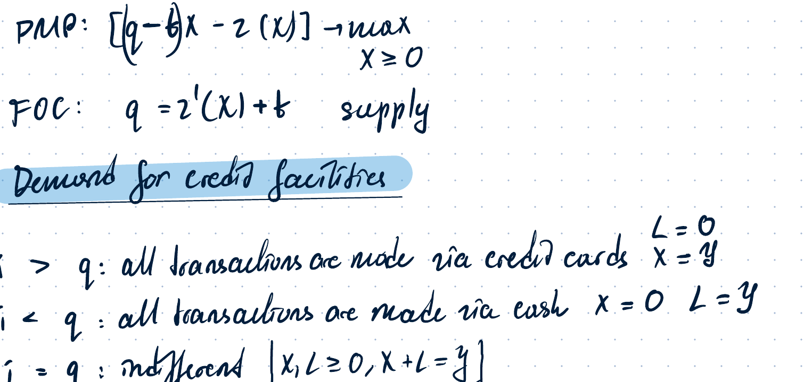
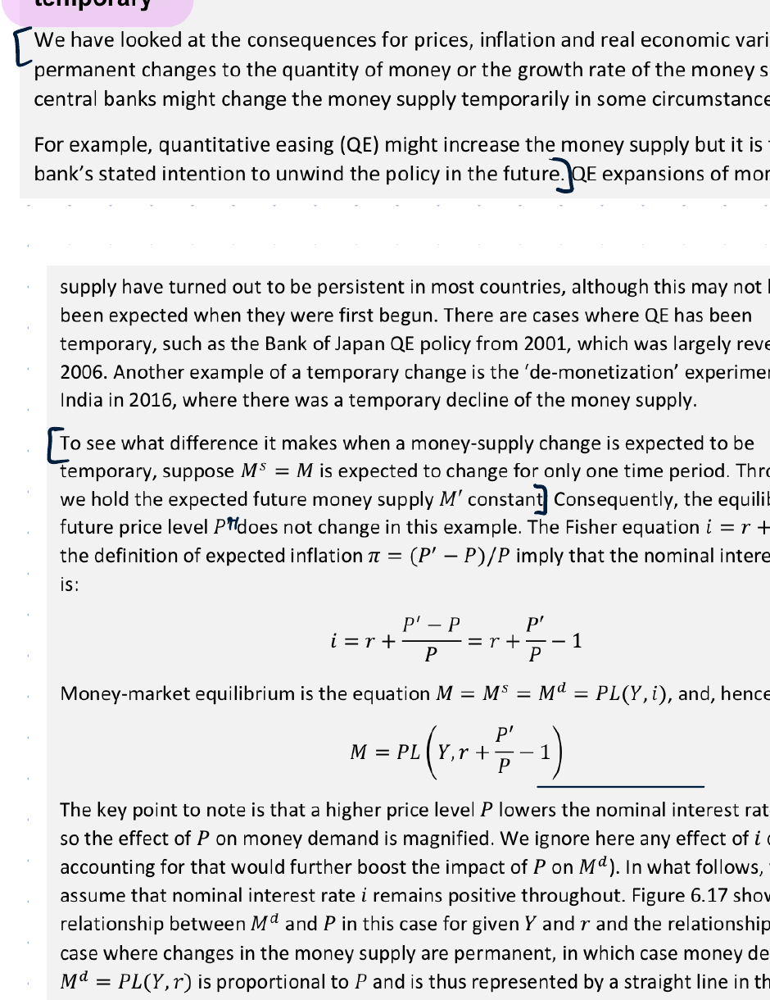
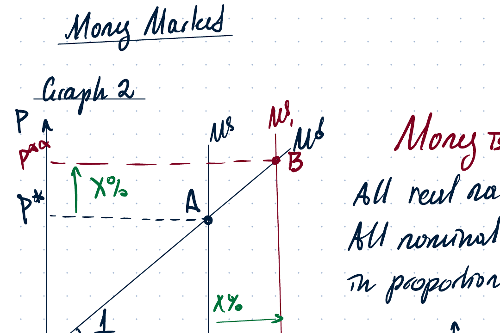
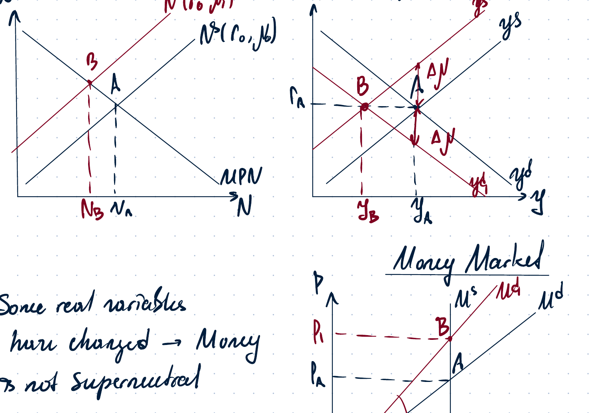
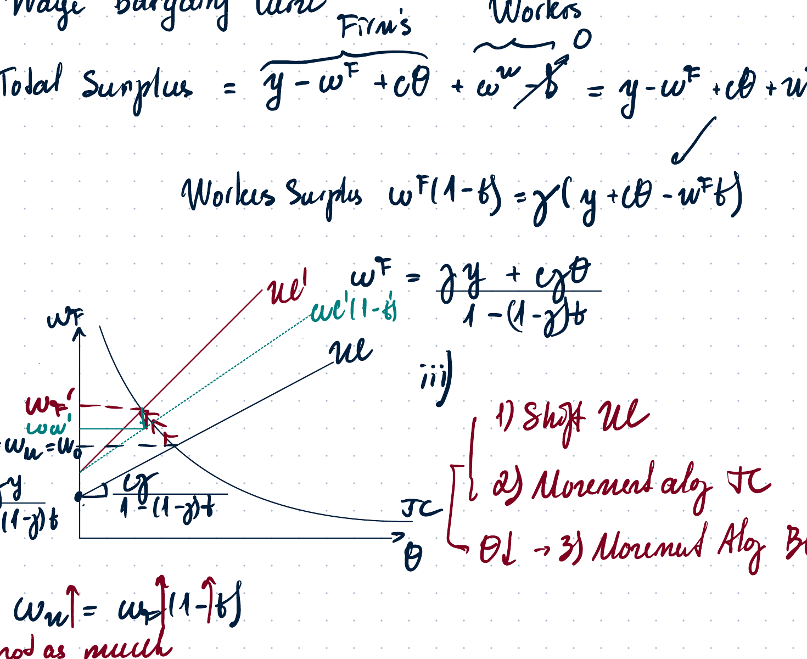

# Week 8 - Money Market

## Page 1 - Nominal dynamic general equilibrium and the money market

### Nominal dynamic GE model

The real dynamic GE model is extended by adding the **money market**.

Markets:

- Goods market / output market
- Labour market
- Bond market
- Money market

**Walras' law:** if the labour market and output market are in equilibrium, then the bond market is also in equilibrium.

### Money market equilibrium

Money market equilibrium is defined as:

$$
\text{Real money demand} = \text{Real money supply}.
$$

The notation in the lecture notes is:

$$
y = L + x,
$$

where:

- $y$ = real value of transactions;
- $L$ = real money holdings;
- $x$ = effort to economise on money holdings / use alternatives to money.

Real money supply is:

$$
\frac{M^s}{P},
$$

where $M^s$ is usually exogenous. A more detailed explanation of money supply is deferred to the next part of the lecture.

There are two approaches to modelling $x$ and $L$:

1. effort to economise on money by holding bonds instead of money;
2. alternatives to money, for example credit cards.

### Approach 1: effort to economise on money

This approach interprets $x$ as the effort used to reduce money holdings.

- Marginal benefit from economising on money holdings:

$$
MB = i.
$$

- Marginal cost of economising:

$$
MC = z'(x),
$$

where $z(x)$ is the shoe-leather cost function.

---

## Page 2 - Shoe-leather costs and money demand

Shoe-leather costs are the opportunity costs of money economising.

The cost function satisfies:

$$
z(0)=0, \qquad z'(x)>0, \qquad z''(x)>0.
$$

The household economises on money up to the point where marginal benefit equals marginal cost:

$$
MB = MC, \qquad i = z'(x).
$$

The real money demand implied by this approach is:

$$
L = y - x.
$$

Comparative statics:

- If $i \uparrow$, the marginal benefit from economising rises, so $x \uparrow$ and $L \downarrow$:

$$
i \uparrow \Rightarrow MB \uparrow \Rightarrow x \uparrow \Rightarrow L \downarrow.
$$

- If $y \uparrow$, more transactions are made, so more money is needed:

$$
y \uparrow \Rightarrow L \uparrow, \qquad L_y>0.
$$

Money is treated as a normal good.

- If $x$ changes only because of the interest rate, then $\Delta x \ne 0$.
- If output/transactions rise, this raises money demand.

### Approach 2: alternatives to money

In the second approach, $x$ is the use of an alternative to money, such as credit cards.

**Supply of credit facilities** is decided by commercial banks.

Commercial banks solve a profit-maximisation problem:

$$
\max_{x \ge 0} \left[qx - z(x)\right],
$$

where:

- $q$ = fee / price of credit facilities;
- $z(x)$ = resource cost of creating credit facilities.

The resource cost may include:

- monitoring;
- screening;
- debt collection.

The FOC is:

$$
q = z'(x),
$$

and the SOC is:

$$
-z''(x)<0.
$$

Thus the supply of credit facilities is upward-sloping.

---

## Page 3 - Demand for credit facilities

Demand for credit facilities is decided by the private sector.

Interpretation of $q$ and $i$:

- $q$ = cost of using credit;
- $i$ = cost of using money / opportunity cost of holding money.

The household compares the cost of using credit and cash.

Cases:

$$
\begin{cases}
i>q: & \text{all transactions are made via credit, so } x=y,\ L=0,\\[2mm]
i<q: & \text{all transactions are made via cash, so } x=0,\ L=y,\\[2mm]
i=q: & \text{the household is indifferent; } x\in[0,y],\ L=y-x.
\end{cases}
$$

Equilibrium in the market for credit facilities:

$$
q^* = i, \qquad i = z'(x^*), \qquad i = z'(y-L).
$$

An increase in demand for credit facilities means more incentive to use an alternative to money. Then:

$$
x \uparrow \Rightarrow L \downarrow.
$$

---

## Page 4 - Money market equilibrium graphs

Money market equilibrium can be represented in two ways.

### Graph 1: real quantity of money

The vertical axis is $i$ and the horizontal axis is the real quantity of money $M/P$.

Money demand condition:

$$
i = z'(y-L),
$$

where:

$$
L = \frac{M}{P}.
$$

At equilibrium:

$$
i = z'\left(y-\frac{M}{P}\right).
$$

Because $z''>0$, higher real money balances reduce $x=y-L$, so the money demand curve is downward-sloping in $(i,M/P)$ space. There is a lower bound at $i=0$.

### Graph 2: nominal money and the price level

The vertical axis is $P$ and the horizontal axis is nominal money $M$.

Money demand in nominal terms:

$$
M^d = P L(y,i).
$$

At equilibrium:

$$
M^s = P L(y,i).
$$

Therefore:

$$
P = \frac{M^s}{L(y,i)}.
$$

The slope of the money-market relation in $(P,M)$ space is:

$$
\frac{dP}{dM} = \frac{1}{L(y,i)}>0.
$$

---

## Page 5 - Cash-in-advance constraint

### Cash-in-advance constraint (CIA)

Households receive the nominal wage at the **end** of the period, but they make transactions from the **beginning** of the period.

Possible solutions:

1. use credit and pay fee $q$;
2. convert interest-bearing assets into cash, losing interest $i$.

In Approach 2, equilibrium implies:

$$
q=i.
$$

At the beginning of the period, a household takes credit which must be repaid at the end of the period using nominal wage income.

If nominal repayment is $B(1+i)$, then the real purchasing power is:

$$
\frac{B(1+i)}{P}.
$$

Equivalently, the same nominal wage buys less real consumption:

$$
\frac{W}{P(1+i)} < \frac{W}{P}.
$$

Economic interpretation:

$$
i \uparrow \Rightarrow \text{purchasing power of wages} \downarrow.
$$

Effects:

- current leisure becomes relatively cheaper;
- substitution effect: $\ell \uparrow$, so labour supply $N^s \downarrow$;
- wealth/transfer effects are ignored in the basic notes;
- economic activity falls.

The nominal interest rate acts like an **implicit tax on economic activity**, similar to a proportional wage tax. This is a distortionary tax.

Government obtains extra revenue from money printing. This is **seigniorage**.

---

## Page 6 - Seigniorage and Class 8 Problem 1

Government seigniorage revenue is written as:

$$
SE = \frac{\Delta M}{P} + i\frac{M}{P}.
$$

The notes decompose this as:

$$
SE = \frac{M^{new}-M}{P} + i\frac{M}{P}.
$$

If money grows at rate $\mu$ and $M/P=L(y,i)$, then approximately:

$$
SE = L(y,i)\,\mu + iL(y,i).
$$

The seigniorage Laffer curve is hump-shaped:

- at $i=0$, seigniorage is zero;
- as $i$ rises, revenue initially rises;
- for very high $i$, real money demand $L(y,i)$ tends to zero, so seigniorage falls.

### Class 8 Problem 1

**Problem statement.** Consider a model of money demand discussed in the lecture. Suppose the credit cards are taxed at rate $t$ per dollar while holding notes is not taxed. What are the effects on money demand and the price level? Illustrate using three graphs: one in $q-x$ space, one in $i-M/P$ space, and one in $P-M$ space.

#### Case 1: household pays the tax

Supply for credit facilities is unchanged because commercial banks do not pay the tax.

Bank PMP:

$$
\max_{x\ge 0} [qx-z(x)].
$$

FOC:

$$
q=z'(x).
$$

Demand for credit facilities:

$$
\begin{cases}
i>q+t: & \text{all transactions are made via credit cards},\\
i<q+t: & \text{all transactions are made via cash},\\
i=q+t: & \text{indifference.}
\end{cases}
$$

So the household compares $i$ with the full cost $q+t$.

Equilibrium condition becomes:

$$
i = z'(x)+t.
$$

Equivalently:

$$
z'(y-L)+t=i.
$$

Therefore the real money demand schedule shifts so that, for a given $i$, less credit is used and more money is demanded:

$$
t\uparrow \Rightarrow x\downarrow \Rightarrow L\uparrow.
$$

Since money market equilibrium is:

$$
M^s=P L(y,i),
$$

for a given nominal money supply $M^s$:

$$
L\uparrow \Rightarrow P\downarrow.
$$

---

## Page 8 - Case 2: commercial bank pays the tax

If the commercial bank pays the tax, then the supply condition changes.

Bank PMP:

$$
\max_{x\ge 0} [(q-t)x-z(x)].
$$

FOC:

$$
q=z'(x)+t.
$$

Demand for credit facilities remains:

$$
\begin{cases}
i>q: & \text{all transactions are made via credit cards},\\
i<q: & \text{all transactions are made via cash},\\
i=q: & \text{indifference.}
\end{cases}
$$

Equilibrium condition:

$$
i=z'(x)+t.
$$

Thus the same final condition holds as in Case 1:

$$
z'(y-L)+t=i.
$$

The tax raises the effective lower bound/cost of using credit and increases money demand.

---

## Page 9 - Temporary increase in money supply

**Problem statement.** Suppose the Central Bank announces a temporary increase in money supply. According to Fig. 6.17 from the UoL Subject Guide, this results in a different shape of the money demand curve compared with a permanent change. Explain the reason.

The notes use the Fisher equation:

$$
1+i=(1+r)(1+\pi),
$$

or approximately:

$$
i \approx r+\pi.
$$

More exactly:

$$
i = r+\pi+r\pi.
$$

Inflation is defined by:

$$
\pi = \frac{P_{t+1}-P_t}{P_t}
      = \frac{P_{t+1}}{P_t}-1.
$$

So:

$$
i = r + \frac{P_{t+1}}{P_t}-1.
$$

If a rise in money supply is **temporary** and the announcement is credible, then the future price level is expected to remain constant:

$$
P_{t+1}=\text{constant}.
$$

Then current money supply affects current prices, and the nominal interest rate changes through expected inflation/deflation. This makes the money demand curve different from the permanent-change case.

---

## Page 10 - Nominal dynamic GE model and monetary shocks

### Nominal dynamic GE model

Markets:

- money market;
- labour market;
- output market.

These are affected by the cash-in-advance constraint.

A monetary shock can be analysed similarly to a real GE shock, but with money market effects included.

### Shock 1: one-time change in nominal money supply

A one-time increase in nominal money supply means:

$$
M^s_t \uparrow.
$$

Assumptions in the notes:

- money supply increases today;
- future growth rate of money supply is unchanged:

$$
\mu = \text{constant};
$$

- this is a permanent change in the **level** of $M^s$, not a change in its growth rate.

This is not standard quantitative easing, because it is not a continuous asset-purchase programme but a one-time increase in the money stock.

---

## Page 11 - Example: one-time increase in money supply

Example from notes:

$$
\mu=20\%.
$$

Before the shock:

$$
M_0=100, \qquad M_1=120, \qquad M_2=144.
$$

After a one-time increase:

$$
M_0=110, \qquad M_1=110\cdot 1.2, \qquad M_2=110\cdot 1.2^2.
$$

Since the growth rate $\mu$ is unchanged:

$$
\Delta \mu=0.
$$

In the long run, money demand is stable. Therefore:

$$
\Delta i=0, \qquad \Delta \pi=0.
$$

There is no change in the implicit tax on economic activity, since money remains as good a store of value as before.

### Labour market

Labour demand:

$$
N^d: \quad zF_N(K,N)=w,
$$

unchanged.

Labour supply is decided by the household through the UMP. The MRS condition is unchanged, and there is no change in labour supply:

$$
\Delta N^s=0.
$$

Therefore:

$$
\Delta N=0, \qquad \Delta w=0.
$$

### Output market

Output supply:

$$
y^s=zF(K,N).
$$

Since $K$, $z$, and $N$ are unchanged:

$$
\Delta y^s=0.
$$

Output demand:

$$
y^d=C+I+G.
$$

Given that real variables are unchanged, $y$ and $r$ remain unchanged.

---

## Page 12 - Money neutrality

Money market condition:

$$
M^s = P L(y,r+\pi).
$$

If the one-time change in money supply is permanent in level but does not change money growth, then:

$$
\Delta y=0, \qquad \Delta r=0, \qquad \Delta \pi=0.
$$

Hence:

$$
\Delta L=0.
$$

Therefore $M^s$ and $P$ move proportionally:

$$
M^s \uparrow \Rightarrow P \uparrow \text{ proportionally.}
$$

### Money is neutral

Money is neutral if a permanent change in the level of money supply, with growth rates constant, does not affect real variables:

$$
\Delta y=\Delta c=\Delta I=\Delta G=\Delta r=\Delta w=0.
$$

Only nominal variables change proportionally with $M^s$:

$$
W^n = P w, \qquad \bar{w}=\frac{W^n}{P}.
$$

---

## Page 13 - Money, prices, and superneutrality

Assume:

- economy is in steady state;
- money demand is stable;
- TFP is constant;
- money is neutral.

If money is neutral, then real variables are unchanged:

$$
\mu_y=\mu_c=\mu_I=\mu_r=\mu_w=0.
$$

Money market:

$$
\frac{M_t}{P_t}=L(y,r+\pi).
$$

If real money demand is constant, then:

$$
\frac{M_{t+1}}{M_t}=\frac{P_{t+1}}{P_t}=1+\mu.
$$

Therefore:

$$
\pi = \mu.
$$

### Money is superneutral

Money is **superneutral** if a permanent change in the growth rate of money supply does not affect real variables.

### Shock 2: permanent increase in growth rate of money supply

The shock is:

$$
\Delta \mu>0,
$$

with no change in the current level of money supply.

Example from notes:

Before shock, $\mu=20\%$:

$$
M_0=100, \quad M_1=120, \quad M_2=144.
$$

After shock, $\mu=30\%$:

$$
M_0=100, \quad M_1=130, \quad M_2=169.
$$

This raises expected inflation and the nominal interest rate:

$$
\mu \uparrow \Rightarrow \pi \uparrow \Rightarrow i \uparrow.
$$

Higher $i$ is a higher implicit tax on economic activity, because money becomes a worse store of value.

---

## Page 14 - Effects of higher money growth

### Labour market

Labour demand is unchanged:

$$
N^d: \quad w=MPN.
$$

Labour supply changes. Higher inflation / nominal interest rate reduces the real purchasing power of wages:

$$
i \uparrow \Rightarrow \text{real wages lose purchasing power}.
$$

Current leisure becomes relatively cheaper, so households choose more leisure:

$$
\ell \uparrow \Rightarrow N^s \downarrow.
$$

Employment falls:

$$
N \downarrow.
$$

### Output market

Output supply:

$$
y^s=zF(K,N),
$$

shifts left because employment decreases:

$$
N\downarrow \Rightarrow y^s\downarrow.
$$

Output demand:

$$
y^d=C+I+G.
$$

Cash-in-advance makes current consumption relatively more expensive, so consumption demand falls:

$$
C \downarrow \Rightarrow y^d \downarrow.
$$

For a permanent shock, the notes use the simplest case where the demand and supply shifts are of similar size:

$$
|\Delta y^d| \approx |\Delta y^s|, \qquad \Delta r \approx 0.
$$

### Money market

Money market condition:

$$
M^s=P L(y,r+\pi).
$$

Current $M^s$ is unchanged. Since $y\downarrow$ and $i=r+\pi\uparrow$, fewer transactions are made and households have more incentive to economise on money or use alternatives:

$$
y\downarrow \Rightarrow L\downarrow, \qquad i\uparrow \Rightarrow L\downarrow.
$$

Therefore, for unchanged $M^s$:

$$
L\downarrow \Rightarrow P\uparrow.
$$

---

## Page 15 - Graphical summary: higher money growth

The three graphs show the effect of a permanent increase in the money growth rate:

1. **Labour market:** labour supply shifts left, employment falls, real wage rises/moves according to the new intersection.
2. **Output market:** both output supply and output demand shift left; output falls. In the simple case, the real interest rate does not change much.
3. **Money market:** money demand falls, while nominal money supply is unchanged; the price level rises.

Since some real variables change, money is **not superneutral**.

---

## Page 15-16 - Home Assignment 8 comments: tax on labour in the two-sided search model

**Problem statement.** Consider a two-sided search model of unemployment without unemployment benefits.

1. Assume the government taxes firm revenue so that the worker gets only:

$$
w^w=w^f(1-t),
$$

where $w^f$ is the wage paid by firms and $w^w$ is the after-tax wage received by workers. Unemployment benefits are not taxed. Analyse the effect of an increase in $t$.

2. Now assume workers have some bargaining power and the tax is paid by firms instead. Analyse the effect and explain how the tax changes bargaining.

The standard two-sided search equations used in the notes:

Beveridge curve:

$$
su+\mu m(u,v)=s.
$$

Wage bargaining curve:

$$
w=\gamma(y-b)+b+c\theta.
$$

Job creation curve:

$$
w^f=y-\frac{c(r+s)}{q(\theta)}.
$$

### Worker tax wedge

With a tax wedge:

$$
w^w=w^f(1-t).
$$

In the wage-bargaining part, the worker surplus is based on the after-tax wage, while the firm's cost is based on the wage paid by the firm.

The notes derive a modified bargaining relation of the form:

$$
w^f = \frac{\gamma y + c\theta\gamma}{1-t+\gamma t}
\quad \text{(with }b=0\text{ in the simplified notes).}
$$

Graphical effects listed in the notes:

1. shift of the wage bargaining curve;
2. movement along the job creation curve;
3. decrease in labour market tightness $\theta$.

---

## Page 17 - Home Assignment 8, Problem 2: credit cards and inflation

**Problem statement.** Consider an economy where transactions $y$ must be paid for by holding cash or by using credit cards. The real value of transactions carried out with credit cards is denoted by $x$. Credit services are provided competitively with supply function:

$$
x^s(q)=\frac{\sqrt{q}}{3}.
$$

Monetary policy sets the growth rate $\mu$ of the supply of money. Assume that real $y$ and the real interest rate $r>0$ are independent of monetary policy. The equilibrium condition is:

$$
\pi=\mu.
$$

Tasks:

(a) set up the optimisation problem and derive algebraically the demand for credit facilities;

(b) find equilibrium in the market for credit facilities;

(c) calculate the social cost of inflation by subtracting total gains from printing money / total seigniorage revenue from the foregone interest and resource cost of providing $x$;

(d) suppose currently $\mu>0$ and the Central Bank will not change the money policy. A private company can introduce more efficient credit facilities. The supply curve changes to:

$$
x^s(q)=\sqrt{q}.
$$

Produce the algebraic solution and show graphically the impact on credit facilities.

### Notes written under the problem

Supply:

$$
x^s(q)=\frac{\sqrt q}{3}.
$$

The bank/credit-card provider supply condition can also be written generally as:

$$
q=z'(x).
$$

Household problem:

$$
\max_{x\in[0,y]} ix-qx.
$$

If there are no derivatives / no interior marginal condition, use the corner-choice logic from the credit-card model:

$$
\begin{cases}
i>q: & x=y,\\
i<q: & x=0,\\
i=q: & x\in[0,y].
\end{cases}
$$

For part (c), social cost is written as:

$$
SC = \left[\text{foregone interest} + z(x)\right] - SE.
$$

The handwritten note says: use your findings from part (b) and compare the initial credit-facility supply with the improved one.
