# Week 9 - DD, Money Market

## 1. Real money demand: two approaches

There are two approaches to finding real money demand:

1. $X$ as an **incentive to economise** on money holdings.
2. $X$ as an **alternative to money**.

In the notes, $X$ is interpreted as a money alternative, such as credit cards or other cashless payment technologies.

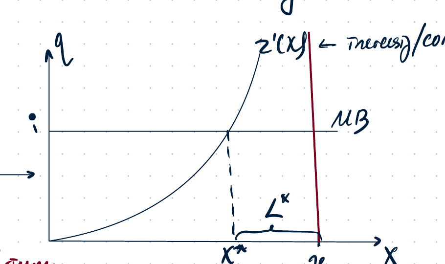

The equilibrium condition is:

$$
q^* - i = z'(x^*) = z'(y-L^*) .
$$

If money pays interest, the opportunity cost of holding money is reduced:

$$
q^* - i^m = z'(x^*) .
$$

If money does not pay interest, then $i^m=0$ and:

$$
q^* = i = z'(x^*) .
$$

## 2. Pareto-efficient monetary policy and the Friedman rule

The Pareto-efficient, or Pareto-optimal, monetary policy equates social marginal benefit and social marginal cost:

$$
SMB = SMC .
$$

The social marginal benefit of holding money is:

$$
SMB = z'(x).
$$

The idea is that society does not face the resource cost of creating money alternatives when wealth is held in cash form. The social marginal cost of holding money is:

$$
SMC = 0,
$$

because money is costless to create. Hence the Pareto-optimal amount of money alternatives satisfies:

$$
z'(x^{PO}) = 0.
$$

In equilibrium:

$$
z'(x^{eqm}) = q-i.
$$

If $i=0$, then:

$$
q-i=0,
$$

so the equilibrium level of money alternatives equals the Pareto-optimal one:

$$
x^{PO}=x^{eqm}.
$$

Using the Fisher equation:

$$
i = r+\nu,
$$

where $\nu$ is the inflation rate. The Friedman rule requires:

$$
i=0,
$$

so:

$$
\nu=-r.
$$

Thus the optimal monetary policy involves deflation at the real interest rate.

## 3. Cases around the Friedman rule

If $i>0$, then:

$$
z'(x^{PO}) < z'(x^{eqm}),
$$

so:

$$
x^{PO} > x^{eqm}.
$$

There is too much holding of money and too little use of money alternatives in equilibrium. The marginal benefit of using alternatives is still positive.

If $i<0$, then:

$$
z'(x)<0
$$

would be required, which is impossible because $z'(x)\neq 0$ and marginal cost cannot be negative. Therefore the nominal interest rate has a lower bound:

$$
i\neq -\text{negative value}, \qquad i\text{ has a lower bound.}
$$

## 4. Modification 1: storage or security cost of holding money

Suppose holding money has a storage or security cost $h$.

The equilibrium condition becomes:

$$
z'(x)=i+h.
$$

The Pareto optimum is:

$$
z'(x^{PO})=h.
$$

If $i=0$, then:

$$
x^{PO}=x^{eqm}.
$$

The new lower bound is:

$$
i=-h.
$$

Thus, with a storage cost, the nominal interest rate can be negative down to $-h$.

## 5. Modification 2: tax or fee on money alternatives

The notes consider a policy where the central bank imposes a cost on using money alternatives, interpreted as a tax or fee on bank reserves, bank cards, or cashless payment facilities.

Supply of credit facilities is chosen by banks:

$$
\max_{x\ge 0} qx-z(x).
$$

The first-order condition is:

$$
q=z'(x).
$$

Demand for credit facilities is chosen by the private sector. If the user faces an additional fee $a$, the net benefit of using credit facilities is:

$$
NB=(i+a)x-qx.
$$

Therefore:

- If $q<i+a$, all transactions are made via credit cards: $x=y$, $L=0$.
- If $q>i+a$, all transactions are made via money: $x=0$, $L=y$.
- If $q=i+a$, the household is indifferent: $x\in[0,y]$, $L=y-x$.

Equilibrium in the market for credit facilities is:

$$
q=z'(x)=i+a.
$$

The lower bound becomes:

$$
i\ge -a.
$$

A higher $a$ changes the relative attractiveness of credit facilities. In the graph, the demand for money alternatives changes, so the equilibrium real money demand and the price level adjust.

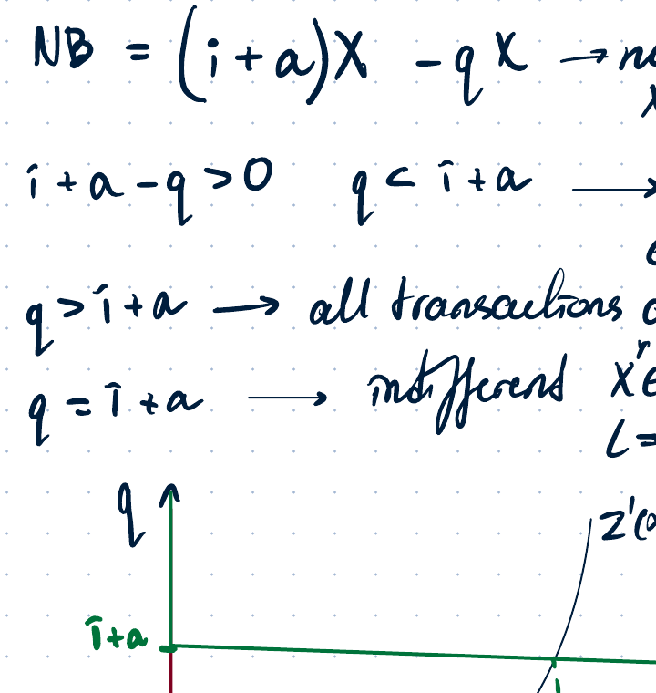

In the money market:

$$
M^d = P\,L(y,i+a).
$$

For the same nominal money supply, a change in $L$ changes the price level:

$$
M^s=P L(y,i+a).
$$

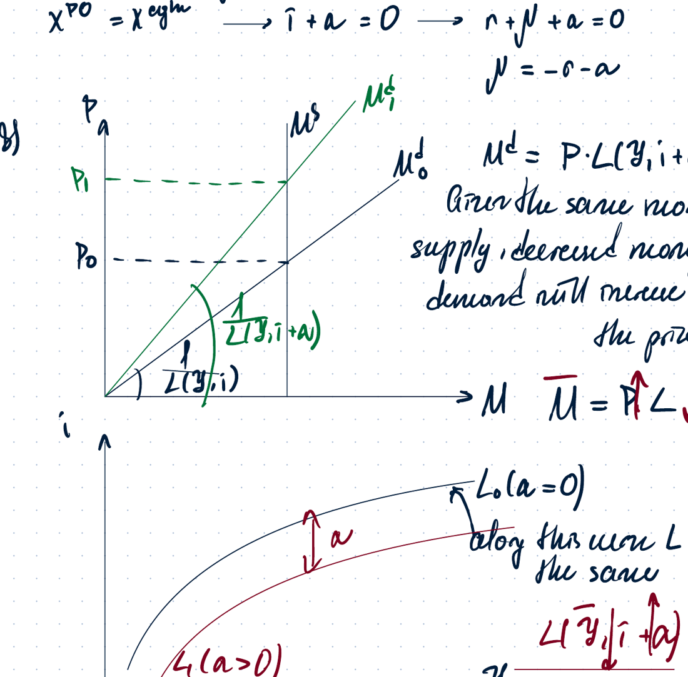

## 6. Modification 3: cash and tax evasion

Cash ownership is not recorded, so cash can be used for tax evasion. Let $a$ denote the benefit from anonymity.

Supply of credit facilities:

$$
\max_{x\ge 0} qx-z(x),
$$

with first-order condition:

$$
q=z'(x).
$$

Demand for credit facilities:

$$
NB=(i-a)x-qx.
$$

Thus:

- If $q<i-a$, all transactions are made via credit.
- If $q>i-a$, all transactions are made via money.
- If $q=i-a$, the household is indifferent.

Equilibrium:

$$
q=i-a=z'(x^*).
$$

The Pareto optimum again satisfies:

$$
SMB=z'(x), \qquad SMC=0, \qquad z'(x^{PO})=0.
$$

At the Pareto optimum:

$$
x^{PO}=x^{eqm} \quad \Rightarrow \quad i-a=0.
$$

Using $i=r+\nu$, the optimal monetary policy is:

$$
r+\nu-a=0,
$$

so:

$$
\nu=a-r.
$$

The new lower bound is:

$$
i\ge a.
$$

The notes state that the marginal benefit from holding money cannot be negative, so the lower bound is shifted upward by the anonymity benefit.

## 7. Modification 4: Gesell tax / tax on money

The problem-set version introduces a tax on money, often called a **Gesell tax**. Cash is subject to a tax $t$: banknotes expire and must be exchanged for new ones every period.

The marginal benefit from holding money is still:

$$
z'(x),
$$

and cannot be negative. The private marginal cost now includes both forgone interest and the tax:

$$
MC=i+t.
$$

Equilibrium:

$$
z'(x)=i+t.
$$

Hence the new lower bound is:

$$
i=-t.
$$

If $i=-t$, there is no demand for bonds or other money alternatives, so equilibrium in the asset market becomes impossible in the usual way.

### Cash-in-advance constraint

The cash-in-advance constraint links the price level, money holdings, and transactions. In this case:

$$
q=i+t.
$$

The purchasing power of wages decreases, so current leisure becomes cheaper and consumption becomes more expensive.

The Pareto optimum is:

$$
SMB=z'(x), \qquad SMC=0,
$$

so:

$$
x^{PO}=x^{eqm}, \qquad i+t=0.
$$

Using $i=r+\nu$:

$$
r+\nu+t=0,
$$

therefore:

$$
\nu=-r-t.
$$

## 8. Liquidity trap of monetary policy

Because of the zero lower bound, conventional monetary policy has limited power.

If:

$$
i=0,
$$

then the opportunity cost of holding money is zero. There is no forgone interest. Money becomes a good store of value, not only a transaction asset. Therefore real money demand becomes perfectly elastic at $i=0$.

This means that if the economy is already at the zero lower bound, an increase in nominal money supply may not change the price level. The notes describe this as:

$$
MP \text{ is useless at the ZLB.}
$$

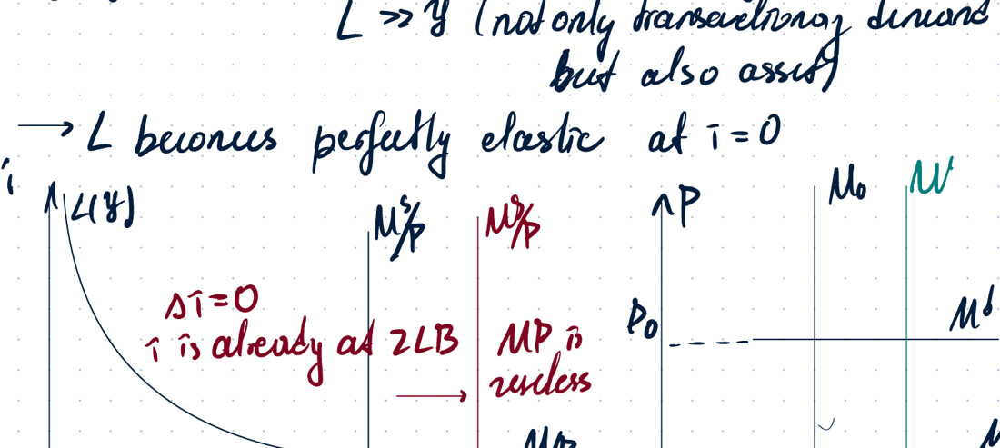

## 9. Temporary money supply increase

The Subject Guide example considers a temporary increase in money supply. If the increase in $M$ is temporary and the commitment is credible, the future price level is constant:

$$
P_{t+1}=\text{constant}.
$$

The true Fisher equation is:

$$
1+i=(1+r)(1+\nu).
$$

Therefore:

$$
i = \frac{P_{t+1}}{P_t}(1+r)-1.
$$

For a temporary money-supply change, the price level reacts less than proportionally because the nominal interest rate and expected inflation channel affect money demand.

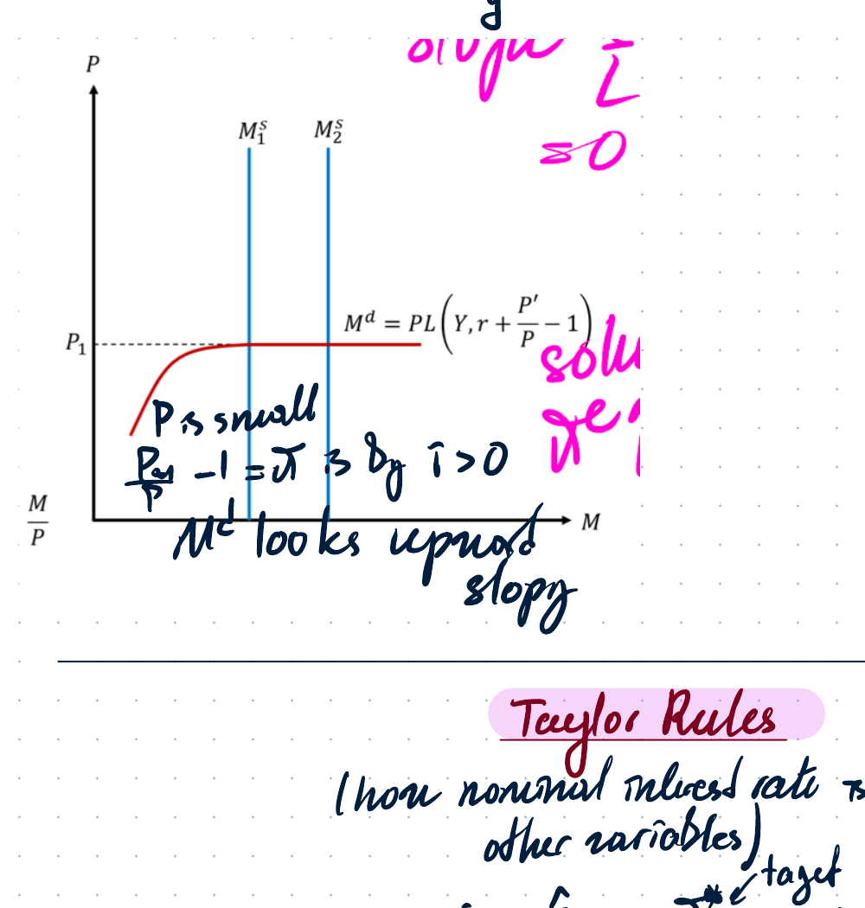

## 10. Taylor rules

A Taylor rule describes how the nominal interest rate is set by the central bank given inflation and other variables:

$$
i=\hat r+\pi^*+\varphi(\pi-\pi^*).
$$

Where:

- $\hat r$ is the central bank's estimate of the equilibrium real interest rate.
- $\pi^*$ is the inflation target.
- $\varphi$ is the central bank's reaction coefficient to deviations of inflation from the target.

The Taylor principle requires:

$$
\varphi>1.
$$

If inflation rises above the target, the central bank should increase the nominal interest rate by more than one-for-one:

$$
\pi\uparrow \quad \Rightarrow \quad i\uparrow \text{ by more than } \pi.
$$

Using the Fisher equation:

$$
i=r+\nu,
$$

and identifying inflation with $\pi$, the steady state satisfies:

$$
r+\pi=\hat r+\pi^*+\varphi(\pi-\pi^*).
$$

If:

$$
\pi=\pi^*,
$$

then:

$$
r=\hat r.
$$

This requires that the central bank accurately estimates the real rate and that financial markets work perfectly.

### Zero lower bound and deflation

If the Taylor rule implies a negative nominal interest rate, the zero lower bound binds:

$$
i=0.
$$

Then:

$$
\hat r+\pi^*+\varphi(\pi-\pi^*)=0.
$$

Solving for inflation gives:

$$
\pi = \pi^* - \frac{\hat r+\pi^*}{\varphi}.
$$

The notes mark the region where the Taylor rule hits the ZLB as a deflationary region.

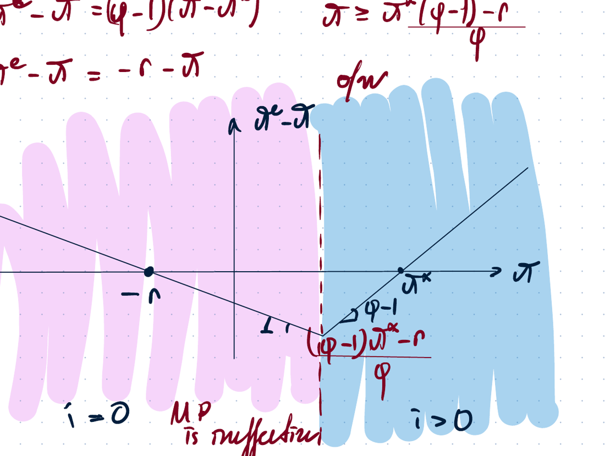

## 11. Diamond-Dybvig model, 1983

The Diamond-Dybvig model explains bank runs and the role of maturity transformation.

**Maturity transformation** is the process where banks take short-term deposits from savers and use them to fund long-term loans to borrowers, effectively converting liquid short-term liabilities into illiquid long-term assets.

There are:

- $N$ individuals.
- Each individual has one unit of wealth.
- Two possible technologies: storage and investment.
- Three time periods.

Timeline:

1. At $t=0$, individuals make an investment decision.
2. At $t=1$, individuals learn their type and decide whether to withdraw.
3. At $t=2$, late types wait until maturity and consume.

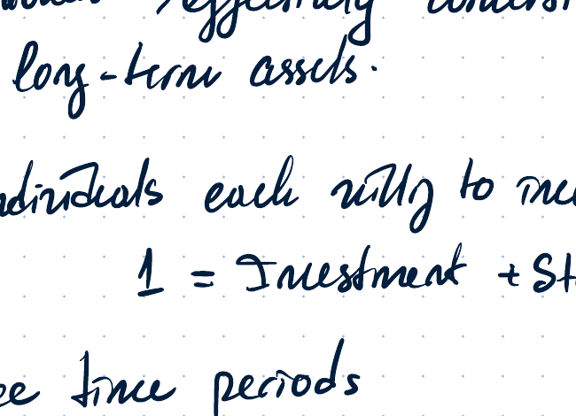

There are two types of individuals:

- Share $\pi$ are **early types**, who want to consume at $t=1$.
- Share $1-\pi$ are **late types**, who want to consume at $t=2$.

At $t=0$, individuals do not know their type. They learn their type at $t=1$.

Investors are risk-averse. Their objective is to maximize expected utility:

$$
EU=\pi u(c_1)+(1-\pi)u(c_2),
$$

with:

$$
u'>0, \qquad u''<0.
$$

The notes ignore the discount factor $\beta$.

Indifference curves are convex in the contingent commodities $(c_1,c_2)$.

## 12. Equilibrium under autarky: no central planner, no financial intermediation

In autarky the economy is self-sufficient. There is no financial intermediation.

If an amount $I$ is invested:

- At $t=1$, the project can be liquidated and gives $I$.
- At $t=2$, the project matures and gives $I(1+R)$.

Storage gives one-for-one return.

The individual chooses $I\in[0,1]$:

$$
EU=\pi u(c_1)+(1-\pi)u(c_2) \to \max.
$$

The constraints are:

$$
c_1=1-I+I=1,
$$

and:

$$
c_2=1-I+I(1+R)=1+RI.
$$

Hence:

$$
EU=\pi u(1)+(1-\pi)u(1+RI).
$$

Since $u'>0$, expected utility is increasing in $I$, so:

$$
I^*=1.
$$

The autarky allocation is:

$$
c_1^A=1,
$$

$$
c_2^A=1+R.
$$

The certain-consumption line is:

$$
\pi \Delta c_1+(1-\pi)\Delta c_2=0,
$$

with slope:

$$
\frac{\pi}{1-\pi}.
$$

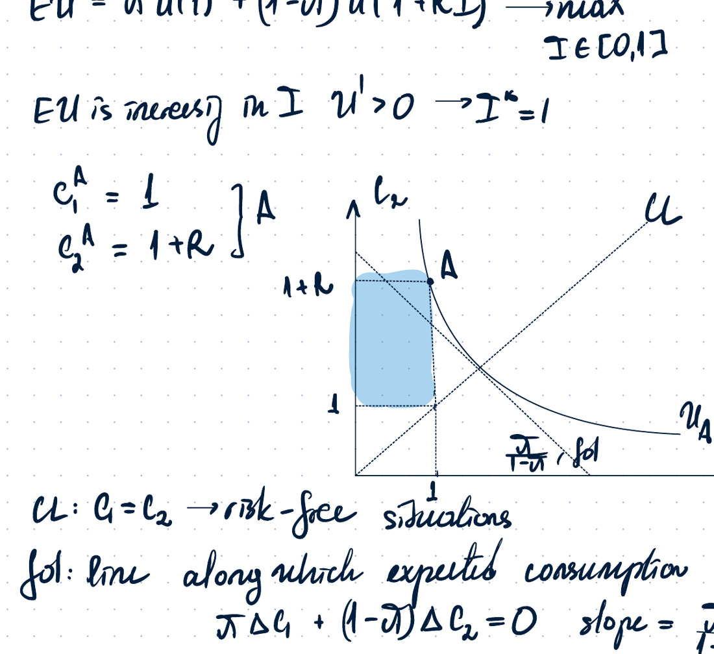

## 13. Pareto-efficient allocation

There is no aggregate uncertainty because the share of early types $\pi$ is known.

The feasibility constraint is:

$$
\pi c_1 + (1-\pi)c_2 = \pi(1-I)+(1-\pi)I(1+R),
$$

or equivalently:

$$
c_2=\frac{(1-\pi c_1)(1+R)}{1-\pi}.
$$

The slope of the feasible constraint is:

$$
\left|\frac{dc_2}{dc_1}\right|=\frac{\pi(1+R)}{1-\pi}.
$$

The Pareto problem is:

$$
\max_{c_1,c_2\ge 0} \pi u(c_1)+(1-\pi)u(c_2),
$$

subject to the feasibility constraint.

The autarky allocation is not Pareto optimal because at bundle $A$ there is no tangency between the feasible constraint and the indifference curve.

The condition for tangency is:

$$
MRS = \frac{\pi(1+R)}{1-\pi}.
$$

At autarky, the marginal rate of substitution does not match the slope of the feasible frontier, so a Pareto improvement is possible.

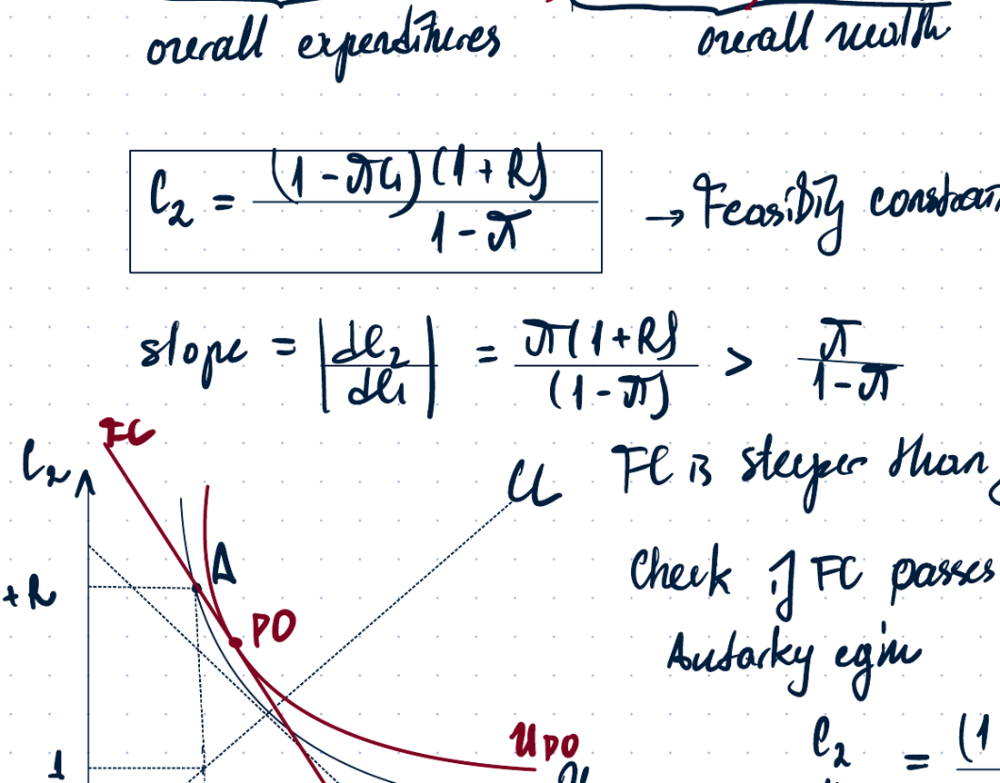

## 14. Equilibrium under trade without banks

There are still no banks, but individuals can sell their project at $t=1$ in a separate market. This market has demand and supply.

- Early types sell the project.
- Late types may buy the project.

If an early type sells, then:

$$
c_1 = 1-I+pI.
$$

If an early type does not sell, then the project is liquidated:

$$
c_1=1.
$$

Supply exists only when:

$$
p\ge 1.
$$

If a late type buys the project, then future consumption is financed by purchasing old investment projects. The notes show that if $I^*=1$, storage is zero, so late types would have to liquidate some of their own projects to buy new units. This is unprofitable when $p\le1$, so there is no demand.

The only possible equilibrium is therefore:

$$
p=1.
$$

The allocation is the same as in autarky:

$$
c_1^T=1,
$$

$$
c_2^T=1+R.
$$

Thus there is no Pareto improvement with trade alone.

## 15. Economy equilibrium with a risk-neutral bank

This section describes the good Nash equilibrium with no bank run.

Households deposit their wealth into a bank. The bank acts as a financial intermediary and invests.

For each unit deposited, the bank can:

- store as reserves;
- invest in the long-term project.

The bank promises:

- $d_1$ to pay to an early type who asks for money at $t=1$;
- $d_2$ if the investor waits until $t=2$.

Expected bank profit is written as:

$$
E\Pi = N[x+(1-x)(1+R)-\pi d_1-(1-\pi)d_2].
$$

The bank chooses the lowest reserve level compatible with payments to early types:

$$
x^*=\pi d_1.
$$

Substitute into profit:

$$
E\Pi=N(1+R-R\pi d_1-\pi d_1-(1-\pi)d_2).
$$

With free entry and perfect competition among banks:

$$
E\Pi=0.
$$

Therefore:

$$
(1+R)(1-\pi d_1)=(1-\pi)d_2.
$$

If the household accepts the contract, then:

$$
c_1=d_1,
$$

$$
c_2=d_2.
$$

Hence:

$$
c_2=\frac{(1+R)(1-\pi c_1)}{1-\pi}.
$$

This is the same as the feasibility constraint. The bank chooses $d_1$ and $d_2$ to maximize household expected utility subject to zero profit.

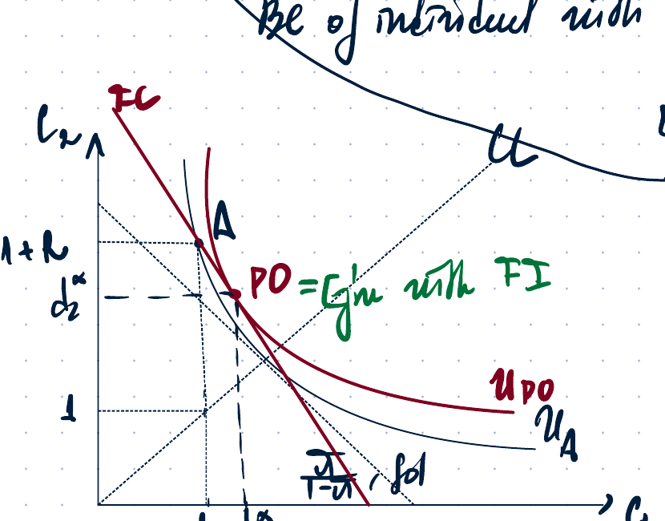

In comparison with autarky:

$$
c_1 \uparrow, \qquad c_2 \downarrow.
$$

The allocation is closer to the 45-degree line, so risk is reduced. Financial intermediaries act like insurance companies.

## 16. Why the bank cares about expected profit

Banks care about expected profit because of entry and competition.

If a contract gives:

$$
E\Pi>0
$$

but does not maximize depositor expected utility, another bank can enter, offer a better contract, and attract all depositors.

If:

$$
E\Pi=0
$$

but a bank can offer a contract that gives higher expected utility and still generates non-negative profit, then that bank can enter.

The final competitive contract must therefore satisfy:

$$
E\Pi=0
$$

and maximize depositor expected utility. Otherwise other banks will enter.

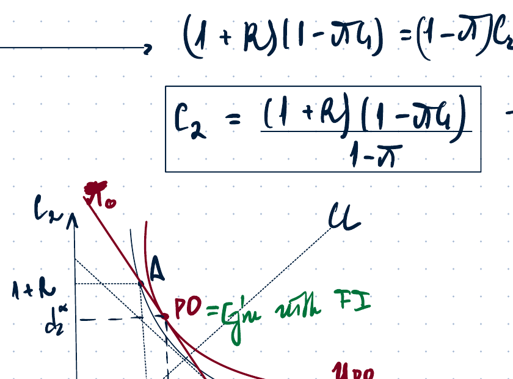

## 17. Bad Nash equilibrium: bank run as a self-fulfilling prophecy

There is also a bad Nash equilibrium with a bank run.

Consider a late type who expects that $N-1$ agents want to withdraw at $t=1$.

The bank needs:

$$
d_1(N-1)=c_1^*(N-1)
$$

to satisfy withdrawal demand.

By terminating all projects plus using storage, the bank can get at most $N$.

If $N$ is large, then:

$$
c_1^*(N-1)>N.
$$

The bank cannot meet all requests and becomes bankrupt.

Therefore the best response of a late type is also to withdraw at $t=1$.

Thus a bank run is self-fulfilling.

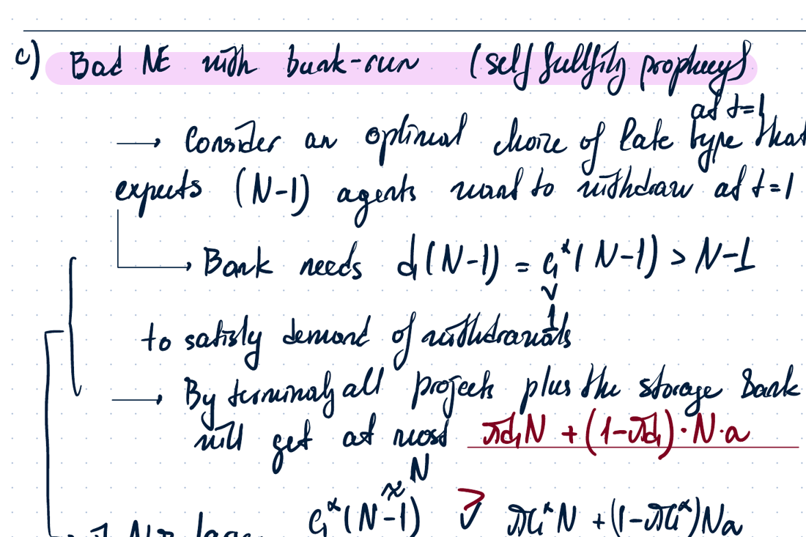

## 18. Class 9 Problem 1: modified Diamond-Dybvig model

The problem considers a slightly modified version of the Diamond-Dybvig model. Suppose there are no banks and that the investment project is liquidated at $t=1$ only for a fraction $\alpha$ of the initial investment, where:

$$
0<\alpha<1.
$$

Banks offer a deposit contract $(d_1,d_2)$ to households, where $d_1$ is delivered in period 1 and $d_2$ in period 2. Consumption is equal to those values:

$$
c_1=d_1, \qquad c_2=d_2.
$$

Tasks in the problem:

1. Derive and illustrate the zero-profit isoprofit line in a diagram.
2. Explain why in equilibrium the bank chooses a contract that maximizes expected utility of a typical depositor subject to non-negative profit, although the bank itself maximizes profit.
3. Find all Pareto-optimal allocations and verify whether the equilibrium found in part (a) is Pareto optimal.
4. Explain why a bank run, where everyone withdraws in period 1, is also an equilibrium.
5. Suppose the banking contract includes suspension of convertibility: only the first $N\pi$ depositors in line in period 1 can withdraw their deposits. Analyse whether there is still a bank run.

The notes repeat the bad-equilibrium logic: if many agents withdraw at $t=1$, available resources are insufficient, so a late type's best response is to withdraw early as well.which is impossible because $z'(x)\neq 0$ and marginal cost cannot be negative. Therefore the nominal interest rate has a lower bound:

$$
i\neq -\text{negative value}, \qquad i\text{ has a lower bound.}
$$

